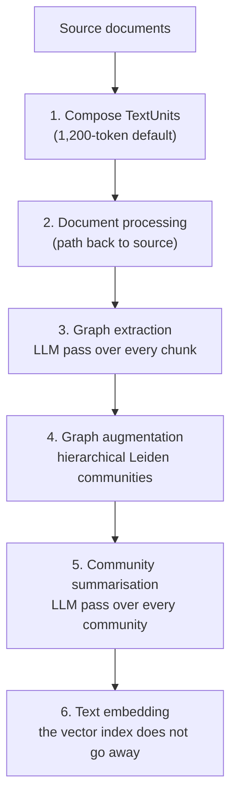

# How the graph gets built, what the schema stack does, and where the query surface sits

[Part 1](./index.md) made three decisions: when structure is worth extracting at all, when a graph earns its
build cost, and what a semantic layer buys once two people disagree about a number. It stayed at the level of
the decision on purpose. This page opens the machinery underneath each one — how an extraction pipeline turns
prose into a graph and what that costs per stage, why the merge step is where these projects actually
disappoint, why the retrieval metrics you already have cannot tell you whether a graph is any good, what the
four standards in the formal stack — RDF, OWL, SHACL, SPARQL — each *do*, and why pointing a model at a
warehouse schema is a harder problem than pointing it at a metric definition. The query surface — the four
graph query methods, text-to-SQL against a semantic layer, and the router in front of both — is the last
third of the page.

One boundary before we start. Everything here is still **static**: the structure is built ahead of the
question, and the question chooses a path through it. The moment the system starts deciding for itself
whether to look again — reformulate, re-retrieve, judge sufficiency — you are in
[agentic RAG](../../part-2-agents/agentic-rag/deep-dive.md), whose loop can call the graph as one more
tool. Part 1's decisions are assumed throughout and not re-argued.

## How a graph actually gets built

Microsoft's GraphRAG is the reference implementation to reason against, because it is the one readers have
heard of and because its pipeline is documented stage by stage. Its
[indexing dataflow](https://microsoft.github.io/graphrag/index/default_dataflow/) runs six phases:

1. **Compose TextUnits** — chunk the source documents. The default unit is 1,200 tokens, which is already a
   design decision: bigger units mean fewer extraction calls and more entities per call, and a worse chance
   the model attributes a relation to the right pair.
2. **Document processing** — the document table, so extracted facts keep a path back to their source.
3. **Graph extraction** — an LLM pass producing **entities**, **relationships** and **covariates**: the
   last of those is GraphRAG's name for a claim attached to an entity, a factual statement carrying its own
   status and time bounds. This is the expensive phase and the one that determines whether anything
   downstream is true.
4. **Graph augmentation** — community detection over the entity graph, producing the communities table.
5. **Community summarisation** — an LLM pass over each community producing **community reports**.
6. **Text embedding** — vectors, because the graph doesn't replace the vector index.

Two details in that list are worth pulling out — one explains why global questions work at all, the other
changes how you would budget the build.

Communities come from the **hierarchical Leiden algorithm**, applied recursively. That word *hierarchical*
is the mechanism behind the whole global-question story: the clustering does not produce one flat partition
but nested levels, so a report exists both for a small tight cluster and for the broader region containing
it. Each report carries an executive overview and references its key entities, relationships and claims.
This is why a corpus-level question has something to read: someone — an LLM, at build time, at your expense
— already wrote the summary.

**Claim extraction** is optional and off by default. The docs are explicit that it "generally requires
prompt tuning to be useful". That is an unusually honest default and a useful signal: the vendor is telling
you that the richest part of the extraction is the part most sensitive to your domain. Anyone quoting you a
graph-build cost from a demo has almost certainly not turned it on.

Now put the phases beside the bill. Phases 3 and 5 are both LLM passes over the entire corpus — one over
every chunk, one over every community. That is what Part 1 meant by pricing extraction like a pass over
everything, and it is why
[LazyGraphRAG](https://www.microsoft.com/en-us/research/blog/lazygraphrag-setting-a-new-standard-for-quality-and-cost/)
exists at all: it defers exactly these passes to query time, and reports indexing costs "identical to vector
RAG and 0.1% of the costs of full GraphRAG". If your global-question volume is low, deferring the work is
the better trade, and that is a design choice available to you rather than a fixed property of graphs.

## GraphRAG's four query methods, and which question each serves

A graph is not one retrieval mode. GraphRAG's [query
methods](https://microsoft.github.io/graphrag/query/overview/) are four distinct paths over the same index,
and choosing between them is most of the engineering:

| Method | Operates over | The question it is for |
|---|---|---|
| **Local search** | the extracted graph **plus** raw text chunks | a specific entity and its neighbourhood |
| **Global search** | all community reports, map-reduce | the corpus as a whole |
| **DRIFT search** | community context folded into local search | a local question that needs broader framing |
| **Basic search** | TextUnits by vector similarity | the plain-RAG baseline, shipped for comparison |

**Local search** still reads the chunks. It "combines relevant data from the AI-extracted knowledge-graph
with text chunks of the raw documents" — the graph supplies structure and the prose still supplies the
evidence. A graph does not free you from good chunking; it sits on top of it.

**Global search** is map-reduce over every community report, and the documentation calls it
"resource-intensive". Each global question fans out across the report set and reduces the
partial answers into one. So the cost of a graph is not only its build: the queries that justified building
it are also the expensive ones to run.

**DRIFT** exists because the local/global split is too clean. It refines a query into follow-up questions
using community context, widening the starting point. That is query decomposition — the technique
[agentic RAG](../../part-2-agents/agentic-rag/index.md) already teaches, applied inside the graph system.
The graph and agentic lines of work keep arriving at the same techniques.

The reference implementation ships plain vector RAG as a first-class query method, explicitly as a
comparison baseline. Whatever you build here, keep the cheap baseline runnable, because the interesting
question is never "does the graph work" but "does the graph beat the far cheaper thing on the questions we
actually get".

## Entity resolution is where graph projects disappoint \{#entity-resolution}

The disappointment is not in any of the phases above.

Extraction gives you `Acme Corp` from one document and `Acme Corporation` from another. Deciding those are
the same node is **entity resolution**, and it is a research field older than any of this — record linkage,
deduplication, the same problem every master-data-management project has fought.

What the popular graph-RAG systems actually do about it is less than most readers assume. A survey of
extraction noise in these pipelines
([*Less is More*](https://arxiv.org/html/2510.14271v1)) reports that systems including Microsoft GraphRAG and
LightRAG lean on **string matching** to merge entities — so entities whose names differ, aliases and
abbreviations among them, stay as separate nodes. The consequence is a graph that looks complete and is
quietly fragmented: everything known about one real-world organisation is scattered across four nodes, and
a traversal from any one of them sees only its own slice.

This has a direct effect on the promise. The "everything we know about this supplier" question — one of the
three questions that opened Part 1 — is precisely the question fragmentation breaks. It breaks it
*silently*, returning a confident partial answer. So when a graph is proposed for entity disambiguation,
understand that you are commissioning entity-resolution work with a graph attached, and budget the resolution
as the primary line item.

The related failure lives one step earlier. Because extraction is an LLM pass, it produces relations no
document states — the same survey notes that incorrect facts in a corpus yield erroneous triples in an
LLM-generated graph. A hallucinated edge is materially worse than a hallucinated sentence in a generated
answer, because it is *persisted*: it enters the index, gets summarised into a community report at phase 5,
and is then cited as structure by every query that touches that neighbourhood.

## Evaluating a graph is not evaluating retrieval

The retrieval metrics you already have do not transfer, and assuming they do is how a bad graph passes.

Recall@K asks whether the right chunk made it into the candidate set. It says nothing about whether
`Acme Corp —[supplies]→ Contoso` is *true*. A graph can score perfectly on chunk retrieval while its
relations are substantially invented, because the chunks are real regardless of what was extracted from
them.

Three measurements do the job, and they are separate:

**Extraction precision, against a labelled sample.** Take a few hundred extracted triples, have a human check
them against their source text, and report the rate. This is the number nobody wants to produce and the only
one that speaks to correctness. Sample the triples by relation type, not uniformly — precision on `mentions`
tells you nothing about precision on `supplies`.

**Resolution quality, separately.** Merge errors come in two directions and they are not symmetric.
Over-merging fuses two real organisations into one node and invents connections that do not exist;
under-merging fragments one organisation and hides connections that do. Report both, because a single
"accuracy" figure lets one hide inside the other.

**End-to-end answer evaluation, on the question types only the graph can serve.** If the graph was justified
by global questions, the evaluation set must be global questions — which means someone has to write ground
truth for "what themes recur across this corpus", a genuinely hard labelling job. The
[evaluation lesson](../cross-cutting/evaluation/index.md) has the machinery for scoring free-form answers,
including the judge and its limits.

The evaluation cost of a graph is not a rounding error on the build cost. It is a second project, and the
one most likely to be cut — which is how organisations end up unable to say whether the graph helped.

## The formal stack, by purpose \{#the-formal-stack-by-purpose}

Everything so far assumes a graph you extract for yourself. The other way structure arrives is that someone
hands you an ontology and asks you to adopt the standards it was built on — a different question with a
different answer.

Four standards come up whenever an ontology is discussed, and they are usually presented as a stack to be
adopted whole. They are better understood as four separate tools, each answering one question. All four are
long-settled W3C Recommendations, and that cuts both ways: this is stable,
interoperable, well-tooled ground, *and* it is why the ecosystem feels unfashionable beside the vector stack.

**RDF — how do I write a fact down?** A statement is a triple: subject, predicate, object. Everything else
here sits on that.

**OWL — what does the vocabulary mean, formally?** [OWL 2](https://www.w3.org/TR/owl2-overview/)
(Recommendation, 2012) is "an ontology language for the Semantic Web with formally defined meaning". The
point is the *formally*: model-theoretic semantics, which is what makes a machine able to derive a fact
nobody wrote down. If you never need an unstated fact derived, you don't need OWL, and that is the single
best test for whether the formal stack is for you.

OWL also answers the "isn't this ruinously expensive to reason over" objection better than most people
expect, because it was designed with that dial. It defines three **profiles** trading expressivity for
tractability: **EL** gives polynomial-time algorithms for all standard reasoning tasks and targets very
large ontologies; **QL** allows conjunctive queries to be answered in LogSpace using standard relational
database technology; **RL** gives polynomial-time reasoning using rule-extended database technology directly
over triples. Picking a profile is a real engineering decision with real consequences, and "we'll use OWL"
without naming one is a decision not yet made.

**SHACL — is this data actually valid?** [SHACL](https://www.w3.org/TR/shacl/) (Recommendation, 2017) is "a
language for validating RDF graphs against a set of conditions". You validate a **data graph** against a
**shapes graph** and get back a **validation report**. This is the piece that matters most for LLM systems
and the piece most often skipped, because it is the deterministic gate over a probabilistic producer: the
extractor proposes, the shapes graph disposes, and the report tells you exactly which constraint failed.
The argument for why such a gate belongs in a pipeline at all is made in
[layered gates](/ai-sdlc/part-3-verification/layered-gates); SHACL is one concrete way to build it.

**SPARQL — how do I ask?** [SPARQL 1.1](https://www.w3.org/TR/sparql11-query/) (Recommendation, 2013)
expresses "queries across diverse data sources, whether the data is stored natively as RDF or viewed as RDF
via middleware", by pattern matching over a directed labelled graph. SPARQL over a *view* of relational
data is a real deployment shape, and it means adopting the query language doesn't require migrating your
storage.

### The schema most teams should build instead

Map those four onto what an LLM pipeline actually needs and the honest default appears: a **JSON Schema**
naming your classes and permitted relation types, plus a **validator** that rejects what violates it. That
gives you the extraction constraint — the `works_for` / `employed_by` problem from Part 1 — and the
deterministic gate. Both pay immediately, with tooling every engineer on the team already knows.

What it does not give you is inference, standards interoperability, or a formally checkable meaning. Those
are the conditions [Part 1](./index.md) sets for climbing to the formal stack, and each is a *reason*, not a
preference. Absent them, the formal stack is a large permanent commitment bought for the benefit a validator
already delivers.

## What text-to-SQL gets wrong, and what a semantic layer removes

Part 1 stated the headline for the metrics layer: against a raw schema a model must **derive** a query,
against a semantic layer it **selects** a defined metric. The difficulty in "derive" is not where people
expect.

Writing syntactically valid SQL is not the hard part; models are good at that. The hard parts are the ones a
schema does not tell you:

- **Which join is the business-correct one.** Two tables may be joinable three ways; only one matches how the
  business counts. The schema permits all three.
- **Which column is the business date.** `created_at`, `updated_at`, `effective_date`, `ordered_at` — the
  data model cannot say which one "last quarter" means.
- **What the values actually look like.** [BIRD](https://bird-bench.github.io/) exists because of this: its
  values "retain their original and frequently 'dirty' format", so a parser must handle non-standard values
  before it can reason. A curated benchmark hides this failure entirely.
- **What the business rule is.** "Active customer" is a predicate somebody decided. It is nowhere in the DDL.

That is why the BIRD numbers sit where they do — **92.96%** for human data engineers against **81.95%** for
the leading system, as reported on the leaderboard in September 2025. The remaining gap is not syntax.
Much of it is the knowledge that lives in people's heads and in a semantic layer.

Which reframes what the layer is. Every metric definition, every declared join path, every legal filter is
one of those decisions *made once, by someone accountable, in a reviewable artefact*. dbt's
[MetricFlow](https://docs.getdbt.com/docs/build/about-metricflow) organises this as semantic models carrying
**entities** (the join keys), **dimensions** (the ways you slice) and **measures** (the quantities), with
metrics defined declaratively on top. [LookML](https://docs.cloud.google.com/looker/docs/what-is-lookml) is
"the language that is used in Looker to create semantic data models": analysts write the model once and the
SQL generator produces the database-specific query.

So the model's job shrinks from *reconstruct the analyst's reasoning* to *pick the right metric and
dimensions*. And the failure changes shape with it: a wrong selection can be displayed to the user — "I
answered using **net revenue**, cut by **region**" — where a subtly wrong join is invisible in a number that
looks plausible.

Two more properties matter for anyone putting an agent in front of this.

**Governance** is enforced at the layer, not requested from the model. Cube's phrasing is that a query "is
validated against the data model and has access policies applied deterministically before reaching the
warehouse" — which is the [retrieval deep dive's](../retrieval/deep-dive.md) cut-before-the-search rule,
arriving from the structured side. A prompt that asks a model not to look at other regions' data is not a
control; a policy the query cannot bypass is.

**Discoverability** is published by the layer, not guessed at by the model. Cube exposes a **Meta API** so
"AI agents discover what's queryable".
That is the structured analogue of a tool schema, and it removes an entire class of failure where the model
invents a metric that sounds reasonable and does not exist.

## Routing: how the structured paths ship in production

Nothing on this page replaces the pipeline built in Ingestion, Retrieval and Generation. In production the
structured paths sit *beside* it, and something decides which one a question takes:

- lookup and "what does this document say" questions → the vector path, unchanged;
- aggregate and arithmetic questions → the semantic layer;
- corpus-level and neighbourhood questions → the graph, if one was justified;
- questions that need two of these paths → both, plus a synthesis step, which is the largest residual and
  the one nobody has a clean answer for.

That decision is [query routing](../retrieval/deep-dive.md), which the retrieval deep dive already builds —
reuse it rather than inventing a parallel mechanism. The practical warning is that a router is now making a
choice with an expensive wrong answer: sending an aggregate question down the vector path returns a fluent,
sourced, wrong number. Route on question *shape*, keep the classification observable, and treat
misrouting as its own tracked failure mode in the
[observability deep dive](../cross-cutting/observability/deep-dive.md), because it won't look like a
retrieval failure or a generation failure when it happens.

## What to take away

- GraphRAG's build is six phases, two of which are LLM passes over everything — extraction over every chunk
  and summarisation over every community — which is the whole cost story in one sentence. Claim extraction,
  the richest and most domain-sensitive part, is off by default, so demo costs almost never include it.
- Hierarchical Leiden clustering is what makes corpus-level questions answerable: the summary a global
  question reads was written at build time, at your expense.
- Four query methods, not one — local reads chunks too, global is map-reduce and expensive per query, DRIFT
  is query decomposition rediscovered inside the graph, and basic vector search ships as the baseline you
  should keep runnable.
- Entity resolution is where these projects disappoint: the popular systems merge by string matching, so
  aliases fragment silently and "everything about X" returns a confident partial answer. A hallucinated edge
  is worse than a hallucinated sentence because it is persisted, summarised, and then cited as structure.
- Retrieval metrics cannot evaluate a graph — you need extraction precision on a labelled sample, merge
  errors reported in both directions, and end-to-end evaluation on the question class that justified the
  build.
- RDF writes a fact, OWL 2 gives it formal meaning (with EL/QL/RL profiles as the tractability dial), SHACL
  validates data against shapes, SPARQL asks — and needing *derived* facts is the test for whether you need
  any of it. Short of that, a JSON Schema plus a validator delivers the extraction constraint and the
  deterministic gate, which is the benefit most teams are actually buying.
- Text-to-SQL is hard because of business joins, business dates, dirty values and unwritten rules — not
  syntax; a semantic layer turns derivation into selection, makes the wrong answer visible, and applies
  access policy before the warehouse is touched.
- All of this ships beside the vector pipeline behind a router, and misrouting is its own failure class.

**[New terms](../../glossary.md#structured-knowledge)**: TextUnit, graph extraction, covariate / claim
extraction, community detection / hierarchical Leiden, community report, local search, global search,
DRIFT search, over-merging / under-merging, extraction precision, OWL profiles (EL, QL, RL), data graph /
shapes graph, validation report, semantic model, measure / dimension / entity, Meta API.
