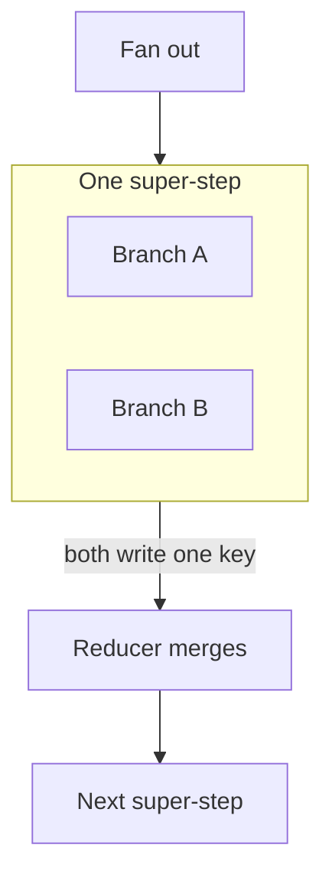

# What a replay costs, and what two branches do to one key

[Part 1](./index.md) argued the ownership question: a checkpointer claims to be the home of run state, a
domain record often already is, and the resolution is to name one authoritative and the other derived, with a
single writer, a projection direction that runs one way, explicit ownership of the schema, and reconciliation
before a resumed run acts. It also separated suspending an open run from reopening a closed one, and priced
the orchestrator you build instead of adopting. This page is the mechanics underneath all of that: where a
replay-safe key gets its value, what defeats such a key, what happens when two parallel branches of one graph
write the same state key, and what the durable execution engines outside AI actually promise.

Two boundaries first, because the neighbouring lessons hold the ground next door. Idempotency as a property of
a **tool** — what a key is, why a write needs one, dry-run and confirm — is [tool use, part
2](../tool-use/deep-dive.md), and this page assumes it rather than repeating it. The checkpointer, threads,
`durability` modes and what an `interrupt()` does to the node it sits in are [orchestration frameworks, part
2](../orchestration-frameworks/deep-dive.md), established there and assumed here. What is new on this page is
the join between them: the tool lesson tells you a write needs a key, and this one tells you **where the
key's value comes from when the caller is a graph that replays**.

## The step is the unit of safety

Start from a mechanical fact and let it do the work. **Durable execution replays at a step boundary.** The
engine's unit of progress is the step: it records that a step finished, and on resume it starts the first step
it cannot prove finished. It does not resume in the middle of a step, because half a step is not a state it
ever recorded.

Everything about safety follows from that granularity. If the replay unit is the step, then the thing that
must not happen twice is scoped to a step, and the key that prevents it must be **stable per step and
different across steps**. Which gives the rule in one line: **derive the idempotency key from run identity
plus step identity.**

This is not an inference from first principles that you have to take on faith. [Temporal documents the pattern
outright](https://docs.temporal.io/activity-definition): to make an activity's side effect safe under retry, build the idempotency key by combining the
**Workflow Run ID** and the **Activity ID**. Read what that combination buys. The Run ID is constant for the
whole execution and different for the next one, so the key is stable across every retry of the same run and
never collides with a different run. The Activity ID distinguishes this step from the others inside that run.
Constant across retries, unique across executions — the two properties a key needs, and both of them come from
identity the engine already has.

The failure mode this rules out is the one that actually ships, and it is a single line of code. A node needs
a key for a payment, a dispatch, a notice, so it mints one:

```python
key = str(uuid.uuid4())  # inside the node that replays
```

Every replay of that node runs that line again and gets a different value. The server sees a new key, decides
this is a new intended operation, and performs it. The dedupe never fires — not because it is broken, but
because it was never given the same key twice. The node is now perfectly idempotent against a *network*
retry, which was the case its author had in mind, and completely unprotected against a *replay*, which is the
case durability introduces. Two similar-looking failures, one key, and only one of them was designed for.

The bill lands in different currencies depending on the step. If it is a model call, the intake from Part 1
re-pays: 12,000 units at 2¢ is $240, and a crash near the end of a run that re-does completed work spends the
whole $240 again to reach the same place. Annoying, and visible on an invoice. If the step is an external
write — dispatching a payment, filing a submission, sending a notice to a person — the same replay does not
cost money, it costs correctness. Someone gets charged twice, or told twice, and no invoice line makes that
visible until they complain.

So the discipline is: the key is an **argument** to the step, derived from identity the engine can reproduce,
not a value the step invents. If you are hand-rolling the loop rather than adopting an engine, you own that
derivation — and it is the single most important thing your bespoke orchestrator has to get right, which is
worth weighing against the pricing in Part 1.

## When step identity moves

The rule has a precondition hiding inside it, and it is where careful teams still get caught: a key derived
from step identity is only as stable as the step identity. **A step whose identity shifts between runs defeats
the key that depends on it.**

The common cause is dynamic fan-out. An agent plans its own work — that is the point of the planning loop —
so the number and order of branches is decided by a model at runtime. Position it and the trouble is obvious:
if a step's identity is "the third parallel branch," and the re-plan on resume produces branches in a
different order or a different number of them, then the third branch is now a different piece of work wearing
the same identity. Two failures follow from one cause. Work that already completed is redone under a key
whose dedupe does not recognise it, and work that never ran inherits a key that was already consumed, so it
is silently skipped.

The defence is to derive step identity from something **the plan cannot renumber**: the content of the work
rather than its position. A stable business identifier for the unit being processed, a hash of the step's
inputs, an id assigned when the item entered the batch — anything whose value is a property of the work, not
of the order the planner happened to emit it in. Then a re-plan can reorder freely and each key still follows
its own work.

Apache Airflow is worth a paragraph here, and precisely as a cautionary tale rather than a model, because it
is the system people most often reach for as an example of naturally-stable step identity. It is not — and its
own documentation is emphatic about it. [Airflow's docs](https://airflow.apache.org/docs/apache-airflow/stable/templates-ref.html) state that the logical date and values derived from it
**"should not be considered unique in a Dag"**, and direct you to **use `run_id` instead**. Airflow 3
([AIP-83](https://cwiki.apache.org/confluence/display/AIRFLOW/AIP-83+Rename+execution_date+-%3E+logical_date+and+make+logical_date+optional)) went further and made `logical_date` **nullable**, adding `run_after` for the scheduling question the
logical date used to be misused for. So the honest stable identity there is `run_id` plus the task id — the
run's own identity and the task's own identity, which is the same shape Temporal prescribes. The lesson
generalises past both products: **do not derive identity from a value that means something else.** A date is a
date. It is not an identifier, however unique it looks in your test data. (Dated to August 2026 — this is a
detail that has already moved once.)

## Fan-out inside one graph

Now the second mechanism, and it lives one level down from anything the multi-agent lessons cover. This is not
several agents in a team and not several tools called in a batch. This is **one graph**, fanning out into
parallel branches that all read and write **one shared state object** — and the question is what happens when
two of them write the same key.

The framework-level fact to hold is [LangGraph's execution model](https://docs.langchain.com/oss/python/langgraph/graph-api). Nodes that run in parallel execute in the
**same super-step**; nodes that run one after another are in separate super-steps. That distinction is the
whole section, because the two situations have different defaults and people generalise from the wrong one.



Take the sequential case first, because it is the one everyone's intuition is built on. Two nodes write the
same key in different super-steps; the second write replaces the first. Replace-on-write, last one wins,
exactly what a dictionary does. Fine, unsurprising, and **not what happens in parallel.**

In the parallel case, two branches in the *same* super-step writing a key with [**no reducer declared**](https://docs.langchain.com/oss/python/langgraph/use-graph-api) raise
**`InvalidUpdateError`**, and the runtime error itself tells you what is missing: *"Can receive only one value
per step. Use an Annotated key to handle multiple values."* It does not pick a winner. It does not quietly
keep the last one. It refuses.

That distinction is worth more than it looks, and blurring the two defaults is a genuinely dangerous mistake —
it is how you **turn a loud crash into silent loss** with a one-line fix. Follow the path. If you already
believe parallel writes are last-write-wins, the `InvalidUpdateError` reads as a nuisance rather than a
question, and the fastest way to make a nuisance go away is to declare a reducer that keeps the last value.
Now the very loss the framework refused to commit happens on every fan-out, and nothing reports it. The
framework's behaviour was the kinder one all along: it stopped and asked you to specify the merge. An
`InvalidUpdateError` in development is the framework doing its job.

The fix is a **reducer**: a function declared on the state key that says how two values combine.
LangGraph [documents two built-ins](https://docs.langchain.com/oss/python/langgraph/use-graph-api) — `operator.add` and `add_messages` — and that is the documented list, not
a sample from a catalogue. `operator.add` concatenates, which is what you want when each branch contributes
items to a list. `add_messages` handles conversation history with its own id-aware semantics. Anything else is
a function you write, and writing one is the normal case rather than an advanced move.

## The merge you have to specify

Declaring a reducer moves the decision from the framework to you, and that is where the *silent* failure
actually lives.

The loud case is settled: no reducer, parallel writes, `InvalidUpdateError`, you fix it. The quiet case is a
reducer you **specified** that discards. Write a merge function whose body amounts to "take the last value"
and the graph runs green forever while one branch's findings are dropped on every fan-out. Nothing raises,
because you were asked what the merge should be and this is the answer you gave. Both branches did their work,
both paid for their model calls, and one result went into the bin — and it is not even reliably the same
branch, which is what makes the bug so unpleasant to reproduce.

So treat the reducer as a **semantic** decision about your data, not a syntactic requirement to make an error
go away. Are these results a set that should be unioned, a list that should be concatenated, competing
answers where one wins by a rule you can state, or genuinely conflicting facts where the honest merge is to
keep both and flag the conflict? Answer that question in the domain first. Only then write the function.

Ordering is the second thing to specify, and here the framework's own words are the ones to use, because they
are narrower than the ones people reach for. [LangGraph's documentation](https://docs.langchain.com/oss/python/langgraph/use-graph-api) says updates from a parallel super-step
**"may not be ordered consistently"**, and prescribes a specific fix: write the outputs to a separate field
with a value to order by, and sort them yourself downstream. The right reading is not that the framework is
unpredictable; it is that **ordering is not part of the contract**, so if you need an order, you must carry
the thing you order by. If your reducer is `operator.add` and your downstream node treats position in the list
as meaningful — first result is the primary one, say — you have built a dependency on something nobody
promised you.

Two more settings bite exactly here, and both are documented rather than obscure. First, the [`durability`
setting's default](https://docs.langchain.com/oss/python/langgraph/durable-execution) is **`"async"`**, not `"exit"` — and `"async"` writes the checkpoint in the background while
the next step is already running, which admits a real window in which a process death loses the last write.
It is a reasonable default and it is not the durable one; if you are relying on durability for a step that
costs money, read the mode you are actually running rather than the one the word "durable" implies. Second,
[resume-value matching for `interrupt()`](https://docs.langchain.com/oss/python/langgraph/interrupts) is **strictly index-based** — resume values are matched to interrupts
by position — so a graph that interrupts conditionally or inside a loop can hand a resume value to the wrong
interrupt. Both are the same category of hazard as the merge: a default that is right for the common case and
wrong for the case you happen to be in.

## What the engines settled

Part 1 argued that the durable execution engines make a checkpointer judgeable. Here are the four questions
worth putting to any of them, with what the engines answer.

**What are the delivery semantics of a step?** [AWS Step Functions](https://docs.aws.amazon.com/step-functions/latest/dg/choosing-workflow-type.html) is unusually clear about this because it
has three answers, not two:

| Workflow type | Semantics | What goes wrong |
|---|---|---|
| Standard | exactly-once | — (duration up to one year) |
| Express, asynchronous | at-least-once | a step can run twice |
| Express, synchronous | at-most-once | a step can not run at all |

The third row is the one almost everybody misses, and it has the **opposite risk profile** from the second.
At-least-once is the familiar hazard — duplicated work, which is what idempotency keys are for. At-most-once
means work can be **lost**, and no key protects you from a step that never ran; you need detection and a
redrive instead. Reaching for an idempotency key against an at-most-once engine is solving the wrong problem
carefully. Temporal sits on the [at-least-once](https://docs.temporal.io/develop/python/best-practices/error-handling) side and says so plainly: an activity's completion is
observed once, but the activity itself may be *executed* more than once. That is exactly why the same documentation
hands you the key-derivation pattern from earlier on this page. Idempotency is the caller's job, and the
vendor tells you so in advance rather than in an incident review.

**What does the engine require of my code?** Replay only works if re-running your code reproduces the same
decisions, so Temporal [requires workflow code to be **deterministic**](https://docs.temporal.io/workflow-definition), and a violation **fails the execution
with a nondeterminism error**. That constraint deserves a moment of thought in an LLM context, because a
model call is the least deterministic thing in your system. The reconciliation is that the *model call* is a
step whose result is recorded and replayed, while the *code around it* — the branching, the ordering, the
control flow — must be reproducible. Put a `random()` or a fresh `uuid4()` or a wall-clock read into the
orchestrating code and you have broken replay, which is the same failure as minting a key inside a replaying
node, arriving from the other direction.

**Whose run is this, and what happens if I start it again?** Temporal [splits this into two orthogonal policies
with different defaults](https://docs.temporal.io/workflow-execution/workflowid-runid), and confusing them is a classic misconfiguration. The Workflow ID **Reuse** Policy
governs whether you may start a workflow with an id that a **closed** execution already used — its default is
`AllowDuplicate`. The Workflow ID **Conflict** Policy governs what happens when one is still **open** under
that id — its default is `Fail`. Reading one and assuming the other is how a team concludes their engine will
deduplicate a re-submission and discovers it will not. Note how neatly this maps onto Part 1's distinction:
the Conflict Policy is about suspending and open runs, the Reuse Policy is about reopening a closed one.

**How do I change the code under a running workflow?** This is the question durable execution creates for you:
if runs live for months and replay from history, a deploy can meet a run started against different code.
Temporal's current default recommendation is **[Worker Versioning](https://docs.temporal.io/production-deployment/worker-deployments/worker-versioning)** ([generally available since 30 March 2026](https://temporal.io/blog/ga-worker-versioning-public-preview-upgrade-on-continue-as-new)),
which pins a run to a version of the code. **Patching is not deprecated** — it remains the documented
alternative for the in-place case, and only the older 2023 Build-ID-based approach is. Worth being precise
about, because "use the new thing, the old one is dead" is the usual summary and it is wrong here.

And one operational note that closes Part 1's retention argument. [Express workflows](https://docs.aws.amazon.com/step-functions/latest/dg/choosing-workflow-type.html) record **no execution
history in Step Functions at all** — if you want the history, you send it to CloudWatch Logs yourself. Which
is the vendor stating the same thing this lesson has been arguing: the engine's history is a mechanism for
running, and your record is your responsibility.

## Proving it, rather than claiming it

Everything on this page is a claim about behaviour under failure, and no amount of design discipline makes a
claim true. The test that settles it is to inject the crash rather than wait for it: kill the worker at a step
boundary — specifically in the window after a paid side effect has fired and before the commit that records
it — then resume and assert not that the run completed, but that the side effect happened **exactly once**.
That is a verification technique rather than a design one, it belongs to the AI SDLC course alongside the
other [layered gates](/ai-sdlc/part-3-verification/layered-gates), and it is the natural next thing to reach
for once the design on these two pages is in place.

## What to take away

- **Replay happens at a step boundary, so the step is the unit of safety.** Derive the idempotency key from
  **run identity plus step identity** — Temporal's documented pattern combines the Workflow Run ID with the
  Activity ID, giving a key constant across retries and unique across executions. A key minted inside the node
  that replays is a new key every replay, so the dedupe never fires and the resume re-pays.
- **A step whose identity moves between runs defeats the key that depends on it.** Re-planned dynamic fan-out
  is the usual cause; derive step identity from the work's own content, never from its position. Airflow is
  the cautionary case, not the model: its docs say values derived from the logical date "should not be
  considered unique in a Dag" and point to `run_id` instead.
- **Parallel branches share a super-step, and the defaults differ from the sequential ones.** Two writes to
  one key in the same super-step with no reducer raise `InvalidUpdateError` — a refusal, not last-write-wins.
  Replace-on-write is the *sequential* default, and confusing the two turns a loud crash into silent loss.
- **The reducer is a semantic decision, and it is where the quiet bug lives.** `operator.add` and
  `add_messages` are the documented built-ins; anything else you write. A last-write-wins reducer you declared
  on purpose discards a branch's work with nothing raised. Ordering is not promised — updates "may not be
  ordered consistently," so carry a value to sort by if order matters.
- **The engines' answers tell you what to ask.** Step Functions has three delivery cells, and Express
  synchronous is at-most-once — lost work, the opposite risk from duplication, and no key helps. Temporal is
  at-least-once, demands deterministic workflow code, splits reuse from conflict policy with different
  defaults, and recommends Worker Versioning without deprecating Patching.
- **Defaults are not the safe setting by virtue of being defaults.** `durability` defaults to `"async"`, which
  admits a loss window; `interrupt()` resume values are matched by index, so conditional or looped interrupts
  can mismatch.

**[New terms](../../glossary.md#durable-runs)**: step identity, super-step, reducer / state merge, delivery
semantics (exactly-once / at-least-once / at-most-once), determinism and replay, workflow versioning.
