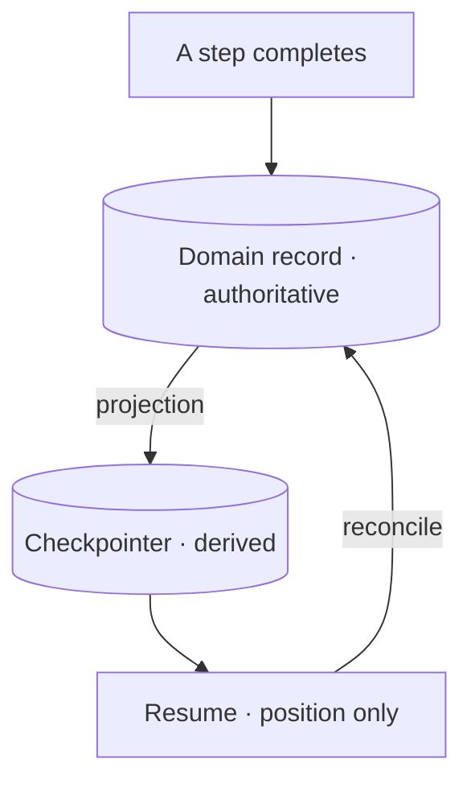

# Who owns the run

The [orchestration frameworks deep dive](../orchestration-frameworks/deep-dive.md) leaves you with a tidy
picture. The graph is the seam; the checkpointer hangs off it and saves state at every super-step; a run that
dies at step 28 resumes from step 28 instead of paying for 27 model calls again. Every sentence of that is
true, and the page stops one question short of the one that decides whether any of it is safe in your system:
**what if something else already owns run state?**

Because usually something does. Not in a notebook, and not in the demo you built to prove the agent works —
but in the system you are actually being asked to put it into, there is a table somewhere that an outside
party reads back to you. A ledger. A case file. A records table with a retention duty attached. It existed
before the agent and it will outlive the framework, and the moment you install a checkpointer next to it you
have two stores that both believe they know what happened.

This lesson is about that collision and the decisions it forces: which store is authoritative, which direction
state flows, what a resumed run has to check before it acts, and what it costs to build the alternative
yourself. The mechanisms — how a replay-safe key is derived, what happens when two parallel branches write the
same state key — are in [part 2](./deep-dive.md). This page is the decision.

One running example carries the whole lesson, and it is deliberately generic. An **intake** is about **12,000
units** — documents, claims, filings, whatever your domain moves in batches. Each unit's run costs roughly
**2¢** in model calls, so an intake is about **$240**. Roughly **one unit in forty** is reopened months
later, when a correction arrives. The record has to be produceable for **fifteen months**. And the only
engineer who has ever debugged the scheduler currently running all of this leaves in **six weeks**. Every
section below is a decision that scenario forces.

## A checkpointer is an ownership claim

Read a framework's persistence documentation as a claim rather than a feature list and it changes shape. The
checkpointer does not offer to remember things for you. It offers to be **the** place run state lives — that
is what "resume from the last successful step" means, and it is the only way the promise can be kept. To know
where to resume, the framework has to be the thing that knows what completed.

That is a perfectly good claim to grant in an empty field. Nothing else records what your agent did, the
checkpointer records it, and durability follows. The trouble starts when the field is not empty.

Now put the intake agent into a real system. Every unit it processes lands in a records table that predates
the agent by years. A regulator can ask, fifteen months out, what happened to unit 7,431 — and the answer has
to come from somewhere. If your answer is "the checkpointer knows," you have just made a framework's internal
persistence format into evidence, and you will discover what that means at the worst possible moment.

Three things follow from that position, and none of them are hypothetical.

The first is **dependency archaeology**. An auditor's question — what did we do with this unit, and when — is
now answered by reading a serialised graph state whose schema belongs to a library you did not write. Someone
has to reconstruct what version of the framework wrote it, what the state object looked like at that version,
and what the field names meant. That is not an audit trail. That is a forensics project with a deadline.

The second is worse, because it is routine. A dependency's **schema migration rewrites evidence.** Checkpoint
formats are internal; they change between versions, and libraries migrate their own storage on upgrade,
because from the library's point of view that storage is a cache of its own working state. It is entirely
correct behaviour. It is also a patch-level bump quietly editing the only record you have of what happened,
and nothing in your test suite will notice, because the run still resumes.

The third is a mismatch you can compute. Engine history is retained for a bounded window, and the window is
usually shorter than a compliance duty and cannot be stretched to fit. [AWS Step Functions](https://docs.aws.amazon.com/step-functions/latest/dg/service-quotas.html) keeps execution
history for **90 days**; you can file a quota request to *reduce* that to 30, and there is no request that
extends it. Against a fifteen-month duty — call it 456 days — the engine's history covers the first fifth of
the obligation and then stops existing. No configuration closes that gap, because the gap is not a
misconfiguration. It is the vendor telling you plainly what the store is for.

So the sentence to carry out of this section is short. The checkpointer is **operational state**: it exists so
a run can continue. It is not an audit record, it is not a system of record, and treating it as one is a
design decision you are making whether or not you notice you made it.

## Two writers, one truth

The resolution is not to distrust the framework. It is to decide, once and explicitly, which store is
**authoritative** and which is **derived** — and then to hold that line in the code rather than in a document
nobody reads.

Authoritative means: if the two disagree, this one is right, and the other one is what gets rebuilt.
Derived means: this can be deleted and reconstructed, and nothing of value is lost. There is no third option
where both are a bit authoritative. Two writers to one truth is the defect — not the framework, not the
database, the *arrangement*.

Four decisions carry that split, and they are worth naming because each one fails differently when it is left
implicit.

**Single-writer discipline.** Exactly one component writes the domain record. Not "the agent writes it and the
reconciliation job fixes it up" — one writer. The moment a second path can write, every consistency argument
you have becomes a race you have to reason about at three in the morning, and the resumed run is precisely the
case where the second path shows up.

**A named projection direction.** State flows from the record to the checkpoint and never the other way. The
checkpointer holds a *projection* of what the record already says — enough to continue a run, no more. When
the direction is unnamed, it becomes bidirectional by accident, one convenience field at a time, and the day
you find out is the day they disagree.

**Ownership of the schema and its migrations.** Somebody on your team owns the record's schema and versions
it deliberately. Nobody on your team owns the checkpoint's schema — the library does, and it will change it
when it likes. That asymmetry is the whole argument for which one holds evidence, and it survives every
framework you might swap to.

**Reconciliation on resume.** A resumed run reads its *position* from the checkpoint and re-derives *what
actually completed* from the record before it acts. The checkpoint says where to stand. The record says what
is already done. A run that trusts the checkpoint for the second question will happily redo work the record
already shows finished — and at $240 an intake, that arithmetic is not academic.

Here is the part that is easy to miss, and it is the load-bearing claim of the whole page: **this split runs
independently of whether you adopt the framework.** Adopt-or-decline and who-owns-the-record are two
different decisions, and people collapse them constantly — "we're using LangGraph, so the checkpointer is our
state" is two conclusions glued together, only one of which was actually reasoned about.

You can adopt the framework wholeheartedly, use its graph, its checkpointer, its interrupts, its whole
apparatus, and still keep the domain record authoritative with the checkpoint as a derived projection. That is
not a compromise position or a half-adoption. It is the arrangement that gets you the framework's resume
semantics *and* an audit trail that outlives the framework, and it is available whichever way the adoption
question goes. Deciding it separately is the point.

## Suspending an open run is not reopening a closed one

There is a second confusion sitting underneath the first, and it is worth pulling apart before you shop for
machinery, because the two problems it merges have different answers.

**Suspending an open run** is what a durable execution engine solves. There is a live run. It is paused —
mid-flight, waiting on a human approval, or stopped by a crash — and its position and working state are held
somewhere so it can continue from where it stood. Something is genuinely waiting. Resume is a real verb here,
and the whole checkpointer apparatus exists to make it work.

**Reopening a closed one** is a different shape entirely. The run finished. The record was written, the case
was closed, and three months later a correction arrives. In our intake, that is the one-in-forty: about 300
units out of every 12,000 come back long after their run ended.

Nothing is waiting. There is no suspended execution to continue, no working state parked mid-flight, no
position to stand at. What there is, is a **retained record** and a reason to act on it again — and the right
shape is a **new linked run over that record**: a fresh execution, carrying a reference to the original, that
reads the retained record as its input and writes its own outcome.

Reaching for the checkpoint here is the error, and it is tempting because the vocabulary encourages it. Both
things get called "resuming the case." But a three-month-old checkpoint is a snapshot of a framework's
internal state, taken by a version of the graph you have since changed, expressed in a schema the library has
since migrated — and even if you could load it, resuming *into* it would restart a run whose world has moved
on. The record is the thing that was designed to be read months later. The checkpoint was not.

The practical test is one question: **is something waiting?** If yes, you have a suspension, and durability is
the mechanism. If no, you have a record and a new reason to act, and what you need is a new run with a link
back — which, incidentally, needs no checkpointer at all.

## The category outside AI

Everything above is easier to argue once you know that none of it is new, and that the field outside AI
settled it a long time ago.

"Durable state at step granularity, with a pause you can resume" is a solved category with a name. [Temporal](https://docs.temporal.io/evaluate/understanding-temporal)
calls it **Durable Execution** and builds a product around exactly that promise. AWS [Step Functions](https://docs.aws.amazon.com/step-functions/latest/dg/choosing-workflow-type.html) is the
managed version of the same idea. [Apache Airflow](https://airflow.apache.org/docs/apache-airflow/stable/), [Prefect](https://docs.prefect.io/v3/get-started/index), and [Dagster](https://docs.dagster.io/) approach it from the
scheduled-pipeline side. These are not AI tools and were not built for agents, and that is what makes them
useful here: they solved this problem when the steps were bank transfers and ETL jobs, under scrutiny that
LLM workloads have not yet attracted.

Their vocabulary is the part you can use immediately. **Delivery semantics** — exactly-once, at-least-once,
at-most-once — say what an engine promises about a step that may be retried. **Determinism and replay** say
what your code must guarantee for the engine to reconstruct a run at all. **[Compensation](https://docs.aws.amazon.com/prescriptive-guidance/latest/patterns/implement-the-serverless-saga-pattern-by-using-aws-step-functions.html)** names the move that undoes a step that already happened, because not everything can be retried into correctness. Each of
these is a question you can put to a checkpointer, and [part 2](./deep-dive.md) puts them one by one.

This is what makes a framework's state model **judgeable** instead of a matter of taste. Without the
comparison, "the checkpointer saves state at every super-step" is a fact you can only nod at. With it, you can
ask the questions that decide whether the design is any good: what are the delivery semantics of a step? What
happens on a retry that already succeeded? How long is history kept, and by whom? What does the engine require
of my code to replay it? An LLM framework is allowed to answer these differently from Temporal. It is not
allowed to leave them unanswered — and until you know the category has settled answers, you do not know to ask.

## Pricing the thing you build instead

The [orchestration frameworks lesson](../orchestration-frameworks/index.md) prices adoption honestly:
abstraction cost, ecosystem churn, portability versus lock-in. What it never prices is the alternative it
recommends. The lock-in argument, as the curriculum currently tells it, runs in one direction only — and a
hand-built orchestrator is not free either. Its bill just arrives later, and on a different line.

**Maintenance load** is the visible part. Retries, backoff, timeouts, the resume path, the bookkeeping that
tracks which steps completed — you wrote all of it, so you own all of it, including the concurrency bug that
shows up once a quarter under load you cannot reproduce. A framework's equivalent bugs are also yours to work
around, but they are found by other people, fixed on someone else's payroll, and documented in an issue
tracker you can search.

**Onboarding cost** is the one that gets left out, and it comes from a plain asymmetry. A named framework is
learnable from public documentation: a new engineer reads the docs, works a tutorial, finds a Stack Overflow
answer at midnight, and is productive without anyone's help. A bespoke scheduler is learnable **only from its
author**. There are no docs but the code, no tutorial, no answered questions — every question routes through
one person, and that person's throughput is now your onboarding budget.

**Bus factor** is where those two meet. In our scenario the engineer who has ever debugged the scheduler
leaves in six weeks. That is not a soft cultural concern; it is the load-bearing fact of the decision. Six
weeks from now, the system that decides whether $240 of work is redone or skipped will be maintained by
people who have never seen it fail. That is a genuine argument *for* adopting something named — and notice
it has nothing to do with the framework being technically better. It is an argument about where the knowledge
lives.

Now the counterweight, because the argument is not one-directional either, and the honest version has to
survive it. **A 300-line loop can have a higher bus factor than a graph nobody on the team has ever run.** Bus
factor measures how many people can carry the thing, and a 300-line file of ordinary Python that four
engineers have each read end to end is carried by four people. A graph framework whose failure modes exactly
one engineer has ever debugged in anger is carried by one — the documentation exists, but reading documentation
under an incident is not the same as having been there. Adoption moves knowledge from your codebase into a
public commons; it does not create familiarity, and familiarity is what you actually need at 3 a.m.

So price both columns and then decide. Bespoke: maintenance you own, onboarding through one person, bus factor
equal to however many people genuinely know it. Framework: abstraction cost, churn, lock-in, and a learning
curve — but a curve a new hire can climb without booking time with anyone. In our scenario the six-week
departure tips it, and it should. Change one fact — four engineers already fluent in the loop, no framework
experience on the team — and it tips the other way, on exactly the same reasoning.

## What to take away

- A **checkpointer is an ownership claim on run state**, not a neutral feature — "resume from the last
  successful step" only works if the framework is the thing that knows what completed. Grant that claim in an
  empty field; think hard when a domain record already holds it.
- Decide once, explicitly, which store is **authoritative** and which is **derived**, then hold the line with
  four decisions: single-writer discipline, a named projection direction, named ownership of the schema and
  its migrations, and reconciliation on resume. Two writers to one truth is the defect.
- That split is **independent of the adopt-or-decline verdict**. You can adopt the framework fully and still
  keep the domain record authoritative with the checkpoint as a derived projection — and treating those as one
  decision is how teams end up with a library's internal format as their audit trail.
- **Suspending an open run is not reopening a closed one.** Only the first is what durability solves; the
  second is a **new linked run over a retained record**, with nothing waiting to be resumed. The test is
  whether something is actually waiting.
- **Durable execution is a solved category outside AI** — [Temporal](https://docs.temporal.io/evaluate/understanding-temporal), Step Functions, Airflow and their
  neighbours — and its vocabulary (delivery semantics, determinism and replay, compensation) is what makes a
  checkpointer judgeable rather than a matter of taste.
- **Price the bespoke orchestrator too.** Maintenance you own, onboarding that routes through one author, and
  a bus factor set by how many people actually know it — against the counterweight that a 300-line loop four
  people have read beats a graph exactly one person has ever debugged.

**[New terms](../../glossary.md#durable-runs)**: system of record, authoritative vs derived state,
single-writer discipline, projection direction, reconciliation on resume, new linked run, durable execution
engine, delivery semantics, bus factor.

---

:::note[Next — part 2 of the lesson]

**[Keys, merges & engines](./deep-dive.md)** — deriving an idempotency key from run and step identity so a
replay cannot re-pay for completed work, what happens when a step's identity moves between runs, fan-out
inside one graph and the state merge you have to specify, and the delivery, determinism, and versioning
semantics the durable execution engines settled on.

See also: the checkpointer, threads, and `durability` modes this page builds on —
[orchestration frameworks, part 2](../orchestration-frameworks/deep-dive.md); idempotency as a property of a
tool — [tool use, part 2](../tool-use/deep-dive.md); how the vendors' own agent runtimes handle persistence
and resume — [the part's capstone](../real-agents.md).

:::
