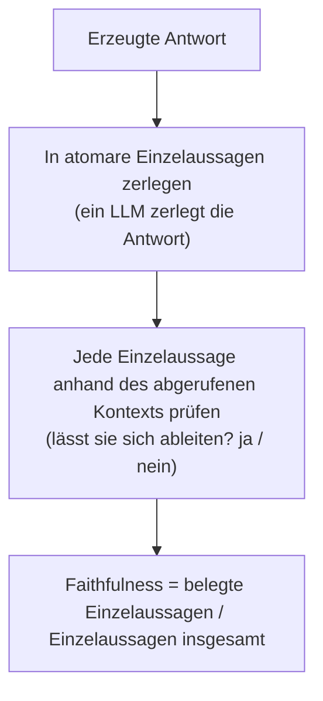

# Wenn die Metrik selbst ein Judge ist: wie Sie ihn kalibrieren und welche menschlichen Labels darunter liegen

[Teil 1 der Lektion](./index.md) hat den Rahmen gesetzt: Retrieval und Generation getrennt messen, einen Goldstandard aufbauen, frei formulierte Antworten von einem LLM-Judge bewerten lassen, dessen Bias-Formen misstrauen und ihn anhand menschlicher Labels prüfen, und beide Schleifen laufen lassen – offline in der CI und online im Produktivbetrieb. Diese Seite setzt das voraus und legt frei, was darunter arbeitet: was die benannten Metriken tatsächlich berechnen, wie Sie den Judge kalibrieren, dem Sie eben noch misstrauen sollten, und wie die menschlichen Labels entstehen, auf denen am Ende alles ruht.

Vorher eine Abgrenzung. Auf dieser Seite geht es ums *Messen*, nicht ums Reparieren. Die Hebel, die eine Metrik bewegen – besseres Chunking, besseres Reranking, besseres Grounding (Rückbindung der Antwort an den Kontext) –, stehen in den Schichtseiten [Retrieval](../../retrieval/index.md) und [Generation](../../generation/index.md); hier ist das Messgerät selbst der Gegenstand. Und der Gedanke, der die ganze Seite trägt, ist einer, den Teil 1 nur angedeutet hat: Die meisten modernen RAG-Metriken **sind** im Inneren selbst LLM-Judges. Eine Metrik erbt damit die Fehlbarkeit ihres Judges – und genau deshalb sind die Kalibrierung und die menschlichen Labels der Boden, auf dem hier jede Zahl steht.

## Die Metriken von innen

In Teil 1 waren die Metriknamen bloße Etiketten – „Faithfulness“, „Answer-Relevance“, ein paar mehr –, denen Sie vertraut haben, ohne hineinzusehen. Auf dem Niveau, um das es hier geht, müssen Sie wissen, was jede einzelne *berechnet*: Erst die Rechenvorschrift sagt Ihnen, was die Zahl erwischt und was nicht – und bei zweien von ihnen verdeckt der Name einen dokumentierten blinden Fleck.

Die Referenzimplementierung, an der sich das Ganze durchdenken lässt, ist **[Ragas](https://ragas.io)** – das Framework, das die RAG-Evaluierung in benannte, einzeln berechnete Metriken zerlegt hat (Es et al., „Ragas: Automated Evaluation of Retrieval Augmented Generation“, arXiv 2309.15217, eingereicht am 26. September 2023). Der Name gehört dazu, weil diese vier Metriken die übliche Aufteilung des Problems sind – die Zerlegung, auf die sich das Fach geeinigt hat, und nicht das Hausrezept eines einzelnen Anbieters. Die Rangmetriken aus Teil 1 – Precision@K, MRR, nDCG – schlüsselt diese Seite nicht weiter auf; aufgeschlüsselt werden die vier Metriken von Ragas.

Vier Metriken – und sie ordnen sich auf zwei Achsen. Die erste hat Teil 1 schon gezogen: *welche Stufe* eine Metrik beobachtet. Context-Precision und Context-Recall bewerten das Retrieval, Faithfulness und Answer-Relevance die Generation. Die zweite Achse blieb in Teil 1 implizit, und sie ist die praktisch entscheidende: ob eine Metrik eine **Referenz** braucht – eine von Menschen geschriebene richtige Antwort – oder ob sie allein mit Frage, abgerufenem Kontext und Antwort auskommt.

| | **Referenzfrei** (Frage + Kontext + Antwort) | **Referenzbasiert** (braucht eine Referenzantwort) |
|---|---|---|
| **Retrieval** | Context-Precision (ein LLM entscheidet über die Relevanz) | Context-Recall |
| **Generation** | Faithfulness, Answer-Relevance | – |

Diese Trennung schlägt unmittelbar durch. Faithfulness und der Answer-Relevance-Wert lassen sich im laufenden Produktivbetrieb an echten Anfragen berechnen, ohne dass irgendwo eine Antwort mit Label bereitliegt; Context-Recall lässt sich ohne Referenz überhaupt nicht berechnen. Diese Achse entscheidet, was Sie wo messen können – und sie ist der Grund, warum der Goldstandard am Ende dieser Seite einen eigenen Abschnitt bekommt. Sie erklärt zugleich, warum die Korrektheit, in Teil 1 als dritte Generation-Metrik genannt, in dieser Vierertafel fehlt: Sie braucht eine Referenz, und weiter unten steht, warum keine referenzfreie Metrik an sie heranreicht.

### Faithfulness: Grounding als Verhältnis auf der Ebene der Einzelaussagen

**Faithfulness** ist die Zahl, deren Formalisierung Teil 1 und die Generation-Schicht immer wieder angekündigt haben: Ruht die Antwort auf dem abgerufenen Kontext – oder ist das Modell zurück in das Wissen aus seinen eigenen Gewichten abgewandert? Ragas rechnet das in drei Schritten. Zuerst zerlegt ein LLM die erzeugte Antwort in **atomare Einzelaussagen**, also in die einzelnen sachlichen Feststellungen, die sie trifft. Dann prüft ein zweiter LLM-Durchgang jede Einzelaussage anhand des abgerufenen Kontexts und beantwortet eine Ja/Nein-Frage: Lässt sich diese Einzelaussage aus dem ableiten, was abgerufen wurde? Zuletzt bildet Ragas das Verhältnis.

*Faithfulness = (durch den Kontext belegte Einzelaussagen) / (Einzelaussagen der Antwort insgesamt)*, auf einer Skala von 0 bis 1.

Das durchgerechnete Beispiel aus der Ragas-Dokumentation macht es greifbar. Auf die Frage „Wo und wann wurde Einstein geboren?“ trifft eine Antwort womöglich zwei Einzelaussagen – den Ort und das Datum „14. März 1879“. Belegt der abgerufene Kontext den Ort, nicht aber das Datum, ist eine von zwei Einzelaussagen gestützt, und Faithfulness liegt bei 1/2 = 0,5.



Und jetzt der blinde Fleck. Faithfulness misst das Grounding, nicht die Korrektheit. Eine Einzelaussage, die sauber in einem **falschen** Kontext verankert ist, bekommt eine glatte 1,0 – der Metrik genügt es, dass die Antwort auf das Abgerufene zurückführt, auch wenn das Abgerufene Unsinn ist. Und weil die Metrik selbst eine LLM-Pipeline ist – zerlegen, dann prüfen –, trägt ihre Zahl die Fehler ihres Judges mit: Eine misslungene Zerlegung oder eine falsch beurteilte Ableitung verschiebt den Score, während mit der Antwort alles in Ordnung ist. Faithfulness erwischt also die Halluzination und den Fall, dass sich das Modell über den gelieferten Kontext hinwegsetzt – wovor die Generation-Schicht gewarnt hat. Eine falsche, aber belegte Antwort segelt daran vorbei; diese Lücke schließt erst eine Referenz, weiter unten.

### Die Answer-Relevance-Metrik rollt die Frage von hinten auf

In Teil 1 stand **Answer-Relevance** als Metrikname; die Zahl, die sie liefert, ist der **Answer-Relevance-Wert** (wie gut die Antwort die gestellte Frage trifft). Er misst etwas, das Faithfulness gar nicht berührt: ob die Antwort die Frage überhaupt *bedient* – ob sie zum Thema gehört und vollständig ist. Die Korrektheit ist eine eigene Achse, und die lässt diese Metrik bewusst in Ruhe. Ragas rechnet sie, indem es die Frage zurückgewinnt: Aus der erzeugten Antwort schreibt ein LLM N künstliche Fragen (standardmäßig drei), auf die diese Antwort eine gute Antwort wäre. Jede erzeugte Frage und die ursprüngliche Frage werden eingebettet, und für jede erzeugte Frage wird die **Kosinus-Ähnlichkeit** zur ursprünglichen berechnet. Der Answer-Relevance-Wert ist der Mittelwert dieser Ähnlichkeiten.

```text
answer relevance = (1/N) · Σ cos(E_gen_i, E_orig)
```

Dabei steht E für die Einbettung: E_gen_i für die der *i*-ten erzeugten Frage, E_orig für die der ursprünglichen Frage.

Die Anschauung dahinter erklärt, was die Metrik belohnt. Aus einer wirklich einschlägigen Antwort lässt sich die ursprüngliche Frage zurückgewinnen: Erzeugen Sie die Frage neu, landen Sie genau dort, wo Sie losgegangen sind – hohe Kosinus-Ähnlichkeit. Eine ausweichende, aufgeblähte oder halbfertige Antwort erzeugt Fragen, die anderswohin driften, und der Mittelwert sackt ab. Deshalb bestraft die Metrik Unvollständigkeit und Füllmaterial gleichermaßen: Was nur die Antwort füllt, schwächt genau das Signal, das auf die Frage zurückverweist.

Ihr blinder Fleck ist zugleich die ehrliche Grenze der referenzfreien Evaluierung. Der Answer-Relevance-Wert beurteilt ausdrücklich **nicht** die Korrektheit; er misst, ob Frage und Antwort dieselbe Absicht treffen, mehr nicht. Stellen Sie ihn neben Faithfulness, und Sie sehen, wie weit referenzfreie Evaluierung überhaupt reicht: Faithfulness bescheinigt, dass eine Antwort **belegt** ist, der Answer-Relevance-Wert, dass sie **zum Thema** gehört. Die Korrektheit ist ein Drittes, und keine der beiden Metriken reicht dorthin – dafür braucht es eine Referenz, eine bekannt richtige Antwort oder einen Menschen, der mitliest. Keine noch so kluge referenzfreie Konstruktion schließt diese Lücke; sie ist strukturell.

### Warum Context-Precision auf die Reihenfolge achtet

**Context-Precision** wechselt auf die Retrieval-Seite und stellt eine schärfere Frage als „wie viele der abgerufenen Chunks waren relevant?“. Sie fragt, ob die relevanten **oben** stehen, und berücksichtigt damit das Ranking, was ein bloßer Anteilswert nicht tut. Gerechnet wird ein gewichteter Mittelwert über die Ränge. Precision@k ist auf jedem Rang k der Anteil relevanter Chunks unter den ersten k Treffern. In die Summe geht ein Rang nur dann ein, wenn der Chunk, der dort steht, selbst relevant ist – das ist die Gewichtung. Die Summe über alle Ränge wird zuletzt durch die Gesamtzahl der relevanten Elemente in den top-K geteilt.

```text
Context Precision@K = Σ_k (Precision@k · v_k) / (total relevant items in top-K)
```

Dabei ist v_k gleich 1, wenn der Chunk auf Rang k relevant ist, und sonst 0. Was die Formel einbringt, ist Empfindlichkeit für die **Reihenfolge**, und das dokumentierte Verhalten zeigt, wie scharf sie ist: Nehmen Sie eine Trefferliste, die nahe bei 1,0 liegt, und schieben Sie einen einzigen irrelevanten Chunk von Rang 2 auf Rang 1 – es kommt nichts hinzu, es fällt nichts heraus, allein die Reihenfolge ändert sich –, dann fällt der Wert auf rund 0,5. Wie weit er fällt, hängt davon ab, wie lang die Liste ist; die Größenordnung ist der Punkt: Der Rang schlägt alles andere. Das ist die Metrik, die dem Reranker aus der Retrieval-Schicht seine Arbeit an der Reihenfolge anrechnet: Die richtigen Chunks überhaupt in die Liste zu bekommen ist notwendig – dass sie vorn stehen, ist das, was Context-Precision tatsächlich bewertet. Was diese Metrik dagegen nicht sieht, ist alles, was gar nicht erst in die Liste gekommen ist – dafür ist die nächste zuständig.

### Context-Recall ist die Metrik, die eine Referenz braucht

**Context-Recall** stellt die Frage, die für das Retrieval am meisten zählt: Haben wir *alles* zurückgeholt, was die richtige Antwort braucht? Das ist das direkteste Maß für das Fehlerbild des Retrievals, das Teil 1 benannt hat – der benötigte Chunk, der es nie in die Ergebnisse geschafft hat. Nur setzt die Frage „haben wir alles Nötige abgerufen?“ voraus, dass jemand weiß, was „alles Nötige“ überhaupt ist, und dieses Wissen gibt es nicht umsonst: Das ist die eine referenzbasierte Metrik unter den vieren. Gerechnet wird wieder mit einem LLM. Die Referenzantwort – die als richtig hinterlegte Antwort – wird in Einzelaussagen zerlegt; für jede dieser Einzelaussagen wird geprüft, ob sie sich dem abgerufenen Kontext zuordnen lässt; daraus ergibt sich das Verhältnis.

*Context-Recall = (durch den Kontext belegte Einzelaussagen der Referenzantwort) / (Einzelaussagen der Referenzantwort insgesamt)*

Teil 1 hat Recall „die zentrale Größe für RAG“ genannt, und hier ist der Grund. Context-Recall stellt dieselbe Frage wie Recall@K – haben wir alles Nötige zurückgeholt? –, beantwortet sie aber nicht über Chunks, die jemand vorab als relevant markiert hat, sondern über die Einzelaussagen der Referenzantwort. Ist Context-Recall niedrig, kann die Generation die Frage gar nicht beantworten, so gut das Modell auch sein mag – die Belege liegen ihm schlicht nicht vor. Diese Abhängigkeit von einer Referenzantwort ist zugleich der Grund, warum der Goldstandard für die Retrieval-Seite keine Kür ist: Er ist das, was diese Metrik überhaupt erst berechenbar macht.

Treten Sie einen Schritt zurück, dann ist das Muster über alle vier hinweg der eigentliche Punkt. Drei von ihnen – Faithfulness, Answer-Relevance und Context-Recall – sind selbst kleine LLM-Pipelines, die zerlegen, prüfen oder erzeugen. **Die Metrik ist ein Judge.** Eine Zahl aus Ragas ist damit nur so vertrauenswürdig wie das LLM, das sie berechnet; aus „der Metrik vertrauen“ wird „dem Judge vertrauen“ – und dem Judge, so deutlich stand es in Teil 1, ist nicht auf Zuruf zu trauen. Damit ist die nächste Frage unausweichlich: Wie kalibrieren Sie einen Judge, dem Sie misstrauen sollen?

## Den Judge kalibrieren, dem Sie misstrauen sollen

Teil 1 hat die Anweisung gegeben – der Judge hat seine Bias-Formen, gleichen Sie ihn mit menschlichen Labels ab – und es beim *Was* belassen. Dieser Abschnitt ist das *Wie*. Die Bias-Formen haben Namen und Mechanismen, es gibt zwei Bewertungsprotokolle mit verschiedenen Fehlerprofilen, und „anhand menschlicher Labels kalibrieren“ ist ein konkretes Verfahren, an dessen Ende eine Zahl steht. Die Quelle ist das Paper, das LLM-as-a-judge als Verfahren etabliert und seine Fehlerbilder katalogisiert hat: Zheng et al., „Judging LLM-as-a-Judge with MT-Bench and Chatbot Arena“ (arXiv 2306.05685, eingereicht am 9. Juni 2023).

### Die Bias-Formen haben Namen, und gegen jede gibt es eine Gegenmaßnahme

Der **Positionsbias** ist die Neigung des Judges, die zuerst gezeigte Antwort zu bevorzugen – oder die an einer festen Position –, ganz gleich, welche tatsächlich besser ist. Die Gegenmaßnahme ist mechanisch: Führen Sie jeden paarweisen Vergleich in **beiden** Reihenfolgen durch und zählen Sie einen Sieg erst, wenn das Urteil den Tausch übersteht. Kippt mit der Reihenfolge auch der Sieger, hat die Position entschieden, und das Ergebnis ist Rauschen.

Der zweite hängt an der Länge. Der **Ausführlichkeitsbias** (Verbosity Bias) bewertet die längere, ausgeschmücktere Antwort höher, auch wenn die zusätzliche Länge nichts Richtiges beiträgt – Füllwerk liest sich als Gründlichkeit. Dagegen hilft ein Bewertungsraster, das Substanz und nicht Umfang honoriert, und ein wachsames Auge für das Verräterische: Wenn ein Score der Länge der Antwort folgt, dann misst er nicht die Qualität, sondern den Umfang.

Der dritte ist feiner. **Self-Preference** – im Paper trägt dasselbe Fehlerbild den förmlichen Namen *self-enhancement bias* – heißt: Der Judge bewertet Ausgaben im eigenen Stil höher, oft die Erzeugnisse seiner eigenen Modellfamilie. Die Abhilfe: den Judge aus einer anderen Modellfamilie wählen als das geprüfte System, oder den Versatz anhand menschlicher Labels messen und herausrechnen.

Eine weitere Grenze, ohne sie zu überzeichnen: Das Paper hält fest, dass LLM-Judges bei Aufgaben schwach bewerten, die hartes Schlussfolgern oder Mathematik verlangen. Ein Judge ist genau dort am unzuverlässigsten, wo die Aufgabe am schwersten ist – also genau dort, wo Sie sich am liebsten auf ihn stützen würden. Das ist eine Grenze des Könnens, keine gerichtete Schieflage, und gehört deshalb neben die drei Bias-Formen, nicht unter sie.

Die drei teilen eine Eigenschaft, die leicht verkehrt herum verstanden wird: Sie sind **systematisch**. Zufällige Fehler mitteln sich heraus, je mehr Beispiele Sie rechnen; eine systematische Schieflage tut das nicht – zehntausend Vergleiche kippen unter dem Positionsbias alle zehntausend in dieselbe Richtung. Helfen können nur der Zuschnitt des Protokolls und die Kalibrierung; gegen eine systematische Schieflage richten mehr Daten nichts aus.

### Zwei Arten zu bewerten: eine Antwort für sich oder zwei im direkten Vergleich

**Pointwise** – eine einzelne Antwort für sich bewerten – legt dem Judge eine Antwort vor und verlangt einen absoluten Score anhand eines Bewertungsrasters; wahlweise referenzgestützt, das heißt, die Referenzantwort fährt im Prompt des Judges mit. Das ist billig, es skaliert, und es liefert eine absolute Zahl, auf die sich ein Schwellenwert anwenden lässt. Der Haken sind die absoluten Scores selbst: Sie driften. Was der Judge heute eine 7 nennt, nennt er nächste Woche vielleicht eine 6 – und diese Zahlen über mehrere Läufe hinweg zu kalibrieren, ist wirklich schwer.

**Pairwise** zeigt dem Judge zwei Antworten und fragt, welche besser ist oder ob es unentschieden steht. Für das Ranking zweier Systeme ist das verlässlicher: Menschen einigen sich auf „A ist besser als B“ viel leichter als auf irgendeinen absoluten Score, und Judges tun es ihnen gleich. Deshalb ist Pairwise das Protokoll für A/B-Entscheidungen. Es kostet an zwei Stellen: Ein Ranking über viele Systeme braucht O(n²) Vergleiche, und kein Protokoll ist dem Positionsbias so ausgesetzt – weshalb die Gegenmaßnahme aus Tausch und verlangter Konsistenz ausgerechnet für Pairwise erfunden wurde.

Die Wahl folgt also der Frage. Greifen Sie zu Pairwise, wenn Sie wissen wollen, ob Version B die Version A geschlagen hat – Modellauswahl, A/B-Test. Greifen Sie zu Pointwise, wenn Sie in der CI einen absoluten Schwellenwert für „ist diese Antwort gut genug?“ brauchen und keine zweite Antwort danebenliegt, gegen die sich die erste halten ließe. Referenzgestütztes Pointwise ist der Mittelweg, sobald Sie Antworten aus dem Goldstandard vor den Judge legen können: absolut bewertet, aber an einer bekannt richtigen Referenz verankert.

### Was „anhand menschlicher Labels kalibrieren“ praktisch bedeutet

Die Kalibrierung ist der Schritt, mit dem sich der Judge seine Skala verdient. Bevor Sie seinen Zahlen über Tausende von Beispielen trauen, messen Sie an einer Stichprobe seine Übereinstimmung mit menschlichen Labels – wie oft Judge und Mensch **zu demselben Urteil kommen**. Der Benchmarkwert, den Sie im Kopf behalten sollten, markiert die ehrliche Obergrenze: Bei starken Judges (in den Versuchen des Papers GPT-4) liegt die Übereinstimmung mit menschlichen Präferenzen über 80 % – etwa auf demselben Niveau wie die Übereinstimmung zwischen zwei unabhängigen Menschen. Lesen Sie die Zahl richtig: Der Judge ist hier ungefähr so beständig wie ein Mensch, mehr nicht. Was er einbringt, ist Menge – dasselbe Urteilsvermögen, angewandt auf ein Volumen, das kein menschliches Team bewältigen könnte.

Das Verfahren ergibt sich daraus unmittelbar. Halten Sie einen Teil der Beispiele mit menschlichen Labels zurück; messen Sie darauf die Übereinstimmung zwischen Judge und Mensch, bei Pairwise zusätzlich die Konsistenz beim Positionstausch. Liegt die Übereinstimmung über Ihrer Grenze, setzen Sie den Judge auf das Volumen an, für das keine menschliche Mannschaft je genug Labels vergeben könnte. Liegt sie darunter, schärfen Sie das Bewertungsraster nach, wechseln das Protokoll oder das Judge-Modell – und messen erneut, bevor Sie ihm trauen. Kalibriert wird dabei **anhand des Goldstandards**, des letzten Bausteins, auf den sich alles Übrige die ganze Zeit stillschweigend gestützt hat.

Daraus drei Warnungen. Die absoluten Scores eines unkalibrierten Judges sind unverankerte Zahlen, solange keine menschliche Stichprobe etwas anderes sagt – nehmen Sie sie nicht für bare Münze. Ein Judge aus derselben Modellfamilie wie das geprüfte System kann der Self-Preference erliegen; bei jedem knappen Vergleich sollten Judge und geprüftes System deshalb aus verschiedenen Modellfamilien stammen. Und ein Pairwise-Ranking über viele Systeme schleppt beides mit, den O(n²)-Aufwand und den Positionsbias, also rechnen Sie beides ein, bevor Sie danach greifen.

## Die menschlichen Labels, auf denen alles ruht

Verfolgen Sie beide Fäden zurück, treffen sie sich an derselben Stelle. Die referenzbasierte Metrik – Context-Recall – braucht eine als richtig hinterlegte Antwort; der Judge braucht, gleich unter welchem Protokoll, die Übereinstimmung mit Menschen, um kalibriert zu werden. Beides endet bei von Menschen vergebenen Labels, also beim Goldstandard. Teil 1 hat gesagt, dass Sie ihn von Hand oder synthetisch aufbauen und dass sauber vor groß geht. Hier steht, wie er tatsächlich entsteht – auf einem Niveau, das als Maßstab für die Kalibrierung taugt.

### Den Goldstandard aufbauen

Ein Beispiel im Goldstandard ist eine Frage samt ihrer Referenz: die relevanten Chunks, die richtige Antwort oder beides. Dorthin führen zwei Wege. Von Hand geschriebene Datensätze, verfasst von Fachleuten der jeweiligen Domäne, haben die höchste Qualität und brauchen am längsten. Bei synthetischen Datensätzen erzeugt ein LLM Frage-Antwort-Paare aus Ihrem Korpus, und danach prüft und korrigiert ein Mensch jedes einzelne Paar – **Human-in-the-Loop** (HITL). Der synthetische Weg skaliert das Erzeugen; was Modellausgabe erst in Ground Truth verwandelt – in die geprüften Labels, aus denen der Goldstandard besteht –, ist die menschliche Prüfung danach. Ein ungeprüfter synthetischer Datensatz ist nichts weiter als noch mehr Modellausgabe, die sich als Referenz ausgibt.

An dieser Stelle bekommt „Qualität vor Größe“ aus Teil 1 seinen Grund. Der Goldstandard ist der **Maßstab**, an dem jede andere Zahl gemessen wird. Ein Fehler im Maßstab bleibt nicht, wo er ist – er verdirbt jede Metrik, die daran gemessen wird, und jeden Judge, der anhand dieses Maßstabs kalibriert wird, und er tut es unsichtbar, weil die verdorbenen Zahlen weiterhin wie Zahlen aussehen. Ein kleiner, sauberer, für die Domäne repräsentativer Datensatz schlägt einen großen, verrauschten, weil sich das Rauschen im Messgerät ungebremst auf alles überträgt, was das Messgerät berührt.

### Woran Sie erkennen, dass die Labels verlässlich sind: die Interrater-Reliabilität

In der Wendung „von Menschen vergeben“ steckt ein Problem. Lesen zwei Fachleute dieselbe Antwort und sind sich uneins, ob sie richtig ist, sind die Labels den Namen Ground Truth noch nicht wert – sie geben die Meinung einer einzelnen Person wieder. Also messen Sie die Uneinigkeit. Was die Überschrift Interrater-Reliabilität nennt, heißt in der Messpraxis **die Übereinstimmung zwischen den Annotatoren** (inter-annotator agreement, **IAA**): das Ausmaß, in dem unabhängige Annotatoren dieselben Labels vergeben. Dafür gibt es zwei Standardmaße; ihre kanonischen Nachweise stehen im Glossar.

- **Cohens Kappa** – die um den Zufall bereinigte Übereinstimmung zweier Annotatoren. Die rohe prozentuale Übereinstimmung schmeichelt Ihnen, weil ein Teil jeder Übereinstimmung schlicht Glück ist; der Kappa-Wert zieht den zufällig zu erwartenden Anteil ab. κ = (p_o − p_e) / (1 − p_e), mit p_o als beobachteter und p_e als zufällig erwarteter Übereinstimmung.
- **Fleiss' Kappa** überträgt dieselbe Idee auf mehr als zwei Annotatoren.

Warum sich die Zufallsbereinigung lohnt: Bei zwei möglichen Labels – *richtig* oder *falsch* – stimmen zwei Annotatoren schon durch bloßes Münzwerfen in etwa der Hälfte der Fälle überein. „Wir waren uns zu 80 % einig“ kann deshalb ein schwaches Ergebnis sein, sobald Sie die rund 50 % abziehen, die der Zufall ohnehin geliefert hätte. Ein niedriger Kappa-Wert zeigt auf das **Bewertungsraster**: Die Anweisungen für die Vergabe der Labels sind mehrdeutig genug, dass zwei sorgfältige Menschen sie verschieden lesen. Die Abhilfe besteht darin, die Anweisungen zu schärfen und die Beispiele erneut vorzulegen; überstimmen Sie die abweichende Stimme nicht, sondern nehmen Sie sie als das Signal, das sie ist. Es ist dieselbe Disziplin beim Bewertungsraster, die der Judge im vorigen Abschnitt verlangt hat, und die Symmetrie ist exakt: Ein mehrdeutiges Bewertungsraster vergiftet die menschlichen Labels und den LLM-Judge auf ein und dieselbe Weise.

### Die menschliche Arbeit dort einsetzen, wo sie sich auszahlt

Die menschliche Arbeit ist die knappe und teure Ressource im ganzen Aufbau; wer zufällig auswählt, was ein Mensch prüft, verschenkt sie. Das **Active Sampling** – im maschinellen Lernen als *Active Learning* bekannt – wählt stattdessen die Beispiele aus, deren Labels am meisten einbringen, statt gleichmäßig zu ziehen. In der Praxis heißt das: dort prüfen lassen, wo der Judge am unsichersten ist, wo mehrere Judges auseinanderlaufen oder wo der Produktivbetrieb ein Fehlerbild gezeigt hat, mit dem im Goldstandard niemand gerechnet hatte – die Schleife von online nach offline aus Teil 1, die echte Fehler in den Datenbestand zurückspeist. Eine an der Unsicherheit ausgerichtete Auswahl bringt pro Arbeitsstunde eines Menschen mehr Kalibrierungssignal als gleichmäßiges zufälliges Sampling, mitunter deutlich mehr.

Damit schließt sich die Schleife, um die sich das ganze Fach dreht. Gezielt ausgewählte menschliche Labels ergeben einen besseren Goldstandard; ein besserer Goldstandard kalibriert den Judge enger; ein enger kalibrierter Judge liefert vertrauenswürdige Metriken in großer Zahl; und erst vertrauenswürdige Metriken lassen die Schleife aus Teil 1 – ändern, messen, entscheiden – wirklich halten, statt sie wegdriften zu lassen. Am Anfang steht die menschliche Arbeit. Der Judge verteilt sie auf Tausende von Beispielen, die von Hand nie zu prüfen wären.

Eine Warnung zum Schluss. Den Menschen automatisieren Sie nicht weg – Sie verteilen seine Arbeit auf mehr Fälle, als er je einzeln prüfen könnte. Der Judge skaliert menschliches Urteilsvermögen; die Labels, an denen er kalibriert wurde, liegen weiter darunter, und an dem Tag, an dem Sie das vergessen, hören Ihre Metriken still auf, etwas zu bedeuten. Auch die Kalibrierung **veraltet**: Sobald das Modell, das Korpus oder die Verteilung der Fragen driftet, bewertet der Judge, den Sie im letzten Quartal kalibriert haben, eine Welt, die weitergezogen ist. Einmal schlicht gesagt, sieht der ganze Aufbau so aus: Menschen legen die Wahrheit auf einem kleinen, sauberen Datensatz fest; dieser Datensatz kalibriert den Judge und macht die referenzbasierten Metriken überhaupt erst berechenbar; der kalibrierte Judge trägt das Messen in ein Volumen, das kein menschliches Team erreicht; und in regelmäßigen Abständen frischen Sie den ganzen Aufbau mit neuen menschlichen Labels auf. Nehmen Sie die Menschen aus dieser Kette heraus, und keine Zahl weiter unten hat noch einen Maßstab.

## Das Wichtigste

- Die vier Ragas-Metriken hören auf, undurchschaubar zu sein, sobald Sie die Rechnung dahinter sehen: Faithfulness ist der Anteil belegter an allen Einzelaussagen; der Answer-Relevance-Wert ist die mittlere Kosinus-Ähnlichkeit zwischen der ursprünglichen Frage und den Fragen, die ein LLM aus der Antwort zurückgewinnt; Context-Precision ist eine nach Rang gewichtete Precision; Context-Recall ist der Anteil belegter an allen Einzelaussagen der Referenzantwort.
- Zwei Achsen ordnen sie: die Stufe – Retrieval oder Generation – und referenzfrei gegen referenzbasiert. Faithfulness und der Answer-Relevance-Wert kommen ohne Referenzantwort aus und laufen an echten Anfragen; Context-Recall lässt sich ohne Referenz gar nicht berechnen.
- Drei der vier Metriken sind selbst LLM-Pipelines. Die Metrik ist damit ein Judge und erbt dessen Fehlbarkeit – und genau deshalb ist die Kalibrierung keine Kür.
- Referenzfreie Metriken reichen nur so weit: Faithfulness bescheinigt „belegt“, der Answer-Relevance-Wert bescheinigt „zum Thema“, und keine von beiden bescheinigt „richtig“. Für die Korrektheit braucht es eine Referenz oder einen Menschen.
- Die Bias-Formen eines Judges sind systematisch, mehr Beispiele waschen sie deshalb nicht heraus: Positionsbias (in beiden Reihenfolgen prüfen, Konsistenz verlangen), Ausführlichkeitsbias und Self-Preference brauchen jeweils eine Antwort im Protokoll oder in der Kalibrierung.
- Pairwise vergleicht zwei Systeme verlässlicher, braucht aber O(n²) Vergleiche und lädt den Positionsbias ein; Pointwise liefert den absoluten Schwellenwert für die CI. In beiden Fällen kalibrieren Sie anhand menschlicher Labels – und bei einem Judge der GPT-4-Klasse liegt die Übereinstimmung über 80 %, also auf menschlichem Niveau und nicht auf dem eines Orakels.
- Der Goldstandard ist der Maßstab, auf dem alles ruht: Messen Sie die Übereinstimmung zwischen den Annotatoren mit einem zufallsbereinigten Kappa-Wert, setzen Sie die knappe menschliche Arbeit über Active Sampling ein, und kalibrieren Sie neu, wenn Modell, Korpus oder Fragen driften.

**[Neue Begriffe](../../../glossary.md#evaluation)**: context precision, context recall, faithfulness (formula), answer relevance (formula), reference-free vs reference-based evaluation, LLM-judge calibration, position bias, verbosity bias, self-preference / self-enhancement bias, pointwise vs pairwise evaluation, inter-annotator agreement (Cohen's kappa, Fleiss' kappa), active sampling / active learning.
