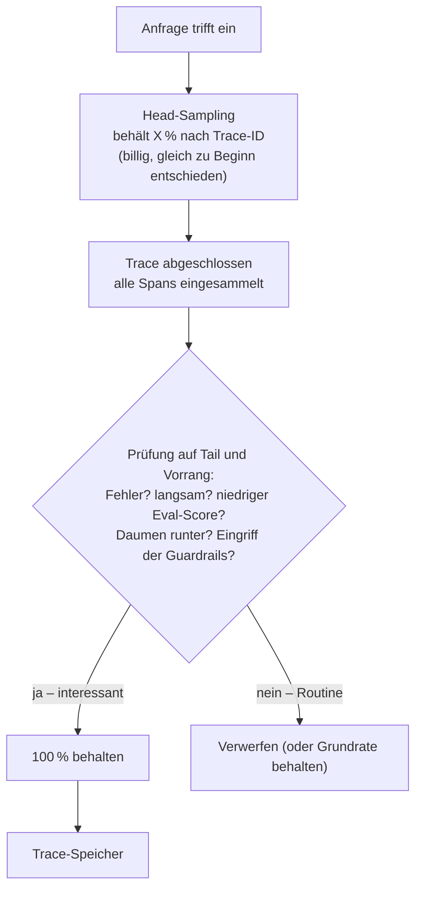
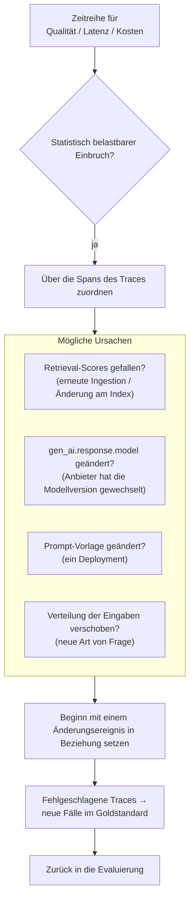

# Die richtigen Traces auswählen, sie speichern, ohne Daten preiszugeben – und merken, wann ein System im Stillen versagt, obwohl jede Antwort mit Status 200 zurückkommt

[Teil 1 der Lektion](./index.md) hat den Rahmen gesetzt: Ein Trace ist die vollständige Aufzeichnung einer Anfrage, Span für Span durch die Pipeline; die drei Säulen heißen Traces, Metriken und Logs; protokolliert werden die RAG-Besonderheiten – die abgerufenen Chunks und ihre Scores, der endgültige Prompt, die rohe Ausgabe sowie Latenz, Token und Kosten pro Schritt; Kosten und Latenz sind keine Nebensache, sondern gehören von Anfang an dazu; und die Observability liefert der Evaluierung neue Fälle, denn eine schlechte Antwort aus dem Produktivbetrieb ist der nächste Fall für den Goldstandard. Diese Seite setzt das alles voraus und wendet sich dem zu, was sich ändert, sobald echter Datenverkehr fließt und nicht mehr abreißt – wenn aus einem Trace eine Million am Tag werden und jede dieser Entscheidungen dem Maßstab standhalten muss.

Zuerst eine Abgrenzung. Hier geht es um Observability als Disziplin des Produktivbetriebs: Bei diesem Aufkommen können Sie nicht jeden Trace behalten, also behalten Sie nur einen Teil; Sie können nicht alles speichern, was Sie erfassen, also entscheiden Sie, was sich gefahrlos aufbewahren lässt; Sie können nicht jedes Diagramm im Blick behalten, also setzen Sie Ziele und lösen nur dort einen Alert aus – eine Meldung, die jemanden holt –, wo die Folge am anderen Ende ankommt; einen Qualitätseinbruch müssen Sie einer Ursache zuordnen; und was das alles verbraucht, müssen Sie deckeln. Der Trace als zentraler Baustein wird hier nicht noch einmal hergeleitet, das steht in Teil 1. Um den Werkzeugkatalog geht es hier ebenfalls nicht, der steht in [Teil III](../../../part-3-production/tooling-ecosystem/index.md), und wie sich die Pipeline reparieren lässt, steht auf den Schichtseiten zu [Retrieval](../../retrieval/index.md) und [Generation](../../generation/index.md). Untersuchungsgegenstand ist hier das Observability-System selbst.

## Sie können nicht jeden Trace behalten

Bei produktivem Aufkommen ist es untragbar teuer, 100 % der Traces zu speichern: Der Speicher füllt sich so schnell, wie die Anfragen eintreffen, und das meiste, was dort landet, ist unauffällig. Also behalten Sie eine Teilmenge, die repräsentativ und zugleich interessant ist – im Folgenden die **behaltenen Traces** –, und werfen den Rest weg. Das ist **das Sampling**, und die ganze Frage lautet, welche Traces in diese Teilmenge kommen.

Die naheliegende Antwort entscheidet zu früh. **Head-based Sampling** trifft die Entscheidung über Behalten oder Verwerfen schon *am Anfang* eines Traces, auf dessen erstem Span, üblicherweise nach einem festen Verhältnis, das aus der Trace-ID berechnet wird: einen von zehn behalten, die neun anderen verwerfen. Das ist billig, zustandslos und liefert ein Datenvolumen, das sich auf das Byte genau vorhersagen lässt. Sein Nachteil trifft ausgerechnet die Traces, um die es geht: Im Moment der Entscheidung ist noch nicht bekannt, wie die Anfrage ausgegangen ist. Die Fehlschläge lassen sich also gar nicht bevorzugt behalten, weil noch keiner fehlgeschlagen ist. Reines Head-Sampling verwirft deshalb die meisten Traces, die Sie sich später gern angesehen hätten, und behält von den langweiligen Traces ein zufälliges Zehntel.

**Tail-based Sampling** verlegt die Entscheidung ans Ende. Der Collector – die Komponente, die die Spans einsammelt, bevor sie im Trace-Speicher landen – puffert jeden Span eines Traces, bis die Anfrage abgeschlossen ist, und entscheidet erst dann – anhand des vollständigen Trace, seiner Latenz, seines Fehlerstatus, der Attribute seiner Spans. Jetzt lässt sich überhaupt erst ausdrücken: die Langsamen behalten, die Fehler behalten, die Markierten behalten. Diese Eigenschaften stehen zum Zeitpunkt der Entscheidung ja fest. Der Preis dafür ist, dass der Collector einen Zustand mitführt. Er muss die Spans eines Traces im Arbeitsspeicher halten und nach Trace-ID gruppieren, also müssen alle Spans eines Traces bei derselben Collector-Instanz ankommen – die Lastverteilung läuft über die Trace-ID –, und der Bedarf an Arbeitsspeicher und CPU steigt entsprechend. Die Distribution OpenTelemetry Collector Contrib bringt das als `tail_sampling` mit.

Erfahrene Teams landen bei keinem der beiden Extreme, sondern bei einer Vorrangregel – **Priority-Sampling**, auch hybrides Sampling genannt: 100 % der Traces behalten, die auf keinen Fall verloren gehen dürfen, also Fehler, Anfragen jenseits der Obergrenze für die Latenz und Antworten, die das Nutzerfeedback oder eine Prüfung als schlecht markiert hat; von den langweiligen Erfolgen dagegen nur eine niedrige Grundrate. Verbreitet ist es, beide Verfahren hintereinanderzuschalten: zuerst Head-Sampling, das den Rohstrom auf ein bezahlbares Maß eindampft, danach Tail-Sampling über das, was übrig bleibt, für die eigentliche Entscheidung anhand des Ausgangs.

Und dann bekommt das Wort „interessant“ für ein LLM-System eine andere Bedeutung. Bei einem gewöhnlichen Dienst ist ein interessanter Trace ein Fehler oder eine langsame Anfrage, und beides ist auf der Transportebene sichtbar. Bei einem LLM-System kann hinter einer Antwort mit Status 200 trotzdem eine Halluzination stecken, eine im Detail falsche Auskunft oder eine verweigerte Antwort – die Qualität ist im HTTP-Status nicht zu sehen. In das Vorrangsignal, das über das Behalten entscheidet, muss deshalb neben Latenz und Fehler auch die *Qualität* eingehen: ein Score aus der Online-Evaluierung am Trace – also aus einer Bewertung, die am laufenden Verkehr misst statt offline auf einem festen Datensatz –, ein Daumen nach unten, ein Eingriff der Guardrails, eine verweigerte Antwort. Genau deshalb hängt das Sampling einer LLM-Anwendung an der Evaluierungsschleife und nicht allein an Fehlern und Latenz – behalten sollten Sie oft gerade die Anfrage, die auf der Transportebene kerngesund aussah.

## Was Sie am dringendsten protokollieren wollen, wollen Sie am wenigsten aufbewahren

Das Nützlichste, was Sie zur Fehlersuche in einer LLM-Anwendung aufzeichnen können – der vollständige Prompt, der an das Modell ging, und die vollständige Ausgabe, die zurückkam –, ist zugleich das Heikelste, was Sie besitzen. In diesen Nutzdaten steckt regelmäßig alles, was ein Mensch eingetippt hat, samt personenbezogener Angaben; gerade der Trace, der bei der Fehlersuche am meisten hilft, trägt deshalb auch das größte Datenschutzrisiko. Sie können nicht alles speichern, was Sie erfassen könnten – und dieser Widerstreit ist kein Beiwerk des Entwurfs, sondern die Entwurfsentscheidung selbst.

Der Standard hat darauf eine ausdrückliche Antwort. In den GenAI-Konventionen von OpenTelemetry muss das Erfassen der Nachrichten*inhalte* – der Eingabenachrichten und des erzeugten Ausgabetexts – ausdrücklich eingeschaltet werden; standardmäßig ist es abgeschaltet, und zwar genau wegen des Datenschutzes und der Datenmenge. Standardmäßig eingeschaltet bleiben die Metadaten: das Modell, die Zahl der Token, die Dauer. Der rohe Text ist der Teil, für den Sie sich bewusst entscheiden müssen. (Diese Konventionen haben den Status *Development*, sind also experimentell und noch nicht stabil, Stand Semantic Conventions v1.41.x im Jahr 2026, und Sie schalten den aktuellen experimentellen Satz mit `OTEL_SEMCONV_STABILITY_OPT_IN=gen_ai_latest_experimental` frei.)

Die Schutzmaßnahmen sind gestaffelt und greifen ineinander. Erstens: personenbezogene Daten **schwärzen** oder anonymisieren, *bevor* sie im Trace-Speicher landen – mit derselben Erkennung, die die Guardrails-Schicht ohnehin betreibt, also einer PII-Erkennung, die einen Anonymizer speist, wie in der Analyzer-Anonymizer-Kette von Microsoft [Presidio](https://microsoft.github.io/presidio) (die Mechanik steht in der [Vertiefung zu den Guardrails](../guardrails/deep-dive.md)). Zweitens: die Aufbewahrung nach Stufen festlegen – eine kurze TTL (die Frist, nach der ein Eintrag von selbst verfällt) für die inhaltstragenden Spans, damit der rohe Text schnell verschwindet, während die billigen Metadaten für die Trendauswertung erhalten bleiben. Drittens: eine Zugriffssteuerung für die Oberfläche, in der die Traces angezeigt werden – Prompts aus dem Produktivbetrieb sind Nutzerdaten, und wer diese Oberfläche öffnet, sieht direkt hinein. Und das Sampling hilft hier fast nebenbei mit: Weniger gespeicherte Traces bedeuten weniger Daten, die überhaupt abfließen können.

Bei der Maskierung greift dieselbe Trennlinie, die schon die Guardrails-Schicht gezogen hat, und sie ist eine echte Abwägung, keine Voreinstellung. Die irreversible Maskierung – entfernen, ersetzen, maskieren, einen Hashwert bilden – maximiert den Datenschutz und zerstört im selben Zug die Untersuchbarkeit: Was tatsächlich gefragt wurde, ist danach nicht mehr zu sehen. Die reversible Maskierung – verschlüsseln – hält einen Weg zurück offen, für die berechtigte Fehlersuche; ein wiederherstellbarer Wert ist aber das größere Risiko, und die Daten sind damit pseudonymisiert und nicht anonymisiert, denn der Schlüssel ist jetzt ein gespeichertes Geheimnis, das sich anzugreifen lohnt. Sie entscheiden pro Feld und pro Aufbewahrungsstufe: Für die Telefonnummer wird ein Hashwert gebildet, das Original ist weg; der Fragetext wird für ein kurzes Zeitfenster verschlüsselt und danach verworfen.

## Was auf das Dashboard gehört – und wann Sie jemanden aus dem Bett holen

Auf dem Dashboard eines LLM-Systems steht alles, was auch ein gewöhnlicher Dienst zeigt – die **Golden Signals** der Google-SRE-Schule, also Latenz, Traffic, Fehler und Sättigung –, und dazu eine Achse, an die diese vier nie gedacht haben. Auf der gewöhnlichen Achse wollen Sie die Latenz als Verteilung sehen, p50, p95 und p99, dazu **TTFT**, die Zeit bis zum ersten Token, denn das ist es, was bei einer gestreamten Antwort tatsächlich ankommt; außerdem Kosten und Tokenverbrauch pro Anfrage, den Durchsatz und die Fehlerquote. Die LLM-eigene Achse ist die Qualität, und sie gehört von Anfang an als vollwertiges Signal dazu: Scores aus der Online-Evaluierung auf den behaltenen Traces (wie viele Antworten die Faithfulness-Prüfung bestehen – ob die Antwort also durch die abgerufenen Quellen belegt ist –, dazu der **Answer-Relevance**-Wert, wie gut die Antwort die gestellte Frage trifft), wie oft der Daumen nach unten geht, der Anteil verweigerter Antworten, wie oft die Guardrails eingreifen. Ein Dashboard, das Latenz und Kosten zeigt und die Qualität nicht, ist blind für genau das Fehlerbild, das nur diese Art von System hat.

Erst dieses Qualitätssignal erlaubt es, den Zuverlässigkeitsrahmen der SRE-Schule ehrlich anzuwenden. Sie wählen **SLIs** – Service-Level-Indicators, also die Größen, die Sie tatsächlich messen: Verfügbarkeit, die Latenz im 95. Perzentil, eine Bestehensquote für die Qualität, eine Obergrenze für den Preis pro Anfrage. Sie setzen ein **SLO** – ein Service-Level-Objective, ein Ziel für einen SLI über einen Zeitraum: p95-Latenz unter drei Sekunden über 30 Tage, Faithfulness-Quote mindestens 0,95. Und der Abstand zwischen diesem Ziel und den vollen 100 % ist Ihr **Fehlerbudget**: so viel dürfen Sie sich an Fehlern leisten, bevor das Ziel verfehlt ist. Was diesen Rahmen an ein LLM-System anpasst, ist die Forderung, dass mindestens ein SLI ein *Qualitäts*-SLI ist, berechnet aus der Online-Evaluierung. Ein Dienst, der zu 100 % verfügbar ist und zu 30 % halluziniert, erfüllt sein Verfügbarkeitsziel und lässt alle auflaufen, die ihm geglaubt haben; ohne Qualitätsziel bleibt das Dashboard genau darüber grün.

Was einen Alert auslöst, ergibt sich aus dem Fehlerbudget und nicht aus den rohen Metriken. Gemeldet wird nur, was am anderen Ende ankommt: die **Burn Rate** des Fehlerbudgets – wie schnell Sie es verbrauchen, sodass ein schnelles Abbrennen sofort jemanden aus dem Bett holt, während ein langsames Abdriften bloß warnt –, eine p95-Latenz über der Vorgabe, ein Kostenausschlag, ein Qualitätseinbruch, eine Häufung von Eingriffen der Guardrails. Die eigentliche Disziplin liegt hier in der Zurückhaltung, denn zu viele Alerts sind ein eigenes Fehlerbild. Hängen Sie an jede Metrik einen Alert, dann kommt die echte **Regression** (eine durch eine Änderung verursachte Verschlechterung), wenn sie denn kommt, in einem Strom von Alerts an, den längst niemand mehr liest: Wer zu viel alarmiert, wird nicht mehr gehört – und so bleibt ein wirklicher Vorfall eine Stunde lang unbemerkt. **Alerts auf die Burn Rate** melden bewusst die Wirkung und nicht die Ursache, und genau darin liegt hier ihre Stärke: Ausgelöst werden sie von der sichtbaren Folge und nicht von jedem Zucken jeder darunterliegenden Zahl, und das hält das Alerting glaubwürdig.

## Einen Qualitätseinbruch auf seine Ursache zurückführen

Sackt eine Qualitätsmetrik ab, folgen zwei Fragen in dieser Reihenfolge: Ist der Einbruch echt, und wodurch ist er entstanden? Die erste ist eine Frage der Erkennung. Die Online-Evaluierung auf den behaltenen Traces liefert zusammen mit dem gesammelten Nutzerfeedback eine Zeitreihe der Qualitätsmetrik; ein statistisch belastbarer Einbruch in dieser Reihe – nicht ein einzelner schlechter Nachmittag – ist eine Regression, und für die Reihen zu Latenz und Kosten gilt dasselbe. Es geht darum, einen echten Trend vom Rauschen zu trennen, bevor jemand geweckt wird.

Bei der zweiten Frage zahlt sich die Struktur eines Traces aus. Weil ein Trace in Spans pro Stufe zerlegt ist, lässt sich eine Regression auf eine Stufe eingrenzen, statt über die ganze Pipeline zu raten – die Aufteilung in das Fehlerbild des Retrievals und das Fehlerbild der Generation aus dem Überblick zu Teil I, diesmal auf eine Zeitreihe aus dem Produktivbetrieb angewandt statt auf eine einzelne Antwort. Die möglichen Ursachen sind konkret, und jede hinterlässt eine Spur in der Aufzeichnung. Sind die Retrieval-Scores gefallen, was auf eine erneute Ingestion des Korpus – das erneute Einlesen und Indexieren der Quelldokumente – oder eine Änderung am Index deutet, also auf das Fehlerbild des Retrievals? Hat der Anbieter das Modell stillschweigend auf eine neue Version umgestellt, sodass sich `gen_ai.response.model` ändert, obwohl Ihr Code unverändert geblieben ist? Hat ein Deployment die Prompt-Vorlage geändert? Hat sich die Verteilung der Eingaben verschoben, ist also eine neue Art von Frage dazugekommen? Beantwortet wird das, indem Sie den Beginn der Regression mit einem Änderungsereignis in Beziehung setzen – einem Deployment, einer geänderten Festlegung der Modellversion, einer erneuten Ingestion. (Die Modellversion so festzulegen, dass der Anbieter sie nicht unter Ihnen wegziehen kann, ist eine LLMOps-Praxis; sie gehört in die [Lektion zu LLMOps](../../../part-3-production/llmops/index.md).)

Und hier wird die Schleife aus Teil 1 zur Betriebspraxis. Die Traces, an denen sich eine Regression zeigt, sind per Definition die schweren Fälle – die, bei denen das System scheitert –, und genau daran fehlt es einem Goldstandard. Sie steigen zu neuen Fällen im Goldstandard auf, sodass die Ursachensuche die Evaluierung mit Material versorgt und die Evaluierung anschließend dafür sorgt, dass der Fehler nach der Reparatur nicht zurückkommt. Wie aus solchen Fällen Zahlen werden, ist Gegenstand der [Vertiefung zur Evaluierung](../evaluation/deep-dive.md); hier zählt nur, dass der Weg in beide Richtungen führt – aus dem Produktivbetrieb in den Goldstandard und aus dem Goldstandard zurück in den Produktivbetrieb.

## Eine Obergrenze dafür, was eine Anfrage verbrauchen darf

Bei den Kosten fängt alles mit der Zählung der Token pro Anfrage an: Die Rechnung besteht aus Eingabe-Token plus Ausgabe-Token, jeweils nach Modell bepreist – und was Sie nicht gezählt haben, können Sie nicht steuern. Die GenAI-Konventionen von OpenTelemetry liefern genau die Instrumente dafür. Die Attribute heißen `gen_ai.usage.input_tokens` und `gen_ai.usage.output_tokens` für die Aufteilung der Token, `gen_ai.request.model` und `gen_ai.response.model` für das angeforderte und das tatsächlich verwendete Modell, dazu `gen_ai.operation.name` und `gen_ai.provider.name`; die Metriken heißen `gen_ai.client.token.usage`, in der Einheit `{token}`, und `gen_ai.client.operation.duration`, in Sekunden. Wie beim Nachrichteninhalt haben auch diese in Semantic Conventions v1.41.x (2026) den Status *Development*, und Sie schalten sie über `OTEL_SEMCONV_STABILITY_OPT_IN=gen_ai_latest_experimental` frei – stabil genug, um darauf zu bauen, und noch nicht eingefroren.

Token zu zählen ist nicht dasselbe, wie zu wissen, wohin sie gehen; dafür müssen Sie **die Kosten zuordnen**. Versehen Sie die Spans mit dem Feature, dem Mandanten, der Route und dem Modell, dann beantwortet die Monatsrechnung die Frage, welches Feature oder welcher Kunde das Budget verbrennt, statt der nutzlosen Gesamtsumme „wir haben X ausgegeben“. Die Zuordnung leisten dieselben OTel-Attribute. Ohne sie ist ein Kostenausschlag nicht zu diagnostizieren: Sie wissen, dass die Zahl gestiegen ist, und nichts darüber, warum – und können deshalb nicht einmal entscheiden, was Sie abschalten sollen.

Auf der Zeitachse gilt dasselbe. Sie setzen Ziele für p50 und p95 und zerlegen die Latenz nach Spans – Retrieval gegen Reranking gegen Generation, TTFT gegen die gesamte verstrichene Zeit –, damit sich bei einer Überschreitung sagen lässt, welche Stufe langsam war, statt nur, dass die Pipeline als Ganzes zu lange braucht. Ein Budget ist eine Obergrenze, und eine Überschreitung ist das Signal, zu einem der Hebel aus Teil 1 zu greifen: ein Cache, ein günstigeres Modell, weniger Chunks im Prompt. (Die Antwort so zu streamen, dass TTFT kurz bleibt, auch wenn die vollständige Generation langsam ist, gehört zur Bereitstellung; das behandelt die [Lektion über Bereitstellung und Betrieb](../../../part-3-production/serving/index.md).)

Aus einem Diagramm wird erst dann eine Steuerung, wenn die Vorgabe zwischen einer weichen und einer harten Obergrenze unterscheidet (**Soft- und Hard-Cap**). Die weiche Obergrenze warnt – sie löst einen Alert aus, sie färbt ein Dashboard rot – und lässt die Anfrage durch. Die harte Obergrenze stoppt tatsächlich: Sie weist die Anfrage ab, stuft auf ein günstigeres Modell herunter oder kürzt den Kontext, bis er passt. Damit ist sie eine Absicherung zur Laufzeit und kein Bericht im Nachhinein, und sie hat dieselbe Gestalt wie die Schritt- und Token-Budgets, die für einen Agenten in Teil II gelten: eine Grenze, die das System sich selbst auferlegt, während es arbeitet, und nicht eine, von der Sie am nächsten Morgen lesen.

## Wo das schiefgeht

Fünf Fehlerbilder lohnen es, klar benannt zu werden.

- Die Observability einer LLM-Anwendung kann so viel kosten wie die LLM-Anwendung selbst. Behalten Sie 100 % der inhaltstragenden Traces, dann nähert sich die Rechnung für die Observability derjenigen für die Inferenz an, die sie überwachen sollte. Im großen Maßstab ist es das Sampling, das Observability überhaupt bezahlbar macht; wer es als aufschiebbare Optimierung behandelt, dem laufen die Kosten davon.
- Auch Tail-Sampling ist nicht umsonst. In sehr großem Maßstab sind die zustandsbehaftete Pufferung und die Lastverteilung nach Trace-ID selbst teuer, und sie zuverlässig zu betreiben kostet spürbaren Aufwand. Es verschafft Ihnen die Möglichkeit, die interessanten Traces zu behalten – billig verschafft es sie Ihnen nicht.
- Rohe Prompts und Ausgaben ohne Schwärzung zu protokollieren ist ein Datenschutzvorfall, dem nur noch das Datum fehlt. Was bei der Fehlersuche am meisten hilft, steht später im Bericht über die Panne – also maskieren Sie beim Hineinschreiben, oder bewahren Sie es gar nicht erst auf.
- Für jede Metrik einen Alert einzurichten endet damit, dass niemand mehr hinsieht, und dann scrollt die echte Regression ungelesen vorbei. Mehr Alerts schaffen keine zusätzliche Sicherheit, sobald sie niemand mehr liest.
- Ein Qualitäts-SLO ohne Online-Evaluierung dahinter ist Verfügbarkeitstheater: eine Wand grüner Dashboards über einem Dienst, der selbstbewusst und nachweislich falsch liegt. Ein Ziel ist nur so viel wert wie die Messung, auf der es beruht.

## Das Wichtigste

- Im großen Maßstab führt am Sampling kein Weg vorbei, und die Strategie entscheidet, was Sie behalten. Head-based Sampling ist billig und zustandslos, entscheidet aber, bevor der Ausgang feststeht, und kann Fehlschläge deshalb nicht bevorzugt behalten. Tail-based Sampling puffert den vollständigen Trace und entscheidet nach dem Ausgang – um den Preis eines Zustands im Arbeitsspeicher und einer Lastverteilung nach Trace-ID (`tail_sampling` in der Collector-Contrib-Distribution). Priority-Sampling behält 100 % der unverzichtbaren Traces und nimmt vom Rest nur eine Stichprobe.
- Für ein LLM-System gehört zu „interessant“ auch die Qualität und nicht nur Fehler und Latenz – hinter einer 200 kann eine Halluzination stecken –, also hängt die Entscheidung über das Behalten an einem Eval-Score, einem Daumen nach unten, einem Eingriff der Guardrails oder einer verweigerten Antwort.
- Die Nutzdaten, die bei der Fehlersuche am meisten helfen, sind die heikelsten: In den GenAI-Konventionen von OpenTelemetry muss das Erfassen der Nachrichteninhalte deshalb ausdrücklich eingeschaltet werden, während die Metadaten standardmäßig laufen. Verteidigt wird mit Schwärzung vor dem Speichern, gestaffelter Aufbewahrung, Zugriffssteuerung auf die Trace-Oberfläche – und mit dem, was das Sampling ohnehin schon wegnimmt.
- Die Maskierung ist eine Entscheidung pro Feld und pro Aufbewahrungsstufe: irreversibel (entfernen, ersetzen, maskieren, einen Hashwert bilden) maximiert den Datenschutz und zerstört die Untersuchbarkeit; reversibel (verschlüsseln) hält einen berechtigten Weg zurück offen, ist aber Pseudonymisierung und keine Anonymisierung, und der Schlüssel wird selbst zum Risiko.
- Stellen Sie die Golden Signals dar und daneben die Qualität als vollwertige Achse; setzen Sie SLIs, SLOs und ein Fehlerbudget, mit mindestens einem Qualitäts-SLI aus der Online-Evaluierung; und setzen Sie **Alerts auf die Burn Rate** und auf das, was am anderen Ende ankommt, statt auf jede Metrik – sonst begräbt der Lärm die echte Regression.
- Bei einer Regression gilt: erst erkennen, dann zuordnen. Ein statistisch belastbarer Einbruch in einer Reihe zu Qualität, Latenz oder Kosten wird über die Spans des Traces auf eine Stufe eingegrenzt – sind die Retrieval-Scores gefallen, hat sich `gen_ai.response.model` geändert, hat sich der Prompt geändert, hat sich die Verteilung der Eingaben verschoben – und mit einem Änderungsereignis in Beziehung gesetzt; die fehlgeschlagenen Traces werden zu neuen Fällen im Goldstandard.
- Die Kosten entstehen aus der Zählung der Token pro Anfrage über die GenAI-Instrumente von OTel. Diagnostizierbar werden sie erst, wenn Sie sie zuordnen, also die Spans mit Feature, Mandant, Route und Modell versehen. Die Latenz wird nach Spans zerlegt und bekommt eine Obergrenze – und von diesen Obergrenzen warnt die weiche, während die harte zur Laufzeit eingreift.

**[Neue Begriffe](../../../glossary.md#observability)**: head-based sampling, tail-based sampling, priority / hybrid sampling, message-content capture (opt-in), retention tiers, golden signals, SLI / SLO, error budget, burn-rate alerting, alert fatigue, regression triage, cost attribution, token accounting, latency budget, soft cap / hard cap, OpenTelemetry GenAI conventions.
