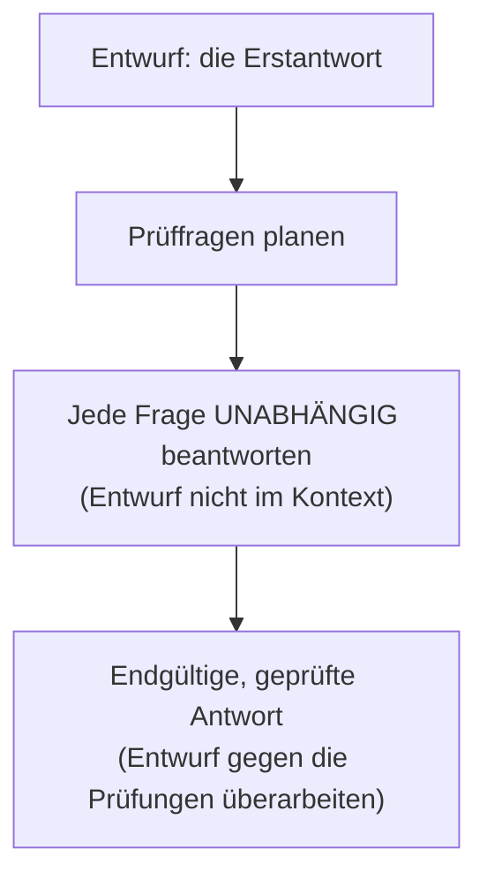
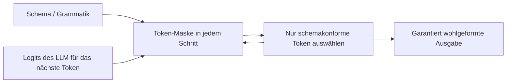

# Antworten, die sich selbst prüfen, Ausgaben, die nicht missraten können – und der Kontext, der beides trägt

[Teil 1 der Lektion](./index.md) hat diese Schicht aus einem einzigen Rahmen aufgebaut – **aus dem Kontext antworten, nicht aus dem eigenen Wissen** – und die Grundhebel geliefert: Grounding-Anweisungen, Quellenangaben, die sich auf die Metadaten der Chunks stützen, eine erlaubte Antwortverweigerung und **Faithfulness** (Quellentreue – wie treu die Antwort den herangezogenen Quellen bleibt, ohne unbelegte Informationen hinzuzufügen) als die Zahl, die zur Evaluierung überleitet. Benannt war dort auch der Fehler, dessentwegen es diese Schicht überhaupt gibt: Der Chunk, den Sie brauchten, stand *im* Kontext, und das Modell hat trotzdem falsch geantwortet. Diese Seite setzt all das voraus und baut darauf die Mechanik für Fortgeschrittene auf. Erklärt wird dieses Fehlerbild hier nicht noch einmal; es ist der Boden, auf dem die Seite steht.

Zuerst eine Abgrenzung – dieselbe, die auch die Retrieval-Vertiefung zu Beginn vornimmt. Alles auf dieser Seite geschieht **in einem einzigen Durchgang**: Das Modell formuliert eine Antwort aus einem festen Kontext, und dieser Kontext ändert sich nicht. Die Selbstprüfung weiter unten ist das Modell, das *seinen eigenen Entwurf* prüft – nicht der Agent, der noch einmal abrufen geht. In dem Augenblick, in dem Ihr System zurückspringt und **neu abruft**, weil es die Antwort für unzureichend hält, haben Sie den einen Durchgang verlassen und sind bei der iterativen, agentischen Spielart angekommen (Self-RAG, CRAG, die Prüfung auf ausreichenden Kontext – *sufficient context*); die steht in der [Vertiefung zu Agentic RAG](../../part-2-agents/agentic-rag/deep-dive.md). Diese Seite macht den einen Durchgang so gut, so wohlgeformt und so nachprüfbar, wie ein einzelner Durchgang eben werden kann.

Der Aufbau, in dieser Reihenfolge: Rechenzeit bei der Inferenz einsetzen, um die Fehler des Modells zu finden (Selbstprüfung); die Antwort in eine Form zwingen, der ein Parser und eine Prüfung der Quellenangaben trauen können (strukturierte Ausgabe und erzwungene Quellenangaben); den Widerspruch zwischen Kontext und Modellwissen frontal angehen, statt darauf zu hoffen, dass das Grounding gewinnt; einen langen Kontext über die Lost-in-the-Middle-Regel hinaus zusammenstellen; und Format, Ton und Länge der Antwort gestalten, ohne dass die Gestaltung das Grounding außer Kraft setzt.

## Mit zusätzlicher Rechenzeit gegen die eigenen Fehler des Modells

Die Grounding-Anweisung aus Teil 1 senkt die **Rate** der Halluzinationen. Geprüft wird damit keine einzige Antwort. Zwei publizierte Verfahren wenden zusätzliche Rechenzeit bei der Inferenz auf, um die Antwort selbst zu prüfen – beide auf der Seite der Generation, keines ruft neu ab, und beide tauschen Token und Latenz gegen Quellentreue. Sie lösen verschieden geformte Probleme, und am schnellsten lassen sie sich so auseinanderhalten: Das eine erzeugt viele Antworten und lässt abstimmen, das andere erzeugt eine und prüft sie nach.

### Self-Consistency: viele Wege erzeugen, einmal abstimmen

**Self-Consistency** (Wang et al., „Self-Consistency Improves Chain of Thought Reasoning in Language Models“, arXiv 2203.11171, eingereicht im März 2022; ICLR 2023) ersetzt das einmalige **Greedy Decoding** der Chain-of-Thought – in jedem Schritt wird schlicht das wahrscheinlichste Token ausgewählt, und es entsteht genau ein Lösungsweg – durch ein kleines Ensemble. Sie erzeugen bei einer Temperatur über null *mehrere verschiedene Lösungswege*, lassen die Wege danach außer Betracht und ermitteln die *Endantwort* durch einen *Mehrheitsentscheid*. Dahinter steht die Überlegung, dass ein wirklich schweres Problem mehrere gültige Wege zulässt, die auf dieselbe richtige Antwort zulaufen, während die falschen Antworten auseinanderstreben – Übereinstimmung ist damit ein Indiz, und eine einzelne abweichende Stimme wird überstimmt.

Auf den Benchmarks des Papers sind die Zugewinne gegenüber der Chain-of-Thought mit Greedy Decoding groß: GSM8K +17,9 %, SVAMP +11,0 %, AQuA +12,2 %, StrategyQA +6,4 %, ARC-Challenge +3,9 %. Lesen Sie diese Zahlen als das, was sie sind: Benchmarks für das Schlussfolgern per Chain-of-Thought, nicht für RAG. Für RAG selbst ist das Verfahren enger zugeschnitten, als die Schlagzeilenzahlen vermuten lassen.

In einem RAG-System passt Self-Consistency zu einer Antwort, deren Kern ein einzelner *diskreter* Wert ist, über den sich überhaupt abstimmen lässt: eine Zahl, ein Name, eine Kategorie, ein Ja oder Nein, das im abgerufenen Kontext verankert ist. Sie lassen N im Kontext verankerte Antworten erzeugen und behalten die Mehrheitsantwort; eine einzelne abweichende Antwort verliert die Abstimmung. Mehr ist der Anwendbarkeitstest nicht.

Daraus folgt zugleich, wann Sie **nicht** danach greifen. Eine offene, ausführliche Antwort hat keinen einzelnen Wert, über den abgestimmt werden könnte – über die Lösungswege lässt sich nichts mitteln, und Self-Consistency greift schlicht nicht. Außerdem vervielfacht das Verfahren die Kosten um den Faktor N: N vollständige Antworten pro Frage. Damit ist es eine bewusste Entscheidung über Latenz und Budget für eine schmale Klasse von Fragen und nie eine Voreinstellung, die überall eingeschaltet bleibt.

### Chain-of-Verification: erst entwerfen, dann den Entwurf mit Fragen prüfen

**Chain-of-Verification (CoVe)** (Dhuliawala et al., „Chain-of-Verification Reduces Hallucination in Large Language Models“, arXiv 2309.11495, eingereicht im September 2023) ist eine ausdrückliche Schleife der Selbstbefragung in vier Schritten. Zuerst entsteht eine **Erstantwort**. Dann wird ein Satz **Prüffragen** geplant, die diesen Entwurf auf seine Tatsachen abklopfen. Jede Prüffrage wird *unabhängig* beantwortet. Zuletzt entsteht die **endgültige, geprüfte Antwort**, indem der Entwurf gegen das überarbeitet wird, was die Prüfungen ergeben haben.

Alles hängt am dritten Schritt, und der Grund dafür heißt *Unabhängigkeit*; im Paper heißt diese Variante *factored*. Die Prüffragen werden beantwortet, *ohne dass die Erstantwort im Kontext steht*, damit das Modell nicht stillschweigend genau den Fehler wiederholt, den es prüfen soll. Liest es beim Prüfen den eigenen falschen Entwurf noch einmal, winkt es den Fehler durch: Die selbstsichere Formulierung des Entwurfs wird zur Vorannahme seiner eigenen Prüfung. Jede Prüffrage für sich zu stellen, unterbricht dieses Echo. Deshalb senken ausgerechnet die Varianten *factored* und *factor-and-revise* – die die Prüfungen vom Entwurf trennen – die Halluzinationen tatsächlich, während die naive gemeinsame Variante, alles in einem Prompt, den Fehler geradewegs wieder hereinlässt.



In RAG werden die Prüffragen erneut an den abgerufenen Kontext gebunden – jede wird zu einer kleinen Prüfung der Form: Ist diese Einzelaussage durch die Quellen wirklich belegt? Damit wird aus der einen Grounding-Anweisung von Teil 1 eine ausdrückliche Prüfung jeder Einzelaussage – und genau auf dieser Ebene müssen Sie prüfen, wenn der Fehler, den Sie jagen, ein einziger erfundener Satz in einer sonst richtigen Antwort ist.

Nebeneinandergestellt ist die Arbeitsteilung sauber. Beide kosten zusätzliche Durchgänge, und keines von beiden ruft neu ab. Self-Consistency erzeugt und stimmt ab: keine Kritik, braucht eine abstimmbare Antwort, wirkt dort, wo es einen einzelnen diskreten Wert gibt. CoVe erzeugt und prüft nach: ausdrückliche Selbstbefragung, wirkt auf ausführlicher Prosa, wo es nichts abzustimmen gibt.

## Struktur nicht erbitten, sondern erzwingen

Teil 1 hat das Modell gebeten, seine Quellen anzugeben und sauber zu antworten. Auf dieser Stufe hören Sie auf zu *bitten* und fangen an zu *erzwingen*: Dass die Ausgabe die verlangte Form hat, ist dann keine Hoffnung mehr, sondern eine Garantie.

Der Grund für den Aufwand: Eine Bitte ist keine Garantie, und unter Last zeigt sich der Unterschied. Ein Prompt, der „Gib JSON zurück“ oder „Nenne deine Quellen“ sagt, liefert Ihnen ein überzähliges Komma, eine geschwätzige Einleitung vor dem JSON oder eine erfundene Quellen-ID – und weiter hinten wirft ein Parser eine Ausnahme, oder eine Quellenangabe zeigt ins Leere. In der Demo funktioniert es, und bei den seltenen Fällen fällt es um; das ist die schlechteste Fehlerklasse, die sich ausliefern lässt, denn zu sehen bekommen Sie es erst, wenn der Produktivverkehr es findet.

**Constrained Decoding** beseitigt die Möglichkeit, statt ihre Wahrscheinlichkeit zu senken. Die Struktur wird *während* der Erzeugung erzwungen: In jedem Decoding-Schritt legt das Schema – zuvor in eine Grammatik überführt – fest, welche nächsten Token zulässig sind, und bei der Tokenauswahl wird jedes Token maskiert, das das Schema verletzen würde; ausgegeben werden können also von vornherein nur schemakonforme Token. Eine missratene Ausgabe ist damit nicht mehr unwahrscheinlich, sondern konstruktionsbedingt ausgeschlossen. (Der Begriff steht aus der Lektion über den Tool-Einsatz bereits im Glossar; hier ist es derselbe Mechanismus, nur auf die Form der Antwort gerichtet.)



Genau hier trennen sich der bloße JSON-Modus und die schemagarantierte Ausgabe, und auf den Unterschied kommt es an. Der reine JSON-Modus garantiert nur, dass die Ausgabe *gültiges JSON* ist; darüber, ob dieses JSON *Ihrem* Schema entspricht, sagt er nichts. **Structured Outputs** von OpenAI (`strict: true`, August 2024) überführt das JSON Schema, das Sie mitgeben, in eine Grammatik und bindet das Decoding daran; Sie bekommen damit **Schemakonformität**: jedes Pflichtfeld vorhanden, die richtigen Typen, keine zusätzlichen Schlüssel. Diese Garantie hat ihren Preis, und zwar an zwei Stellen. Sie deckt nur eine *Teilmenge* von JSON Schema ab – nicht jedes Schema, das sich schreiben lässt, lässt sich auch erzwingen. Und die erste Anfrage mit einem neuen Schema wartet einmalig darauf, dass die Grammatik gebaut ist; spätere Anfragen mit demselben Schema treffen den Cache. Diesen Cold-Start-Aufschlag zahlen Sie einmal pro Schema, nicht bei jedem Aufruf.

Erzwungene Quellenangaben gibt es in zwei Gestalten, und beide vertragen sich mit allem Bisherigen.

Die erste besteht darin, **die Quellenangabe in das Schema selbst hineinzubauen**. Das Antwortobjekt trägt ein `claims`-Array, in dem jede Einzelaussage ihre eigene `source_id` hat; damit wird aus der Quellenangabe ein typisiertes Pflichtfeld, dem der Parser trauen kann, statt einer Zeichenkette, von der Sie hoffen, dass das Modell sie geschrieben hat. Getragen wird auch das von den Metadaten, die Sie beim Chunking angelegt haben (Teil 1 und die Schicht [Ingestion](../ingestion/index.md)) – die Quellen-ID war immer schon da; das Schema macht nur aus dem Mitführen eine Pflicht.

Die zweite sind **anbietereigene Quellenangaben**. Die **Citations API** von Anthropic (23. Januar 2025) nimmt die Quelldokumente entgegen, die Sie übergeben, und liefert *strukturierte Objekte für die Quellenangabe* zurück, mit zeichengenauen Positionen im Quelltext – genau die Sätze oder Passagen, auf die sich eine Einzelaussage stützt, garantiert auf der Ebene der API, statt in den Prompt hineingebeten. Anthropic berichtet von einer um bis zu 15 % höheren **Recall-Genauigkeit** gegenüber einem selbst geschriebenen, prompt-basierten Zitierschema – eine Herstellerangabe, und worauf sich der Zugewinn bezieht, sagt sie nicht. Eine Einschränkung gehört dabei in das Entwurfsgespräch und nicht in eine Fußnote: Bei Anthropic schließen sich Citations und Structured Outputs gegenseitig aus – Sie können nicht beides zugleich erzwingen und entscheiden sich pro Aufruf zwischen API-garantierten Quellenangaben und einem API-garantierten Schema.

All das hat seinen Preis, und das Können zeigt sich darin, zu wissen, wann Sie ihn **nicht** zahlen. Die Ausgabeverteilung – die Wahrscheinlichkeiten, aus denen das nächste Token gezogen wird – in ein starres Schema zu pressen, kann das Schlussfolgern der Antwort *verschlechtern*: Das Modell verbraucht sein Budget darauf, die Grammatik zu erfüllen, statt nachzudenken. Halten Sie deshalb das Schlussfolgern frei und binden Sie nur die endgültige Antwort: Das Modell überlegt in einem unbeschränkten **Scratchpad** – einem Notizbereich, für den kein Schema gilt – oder in einem eigenen Denkfeld und gibt erst am Ende die schemagebundene Antwort aus. Gebunden wird das Ergebnis, nicht die Überlegung.

## Wenn der Kontext dem Wissen des Modells widerspricht

Teil 1 hat die Regel aufgestellt: aus dem Kontext antworten und das im Modell gespeicherte Wissen zurückdrängen. Diese Regel gilt nicht absolut, und wer so tut, als gälte sie absolut, handelt sich eine ganze Klasse stiller Falschantworten ein.

RAG bindet die Antwort mit Absicht an den gelieferten Kontext, doch das Modell trägt weiterhin ein starkes eigenes Wissen mit sich – die Vorannahmen, die ihm das Training fest in die Gewichte geschrieben hat. Grounding-Anweisungen *verschieben* es in Richtung Kontext. Sie schalten die Vorannahmen nicht ab, und keine Formulierung tut das.

So entsteht **der Widerspruch zwischen abgerufenem Kontext und Modellwissen**: Der abgerufene Kontext widerspricht dem, was das Modell *glaubt*, und es ist nicht garantiert, dass der Kontext gewinnt. Welche Seite sich durchsetzt, hängt unter anderem davon ab, wie fest die Vorannahme sitzt und wie plausibel und stimmig der Kontext wirkt. Ein Modell setzt sich eher über einen Kontext hinweg, der unplausibel wirkt oder einer fest sitzenden Vorannahme deutlich widerspricht – auch dann, wenn dieser Kontext die richtige, eben erst abgerufene Tatsache enthält. Genau das ist der Fehler, den ein Unternehmen fürchten sollte: Ihr frisches, freigegebenes Dokument verliert gegen eine veraltete Überzeugung aus der Trainingszeit, und die Antwort klingt tadellos.

Über die einfache Grounding-Anweisung hinaus haben Sie Hebel, aber keiner davon ist ein Schalter.

- **Den Widerspruch ausdrücklich ansprechen.** Sagen Sie dem Modell, dass der Kontext maßgeblich ist und dass es sich bei einem Widerspruch zum eigenen Wissen an den Kontext halten *und die Abweichung benennen* soll, statt beides still miteinander zu verrechnen. Genau dieses stille Verrechnen ist der Mechanismus, mit dem sich eine falsche Antwort versteckt: Es übertüncht die Naht, die Sie hätten sehen müssen.
- **Die Quellen lesbar machen.** Klar abgegrenzte Quellen und eine Quellenangabe zu jeder Einzelaussage (der vorige Abschnitt) verteuern das stille Einsetzen einer Vorannahme, denn jede Einzelaussage muss jetzt auf eine Quelle zeigen – und eine Vorannahme hat keine.
- **Es messen.** Ob die Antwort tatsächlich auf den Quellen ruhte, sagt die **Faithfulness**-Metrik, festgelegt in der [Evaluierung](../cross-cutting/evaluation/index.md). Sie ist das Instrument, das die Fälle findet, in denen sich das Modellwissen über den Kontext hinweggesetzt hat – Fälle, über die ein menschlicher Leser glatt hinweglesen würde.

Eine ehrliche Grenze bleibt. Kein Prompt macht das Grounding absolut: Wie oft sich das Modell über den gelieferten Kontext hinwegsetzt, lässt sich *senken und messen*, aber nicht auf null bringen. Genau deshalb ist Faithfulness eine überwachte Zahl und kein gelöstes Problem.

## Einen langen Kontext zusammenstellen – über die Faustregel hinaus

Verwenden Sie den etablierten Terminus, statt einen neuen zu erfinden: **Lost-in-the-Middle** (Liu et al., arXiv 2307.03172, TACL 2023). Teil 1 hat Ihnen die Faustregel gegeben – wenige, dafür die besten Chunks, die wichtigsten an die Ränder. Hier folgen der Mechanismus und die Disziplin dahinter.

Genauer: Modelle nutzen eine Information am besten, wenn sie am **Anfang oder am Ende** der Eingabe steht, und am schlechtesten, wenn sie in der **Mitte** vergraben liegt. Die Kurve über der Position ist also **U-förmig**; gemessen wurde sie an Fragen zu mehreren Dokumenten und am Abruf von Werten zu vorgegebenen Schlüsseln. Was dabei überrascht: Sie gilt auch für Modelle, die ausdrücklich als Long-Context-Modelle gebaut und verkauft werden. Ein großes Kontextfenster ist kein gleichmäßig nutzbares; seine Mitte ist die Stelle, an der Signal übersehen wird.

```text
nutzbares
Signal
  ▲    ●                                   ●
  │      ●                               ●
  │        ●                           ●
  │          ●● ● ● ● ● ● ● ● ● ● ● ●●
  └──────────────────────────────────────▶  Position im Kontext
     Anfang           Mitte              Ende
```

Deshalb gilt: *Mehr ist nicht besser*. Ab einem gewissen Punkt **schadet** jedes weitere abgerufene Dokument. Die zusätzlichen Chunks bringen Rauschen mit, verdünnen den einen, auf den es ankam, schieben ihn in die verlustbehaftete Mitte und kosten obendrein Token. Nutzbarer Kontext ist nicht dasselbe wie die Größe des Kontextfensters. Den Kontext zusammenzustellen, ist eine Frage der *Auswahl* und nicht die Frage, wie sich das Fenster vollstopfen lässt – und genau darum gibt es weiter vorn im Retrieval das Reranking. Erst das Reranking rechtfertigt es, nur noch *wenige* Chunks zu übergeben.

Wegen der U-Kurve ist die Reihenfolge nicht kosmetisch. Legen Sie die übergebenen Chunks so, dass die am höchsten bewerteten an den *Rändern* landen, am Anfang und am Ende, und die schwächsten in der Mitte, wo das Modell sie ohnehin halb übersieht. Der Reranker hat bereits eine Reihenfolge nach Score erzeugt; die Position im Prompt bildet sie unmittelbar ab. Das Retrieval liefert die Reihenfolge; beim Zusammenstellen richten Sie die Positionen danach aus.

Zwei weitere Handgriffe holen Budget zurück, bevor Sie überhaupt an die Grenze des Fensters stoßen. **Duplikate entfernen**: Sich überschneidende Chunks – eine Folge des Chunk-Overlaps aus der Ingestion – und nahezu gleiche Quellen verbrauchen Token und vergraben das Signal ein zweites Mal, indem sie es wiederholen; räumen Sie die Redundanz weg, bevor Sie den Kontext zusammenstellen. Und **verdichten**, wo es sich lohnt: Eine Komprimierung oder Zusammenfassung der abgerufenen Chunks bringt mehr Signal pro Token unter, um den Preis eines zusätzlichen LLM-Durchgangs. Benennen Sie das Mittel, greifen Sie danach, wenn wirklich das Fenster der Engpass ist, und zahlen Sie sonst nicht dafür.

Die Linie durch den ganzen Abschnitt: Einen langen Kontext zusammenzustellen, ist die Faustregel aus Teil 1 – wenige, die besten, an den Rändern – in strenger Form: auswählen (Reranking), Duplikate entfernen, nach der U-Kurve in die richtige Reihenfolge bringen. Das Fenster ist größer geworden. Die Disziplin ist deshalb nicht optional geworden.

## Format, Ton und Länge – und warum das Grounding trotzdem gewinnt

Die erzeugte Antwort ist das Produkt: das, was am Ende tatsächlich gelesen wird. Ihre Gestaltung entscheidet darüber, wie sie ankommt. Halten Sie dabei von Anfang an einen Vorbehalt fest, denn er ist zugleich der Punkt: Die Gestaltung darf die Richtigkeit nie außer Kraft setzen.

Das Format ist ein echter Qualitätshebel und keine Verzierung. Wählen Sie die Form nach dem Empfänger: Fließtext für einen menschlichen Leser, Aufzählungen oder Tabellen für einen Vergleich, den jemand überfliegen soll, und die strukturierte Ausgabe aus dem Abschnitt oben, wenn eine Maschine liest. Eine Wand aus Fließtext dort, wo die Frage nach einer Tabelle verlangte, ist die *schlechtere* Antwort, selbst wenn jede Tatsache darin stimmt: Was jemand eigentlich wissen wollte, lässt sich daraus nicht herausziehen.

Die Länge ist ein Regler, den Sie auf die Aufgabe einstellen. Geben Sie eine Ziellänge vor und **begrenzen Sie die Ausgabe mit `max_tokens`**. Eine zu lange Antwort verdünnt den Punkt, vergräbt den Vorbehalt, auf den es ankam, und kostet Token; eine zu knapp abgeschnittene lässt eine nötige Einschränkung oder eine Nuance weg. Eine einzeilige Auskunft und eine mehrabsätzige Erklärung wollen verschiedene Einstellungen – die Länge ist keine feste Voreinstellung, die einfach stehen bleibt.

Der Ton wird im System-Prompt gesetzt und durchgehalten. Passen Sie das Register an das Publikum an – schlicht für einen Support-Kanal, präzise für die Fachanalyse – und halten Sie es über die Antworten hinweg gleich, denn ein schwankender Ton wirkt beim Lesen wie ein unzuverlässiges System, selbst wenn die Fakten stimmen.

Und nun die Regel, der das alles dient. Die Gestaltung der Antwort ist dem Grounding und der Quellentreue nachgeordnet. „Fasse dich kurz“ darf niemals die Quellenangabe, den Vorbehalt oder das ehrliche „Das steht nicht in den Dokumenten“ fallen lassen. Stoßen eine Anweisung zur Gestaltung und eine Grounding-Anweisung zusammen, gewinnt jedes Mal das Grounding. Der Grund ist schärfer als bloße Ordnungsliebe: Eine schön formatierte, selbstsicher formulierte *falsche* Antwort ist das schlechteste Ergebnis, das diese ganze Schicht hervorbringen kann, weil die Gestaltung eine falsche Antwort *überzeugender* macht. Genau deshalb kommt die Gestaltung zuletzt und tritt hinter die Richtigkeit zurück – sie gibt der Antwort den letzten Schliff; richtig gemacht haben Sie sie vorher.

## Das Wichtigste

- Die Selbstprüfung wendet zusätzliche Rechenzeit bei der Inferenz auf, um die eigene Antwort des Modells zu prüfen: Self-Consistency erzeugt viele Lösungswege und entscheidet über einen diskreten Wert per Mehrheitsentscheid, Chain-of-Verification entwirft zuerst und beantwortet dann abgeschottete Prüffragen, damit es den eigenen Fehler nicht durchwinken kann – und keines der beiden ruft neu ab.
- Constrained Decoding macht aus der Form der Ausgabe eine Garantie statt einer Bitte: Das Schema maskiert in jedem Schritt die unzulässigen Token, missratenes JSON wird damit unmöglich, und Structured Outputs von OpenAI (`strict: true`) garantiert die Konformität mit *Ihrem* Schema, nicht bloß gültiges JSON.
- Quellenangaben sind nur dann verlässlich, wenn sie ein typisiertes Feld im Schema oder anbietereigen sind – die Citations API von Anthropic liefert zeichengenaue Positionen in der Quelle, garantiert auf der Ebene der API und nicht als Hoffnung im freien Text. Und weil ein zu eng gebundenes Schlussfolgern seinen Preis hat, binden Sie die endgültige Antwort und lassen das Nachdenken frei.
- Der Widerspruch zwischen abgerufenem Kontext und Modellwissen ist real: Grounding-Anweisungen verschieben das Modell in Richtung Kontext, schalten seine Vorannahmen aber nie ab. Weisen Sie es deshalb an, sich an den Kontext zu halten und die Abweichung zu benennen, und messen Sie anschließend mit Faithfulness nach, ob es das getan hat.
- Einen langen Kontext über Lost-in-the-Middle hinaus zusammenzustellen, ist eine Disziplin aus drei Handgriffen: wenige auswählen (Reranking), Duplikate entfernen und die am höchsten bewerteten Chunks an den Anfang und an das Ende legen. Denn ein größeres Fenster ist kein gleichmäßig nutzbares.
- Die Gestaltung der Antwort nach Format, Ton und Länge ist ein echter Qualitätshebel, bleibt dem Grounding aber nachgeordnet: Eine gut gestaltete falsche Antwort ist schlimmer als eine hässliche richtige, weil die Gestaltung eine falsche Antwort nur überzeugender macht.

**[Neue Begriffe](../../glossary.md#generation)**: self-consistency, chain-of-verification (CoVe), knowledge conflict (context–memory conflict), answer-shaping. (Structured output, constrained decoding, strict mode, lost-in-the-middle, faithfulness, parametric knowledge – aus früheren Lektionen.)
