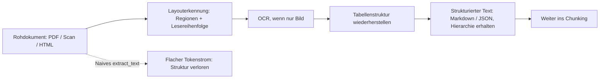
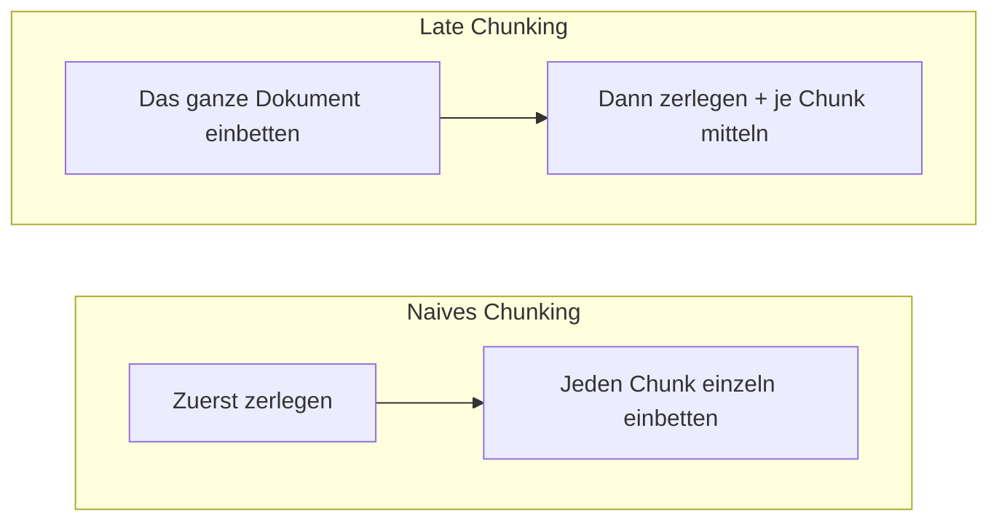

# Sauber extrahieren, gut einbetten

[Teil 1 der Lektion](./index.md) hat die Ingestion auf zwei Säulen gestellt. Beim Chunking ging es um die Abwägung über die Größe, um die Strategien von der festen Größe bis zur Dokumentstruktur und um die Metadaten, die Sie dabei festlegen; bei den Embedding-Modellen um die Trennung in Bi- und Cross-Encoder, um die Achsen der Auswahl, um die Kosinus-Ähnlichkeit und um die beiden Fehler.

Drei Dinge sind dabei unterbelichtet geblieben, und diese Seite nimmt sie auf. Erstens hat Teil 1 stillschweigend vorausgesetzt, dass Ihnen bereits sauberer Text zum Zerlegen vorliegt. Genau an dieser Stelle geht im Unternehmen unbemerkt Qualität verloren: Die Eingabe ist keine Prosa, sondern PDF, Scan, Tabelle und HTML, und irgendetwas muss daraus erst den Text machen, den Sie zerlegen. Zweitens verliert ein Chunk, aus seinem Dokument gerissen, den Kontext um sich herum – auch bei sauberem Text –, und es gibt Verfahren, die ihn zurückgeben. Drittens haben Sie das Embedding-Modell von der Stange genommen; Sie können es aber auf Ihre Domäne, Ihr Budget und Ihre Sprachen zuschneiden.

Der Reihe nach also: (1) das Parsing der Dokumente; (2) fortgeschrittenes Chunking, also Late Chunking und Contextual Retrieval; (3) die Embeddings selbst, also Fine-Tuning, das Kürzen der Vektoren nach Matryoshka und Mehrsprachigkeit. Teil 1 wird durchgehend vorausgesetzt: Die Abwägung über die Chunk-Größe und die Unterscheidung zwischen Bi- und Cross-Encoder werden nicht noch einmal erklärt, sondern nur weitergebaut.

## Parsing begrenzt alles, was danach kommt

Die Pipeline aus Teil 1 begann bei „Zerlegen Sie das Dokument“. Aber irgendetwas muss ein Dokument erst *in* den Text verwandeln, den Sie zerlegen, und genau an diesem Schritt verliert RAG im Unternehmen am häufigsten unbemerkt Qualität. Die Regel ist unerbittlich und heißt seit jeher *garbage in, garbage out*. Die Qualität des extrahierten Textes setzt allen nachfolgenden Chunking-Strategien und Embedding-Kniffen Grenzen. Hat der Parser die Eingabe verstümmelt, holt sie keine der folgenden Stufen zurück – Sie zerlegen dann Unsinn und betten Unsinn getreulich ein.

Der Kern des Problems: **Das visuelle Layout eines Dokuments trägt Bedeutung, die eine flache Textextraktion wegwirft.** Ein PDF ist kein logisches Dokument, sondern eine Menge von Glyphen, die auf einer Seite positioniert sind. Ein naives `extract_text` verarbeitet diese Glyphen der Reihe nach und liefert einen linearen Strom, in dem an bestimmten, vorhersagbaren Stellen unbemerkt der Zusammenhang verloren geht. Mehrspaltige Seiten werden quer durchgelesen, sodass zwei Spalten zu Unsinn ineinandergeschoben werden. Tabellen zerfallen zu einer ungeordneten Folge von Token: Die Zeilen- und Spaltenbezüge, die jeder Zahl ihre Bedeutung gaben, sind weg – und für die Finanz- und Spezifikationstabellen, von denen Unternehmenskorpora voll sind, ist das der schlimmste Fall überhaupt. Kopf- und Fußzeilen, Bildunterschriften und Fußnoten landen an der falschen Stelle oder verschwinden. Und die Überschriftenhierarchie löst sich auf – genau die Hierarchie, auf der das an der Dokumentstruktur orientierte Chunking aus Teil 1 und die Metadaten mit dem Überschriftenpfad aufbauen.

Es hilft, die Dokumenttypen als Leiter zunehmender Schwierigkeit zu sehen statt als ein einziges Problem:

- **PDF mit Textebene, DOCX, HTML** – die Zeichen sind vorhanden; das Problem sind allein *Struktur und Lesereihenfolge*.
- **Tabellen** – die Struktur aus Zelle, Zeile und Spalte muss ausdrücklich erhalten bleiben und darf nicht linearisiert werden. Walzen Sie eine Tabelle Zeile für Zeile zu Text platt, zerstören Sie den Spaltenbezug, der jeder Zahl ihre Bedeutung gab – der strukturelle Verwandte des verlorenen Bezugs aus Teil 1 („Im dritten Quartal ist er um 20 % gewachsen“).
- **Gescannte oder reine Bild-PDF** – es gibt überhaupt keine Textebene. Sie brauchen **OCR** (optische Zeichenerkennung – abgebildete Schrift wieder in Zeichen verwandeln), bevor die weiteren Stufen überhaupt ansetzen können.
- **Komplexes Layout** – mehrspaltige Seiten, Formulare, Abbildungen mitten im Text – alle Probleme von oben auf einmal.

Die moderne Antwort ist **ein Parsing, das die Struktur zuerst erkennt**: erst die Struktur bestimmen, dann den Text herausholen. Statt Glyphen in der Reihenfolge der Datei abzugreifen, setzt ein solcher Parser ein Bild- oder Layoutmodell ein, das Regionen auf der Seite erkennt – Titel, Absatz, Tabelle, Abbildung, Liste, Kopfzeile, Fußzeile – und die Lesereihenfolge bestimmt, *bevor* er den Text extrahiert. Danach gibt er strukturiertes Markdown oder JSON aus, in dem Hierarchie und Tabellen erhalten sind. Darin liegt der entscheidende Unterschied zu einem herkömmlichen Extraktor, der die Struktur gar nicht erst ansieht.

Ein paar Werkzeuge zeigen die wichtigsten Ansätze. Genannt werden sie hier wegen der Gestaltungsidee dahinter, nicht als Einkaufsführer.

- **Unstructured** ([unstructured.io](https://unstructured.io)) ist das Arbeitspferd für den Normalfall: eine Bibliothek und Plattform für die Ingestion von Dokumenten, die viele Formate – PDF, DOCX, PPTX, HTML – in typisierte Elemente zerlegt, die Sie anschließend unterteilen und filtern können.
- **Docling** ([GitHub](https://github.com/docling-project/docling)), 2024 von IBM Research quelloffen gemacht, verbindet die Layouterkennung mit einem eigenen Modell für die Tabellenstruktur (TableFormer) und mit der Wiederherstellung der Lesereihenfolge; ausgegeben wird strukturiertes Markdown oder JSON. **Granite-Docling**, ein kleines Vision-Language-Modell (IBM, 2025), hat den ganzen Weg von der Seite zur Struktur später in einem einzigen durchgängigen Modell zusammengeführt.
- **LayoutLM** (Microsoft, erste Fassung 2019; arXiv 1912.13318) ist die Forschungswurzel, aus der das Feld gewachsen ist – ein Transformer-Modell, das Text, seine zweidimensionale Position auf der Seite und das Seitenbild gemeinsam modelliert und eine ganze Familie von Modellen zum Verstehen von Dokumenten angestoßen hat.
- **VLM-Parser** (2024–2025), also Parser auf Basis eines Vision-Language-Modells, treiben die durchgängige Idee weiter: Sie lesen das Seitenbild unmittelbar und geben strukturierten Text aus. Bei wirklich unordentlichen Layouts sind sie am stärksten; der Preis dafür sind Latenz und Rechenzeit pro Seite.

Die strategische Wahl ist also eine Abwägung: Qualität des Parsings gegen Kosten, Latenz und Komplexität – und das „wann besser nicht“ wiegt hier so schwer wie das „wann“. Ein billiger flacher Extraktor (pypdf und Verwandte) reicht für sauberen, einspaltigen, textnativen Fließtext vollkommen aus; ein schwergewichtiger Parser ist dort hinausgeworfenes Geld und unnötige Latenz. Ein Parser, der die Struktur zuerst erkennt, verdient seinen Preis genau dann, wenn Dokumente tabellarisch, mehrspaltig oder gescannt sind – und das beschreibt die meisten echten Unternehmenskorpora. VLM-Parser liefern bei den unordentlichsten Eingaben die beste Qualität; dafür steigen Latenz und Kosten pro Seite. Eine strukturelle Tatsache kippt die Entscheidung allerdings insgesamt zur Qualität hin: **Das Parsing läuft vorgelagert und einmal pro Dokument**, wie der Rest der Ingestion. Sie führen es einmal aus, bevor überhaupt die erste Frage gestellt wird. Deshalb können Sie sich hier einen weit teureren Parser leisten, als Sie ihn beim Beantworten einer Frage je rechtfertigen könnten – die Kosten verteilen sich auf jede künftige Frage.

:::warning[Verliert der Parser die Tabellenstruktur, kann keine spätere Stufe sie wiederherstellen]

Das Parsing speist das an der Dokumentstruktur orientierte Chunking aus Teil 1 und dessen Metadaten zu Überschriftenpfad und Tabellen. Ein Chunker kann nur eine Struktur beachten, die die Extraktion überlebt hat. Walzen Sie die Tabelle beim Parsing platt, kann keine Chunking-Strategie, kein Embedding und kein Reranker die Spalten später wieder aufbauen. Was beim Parsing entschieden wird, begrenzt die Qualität von allem, was diese Schicht sonst noch hervorbringen kann.

:::

## Fortgeschrittenes Chunking: dem Chunk den Kontext zurückgeben

Das zentrale Problem des Chunkings aus Teil 1 war, dass ein einzeln eingebetteter Chunk den Kontext um sich herum verliert: „Im dritten Quartal ist er um 20 % gewachsen“ ist wertlos, sobald der Absatz mit Firmennamen und Jahreszahl in einem anderen Chunk steht. Zwei Verfahren aus dem Jahr 2024 setzen genau dort an, und zwar an verschiedenen Stellen der Pipeline. Es lohnt sich, sie nebeneinanderzustellen, denn sie sind dieselbe Medizin, an zwei verschiedenen Stellen verabreicht.

**Das Late Chunking** (Jina AI, September 2024; arXiv 2409.04701) kehrt die Reihenfolge der Arbeitsschritte um: Zuerst wird das ganze Dokument eingebettet, und erst danach werden die Chunks aus den Token-Embeddings herausgeschnitten. Die übliche Pipeline zerlegt zuerst und bettet dann jeden Chunk für sich ein, sodass das Embedding eines Chunks immer nur dessen eigene Token zu sehen bekommt; der Kontext der Nachbarn ist schon weg, wenn der Vektor berechnet wird. Das Late Chunking schickt *zuerst* das ganze lange Dokument durch das Transformer-Modell, sodass jedes Token seine Repräsentation im Kontext des gesamten Textes bekommt (*self-attention* über den ganzen Text). *Danach* legt es die Chunk-Grenzen fest und mittelt die Token-Vektoren innerhalb jedes Chunks zum Embedding dieses Chunks. Der Vektor gehört weiterhin zu genau einem Chunk – aber er entsteht aus Token-Repräsentationen, die das ganze Dokument bereits gesehen hatten, sodass „er“, „die Firma“ und „jenes Quartal“ schon im Vektor selbst aufgelöst sind.

Der Reiz liegt darin, wie wenig zusätzlichen Aufwand es verlangt. Das Late Chunking ändert den *Zeitpunkt* des Mittelns, nicht das Modell, das Sie betreiben – es braucht **kein Training und kein Sprachmodell** und schlägt bei der Rechenzeit kaum zu Buche. Seine einzige echte Voraussetzung ist zugleich seine wichtigste Schranke: Es verlangt ein **Embedding-Modell mit großem Kontextfenster** – die Obergrenze für die Eingabelänge aus Teil 1, nur weit oben angesetzt –, denn das ganze Dokument muss in dieses Fenster passen, damit die Aufmerksamkeit über das gesamte Dokument überhaupt zustande kommt. Ist ein Dokument länger als das Fenster, zerlegen Sie es zuerst in Makro-Chunks und wenden das Late Chunking innerhalb jedes einzelnen an – das ist die tatsächliche Grenze des Verfahrens. Es ist eine mechanische Korrektur für den Kontextverlust; es löst Bezüge auf, die *im* Dokument stehen, und erfindet nichts, was dort nicht steht.

**Das Contextual Retrieval** (Anthropic, September 2024) erreicht dasselbe Ziel über einen anderen Mechanismus. Vor dem Einbetten stellt es jedem Chunk einen kurzen, von einem Sprachmodell erzeugten **Kontextvorspann** voran – 50 bis 100 Token –, der den Chunk im ganzen Dokument verortet („dieser Chunk stammt aus dem 10-K von ACME für Q2 2023, Abschnitt Umsatz …“); dann bettet es den so ergänzten Chunk ein *und* nimmt ihn zusätzlich in den BM25-Index auf. Billig bleibt das durch **Prompt-Caching**: Das ganze Dokument liegt beim Anbieter zwischengespeichert bereit und wird nicht für jeden Chunk neu abgerechnet, sodass sich dieser Vorspann für jeden einzelnen Chunk erzeugen lässt. Die vollständige Mechanik und die Zahlen dazu, um wie viel seltener das Retrieval damit versagt, stehen in der [Vertiefung zum Retrieval](../retrieval/deep-dive.md) – diese Seite wiederholt sie nicht. Worauf es hier ankommt, ist der Gegensatz:

- **Das Late Chunking** ist *mechanisch* – der Kontext kommt aus der Aufmerksamkeit des Embedding-Modells selbst. Kein zusätzliches Modell, kein erzeugter Text; der Preis ist, dass es einen Encoder mit großem Kontextfenster braucht.
- **Das Contextual Retrieval** ist *generativ* – ein Sprachmodell schreibt den Kontextvorspann als ausdrücklichen Text, den danach jedes beliebige Embedding-Modell kodieren kann. Es funktioniert mit jedem Encoder; der Preis sind Token für das Sprachmodell, gemildert durch Prompt-Caching.

Das eine schließt das andere nicht aus: Beide arbeiten beim Indexieren, und Sie können beide zugleich einsetzen. Eine Namensfalle sollten Sie noch kennen. Das Paper von Jina beschreibt das Late Chunking auch als Erzeugung „kontextualisierter Chunk-Embeddings“, was fast dieselbe Wendung ist wie Anthropics **Contextual Retrieval** und doch ein ganz anderes Verfahren bezeichnet; benennen Sie beide sauber, und die Kollision löst sich auf. Und beachten Sie den dritten Verwandten, den Sie schon kennen: Das *Parent-Document*- bzw. *Small-to-Big-Retrieval* aus Teil 1 behebt *denselben* Kontextverlust, aber beim Beantworten der Frage im Retrieval statt beim Indexieren – eine Krankheit, inzwischen drei Behandlungsorte, wobei das Detail zur Abfrage in der [Vertiefung zum Retrieval](../retrieval/deep-dive.md) steht.

## Drei Hebel am Embedding selbst

Teil 1 sagte, dass die Qualität der Embeddings bestimmt, wie gut das Retrieval überhaupt werden kann, und dass Sie ein Modell entlang mehrerer Achsen auswählen. Hier stehen die drei Hebel am Embedding selbst, für den Fall, dass ein Modell von der Stange nicht mehr reicht: Fine-Tuning, Matryoshka und Mehrsprachigkeit.

### Das Modell an Ihre Domäne anpassen

Ein allgemeines Embedding-Modell wurde auf allgemeinem Webtext trainiert. Ihre Domäne – Recht, Medizin, hausinterner Jargon, Produktcodes – kann Beziehungen zwischen Frage und Passage enthalten, die das Basismodell schlicht falsch abbildet: Es ordnet nahe beieinander an, was weit auseinandergehört, und weit auseinander, was zusammengehört. **Fine-Tuning** (Nachtrainieren des Modells) passt den Vektorraum an *Ihre* Daten an. Der grundlegende Mechanismus ist **Contrastive Learning** auf Tripeln aus Ihrer Domäne – eine Frage, eine Passage, die sie wirklich beantwortet, und eine, die das nicht tut: Die zusammengehörenden Paare aus Frage und Passage werden im Raum zueinander gezogen, die unpassenden auseinandergedrückt. Was das Verfahren wirklich zum Laufen bringt, sind die **Hard Negatives**, also die plausiblen, aber falschen Passagen; leicht erkennbare Gegenbeispiele lehren das Modell nichts, was es nicht schon wüsste. Die Labels für das Training stammen aus ausgewerteten Klick- und Feedback-Logs oder, wenn Sie keine haben, aus **synthetisch erzeugten Beispielen**: Ein Sprachmodell schreibt zu jedem Chunk plausible Fragen – ein verbreiteter Weg, ganz ohne gelabelte Daten anzufangen.

Hier wird die Folgerung aus Teil 1 unangenehm konkret. Fine-Tuning verändert das Modell, und **ein verändertes Modell heißt: das gesamte Korpus neu einbetten** – Frage und Dokument müssen immer von derselben Modellversion kodiert werden, sonst liegen ihre Vektoren in verschiedenen Räumen und das Retrieval liefert Unsinn. Fine-Tuning ist deshalb eine vorgelagerte Weichenstellung mit langfristigen Folgen und kein Regler, an dem Sie beiläufig drehen. Daraus folgt das „wann besser nicht“: Trainieren Sie erst nach, wenn die Evaluierung tatsächlich gezeigt hat, dass ein starkes allgemeines oder retrieval-optimiertes Modell der Engpass ist. Es macht viel Arbeit und braucht genug Daten aus der eigenen Domäne, damit es sich lohnt. Probieren Sie *zuerst* ein besseres Modell von der Stange und die hybride Suche – die beiden reichen überraschend oft schon aus, ohne dass Sie sich langfristig festlegen.

### Matryoshka Representation Learning: den Vektor hinten abschneiden

Teil 1 hat die Dimensionszahl als feste Abwägung dargestellt: mehr Dimensionen sind ausdrucksstärker, kosten aber mehr Speicher, machen die Suche langsamer und sind teurer – größer ist nicht immer besser. Matryoshka Representation Learning (MRL) (Kusupati et al., arXiv 2205.13147, Mai 2022; NeurIPS 2022) macht aus dieser festen Abwägung einen Regler, an dem Sie *nachträglich* drehen. Benannt nach der ineinandergesteckten Matrjoschka, trainiert es das Modell so, dass die Information **von grob nach fein in ineinandergeschachtelte Präfixe** gepackt wird: Schon die ersten N Dimensionen des Vektors bilden für sich ein brauchbares Embedding. Sie können einen Vektor also auf seine ersten 256, 512 oder 1024 Dimensionen **kürzen** und behalten den größten Teil des semantischen Signals – ohne neues Einbetten und ohne zusätzlichen Durchlauf durch das Modell; Sie schneiden den Vektor ab und normieren ihn neu.

Der Gewinn: Dasselbe Modell liefert Embeddings in mehreren Längen. Legen Sie sie in kleiner Dimension ab und suchen Sie darin, wenn es auf Geschwindigkeit und Speicher ankommt, und greifen Sie dort auf mehr Dimensionen zurück, wo Sie die Genauigkeit brauchen. Genau das macht ein **adaptives Retrieval** praktikabel: ein billiger erster Durchgang in niedriger Dimension über das ganze Korpus, dann eine Neubewertung der Vorauswahl mit den vollen Vektoren. Das deutlichste Beispiel aus der Praxis sind OpenAIs `text-embedding-3`-Modelle (Januar 2024), deren Parameter `dimensions` auf MRL beruht; OpenAI berichtet, dass ein Vektor von `text-embedding-3-large`, **auf 256 Dimensionen gekürzt, das ältere `text-embedding-ada-002` bei dessen vollen 1536** auf MTEB noch schlägt. Eine Einschränkung gehört dazu: Das Kürzen *kostet* gegenüber dem vollen Vektor etwas Genauigkeit – es ist ein kontrollierter Tausch, den Sie an Ihren eigenen Metriken messen, kein kostenloser Zugewinn – und es funktioniert nur bei einem Modell, das *für* MRL trainiert wurde. Ein gewöhnliches Embedding können Sie nicht abschneiden und darauf hoffen, dass das Präfix noch etwas taugt.

### Besonderheiten mehrsprachiger Modelle

Teil 1 hat Sprache und Domäne als Auswahlachse benannt und Mehrsprachigkeit im Unternehmen als entscheidend bezeichnet. Entscheidend ist, was „mehrsprachig“ tatsächlich leisten muss: einen gemeinsamen **sprachübergreifenden Vektorraum** erzeugen, in dem gleichbedeutende Texte aus verschiedenen Sprachen bei benachbarten Vektoren liegen, sodass eine Frage in der einen Sprache Passagen in einer anderen findet. Genau dieses sprachübergreifende Retrieval braucht ein Unternehmenskorpus, in dem sich Sprachen mischen – und es ist die Eigenschaft, die man am leichtesten voraussetzt und am seltensten nachprüft. Drei Fehlerbilder sollten Sie unmittelbar prüfen:

- **Ungleiche Qualität über die Sprachen hinweg.** Ein Modell, das bei ressourcenstarken Sprachen wie Englisch stark ist, kann bei ressourcenärmeren deutlich nachlassen. Prüfen Sie in *Ihren* Sprachen; verlassen Sie sich nie auf einen einzigen Gesamtscore, der über Sprachen mittelt, auf die es Ihnen gar nicht ankommt.
- **Schriftsystem und die Zerlegung in Token.** Sprachen mit reicher Morphologie, langen Komposita oder nichtlateinischer Schrift werden mitunter ineffizient in Token zerlegt, was Platz im Kontextfenster verbraucht und die Qualität sinken lässt – das Deutsche gehört mit seinen Wortzusammensetzungen ebenso dazu wie das Russische mit seiner Flexion und seiner Schrift.
- **Die Ausrichtung stellt sich nicht von selbst ein.** Manche „mehrsprachigen“ Modelle betten jede Sprache *für sich* gut ein, richten die Bedeutungen aber nicht *über* die Sprachen hinweg aneinander aus – derselbe Satz landet auf Englisch und auf Deutsch weit auseinander, und das sprachübergreifende Retrieval liefert unbemerkt schlechte Ergebnisse. Die sprachübergreifende Ausrichtung ist ein eigenes Trainingsziel; prüfen Sie sie in der Modellbeschreibung (*model card*) oder mit einer eigenen Evaluierung, statt sie vorauszusetzen.

Ein paar Modelle sind vernünftige Ausgangspunkte – genannt ohne Anspruch auf eine Rangfolge: multilingual-E5 (Microsoft, 2024), BGE-M3 (BAAI, 2024, mehrsprachig und über mehrere Granularitäten), Cohere Embed multilingual und IBMs granite-embedding multilingual (278M). Und die Brücke zurück zum ersten Hebel: Für eine bestimmte Kombination aus Sprache und Domäne schlägt Fine-Tuning – oder ein Modell, das ausdrücklich für das sprachübergreifende Retrieval trainiert wurde – ein allgemeines mehrsprachiges Modell. Für die Praxis im Unternehmen folgt daraus, was diesen ganzen Abschnitt zusammenhält: Messen Sie auf Ihren eigenen Sprachen und in Ihrer eigenen Domäne, in der Schicht [Evaluierung](../cross-cutting/evaluation/index.md) – denn eine veröffentlichte mehrsprachige Bestenliste mittelt über genau die Sprachen, die Sie vielleicht gar nicht haben.

## Das Wichtigste

- **Das Parsing begrenzt alles, was danach kommt.** Der Text, den Sie extrahieren, bestimmt, wie weit jede Chunking- und jede Embedding-Technik weiter unten überhaupt kommen kann. Eine plattgewalzte Tabelle lässt sich später nie wieder aufrichten, und deshalb verliert RAG im Unternehmen genau hier am häufigsten unbemerkt Qualität.
- **Ein Parsing, das die Struktur zuerst erkennt, extrahiert den Text erst danach:** Regionen und Lesereihenfolge zuerst. So bleiben die Tabellen und die Hierarchie erhalten, auf denen das an der Dokumentstruktur orientierte Chunking und die Metadaten aus Teil 1 aufbauen. Setzen Sie es (und OCR für Scans) genau dann ein, wenn Dokumente tabellarisch, mehrspaltig oder gescannt sind, und einen billigen flachen Extraktor, wenn sie es nicht sind.
- **Das Late Chunking bettet das ganze Dokument ein und mittelt erst danach je Chunk** – mechanisch, verlangt einen Encoder mit großem Kontextfenster, verursacht kaum zusätzlichen Rechenaufwand und kommt ohne Sprachmodell und ohne Training aus.
- **Das Contextual Retrieval behebt denselben Verlust an anderer Stelle** – ein vom Sprachmodell geschriebener Kontextvorspann, der mit jedem Encoder funktioniert, zum Preis von Token; beide arbeiten beim Indexieren und lassen sich verbinden, und die Zahlen dazu stehen in der Vertiefung zum Retrieval.
- **Fine-Tuning ist Contrastive Learning auf Tripeln aus Ihrer Domäne** (eine Frage, eine richtige Passage, eine falsche). Was das Verfahren wirklich trägt, sind die Hard Negatives; fehlen Ihnen Labels, helfen synthetisch erzeugte Fragen beim Einstieg. Weil es einen vollständigen Neuaufbau des Index erzwingt, greifen Sie zuerst zu einem besseren Modell von der Stange und zur hybriden Suche.
- **MRL trainiert ineinandergeschachtelte Dimensionen von grob nach fein, sodass das Kürzen des Vektors zum Regler wird** – ein Modell, mehrere Vektorlängen, und OpenAIs Parameter `dimensions` ist das lebende Beispiel –, während mehrsprachige Embeddings einen wirklich *gemeinsamen* Raum brauchen: Prüfen Sie Qualität und sprachübergreifende Ausrichtung je Sprache, statt einem Gesamtwert zu trauen.

**[Neue Begriffe](../../glossary.md#ingestion-chunking)**: document parsing / layout-aware extraction, OCR, late chunking, embedding fine-tuning, Matryoshka Representation Learning (MRL), contextual retrieval, multilingual embeddings, dimensionality.
