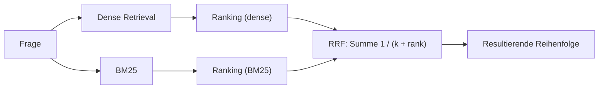
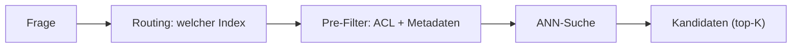

# Wie Ergebnislisten zusammengeführt werden, wo Late Interaction einzuordnen ist, welche Filter die Kandidatenmenge bestimmen und welche Metrik welche Stufe misst

[Teil 1 der Lektion](./index.md) hat die Retrieval-Schicht von der naiven Vektorsuche über top-K aus aufgebaut: die Frage umformulieren, hybride Suche, Reranking und Filter samt Zugriffssteuerung, angeordnet als zweistufiges Schema aus Recall und danach Precision – alles dafür, dass das Retrieval seltener versagt, der benötigte Chunk also seltener unter den Treffern fehlt. Diese Seite nimmt sich diese Bausteine einzeln vor.

Sie beginnt bei der Frage selbst: Ein hypothetisch erzeugtes Dokument verschiebt sie im Vektorraum – und manchmal in die falsche Richtung. Danach geht es um die Zusammenführung, denn die Scores zweier Retriever lassen sich nicht einfach addieren. Bei der zweiten Stufe steht eine eigene Wahl an: ein Cross-Encoder als Reranker oder ein LLM als Reranker – und zwischen dem Bi-Encoder und dem Cross-Encoder aus Teil 1 liegt Late Interaction. Dann treten der Chunk, auf dem Sie suchen, und der Chunk, den Sie weitergeben, auseinander. Zuletzt entscheiden das Routing und die Platzierung der Filter über die Kandidatenmenge, bevor die Maschinerie des Rankings überhaupt an die Reihe kommt; welche Metrik welche Stufe misst, steht am Ende der Seite.

Teil 1 wird durchgehend vorausgesetzt: Die vier Schichten, das zweistufige Schema und das Fehlerbild des Retrievals als Rahmen werden nicht neu erklärt; die Seite baut darauf auf.

Zuvor eine Grenze. Alles hier ist *statisches* Retrieval: ein Durchgang, vorab festgelegt, ohne Schleife. Sobald das Modell das Retrieval selbst noch einmal anstößt – neu formulieren, erneut abrufen, prüfen, ob es genug hat, aufhören –, sind Sie bei der iterativen Variante, und dieses Gebiet (Self-RAG, CRAG, die Prüfung auf hinreichenden Kontext, die gelernte Wahl der Route für die jeweilige Frage) gehört in die [Vertiefung zu Agentic RAG](../../part-2-agents/agentic-rag/deep-dive.md). Diese Seite holt aus dem einen Durchgang heraus, was herauszuholen ist.

## HyDE: was es verschiebt und wann es nach hinten losgeht

Teil 1 hat **HyDE** (*hypothetical document embeddings*) als „eine hypothetische Antwort skizzieren, sie einbetten, damit suchen“ eingeführt. Der Mechanismus ist planvoller, als dieser eine Satz vermuten lässt (Gao et al., 2022). Ein Modell, das Anweisungen befolgt, schreibt für die Frage ein hypothetisches Antwortdokument, **Zero-Shot** (ohne Trainingsbeispiele). Ein unüberwacht trainierter kontrastiver Encoder – im Paper Contriever – bettet *dieses Dokument* ein, und gesucht wird im Korpus mit dessen Vektor, nicht mit dem der Frage. Im Detail liegt das erfundene Dokument oft falsch; das macht nichts. Der dichte Encoder ist ein verlustbehafteter Flaschenhals: Er behält das Relevanzmuster und wirft die erfundenen Einzelheiten weg, sodass die Suche wieder bei echten Nachbarn landet.

Warum das hilft, ist eine Frage der Geometrie. Eine kurze Frage und ihre Antwort liegen im Vektorraum weit auseinander – andere Gestalt, andere Länge, anderer Wortschatz. Das ist die **Asymmetrie zwischen Frage und Antwort**: Sie suchen mit einem frageförmigen Vektor nach antwortförmigen Chunks. Eine hypothetische Antwort in Dokumentform landet in der Nachbarschaft echter Antwort-Chunks, und die Suche nach dem nächsten Nachbarn hat es dadurch leichter. Wo sich das am meisten auszahlt, verrät das Paper selbst: HyDE zieht *ganz ohne Labels* mit nachtrainierten Retrievern gleich, und deshalb ist der Gewinn dort am größten, wo Zero-Shot gearbeitet oder sprachübergreifend gesucht wird und keine Trainingsdaten aus der eigenen Domäne vorliegen.

Dieselbe Einordnung sagt Ihnen auch, wann Sie die Finger davon lassen.

- **Es liegt auf dem kritischen Pfad.** Bevor überhaupt gesucht wird, muss ein LLM zu jeder einzelnen Frage erst ein vollständiges Dokument erzeugen. Wo für die Latenz eine Obergrenze gilt, ist damit meist schon alles gesagt.
- **Es halluziniert an der Sache vorbei.** Bei einem Nischenthema, einem ganz frischen oder einem dem Modell wirklich unbekannten Thema erfindet es ein plausibles Dokument, das *weg* von Ihrem Korpus zeigt, und Sie suchen gegen eine Fiktion – schlechter, als mit der nackten Frage zu suchen.
- **Der Nutzen nimmt ab, je besser Ihr Retriever wird.** Gemessen wurden die großen Sprünge gegen unüberwacht trainierte Retriever. Ein gut nachtrainierter Dense Retriever aus der eigenen Domäne schließt einen Großteil der Asymmetrie bereits selbst, und der Spielraum für HyDE wird kleiner oder verschwindet ganz.
- **Es verwässert Fragen nach exakten Token.** Bei einem Fehlercode, einer Teilenummer, einem Personennamen begräbt ein weitschweifiges Hypothesendokument genau das eine Wort, auf das es ankommt – und die hybride Suche mit BM25 trifft solche Fälle ohnehin schon.

Das Fazit fällt darum eng aus: Greifen Sie zu HyDE, wenn Sie keine Labels aus der eigenen Domäne haben und die Fragen kurz und unterbestimmt sind. Lassen Sie es, wenn die Latenz Sie bindet, wenn der Retriever schon nachtrainiert ist oder wenn exakt gesucht wird.

## Warum sich die Scores zweier Retriever nicht einfach addieren lassen

Die hybride Suche war in Teil 1 der mit Abstand größte Fortschritt, und im Wort „zusammenführen“ hat sie ein echtes Problem versteckt. Die Ähnlichkeit im Dense Retrieval ist beschränkt – die Kosinus-Ähnlichkeit liegt ungefähr in [-1, 1], oft zusammengedrückt auf [0, 1]. BM25 ist unbeschränkt, und seine Skala verschiebt sich mit dem Korpus und mit der Frage. Die beiden Skalen sind unvereinbar, und deshalb lassen sich die Scores nicht addieren. Alle Verfahren zur **Zusammenführung der beiden Ergebnislisten** umgehen dieses Problem auf die eine oder andere Weise.

Die eine Familie bringt die Skalen in Ordnung. Die **score-basierte Zusammenführung** normiert beide Retriever auf einen gemeinsamen Bereich und bildet dann die gewichtete Summe. Die Min/Max-Normierung bildet jeden Score über `(s − min) / (max − min)` auf [0, 1] ab; die Z-Score-Normierung standardisiert über `(s − mean) / std`. Danach gilt `combined = α·norm(dense) + (1 − α)·norm(sparse)`, wobei α der Regler zwischen Bedeutung und exakter Übereinstimmung ist. Die *Größenordnung* der Scores bleibt dabei erhalten – ein Treffer, der allen anderen davonläuft, bleibt sichtbar der beste –, und genau das ist ihr Reiz. Anfällig ist sie trotzdem: Die Min/Max-Normierung über die Kandidatenmenge einer einzelnen Frage reagiert empfindlich, sobald der höchste Score ein Ausreißer ist, und weil die Verteilung der Scores von Frage zu Frage anders aussieht, passt eine einmal festgelegte Normierung für die nächste Frage schon nicht mehr.

Die andere Familie traut den Scores von vornherein nicht und führt die beiden Listen anhand der Ränge zusammen statt anhand der Werte – die **rangbasierte Zusammenführung**. **Reciprocal Rank Fusion (RRF)** (Cormack, Clarke und Büttcher, SIGIR 2009) ist ihr Standardvertreter: Sie wirft die rohen Scores weg und behält allein den Rang:

```text
score(d) = Σ über die Listen  1 / (k + rank_i(d))
```

Die Konstante `k = 60` ist der empirische Vorgabewert aus dem Paper. Der Wert dämpft, wie steil der Beitrag eines Dokuments mit dem Rang fällt. So kann ein einzelner erster Platz die resultierende Reihenfolge nicht beherrschen. Eine gewichtete Variante, `Σ wᵢ / (k + rankᵢ(d))`, lässt Sie einen Retriever bevorzugen. RRF braucht keine Score-Normierung – darin liegt seine Robustheit: Es umgeht das Normierungsproblem, statt es zu lösen, und ist deshalb in vielen Vektordatenbanken das voreingestellte Verfahren zum Zusammenführen.



Der Nachteil der rangbasierten Zusammenführung ist das Gegenstück zur Schwäche der score-basierten. RRF ist einfach und robust, aber blind für die Größenordnung – ein Treffer, der das ganze Feld weit hinter sich lässt, wird als „Rang 1“ verbucht und sonst nichts. Die score-basierte Zusammenführung behält diese Größenordnung, verlangt für ihre Verlässlichkeit aber eine sorgfältige Normierung, die die Verteilung kennt und für jede Frage neu ansetzt. Nehmen Sie deshalb RRF als Voreinstellung und wechseln Sie erst dann zur score-basierten Zusammenführung, wenn Sie tatsächlich gemessen haben, dass die Größenordnung für Ihre Daten ein Signal trägt, *und* wenn Sie sie für jede Frage zuverlässig normieren können. Wer zuerst zur score-basierten Zusammenführung greift, erbt ihre Anfälligkeit, ohne ihren Ertrag zu bekommen.

## Welcher Reranker – und wann

Die zweite Stufe bewertet die top-K neu; der Cross-Encoder aus Teil 1 kodiert dafür Frage und Passage gemeinsam. Auf dieser Ebene stellt sich die Frage, *welche Art* von Reranker es sein soll, und entschieden wird sie über den Zielkonflikt zwischen Latenz und Qualität.

Der **Cross-Encoder als Reranker** ist ein eigens trainiertes Modell – trainiert auf einem Relevanzdatensatz wie MS MARCO –, das jedes Paar aus Frage und Passage gemeinsam bewertet, mit einem Vorwärtsdurchlauf je Kandidat und damit O(K) für den ganzen Stapel. Er ist klein, mit typischerweise rund 100 Millionen Parametern, kostet pro Paar wenig, antwortet schnell und liefert einen deterministischen Score, auf den sich ein Schwellenwert anwenden lässt. Diese Kombination macht ihn zur Voreinstellung im Produktivbetrieb: berechenbarer Preis, berechenbare Ausgabe, hoher Durchsatz.

Der **LLM-Reranker** übergibt das Relevanzurteil per Prompt an ein allgemeines Modell, und er tritt in drei Spielarten auf, die auseinanderzuhalten sich lohnt:

- **Pointwise** – jede Passage für sich bewerten, unabhängig von den anderen.
- **Pairwise** – jeweils zwei Passagen vergleichen und die Siege aufaddieren.
- **Listwise** – eine ganze Liste innerhalb eines einzigen Prompts ordnen, nach Art von RankGPT.

Seine Stärken sind die, die ein trainierter Cross-Encoder nicht bieten kann: Zero-Shot, keine Trainingsdaten – und er *befolgt Anweisungen*, etwa „bevorzuge Aktuelles“ oder „bevorzuge die maßgebliche Quelle“. Damit fließt echtes Abwägen in die Reihenfolge ein. Bezahlt wird das mit dem, was ein allgemeines Modell immer mitbringt: teuer, langsam, ein Tokenpreis, der mit dem Produkt aus Zahl und Länge der Passagen wächst, eine nicht deterministische Ausgabe, die Sie anschließend parsen müssen – und, allein bei der Listwise-Spielart, Empfindlichkeit gegenüber der *Reihenfolge* der Eingabe sowie eine Obergrenze, die das Kontextfenster setzt.

Damit steht fest, wo sich welches Verfahren bezahlt macht. Der Cross-Encoder ist die Voreinstellung überall dort, wo die Latenz bindet und viele Anfragen pro Sekunde eintreffen. Der LLM-Reranker ist für die Fälle da, in denen Qualität vor Latenz geht, das Volumen klein ist oder die Reihenfolge wirklich eine über Anweisungen gesteuerte Relevanz braucht. Verbreitet ist die Kombination aus beiden: Ein Cross-Encoder bewertet zunächst die gesamten top-K neu, und das LLM bewertet nur die Handvoll neu, die davon übrig bleibt – Sie kaufen das Befolgen von Anweisungen für wenige Kandidaten ein, statt es über den ganzen Stapel zu bezahlen.

## Late Interaction liegt zwischen Bi-Encoder und Cross-Encoder

Drei Verfahren des Retrievals liegen auf einer Achse, und erst die gemeinsame Benennung macht das dritte lesbar. Ein **Bi-Encoder** – der Dense Retriever aus Teil 1 – kodiert jedes Dokument vorab zu einem einzigen Vektor; beim Suchen besteht die Interaktion aus einem Skalarprodukt. Billig, vorberechenbar und grob, denn eine ganze Passage wird in einen einzigen Punkt gepresst. Am anderen Ende steht der Cross-Encoder: Er kodiert Frage und Dokument gemeinsam, weshalb sich nichts vorberechnen lässt, und er ist der genaueste und der teuerste – deshalb bewertet er immer nur K Kandidaten neu und durchsucht nie das Korpus.

**Late Interaction**, eingeführt mit **ColBERT** (Khattab und Zaharia, SIGIR 2020), liegt dazwischen. Statt eines Vektors je Dokument entsteht ein Bündel von Vektoren, eines je Token – eine **Multi-Vector-Darstellung** –, und die Tokenvektoren des Dokuments werden vorab berechnet, genau wie beim Bi-Encoder. Die Interaktion wird auf den Zeitpunkt der Bewertung verschoben. Für jedes Token der Frage nimmt **MaxSim** die größte Kosinus-Ähnlichkeit über alle Tokenvektoren des Dokuments, und der Relevanzscore ist die Summe dieser Maxima über die Token der Frage. „Late“ ist das Wort, an dem alles hängt: Der feinkörnige Abgleich auf Tokenebene geschieht *nach* dem unabhängigen Kodieren, zum Zeitpunkt der Bewertung – im Gegensatz zur „frühen“ Interaktion eines Cross-Encoders, der Frage- und Dokumenttoken schon in der ersten Schicht seines Transformers aufeinander achten lässt.

Was Sie bekommen, ist der größte Teil der Genauigkeit, die ein Cross-Encoder auf Tokenebene erreicht – stark bei exakten Treffern, bei Eigennamen und bei der Übertragung auf fremde Domänen –, und zugleich bleibt die Dokumentseite vorberechenbar, sodass sich ein ganzes Korpus durchsuchen lässt und nicht nur K Kandidaten neu bewerten. Bezahlt wird das mit Speicher, und zwar reichlich: ein Vektor *je Token* statt je Chunk bedeutet Hunderte von Vektoren je Passage. ColBERTv2 (2021) komprimiert zusätzlich die **Residuen** – die Abweichungen der einzelnen Tokenvektoren von einem gemeinsamen Zentroiden – und senkt damit den Platzbedarf. Und der Index ist keine schlichte **ANN**-Suche (*approximate nearest neighbour*: die Suche nach den ungefähren nächsten Nachbarn, die Genauigkeit gegen Geschwindigkeit tauscht) über einen Vektor je Dokument, sondern verlangt eine eigens darauf ausgelegte Suchinfrastruktur. Dieser Preis für Speicher und Infrastruktur, nicht etwa eine Schwäche in der Qualität, ist der Grund, warum Late Interaction ein starker Mittelweg bleibt und nicht zur Voreinstellung wird.

## Das Chunk-Problem von beiden Enden angehen

Die Ingestion hat eine Spannung ungelöst hinterlassen. Ein kleiner Chunk ergibt ein trennscharfes Embedding und wird genau gefunden, gibt dem Modell aber zu wenig an die Hand. Ein großer Chunk trägt den Kontext, den das Modell braucht, aber sein Embedding ist unscharf und ohne Fokus, und er wird deshalb schlechter gefunden. Die Einheit, die sich gut durchsuchen lässt, und die Einheit, aus der das Modell eine gute Antwort baut, sind nicht dieselbe – und diese Lücke lässt sich an beiden Enden der Pipeline schließen.

**Das Parent-Document-Retrieval** – auch *small-to-big* genannt – setzt beim Suchen an. Indexiert und durchsucht werden kleine *Child*-Chunks, weil sich damit genau treffen lässt; zurück an das Modell geht aber der umschließende *Parent*: der größere Abschnitt oder das Dokument, aus dem das Child stammt. Die Einheit, auf der gesucht wird, und die Einheit, die als Kontext dient, werden bewusst entkoppelt. Die Variante mit dem Satzfenster ruft einen einzelnen Satz ab und weitet ihn auf ein Fenster darum herum aus; die Parent-Child-Variante ruft einen Child-Chunk ab und gibt dessen Parent-Abschnitt zurück. So oder so wird genau die richtige Stelle gefunden, und das Modell bekommt trotzdem genug Kontext, um daraus eine Antwort abzuleiten.

**Das Contextual Retrieval** (Anthropic, September 2024) setzt beim selben Problem an, nur beim Indexieren. Vor dem Einbetten stellt es jedem Chunk einen kurzen, vom Modell erzeugten **Kontextvorspann** von 50 bis 100 Token voran, der den Chunk im Gesamtdokument verortet: *„Dieser Chunk stammt aus dem 10-K von ACME für Q2 2023, Abschnitt Umsatz …“* Anschließend wird der so angereicherte Chunk eingebettet *und* mit BM25 indexiert, sodass das Embedding selbst nun Dokumentkontext trägt, den ein nackter Chunk weggeworfen hatte. Das **Prompt-Caching** – der gleichbleibende Teil des Prompts bleibt beim Anbieter zwischengespeichert und wird nicht für jeden Chunk neu berechnet – macht es billig, diesen Vorspann für jeden Chunk zu erzeugen: in der Größenordnung von 1,02 $ je Million Dokumenttoken. Gemessen wurde, wie oft das Retrieval bei top-20 versagt. Ohne die folgenden Verfahren war das bei 5,7 % der Fragen der Fall – diese **Baseline** (der Ausgangswert) sinkt mit jeder Stufe:

- Die kontextualisierten Embeddings allein senken die Quote um 35 % (5,7 % → 3,7 %).
- Kommt BM25 auf denselben Chunks dazu, sind es insgesamt 49 % (→ 2,9 %).
- Kommt obendrauf das Reranking, sind es insgesamt 67 % (→ 1,9 %).

Lesen Sie die letzte Zeile richtig: Das Contextual Retrieval ersetzt die hybride Suche und das Reranking nicht, es verstärkt sie. Und stellen Sie die beiden Verfahren nebeneinander, denn sie beheben denselben Mangel an zwei verschiedenen Stellen – das Parent-Document-Retrieval reichert an, was Sie *zurückgeben*, und zwar erst beim Suchen; das Contextual Retrieval reichert an, was Sie *indexieren*, und zwar schon bei der Ingestion. Dasselbe Problem, zwei Ansatzstellen, und nichts hindert Sie daran, beide zu nutzen.

## Wie die richtige Kandidatenmenge zustande kommt

Alle Verfahren oben setzen voraus, dass der richtige Chunk irgendwo in der Kandidatenmenge steckt. Ob er überhaupt dorthin gelangt, entscheiden das Routing und das Filtern – und damit stehen beide ganz am Anfang der Kette, wo Fehler am leichtesten passieren und sich am schwersten wieder gutmachen lassen.

**Das Routing der Frage** ist die vorab getroffene Entscheidung darüber, *wo und wie* eine bestimmte Frage gesucht wird: welcher Index oder welche Sammlung, ob überhaupt abgerufen wird, Dense Retrieval oder hybride Suche, welcher Ausschnitt nach Metadaten. Der Router kann eine handgeschriebene Regel sein, ein Klassifikator oder ein LLM. Worauf es hier ankommt, ist die Position, nicht der Mechanismus: Bei falschem Routing war der richtige Chunk nie ein Kandidat, und kein noch so gutes Reranking weiter hinten in der Kette holt ein Dokument zurück, das in der Kandidatenmenge fehlt. (Die gelernte Fassung je Frage – Adaptive RAG – ist eine Entscheidung innerhalb der Schleife und steht in der [Vertiefung zu Agentic RAG](../../part-2-agents/agentic-rag/deep-dive.md); hier ist die Entscheidung über das Routing statisch und wird einmal getroffen.)

Das Routing hat außerdem Ziele, die diese Lektion nicht baut. „Welcher Index“ setzt stillschweigend voraus, dass jeder Zweig in einer Vektorsuche endet; manche Fragen brauchen stattdessen einen strukturierten Weg – ein Aggregat, das ein top-K schlicht nicht rechnen kann, oder eine Frage an das ganze Korpus, die kein einzelner Chunk beantwortet. Wohin diese Zweige führen und wann sie sich überhaupt zu bauen lohnen, ist das Thema von [strukturiertem Wissen](../structured-knowledge/index.md); der Router ist das, was eine Frage einen davon hinunterschickt.

Beim Filtern stellt sich eine Frage der Platzierung, die über Richtigkeit und Geschwindigkeit zugleich entscheidet: Läuft das Prädikat auf Metadaten oder ACL vor der Vektorsuche oder nach ihr?

- **Der Pre-Filter** wendet das Prädikat vor oder während der Suche an, sodass nur solche Vektoren überhaupt Kandidaten werden, die es erfüllen. Er *garantiert* K Ergebnisse, die dem Filter genügen, und für die Zugriffssteuerung ist er Pflicht. Bezahlt wird das mit Leistung: Ein sehr scharfer Filter arbeitet gegen den ANN-Index, weil der Durchlauf durch den **HNSW**-Graphen (die verbreitete Indexstruktur hinter der ANN-Suche) immer wieder auf Knoten stößt, die der Filter ausgeschlossen hat; im schlimmsten Fall nähert er sich der vollständigen Suche über alle Vektoren an – es sei denn, die Vektordatenbank beherrscht die gefilterte Suche von Haus aus.
- **Der Post-Filter** lässt zuerst eine gewöhnliche ANN-Suche laufen und wirft danach weg, was das Prädikat nicht erfüllt. Das ist schnell, weil die Suche unbehindert läuft. Bei einem scharfen Filter rufen Sie aber K Vektoren ab und verwerfen die meisten oder alle davon, sodass am Ende *weniger* als K Ergebnisse übrig bleiben, manchmal gar keines – das Problem der leeren Trefferliste, bei dem eine völlig einwandfreie Frage nichts zurückgibt, weil der Filter sämtliche abgerufenen Treffer verworfen hat.

Die Abwägung lautet also: Der Pre-Filter ist richtig, kann aber langsam werden; der Post-Filter ist schnell, kann aber zu wenig zurückgeben. Ein Fall nimmt Ihnen die Wahl ganz ab: Die Zugriffssteuerung ist nie ein Post-Filter. Eine Berechtigungsprüfung nach dem Retrieval kommt zu spät – in die Reihenfolge sind dann bereits Inhalte eingeflossen, die die fragende Person gar nicht sehen darf, und zurückgeben kann das System am Ende stillschweigend zu wenig. Die Berechtigungen müssen die Kandidatenmenge schon vor der Suche einschränken, genau so, wie es die Sicherheitsanforderung aus Teil 1 verlangt hat. Moderne Vektordatenbanken bieten zunehmend eine einstufige gefilterte ANN-Suche an, die das Prädikat in den Durchlauf hineinzieht; so bekommen Sie Richtigkeit und Geschwindigkeit zusammen, statt das eine gegen das andere einzutauschen.



## Welche Metrik welche Stufe misst

Teil 1 hat versprochen, dass die Metriken in der Schicht [Evaluierung](../cross-cutting/evaluation/index.md) formal gefasst werden, und dort steht die vollständige Behandlung auch. Für die Arbeit am Retrieval genügt zunächst die Frage, welche Metrik welche Stufe misst. Recall@K – ist der benötigte Chunk in den top-K gelandet? – ist die Metrik der ersten Stufe und misst das Fehlerbild des Retrievals unmittelbar. Precision@K ist der Anteil der top-K, der relevant ist. Zwei weitere bewerten die *Reihenfolge*, die der Reranker erzeugt.

**MRR** (mean reciprocal rank) nimmt `1 / rank` des *ersten* relevanten Treffers und mittelt über die Fragen. Die Metrik belohnt es, eine richtige Antwort weit oben zu platzieren, und ist blind für alles nach diesem ersten Treffer – und damit ist sie die richtige Wahl, wenn es im Kern nur eine richtige Antwort gibt: bei der Suche nach einem bekannten Objekt oder nach einer bestimmten Seite, bei der der zweitbeste Treffer per Definition ohne Belang ist.

**nDCG** (normalized discounted cumulative gain) bewertet das gesamte Ranking mit abgestufter Relevanz. `DCG = Σ rel_i / log2(i + 1)` summiert die Relevanz jedes Treffers, abgewertet nach seiner Position, sodass ein relevantes Dokument tief in der Liste weniger beiträgt; die Division durch den DCG der idealen Reihenfolge (IDCG) normiert das Ergebnis auf [0, 1]. Wo MRR binär ist, auf den ersten Treffer schaut und danach blind wird, ist nDCG abgestuft, nimmt die ganze Liste und wertet nach Position ab – die richtige Wahl also, wenn Relevanz in Graden kommt und die gesamte Reihenfolge zählt.

Der rote Faden hält die ganze Seite zusammen: Messen Sie dort, wo Sie etwas verändern. Recall@K sagt Ihnen, ob der Retriever der ersten Stufe die Antwort überhaupt in die Kandidatenmenge gebracht hat; nDCG oder MRR sagen Ihnen, ob der Reranker sie danach richtig eingeordnet hat. Verwenden Sie in der ersten Stufe eine Ranking-Metrik oder beim Reranker Recall@K, dann sind Sie blind für genau den Fehler, den Sie beheben wollen.

## Das Wichtigste

- HyDE sucht mit einer eingebetteten hypothetischen Antwort und überbrückt damit den Abstand zwischen der Gestalt einer Frage und der Gestalt ihrer Antwort; am meisten gewinnt es ohne Labels aus der eigenen Domäne und bei kurzen Fragen, und es geht nach hinten los, wo die Latenz gedeckelt ist, wo der Retriever schon nachtrainiert ist, wo exakt gesucht wird und bei fremden Themen, zu denen das Modell ein Dokument erfindet, das von Ihrem Korpus wegzeigt.
- Die Scores von Dense Retrieval und BM25 liegen auf unvereinbaren Skalen und lassen sich nicht addieren: Die rangbasierte Zusammenführung ist die robuste Voreinstellung, weil sie keine Score-Normierung braucht, und die score-basierte lohnt ihre Anfälligkeit erst, wenn Sie gemessen haben, dass die Größenordnung ein Signal trägt, das Sie für jede Frage normieren können.
- Ein trainierter Cross-Encoder ist der Reranker der Wahl, wenn es schnell, deterministisch und mit hohem Durchsatz laufen soll; ein LLM-Reranker bringt dafür Zero-Shot und eine über Anweisungen gesteuerte Reihenfolge mit, kostet aber echtes Geld und liefert kein deterministisches Ergebnis – und beide lassen sich verbinden: Der Cross-Encoder nimmt sich alle K Kandidaten vor, das LLM nur die wenigen, die übrig bleiben.
- Zwischen dem Encoder mit einem einzigen Vektor und dem gemeinsam kodierenden Encoder liegt der vorberechnete Abgleich Token für Token, bewertet mit MaxSim: Er behält den größten Teil der feinkörnigen Genauigkeit und kann ein ganzes Korpus durchsuchen, und der Speicherbedarf – ein Vektor je Token – ist der einzige Grund, warum er nicht die Voreinstellung ist.
- Der Chunk, der sich gut durchsuchen lässt, und der Chunk, aus dem sich gut antworten lässt, treten auseinander; reichern Sie beim Suchen an, was Sie zurückgeben, oder backen Sie den Dokumentkontext vor dem Einbetten in das hinein, was Sie indexieren – und beides ersetzt die hybride Suche und das Reranking nicht, sondern kommt obendrauf.
- Routing und die Platzierung der Filter entscheiden über die Kandidatenmenge, bevor irgendein Ranking läuft: Eine falsche Route oder eine zu spät angewandte Berechtigungsprüfung verliert die Antwort dort, wo weiter hinten in der Kette nichts sie mehr zurückholen kann – die Zugriffssteuerung greift deshalb immer vor der Suche.

**[Neue Begriffe](../../glossary.md#retrieval)**: score fusion / score normalisation, LLM reranker, late interaction / ColBERT, multi-vector retrieval, contextual retrieval, query routing, pre-filter / post-filter.
