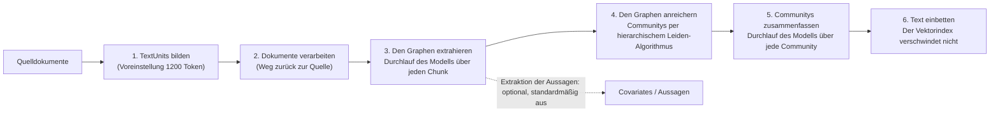

# Wie ein Graph entsteht, wozu die vier Standards da sind und wo abgefragt wird

[Teil 1](./index.md) hat drei Entscheidungen getroffen: wann es sich überhaupt lohnt, Struktur herauszuziehen, wann sich der Aufbau eines Graphen rechnet, und was eine semantische Schicht einbringt, sobald zwei Leute über eine Zahl uneins sind. Er ist mit Absicht auf der Ebene der Entscheidung geblieben. Diese Seite nimmt die Maschinerie darunter auseinander: wie eine Extraktionspipeline aus Prosa einen Graphen macht und was das je Stufe kostet, warum der Schritt des Zusammenführens der Punkt ist, an dem solche Projekte tatsächlich enttäuschen, warum die Metriken des Retrievals, die Sie bereits haben, nichts darüber sagen können, ob ein Graph etwas taugt, was die vier Standards des formalen Unterbaus – RDF, OWL 2, SHACL, SPARQL – jeweils *tun*, und warum es schwerer ist, ein Modell auf ein Warehouse-Schema anzusetzen, als auf eine Definition von Kennzahlen. Die Abfrageseite – die vier Abfragemethoden des Graphen, Text-to-SQL gegen eine semantische Schicht und der Router vor beidem – ist das letzte Drittel der Seite.

Eine Grenze noch vorweg. Alles hier ist weiterhin **statisch**: Die Struktur entsteht vor der Frage, und die Frage sucht sich einen Weg hindurch. In dem Moment, in dem das System selbst darüber befindet, ob es noch einmal nachsieht – ob es also umformuliert, erneut abruft, die Hinlänglichkeit beurteilt –, sind Sie bei [Agentic RAG](../../part-2-agents/agentic-rag/deep-dive.md), dessen Schleife den Graphen als ein Tool unter vielen aufrufen kann. Die Entscheidungen aus Teil 1 gelten hier durchgehend und werden nicht neu begründet.

## Wie ein Graph tatsächlich entsteht

Microsofts GraphRAG ist die Referenzimplementierung, an der man das Ganze am besten nachvollzieht – weil die Leserschaft von ihr gehört hat und weil ihre Pipeline Stufe für Stufe dokumentiert ist. Ihr [Ablauf der Indexierung](https://microsoft.github.io/graphrag/index/default_dataflow/) läuft in sechs Phasen:

1. **TextUnits bilden** – die Quelldokumente in Chunks zerlegen. Die Voreinstellung liegt bei 1200 Token, und schon das ist eine Entwurfsentscheidung: Größere Einheiten bedeuten weniger Aufrufe für die Extraktion und mehr Entitäten je Aufruf – und eine geringere Wahrscheinlichkeit, dass das Modell dem richtigen Paar auch die richtige Beziehung zuschreibt.
2. **Dokumente verarbeiten** – hier entsteht die Dokumententabelle, damit die herausgezogenen Fakten auf ihre Quelle zurückverfolgbar bleiben.
3. **Den Graphen extrahieren** – ein Durchlauf des Sprachmodells, der **Entitäten**, **Beziehungen** und **Covariates** erzeugt: Letztere sind in GraphRAGs Vokabular die an eine Entität gehängten Aussagen, jede mit eigenem Prüfstatus und eigener Zeitangabe. Das ist die teure Phase und die, die darüber entscheidet, ob weiter hinten überhaupt etwas stimmt.
4. **Den Graphen anreichern** – im Entitätengraphen werden Gruppen gebildet, und daraus entsteht die Tabelle der Communitys.
5. **Communitys zusammenfassen** – ein Durchlauf des Sprachmodells über jede Community, der die **Community-Reports** erzeugt.
6. **Text einbetten** – Vektoren, denn der Graph ersetzt den Vektorindex nicht.

Zwei Einzelheiten aus dieser Liste lohnt es sich herauszuheben – die eine erklärt, warum globale Fragen überhaupt funktionieren, die andere verändert Ihre Kalkulation des Aufbaus.

Die Gruppen entstehen mit dem **hierarchischen Leiden-Algorithmus**, rekursiv angewandt. Dieses *hierarchisch* ist der Mechanismus hinter der ganzen Geschichte mit den globalen Fragen: Die Gruppenbildung liefert keine flache Aufteilung, sondern ineinandergeschachtelte Ebenen, sodass es einen Report sowohl für eine kleine, eng verbundene Gruppe gibt als auch für den größeren Bereich, der sie enthält. Jeder Report enthält eine knappe Übersicht und verweist auf seine wichtigsten Entitäten, Beziehungen und Aussagen. Deshalb liegt für eine Frage an das ganze Korpus überhaupt etwas Lesbares bereit: Jemand – ein Sprachmodell, beim Aufbau, auf Ihre Rechnung – hat die Zusammenfassung bereits geschrieben.

**Die Extraktion der Aussagen ist optional und standardmäßig ausgeschaltet.** Die Dokumentation sagt ausdrücklich, sie „erfordert im Allgemeinen eine Anpassung der Prompts, um nützlich zu sein“. Das ist eine ungewöhnlich ehrliche Voreinstellung und ein brauchbares Signal: Der Anbieter sagt Ihnen damit, dass der reichhaltigste Teil der Extraktion zugleich der ist, der am stärksten an Ihrer Domäne hängt. Wer Ihnen die Kosten eines Graphenaufbaus aus einer Vorführung heraus nennt, hat sie mit ziemlicher Sicherheit nicht eingeschaltet.

Halten Sie nun die Phasen gegen die Rechnung. Phase 3 und Phase 5 sind beide Durchläufe des Sprachmodells über das gesamte Korpus – einer über jeden Chunk, einer über jede Community. Genau das meinte Teil 1 damit, die Extraktion wie einen Durchlauf über alles zu bepreisen, und genau deshalb gibt es [LazyGraphRAG](https://www.microsoft.com/en-us/research/blog/lazygraphrag-setting-a-new-standard-for-quality-and-cost/) überhaupt: Es schiebt eben diese Läufe auf den Zeitpunkt der Abfrage und gibt die Kosten der Indexierung mit „identisch mit Vektor-RAG und 0,1 % der Kosten eines vollständigen GraphRAG“ an. Fällt bei Ihnen wenig globales Fragevolumen an, ist das Aufschieben die bessere Wahl – und das ist eine Entwurfsmöglichkeit, die Ihnen offensteht, keine feste Eigenschaft von Graphen.

## GraphRAGs vier Abfragemethoden – und welche Frage jede bedient

Ein Graph ist nicht ein Retrieval-Modus. GraphRAGs [Abfragemethoden](https://microsoft.github.io/graphrag/query/overview/) sind vier verschiedene Wege über denselben Index, und zwischen ihnen zu wählen ist der größere Teil der Ingenieursarbeit:

| Methode | Arbeitet über | Die Frage, für die sie da ist |
|---|---|---|
| **Local Search** | den extrahierten Graphen **plus** die Roh-Chunks | eine bestimmte Entität und ihre Nachbarschaft |
| **Global Search** | alle Community-Reports, per Map-Reduce | das Korpus als Ganzes |
| **DRIFT Search** | Kontext aus den Communitys, in die lokale Suche eingefaltet | eine lokale Frage, die einen breiteren Rahmen braucht |
| **Basic Search** | TextUnits nach Vektorähnlichkeit | die Vergleichsgrundlage, also gewöhnliches RAG |

**Local Search** liest die Chunks weiterhin. Sie „kombiniert die einschlägigen Daten aus dem von der KI extrahierten Knowledge Graph mit Textchunks der Rohdokumente“ – der Graph liefert die Struktur, die Belege liefert nach wie vor die Prosa. Ein Graph befreit Sie nicht von gutem Chunking; er setzt darauf auf.

**Global Search** ist Map-Reduce über jeden Community-Report, und die Dokumentation nennt sie „ressourcenintensiv“. Jede globale Frage wird über die Menge der Reports verteilt, und ihre Teilantworten werden anschließend zu einer einzigen Antwort zusammengeführt. Die Kosten eines Graphen stecken also nicht nur in seinem Aufbau: Die Fragen, die den Aufbau gerechtfertigt haben, sind auch die teuren im Betrieb.

**DRIFT** gibt es, weil die Trennung zwischen lokal und global zu sauber ist. Die Methode verfeinert eine Frage mithilfe des Kontexts aus den Communitys zu Anschlussfragen und setzt damit breiter an. Das ist die Zerlegung der Frage – das Verfahren, das [Agentic RAG](../../part-2-agents/agentic-rag/index.md) bereits lehrt –, angewandt innerhalb des Graphsystems. Die Arbeit am Graphen und die Arbeit an Agenten landen immer wieder bei denselben Verfahren.

Die Referenzimplementierung liefert gewöhnliches Vektor-RAG als vollwertige Abfragemethode mit, ausdrücklich als Vergleichsgrundlage. Was Sie hier auch bauen: Halten Sie die günstige Grundlage lauffähig, denn die interessante Frage lautet nie „funktioniert der Graph“, sondern „schlägt der Graph das viel günstigere Verfahren bei den Fragen, die bei uns tatsächlich ankommen“.

## Bei der Duplikaterkennung enttäuschen Graphprojekte \{#entity-resolution}

Die Enttäuschung steckt in keiner der Phasen oben.

Die Extraktion liefert Ihnen `Acme Corp` aus dem einen Dokument und `Acme Corporation` aus dem anderen. Zu entscheiden, dass das derselbe Knoten ist, heißt **Duplikaterkennung** (*entity resolution*), und das ist ein Forschungsfeld, das älter ist als alles hier – Record Linkage, das Entfernen von Duplikaten, dasselbe Problem, gegen das jedes Projekt zur Stammdatenverwaltung schon gekämpft hat.

Was die verbreiteten Systeme für Graph-RAG tatsächlich dagegen tun, ist weniger, als die meisten annehmen. Eine Untersuchung des Rauschens in diesen Extraktionspipelines ([*Less is More*](https://arxiv.org/html/2510.14271v1)) berichtet, dass Systeme wie Microsofts GraphRAG und LightRAG Entitäten über **den Vergleich der Zeichenketten** zusammenführen – Entitäten mit abweichenden Namen, darunter Aliasse und Abkürzungen, bleiben also getrennte Knoten. Die Folge ist ein Graph, der vollständig aussieht und still zerfasert ist: Alles, was über eine reale Organisation bekannt ist, verteilt sich auf vier Knoten, und ein Durchlauf, der bei einem von ihnen beginnt, sieht nur dessen Ausschnitt.

Das schlägt unmittelbar auf das Versprechen durch. Die Frage *„Alles, was wir über diesen Lieferanten wissen“* – eine der drei Fragen, mit denen Teil 1 begonnen hat – ist genau die Frage, die an der Zerfaserung zerbricht. Und sie zerbricht *lautlos*: Zurück kommt eine selbstsichere Teilantwort. Wird ein Graph also vorgeschlagen, um dieselbe Entität aus verschiedenen Quellen zusammenzuführen, dann beauftragen Sie in Wahrheit eine Duplikaterkennung, an der ein Graph hängt – und kalkulieren die Duplikaterkennung als den Hauptposten.

Der verwandte Fehler sitzt einen Schritt früher. Weil die Extraktion ein Durchlauf des Sprachmodells ist, erzeugt sie Beziehungen, die in keinem Dokument stehen – dieselbe Untersuchung hält fest, dass falsche Fakten in einem Korpus fehlerhafte Tripel in einem maschinell erzeugten Graphen ergeben. Eine halluzinierte Kante ist sachlich schlimmer als ein halluzinierter Satz in einer erzeugten Antwort, denn sie ist *gespeichert*: Sie geht in den Index ein, wird in Phase 5 in einen Community-Report zusammengefasst und wird danach von jeder Abfrage, die diese Nachbarschaft berührt, als belegte Struktur behandelt.

## Die Metriken des Retrievals bewerten keinen Graphen

Die Metriken des Retrievals, die Sie bereits haben, lassen sich nicht übertragen, und die Annahme, sie ließen sich übertragen, ist der Weg, auf dem ein schlechter Graph durchkommt.

Recall@K fragt, ob der richtige Chunk es in die Kandidatenmenge geschafft hat. Über die Frage, ob `Acme Corp –[beliefert]→ Contoso` *wahr* ist, sagt er nichts. Ein Graph kann beim Abrufen von Chunks makellos abschneiden, während seine Beziehungen zu einem erheblichen Teil erfunden sind – die Chunks sind ja echt, ganz gleich, was aus ihnen herausgezogen wurde.

Dafür braucht es drei Messungen, und sie sind voneinander getrennt:

**Precision auf den extrahierten Tripeln, gemessen an einer gelabelten Stichprobe.** Nehmen Sie ein paar hundert extrahierte Tripel, lassen Sie sie von einem Menschen gegen ihren Quelltext prüfen und geben Sie die Quote an. Das ist die Zahl, die niemand erheben will, und die einzige, die etwas über die Richtigkeit sagt. Ziehen Sie die Stichprobe nach Beziehungstyp und nicht gleichmäßig – die Precision auf `mentions` sagt Ihnen nichts über die Precision auf `supplies`.

**Die Güte der Zusammenführung, gesondert.** Fehler beim Zusammenführen gehen in zwei Richtungen, und sie sind nicht symmetrisch. Wer zu viel zusammenführt, verschmilzt zwei reale Organisationen zu einem Knoten und erfindet Verbindungen, die es nicht gibt; wer zu wenig zusammenführt, zerfasert eine Organisation und verdeckt Verbindungen, die es gibt. Geben Sie beides getrennt an, denn eine einzelne Zahl für die „Genauigkeit“ lässt das eine im anderen verschwinden.

**Eine End-to-End-Bewertung der Antworten, und zwar für genau die Fragetypen, die nur der Graph bedienen kann.** War der Graph mit globalen Fragen begründet, muss die Menge für die Bewertung aus globalen Fragen bestehen – und das heißt, jemand muss die richtigen Antworten auf „welche Themen wiederholen sich in diesem Korpus“ aufschreiben, eine wirklich schwierige Labelarbeit. Die Lektion zur [Evaluierung](../cross-cutting/evaluation/index.md) hält die Maschinerie bereit, um frei formulierte Antworten zu bewerten, samt Judge und dessen Grenzen.

Die Kosten der Bewertung eines Graphen verschwinden neben den Kosten des Aufbaus nicht als Rundungsfehler. Sie sind ein zweites Projekt – und das, was am ehesten gestrichen wird, weshalb Organisationen am Ende nicht sagen können, ob der Graph geholfen hat.

## Die vier Standards, nach ihrem Zweck geordnet \{#the-formal-stack-by-purpose}

Alles bisher setzt einen Graphen voraus, den Sie sich selbst extrahieren. Struktur kann aber auch von außen kommen: Jemand legt Ihnen eine Ontologie hin und bittet Sie, die Standards zu übernehmen, auf denen sie steht – eine andere Frage mit einer anderen Antwort.

Vier Standards kommen zur Sprache, sobald über eine Ontologie gesprochen wird, und meist werden sie als ein Paket dargestellt, das man ganz übernimmt. Besser versteht man sie als vier getrennte Werkzeuge, von denen jedes eine Frage beantwortet. Alle vier sind seit Langem verabschiedete W3C-Empfehlungen, und das hat zwei Seiten: Einerseits ist das hier stabiler, interoperabler und besser mit Werkzeugen versorgt als der Vektorstapel; andererseits ist genau das der Grund, warum sich das Ökosystem daneben unmodern anfühlt.

**RDF – wie schreibe ich einen Fakt auf?** Eine Aussage ist ein Tripel: Subjekt, Prädikat, Objekt. Alles Weitere hier setzt darauf auf.

**OWL – was bedeutet das Vokabular, und zwar formal?** [OWL 2](https://www.w3.org/TR/owl2-overview/) (W3C-Empfehlung, 2012) ist „eine Ontologiesprache für das Semantic Web mit formal definierter Bedeutung“. Entscheidend ist das *formal*: eine modelltheoretische Semantik, und die ist es, die eine Maschine in die Lage versetzt, einen Fakt abzuleiten, den niemand hingeschrieben hat. Müssen Sie nie einen Fakt ableiten, den niemand ausgesprochen hat, brauchen Sie OWL nicht – und das ist der beste einzelne Test dafür, ob der formale Unterbau etwas für Sie ist.

OWL beantwortet außerdem den Einwand, der Rechenaufwand dafür sei ruinös, besser, als die meisten erwarten, denn es wurde mit genau diesem Regler entworfen. Es definiert drei **Profile**, die Ausdrucksstärke gegen Berechenbarkeit tauschen: **EL** liefert für alle üblichen Schlussfolgerungsaufgaben Algorithmen mit polynomieller Laufzeit und zielt auf sehr große Ontologien; **QL** erlaubt es, konjunktive Anfragen in LogSpace mit gewöhnlicher relationaler Datenbanktechnik zu beantworten; **RL** liefert polynomielles Schlussfolgern mit regelerweiterter Datenbanktechnik unmittelbar auf den Tripeln. Ein Profil zu wählen ist eine echte Ingenieursentscheidung mit echten Folgen, und „wir nehmen OWL“, ohne eines zu benennen, ist eine noch nicht getroffene Entscheidung.

**SHACL – sind diese Daten überhaupt gültig?** [SHACL](https://www.w3.org/TR/shacl/) (W3C-Empfehlung, 2017) ist „eine Sprache zur Validierung von RDF-Graphen gegen eine Menge von Bedingungen“. Sie validieren einen **Datengraphen** (*data graph*) gegen einen **Shapes-Graphen** (*shapes graph*) und bekommen einen **Validierungsbericht** (*validation report*) zurück. Das ist das Stück, das für Systeme mit einem Sprachmodell am meisten zählt, und zugleich das, das am häufigsten übersprungen wird – denn es ist der deterministische Kontrollpunkt, den ein probabilistischer Erzeuger passieren muss: Der Extraktor schlägt vor, der Shapes-Graph verfügt, und der Bericht sagt Ihnen, welche Bedingung genau verletzt wurde. Warum ein solcher Kontrollpunkt überhaupt in eine Pipeline gehört, begründet [layered gates](/ai-sdlc/part-3-verification/layered-gates) (die Seite liegt nur auf Englisch vor); SHACL ist eine konkrete Art, ihn zu bauen.

**SPARQL – wie frage ich?** [SPARQL 1.1](https://www.w3.org/TR/sparql11-query/) (W3C-Empfehlung, 2013) formuliert „Abfragen über verschiedenartige Datenquellen hinweg, ganz gleich, ob die Daten nativ als RDF vorliegen oder über eine Zwischenschicht als RDF gesehen werden“, und tut das über den Abgleich von Mustern auf einem gerichteten, beschrifteten Graphen. SPARQL auf einer *Sicht* relationaler Daten ist eine reale Betriebsform, und sie bedeutet: Die Abfragesprache zu übernehmen zwingt Sie nicht, Ihre Ablage umzuziehen.

### Das Schema, das die meisten Teams stattdessen bauen sollten

Bilden Sie diese vier auf das ab, was eine Pipeline mit einem Sprachmodell tatsächlich braucht, und die ehrliche Voreinstellung tritt hervor: ein **JSON Schema**, das Ihre Klassen und die zugelassenen Beziehungstypen benennt, plus ein **Validator**, der zurückweist, was dagegen verstößt. Damit ist die Extraktion gebunden – das `works_for`/`employed_by`-Problem aus Teil 1 –, und der deterministische Kontrollpunkt steht. Beides zahlt sich sofort aus, mit Werkzeugen, die im Team ohnehin alle kennen.

Was es Ihnen nicht gibt, sind die Ableitung, die Interoperabilität mit Standards und eine formal prüfbare Bedeutung. Genau das sind die Bedingungen, die [Teil 1](./index.md) für den Aufstieg zum formalen Unterbau nennt, und jede davon ist ein *Grund*, keine Vorliebe. Fehlen sie, ist der formale Unterbau eine große, dauerhafte Verpflichtung, die Sie für einen Nutzen eingehen, den ein Validator bereits liefert.

## Was bei Text-to-SQL wirklich schwierig ist – und was eine semantische Schicht davon abnimmt

Teil 1 hat die Kernaussage für die Kennzahlenschicht festgehalten: Gegen ein rohes Schema muss ein Modell eine Abfrage **herleiten**, gegen eine semantische Schicht **wählt** es eine definierte Kennzahl aus. Die Schwierigkeit beim Herleiten liegt nicht dort, wo man sie vermutet.

Syntaktisch gültiges SQL zu schreiben ist nicht der harte Teil; darin sind Modelle gut. Schwierig ist das, was ein Schema Ihnen nicht sagt:

- **Welche Verknüpfung die fachlich richtige ist.** Zwei Tabellen lassen sich womöglich auf drei Arten verknüpfen; nur eine davon entspricht der Art, wie im Unternehmen gezählt wird. Das Schema erlaubt alle drei.
- **Welche Spalte das fachliche Datum trägt.** `created_at`, `updated_at`, `effective_date`, `ordered_at` – das Datenmodell kann nicht sagen, welche davon „letztes Quartal“ meint.
- **Wie die Werte tatsächlich aussehen.** [BIRD](https://bird-bench.github.io/) gibt es genau deswegen: Seine Werte „behalten ihr ursprüngliches und häufig ‚schmutziges‘ Format“, ein Parser muss also mit nicht standardisierten Werten umgehen, bevor er überhaupt etwas daraus ableiten kann. Ein kuratierter Benchmark verdeckt dieses Fehlerbild vollständig.
- **Wie die fachliche Regel lautet.** „Aktiver Kunde“ ist ein Prädikat, das jemand festgelegt hat. In der DDL steht es nirgends.

Deshalb liegen die BIRD-Zahlen dort, wo sie liegen – **92,96 %** für menschliche Data Engineers gegen **81,95 %** für das führende System, beides Stand der Rangliste vom September 2025. Der verbleibende Abstand ist keine Syntax. Ein großer Teil davon ist Wissen, das in den Köpfen von Menschen steckt – und das in einer semantischen Schicht stehen kann.

Das rückt zurecht, was diese Schicht eigentlich ist. Jede Definition einer Kennzahl, jeder erklärte Verknüpfungsweg, jeder zulässige Filter ist eine dieser Entscheidungen, *einmal getroffen, von jemandem mit Zuständigkeit, in einem Artefakt, das sich prüfen lässt*. dbts [MetricFlow](https://docs.getdbt.com/docs/build/about-metricflow) bildet das in semantischen Modellen ab: Sie tragen **Entitäten** (die Schlüssel für die Verknüpfung), **Dimensionen** (die Arten, nach denen Sie schneiden) und **Measures** (die Größen), und darauf werden die Kennzahlen deklarativ definiert. [LookML](https://docs.cloud.google.com/looker/docs/what-is-lookml) ist „die Sprache, mit der in Looker semantische Datenmodelle erstellt werden“: Das Modell wird einmal geschrieben, und der SQL-Generator erzeugt daraus die datenbankspezifische Abfrage.

Die Aufgabe des Modells schrumpft damit von *vollziehe die fachliche Überlegung dahinter nach* auf *wähle die richtige Kennzahl und die richtigen Dimensionen*. Und das Fehlerbild ändert damit seine Gestalt: Eine falsche Auswahl lässt sich anzeigen – „geantwortet habe ich mit **Nettoumsatz**, geschnitten nach **Region**“ –, während eine subtil falsche Verknüpfung in einer plausibel aussehenden Zahl unsichtbar bleibt.

Zwei weitere Eigenschaften zählen für alle, die einen Agenten davorsetzen.

**Die Steuerung** setzt die Schicht selbst durch; das Modell wird nicht darum gebeten. Cube formuliert es so, dass eine Abfrage „gegen das Datenmodell geprüft wird und die Zugriffsrichtlinien deterministisch auf sie angewendet werden, bevor sie das Warehouse erreicht“ – das ist die Regel der [Vertiefung zum Retrieval](../retrieval/deep-dive.md), vor der Suche zu filtern, von der strukturierten Seite her. Ein Prompt, der ein Modell bittet, die Daten anderer Regionen nicht anzusehen, ist keine Kontrolle; eine Richtlinie, an der die Abfrage nicht vorbeikommt, ist eine.

**Was abfragbar ist**, gibt die Schicht bekannt; das Modell muss es nicht erraten. Cube stellt dafür eine **Meta API** bereit, damit „KI-Agenten herausfinden, was abfragbar ist“. Das ist die strukturierte Entsprechung eines Tool-Schemas, und es beseitigt eine ganze Fehlerklasse, bei der ein Modell eine Kennzahl erfindet, die vernünftig klingt und gar nicht existiert.

## Routing: wie die strukturierten Pfade ausgeliefert werden

Nichts auf dieser Seite ersetzt die Pipeline, die in Ingestion, Retrieval und Generation entstanden ist. Im Produktivbetrieb stehen die strukturierten Pfade *daneben*, und etwas entscheidet, über welchen davon eine Frage läuft:

- Fragen, die etwas nachschlagen, und Fragen danach, was in einem Dokument steht → der Vektorpfad, unverändert;
- Fragen nach Aggregaten und Rechenergebnissen → die semantische Schicht;
- Fragen an das Korpus als Ganzes und an eine Nachbarschaft → der Graph, sofern einer gerechtfertigt war;
- Fragen, die zwei dieser Pfade brauchen → beide, plus ein Schritt, der zusammenführt: der größte offene Punkt, und der, für den niemand eine saubere Antwort hat.

Diese Entscheidung ist das [Routing der Frage](../retrieval/deep-dive.md), das die Vertiefung zum Retrieval bereits aufbaut – verwenden Sie es wieder, statt eine zweite Maschinerie danebenzustellen. Die praktische Warnung: Der Router trifft jetzt eine Entscheidung, die teuer wird, wenn sie falsch ausfällt. Eine Frage nach einem Aggregat den Vektorpfad hinunterzuschicken liefert eine flüssige, mit Quellen versehene, falsche Zahl. Routen Sie nach der *Gestalt* der Frage, halten Sie die Einordnung beobachtbar, und führen Sie das Fehlrouting in der [Vertiefung zur Observability](../cross-cutting/observability/deep-dive.md) als eigenes, nachverfolgtes Fehlerbild – denn wenn es eintritt, sieht es weder nach einem Fehlerbild des Retrievals noch nach einem der Generation aus.

## Das Wichtigste

- GraphRAGs Aufbau hat sechs Phasen, zwei davon sind Durchläufe des Sprachmodells über alles – die Extraktion über jeden Chunk und die Zusammenfassung über jede Community –, und darin steckt die ganze Kostengeschichte in einem Satz. Die Extraktion der Aussagen, der reichhaltigste und am stärksten von der Domäne abhängige Teil, ist standardmäßig aus; Kosten aus einer Vorführung enthalten sie deshalb fast nie.
- Die hierarchische Gruppenbildung mit Leiden ist es, die Fragen an das ganze Korpus beantwortbar macht: Die Zusammenfassung, die für eine globale Frage gelesen wird, wurde beim Aufbau geschrieben, auf Ihre Rechnung.
- Vier Abfragemethoden, nicht eine – Local Search liest auch die Chunks, Global Search ist Map-Reduce und je Frage teuer, DRIFT ist die im Graphen wiederentdeckte Zerlegung der Frage, und die gewöhnliche Vektorsuche wird als Vergleichsgrundlage mitgeliefert, die Sie lauffähig halten sollten.
- Bei der Duplikaterkennung enttäuschen diese Projekte: Die verbreiteten Systeme führen über den Vergleich der Zeichenketten zusammen, Aliasse zerfasern also lautlos, und „alles über X“ liefert eine selbstsichere Teilantwort. Eine halluzinierte Kante ist schlimmer als ein halluzinierter Satz, weil sie gespeichert, zusammengefasst und danach als Struktur angeführt wird.
- Mit den Metriken des Retrievals lässt sich ein Graph nicht bewerten – Sie brauchen Precision auf den extrahierten Tripeln an einer gelabelten Stichprobe, die Fehler beim Zusammenführen in beiden Richtungen, und eine End-to-End-Bewertung auf der Klasse von Fragen, die den Aufbau gerechtfertigt hat.
- RDF schreibt einen Fakt auf, OWL 2 gibt ihm eine formale Bedeutung (mit EL, QL und RL als Regler für die Berechenbarkeit), SHACL validiert Daten gegen Shapes, SPARQL fragt – und ob Sie *abgeleitete* Fakten brauchen, ist der Test dafür, ob Sie davon überhaupt etwas brauchen. Reicht das nicht hin, binden ein JSON Schema und ein Validator die Extraktion und liefern den deterministischen Kontrollpunkt, also den Nutzen, den die meisten Teams tatsächlich kaufen wollen.
- Text-to-SQL ist schwierig wegen der fachlichen Verknüpfungen, der fachlichen Datumsspalten, der unsauberen Werte und der ungeschriebenen Regeln – nicht wegen der Syntax; eine semantische Schicht macht aus dem Herleiten ein Auswählen, macht die falsche Antwort sichtbar und wendet die Zugriffsrichtlinien an, bevor das Warehouse angefragt wird.
- All das wird neben der Vektorpipeline ausgeliefert, hinter einem Router, und ein Fehlrouting ist eine eigene Fehlerklasse.

**[Neue Begriffe](../../glossary.md#structured-knowledge)**: TextUnit, graph extraction, covariate / claim extraction, community detection / hierarchical Leiden, community report, local search, global search, DRIFT search, over-merging / under-merging, extraction precision, OWL profiles (EL, QL, RL), data graph / shapes graph, validation report, semantic model, measure / dimension / entity, Meta API.
