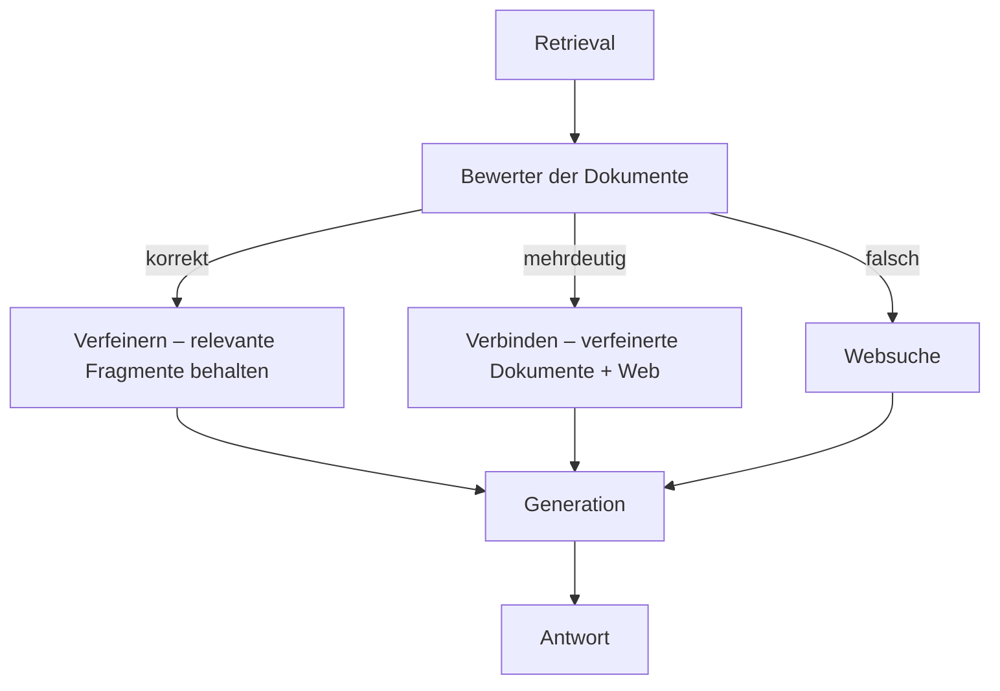
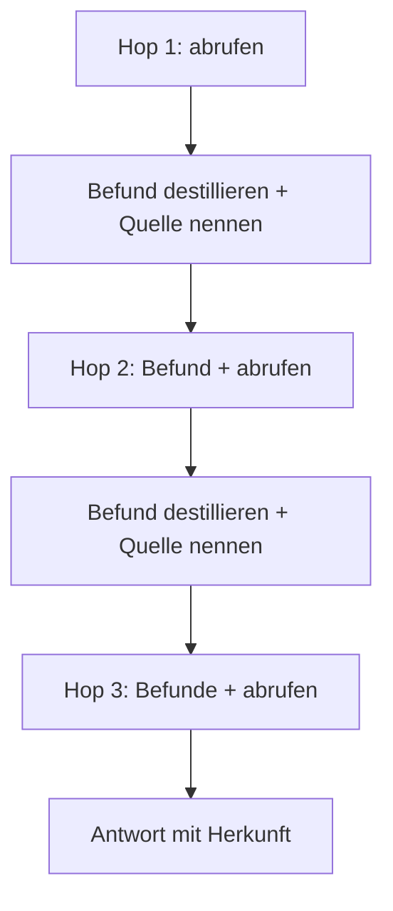

# Retrieval-Entscheidungen lernen, die Schleife begrenzen, den ganzen Pfad bewerten

[Teil 1 der Lektion](./index.md) hat die Verschiebung beschrieben: Das Retrieval ist kein fester Schritt `retrieve → generate` mehr, sondern eine Aktion, für die sich das Modell in einer Schleife entscheidet – suchen oder nicht, umformulieren, eine weitere Runde drehen, an eine Quelle weiterleiten, anhalten, sobald es genug hat. Diese Seite arbeitet die Schleife bis ins Letzte durch: die benannten Architekturen, die aus „entscheide, ob du abrufst“ eine *gelernte* Entscheidung machen; wie Sie die Retrieval-Schleife davon abhalten, sich im Kreis zu drehen; wie Sie abgerufenen Kontext von einem Hop zum nächsten weiterreichen, ohne das Modell darin ertrinken zu lassen; und wie Sie den ganzen Pfad bewerten, den ein Durchlauf genommen hat, statt nur seine letzte Antwort. Teil 1 wird durchgehend vorausgesetzt: die Schleife `nachdenken → entscheiden → handeln → beobachten`, das Spektrum vom Router über die Planung bis zur vollen Schleife, die Selbstkorrektur und das iterative Retrieval werden nicht noch einmal erklärt; diese Seite baut darauf auf.

Vorher eine Abgrenzung, denn zwei Nachbarlektionen teilen sich dieses Gebiet. Die *allgemeine* Schleifensteuerung – `Plan-and-Execute` gegen ReAct (Reasoning + Acting) als Strategien, Schrittbudgets, die Schleifenerkennung, die Reflexion über den ganzen Pfad – gehört in [Planung und Schleifen](../planning-loops/index.md). Diese Seite bleibt beim **Retrieval als Aktion** verankert: Wo ein allgemeiner Gedanke gebraucht wird, bekommt er einen retrievalspezifischen Satz und einen Verweis dorthin, nie eine zweite Herleitung.

## Von der Selbstkorrektur zu den benannten Retrieval-Mustern

Die Selbstkorrektur und das iterative Retrieval aus Teil 1 waren Mechanismen, die im Abstrakten beschrieben blieben. Inzwischen gibt es dafür konkrete, veröffentlichte Bauformen. Drei benannte Architekturen lohnen sich, weil jede eine andere Antwort auf dieselbe Frage gibt: *Wann und wie entscheidet die Schleife, abzurufen, erneut abzurufen oder anzuhalten?*

**Self-RAG** bringt dem Modell bei, diese Entscheidung selbst zu treffen, und zwar schon während es schreibt: Es streut dabei besondere **`Reflection-Tokens`** ein. Ein Token entscheidet, ob für den aktuellen Abschnitt überhaupt abgerufen wird – manche Stellen brauchen eine Quelle, andere kann das Modell einfach schreiben. Wird abgerufen, bewerten drei prüfende Tokens, was zurückkommt: ob eine Passage für die Frage *relevant* ist, ob der erzeugte Text von dieser Passage tatsächlich *getragen* wird und wie *nützlich* die entstandene Antwort auf einer kurzen Skala ist. Diese Urteile sind in die Generation eingewoben, statt als äußeres Gerüst darübergesetzt zu sein – das Modell prüft Token für Token sein eigenes Retrieval und dessen Grounding.

**Corrective RAG (CRAG)** verfolgt dieselbe Absicht, setzt sie aber außerhalb des Modells um: in einem eigenen, schlanken **Bewerter der abgerufenen Dokumente**. Nach dem Retrieval bewertet er die Dokumente und liefert einen Konfidenzwert, den er in drei Fächer sortiert. *Korrekt* heißt, dass die Dokumente gut genug sind – aber nicht wörtlich: Ein Verfeinerungsschritt schneidet jedes Dokument in kleinere Stücke und behält nur die Fragmente, die wirklich zur Frage gehören, damit kein Rauschen mitfährt. *Falsch* heißt, dass die abgerufene Menge danebenliegt; CRAG verwirft sie und weicht auf eine Websuche als frische Quelle aus. *Mehrdeutig* – der Bewerter ist sich nicht sicher – verbindet beides und verwendet die verfeinerten internen Dokumente zusammen mit dem Ergebnis aus dem Web. Das Ganze ist ohne Umbau einsetzbar: Es sitzt auf einer beliebigen bestehenden RAG-Pipeline, ohne dass der Generator neu trainiert werden muss.

Als Diagramm ist der Weg durch CRAG eine Verzweigung in drei Richtungen, und der Konfidenzwert des Bewerters entscheidet, welche davon genommen wird:

**Adaptive RAG** setzt eine Ebene höher an, bei der Frage selbst. Ein trainierter Klassifikator sagt vorher, wie komplex die eingehende Frage ist, und leitet sie an die billigste Strategie weiter, die sie noch beantwortet: gar kein Retrieval für etwas, das das Modell aus dem im Modell gespeicherten Wissen ohnehin weiß; ein einzelnes Retrieval für ein einfaches Nachschlagen; oder das volle iterative Retrieval über mehrere Schritte für eine Frage, die wirklich mehrere Hops braucht. Der Punkt ist die Sparsamkeit: Sie bezahlen keine iterative Schleife für eine Frage, die eine einzige Suche erledigt hätte, und Sie lassen eine schwere Frage nicht mit einem einzigen Versuch verhungern.

Stellen Sie die drei gegen das Spektrum aus Teil 1, dann wird das Muster sichtbar. Adaptive RAG ist der Router, auf die einzelne Frage heruntergebrochen und *gelernt* – die Routing-Entscheidung aus Teil 1, nur von einem trainierten Klassifikator vorhergesagt statt von einer handgeschriebenen Regel. Self-RAG ist dieselbe Selbstkorrektur, nur in trainierte Tokens verlagert, auf der Ebene von Abrufen und Grounding. CRAG ist die Selbstkorrektur mit einem ausdrücklichen Bewerter und einer Notausfahrt in die Websuche. Alle drei nehmen die Freiheit, die Teil 1 eingeführt hat, und machen aus „entscheide, ob du abrufst“ eine Entscheidung, die das System *lernt* – dazu eine ausdrückliche Prüfung, ob eine Passage relevant ist und ob sie die Aussage trägt.

Eine Einordnung, weil die Grenze hier leicht verwischt. Die Urteile von Self-RAG und CRAG betreffen die *Qualität des Retrievals* – ist diese Passage relevant, wird die Antwort von ihr getragen. Das ist die Familie der Selbstkorrektur aus Teil 1, und sie ist mit Absicht von der *Reflexion* in [Planung und Schleifen](../planning-loops/index.md) getrennt, die den ganzen Pfad beurteilt: Komme ich voran, sollte ich umplanen? Dieselbe Wortfamilie, eine andere Flughöhe – die eine bewertet eine Passage, die andere den Plan.

Es gibt außerdem eine Strategiewahl, die nur für das Retrieval gilt. Ein Retrieval nach dem Muster von ReAct verschränkt Nachdenken, Abrufen und Beobachten und formuliert die nächste Abfrage aus dem, was das jeweilige Ergebnis tatsächlich zurückgegeben hat – das iterative Retrieval aus Teil 1. `Plan-and-Execute` geht bei einer Frage über mehrere Hops den anderen Weg: erst die Frage vorab in einen Plan aus Teilfragen zerlegen, je Teilfrage einmal abrufen, danach die Antwort wieder zusammensetzen. Flexibilität gegen Struktur ist die allgemeine Abwägung, und die allgemeine Behandlung steht in [Planung und Schleifen](../planning-loops/index.md) – hier zählt der retrievalspezifische Punkt: **die Zerlegung der Frage**. Aus „Wer leitet das Team, das Richtlinie X ausgeliefert hat?“ wird erst „Welches Team hat X ausgeliefert?“ und dann „Wer leitet dieses Team?“, und jede Teilfrage ist ein sauberes Retrieval über einen einzigen Hop.

Wann Sie zu all dem *nicht* greifen: Self-RAG braucht ein eigens trainiertes Modell. CRAG und Adaptive RAG setzen einen Bewerter oder einen Klassifikator davor – zusätzliche Kosten und eine neue Fehlerfläche: Der Bewerter kann danebenliegen, eine gute Passage aussortieren oder eine überflüssige Websuche auslösen, die schlechteren Kontext hereinholt als den, den sie ersetzt. Für viele Korpora schlägt ein solider statischer Retriever mit einem einfachen Relevanzfilter einen gelernten Bewerter deutlich. Es ist dieselbe Disziplin wie überall in Teil II: die einfachste Stufe nehmen, die die Aufgabe löst, und die Schleife ihre Komplexität verdienen lassen.

## Damit die Retrieval-Schleife anhält – und die harte Obergrenze dahinter

Sobald das Retrieval in einer Schleife läuft, kann es passieren, dass sie nicht mehr anhält – aus denselben Gründen wie bei jeder anderen Schleife eines Agenten. Die allgemeine Darstellung dazu steht in [Planung und Schleifen](../planning-loops/index.md). Beim Retrieval hat sie zwei eigene Gestalten.

Die erste ist die **Re-Retrieval-Schleife** (die Schleife, in der immer wieder neu gesucht wird): Der Agent setzt eine Abfrage ab, das Ergebnis gefällt ihm nicht, er formuliert sie geringfügig anders, bekommt dieselben Dokumente zurück, formuliert wieder um – und nie kommt neue Information in den Kontext. Das sieht nach Fortschritt aus und ist in Wahrheit deterministisches Kreisen. Und benennen Sie den Fall richtig: Eine Schleife, die nicht anhält, ist ein Fehler im Durchlauf – nicht ein Modell, das die Antwort verweigert.

Die zweite ist das **Suchen über den Bedarf hinaus**: Der Agent sucht längst weiter, obwohl er genug hätte, und polstert den Kontext mit Material, das kaum zur Sache gehört und das er nie verwenden wird.

Beide zeigen auf die eigentliche Frage, nämlich auf die Abbruchbedingung einer *Retrieval*-Schleife: **Reicht der Kontext schon, um zu antworten?** Die Tokens von Self-RAG dafür, ob eine Aussage getragen wird und wie nützlich sie ist, sind eine Möglichkeit, dieses Urteil umzusetzen; ein eigenständiger **Bewerter der Relevanz** ist eine andere. Ein Fehlurteil kostet Sie in beide Richtungen. Halten Sie zu früh an, rufen Sie zu wenig ab: Die Antwort ist nicht belegt, eine Halluzination wartet schon. Halten Sie nie an, rufen Sie zu viel ab: Sie bezahlen die zusätzlichen Anfragen, und Sie ziehen den Kontext so weit in die Länge, dass **Lost-in-the-Middle** – das Modell achtet auf die Mitte eines langen Kontexts am wenigsten – anfängt, genau die Belege zu entwerten, die Sie zusammengetragen haben.

Weil das kluge Kriterium sich irren kann, sichern Sie es mit einem dummen ab. Ein **Retrieval-Budget** ist eine harte Obergrenze – höchstens so viele Hops, so viele Suchen, so viele abgerufene Tokens –, die die Schleife anhält, ganz gleich, was das Modell denkt. Es entspricht dem Schrittbudget und dem Token-Budget aus [Planung und Schleifen](../planning-loops/index.md); leiten Sie den allgemeinen Gedanken nicht neu her, wenden Sie ihn einfach auf das Retrieval an. Das ist die letzte Sicherung, die das Anhalten der Schleife *garantiert*, auch wenn jede klügere Verteidigung versagt.

Dazwischen sitzt die **Schleifenerkennung** für das Retrieval. Die allgemeine Form steht in [Planung und Schleifen](../planning-loops/index.md); der retrievalspezifische Griff ist eine Signatur – normalisieren Sie die Abfrage und bilden Sie einen Fingerabdruck der zurückgegebenen Trefferliste; liefert dieselbe Abfrage immer wieder dieselbe Trefferliste, brechen Sie aus, statt noch eine Runde drehen zu lassen. Das fängt die Re-Retrieval-Schleife ab, bevor das Budget eingreifen muss.

Wann Sie das alles *nicht* bauen: Ein System, das nur routet – eine Entscheidung, keine Schleife –, kann sich gar nicht im Kreis drehen; es gibt keine Stelle, an die es zurückspringen könnte. Der ganze Apparat aus Budgets, Prüfungen auf ausreichenden Kontext und Schleifenerkennung ist ein Aufwand, den Sie erst dann auf sich nehmen, wenn Sie sich auf die volle Schleife festlegen. Löst eine einzelne Routing-Entscheidung Ihre Aufgabe, brauchen Sie nichts davon.

## Was ein Hop an den nächsten weitergibt

Das ist der Teil, den die Nachbarlektionen am wenigsten abdecken, und zugleich der Teil, an dem sich am stärksten entscheidet, ob ein Agent über mehrere Hops funktioniert. Jeder Hop kippt seine abgerufenen Passagen in den Kontext. Tun Sie das über einen Pfad mit fünf Hops unbedacht, dann bläht sich der Kontext auf: Die Kosten steigen mit jeder Anfrage, und Lost-in-the-Middle aus der Lektion zur Generation fängt genau dann an zu beißen, wenn der Agent am meisten auseinanderzuhalten hat.

Die Abhilfe ist, das Rohmaterial gar nicht erst mitzuschleppen. Was von einem Hop weitergeht, sind nicht die Chunks, die er abgerufen hat, sondern der **destillierte Befund** – die Antwort auf die Teilfrage, der herausgezogene Fakt – zusammen mit seiner Herkunft: der Quellenangabe, die auf die Ursprungsstelle zeigt. So bleibt der Arbeitskontext klein und bei der Sache. Über mehrere Hops entspricht das dem, was [Planung und Schleifen](../planning-loops/index.md) als **Arbeitsgedächtnis** (dort auch *Scratchpad* genannt) führt; die retrievalspezifische Wendung ist, *was* Sie darin ablegen – Befunde, keine Passagen – und dass die Quellenangabe daran hängen bleibt, damit die Endantwort zurückgebunden bleibt.

Drei Gewohnheiten halten den mitgeführten Kontext sauber. **Entfernen Sie Doppeltes** über die Hops hinweg – dieselbe Passage, in Hop 1 und noch einmal in Hop 3 abgerufen, darf den Kontext nicht zweimal belegen. **Fassen Sie zusammen, während er wächst** – wird der Pfad lang, fassen Sie die Belege der älteren Hops auf das zusammen, was noch zählt; das ist der retrievalspezifische Fall von „den Verlauf zusammenfassen“ aus [Planung und Schleifen](../planning-loops/index.md). Und **achten Sie auf die Reihenfolge** – legen Sie die frischesten, wichtigsten Belege dorthin, wo das Modell wirklich hinsieht, an die Ränder statt vergraben in die Mitte. Lost-in-the-Middle, bewusst angewandt statt versehentlich erlitten.

Das Fehlerbild, gegen das das alles schützt, ist konkret: Schleppen Sie die Roh-Chunks aus jedem Hop mit, dann wächst der Kontext, bis das Modell den Faden verliert und die Frage von Hop 3 aus den Belegen von Hop 1 beantwortet. Die Antwort ist flüssig, sie ist an *irgendetwas* zurückgebunden, und sie ist falsch – die Sorte Fehler, die sich weiter hinten in der Kette am schwersten fangen lässt.

Als Kette gezeichnet – jeder Hop verdient seinen Platz damit, dass er kleiner macht, was er weitergibt:

## Den ganzen Pfad des Retrievals bewerten

Teil 1 hat gesagt, die Evaluierung messe jetzt „die Qualität des Pfades“. Für Agentic RAG zerfällt das in zwei Hälften – das Ergebnis und den Ablauf –, und in der zweiten Hälfte sitzt die retrievalspezifische Bewertung; die beiden auseinanderzuhalten ist das, was einen misslungenen Durchlauf überhaupt untersuchbar macht.

**Ergebnis gegen Ablauf.** Das Ergebnis ist die Qualität der Endantwort – Faithfulness, Response Relevancy, die Metriken aus der Lektion zur Evaluierung. Der Ablauf ist die Frage, ob der *Pfad* Sinn ergeben hat: Hat der Agent abgerufen, wo er sollte, und darauf verzichtet, wo er nicht sollte? Hat jeder Hop die richtigen Dokumente geholt? Hat er zum richtigen Zeitpunkt angehalten? Und wie viele Schritte und wie viel Geld hat es bis dorthin gekostet? Eine richtige Antwort auf einem falschen Pfad ist Glück, und Glück überlebt die nächste Frage nicht.

**Die Qualität des Retrievals, pro Hop.** Legen Sie die Retrieval-Metriken – Context-Precision, Context-Recall, Relevanz – an *jeden* Hop an, statt nur an die am Ende zusammengetragene Menge. Das ist die Trennung der Fehlerbilder aus Teil 1, hineingetragen in die Schleife: Ein Durchlauf kann die richtige Antwort auf einem falschen Pfad erreichen oder den richtigen Pfad nehmen und trotzdem in der Generation versagen; erst die Bewertung jedes Hops trennt das Fehlerbild des Retrievals vom Fehlerbild der Generation und lokalisiert den Fehler auf einen bestimmten Schritt.

**Signale auf Pfadebene.** Die Zahl der Schritte und der Retrievals als Signal für die Wirtschaftlichkeit – ein Agent, der in acht Hops beantwortet, was sechs erledigt hätten, ist kein guter Agent. Die **Terminierung** (ob der Durchlauf überhaupt endet). Ob an die richtige Quelle weitergeleitet wurde. Und das **Sufficient-Context**-Signal (ob der zusammengetragene Kontext die Antwort überhaupt enthielt), unabhängig davon, ob der Generator ihn danach genutzt hat. Das letzte Signal legt die undurchsichtigsten Fehler offen: Eine richtige Antwort über einem Kontext, der nicht ausreicht, ist das Modell, das auf das im Modell gespeicherte Wissen zurückfällt, statt RAG zu betreiben.

Einen Pfad zu beurteilen statt einer einzelnen Antwort ist die Stelle, an der sich ein **LLM-as-a-judge über den ganzen Pfad** lohnt, und Werkzeuge dafür gibt es. [Ragas](https://www.ragas.io) deckt die Retrieval-Metriken ab – Context-Precision, Context-Recall, Faithfulness, Response Relevancy – und ergänzt agentenbezogene wie agent goal accuracy, topic adherence und tool call accuracy. Greifen Sie sparsam zu: Die allgemeine Disziplin der Evaluierung und die Observability, auf die sie angewiesen ist, sind eigene Lektionen, und diese Seite zeigt nur, wo die Bewertung des Pfades dort andockt.

Womit die Voraussetzung ausgesprochen ist, und sie gehört klar gesagt: *Einen Pfad, den Sie nicht sehen, können Sie nicht bewerten.* Die Bewertung jedes Hops, die Prüfungen auf ausreichenden Kontext, das Zählen der Schritte – das alles setzt einen vollständigen Trace des Durchlaufs voraus, gegen den bewertet wird. Observability ist hier nicht bloß nützlich, sondern das, was die Bewertung des Pfades überhaupt erst möglich macht – genau so, wie Teil 1 es gesagt hat, als er Observability für Agenten zur Pflicht erklärt hat.

Und noch einmal die Zurückhaltung. Ein System, das nur routet, hat keinen Pfad zu bewerten – eine Entscheidung, danach ein statischer Weg –, also reicht die Evaluierung des Ergebnisses allein. Instrumentieren Sie keine gerade Linie, als wäre sie eine Schleife; die Mechanik für die Bewertung des Pfades ist ein Aufwand, den Sie erst dann auf sich nehmen, wenn es wirklich einen Pfad zu beurteilen gibt.

## Das Wichtigste

- Die Selbstkorrektur und das iterative Retrieval aus Teil 1 haben inzwischen konkrete, veröffentlichte Bauformen: Self-RAG trifft die Entscheidung über Abrufen und Bewerten mit trainierten `Reflection-Tokens`, schon während es schreibt; CRAG setzt einen eigenen Bewerter vor die Generation, mit der Websuche als Ausweg; Adaptive RAG stuft die Komplexität der Frage ein und leitet an die billigste Strategie weiter, die noch ausreicht. Alle drei machen aus „entscheide, ob du abrufst“ eine gelernte Entscheidung – und alle drei kosten zusätzlich und bringen eine neue Fehlerfläche mit, weshalb ein guter statischer Retriever mit einem Relevanzfilter oft gewinnt.
- Halten Sie die Selbstkorrektur des Retrievals (bewertet *diese Passage*) von der Reflexion der Planung (bewertet *den ganzen Plan*) getrennt – derselbe Instinkt, eine andere Flughöhe.
- Die Retrieval-Schleife läuft auf zwei Arten nicht zusammen: Sie setzt eine Abfrage ab, die nichts Neues zurückgibt, oder sie sucht weit über den Bedarf hinaus. Die Abbruchbedingung ist, ob der Kontext ausreicht; ein hartes Retrieval-Budget ist die letzte Sicherung, die das Anhalten garantiert; eine Signatur aus Abfrage und Trefferliste ist der Griff, mit dem die Schleifenerkennung das Kreisen fängt.
- Zwischen den Hops geht der destillierte Befund samt Quellenangabe weiter, nicht die Roh-Chunks – dazu Doppeltes entfernen, zusammenfassen, während es wächst, und die Belege dorthin legen, wo das Modell hinsieht. Wer den Rohkontext mitschleppt, lässt ihn so lange wachsen, bis das Modell die Frage eines Hops aus den Belegen eines anderen beantwortet.
- Bewerten Sie Ergebnis und Ablauf getrennt, bewerten Sie das Retrieval an jedem Hop statt nur einmal, und nehmen Sie Signale auf Pfadebene dazu – Zahl der Schritte, Terminierung, Weiterleitung, ausreichender Kontext –, beurteilt von einem LLM-as-a-judge über dem aufgezeichneten Trace. Nichts davon geht ohne diese Aufzeichnung, also ist Observability die Voraussetzung und keine Zutat.
- Ein System, das nur routet, kann sich nicht im Kreis drehen und hat keinen Pfad – es braucht weder die Abwehr gegen die Schleife noch die Bewertung des Pfades. Nehmen Sie die einfachste Stufe, die die Aufgabe löst.

**[Neue Begriffe](../../glossary.md#agentic-rag)**: Self-RAG, corrective RAG (CRAG), adaptive RAG, retrieval budget, sufficient context.
