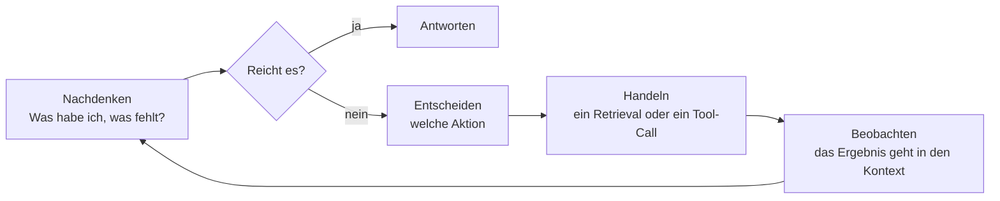

# Retrieval als Entscheidung statt als Schritt

Durch den ganzen Teil I hatten Sie ein Bild vor Augen: eine feste Pipeline. Eine Frage kommt herein und
nimmt jedes Mal denselben Weg, `retrieve → generate`. Einmal suchen, einmal erzeugen, fertig. Die Pipeline
sieht sich die Frage gar nicht an und wählt nichts aus – sie dreht bei jeder Frage dieselbe Kurbel.

Genau das bricht Agentic RAG auf. Das Retrieval ist kein starrer Schritt mehr, sondern eine **Aktion, für
die sich das Modell selbst entscheidet** – in einer Schleife, mit Blick auf das Zwischenergebnis. Das
Modell entscheidet: suchen oder nicht, wonach suchen, die Frage umformulieren oder so lassen, noch einmal
gehen oder nicht, aus welcher Quelle holen, ob es für eine Antwort schon genug hat.

Ein Satz für die ganze Lektion: **Im statischen RAG hat der Code die Kontrolle, im Agentic RAG das Modell.**

:::tip[▶ Video]

<YouTube id="JB2P5Gk23VI" title="RAG's Evolution: From Simple Retrieval to Agentic AI — IBM Technology" />

Genau die Verschiebung, um die es in dieser Lektion geht: wie aus einfacher Suche ein agentisches System
wird. (Das Video ist auf Englisch.)

:::

## Wo statisches RAG versagt

Autonomie wird nicht eingebaut, weil sie gerade in Mode ist. Ein festes `retrieve → generate` versagt bei
ganzen Klassen von Fragen wirklich.

- **Mehrschrittige Fragen.** „Wer leitet die Abteilung, die Richtlinie X erlassen hat?“ Mit einer Suche ist
  das nicht zu holen: erst Richtlinie X finden, daraus die Abteilung – und erst dann, wer sie leitet. Die
  zweite Abfrage entsteht aus dem Ergebnis der ersten. Diesen zweiten Schritt kann eine statische Pipeline
  gar nicht gehen.
- **Fragen, die überhaupt kein Retrieval brauchen.** „Übersetze die vorige Antwort ins Englische“ oder
  „Wie viel sind 15 % von 200?“ Statisches RAG gräbt trotzdem in der Datenbank und mischt unbrauchbaren
  Kontext dazu. Ein Agent kann entscheiden, dass es hier nichts zu suchen gibt.
- **Verschiedene Quellen für verschiedene Fragen.** Manche Fragen gehören in die Wissensdatenbank, manche
  an SQL über eine Tabelle, manche ins aktuelle Web. Eine feste Pipeline geht immer an dieselbe Stelle. Ein
  Agent **leitet** die Frage dorthin **weiter**, wo die Antwort liegt.
- **Ein schlechtes erstes Ergebnis.** Kommen unpassende Chunks zurück, reicht die statische Pipeline sie
  trotzdem an die Generation weiter und erzeugt eine schwache Antwort. Ein Agent kann sich ansehen, was
  zurückkam, merken, dass es danebenliegt, neu formulieren und noch einmal suchen. Das ist die
  **Selbstkorrektur**, und der Rückweg in die Suche mit einer geschärften Frage heißt **iteratives
  Retrieval**.

Der gemeinsame Nenner: Eine echte Frage braucht **wechselnd viele Schritte, und sie braucht die Wahl,
welchen Weg sie nimmt** – die Pipeline bietet einen festen an.

## Der Mechanismus dahinter: eine Schleife

Im Kern steht eine einfache Schleife, der **Agent Loop**. Sie dreht sich, bis das Modell selbst
entscheidet, dass es antworten kann:

- **Nachdenken** – das Modell schätzt ein, was es zusammengetragen hat und was ihm fehlt.
- **Entscheiden** – es wählt die nächste Aktion. In Teil I hatte es keine Wahl.
- **Handeln** – meistens ein Retrieval, es kann aber auch ein anderes Tool sein; die sind das Thema der
  nächsten Lektion.
- **Beobachten** – das Ergebnis der Aktion geht zurück in den Kontext, und die Schleife läuft weiter, jetzt
  mit neuem Wissen.

Diese Schleife aus denken → tun → hinsehen → wiederholen ist die Autonomie. Das Retrieval ist hier
**eine Aktion innerhalb der Schleife**, nicht die erste Sprosse einer festen Leiter.

:::tip[▶ Video]

<YouTube id="0z9_MhcYvcY" title="What is Agentic RAG? — IBM Technology" />

Dieselbe Schleife aus einem anderen Blickwinkel, entlang der Rollen des Agenten: Planung, Tool-Calls,
Reasoning. (Das Video ist auf Englisch.)

:::

## Was die Autonomie konkret bringt

Zerlegen wir „das Modell hat die Kontrolle“ in greifbare Fähigkeiten.

| Fähigkeit | Statisches RAG | Agentic RAG |
|---|---|---|
| Suchen oder nicht | sucht immer | entscheidet pro Frage |
| Zahl der Suchen | genau eine | keine, eine oder viele |
| Umformulierung | Frage unverändert (bestenfalls eine Umformung vorab) | schreibt **zwischen** den Schritten um, aus dem Ergebnis heraus |
| Quelle | eine feste | leitet an die richtige weiter (Wissensdatenbank / SQL / Web / API) |
| Reaktion auf ein schlechtes Ergebnis | reicht es durch | merkt, dass es danebenliegt, und geht noch einmal |
| Zahl der Schritte | fest | wechselnd, das Modell entscheidet |

## Ein Spektrum, kein Schalter

Denken Sie nicht „statisch ODER agentisch“. Dazwischen liegt ein stufenloses Spektrum, abgestuft danach,
**wie viel Freiheit Sie dem Modell lassen**.

1. **Der Query-Router.** Der leichteste Schritt in die Autonomie. Das Modell trifft eine einzige
   Entscheidung – wohin die Frage geht: in welchen Index, an welches Tool, oder „kein Retrieval nötig“ –,
   alles danach ist statisch. Billig, vorhersagbar, und er deckt die meisten Fälle ab.
2. **Die Abfragen planen.** Das Modell zerlegt eine schwierige Frage vorab in Teilfragen.
3. **Die volle Schleife (nach dem Muster von ReAct, Reasoning + Acting).** Ein echtes
   `nachdenken → entscheiden → handeln → beobachten` in einer Schleife, mit Selbstkorrektur und wechselnd
   vielen Schritten.

Eine praktische Regel, die Sie sich jetzt schon merken sollten: Nehmen Sie die einfachste Stufe, die die
Aufgabe löst. Die volle agentische Schleife ist kein Preis, den es zu gewinnen gibt, sondern eine Rechnung,
die Sie bezahlen. Oft schlägt ein Router vor einem guten statischen RAG den „vollen Agenten“ bei Kosten,
Latenz und Stabilität.

## Was die Autonomie kostet – und warum Teil I dadurch wichtiger wird

Sie geben die Kontrolle an das Modell ab – und genau dafür zahlen Sie.

- **Latenz und Kosten.** N Schritte bedeuten N Anfragen an das Modell und dazu N Retrievals. Aus einer
  Frage werden schnell 5–10 Anfragen.
- **Unvorhersagbarkeit.** Wie viele Schritte es werden und welchen **Pfad** der Durchlauf nimmt, hängt
  jetzt vom Modell ab – das Verhalten lässt sich schwerer garantieren.
- **Fehlersuche und Evaluierung werden schwerer.** Der Fehler kann an jedem Schritt der Schleife
  entstehen: eine falsche Routing-Entscheidung, eine schlechte Umformulierung, eine Schleife, die nicht
  anhält.

Daraus folgt die direkte Brücke zu den Querschnittsthemen. **Observability** wird von nützlich zu
unverzichtbar: Ohne Aufzeichnung der ganzen Kette von Schritten und Aufrufen können Sie eine schlechte
Antwort des Agenten schlicht nicht mehr auseinandernehmen. Und die **Evaluierung** misst jetzt nicht mehr
nur „gefunden / erzeugt“, sondern die Qualität des ganzen Pfades – war die Routing-Entscheidung richtig,
hat sich der Agent im Kreis gedreht. Teil I ist damit nicht aufgehoben: Er wird zum Fundament, auf dem der
Agent seine Entscheidungen trifft.

## Das Wichtigste

- Statisches RAG = eine feste Pipeline `retrieve → generate`, die Kontrolle liegt beim Code. Agentic RAG =
  das Retrieval wird zur Aktion in einer Schleife, die Kontrolle liegt beim Modell.
- Autonomie brauchen Sie dort, wo die Pipeline bricht: mehrschrittige Fragen, „kein Retrieval nötig“, das
  Weiterleiten an die richtige Quelle, die Selbstkorrektur nach einem schlechten Ergebnis.
- Der Mechanismus ist die Schleife aus nachdenken → entscheiden → handeln → beobachten, wiederholt, bis das
  Modell antworten kann.
- Es ist ein Spektrum: Router → Abfragen planen → volle Schleife. Nehmen Sie die einfachste Stufe, die die
  Aufgabe löst.
- Bezahlt wird mit Latenz, Kosten, Unvorhersagbarkeit und mühsamerer Fehlersuche – und genau deshalb werden
  Observability und Evaluierung aus Teil I zur Pflicht.

**[Neue Begriffe](../../glossary.md#agentic-rag)**: Agentic RAG, agent loop, ReAct (Reasoning + Acting),
routing / query router, multi-hop retrieval, query planning, self-correction / self-reflection, iterative
retrieval.

---

:::note[Als Nächstes: Teil 2 der Lektion]

**[Iteratives Retrieval und seine Bewertung](./deep-dive.md)** – ein tieferer Durchgang durch die
Retrieval-Schleife: die benannten Muster des Agentic RAG (Self-RAG, Corrective RAG, Adaptive RAG), wie Sie
die Schleife davon abhalten, sich im Kreis zu drehen, wie abgerufener Kontext von Hop zu Hop weitergereicht
wird, und wie sich der ganze Pfad des Retrievals bewerten lässt.

Siehe auch: die Schleife eines Agenten allgemein lenken und begrenzen – [Planung und
Schleifen](../planning-loops/index.md); wie diese Aktionen bei Claude, OpenAI und Gemini ausgeliefert
werden – [der Abschluss dieses Teils](../real-agents.md).

:::
