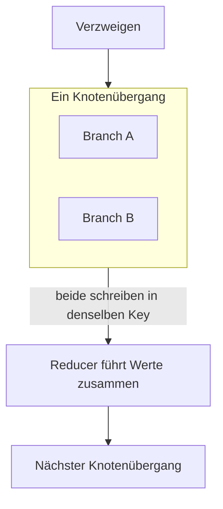

# Was ein Replay erneut ausführt – und wie Branch-Writes zusammenlaufen

[Teil 1](./index.md) hat die Eigentümerfrage begründet: Der Checkpointer beansprucht, der Ort des
Run-States zu sein, häufig ist es aber längst der Fachdatensatz, und die Auflösung besteht darin, den einen
maßgeblich und den anderen abgeleitet zu nennen – mit genau einer schreibenden Instanz, einer
Projektionsrichtung, die nur in eine Richtung läuft, einer ausdrücklichen Verantwortung für das Schema und
einem Abgleich, bevor ein fortgesetzter Durchlauf handelt. Teil 1 hat außerdem das Anhalten eines offenen
Durchlaufs vom Wiederaufgreifen eines abgeschlossenen getrennt und den Orchestrator beziffert, den Sie statt
einer Übernahme selbst bauen. Auf dieser Seite geht es um die Mechanik dahinter: woher ein Replay-sicherer Key seinen
Wert bekommt, was einen solchen Key entwertet, was geschieht, wenn zwei nebenläufige Branches eines Graphen
denselben State-Key schreiben, und was die Durable-Execution-Engines außerhalb von AI tatsächlich zusagen.

Zuerst zwei Abgrenzungen, denn was unmittelbar daneben liegt, behandeln die Nachbarlektionen. Die Idempotenz als
Eigenschaft eines **Tools** – was ein Key ist, warum ein schreibender Zugriff einen braucht, Dry-Run und
Bestätigung – steht in [Tool-Einsatz, Teil 2](../tool-use/deep-dive.md); diese Seite setzt sie voraus,
statt sie zu wiederholen. Der Checkpointer, die Threads, die `durability`-Modi und die Wirkung von
`interrupt()` auf den Knoten, in dem der Aufruf steht, stehen in
[Orchestrierungs-Frameworks, Teil 2](../orchestration-frameworks/deep-dive.md) und gelten hier als bekannt.
Neu ist auf dieser Seite die Verbindung zwischen beidem: Die Tool-Lektion sagt Ihnen, dass ein schreibender
Zugriff einen Key braucht, und diese Seite sagt Ihnen, **woher der Wert dieses Keys kommt, wenn der Aufrufer
ein Graph ist, der erneut ausgeführt wird**.

## Machen Sie jeden Step sicher wiederholbar

Gehen Sie von einer technischen Tatsache aus, aus der sich alles Weitere ergibt: Bei **Durable Execution**
(dauerhafte Ausführung – ein **Durchlauf** wird nach einem Absturz an der letzten gesicherten Stelle
fortgesetzt) setzt die Engine beim Replay an einer Step-Grenze wieder ein und beginnt beim ersten Step,
dessen Abschluss sie nicht nachweisen kann. Die Einheit des Fortschritts ist für die Engine der Step: Sie
vermerkt, dass ein Step abgeschlossen ist. Mitten in einem Step setzt sie den Durchlauf nicht
fort, denn ein halber Step ist kein Zustand, den sie je aufgezeichnet hat.

Aus dieser Granularität folgt alles Weitere zur Sicherheit. Ist der Step die Einheit des Replays, dann ist
auch das, was nicht zweimal geschehen darf, auf einen Step zugeschnitten – und der Key, der das verhindert,
muss **pro Step stabil und zwischen Steps verschieden** sein. Daraus wird die Regel in einer Zeile:
**Leiten Sie den Idempotency-Key aus der Run-Identität plus der Step-Identität ab.**

Das ist kein Schluss aus ersten Prinzipien, den Sie glauben müssten. [Temporal](https://docs.temporal.io/activity-definition) dokumentiert das Muster
ausdrücklich: Damit der Seiteneffekt einer Activity eine Wiederholung übersteht, bilden Sie den
Idempotency-Key aus der **Workflow Run ID** und der **Activity ID**. Sehen Sie sich an, was diese
Kombination einbringt. Die Run ID bleibt für die gesamte Ausführung konstant und ist beim nächsten
Durchlauf eine andere; der Key bleibt also über jede Wiederholung desselben Durchlaufs stabil und kollidiert
nie mit einem anderen Durchlauf. Die Activity ID unterscheidet diesen Step von den übrigen Steps innerhalb
desselben Durchlaufs. Konstant über Wiederholungen, eindeutig über Ausführungen hinweg – das sind die
beiden Eigenschaften, die ein Key braucht, und beide stammen aus Identitäten, über die die Engine ohnehin
verfügt.

Der Fehler, den das ausschließt, ist der, der tatsächlich in Produktion geht, und er besteht aus einer
einzigen Zeile Code. Ein Knoten braucht einen Key für eine Zahlung, einen Versand, eine Benachrichtigung –
also erzeugt er sich einen:

```python
key = str(uuid.uuid4())  # im Knoten, der erneut ausgeführt wird
```

Bei jedem Replay führt dieser Knoten die Zeile erneut aus und bekommt einen anderen Wert. Der Server sieht
einen neuen Key, hält das für eine neue beabsichtigte Operation und führt sie aus. Die Deduplikation greift
nicht – nicht weil sie kaputt wäre, sondern weil sie denselben Key nie zweimal bekommen hat. Der Knoten ist
jetzt vollständig abgesichert gegen eine Wiederholung nach einem *Netzwerkfehler* – den Fall, den sein Autor
im Sinn hatte – und vollkommen ungeschützt gegen ein *Replay*, das die Dauerhaftigkeit erst mit sich bringt. Zwei
ähnlich aussehende Fehler, ein Key — und der wurde nur für einen der beiden entworfen.

Die Rechnung kommt je nach Step in einer anderen Währung. Ist es ein Modellaufruf, zahlt die Charge aus
Teil 1 ein zweites Mal: 12 000 Einheiten zu je 2 US-Cent sind 240 US-Dollar, und ein Absturz kurz vor Ende
eines Durchlaufs, der abgeschlossene Arbeit wiederholt, gibt die vollen 240 US-Dollar noch einmal aus, um
an dieselbe Stelle zu kommen. Ärgerlich, und auf der Rechnung sichtbar. Ist der Step ein schreibender
Zugriff nach außen – eine Zahlung auslösen, eine Meldung einreichen, eine Benachrichtigung an eine Person
senden –, dann kostet dasselbe Replay kein Geld, sondern die fachliche Korrektheit. Jemand wird zweimal
belastet oder zweimal benachrichtigt, und keine Rechnungszeile macht das sichtbar, bis diese Person sich
beschwert.

Die Disziplin lautet deshalb: Der Key ist ein **Argument** des Steps, abgeleitet aus Identitäten, die die
Engine reproduzieren kann, und kein Wert, den der Step sich ausdenkt. Wenn Sie die Schleife von Hand bauen,
statt eine Engine zu übernehmen, verantworten Sie diese Ableitung selbst – und sie ist das Wichtigste, was
Ihr eigener Orchestrator richtig hinbekommen muss. Wägen Sie das gegen die Kostenrechnung aus Teil 1 ab.

## Wenn neue Branch-Nummern den Idempotency-Key entwerten

In dieser Regel steckt eine unausgesprochene Voraussetzung: Ein Key, der aus der Step-Identität abgeleitet
ist, ist nur so stabil wie diese Identität selbst. Genau daran scheitern auch sorgfältige Teams. **Ein Step,
dessen Identität sich zwischen Durchläufen verschiebt, entwertet den Key, der von ihr abhängt.**

Die häufigste Ursache ist das dynamische, nebenläufige Verzweigen. Ein Agent plant seine Arbeit selbst –
das ist der Sinn der Planungsschleife –, also entscheidet ein Modell erst zur Laufzeit über Anzahl und
Reihenfolge der Branches. Halten Sie sich das vor Augen, und die Schwierigkeit liegt auf der Hand: Lautet die
Identität eines Steps „der dritte nebenläufige Branch“ und erzeugt die Neuplanung beim Fortsetzen die
Branches in anderer Reihenfolge oder in anderer Zahl, dann ist der dritte Branch jetzt eine andere Aufgabe,
die dieselbe Identität trägt.

Aus dieser einen Ursache folgen zwei Fehler. Bereits abgeschlossene Arbeit wird unter einem Key erneut
ausgeführt, den die Deduplikation nicht wiedererkennt. Und Arbeit, die nie gelaufen ist, erbt einen Key,
der bereits verbraucht war, und wird deshalb still übersprungen.

Die Abwehr besteht darin, die Step-Identität aus etwas abzuleiten, **das der Plan nicht umnummerieren
kann**: aus dem Inhalt der Arbeit statt aus ihrer Position. Geeignet sind eine stabile fachliche Kennung
der verarbeiteten Einheit, ein Hash der Step-Eingaben oder eine ID, die beim Eintritt in den Batch vergeben
wurde – alles, dessen Wert eine Eigenschaft der Arbeit ist und nicht der Reihenfolge, in der der Planer sie
zufällig ausgegeben hat. Dann darf eine Neuplanung frei umsortieren, und jeder Key folgt weiterhin seiner
eigenen Arbeit.

Apache Airflow verdient hier einen eigenen Absatz, ausdrücklich als Gegenbeispiel und nicht als Vorbild:
Obwohl man es am ehesten als Beispiel für eine von Natur aus stabile Step-Identität heranzieht, ist es
gerade keines. Die eigene Dokumentation von [Airflow](https://airflow.apache.org/docs/apache-airflow/stable/templates-ref.html) warnt ausdrücklich davor: Sie hält fest, dass die
logische Datumsangabe und die daraus abgeleiteten Werte „innerhalb eines Dag nicht als eindeutig gelten
sollten“, und verweist stattdessen auf `run_id`. Airflow 3 ([AIP-83](https://cwiki.apache.org/confluence/display/AIRFLOW/AIP-83+Rename+execution_date+-%3E+logical_date+and+make+logical_date+optional)) ging weiter und lässt für
`logical_date` seither auch den Wert **null** zu; für die Planungsfrage, für die die logische Datumsangabe
zuvor zweckentfremdet wurde, kam `run_after` hinzu.
Die belastbare stabile Identität besteht dort also aus `run_id` plus der Task-ID – der Identität des
Durchlaufs und der Identität der Aufgabe, also derselben Gestalt, die Temporal vorschreibt. Die Lehre
reicht über beide Produkte hinaus: **Leiten Sie eine Identität nie aus einem Wert ab, der etwas anderes
bedeutet.** Ein Datum ist ein Datum. Es ist keine Kennung, so eindeutig es in Ihren Testdaten auch aussieht.
(Stand August 2026 – dieses Detail hat sich bereits einmal verschoben.)

## Wenn parallele Branches denselben State lesen und schreiben

Nun der zweite Mechanismus, und er liegt eine Ebene unter allem, was die Lektionen über
Multi-Agenten-Systeme behandeln. Es geht weder um mehrere Agenten in einem Team noch um mehrere Tools, die
in einem Batch aufgerufen werden. Es geht um **einen Graphen**, der nebenläufig in mehrere Branches
verzweigt, die alle **ein gemeinsames Zustandsobjekt** lesen und schreiben – und die Frage lautet, was
geschieht, wenn zwei von ihnen denselben Key schreiben.

Die Tatsache, die Sie auf Framework-Ebene festhalten müssen, ist das Ausführungsmodell von [LangGraph](https://docs.langchain.com/oss/python/langgraph/graph-api).
Nebenläufig ausgeführte Knoten laufen im selben **Knotenübergang** (im LangGraph-Vokabular: *Super-Step*);
nacheinander ausgeführte Knoten liegen in getrennten Knotenübergängen. Diese Unterscheidung trägt den ganzen
Abschnitt: Für die beiden Fälle gelten verschiedene Standardregeln, und verallgemeinert wird meist vom
sequenziellen Fall her – also vom falschen.



Nehmen Sie zuerst den sequenziellen Fall, denn darauf ist die Intuition aller gebaut. Zwei Knoten schreiben
denselben Key in verschiedenen Knotenübergängen; der zweite Schreibzugriff ersetzt den ersten. Überschreiben
also, der letzte gewinnt, genau wie bei einem Dictionary. Unauffällig, erwartbar – und **nicht das, was
nebenläufig geschieht.**

Im nebenläufigen Fall lösen zwei Branches, die im *selben* Knotenübergang einen Key **[ohne deklarierten
Reducer](https://docs.langchain.com/oss/python/langgraph/use-graph-api)** schreiben, einen **`InvalidUpdateError`** aus, und die Laufzeitmeldung benennt selbst, was fehlt:
*„Can receive only one value per step. Use an Annotated key to handle multiple values.“* LangGraph kürt
keinen Gewinner. Es behält auch nicht still den letzten Wert. Es verweigert die Aktualisierung.

Diese Unterscheidung wiegt schwerer, als sie aussieht, und die beiden Standardfälle zu vermengen ist ein
wirklich gefährlicher Fehler: **Eine einzige Zeile macht aus einem lauten Abbruch einen stillen Verlust.**
Gehen Sie den Weg mit. Wer ohnehin glaubt, bei nebenläufigen Schreibzugriffen gewinne der letzte, liest den
`InvalidUpdateError` nicht als Frage, sondern als Störung – und eine Störung wird man am schnellsten los,
indem man einen Reducer deklariert, der den letzten Wert behält. Jetzt tritt genau der Verlust, den das
Framework nicht schreiben wollte, bei jedem Verzweigen ein, und niemand meldet ihn. Das Framework hat sich
die ganze Zeit über freundlicher verhalten: Es hielt an und bat Sie, den Merge festzulegen. Ein
`InvalidUpdateError` während der Entwicklung zeigt, dass das Framework seine Aufgabe erfüllt.

Die Abhilfe ist ein **Reducer** (die Funktion, die festlegt, wie zwei Werte zu einem zusammengeführt
werden): eine Funktion, die auf dem State-Key deklariert wird. [LangGraph](https://docs.langchain.com/oss/python/langgraph/use-graph-api) dokumentiert zwei eingebaute –
`operator.add` und `add_messages` –, und das ist die dokumentierte Liste und keine Stichprobe aus einem
Katalog. `operator.add` verkettet, und genau das wollen Sie, wenn jeder Branch Einträge zu einer Liste
beisteuert. `add_messages` verarbeitet Gesprächsverläufe mit einer eigenen, ID-bewussten Semantik. Alles
andere ist eine Funktion, die Sie selbst schreiben, und eine zu schreiben ist der Normalfall und kein
fortgeschrittener Kunstgriff.

## Wer den Merge festlegt, verantwortet auch stilles Verwerfen

Mit der Deklaration eines Reducers geht die Entscheidung vom Framework auf Sie über, und genau dort entsteht
der *stille* Fehler.

Der laute Fall ist geklärt: kein Reducer, nebenläufige Schreibzugriffe, `InvalidUpdateError`, Sie beheben
es. Der leise Fall ist ein Reducer, den Sie **festgelegt** haben und der verwirft. Schreiben Sie eine
Merge-Funktion, deren Rumpf auf „nimm den letzten Wert“ hinausläuft, dann läuft der Graph für immer
fehlerfrei durch, während bei jedem nebenläufigen Verzweigen (*fan-out*) die Ergebnisse eines Branches
verworfen werden. Es wird kein Fehler ausgelöst, denn Sie wurden gefragt, wie der Merge aussehen soll, und
das hier ist Ihre Antwort. Beide Branches haben ihre Arbeit getan, beide haben ihre Modellaufrufe bezahlt,
und ein Ergebnis landet im Papierkorb – und es ist nicht einmal zuverlässig derselbe Branch, was den Fehler
so schwer reproduzierbar macht.

Behandeln Sie den Reducer deshalb als **fachliche** Entscheidung über Ihre Daten und nicht als syntaktische
Auflage, um einen Fehler loszuwerden. Sind diese Ergebnisse eine Menge, die vereinigt gehört? Eine Liste,
die verkettet gehört? Konkurrierende Antworten, von denen eine nach einer Regel gewinnt, die Sie benennen
können? Oder tatsächlich widersprüchliche Fakten, bei denen der ehrliche Merge beide behält und den
Konflikt kennzeichnet? Beantworten Sie diese Frage zuerst fachlich. Erst danach schreiben Sie die Funktion.

Die Reihenfolge ist das Zweite, was Sie festlegen müssen, und hier sind die Worte des Frameworks selbst die
richtigen, denn sie sind zurückhaltender als die Formulierungen, zu denen man sonst greift. Die [LangGraph](https://docs.langchain.com/oss/python/langgraph/use-graph-api)-Dokumentation sagt, dass
Aktualisierungen aus einem nebenläufigen Knotenübergang „nicht zuverlässig in einer bestimmten Reihenfolge
ankommen“, und schreibt eine bestimmte Abhilfe vor: die Ausgaben in ein eigenes Feld schreiben, zusammen
mit einem Wert, nach dem sich sortieren lässt, und nachgelagert selbst sortieren. Richtig gelesen heißt das
nicht, dass das Framework unberechenbar wäre; es heißt, dass **die Reihenfolge nicht Teil der Zusage ist**.
Brauchen Sie eine Reihenfolge, müssen Sie das mitführen, wonach Sie ordnen. Verwendet Ihr Reducer
`operator.add` und behandelt ein nachgelagerter Knoten die Position in der Liste als bedeutungstragend –
das erste Ergebnis sei das primäre, etwa –, dann haben Sie eine Abhängigkeit von etwas gebaut, das Ihnen
niemand zugesagt hat.

Zwei weitere Einstellungen greifen genau hier, und beide sind dokumentiert und nicht etwa versteckt.
Erstens steht der Standardwert von [`durability`](https://docs.langchain.com/oss/python/langgraph/durable-execution) auf **`"async"`** und nicht auf `"exit"` – und `"async"`
schreibt den Checkpoint im Hintergrund, während der nächste Step bereits läuft. Damit besteht ein echtes
Zeitfenster, in dem der Tod des Prozesses den letzten Schreibvorgang verliert. Das ist ein vertretbarer
Standard, und es ist nicht der dauerhafte; wenn Sie sich bei einem Step, der Geld kostet, auf die
Dauerhaftigkeit verlassen, lesen Sie den Modus nach, den Sie tatsächlich fahren, statt den, den das Wort
„durable“ nahelegt. Zweitens erfolgt die [Zuordnung der Resume-Werte bei `interrupt()`](https://docs.langchain.com/oss/python/langgraph/interrupts) **strikt anhand des
Index** – die Werte werden den Interrupts nach ihrer Position zugeordnet –, sodass ein Graph, der bedingt
oder innerhalb einer Schleife unterbricht, einen Resume-Wert beim falschen Interrupt abliefern kann. Beides
gehört zur selben Gefahrenklasse wie der Merge: ein Standard, der für den häufigen Fall richtig ist und für
den Fall, in dem Sie gerade stecken, falsch.

## Was Engines für Zustellung, Determinismus, IDs und Versionierung festlegen

Teil 1 hat begründet, dass die Durable-Execution-Engines einen Checkpointer beurteilbar machen. Hier sind
die vier Fragen, die sich an jede von ihnen zu stellen lohnen, samt den Antworten der Engines.

**Welche Zustellsemantik gilt für einen Step?** [AWS Step Functions](https://docs.aws.amazon.com/step-functions/latest/dg/choosing-workflow-type.html) ist darin ungewöhnlich deutlich, denn es
hat drei Antworten und nicht zwei:

| Workflow-Typ | Zustellsemantik | Was schiefgeht |
|---|---|---|
| Standard | exactly-once | – (Laufzeit bis zu einem Jahr) |
| Express, asynchron | at-least-once | ein Step kann zweimal laufen |
| Express, synchron | at-most-once | ein Step kann gar nicht laufen |

Die dritte Zeile übersehen fast alle, und sie hat das **umgekehrte Risikoprofil** der zweiten.
At-least-once ist die vertraute Gefahr – doppelt ausgeführte Arbeit, wofür es Idempotency-Keys gibt.
At-most-once heißt, dass Arbeit **verloren gehen** kann, und gegen einen Step, der nie gelaufen ist, hilft
kein Key; dafür brauchen Sie eine Erkennung und einen erneuten Anstoß. Wer gegen eine at-most-once-Engine
zum Idempotency-Key greift, löst sorgfältig das falsche Problem. Temporal steht auf der Seite von
[at-least-once](https://docs.temporal.io/develop/python/best-practices/error-handling) und sagt es unumwunden: Der Abschluss einer Activity wird einmal beobachtet, die Activity
selbst kann jedoch mehr als einmal *ausgeführt* werden. Genau deshalb reicht dieselbe Dokumentation Ihnen
das Muster zur Ableitung des Keys von weiter oben auf dieser Seite. Die Idempotenz ist Sache des Aufrufers,
und der Anbieter sagt Ihnen das vorab und nicht erst in der Nachbetrachtung eines Vorfalls.

**Was verlangt die Engine von meinem Code?** Ein Replay funktioniert nur, wenn die erneute Ausführung Ihres
Codes dieselben Entscheidungen hervorbringt. [Temporal](https://docs.temporal.io/workflow-definition) verlangt deshalb **deterministischen** Workflow-Code,
und ein Verstoß **beendet die Ausführung mit einem Fehler wegen fehlenden Determinismus**. Diese Auflage
verdient im Zusammenhang mit einem LLM einen Moment Nachdenken, denn ein Modellaufruf ist das am wenigsten
deterministische Element Ihres Systems. Die Auflösung lautet: Der *Modellaufruf* ist ein Step, dessen
Ergebnis aufgezeichnet und beim Replay wieder eingespielt wird, während der *Code darum herum* – die
Verzweigungen, die Reihenfolge, der Kontrollfluss – reproduzierbar bleiben muss. Ein `random()`, ein
frisches `uuid4()` oder ein Blick auf die Uhr des Rechners im orchestrierenden Code zerstört das Replay –
derselbe Fehler wie ein Key, der in einem erneut ausgeführten Knoten erzeugt wird, nur von der anderen
Seite her.

**Wem gehört dieser Durchlauf, und was geschieht, wenn ich ihn erneut starte?** [Temporal](https://docs.temporal.io/workflow-execution/workflowid-runid) teilt das in zwei
voneinander unabhängige Policies mit verschiedenen Standardwerten, und sie zu verwechseln ist eine
klassische Fehlkonfiguration. Die Workflow ID **Reuse** Policy regelt, ob Sie einen Workflow mit einer ID
starten dürfen, die eine **abgeschlossene** Ausführung bereits verwendet hat; ihr Standardwert ist
`AllowDuplicate`. Die Workflow ID **Conflict** Policy regelt, was geschieht, wenn unter dieser ID noch eine
Ausführung **offen** ist; ihr Standardwert ist `Fail`. Wer die eine liest und die andere annimmt, kommt zu
dem Schluss, die Engine werde eine erneute Einreichung deduplizieren – und stellt fest, dass sie es nicht
tut. Beachten Sie, wie genau das der Unterscheidung aus Teil 1 entspricht: Die Conflict Policy betrifft
das Anhalten und die offenen Durchläufe, die Reuse Policy das Wiederaufgreifen eines abgeschlossenen.

**Wie ändere ich den Code unter einem laufenden Workflow?** Diese Frage entsteht überhaupt erst durch
Durable Execution: Wenn Durchläufe monatelang leben und aus ihrer Historie erneut ausgeführt werden, kann
ein Deployment auf einen Durchlauf treffen, der unter einer anderen Version des Codes gestartet wurde. Temporals derzeitige
Standardempfehlung ist **[Worker Versioning](https://docs.temporal.io/production-deployment/worker-deployments/worker-versioning)** ([Worker Versioning ist GA seit dem 30. März 2026](https://temporal.io/blog/ga-worker-versioning-public-preview-upgrade-on-continue-as-new)); es bindet einen
Durchlauf an eine Version des Codes. **Patching ist nicht abgekündigt** – es bleibt die dokumentierte
Alternative für Änderungen am laufenden Code, und abgekündigt ist allein das ältere, auf Build-IDs
beruhende Verfahren von 2023. Diese Genauigkeit lohnt sich, denn „nimm das Neue, das Alte ist tot“ ist die
übliche Zusammenfassung, und hier ist sie falsch.

Und eine betriebliche Anmerkung, die das Aufbewahrungsargument aus Teil 1 schließt: [Express](https://docs.aws.amazon.com/step-functions/latest/dg/choosing-workflow-type.html)-Workflows
zeichnen **in Step Functions überhaupt keine Ausführungshistorie** auf – wenn Sie die Historie wollen,
schicken Sie sie selbst an CloudWatch Logs. Damit sagt der Anbieter dasselbe, wofür diese Lektion
argumentiert: Die Historie der Engine dient dem Ausführen, und Ihr Nachweis ist Ihre Sache.

## Garantien durch Fehlerinjektion prüfen

Alles auf dieser Seite ist eine Behauptung über das Verhalten im Fehlerfall, und keine noch so sorgfältige
Entwurfsdisziplin macht eine Behauptung wahr. Der Test, der die Frage entscheidet, führt den Absturz gezielt
herbei, statt auf ihn zu warten: Beenden Sie den Worker an einer Step-Grenze – und zwar in dem Fenster,
nachdem ein kostenpflichtiger Seiteneffekt ausgelöst wurde und bevor der Commit ihn festhält –, setzen Sie
dann fort und prüfen Sie nicht, ob der Durchlauf zu Ende gekommen ist, sondern ob der Seiteneffekt **genau
einmal** eingetreten ist. Das ist eine Technik der Prüfung und keine des Entwurfs; sie gehört in den Kurs
über den AI-SDLC, neben die übrigen [gestaffelten Kontrollpunkte](/ai-sdlc/part-3-verification/layered-gates)
(die Seite liegt nur auf Englisch vor), und sie ist das Naheliegende, sobald der Entwurf von diesen beiden
Seiten steht.

## Das Wichtigste

- **Ein Replay setzt an einer Step-Grenze an, also ist der Step die Einheit der Sicherheit.** Leiten Sie den
  Idempotency-Key aus **Run-Identität plus Step-Identität** ab – Temporals dokumentiertes Muster kombiniert
  die Workflow Run ID mit der Activity ID und liefert damit einen Key, der über Wiederholungen konstant und
  über Ausführungen hinweg eindeutig ist. Ein Key, der in dem Knoten erzeugt wird, der erneut ausgeführt
  wird, ist bei jedem Replay ein neuer; die Deduplikation greift dann nie, und die Fortsetzung zahlt ein
  zweites Mal.
- **Ein Step, dessen Identität zwischen Durchläufen wandert, entwertet den Key, der von ihr abhängt.** Die
  übliche Ursache ist neu geplantes, dynamisches Verzweigen; leiten Sie die Step-Identität aus dem Inhalt
  der Arbeit ab, nie aus ihrer Position. Airflow ist hier der Warnfall und nicht das Vorbild: Seine
  Dokumentation sagt, dass aus der logischen Datumsangabe abgeleitete Werte „innerhalb eines Dag nicht als
  eindeutig gelten sollten“, und verweist stattdessen auf `run_id`.
- **Nebenläufige Branches teilen sich einen Knotenübergang, und dort gelten andere Standardregeln als im
  sequenziellen Fall.** Zwei Schreibzugriffe auf denselben Key im selben Knotenübergang ohne Reducer lösen
  `InvalidUpdateError` aus – eine Verweigerung und kein Gewinn des letzten Schreibzugriffs. Das Überschreiben
  ist der *sequenzielle* Standard, und die beiden zu verwechseln macht aus einem lauten Abbruch einen stillen
  Verlust.
- **Der Reducer ist eine fachliche Entscheidung, und genau dort steckt der leise Fehler.** `operator.add` und
  `add_messages` sind die dokumentierten eingebauten Funktionen; alles andere schreiben Sie selbst. Ein
  Reducer, den Sie bewusst nach dem Muster „der letzte gewinnt“ deklariert haben, verwirft die Arbeit eines
  Branches, ohne dass ein Fehler ausgelöst wird. Die Reihenfolge ist nicht zugesagt – Aktualisierungen
  „kommen nicht zuverlässig in einer bestimmten Reihenfolge an“, führen Sie also einen Wert zum Sortieren
  mit, wenn die Reihenfolge zählt.
- **Die Antworten der Engines sagen Ihnen, wonach Sie fragen müssen.** Step Functions hat drei Zellen für
  die Zustellsemantik, und Express synchron ist at-most-once – verlorene Arbeit, das umgekehrte Risiko zur
  Doppelausführung, und kein Key hilft dagegen. Temporal ist at-least-once, verlangt deterministischen
  Workflow-Code, trennt die Reuse Policy von der Conflict Policy mit verschiedenen Standardwerten und
  empfiehlt Worker Versioning, ohne Patching abzukündigen.
- **Ein Standardwert ist nicht dadurch die sichere Einstellung, dass er der Standard ist.** `durability`
  steht standardmäßig auf `"async"` und lässt damit ein Verlustfenster zu; die Resume-Werte von
  `interrupt()` werden nach ihrem Index zugeordnet, sodass bedingte oder in einer Schleife stehende
  Interrupts danebengreifen können.

**[Neue Begriffe](../../glossary.md#durable-runs)**: Step-Identität, Knotenübergang (Super-Step), Reducer /
State-Merge, Zustellsemantik (exactly-once / at-least-once / at-most-once), Determinismus und Replay,
Workflow-Versionierung.
