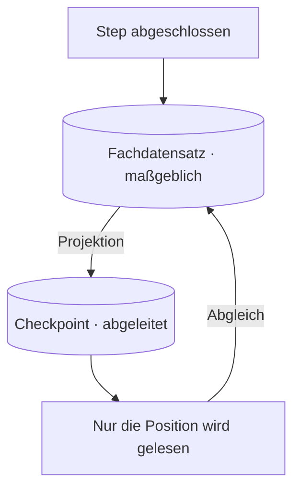

# Wem gehört der Run?

Die [Vertiefung zu Orchestrierungs-Frameworks](../orchestration-frameworks/deep-dive.md) zeichnet ein
übersichtliches Bild. Der Graph ist die tragende Struktur; der Checkpointer ist daran angebunden und
sichert den State nach jedem **Knotenübergang** (im LangGraph-Vokabular: *Super-Step*). Scheitert ein
Durchlauf bei Step 28, setzt er dort wieder ein und muss die vorherigen 27 Modellaufrufe nicht wiederholen.
Jeder dieser Sätze trifft zu. Eine Frage bleibt trotzdem offen, und sie entscheidet, ob das alles in Ihrem
System überhaupt tragfähig ist: **Was gilt, wenn bereits eine andere Komponente den Run-State verwaltet?**

In produktiven Systemen ist das meist der Fall. Im Notebook fällt es nicht auf, und in der Demo, mit der Sie
die Funktionsfähigkeit des Agenten belegen, auch nicht. Im Zielsystem dagegen gibt es fast immer irgendwo
einen Datensatz, anhand dessen eine Stelle außerhalb Ihres Teams später Rechenschaft von Ihnen verlangt. Das
kann ein Kontobuch sein, eine Fallakte oder eine Datensatztabelle mit Aufbewahrungspflicht. Diesen
Fachdatensatz gab es schon vor dem Agenten, und er wird das Framework überdauern. Sobald Sie einen
Checkpointer daneben stellen, gibt es zwei Speicher, die beide festhalten, was geschehen ist.

Diese Lektion behandelt diesen Konflikt und die Entscheidungen, die er erzwingt. Sie müssen festlegen,
welcher Speicher maßgeblich ist und in welche Richtung der State fließt. Sie müssen bestimmen, was ein
fortgesetzter Durchlauf prüft, bevor er handelt. Und Sie müssen beziffern, was die selbst gebaute
Alternative kostet. Die Mechanismen erläutert [Teil 2](./deep-dive.md): wie ein Replay-sicherer Key
abgeleitet wird und was geschieht, wenn zwei nebenläufige Branches denselben State-Key schreiben. Auf
dieser Seite steht die Entscheidung.

Ein bewusst allgemeiner Beispielfall trägt die ganze Lektion. Eine **Charge** umfasst etwa **12 000
Einheiten** – Dokumente, Ansprüche, Meldungen, was auch immer Ihre Domäne stapelweise verarbeitet. Die
Modellaufrufe für den Durchlauf einer Einheit kosten ungefähr **2 US-Cent**, eine Charge also etwa
**240 US-Dollar**. Ungefähr **jede vierzigste Einheit** wird Monate später erneut geöffnet, weil eine
Korrektur eingeht. Der Datensatz muss **fünfzehn Monate** lang vorgelegt werden können. Und der einzige
Entwickler, der den derzeit laufenden Scheduler jemals debuggt hat, verlässt das Team in **sechs Wochen**.
Jeder Abschnitt unten ist eine Entscheidung, die dieses Szenario erzwingt.

## Run-State im Checkpointer – Voraussetzung für die Fortsetzung

Lesen Sie die Dokumentation zur Persistenz eines Frameworks als Anspruch auf Zuständigkeit und nicht als
Funktionsliste. Der Checkpointer bietet nicht an, sich einige Angaben für Sie zu merken. Er beansprucht,
**der** Ort zu sein, an dem der Run-State liegt. Nur unter dieser Voraussetzung lässt sich ein Durchlauf
„ab dem letzten erfolgreichen Step“ fortsetzen. Dafür muss das Framework die Instanz sein, die weiß, welche
Steps abgeschlossen sind.

Steht noch nichts anderes daneben, ist dieser Anspruch berechtigt. Dann zeichnet allein der Checkpointer die
Aktionen des Agenten auf, und daraus folgt die Dauerhaftigkeit. Die Schwierigkeiten beginnen, sobald doch
etwas anderes daneben steht.

Setzen Sie den Agenten aus dem Beispielfall nun in ein reales System. Für jede verarbeitete Einheit
schreibt er in eine Datensatztabelle, die es Jahre vor dem Agenten schon gab. Noch nach fünfzehn Monaten kann
die Aufsichtsbehörde fragen, was mit Einheit 7 431 geschehen ist, und die Antwort muss irgendwoher kommen.
Lautet sie „das weiß der Checkpointer“, dann haben Sie das interne Speicherformat einer Bibliothek zum
Beweismittel gemacht. Was das bedeutet, erfahren Sie im denkbar ungünstigsten Augenblick.

Aus dieser Position folgen drei Dinge, und keines davon ist hypothetisch.

Das erste ist die **Archäologie in fremden Abhängigkeiten**. Die Frage einer prüfenden Stelle – was haben
wir mit dieser Einheit getan, und wann – beantworten Sie jetzt, indem Sie einen serialisierten Graph-State
lesen, dessen Schema einer Bibliothek gehört, die Sie nicht geschrieben haben. Jemand muss rekonstruieren,
welche Framework-Version ihn geschrieben hat, wie das State-Objekt in jener Version aussah und was die
Feldnamen bedeuteten. Das ist keine belastbare Protokollierung, sondern eine forensische Untersuchung unter
Zeitdruck.

Das zweite ist schlimmer, weil es zum Alltag gehört: **Die Schema-Migration einer Abhängigkeit schreibt den
Nachweis um.** Checkpoint-Formate sind interne Formate; sie ändern sich zwischen Versionen, und
Bibliotheken migrieren ihren eigenen Speicher beim Upgrade, weil dieser Speicher aus ihrer Sicht ein Cache
ihres eigenen Arbeitszustands ist. Dieses Verhalten ist völlig korrekt. Zugleich kann schon eine Änderung
der Patch-Version unbemerkt den einzigen Nachweis über den Vorgang umschreiben. Ihre Testsuite bemerkt davon
nichts, denn der Durchlauf lässt sich weiterhin fortsetzen.

Das dritte ist eine Diskrepanz, die Sie ausrechnen können. Eine Engine bewahrt ihren Verlauf nur für ein
begrenztes Fenster auf, und dieses Fenster ist meist kürzer als eine Aufbewahrungspflicht und lässt sich
nicht auf deren Dauer ausdehnen. [AWS Step Functions](https://docs.aws.amazon.com/step-functions/latest/dg/service-quotas.html) speichert den Ausführungsverlauf **90 Tage** lang; auf Antrag
lässt sich dieser Wert auf 30 Tage *verringern*, und es gibt keinen Antrag, der ihn verlängert. Gegen eine
Pflicht von fünfzehn Monaten – rechnen Sie mit 456 Tagen – deckt der Verlauf der Engine das erste Fünftel
der Verpflichtung ab und hört dann auf zu existieren. Keine Konfiguration schließt diese Lücke, denn die
Lücke ist keine Fehlkonfiguration. Sie ist die klare Auskunft des Anbieters, wofür dieser Speicher da ist.

Der Satz, den Sie aus diesem Abschnitt mitnehmen, ist kurz. Der Checkpointer hält **operativen State**: Er
ist da, damit ein Durchlauf fortgesetzt werden kann. Er ist kein Nachweis für ein Audit und kein führendes System.
Ihn dennoch dafür zu verwenden, ist eine Entwurfsentscheidung – ob Sie sie bemerken oder nicht.

## Zwei Speicher, nur eine Autorität

Die Lösung besteht nicht darin, dem Framework zu misstrauen. Legen Sie einmalig und ausdrücklich fest,
welcher Speicher **maßgeblich** und welcher **abgeleitet** ist. Halten Sie diese Trennung anschließend im
Code durch und nicht in einem Dokument, das niemand liest.

Maßgeblich heißt: Weichen die beiden voneinander ab, hat dieser recht, und der andere wird neu aufgebaut.
Abgeleitet heißt: Dieser lässt sich löschen und rekonstruieren, ohne dass etwas von Wert verloren geht.
Eine dritte Möglichkeit, bei der beide ein wenig maßgeblich sind, gibt es nicht. Der Defekt liegt darin,
dass zwei Instanzen dieselbe Wahrheit schreiben – nicht am Framework, nicht an der Datenbank, sondern an der
*Anordnung*.

Vier Entscheidungen tragen diese Trennung, und jede ist es wert, benannt zu werden, weil jede anders
scheitert, wenn sie implizit bleibt.

**Ein-Schreiber-Disziplin.** Genau eine Komponente schreibt den Fachdatensatz. Nicht „der Agent schreibt,
und der Abgleichsprozess räumt hinterher auf“ – eine schreibende Instanz. Sobald ein zweiter Schreibpfad
existiert, wird aus jedem Konsistenzargument eine Race Condition, über die Sie um drei Uhr nachts
nachdenken müssen. Und der fortgesetzte Durchlauf ist genau der Fall, in dem dieser zweite Pfad auftaucht.

**Eine benannte Projektionsrichtung.** Der State fließt vom Fachdatensatz zum Checkpoint und nie umgekehrt.
Der Checkpointer hält eine *Projektion* dessen, was der Fachdatensatz ohnehin schon sagt – genug, um einen
Durchlauf fortzusetzen, mehr nicht. Bleibt die Richtung unbenannt, wird sie unversehens beidseitig – mit
jedem weiteren Feld, das jemand der Bequemlichkeit halber zurückschreibt. Und der Tag, an dem Sie es merken,
ist der Tag, an dem beide voneinander abweichen.

**Verantwortung für das Schema und seine Migrationen.** Jemand in Ihrem Team verantwortet das Schema des
Fachdatensatzes und versioniert es bewusst. Das Schema des Checkpoints verantwortet niemand in Ihrem Team –
das tut die Bibliothek, und sie ändert es, wann sie will. Diese Asymmetrie ist das ganze Argument dafür,
welcher der beiden den Nachweis hält, und sie überlebt jedes Framework, zu dem Sie wechseln könnten.

**Abgleich beim Fortsetzen.** Ein fortgesetzter Durchlauf entnimmt dem Checkpoint seine *Position* und
ermittelt anhand des Fachdatensatzes erneut, *was tatsächlich abgeschlossen ist*, bevor er handelt. Der
Checkpoint sagt, wo er steht. Der Fachdatensatz sagt, was bereits erledigt ist. Ein Durchlauf, der dem
Checkpoint auch die zweite Frage abnimmt, wiederholt bereitwillig Arbeit, die der Fachdatensatz längst als
fertig ausweist – und bei 240 US-Dollar pro Charge ist diese Rechnung nicht akademisch.

Und jetzt der Teil, der leicht übersehen wird und der die tragende Aussage der ganzen Seite ist: **Diese
Trennung gilt unabhängig davon, ob Sie das Framework übernehmen.** Ob Sie das Framework übernehmen und
welches System für den Fachdatensatz maßgeblich ist, sind zwei getrennte Entscheidungen, die ständig zu
einer einzigen verschmolzen werden. „Wir verwenden LangGraph, also ist der Checkpointer unser State“ sind zwei
aneinandergeklebte Schlüsse, von denen nur einer tatsächlich begründet wurde.

Sie können das Framework mit voller Überzeugung übernehmen, seinen Graphen nutzen, seinen Checkpointer,
seine `interrupt()`-Aufrufe, den ganzen Apparat – und trotzdem den Fachdatensatz maßgeblich halten, mit dem
Checkpoint als abgeleiteter Projektion. Das ist keine Kompromissposition und keine halbe Übernahme. Es ist
die Anordnung, die Ihnen die Fortsetzungssemantik des Frameworks *und* eine Protokollierung verschafft, die
das Framework überdauert, und sie steht Ihnen offen, wie auch immer die Übernahmefrage ausgeht. Genau darum
sollten Sie sie getrennt entscheiden.

## Fortsetzung eines offenen Runs versus neuer Anlass nach Abschluss

Hinter der ersten Verwechslung steckt eine zweite, und sie gehört auseinandergenommen, bevor Sie sich nach
Technik umsehen: Die beiden Probleme, die sie vermengt, haben verschiedene Antworten.

**Das Anhalten eines offenen Durchlaufs** ist die Aufgabe von Durable Execution (dauerhafte Ausführung – ein
**Durchlauf** wird nach einem Absturz an der letzten gesicherten Stelle fortgesetzt). Dabei
existiert ein lebender Durchlauf. Er ist angehalten – mitten in der Verarbeitung, wartend auf eine
menschliche Freigabe oder durch einen Absturz gestoppt –, und seine Position und sein Arbeitszustand liegen
irgendwo, damit er dort weitermachen kann, wo er stand. Hier wartet tatsächlich etwas. Fortsetzen ist ein
echtes Verb, und der ganze Apparat um den Checkpointer existiert, damit es funktioniert.

**Das Wiederaufgreifen eines abgeschlossenen Vorgangs** hat eine ganz andere Gestalt. Der Durchlauf ist
beendet, der Fachdatensatz geschrieben, der Fall geschlossen – und drei Monate später geht eine Korrektur
ein. In unserer Charge ist das die eine Einheit von vierzig: Etwa 300 von je 12 000 Einheiten kehren lange
nach dem Ende ihres Durchlaufs zurück.

Hier wartet nichts. Es gibt keine angehaltene Ausführung, die fortzusetzen wäre, keinen zwischengesicherten
Arbeitszustand, keine Position, an der man stehen könnte. Vorhanden sind **ein aufbewahrter Datensatz** und
ein neuer Anlass, auf ihn zu reagieren. Die richtige Gestalt dafür ist **ein neuer, verknüpfter Durchlauf
auf Basis dieses Datensatzes**: eine frische Ausführung, die auf das Original verweist, den aufbewahrten
Datensatz als Eingabe liest und ihr eigenes Ergebnis schreibt.

Zum Checkpoint zu greifen ist hier der Fehler, und die Wortwahl verleitet dazu. Beide Vorgänge heißen
umgangssprachlich „den Fall fortsetzen“. Ein drei Monate alter Checkpoint ist jedoch eine Momentaufnahme
des internen States eines Frameworks, aufgenommen von einer Graph-Version, die Sie seither geändert haben,
und ausgedrückt in einem Schema, das die Bibliothek seither migriert hat. Selbst wenn Sie ihn laden
könnten: Eine Fortsetzung *an dieser Stelle* würde einen Durchlauf neu starten, dessen Welt sich
weitergedreht hat. Der Fachdatensatz ist dafür entworfen, Monate später gelesen zu werden. Der Checkpoint
ist es nicht.

Die praktische Prüfung besteht aus einer Frage: **Wartet etwas?** Falls ja, liegt eine angehaltene
Ausführung vor, und die Dauerhaftigkeit ist der Mechanismus dafür. Falls nein, haben Sie einen Datensatz
und einen neuen Anlass zu handeln, und was Sie brauchen, ist ein neuer Durchlauf mit einem Verweis zurück –
der übrigens gar keinen Checkpointer benötigt.

## Durable Execution – der etablierte Maßstab außerhalb von AI

Alles bisher Gesagte lässt sich leichter begründen, sobald Sie wissen, dass nichts davon neu ist und dass
das Fach außerhalb von AI die Frage längst entschieden hat.

„Dauerhafter Zustand auf Step-Ebene, mit einer Pause, aus der heraus fortgesetzt werden kann“ ist eine
gelöste Problemklasse mit einem Namen. [Temporal](https://docs.temporal.io/evaluate/understanding-temporal) nennt sie **Durable Execution** und baut ein Produkt um
genau dieses Versprechen. AWS **[Step Functions](https://docs.aws.amazon.com/step-functions/latest/dg/choosing-workflow-type.html)** ist die verwaltete Ausprägung desselben Gedankens.
**[Apache Airflow](https://airflow.apache.org/docs/apache-airflow/stable/)**, **[Prefect](https://docs.prefect.io/v3/get-started/index)** und **[Dagster](https://docs.dagster.io/)** nähern sich der Aufgabe von der Seite der geplanten
Pipelines. Keines dieser Systeme ist ein AI-Werkzeug, und keines wurde für Agenten gebaut – und genau
deshalb sind sie hier nützlich: Sie haben dieses Problem gelöst, als die Steps Banküberweisungen und
ETL-Jobs waren – und zwar unter einer Aufsicht, wie es sie für LLM-Workloads bislang nicht gibt.

Das zugehörige Vokabular können Sie sofort verwenden. Die **Zustellsemantik** – exactly-once,
at-least-once, at-most-once – sagt, welche Zusage eine Engine für einen möglicherweise wiederholten Step
gibt. **Determinismus und Replay** sagen, was Ihr Code garantieren muss, damit eine Engine einen Durchlauf
überhaupt rekonstruieren kann. **Die Kompensation** ([Compensation](https://docs.aws.amazon.com/prescriptive-guidance/latest/patterns/implement-the-serverless-saga-pattern-by-using-aws-step-functions.html)) benennt das nachträgliche Rückgängigmachen eines
bereits ausgeführten Steps, denn nicht alles lässt sich durch eine Wiederholung richtigstellen. Jeder dieser Punkte ist eine Frage, die Sie an einen Checkpointer richten können,
und [Teil 2](./deep-dive.md) stellt sie der Reihe nach.

Erst dieser Vergleich macht das State-Modell eines Frameworks **beurteilbar** statt zur Geschmacksfrage.
Ohne ihn ist „der Checkpointer sichert den State nach jedem Knotenübergang“ eine Angabe, die Sie nur
abnicken können. Mit ihm können Sie die Fragen stellen, die über die Qualität des Entwurfs entscheiden:
Welche Zustellsemantik gilt für einen Step? Was geschieht bei der Wiederholung eines bereits erfolgreichen
Steps? Wie lange wird die Historie aufbewahrt, und von wem? Was verlangt die Engine von meinem Code, um ihn
erneut auszuführen? Ein LLM-Framework darf diese Fragen anders beantworten als Temporal. Unbeantwortet
lassen darf es sie nicht – und solange Sie nicht wissen, dass die Problemklasse etablierte Antworten hat,
kommen Sie gar nicht darauf, sie zu stellen.

## Preisen Sie Wartung, Onboarding und Bus-Faktor ein

Die [Lektion über Orchestrierungs-Frameworks](../orchestration-frameworks/index.md) beziffert die
Übernahme ehrlich: Preis der Abstraktion, Veränderungstempo im Ökosystem, Portabilität gegen Lock-in. Was sie nie
beziffert, ist die Alternative, die sie empfiehlt. Das Lock-in-Argument läuft im Curriculum bislang nur in
eine Richtung – und ein selbst gebauter Orchestrator ist ebenfalls nicht umsonst. Seine Rechnung kommt nur
später und unter einem anderen Posten.

Die **Wartungslast** ist der sichtbare Teil. Die Wiederholungen, den Backoff, die Zeitschranken, den Pfad
zur Fortsetzung, die Buchführung darüber, welche Steps abgeschlossen sind – das alles haben Sie
geschrieben, also verantworten Sie es auch, einschließlich des Nebenläufigkeitsfehlers, der einmal im
Quartal unter einer Last auftritt, die Sie nicht reproduzieren können. Die entsprechenden Fehler eines
Frameworks müssen Sie ebenfalls umgehen, aber gefunden haben sie andere, behoben werden sie auf fremde
Kosten, und dokumentiert sind sie in einer Fehlerdatenbank, die Sie durchsuchen können.

Die **Kosten der Einarbeitung** fallen meist unter den Tisch, und sie folgen aus einer schlichten
Asymmetrie. Ein benanntes Framework lässt sich aus öffentlicher Dokumentation lernen: Wer neu dazukommt,
liest die Doku, arbeitet ein Tutorial durch, findet um Mitternacht eine Antwort auf Stack Overflow und
wird produktiv, ohne jemanden zu fragen. Einen selbst gebauten Scheduler lernen Sie **nur von seinem
Autor**. Es gibt keine Dokumentation außer dem Code, kein Tutorial, keine beantworteten Fragen – jede Frage
läuft über eine Person, und der Durchsatz dieser Person ist jetzt Ihr Budget für die Einarbeitung.

Beim **Bus-Faktor** treffen die beiden aufeinander. In unserem Szenario verlässt der einzige Entwickler,
der jemals im Scheduler nach Fehlern gesucht hat, das Team in sechs Wochen. Das ist keine weiche Frage der
Unternehmenskultur, sondern die tragende Tatsache der Entscheidung. In sechs Wochen wird das System, das
darüber entscheidet, ob Arbeit im Wert von 240 US-Dollar wiederholt oder übersprungen wird, von Leuten
gepflegt, die es nie haben scheitern sehen. Das ist ein echtes Argument *für* die Übernahme von etwas
Benanntem – und beachten Sie, dass es nichts damit zu tun hat, ob das Framework technisch besser ist. Es
ist ein Argument darüber, wo das Wissen liegt.

Jetzt das Gegengewicht, denn auch dieses Argument läuft nicht nur in eine Richtung, und die ehrliche
Fassung muss es aushalten. **Eine Schleife aus 300 Zeilen kann einen höheren Bus-Faktor haben als ein
Graph, den niemand im Team je ausgeführt hat.** Der Bus-Faktor misst, wie viele Personen die Sache tragen
können, und eine Datei mit 300 Zeilen gewöhnlichem Python, die vier Entwickler jeweils von vorn bis hinten
gelesen haben, wird von vier Personen getragen. Ein Graph-Framework, dessen Fehlermodi genau ein Entwickler
je unter echtem Störungsdruck untersucht hat, wird von einer Person getragen – die Dokumentation existiert,
aber Dokumentation während eines Incidents zu lesen ist nicht dasselbe, wie dabei gewesen zu sein. Die
Übernahme verschiebt Wissen aus Ihrer Codebasis in ein öffentliches Gemeingut; Vertrautheit schafft sie
nicht, und Vertrautheit ist das, was Sie um drei Uhr nachts tatsächlich brauchen.

Beziffern Sie also beide Spalten und entscheiden Sie dann. Selbst gebaut: die Wartung tragen Sie, die
Einarbeitung läuft über eine Person, der Bus-Faktor entspricht der Zahl derer, die das System wirklich
kennen. Framework: Preis der Abstraktion, Veränderungstempo im Ökosystem, Lock-in und eine Lernkurve – aber eine
Kurve, die eine neue Kollegin erklimmen kann, ohne dafür einen Termin bei jemandem buchen zu müssen. In unserem Szenario gibt das
Ausscheiden in sechs Wochen den Ausschlag, und das zu Recht. Ändern Sie eine Tatsache – vier Entwickler
beherrschen die Schleife bereits, niemand im Team hat Erfahrung mit dem Framework –, und die Abwägung
kippt mit derselben Begründung in die andere Richtung.

## Das Wichtigste

- Ein **Checkpointer ist ein Anspruch auf die Hoheit über den Run-State**, keine neutrale Funktion: Die
  Zusage „ab dem letzten erfolgreichen Step fortsetzen“ gilt nur, wenn das Framework die Instanz ist, die
  weiß, welche Steps abgeschlossen sind. Räumen Sie ihm diesen Anspruch ein, solange nichts anderes den
  Run-State hält; überlegen Sie gründlich, sobald ein Fachdatensatz ihn bereits hält.
- Legen Sie einmal ausdrücklich fest, welcher Speicher **maßgeblich** und welcher **abgeleitet** ist, und
  halten Sie die Linie mit vier Entscheidungen: Ein-Schreiber-Disziplin, eine benannte Projektionsrichtung,
  eine benannte Verantwortung für das Schema und seine Migrationen sowie der Abgleich beim Fortsetzen. Der
  Defekt liegt darin, dass zwei Instanzen dieselbe Wahrheit schreiben.
- Diese Trennung gilt **unabhängig vom Urteil über die Übernahme des Frameworks**. Sie können das Framework
  vollständig übernehmen und trotzdem den Fachdatensatz maßgeblich halten, mit dem Checkpoint als
  abgeleiteter Projektion – und beides als eine Entscheidung zu behandeln ist der Weg, auf dem Teams am
  Ende das interne Format einer Bibliothek als Nachweis führen.
- **Das Anhalten eines offenen Durchlaufs ist nicht das Wiederaufgreifen eines abgeschlossenen.** Nur für
  den ersten Fall ist die Dauerhaftigkeit die Lösung; der zweite ist **ein neuer, verknüpfter Durchlauf
  auf Basis eines aufbewahrten Datensatzes**, bei dem nichts auf eine Fortsetzung wartet. Die Prüfung lautet, ob
  tatsächlich etwas wartet.
- **Durable Execution ist außerhalb von AI eine gelöste Problemklasse** – [Temporal](https://docs.temporal.io/evaluate/understanding-temporal), Step Functions, Airflow
  und ihre Nachbarn –, und ihr Vokabular (Zustellsemantik, Determinismus und Replay, Kompensation) macht
  einen Checkpointer beurteilbar statt zur Geschmacksfrage.
- **Beziffern Sie auch den selbst gebauten Orchestrator.** Die Wartung tragen Sie, die Einarbeitung läuft
  über einen einzigen Autor, und der Bus-Faktor bemisst sich danach, wie viele Personen das System wirklich
  kennen – dagegen steht das Gegengewicht, dass eine Schleife aus 300 Zeilen, die vier Personen gelesen
  haben, einen Graphen schlägt, den genau eine Person je unter Störungsdruck untersucht hat.

**[Neue Begriffe](../../glossary.md#durable-runs)**: führendes System, maßgeblicher gegen abgeleiteten
State, Ein-Schreiber-Disziplin, Projektionsrichtung, Abgleich beim Fortsetzen, neuer verknüpfter Durchlauf,
Durable-Execution-Engine, Zustellsemantik, Bus-Faktor.

---

:::note[Als Nächstes: Teil 2 der Lektion]

**[Keys, Merges & Engines](./deep-dive.md)** – wie sich ein Idempotency-Key aus Run- und Step-Identität
ableiten lässt, damit ein Replay bereits erledigte Arbeit nicht ein zweites Mal bezahlt; was geschieht, wenn
die Identität eines Steps zwischen Durchläufen wandert; das nebenläufige Verzweigen innerhalb eines Graphen
und der State-Merge, den Sie dafür festlegen müssen; dazu die Zusagen zu Zustellung, Determinismus und
Versionierung, auf die sich die Durable-Execution-Engines geeinigt haben.

Siehe auch: der Checkpointer, die Threads und die `durability`-Modi, auf denen diese Seite aufbaut –
[Orchestrierungs-Frameworks, Teil 2](../orchestration-frameworks/deep-dive.md); die Idempotenz als
Eigenschaft eines Tools – [Tool-Einsatz, Teil 2](../tool-use/deep-dive.md); wie die Agentenlaufzeiten der
Anbieter selbst mit Persistenz und Fortsetzung umgehen – [der Abschluss dieses Teils](../real-agents.md).

:::
