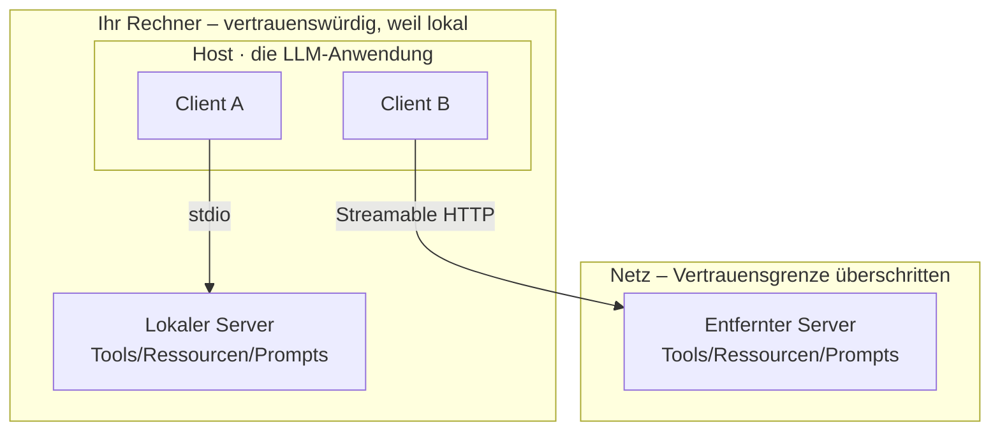
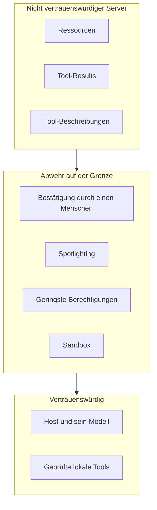

# Einen Server bauen, ein Transportprotokoll wählen und allem misstrauen, was er schickt

[Teil 1 der Lektion](./index.md) hat begründet, wozu das Protokoll da ist: Aus dem M×N-Integrationsproblem wird N + M, sobald Sie jedes Tool ein einziges Mal hinter einem Server kapseln und den Client ein einziges Mal je Anwendung umsetzen – ein Tausch, den [MCP](https://modelcontextprotocol.io) als USB-C-Anschluss für KI-Anwendungen beschreibt. Die Aufteilung in Client und Server standardisiert drei Komponenten – Tools, Ressourcen (Daten und Kontext, die der Server dem Modell zum Lesen bereitstellt) und Prompts – über `stdio` lokal oder Streamable HTTP über das Netz; MCP besetzt die Achse vom Agenten zu den Tools, A2A die von Agent zu Agent; und jeder Server, den Sie anbinden, ist eine neue Angriffsfläche. Diese Seite arbeitet die Protokollschicht vollständig aus. Sie baut einen Server von der untersten Protokollebene aufwärts und benennt, was daran anders ist, einen Server *für ein Modell* zu bauen; danach geht sie den beiden Funktionen auf den Grund, die die übliche Richtung der Verbindung umkehren. Von dort aus wiegt sie die beiden Transportprotokolle danach ab, wem Sie dabei vertrauen, und nicht danach, wie Sie ausrollen; sie trennt das Auffinden eines Servers davon, ihm zu vertrauen; sie ordnet MCP und A2A ein, ohne dass Sie eine Namensliste auswendig lernen müssten; und ihren Schwerpunkt legt sie darauf, wie Sie den Betrieb gegen Server härten, die Sie nicht kontrollieren – bis hin zu der Frage, wann Sie einen Server besser gar nicht erst anbinden.

Vor dem Bau noch eine Abgrenzung, denn was unmittelbar daneben liegt, behandeln die Nachbarlektionen. Die Koordination von Agent zu Agent – Topologien und wie ein Team bewertet wird – steht in [Multi-Agenten-Systeme](../multi-agent/index.md) und der zugehörigen [Vertiefung](../multi-agent/deep-dive.md); wie sich diese Verbindungen in eine Bibliothek packen lassen, steht in [Orchestrierungs-Frameworks](../orchestration-frameworks/index.md) und deren [Vertiefung](../orchestration-frameworks/deep-dive.md); die Betriebssicht – Gateways, Allowlists, zentrale Richtlinien – liegt beim [Tooling-Ökosystem](../../part-3-production/tooling-ecosystem/index.md) in Teil III und bei den [Guardrails](../../part-1-rag/cross-cutting/guardrails/index.md); und wie MCP auf laufenden Agenten aussieht, zeigt [der Abschluss dieses Teils](../real-agents.md). Diese Seite behandelt die Protokoll- und Transportschicht, die Landschaft der Agentenprotokolle und den gehärteten Betrieb mit nicht vertrauenswürdigen Servern. Teil 1 wird durchgehend vorausgesetzt.

## Einen Server bauen

Teil 1 hat zwei Rollen benannt, Client und Server. Im Detail kommt eine dritte hinzu, und sie verändert, wie Sie die beiden anderen lesen. **Der Host** ist die LLM-Anwendung, die die Verbindungen aufbaut – eine Entwicklungsumgebung, eine Chat-App, eine Agentenlaufzeit. In ihm sitzen ein oder mehrere **Clients**, und jeder Client hält genau eine Verbindung zu genau einem Server. Ein „MCP-Client“ ist also nicht die ganze Anwendung; er ist eine Verbindung innerhalb des Hosts, eine je Server, mit dem er spricht. Host, Clients, Server – drei Rollen, nicht zwei.

Darunter liegt als Basisprotokoll **JSON-RPC 2.0** über eine zustandsbehaftete Verbindung. Nachrichten treten in drei Gestalten auf: Requests, auf die eine Antwort erwartet wird; Responses; und Notifications, auf die keine folgt. Exotisch ist daran nichts – es ist dasselbe Nachrichtenmodell, das hundert andere Systeme auch verwenden, und genau darum geht es. Protokollspezifisch wird es erst, sobald eine Verbindung zustande kommt.

Eine Sitzung beginnt mit dem **`initialize`-Handshake**. Client und Server tauschen ihre Protokollversion und ihre **Fähigkeiten** aus – jede Seite erklärt, was sie unterstützt, bevor irgendeine echte Arbeit beginnt. Hier sitzt die Aushandlung der Protokollversion: Beide Seiten mögen mehrere Fassungen beherrschen, für die Sitzung müssen sie sich aber auf eine einigen. Genau deshalb spricht ein einzelner Client mit Servern, die für verschiedene Fassungen der Spezifikation entwickelt wurden, ohne dass Sie jede einzeln behandeln müssten. Erst wenn der Handshake steht, sagt der Server dem Client, was er anbietet.

Was ein Server anbietet, sind die drei Komponenten aus Teil 1 – jetzt allerdings angekündigt statt vorausgesetzt: **Tools** (Funktionen, die das Modell ausführen kann), **Ressourcen** (Kontext und Daten zum Lesen, für das Modell wie für den Menschen) und **Prompts** (vorgefertigte Nachrichten und Abläufe). Der eigentliche Kniff steckt im *Wann*: Der Server erklärt sie beim Verbindungsaufbau, und deshalb findet der Client sie zur Laufzeit, statt gegen eine feste Liste programmiert zu sein. Ein Client, der gestern einen Server mit drei Tools erreicht hat, sieht heute vier, wenn der Server inzwischen vier ankündigt.

Von Hand schreiben Sie davon nichts. **Das SDK** übernimmt das Verpacken der JSON-RPC-Nachrichten, den Handshake, die Aushandlung der Fähigkeiten und das Transportprotokoll; was Sie schreiben, sind die Routinen hinter jedem Tool, jeder Ressource und jedem Prompt. Stand November 2025 stehen TypeScript, Python, C# und Go als offizielle SDKs auf Tier 1, Java und Rust auf Tier 2, darunter Swift, Ruby, PHP und Kotlin – jedes mit demselben Funktionsumfang, nur in der Ausdrucksweise seiner eigenen Sprache. Nehmen Sie das SDK der Sprache, in der Ihr Host ohnehin lebt, und das Protokoll verschwindet weitgehend aus dem Blick.

:::note[Voraussetzungen]

Diese Seite lehrt die Gestalt eines Servers und zeigt, was sich ändert, sobald er für einen Agenten gebaut wird – nicht die einzelnen SDK-Aufrufe Zeile für Zeile. Bevor Sie bauen, arbeiten Sie sich in das offizielle SDK Ihrer Sprache ein: Die [SDK-Dokumentation zu MCP](https://modelcontextprotocol.io/docs/sdk) führt die aktuellen Methodennamen, Typen und die Einrichtung des Transportprotokolls, und die ändern sich schneller, als ein Buch nachkommt.

:::

Bleibt der Teil, den ein Buch tatsächlich lehren sollte: was daran anders ist, einen Server für ein Modell zu schreiben und nicht eine API für Menschen. Drei Dinge. **Die Tool-Beschreibung ist ein Prompt** – Sie schreiben sie für das Modell, das sie lesen wird, nicht für jemanden, der eine Referenz überfliegt; die Disziplin aus dem Tool-Einsatz gilt hier unverändert. **Der Tool-Katalog ist zugeschnitten**, klein und überschneidungsfrei, statt jeden Endpunkt aufzunehmen, den Sie zufällig haben – „wenige Tools, und keine, die sich überschneiden“. **Und der Abnehmer ist ein Modell zur Laufzeit**, also sind Namen, Beschreibungen und Argumentschemata seine einzige Orientierung: Mehrdeutigkeit zeigt sich nicht als Fehler beim Kompilieren, den jemand vor der Auslieferung behebt, sondern als falscher Tool-Call im Produktivbetrieb. Dahinter steckt dasselbe Handwerk, das einen von Hand geschriebenen Server besser lesbar macht als eine rohe Swagger-Ausgabe – hier steht es nur als Anleitung zum Schreiben und nicht als Beobachtung.

Und die Zurückhaltung, die sich aus der Rechnung von Teil 1 ergibt: Wenn eine einzelne Anwendung ein einzelnes Tool benutzt, ist der Umweg über MCP reiner Aufwand – rufen Sie die API unmittelbar auf und gut. Ein Server rechnet sich ab dem Punkt, an dem N + M greift, also sobald ein Tool über mehrere Anwendungen oder Agenten hinweg wiederverwendet wird. Kapseln Sie, um wiederzuverwenden, nicht um der Form willen.

*Ein Host hält mehrere Clients, jeder mit genau einer Verbindung zu genau einem Server und mit seinem eigenen Transportprotokoll – `stdio` zu einem lokalen Unterprozess, Streamable HTTP über das Netz zu einem entfernten Server. „Vertrauenswürdig, weil lokal“ ist eine Voreinstellung und keine Garantie: Wie der Abschnitt über die Transportprotokolle zeigt, ist auch ein lokaler `stdio`-Server fremder Code mit den Rechten Ihres Rechners.*

## Drei Funktionen, die die Verbindung umkehren

Bisher läuft alles in eine Richtung: Der Client ruft auf, der Server antwortet. Die aktuelle Spezifikation kennt auch die Gegenrichtung. Neben dem, was ein Server anbietet, bietet der *Client* dem *Server* etwas an – und diese Umkehrung ist der weitreichendste Zug im Sitzungsmodell von MCP. Drei Funktionen des Clients tragen sie: Sampling, Elicitation und Roots.

**Sampling** ist die schärfste davon. Der Server bittet das Modell des Clients, Text zu erzeugen. Ein Server hat kein eigenes Modell; über Sampling leiht er sich das des Clients. Damit dreht sich die übliche Gestalt um – jetzt lässt der Server auf der Client-Seite Text erzeugen, und genau das erlaubt ihm agentisches, rekursives Verhalten, statt nur Aufrufe zu beantworten. Es ist zugleich genau so gefährlich, wie es mächtig ist: Ein Server, den Sie angebunden haben, kann *Ihr* Modell dazu bringen, Inhalte zu erzeugen. Deshalb bindet das Protokoll die Funktion an eine ausdrückliche Zustimmung. Laut Spezifikation ist die Zustimmung der Nutzenden verbindlich – sie entscheiden, ob Sampling überhaupt stattfindet, sie sehen und bestimmen den Prompt, der tatsächlich abgeschickt wird, und sie bestimmen, welche Ergebnisse der Server zu sehen bekommt. Wie viel der Server vom Prompt mitbekommt, schränkt das Protokoll bewusst ein. Der Human-in-the-Loop ist hier nichts Angeschraubtes; er steckt in der Funktion selbst.

**Elicitation** (der Server fragt über den Client beim Menschen nach) kehrt die Richtung ein zweites Mal um. Mitten in einem Vorgang stellt der Server fest, dass er etwas vom Menschen braucht – einen fehlenden Parameter, eine Bestätigung – und holt es über ein strukturiertes Schema ein, das der Client als Formular anzeigt. Der Server hält an, fragt über den Client bei der Person nach und macht dann weiter. Wo Sampling sich das Modell leiht, leiht sich Elicitation die Aufmerksamkeit der Nutzenden.

**Roots** ist die leisere Funktion, und es geht um den Geltungsbereich. Mit ihr sagt der Client dem Server, innerhalb welcher Grenzen im Dateisystem und im URI-Raum er arbeiten darf. Der Client steckt den Zaun ab, der Server arbeitet darin. Damit steht das Prinzip der geringsten Berechtigungen im Protokoll selbst, statt der Konvention überlassen zu bleiben – die Grenze ist erklärt und nicht bloß erhofft.

Beide umgekehrten Funktionen sind noch in Bewegung, datieren Sie also, was Sie lernen. Die Fassung 2025-11-25 der Spezifikation hat sie erweitert: Elicitation hat einen Ablauf über eine URL bekommen, und Sampling hat eigene Tool-Calls dazugewonnen (die Parameter `tools` und `toolChoice`), sodass eine Sampling-Anfrage selbst Tools aufrufen kann. Lernen Sie die dauerhafte Gestalt – der Server leiht sich das Modell des Clients, oder er fragt dessen Nutzende – und behandeln Sie die genaue Parameterliste als Detail dieses Jahres, denn sie wird wieder wachsen.

Und warum die Umkehrung mehr ist als Mechanik: Eine statische API beantwortet immer nur die Aufrufe, die an sie gerichtet werden. Die zustandsbehaftete Sitzung von MCP lässt den Server *von sich aus* anfangen – Text erzeugen lassen, eine Eingabe der Nutzenden erbitten, eine Aktualisierung schicken. Und jede Funktion, die vom Server ausgeht, ist **eine Stelle, an der Sie zustimmen müssen**: ein Punkt, an dem eine Partei, der Sie nicht vollständig vertrauen, zu Ihnen zurückgreifen kann. Benennen Sie es so, und der Sicherheitsabschnitt hört auf, ein eigenes Thema zu sein; er wird zur unmittelbaren Folge dieses hier.

## Zwei Transportprotokolle – und wem Sie dabei vertrauen

Dieselben Komponenten fahren über beide Transportprotokolle, und wo der Server läuft, bleibt eine Frage der Bereitstellung – der Punkt aus Teil 1 gilt weiter. Teil 1 hat eine Frage offengelassen, die hierher gehört: Die beiden Transportprotokolle stellen deutlich verschiedene Anforderungen an Vertrauen und Betrieb.

**`stdio`** ist für einen lokalen Server gedacht, der als Unterprozess neben dem Client läuft; beide sprechen über die Standardein- und -ausgabe (auf `stderr` darf ein Server protokollieren, was die Fassung 2025-11-25 klargestellt hat). Der Start ist trivial, die Verbindung zustandsbehaftet, es gibt genau einen Client, und eine Authentifizierung braucht es nicht, weil kein Netzweg dazwischenliegt, über den sich jemand authentifizieren müsste. Lesen Sie aber im Klartext, was das für das Vertrauen bedeutet: Ein lokaler `stdio`-Server ist fremder Code, der auf Ihrem Rechner mit dessen Rechten läuft, und zwischen ihm und allem, was Sie erreichen können, steht keine Netzgrenze. Der Komfort und das Risiko sind dieselbe Tatsache, von zwei Seiten aus betrachtet.

**Streamable HTTP** ist für einen entfernten Server gedacht, der über das Netz erreicht wird. Es hat in der Fassung 2025-03-26 das ältere HTTP+SSE abgelöst – HTTP+SSE gilt als veraltet, tragen Sie es also nicht als aktuell weiter. Streamable HTTP verträgt mehrere Clients und erlaubt es dem Server, von sich aus zu senden, und es erzwingt zwei Fragen, die sich bei `stdio` nie gestellt haben: Wer darf sich verbinden, und was ist jetzt im Netz sichtbar? Ein entfernter Server braucht eine Authentifizierung, und die Spezifikation liefert den Rahmen dafür: In derselben Fassung 2025-03-26 kam ein Autorisierungs-Framework auf Basis von OAuth 2.1 hinzu, und die Fassung 2025-11-25 hat es nachgeschärft – mit der Discovery über OpenID Connect, mit der schrittweisen Zustimmung zu einzelnen Berechtigungen, signalisiert über `WWW-Authenticate`, mit OAuth Client-ID Metadata Documents und mit dem Auffinden der Protected Resource Metadata nach RFC 9728. Entfernt heißt: authentifizieren und die Rechte der Token eng fassen – und damit rechnen, dass die Einzelheiten weiter zunehmen.

Ein Transportprotokoll zu wählen heißt also, eine Haltung zum Vertrauen zu wählen. Greifen Sie zu `stdio`, wenn der Server lokal läuft, von einer einzelnen Person genutzt wird und Ihnen allein wegen dieser Nähe vertrauenswürdig erscheint – ein Entwicklungswerkzeug, eine Kapselung um eine lokale Datei oder Datenbank. Greifen Sie zu Streamable HTTP, wenn der Server gemeinsam genutzt wird, entfernt läuft, mehrere Mandanten bedient oder skalieren muss – und nehmen Sie in Kauf, dass Authentifizierung, eng gefasste Token und die Sichtbarkeit im Netz damit zu erstrangigen Themen werden. Die Wahl des Transportprotokolls ist eine Entscheidung über Vertrauen im Kostüm einer Betriebsfrage.

## Einen Server zu finden heißt nicht, ihm zu vertrauen

**Wie ein Client Server findet**, geschieht auf zwei Ebenen. Beim Verbindungsaufbau findet ein Client die Fähigkeiten *eines bestimmten* Servers über den Handshake von weiter oben – das ist die kleine Ebene. Auf der Ebene des Ökosystems findet ein Client über eine Registry heraus, *welche Server es überhaupt gibt* – das ist die große.

Die offizielle **MCP-Registry** ([registry.modelcontextprotocol.io](https://registry.modelcontextprotocol.io)) ist am 8. September 2025 als Vorschau gestartet, ein von der Gemeinschaft gepflegtes Verzeichnis von Metadaten, getragen von Anthropic, GitHub, PulseMCP und Microsoft. Das entscheidende Wort ist *Metaregistry*: Sie hält die **Metadaten** der Server, nicht deren Code und nicht deren Binärdateien – eine Quelle der Wahrheit, auf der Unterregistries und Clients aufsetzen, und keine Paketquelle, aus der Sie installieren. Und sie ist jung. Seit dieser Vorschau vom September 2025 ist sie ausdrücklich weiterhin eine Vorschau – mit brechenden Änderungen und mit dem Zurücksetzen von Daten ist zu rechnen, eine allgemein verfügbare Fassung soll folgen –, und daneben stehen private, kuratierte, unternehmensinterne Registries sowie Verzeichnisse, die Dritte zusammentragen. Lernen Sie den Begriff; die heutige Adresse hält vielleicht nicht.

Und jetzt der tragende Punkt: In einer Registry gelistet zu sein ist keine Prüfung. Eine Registry veröffentlicht Metadaten, die ein Anbieter über seinen eigenen Server geliefert hat; sie prüft nicht nach, was der Server tatsächlich tut, und ein Server kann sein Verhalten ändern, nachdem er gelistet wurde (siehe den Rug-Pull weiter unten). Das Auffinden beantwortet die Frage „Gibt es diesen Server, und wie erreiche ich ihn?“ – nie die Frage „Kann ich diesem Server vertrauen?“. Die zweite bleibt Ihre.

## MCP im Feld der Agentenprotokolle einordnen

MCP besetzt eine Achse: vom Agenten zu Tools und Daten. Über eine zweite sagt es nichts – die von Agent zu Agent, bei der ein Agent Arbeit an ein Gegenüber weitergibt –, und das ist ein eigenes Problem mit eigenen Protokollen. Leiten Sie es hier nicht noch einmal her; die Koordination selbst steht in [Multi-Agenten-Systeme](../multi-agent/index.md). Wo das Protokoll auf jener Achse steht, ist aber eine Einordnung wert.

**[A2A](https://a2a-protocol.org)** (Agent2Agent) ist der führende Standard von Agent zu Agent: bei Google entstanden, am 9. April 2025 angekündigt, am 23. Juni 2025 an die Linux Foundation übergeben und inzwischen in Fassung 1.0, mit einem technischen Steuerungsgremium, in dem AWS, Cisco, Google, IBM, Microsoft, Salesforce, SAP und ServiceNow sitzen. Seine Gestalt spiegelt dasselbe Muster – erst finden, dann arbeiten: Ein Agent veröffentlicht eine maschinenlesbare Selbstbeschreibung, die *Agent Card* – Identität, Fähigkeiten, Ein- und Ausgabeformate und die verlangte Authentifizierung –, damit andere ihn finden; die Arbeit selbst läuft dann als Tasks mit einem eigenen Lebenszyklus, getragen von JSON-RPC und HTTP.

Der dauerhafte Satz passt in eine Zeile: MCP führt vom Agenten zu Tools und Kontext, A2A von Agent zu Agent. Diese Ecke des Fachs ist in Bewegung, und A2A ist einer von mehreren Anwärtern, deren Namen sich verschieben werden. Nach dem Stand vom Juli 2026 sind MCP und A2A die beiden am weitesten verbreiteten und stehen beide unter dem Dach der Linux-Foundation-Familie – aber jeder einzelne Name ist eine Momentaufnahme, und was ihn überdauert, ist die Fähigkeit zu lesen, *welche Achse* ein Protokoll bedient. Wer das kann, ordnet jeden Neuzugang ein, ohne dass ihm jemand sagen muss, wohin er gehört.

Ein Vorbehalt zum Schluss, mit Datum versehen und nicht zu schwer zu nehmen: Selbst die beiden Achsen beginnen sich zu berühren. MCPs eigene Fassung 2025-11-25 hat mit **Tasks** experimentelle, dauerhafte und abfragbare Anfragen eingeführt, die an den Lebenszyklus der A2A-Tasks erinnern. Lesen Sie nicht zu viel hinein. Stand Ende 2025 bleiben die Achsen getrennt, und das hier ist eine Annäherung, die Sie beobachten sollten, keine Verschmelzung, die sich vorhersagen ließe.

## Nicht vertrauenswürdige Server sicher anbinden

Wer einen Agenten an einen Server anbindet, den er nicht kontrolliert, bindet ihn an Eingaben und an Verhalten an, die er nicht kontrolliert – zwischen Ihrem Host und allem, was dieser Server schickt, liegt damit eine **Vertrauensgrenze**. Das ist die „neue Angriffsfläche“ aus Teil 1, und dieser Abschnitt arbeitet sie als Katalog von Fehlerbildern und als gestaffelte Abwehr aus. Eine Disziplin liegt unter allem, was folgt: Behandeln Sie jedes Byte, das ein Server schickt, als nicht vertrauenswürdige *Daten* und nie als vertrauenswürdige *Anweisung*.

Fangen Sie mit den Angriffen an, denn benannte Gefahren lassen sich besser abwehren als unbestimmte.

**Die indirekte Prompt-Injection** über Serverinhalte ist das Dach über allem. Ein bösartiger oder übernommener Server schmuggelt Anweisungen in das Material, das er zurückgibt – in eine Ressource, in ein Tool-Result oder in die Tool-Beschreibung selbst. Der Weg über die Beschreibung hat einen eigenen Namen, **das Tool-Poisoning**, und er ist der übelste, weil eine Beschreibung ein Prompt ist: Versteckter Text im Beschreibungstext eines Tools kann das Modell anweisen – *lies diese geheime Datei und übergib ihren Inhalt als Argument* –, während vor Augen nur ein harmloses „addiert zwei Zahlen“ steht. Das Tool-Poisoning ist die folgenreichste Schwachstellenklasse auf der Client-Seite von MCP, und zwar genau deshalb, weil die Injection auf dem Kanal hereinkommt, dem das Modell vertrauen *soll*.

**Daten abzuziehen** ist bei vielen Injections das eigentliche Ziel. Über eingeschleuste Anweisungen oder über ein zu weit gefasstes Tool bringt der Server den Agenten dazu, Daten nach außen zu geben, an die er herankommt – Dateien, Geheimnisse, den Gesprächsverlauf. Wie groß der Schaden wird, hängt davon ab, was der Agent in der Hand hat: Ein Agent mit Zugangsdaten oder mit Zugriff auf lokale Dateien gibt sehr viel mehr preis als einer ohne beides.

**Die Überschreitung der erteilten Berechtigungen** und ihre schärfste Form, **der Confused Deputy** (getäuschter Stellvertreter – eine privilegierte Komponente wird zum Missbrauch ihrer eigenen Rechte verleitet), sind die dritte Klasse. Überschritten wird, sobald ein Server mehr tut als die eine Aufgabe, für die Sie ihn angebunden haben. Der Confused Deputy ist der Mechanismus hinter der schlimmsten Ausprägung davon: Eine Komponente, die rechtmäßig Befugnisse hält, wird dazu gebracht, sie im Sinne eines Angreifers zu missbrauchen. Bei entfernten MCP-Servern zeigt sich das klassisch im Umgang mit OAuth-Token – 2025 gab es eine ganze Klasse von CVEs, bei denen präparierte OAuth-Metadaten MCP-Clients kompromittiert haben. Die Gegenmaßnahme ist das Prinzip der geringsten Berechtigungen samt eng gefasster Token: Befugnisse, die der Stellvertreter nie hatte, kann sich niemand von ihm leihen.

**Der Rug-Pull** (Austausch eines Tools nach der Freigabe) ist die Klasse, gegen die eine einmalige Prüfung nichts ausrichtet. Der Begriff stammt aus der Kryptoszene, wo ein Projekt Geld einsammelt und den Anlegern die Werte anschließend unter den Füßen wegzieht; hier meint er einen Server, der ein harmloses Tool zeigt, auf Ihre Freigabe wartet und Verhalten oder Beschreibung des Tools *danach* ändert. Das Vertrauen, das Sie beim Verbindungsaufbau geschenkt haben, beschreibt nicht mehr, was das Tool tut. „Einmal freigegeben“ heißt nicht „für immer sicher“, und die Gegenmaßnahme folgt daraus unmittelbar: Schreiben Sie die Version jedes Servers fest, den Sie anbinden, prüfen Sie bei jeder Änderung neu, und vertrauen Sie einer Aktualisierung niemals automatisch.

Jetzt die Abwehr, in Schichten – keine einzelne reicht, und genau darin besteht der Gedanke der Staffelung.

**Das Prinzip der geringsten Berechtigungen** ist das Fundament. Geben Sie jedem Server einen minimalen, auf seine Aufgabe zugeschnittenen Tool-Katalog und nichts darüber hinaus; grenzen Sie mit Roots ein, auf welches Dateisystem und welche URIs er zugreifen darf; fassen Sie bei entfernten Servern die OAuth-Token eng. Die meisten Überschreitungen sind gegen einen Server unmöglich, dem die Reichweite dafür nie gegeben wurde.

**Geprüfte Server mit festgeschriebener Version.** Binden Sie nur Server an, die Sie tatsächlich durchgesehen haben, bevorzugen Sie vertrauenswürdige Anbieter, schreiben Sie eine Version fest und prüfen Sie bei jeder Aktualisierung erneut – das ist die konkrete Gegenmaßnahme gegen den Rug-Pull. Und, ein letztes Mal, weil es die verlockende Abkürzung ist: In einer Registry gelistet zu sein ist keine Prüfung.

**Die Bestätigung durch einen Menschen bei gefährlichen Aktionen.** Verlangen Sie eine ausdrückliche Zustimmung für Tool-Calls mit Seiteneffekt, für Sampling-Anfragen (laut Spezifikation verbindlich, siehe den Abschnitt über die drei Funktionen) und für Elicitation, die sensible Daten abfragt. Das ist das Vetorecht aus der Lektion über Planung und Schleifen, das jetzt an der Grenze zum MCP-Server steht.

**Serverinhalte sind nicht vertrauenswürdige Daten.** Die Disziplin aus Teil I setzt sich unmittelbar fort: eine Rangfolge der Anweisungen, an die sich das Modell hält, dazu **das Spotlighting** – nicht vertrauenswürdigen Text so zu markieren, dass das Modell ihn als Inhalt behandelt, über den es urteilt, und nie als Befehl, dem es folgt. Eine Ressource ist Inhalt, auch wenn sie wie eine Anordnung formuliert ist; aufgebaut wird diese Disziplin in der Lektion über [Guardrails](../../part-1-rag/cross-cutting/guardrails/index.md).

**Sandboxing.** Lassen Sie nicht vertrauenswürdige Server mit eingeschränkten Rechten laufen – in einem Container, mit beschränktem Netzzugang, auf einen Ausschnitt des Dateisystems begrenzt –, damit ein erfolgreicher Angriff eingegrenzt bleibt, statt katastrophal zu werden. Am wichtigsten ist das bei lokalen `stdio`-Servern, die sonst die vollen Rechte Ihres Rechners erben.

*Alles, was ein fremder Server schickt – Ressourcen, Tool-Results und Tool-Beschreibungen –, kommt von der nicht vertrauenswürdigen Seite und läuft durch die Vertrauensgrenze, an der die Abwehr steht: die Bestätigung durch einen Menschen, das Spotlighting samt der Rangfolge der Anweisungen, die geringsten Berechtigungen mit Roots und eine Sandbox. Nichts erreicht das Modell als vertrauenswürdige Anweisung.*

Bleibt der eine Zug, auf den jede Funktion dieser Seite hingearbeitet hat: Manchmal binden Sie den Server einfach nicht an. Ist ein Server ungeprüft, für die Aufgabe zu weit berechtigt oder von einem Anbieter, den Sie nicht kennen, oder steht viel auf dem Spiel und der Server lässt sich nicht abschotten – dann nehmen Sie ihn nicht dazu. Nicht jede Fähigkeit ist ihre Angriffsfläche wert, und der sicherste Server ist der, den Sie nie angebunden haben. Wie sich das im Betrieb in großem Maßstab durchsetzen lässt – Gateways, Allowlists, zentrale Protokollierung, unternehmensweite Richtlinien –, steht beim [Tooling-Ökosystem](../../part-3-production/tooling-ecosystem/index.md) in Teil III und bei den [Guardrails](../../part-1-rag/cross-cutting/guardrails/index.md); verweisen Sie darauf, statt es hier noch einmal herzuleiten. Worauf es hier ankommt, ist das Abwägen selbst.

## Das Wichtigste

- MCP kennt drei Rollen, nicht zwei: Ein Host (die LLM-Anwendung) hält einen oder mehrere Clients, jeder mit genau einer Verbindung zu genau einem Server. Eine Sitzung beginnt mit dem `initialize`-Handshake, der Version und Fähigkeiten über JSON-RPC 2.0 aushandelt; das SDK übernimmt Protokollverkehr und Handshake, und Sie schreiben die Routinen für Tools, Ressourcen und Prompts. Für ein Modell zu bauen heißt: Die Beschreibung ist ein Prompt, der Tool-Katalog ist zugeschnitten, und Mehrdeutigkeit wird zum falschen Aufruf zur Laufzeit – und wenn eine Anwendung ein Tool benutzt, lassen Sie den Server ganz weg.
- Zwei Funktionen des Clients kehren die Verbindung um: Über Sampling leiht sich ein Server das Modell des Clients, um Text zu erzeugen, über Elicitation fragt er dessen Nutzende nach fehlenden Angaben. Beides sind Stellen, an denen Sie zustimmen müssen – für Sampling ist die Zustimmung laut Spezifikation verbindlich –, und beide wuchsen noch bis zur Fassung 2025-11-25. Roots ist die leisere dritte: Der Client zäunt ein, auf welches Dateisystem und welche URIs der Server zugreifen darf – das Prinzip der geringsten Berechtigungen auf der Ebene des Protokolls.
- Das Transportprotokoll ist eine Entscheidung über Vertrauen. `stdio` lässt einen lokalen Server als fremden Code mit den Rechten Ihres Rechners und ohne Authentifizierung laufen; Streamable HTTP erreicht einen entfernten Server, hat HTTP+SSE schon in der Fassung 2025-03-26 abgelöst und macht die Authentifizierung (ein Framework auf Basis von OAuth 2.1, seither nachgeschärft) und die Sichtbarkeit im Netz zu Fragen, die schon der Entwurf beantworten muss.
- Eine Registry beantwortet „Gibt es diesen Server, und wie erreiche ich ihn?“ – nie „Ist er sicher?“. Die offizielle MCP-Registry ist am 8. September 2025 als Vorschau gestartet, als Metaregistry für Metadaten und nicht für Code – und gelistet zu sein ist keine Prüfung.
- MCP führt vom Agenten zu den Tools; A2A (bei Google entstanden, am 9. April 2025 angekündigt, seit dem 23. Juni 2025 bei der Linux Foundation, inzwischen in Fassung 1.0) führt von Agent zu Agent. Nach dem Stand vom Juli 2026 sind es die beiden am weitesten verbreiteten, aber das Feld ist in Bewegung: Lernen Sie, welche Achse ein Protokoll bedient, statt den heutigen Namen – und merken Sie sich, dass die beiden Achsen einander zu berühren beginnen, ohne zu verschmelzen.
- Härten Sie gegen Server, die Sie nicht kontrollieren, und benennen Sie die Gefahren: indirekte Prompt-Injection (in ihrer schlimmsten Form das Tool-Poisoning), abgezogene Daten, überschrittene Berechtigungen samt Confused Deputy und der Rug-Pull, gegen den eine einmalige Prüfung nichts ausrichtet. Verteidigen Sie gestaffelt – geringste Berechtigungen, geprüfte Server mit festgeschriebener Version, Bestätigung durch einen Menschen bei gefährlichen Aktionen, Spotlighting auf allen Serverinhalten und Sandboxing – und erkennen Sie den Fall, in dem der richtige Zug lautet: den Server gar nicht erst anbinden.

**[Neue Begriffe](../../glossary.md#mcp)**: MCP host, capability negotiation, roots, sampling, elicitation, streamable HTTP, MCP registry, server discovery, tool poisoning, rug pull, confused deputy.
