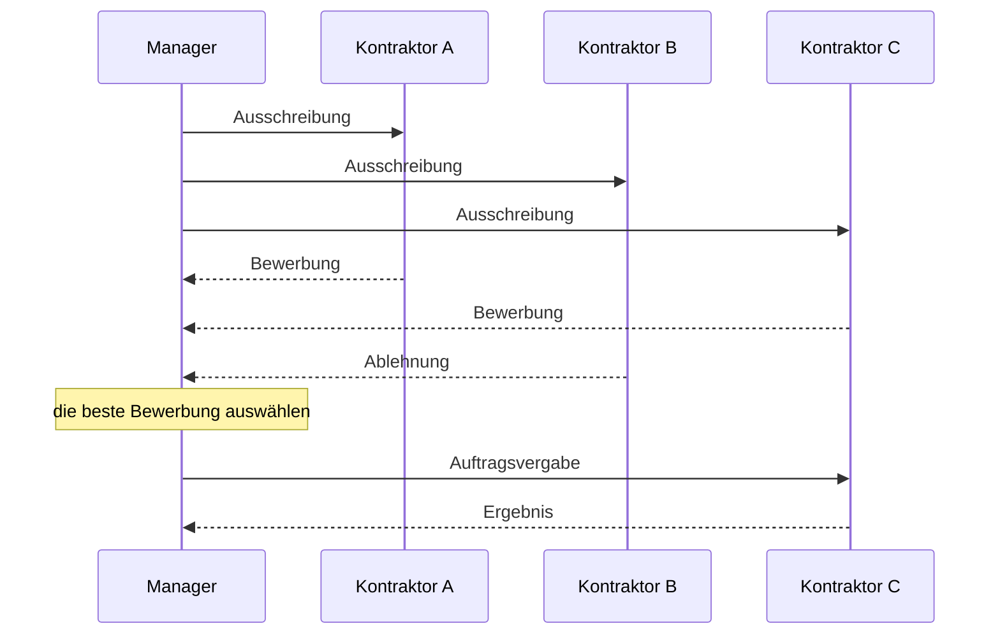
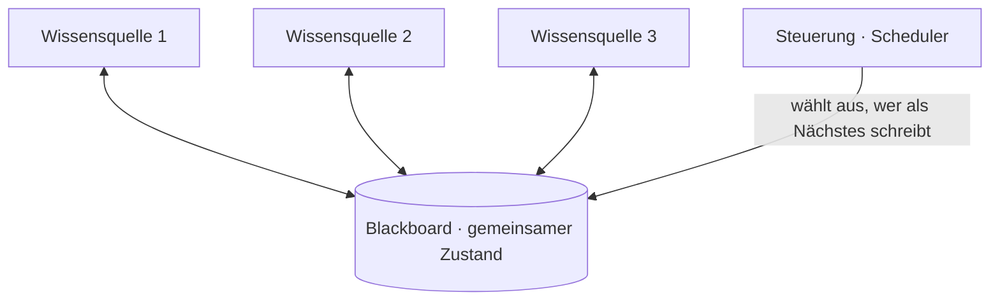
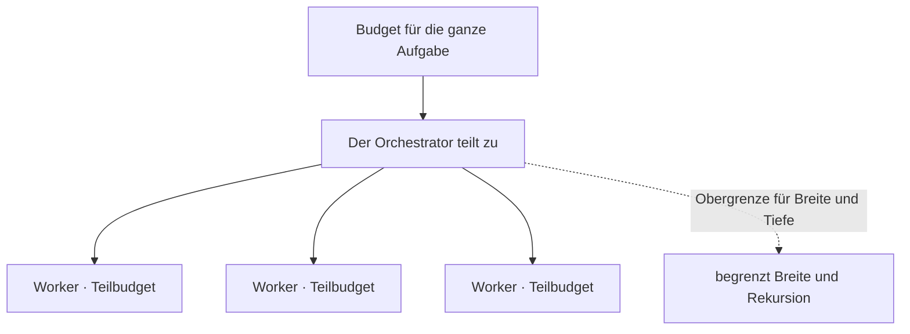

# Über ein Protokoll sprechen, ein Blackboard teilen und das Team bewerten

[Teil 1 der Lektion](./index.md) hat dargelegt, was dafür und was dagegen spricht, aus einem Agenten mehrere zu machen: aufteilen für Spezialisierung, für die Isolation der Kontexte, für Modularität und für Parallelität; das Team als Orchestrator-Worker, als Kette, als Hierarchie oder als Debatte verbinden; Arbeit durch die Übergabe an den nächsten Agenten weitergeben, die neben der Kontrolle *auch* den Kontext mitliefert; und daran festhalten, dass ein Orchestrator selbst nur ein Agent ist, der zerlegt, zuweist und zusammenfügt. Dagegen stand die ehrliche Bremse: Die Kosten vervielfachen sich etwa um das N-Fache, Fehler pflanzen sich fort, weil nichts allen als Ground Truth dient, die Koordination kostet extra, und das Ganze lässt sich schwerer evaluieren. Diese Seite arbeitet die Koordinationsschicht vollständig aus. Sie gibt der Nachricht zwischen zwei Agenten eine konkrete Form, sie ergänzt den gemeinsamen Arbeitsraum, den die Übergabe allein nicht ausdrücken kann, sie zeigt, wie Rollen vergeben und ausgehandelt werden, sie arbeitet aus, wie Sie ein Team bewerten, dessen Pfad über seine Mitglieder verstreut liegt, und sie sorgt dafür, dass die Rechnung für die Tokens nicht davonläuft.

Eine Abgrenzung noch, bevor es losgeht, denn für das Gebiet nebenan sind die Nachbarlektionen zuständig. Die *allgemeine* Schicht für Schleifensteuerung und Budget – Schrittbudgets, das Erkennen von Schleifen, die Reflexion, das Budget als Regel, die Grundlagen der Pfadbewertung – gehört zu [Planung und Schleifen](../planning-loops/index.md) und zur zugehörigen [Vertiefung](../planning-loops/deep-dive.md). Diese Seite ist für die Schicht unmittelbar über dem einzelnen Agenten zuständig: Agent an Agent. Wo die beiden Achsen auf das Transportprotokoll treffen, sind Sie bei [MCP und Agentenprotokollen](../mcp/index.md) – MCP standardisiert die Achse Agent an Tool, und die Achse Agent an Agent ist A2A, weiter unten; diese Topologien in eine Bibliothek zu packen, ist die Aufgabe der [Orchestrierungs-Frameworks](../orchestration-frameworks/index.md). Teil 1 wird durchgängig vorausgesetzt.

## Der Nachricht eine Form geben

In Teil 1 haben Agenten „sich über Nachrichten verständigt“, und diese Wendung hat still eine Menge Arbeit erledigt. Hier bekommt die Nachricht eine konkrete Form – und es stellt sich heraus, dass es dreißig Jahre Vorarbeit gibt, die die heutigen Frameworks gerade wiederentdecken.

Am Anfang steht der Standard, der die Teile benannt hat. **FIPA** – die Foundation for Intelligent Physical Agents, 1996 gegründet, ihre Suite zur Agentenkommunikation 2002 veröffentlicht, ab 2005 ein Normungsgremium der IEEE Computer Society – hat eine Agent Communication Language definiert, **FIPA ACL**. Eine ACL-Nachricht ist ein **Umschlag**. Die äußere Schicht ist ein **Performativ**, also der kommunikative Akt, den die Nachricht vollzieht: `inform`, `request`, `propose`, `cfp`, `agree`, `refuse`, `query-if` und der Rest einer festgelegten Sammlung davon. Innen liegen die Felder – `sender`, `receiver`, `content`, `language`, `ontology`, `protocol`, `conversation-id`, `reply-with`/`in-reply-to`, `reply-by`. Das Ganze fußt auf der Sprechakttheorie, auf Austins und Searles Gedanken, dass eine Äußerung eine *Handlung* ist und nicht bloß Daten; die Semantik ist über ein Modell aus Überzeugungen, Wünschen und Absichten des Agenten definiert. Der Vorgänger KQML stammt aus dem DARPA Knowledge Sharing Effort der frühen 1990er-Jahre und war die erste praktisch verwendete ACL auf Sprechaktbasis; FIPA ACL hat die formale Semantik darübergelegt.

Einen Standard von 2002 zu lernen lohnt sich, weil er etwas benennt, das heutige Agenten immer noch brauchen. Der Satz aus Teil 1, dass die Nachricht einer Übergabe ein Prompt ist, ist eine dünne Fassung desselben Gedankens – den *Akt* zu trennen, also das, was der andere Agent tun soll, von dem *Inhalt*, an dem er es tut. Und die Felder des Umschlags lassen sich sauber auf die heutigen Fragen abbilden: wer und an wen, die Nutzlast, und welcher Schritt welches mehrschrittigen Protokolls diese Nachricht ist.

Ein Protokoll verdient es, beim Namen genannt zu werden, weil es immer wieder neu erfunden wird. Das **Contract Net** (Reid G. Smith, *IEEE Transactions on Computers*, Bd. C-29, Nr. 12, Dezember 1980) vergibt eine Aufgabe auf dem Verhandlungsweg statt per Anweisung. Ein Manager schreibt eine Aufgabe aus; unbeschäftigte Kontraktoren bewerben sich darauf; der Manager vergibt den Auftrag an die beste Bewerbung; der Kontraktor, der den Zuschlag bekommt, liefert das Ergebnis zurück. FIPA hat den Zyklus später als Contract Net Interaction Protocol standardisiert – `cfp`, dann `propose` oder `refuse`, dann `accept-proposal` oder `reject-proposal`, dann `inform` oder `failure`. Das ist dynamische Aufgabenvergabe, ausgedrückt als Austausch von Nachrichten, und es ist die Alternative dazu, dass ein Orchestrator jede Teilaufgabe von Hand fest zuweist – ein Faden, den der Abschnitt über die Rollenverteilung wieder aufnimmt.

Die heutigen Frameworks bauen den Umschlag nach, meist viel dünner. Was ein Framework für LLM-Agenten herumreicht, ist typischerweise `{role, content, name}` plus etwas Metadaten zum Tool-Call – weit und breit kein ausdrückliches Performativ, keine Ontologie, kein Protokollfeld. Aber das reichere Ende des Spektrums kehrt zurück, und es hat einen Namen. **A2A**, das Agent2Agent-Protokoll, ist ein offener Standard dafür, dass Agenten zusammenarbeiten, ohne einander ihr Innenleben zu zeigen. Ein Agent veröffentlicht eine maschinenlesbare Selbstbeschreibung, die **Agent Card** – Identität, Fähigkeiten, Ein- und Ausgabeformate, Authentifizierung –, damit andere ihn finden. Arbeit läuft als **Task** mit einem Lebenszyklus (`submitted`, `working`, `input-required`, `completed`, `failed`, `canceled`), der **Messages** trägt, die aus **Parts** bestehen (Text, Datei oder Daten); die Ergebnisse kommen als **Artifacts** zurück. Als Transportprotokoll dient JSON-RPC 2.0 über HTTP – die [Fassung 1.0.0 der Spezifikation](https://a2a-protocol.org/latest/specification/) ergänzt Anbindungen für gRPC und HTTP/REST –, für das Streaming kommt SSE dazu.

Der Vergleich mit MCP ist der nützliche Teil, und er beschreibt eine Achse, keine Rivalität. MCP standardisiert Agent an Tool: ein Modell, das nach Tools und Ressourcen greift. A2A standardisiert Agent an Agent: Zwei Agenten stimmen sich ab, ohne einander Einblick zu geben – keiner muss seinen inneren Zustand oder seinen Tool-Katalog offenlegen. Google hat A2A am 9. April 2025 auf der Google Cloud Next vorgestellt, mit mehr als 50 Partnern und unter Apache 2.0, es zur Jahresmitte an die Linux Foundation übertragen und es ausdrücklich als Ergänzung zu MCP eingeordnet und nicht als Konkurrenz – das Gegenstück für die Achse Agent an Agent, auf das die MCP-Lektion vorausgewiesen hat.

Welches Schema Sie am Ende auch nehmen: Die lebendige Entwurfsfrage ist die aus Teil 1 – *welcher Kontext mit jeder Nachricht mitreist.* Zu wenig, und der Empfänger kann nicht handeln; zu viel, und der Kontext wird wieder immer voller. Das Schema ist die einfache Hälfte; die Disziplin bei der Nutzlast ist das Können. Und ein Feld verdient eine eigene Erwähnung: Die ausdrückliche Kennung des Gesprächs oder der Aufgabe ist das, was Ihnen später erlaubt, einen verstreuten Pfad wieder zusammenzusetzen, wenn es an die Bewertung des Teams geht.

## Der andere Baustein: ein gemeinsames Blackboard

Die Übergabe an den nächsten Agenten geht von Punkt zu Punkt. Ein Agent packt Kontext zusammen und reicht ihn an genau einen anderen weiter, und alles außerhalb dieses Pakets bleibt privat – das ist der Gewinn an Isolation der Kontexte aus Teil 1 und zugleich dessen Grenze. Manche Arbeit will das Gegenteil: eine gemeinsame Fläche, von der jeder Agent lesen und auf die jeder Agent schreiben kann. Der klassische Name dafür ist das **Blackboard**.

Das Modell ist älter, als es aussieht. Unabhängige Spezialisten – die **Wissensquellen** – arbeiten nicht dadurch zusammen, dass sie einander aufrufen, sondern dadurch, dass sie aus einer gemeinsamen globalen Datenstruktur lesen und in sie schreiben, eben dem Blackboard, während eine **Steuerung** entscheidet, welcher Spezialist als Nächstes handeln darf. Keiner wendet sich unmittelbar an einen anderen; jeder beobachtet das Blackboard und trägt bei, sobald er am aktuellen Stand etwas verbessern kann. Die Architektur stammt aus dem Spracherkennungssystem Hearsay-II, das an der Carnegie Mellon University zwischen 1971 und 1976 entstanden ist; die kanonische Darstellung stammt aus Stanford: H. Penny Niis zweiteiliger Überblick „Blackboard Systems“ (*AI Magazine*, Bd. 7, 1986). Stellen Sie sich ein Team vor einer echten Tafel vor: Alle sehen dieselbe Tafel, wer helfen kann, schreibt eine Zeile dazu, und eine Steuerung entscheidet, wer als Nächstes schreibt. Drei Teile, und das ist die ganze Architektur – das Blackboard (der gemeinsame Zustand), die Wissensquellen (die Spezialisten) und die Steuerung (der Scheduler).

Die heutigen Frameworks lassen das unter neuen Namen wieder auferstehen – als gemeinsamen Zustand, als gemeinsamen Notizblock, als gemeinsames Gedächtnis: als Graph, dessen einziges Zustandsobjekt jeder Knoten liest und schreibt (so wie bei [LangGraph](https://www.langchain.com/langgraph)), oder als gemeinsamen Speicher, auf den eine Crew gemeinsam zugreift. Der Name hat sich geändert, die Gestalt nicht.

Die Wahl zwischen gemeinsamem Blackboard und Nachrichtenaustausch ist eine echte Abwägung – und die eigentliche Entscheidung dieses Abschnitts. Ein gemeinsames Blackboard bringt viel: kein Geflecht aus N×N-Verbindungen, das gepflegt werden muss; jeder Agent sieht den wachsenden Stand vollständig; und einen neuen Spezialisten binden Sie ein, indem Sie ihn einfach auf das Blackboard ansetzen. Genau dieser Einblick ist aber auch der Preis. Das Blackboard zieht Ballast an – die Zwischenstände aller werden zum Problem aller, und der Gewinn an Isolation der Kontexte aus Teil 1 löst sich still wieder auf –, und sobald zwei Agenten gleichzeitig schreiben, brauchen Sie eine Konfliktbehandlung, denn nebenläufige Worker, die dasselbe Feld bearbeiten, geraten sich in die Quere. Dieser Zusammenstoß ist nichts Hypothetisches; er ist das Fehlerbild der konkurrierenden Schreibzugriffe, auf das [der Abschluss dieses Teils](../real-agents.md) hinweist, nur eben konkret geworden.

Der Nachrichtenaustausch zahlt die umgekehrte Rechnung. Die Übergabe hält den Kontext jedes Agenten isoliert – ein Worker sieht nur, was ihm gereicht wurde –, aber Sie zahlen für das Routing und die Verkabelung, und eine Information kann einen Agenten schlicht nicht erreichen, der sie gebraucht hätte.

Greifen Sie also zum gemeinsamen Blackboard, wenn die Agenten wirklich ein gemeinsames, wachsendes Artefakt brauchen: einen gemeinsamen Plan, ein laufendes Dokument, eine Lösung, die gemeinsam entsteht. Bevorzugen Sie die Übergabe, wenn es gerade auf die Isolation ankommt und sich die Arbeit in Stufen teilen lässt. Die meisten Systeme im Produktivbetrieb landen bei einer Mischung – der Orchestrator hält den gemeinsamen Zustand, und jeder Worker sieht nur die Übergabe, die für ihn bestimmt ist –, holen sich den Einblick also dort, wo er hilft, und die Isolation dort, wo sie zählt.

## Die Rollenverteilung – fest oder ausgehandelt

Rollen können feststehen, oder es wird um sie gestritten. Beides ist legitim; die eine Wahl kauft Vorhersagbarkeit, die andere Beweglichkeit.

**Feste Rollen** werden beim Entwurf gesetzt. Jeder Agent bekommt eine Rolle, ein Ziel, eine Persona und einen Tool-Katalog – die Crews aus `role`, `goal` und `backstory` bei [CrewAI](https://www.crewai.com) sind das bekannte Beispiel –, und zur Laufzeit ändert sich davon nichts. Das ist vorhersagbar, leicht zu durchschauen und kostet keinen Verhandlungsaufwand.

**Die dynamische Zuweisung** entscheidet stattdessen zur Laufzeit. Entweder gibt der Orchestrator die Teilaufgaben nach und nach an die Worker – das Zerlegen und Zuweisen aus Teil 1 –, oder die Agenten handeln die Arbeit unter sich aus. Das Contract Net von weiter oben ist genau dieser zweite Fall: Ausschreibung, Bewerbung und Auftragsvergabe sind eine dynamische Rollenverteilung als Austausch von Nachrichten, ein kleiner Markt, auf dem der am besten geeignete oder der am wenigsten ausgelastete Agent die Aufgabe per Bewerbung gewinnt.

Verhandelt wird nicht nur darüber, wer die Arbeit tut; Agenten können auch über die *Antwort* verhandeln. Bei der **Multi-Agenten-Debatte** schlagen mehrere Instanzen desselben Modells unabhängig voneinander eine Antwort vor, kritisieren und überarbeiten dann über einige Runden hinweg die Antworten der anderen und nähern sich so etwas an, das genauer und in sich stimmiger ist als jeder einzelne Durchgang. Die ursprüngliche Untersuchung (Du, Li, Torralba, Tenenbaum und Mordatch, „Improving Factuality and Reasoning in Language Models through Multiagent Debate“, arXiv:2305.14325, Mai 2023) misst Zugewinne beim mathematischen und strategischen Reasoning und bei der Faktentreue, dazu weniger Halluzinationen, und ordnet den Aufbau ausdrücklich Minskys „Society of Mind“ zu. Das ist die Debatten-Topologie aus Teil 1, jetzt mit einem echten Protokoll – Runden aus Vorschlag, Kritik und Überarbeitung.

Der Haken ist eine Rechenaufgabe. Die Debatte multipliziert die Kosten mit der Zahl der Agenten mal der Zahl der Runden; sie verdient sich ihr Geld also nur bei schweren Schluss- oder Faktenaufgaben, für die es keine billige Gegenprüfung gibt – und sie ist reine Verschwendung bei allem, was ein einzelner Agent plus eine kurze Prüfung schon richtig hinbekommt. Die ehrliche Bremse dieses Abschnitts hat dieselbe Gestalt: Bewerbung, Verhandlung und Debatte fügen alle Runden von Modellaufrufen hinzu, und das sind Kosten und Latenz. Ein Orchestrator, der fest zuweist, ist billiger und meistens genug. Greifen Sie zur Verhandlung erst dann, wenn statisches Routing die Entscheidung wirklich nicht treffen kann – bei ungleichartigen Workern, bei schwankender Last oder dort, wo Sie ausdrücklich wollen, dass die Qualität unter Widerspruch geprüft wird.

## Ein Team bewerten, dessen Pfad über die Agenten verstreut ist

Teil 1 hat gewarnt, dass sich Multi-Agenten-Systeme schwerer evaluieren lassen, weil der Pfad, den ein Durchlauf genommen hat, über die Agenten verteilt liegt. So gehen Sie dabei tatsächlich vor. Die Grundlagen – Ergebnis gegen Ablauf, ein Modell als Judge über einem Trace, Observability als Voraussetzung – stehen für den einzelnen Agenten in den Vertiefungen zu [Agentic RAG](../agentic-rag/deep-dive.md) und zu [Planung und Schleifen](../planning-loops/deep-dive.md); das neue Problem hier ist, dass der Trace nicht mehr an einer Stelle liegt.

Jeder Agent erzeugt seinen eigenen lokalen Trace – sein Reasoning, seine Tool-Calls, seine Teilschritte. Um das Team zu bewerten, müssen Sie diese Traces zu einem durchgehenden Trace zusammensetzen, und der Faden, der das zusammenhält, ist eine gemeinsame Kennung: die Kennung des Gesprächs oder der Aufgabe, die der Umschlag getragen hat, durch jede Nachricht durchgereicht, sodass die Spans aller Agenten an einem einzigen Baum hängen – der Span des Orchestrators als Elternknoten, der Span jedes Workers als Kind, jeder Tool-Call als Kind davon. Das ist die konkrete Gestalt des Satzes aus Teil 1, dass die Observability die Teile zusammensetzen muss. Es ist gewöhnliches verteiltes Tracing, angewandt auf ein Team, und die semantischen Konventionen von [OpenTelemetry](https://opentelemetry.io) für GenAI legen die nötigen Span-Arten bereits fest – Modellaufrufe, Tool-Ausführungen und Spans für die Orchestrierung –, angeordnet als Bäume aus Eltern und Kindern, die Übergaben und Tool-Schleifen zu einem Trace falten. Tracing-Werkzeuge setzen Traces aus Multi-Agenten-Systemen schon heute so zusammen; die Disziplin besteht darin, die Kennung von Anfang an durch jede Nachricht durchzureichen, denn einen Pfad, den Sie nie korreliert haben, können Sie hinterher nicht mehr zusammensetzen.

Liegt der Trace erst einmal an einem Stück vor, bewerten Sie ihn auf drei Ebenen. Die **Evaluierung des Ergebnisses** ist die einfache: Hat das Team die richtige endgültige Antwort geliefert, gemessen mit der Antwortmetrik, die zur Aufgabe passt? Die **Evaluierung des Ablaufs** fragt auf Teamebene, ob die Koordination Sinn ergeben hat – eine vernünftige Aufgabenzerlegung, richtiges Routing, keine doppelte Arbeit, keine gegenseitige Blockade, und ein Ende nach einer vertretbaren Zahl von Agentenschritten und Euros. Die **Zuordnung zu einzelnen Agenten** ist die Ebene, die es nur bei Teams gibt, und die wirklich schwere: Wenn die endgültige Antwort falsch ist – welcher Agent oder welche Übergabe hat den Fehler hineingetragen? Grenzen Sie ihn ein, sonst können Sie ihn nicht beheben. Das ist die Bewertung jedes Hops aus Agentic RAG, eine Ebene höher – jetzt pro Agent statt pro Retrieval.

Teams versagen außerdem auf Arten, die es bei einem einzelnen Agenten nie gab, und diese Arten sind katalogisiert. **MAST**, die *Multi-Agent System failure Taxonomy*, stammt aus Cemri et al., „Why Do Multi-Agent LLM Systems Fail?“ (arXiv:2503.13657, März 2025), empirisch gebaut aus sieben Multi-Agenten-Frameworks über mehr als 200 Aufgaben und mit hoher Übereinstimmung der Annotationen (κ = 0,88). Sie sortiert vierzehn Fehlerbilder in drei Kategorien: **Spezifikation und Systementwurf**, **Fehlabstimmung zwischen den Agenten** (Aneinandervorbeireden, ignorierte Eingaben, Abschweifen) sowie **Prüfung und Terminierung der Aufgabe** – also die Frage, ob der Durchlauf überhaupt zu einem Ende kommt. Die Kategorien treffen die Vorfälle, denen Sie tatsächlich begegnen. Ein Worker liest eine Übergabe falsch, und der Orchestrator nimmt den Fehler als Tatsache – das ist die Fortpflanzung eines Fehlers und gehört zur Fehlabstimmung; ebenso, wenn zwei Worker ohne ihr Wissen dieselbe Arbeit tun. Ein Team, das sich im Kreis dreht und nie zu einem Ergebnis kommt, gehört unter Prüfung und Terminierung. Ein Worker entfernt sich still von der Teilaufgabe, die ihm zugewiesen war. Die Klasse zu benennen, in die ein Vorfall gehört, macht aus „das Team lag daneben“ etwas, das sich untersuchen lässt.

Und die Zurückhaltung, wie überall. Eine Kette aus zwei Agenten hat kaum einen Pfad, den man zusammensetzen müsste, und ein Router mit einem Worker fast gar keinen. Der Aufwand für Korrelation und Zuordnung wächst mit der Größe des Teams – instrumentieren Sie, sobald das Team groß genug ist, um einen Pfad zu haben, dessen Bewertung sich lohnt.

## Was ein Agententeam kosten darf

Teil 1 hat den Kostenfaktor bei etwa dem N-Fachen angesetzt. Inzwischen gibt es Zahlen dazu. In der Veröffentlichung von Anthropic vom 13. Juni 2025 über das eigene Multi-Agenten-System für Recherche [verbrauchen Agenten etwa das Vierfache an Tokens einer Chat-Interaktion und Multi-Agenten-Systeme etwa das Fünfzehnfache](https://www.anthropic.com/engineering/multi-agent-research-system) – und in der dortigen Evaluierung erklärte allein der Tokenverbrauch rund 80 % der Unterschiede in der Leistung, den Rest machten die Zahl der Tool-Calls und die Modellwahl aus. Was sie daraus ableiten, ist eine Bedingung und kein Freibrief: Die Rechnung eines Multi-Agenten-Systems geht nur auf, wenn die Aufgabe wertvoll genug ist, um die zusätzliche Leistung zu bezahlen – starke Parallelisierung, ein Kontext, der ein einzelnes Kontextfenster sprengt, viele komplexe Tools –, und sie passen schlecht, wenn jeder Agent denselben Kontext braucht oder die Agenten viele wechselseitige Abhängigkeiten haben. Das ist das „etwa N-Fache“ aus Teil 1, jetzt mit einer gemessenen Konstante.

Die Regelschicht, die das begrenzt, ist das Budget als Regel aus Teil 1, ausgedehnt von einem Agenten auf ein Team. Planung und Schleifen hat aus einem Budget bereits eine *Regel* gemacht statt einer einzelnen Zahl; über mehrere Agenten hinweg bekommt es ein paar zusätzliche Stellschrauben.

- **Das Budget für die ganze Aufgabe** liegt über den Teilbudgets der einzelnen Agenten. Der Orchestrator hält den Gesamtbetrag und gibt jedem Worker einen Anteil, damit ein einzelner entlaufener Worker nicht den Topf verbrennt, bevor die anderen an die Reihe kommen – und er holt sich zurück, was ein Worker nicht ausgibt. Das ist der Orchestrator mit der Kasse, den die [Vertiefung zu Planung und Schleifen](../planning-loops/deep-dive.md) beschreibt, jetzt wörtlich genommen.
- **Eine Obergrenze für die Breite** legt fest, wie viele Worker ein Orchestrator pro Schritt startet – die Breite des Baums.
- **Eine Obergrenze für die Tiefe** legt fest, wie tief die Hierarchie reichen darf, Orchestratoren über Orchestratoren, damit die Rekursion nicht still explodiert.
- **Gestaffelte Modelle** setzen ein billiges Modell in die Worker und ein starkes an den Orchestrator oder an die Synthese (oder umgekehrt), damit Sie nicht für jeden Aufruf eines Subagenten Spitzenpreise zahlen.
- **Die zweistufige Obergrenze** überträgt sich unverändert: Die weiche warnt oder schaltet zurück, die harte hält an.

Bleibt die Frage, um die diese Seite die ganze Zeit kreist: Wann lohnt sich das alles überhaupt? Die Antwort ist die aus Agentic RAG – die einfachste Stufe nehmen, die die Aufgabe löst. Greifen Sie erst dann zu einem Team, wenn es echte Spezialisierung zu nutzen gibt, wenn der Kontext in kein einziges Kontextfenster passt oder wenn Teilaufgaben sich wirklich parallel bearbeiten lassen. Bei den meisten Aufgaben schlägt ein einzelner, gut entworfener Agent – oder ein Orchestrator mit statischem Routing – ein verhandelndes Blackboard-Team klar und zu einem Bruchteil der Kosten. Protokolle, gemeinsames Gedächtnis, Verhandlung, die Evaluierung des Teams und die Budgetregeln kommen dazu, sobald das Team gerechtfertigt ist – sie sind nicht der Anfang.

## Das Wichtigste

- Die Nachricht zwischen zwei Agenten ist ein Umschlag: ein Performativ, das sagt, was getan werden soll, gelegt um den Inhalt und um die Felder, die sie zustellen – wer, an wen und in welchem Gespräch. FIPA ACL hat diese Teile schon 2002 benannt, das Contract Net hat aus der Aufgabenvergabe Ausschreibung, Bewerbung und Auftragsvergabe gemacht, und A2A ist die heutige Fassung für die Achse Agent an Agent, mit Agent Cards zum Auffinden und Tasks, die einen Lebenszyklus tragen – das Gegenstück zu MCPs Achse Agent an Tool.
- Zwei Bausteine für die Koordination, eine Abwägung. Ein gemeinsames Blackboard gibt jedem Agenten vollen Einblick und erspart Ihnen das Geflecht aus N×N-Verbindungen, lädt aber Ballast und konkurrierende Schreibzugriffe ein; die Übergabe von Punkt zu Punkt erhält die Isolation der Kontexte, kann einem Agenten aber vorenthalten, was er gebraucht hätte. Die meisten echten Systeme mischen – der Orchestrator hält den Zustand, die Worker bekommen isolierte Übergaben.
- Rollen stehen fest oder werden ausgehandelt. Crews mit festgelegter Rolle, festem Ziel und festem Tool-Katalog sind vorhersagbar und billig; die Bewerbung im Contract Net und die Multi-Agenten-Debatte kaufen Qualität bei schweren Aufgaben, und zwar zum Preis von Agenten mal Runden. Weisen Sie standardmäßig fest zu und verhandeln Sie nur, wenn statisches Routing wirklich nicht entscheiden kann.
- Ein Team zu bewerten beginnt damit, eine gemeinsame Kennung durch jede Nachricht durchzureichen und die verstreuten Spans zu einem einzigen Baum aus Eltern und Kindern zusammenzusetzen. Bewertet wird dann auf drei Ebenen – das Ergebnis, der Ablauf im Team und die Zuordnung zu einzelnen Agenten, also die Frage, wer es kaputt gemacht hat –, und für die letzte liefern MASTs drei Fehlerkategorien das Vokabular.
- Setzen Sie ein Budget. Multi-Agenten-Systeme verbrauchen rund das Fünfzehnfache an Tokens einer Chat-Interaktion, und allein die Zahl der Tokens erklärte rund 80 % der Leistungsunterschiede in Anthropics System – halten Sie also ein Budget für die ganze Aufgabe über den Teilbudgets der Agenten, begrenzen Sie Breite und Tiefe, staffeln Sie Ihre Modelle und halten Sie weiche und harte Obergrenzen auseinander.
- All das kommt dazu, sobald ein Team gerechtfertigt ist; es ist kein Ausgangspunkt. Ein einzelner starker Agent oder ein Orchestrator mit statischem Routing gewinnt die meisten Aufgaben zu einem Bruchteil der Kosten.

**[Neue Begriffe](../../glossary.md#multi-agent)**: FIPA ACL, contract net protocol, blackboard, A2A (Agent2Agent), multi-agent debate, trajectory stitching.
