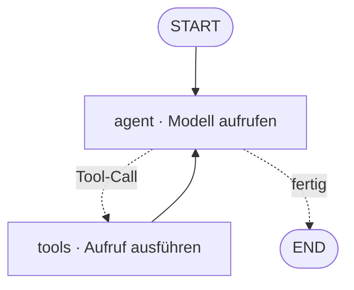

# Einen Graphen Knoten für Knoten durchgehen, einen Absturz überstehen, einen Agenten auf zwei Arten definieren

[Teil 1 der Lektion](./index.md) hat begründet, wofür ein Framework gut ist: Es räumt den Boilerplate-Code um die eigene Schleife herum weg – die Mechanik der Schleife, die Verdrahtung der Tool-Calls, Zustand und Gedächtnis, den Kontrollfluss, die Übergaben zwischen Agenten und am Ende noch Tracing, Streaming und Checkpointing –, und die meisten Frameworks landen beim selben Kerngedanken, dem Agenten als Graph oder Zustandsautomat, in dem die Knoten die Schritte sind und die Kanten der Kontrollfluss, die zurückführenden eingeschlossen; der entscheidende Unterschied ist damit, dass der Graph aus einer undurchsichtigen `while`-Schleife eine Maschine macht, die Sie einsehen, anhalten und wieder aufnehmen können. Sortieren Sie das Feld meinetwegen nach Schichten, behandeln Sie die Einteilung aber als Momentaufnahme, die schon veraltet: Die Abstraktion ist der Preis, also zuerst die Grundbausteine. Diese Seite arbeitet jene Framework-Schicht vollständig aus. Sie geht einen konkreten Graphen Knoten für Knoten durch, zeigt, was Durable Execution und die Checkpoint-Backends darunter wirklich sind, stellt das frameworkeigene Gedächtnis den Konstrukten für mehrere Agenten gegenüber, kontrastiert die zwei Arten, einen Agenten zu definieren – im Code oder in der Konfiguration –, und schließt damit, wie sich Tracing und Evaluierung auf Framework-Ebene einklinken.

Eine Grenze noch vor dem Rundgang, denn die Nachbarlektionen halten das Gelände nebenan. Die *allgemeine* Taxonomie des Gedächtnisses, die Schritt- und Token-Budgets und die Schleifensteuerung gehören zu [Planung und Schleifen](../planning-loops/index.md) und deren [Vertiefung](../planning-loops/deep-dive.md); die Topologien für mehrere Agenten, ihre Protokolle und die Frage, wie sich ein Team evaluieren lässt, stehen in der Lektion über [Multi-Agenten-Systeme](../multi-agent/index.md) und deren [Vertiefung](../multi-agent/deep-dive.md); das Transportprotokoll darunter – zwischen Agent und Tool [MCP](../mcp/index.md), zwischen Agent und Agent A2A – ist eine eigene Lektion; und der *Betrieb* selbst – Bereitstellung, Observability, Evaluierung – ist [Teil III](../../part-3-production/overview.md). Für die Framework-Schicht ist diese Seite zuständig; auf den Rest verweist sie, statt ihn noch einmal herzuleiten. Teil 1 wird durchgehend vorausgesetzt.

## Ein Graph, Knoten für Knoten

Nehmen Sie den Agenten als Graph aus Teil 1 und machen Sie ihn konkret. [LangGraph](https://www.langchain.com/langgraph) modelliert einen Agenten als `StateGraph`: ein getyptes, gemeinsames Zustandsobjekt, aus dem jeder Knoten liest und in das jeder Knoten schreibt, dazu die Knoten und Kanten, über die die Ausführung von einem Schritt zum nächsten weitergereicht wird. Dieser **gemeinsame Zustand** ist der ganze Kniff – über ihn erreicht die Arbeit eines Schritts den nächsten, ohne dass Sie sie von Hand durchreichen.

Zwei Anker rahmen den Graphen ein: `START`, der Eingang, und `END`, der Ausgang. Ein **Knoten** ist nichts weiter als eine Funktion – er nimmt den aktuellen Zustand entgegen und gibt eine Aktualisierung davon zurück. Das Modell aufrufen, ein Tool aufrufen, eine Entscheidung treffen: Jedes davon ist ein Knoten. Die Kanten dazwischen gibt es in zwei Sorten. Eine **einfache Kante** ist ein unbedingter Übergang, A geht immer nach B. Eine **bedingte Kante** ist eine Funktion, die den Zustand ansieht und zurückgibt, welcher Knoten als Nächstes läuft – und dort sitzt die Verzweigung der Schleife. Hat das Modell ein Tool verlangt? Weiter zum Knoten `tools`. Hat es geantwortet? Weiter zu `END`.

Verdrahten Sie diese Teile zum kanonischen ReAct-Agenten, und die Gestalt ist klein. Sie haben einen Knoten `agent`, der das Modell aufruft, und einen Knoten `tools`, der ausführt, was das Modell verlangt hat. `START` fließt in `agent`. Eine bedingte Kante aus `agent` heraus gibt die Kontrolle an `tools`, wenn das Modell einen Tool-Call abgesetzt hat, und an `END`, wenn nicht. Und eine einfache Kante führt `tools` geradewegs zurück auf `agent`. Diese letzte Kante, die zurückführt, ist der agentische Zyklus aus [Agentic RAG](../agentic-rag/deep-dive.md), jetzt als ausdrücklicher Pfeil gezeichnet, statt in einem `while` zu stecken. Das ist die Grundform aus Tool-Knoten mit bedingten Kanten, die Teil 1 benannt hat.

:::tip[▶ Video]

<YouTube id="qAF1NjEVHhY" title="LangChain vs LangGraph: A Tale of Two Frameworks — IBM Technology" />

IBM erklärt, warum LangGraph als zustandsbehaftete Steuerungsschicht über [LangChain](https://www.langchain.com) überhaupt existiert – eine gute Orientierung zu dem Graphen, den wir eben Knoten für Knoten durchgegangen sind. (Das Video ist auf Englisch.)

:::

Meistens verdrahten Sie davon gar nichts von Hand. LangGraph liefert einen **vorgefertigten ReAct-Agenten** mit (`create_react_agent`), der genau diesen Graphen fertig zusammengesetzt zurückgibt; Sie geben ein Modell und eine Liste von Tools hinein, und der Agent läuft. Das ist der fertig verdrahtete Agent aus Teil 1. Zum selbst gebauten Graphen greifen Sie erst, wenn Sie eine Gestalt brauchen, die der vorgefertigte nicht hergibt – eine eigene Verzweigung, einen zusätzlichen Knoten, eine Stelle, an der ein Mensch eingreift.

Sobald die Schleife ein Graph ist, ist alles Weitere darunter – Checkpoints, Durable Execution, Human-in-the-Loop, Tracing – etwas, das Sie an diesen Graphen *anhängen*, keine neue Mechanik, die Sie bauen. Das alles ist Verdrahtung, die an Knoten und Kanten hängt, die Sie ohnehin schon haben.

## Einen Absturz überstehen: Durable Execution

Die Persistenz beginnt beim **Checkpointer** – er speichert den Zustand des Graphen nach jedem **Knotenübergang** (im LangGraph-Vokabular: *Super-Step*), und zwar getrennt nach Thread. Einen Durchlauf wieder aufzunehmen heißt dann nur noch, den letzten Checkpoint zu laden und von dort weiterzumachen. Das ist LangGraphs kurzfristiges, thread-gebundenes Gedächtnis: der Zustand eines einzelnen Gesprächs, laufend gesichert.

Der **Thread** – genauer seine `thread_id` – ist das, was einen Durchlauf davon abhält, in einen anderen hineinzulaufen. Getrennte Threads tragen getrennte Checkpoint-Historien, sodass keine Sitzung je den Zustand einer anderen zu sehen bekommt. Das ist das „hält getrennte Threads getrennt“ aus Teil 1, jetzt mit einer genauen Auskunft darüber, was ein Thread ist.

Weil jeder Schritt gesichert wird, ist das Wiederaufnehmen nicht das Einzige, was Sie tun können. Sie können auf einen früheren Checkpoint zurückgehen, den Zustand an dieser Stelle ansehen, ihn bearbeiten und in einem neuen Zweig weiterlaufen lassen – eine Zeitreise durch den Durchlauf. Das ist die konkrete Gestalt der „Checkpoints, auf die Sie zurückgehen können“ aus Teil 1.

Der Checkpointer ist die eine Schnittstelle, hinter der austauschbarer Speicher liegt, und dieser Speicher ist ein **Checkpoint-Backend**. Stand Juli 2026 sind die konkreten Möglichkeiten: `InMemorySaver`, der den Zustand im Arbeitsspeicher hält und ihn beim Neustart verliert – nur für die Entwicklung; `SqliteSaver` (Paket `langgraph-checkpoint-sqlite`, v3.1.0, Mai 2026) für den lokalen Einsatz auf einer einzelnen Maschine; `PostgresSaver` (Paket `langgraph-checkpoint-postgres`, ebenfalls v3.1.0) für den Produktivbetrieb, wo der Zustand gemeinsam genutzt wird und dauerhaft ist; und `RedisSaver` (`langgraph-checkpoint-redis`), eine weitere Möglichkeit für den Produktivbetrieb, wenn Sie ohnehin schon Redis betreiben. Die Wahl ist eine Entscheidung zwischen Entwicklung und Produktivbetrieb und nichts weiter – im Arbeitsspeicher für ein Notebook, eine echte Datenbank für alles, was einen Neustart überstehen muss.

Dieser gesicherte Zustand ist es, der **Durable Execution** (dauerhafte Ausführung – ein Lauf setzt nach Absturz, Neustart oder Deploy an der letzten gesicherten Stelle fort) überhaupt möglich macht; eine lange Pause zählt genauso dazu. Das ruht auf dem Checkpointer – kein Checkpointer, keine Dauerhaftigkeit –, und LangGraph bietet dafür, Stand Juli 2026, eine Einstellung `durability` mit drei Modi. `"exit"` speichert erst, wenn die Ausführung endet: am schnellsten, aber ohne Erholung von einem Absturz mitten im Durchlauf. `"async"` speichert im Hintergrund, während der nächste Schritt läuft: ein guter Ausgleich zwischen Geschwindigkeit und Dauerhaftigkeit, mit dem kleinen Risiko, den letzten Schreibvorgang zu verlieren, wenn der Prozess stirbt. `"sync"` speichert synchron, bevor der nächste Schritt beginnt: die höchste Dauerhaftigkeit, der größte Zusatzaufwand. Die Modi bestimmen nur, *wann* der Checkpointer schreibt; jeder von ihnen setzt weiterhin voraus, dass überhaupt einer da ist.

Warum das für Agenten zählt, ist wieder derselbe entscheidende Unterschied. Agentendurchläufe sind lang, nicht deterministisch und teuer – ein Rechercheagent über dreißig Schritte, der bei Schritt 28 stirbt, darf nicht noch einmal für 27 Modellaufrufe zahlen, nur um wieder dort zu sein, wo er schon war. Dieselbe Dauerhaftigkeit macht auch den Human-in-the-Loop erst wirklich: Ein Knoten hält den Durchlauf an, sichert den Zustand, und der Durchlauf wartet einfach – Stunden, Tage – darauf, dass jemand freigibt, und setzt danach genau dort fort, wo er angehalten hat. Das ist der HITL-Knoten aus Teil 1, jetzt getragen von derselben Persistenz. Die allgemeine Schicht für Human-in-the-Loop und Budgets ist [Planung und Schleifen](../planning-loops/index.md); hier ist es nur ein Knoten, hinter dem ein Checkpoint steht.

Und dieselbe Zurückhaltung wie bei jeder anderen Fähigkeit auf dieser Seite: Ein zustandsloser Agent, der eine einzige Antwort liefert, braucht nichts davon. Keinen Checkpointer, kein Backend, keinen Modus für Dauerhaftigkeit. Dauerhaftigkeit macht sich bei langen, wieder aufnehmbaren oder von Menschen freigegebenen Durchläufen bezahlt – stellen Sie kein Postgres hin, nur um einen Klassifikator zu betreiben, der mit einer einzigen Antwort fertig ist.

## Zwei Arten von Gedächtnis – und warum sie nicht das Team sind

Das Gedächtnis eines Frameworks teilt sich in zwei Reichweiten, und zwar entlang einer einzigen Achse. Das kurzfristige, thread-gebundene Gedächtnis ist der Zustand des Checkpointers – lebendig innerhalb eines einzelnen Threads, also des gerade laufenden Gesprächs, und fort, sobald dieser Thread endet. Das langfristige, thread-übergreifende Gedächtnis ist ein eigener **Store** (Langzeitspeicher des Frameworks), der *über* Threads hinweg überdauert, mit Namensräumen als Schlüssel – etwa einem je Nutzerkonto –, sodass ein Agent sich zwischen Sitzungen, die keinen Thread teilen, an eine Person erinnern kann. Diese langfristige Seite nennt LangGraph den Store.

Das Framework gibt Ihnen hier die Mechanik – die Persistenz und eine Store-API – und hört dort auf. *Welche* Arten von Gedächtnis Sie modellieren, ob episodisches, semantisches oder prozedurales, ist die Taxonomie aus der [Vertiefung zu Planung und Schleifen](../planning-loops/deep-dive.md), und *was* zu merken ist, wann zusammenzufassen und wann zu verwerfen – das gehört zur Budget-Schicht, jenseits dessen, wofür ein Framework zuständig ist. Es lohnt sich, diese Grenze scharf zu halten: verweisen statt neu herleiten.

Wie meinungsstark die Gedächtnis-API ausfällt, ist von Framework zu Framework verschieden. LangGraph reicht Ihnen die Aufteilung auf niedriger Ebene – Checkpointer gegen Store – und überlässt Ihnen, wie Sie beide einsetzen. [CrewAI](https://www.crewai.com) liefert, Stand Juli 2026, stattdessen eine einzige vereinheitlichte `Memory`-API: Sie kategorisiert selbstständig, was gesichert wird, und bewertet den Abruf nach Relevanz, Aktualität und Wichtigkeit – eine höher angesiedelte, meinungsstärkere Auslegung derselben Aufteilung in kurz und lang. Welche API gewinnt, zählt weniger als das, was darunter in jedem Fall gilt: Das Gedächtnis ist eine Fähigkeit, die das Framework bereitstellt, mit einem Backend für die Persistenz dahinter, in welcher Gestalt das jeweilige Framework es auch vorzieht.

Die Konstrukte für mehrere Agenten gehören auf eine ganz andere Achse, und wer nicht aufpasst, verwischt sie leicht mit dem Gedächtnis. Ein Framework liefert nämlich auch fertige *Team*-Konstrukte mit – einen **Supervisor-Agenten**, der Arbeit an Worker verteilt, oder Rollenagenten im Crew-Stil, wie CrewAI sie führt –, die Topologien aus der Lektion über [Multi-Agenten-Systeme](../multi-agent/index.md), fertig zusammengesetzt, sodass Sie sie konfigurieren statt sie zu programmieren.

Halten Sie die beiden also auseinander, denn das ist die tragende Unterscheidung dieses Abschnitts. Gedächtnis ist **Persistenz von Zuständen**: was über Schritte und über Sitzungen hinweg überdauert. Die Konstrukte für mehrere Agenten sind **Arbeitsverteilung**: wie Subagenten miteinander verdrahtet sind. Die beiden stehen orthogonal zueinander – Sie können einen einzelnen Agenten mit reichem Langzeitgedächtnis haben, ein zustandsloses Team aus Agenten, oder beides zugleich. Zu einem Supervisor zu greifen, um an ein Gedächtnis zu kommen, ist ein echter Entwurfsfehler. Das Framework verpackt jede Fähigkeit für sich; die *Begriffe* selbst leben in [Planung und Schleifen](../planning-loops/index.md) (Gedächtnis) und in der Lektion über Multi-Agenten-Systeme (Topologien), und diese Lektion zeigt nur, wie ein Framework sie an die Oberfläche bringt. Daraus folgt: Greifen Sie erst dann zu einem thread-übergreifenden Store, wenn ein thread-gebundener Checkpoint wirklich nicht ausreicht. Passen Sie das Konstrukt an den Bedarf an.

## Zwei Wege, denselben Agenten zu definieren

Es gibt zwei Stile, einen Agenten zu definieren, und die Trennlinie läuft durch jedes Framework. **Imperativ** heißt, dass Sie den Agenten im Code *bauen*, Schritt für Schritt: den Graphen instanziieren, `add_node`, `add_edge`, eine bedingte Kante ergänzen, kompilieren. Den Kontrollfluss schreiben Sie selbst. LangGraphs Graph API ist genau in diesem Sinn imperativ. (LangGraph bietet daneben eine leichtere imperative Möglichkeit an, die Functional API – die Dekoratoren `@entrypoint` und `@task` geben Ihnen einen Agenten als Funktion, mit einem Zustand im Geltungsbereich eben dieser Funktion, für den Fall, dass Sie imperative Kontrolle wollen, ohne einen ausdrücklichen Graphen zu zeichnen.)

**Deklarativ** heißt, dass Sie die Agenten und ihre Verdrahtung in der Konfiguration *beschreiben* und das Framework die Laufzeit zusammensetzen lassen. Stand Juli 2026 erklären CrewAIs Konfigurationsdateien für jeden Agenten Rolle, Ziel und Tools, ganz ohne Code für den Kontrollfluss – YAML im klassischen Projektzuschnitt, JSONC voreingestellt in neueren. [Microsoft Agent Framework](https://learn.microsoft.com/en-us/agent-framework/) liefert deklarative Workflows mit, und die eigene Dokumentation trifft es genau: *„Sie beschreiben, was Ihr Workflow tun soll, statt wie er zu implementieren ist.“*

Der Kompromiss schneidet in beide Richtungen. Imperativ kauft Ihnen Kontrolle und Ausdruckskraft – beliebige Verzweigungen, eigene Knoten, alles, was sich im Code ausdrücken lässt – und verlangt dafür mehr Code und ein mühsameres Lesen. Deklarativ kauft Tempo, Einheitlichkeit und Zugänglichkeit: Wer nicht programmiert, kann eine in der Konfiguration definierte Crew trotzdem lesen und ändern, die Gestalten bleiben einheitlich, und die Konfiguration lässt sich sauber diffen und aus Werkzeugen heraus erzeugen. Was sie verlangt, ist eine Decke – in dem Moment, in dem Sie einen Ablauf brauchen, den das Vokabular der Konfiguration nicht ausdrücken kann, fallen Sie in den Code zurück. Microsofts eigene Empfehlung teilt genauso: deklarativ für Standardmuster, für häufig wechselnde Workflows und für Änderungen durch Personen, die nicht programmieren; programmatisch für komplexe eigene Logik und größtmögliche Flexibilität.

Nichts davon ist neu. Es ist dieselbe Linie zwischen deklarativ und imperativ, die die Software überall sonst schon gezogen hat – SQL gegen prozeduralen Code, Infrastruktur als Konfiguration gegen Skripte. Deklarativ für die üblichen Gestalten; imperativ, sobald Sie an die Wand stoßen. Und die meisten Frameworks in der Praxis geben Ihnen beides und lassen Sie mischen – eine deklarative Crew mit einer imperativen Notluke für den einen Ablauf, den die Konfiguration nicht sagen kann. Das bindet sauber zurück: Der selbst gebaute Graph aus dem ersten Abschnitt ist die imperative Form, und eine in der Konfiguration erklärte Crew ist die deklarative Form *derselben* Topologie aus der Lektion über [Multi-Agenten-Systeme](../multi-agent/index.md). Ein Begriff, zwei Arten, ihn aufzuschreiben.

## Der eine Graph, an dem jede Betriebsfrage hängt

Weil der Agent ein Graph aus *benannten* Knoten ist, kann das Framework von sich aus einen Trace erzeugen. Jede Ausführung eines Knotens, jeder Modellaufruf und jeder Tool-Call wird zu einem **Span** in einem Eltern-Kind-Baum, mit wenig oder gar keiner Instrumentierung von Ihrer Seite. Das sind die Tracing-Hooks, die Teil 1 unter dem Boilerplate-Code geführt hat, abgegolten durch die Struktur des Graphen selbst.

[LangSmith](https://www.langchain.com/langsmith) ist das native Beispiel für LangChain und LangGraph: Ist das Tracing einmal eingeschaltet – ein Umgebungsschalter und ein API-Schlüssel –, tracen die Aufrufe von LangChain-Modulen innerhalb eines Graphen automatisch, und dazu kommt ein Aufbau für die Evaluierung, der an denselben Graphen angeschlossen ist: Datensätze, die LangSmith als „Unit-Tests für Ihre LLM-Anwendung“ rahmt, Bewerter, die als LLM-as-a-judge, heuristisch, paarweise oder durch Menschen urteilen, und der Vergleich von Durchläufen über Versionen hinweg. LangSmith ist eines von mehreren solchen Werkzeugen.

Der herstellerneutrale Standard sind die GenAI Semantic Conventions von [OpenTelemetry](https://opentelemetry.io). Sie legen Standard-Span-Arten für LLM- und Agentenlasten fest – `invoke_agent`, `execute_tool` sowie Spans für Modellinferenz und Gedächtnis –, sodass ein Framework Traces erzeugen kann, die jedes OTel-Backend liest und die Sie nicht an den Tracer eines einzelnen Anbieters binden (LangSmith selbst spricht OTLP in beide Richtungen). Ein Vorbehalt zum Datum allerdings: Stand Juli 2026 stehen die GenAI Conventions noch im Status `Development` – ein aufkommender Standard, der sich noch stabilisiert. Es sind dieselben Konventionen, auf die sich die [Vertiefung zu Multi-Agenten-Systemen](../multi-agent/deep-dive.md) stützt, um den Pfad eines ganzen Teams zu einem Baum zusammenzusetzen.

Dieser aufgezeichnete Trace ist die *Eingabe* der Evaluierung. Bewertet werden darüber zwei Dinge: das Ergebnis – die endgültige Antwort, nach welcher Metrik die Aufgabe auch immer misst – und der Ablauf – hat der Graph einen vernünftigen Pfad genommen, die richtigen Knoten getroffen, eine Schleife vermieden, die nicht anhält. Es ist die Aufteilung in Ergebnis und Ablauf aus der [Vertiefung zu Agentic RAG](../agentic-rag/deep-dive.md), jetzt gespeist vom Trace des Frameworks selbst. Das Framework *zeichnet auf*; die Disziplin der Evaluierung – die Metriken, die Judges, die Goldstandards – ist [Teil III](../../part-3-production/overview.md).

Alles läuft auf einen einzigen Gegenstand zu. Der Graph, den Sie im ersten Abschnitt definiert haben, ist derselbe, den Sie mit Checkpoints sichern, mit dem Sie sich erinnern, den Sie deklarativ definieren oder eben nicht, und den Sie jetzt tracen und bewerten. Ein Artefakt, und jede Frage des Produktivbetriebs hängt daran. Das ist die tiefste Form dessen, was Teil 1 als den entscheidenden Unterschied benannt hat: Der Graph ist nicht bloß etwas, das Sie einsehen können – er ist die eine **Nahtstelle**, über die Persistenz, Gedächtnis und Observability allesamt andocken.

Die abschließende Zurückhaltung spiegelt das „zuerst die Grundbausteine“ aus Teil 1. All das ist Meisterschaft auf Abruf. Ein einfacher Agent braucht nichts davon – keinen Checkpointer, keinen Store, keine deklarative Konfiguration, kein Backend für Traces. Greifen Sie zu jedem Stück erst dann, wenn der Durchlauf lang genug ist, um Dauerhaftigkeit zu brauchen, zustandsbehaftet genug für ein Gedächtnis oder komplex genug für Tracing. Das Framework macht jedes davon billig zu ergänzen; umsonst macht es keines, und eines zu ergänzen, das Sie nicht brauchen, ist genau der Preis der Abstraktion, vor dem Teil 1 gewarnt hat – ein zweites Mal bezahlt.

## Das Wichtigste

- LangGraph modelliert einen Agenten als `StateGraph` – ein gemeinsames Zustandsobjekt, Knoten, die das Modell aufrufen, ein Tool aufrufen oder entscheiden, einfache Kanten und bedingte Kanten, die anhand des Zustands weiterleiten. Der ReAct-Agent besteht aus einem Knoten `agent` und einem Knoten `tools`, mit einer bedingten Kante aus `agent` heraus und einer Kante von `tools` zurück auf `agent`; `create_react_agent` reicht Ihnen diesen Graphen fertig zusammengesetzt.
- Ein Checkpointer sichert den Zustand nach jedem Schritt, getrennt nach `thread_id`, sodass ein Durchlauf beim letzten erfolgreichen Schritt ansetzt, statt von vorn zu beginnen – und dieselbe Persistenz lässt einen Human-in-the-Loop stundenlang warten und danach fortsetzen. Die Modi von `durability` (`exit`, `async`, `sync`) tauschen Geschwindigkeit gegen Sicherheit; die Backends lassen sich frei tauschen (im Arbeitsspeicher für die Entwicklung, Postgres oder Redis für den Produktivbetrieb); ein zustandsloser Agent mit einer einzigen Antwort braucht nichts davon.
- Das Gedächtnis eines Frameworks hat zwei Reichweiten, und keine davon ist das Team: der kurzfristige, thread-gebundene Zustand (der Checkpointer) gegen das langfristige, thread-übergreifende Gedächtnis (ein Store, mit Namensräumen als Schlüssel). Die Konstrukte um Supervisor und Crew liegen auf einer anderen Achse – Arbeitsverteilung, nicht Persistenz von Zuständen –, und beides zu vermengen ist ein Entwurfsfehler.
- Die imperative Definition baut den Graphen im Code, für Kontrolle und Ausdruckskraft; die deklarative beschreibt die Agenten in der Konfiguration – CrewAIs Dateien, die deklarativen Workflows des Microsoft Agent Framework – für Tempo, Einheitlichkeit und Änderungen durch Personen, die nicht programmieren, und zwar genau so lange, bis Sie einen Ablauf brauchen, den die Konfiguration nicht ausdrücken kann. Die meisten Frameworks bieten beides an und lassen Sie mischen.
- Ein Graph aus benannten Knoten erzeugt von sich aus einen Baum von Spans – nativ über LangSmith oder herstellerneutral über die GenAI Conventions von OpenTelemetry, die allerdings, Stand Juli 2026, noch ein aufkommender Standard sind. Das Framework zeichnet den Trace auf; die Disziplin der Evaluierung darüber gehört Teil III.
- Der Graph ist die eine Nahtstelle, an der jede Frage des Produktivbetriebs andockt – Sie sichern ihn mit Checkpoints, erinnern sich mit ihm, definieren ihn auf zwei Arten und tracen ihn. Ein einfacher Agent lässt jede dieser Schichten weg, und eine zu ergänzen, die er nicht braucht, ist der Preis der Abstraktion, ein zweites Mal bezahlt.

**[Neue Begriffe](../../glossary.md#orchestration-frameworks)**: state graph, checkpointer, checkpoint backend, thread (thread_id), durable execution, conditional edge, framework long-term memory (store), declarative vs imperative agent definition.
