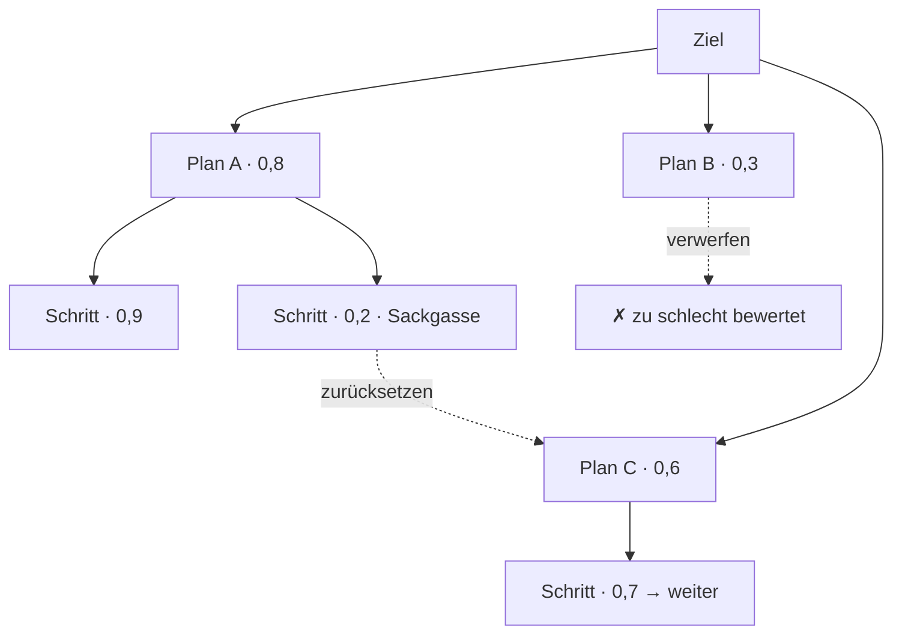
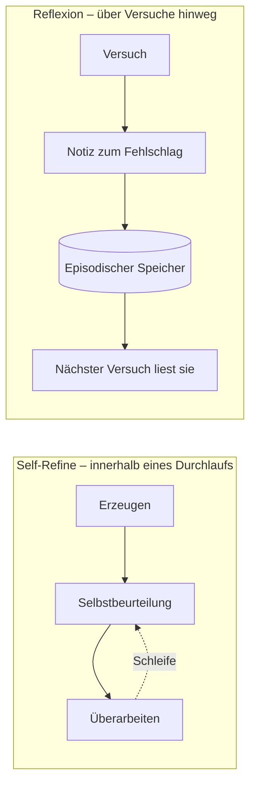
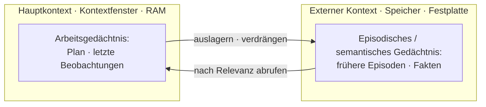

# Im Raum möglicher Pläne suchen, der Reflexion eine Form geben und lange Durchläufe überstehen

[Teil 1 der Lektion](./index.md) hat dem Agenten einen Plan gegeben und einen Weg, ihn zu überarbeiten: das Ziel zerlegen, die Schritte mit ReAct oder Plan-and-Execute in eine Reihenfolge bringen, auf die drei Gestalten achten, in denen eine Schleife nicht richtig endet, und in Schichten dagegen verteidigen. Diese Seite arbeitet jene Schicht bis ins Letzte durch. Sie behandelt Planung als *Suche* im Raum möglicher Pläne, macht aus der Reflexion als Begriff die benannten, veröffentlichten Frameworks, macht aus dem Budget statt einer einzelnen Zahl ein Regelwerk, stellt hinter das Arbeitsgedächtnis eine echte Gedächtnisarchitektur und bewertet den ganzen Pfad statt nur der letzten Antwort.

Vorher eine Abgrenzung, denn eine Nachbarlektion behandelt dieselbe Materie. Die retrievalspezifische Fassung derselben Gedanken – eine *Retrieval*-Schleife begrenzen, die Zwischenergebnisse zwischen den Hops verdichten, einen *Retrieval*-Pfad bewerten – steht in der [Vertiefung zu Agentic RAG](../agentic-rag/deep-dive.md). Diese Seite hat die allgemeine Form: die Steuerung der Schleife und die Planung für jeden Agenten, ob er Retrieval betreibt oder nicht. Wo beide sich berühren, verweist sie dorthin, statt dasselbe noch einmal herzuleiten. Teil 1 wird durchgehend vorausgesetzt – die Zerlegung, der Gegensatz zwischen ReAct und Plan-and-Execute, die drei Gestalten einer Schleife, die nicht anhält, die gestapelte Verteidigung und die Reflexion als Begriff werden benutzt, nicht noch einmal erklärt.

## Planung als Suche statt als feste Abfolge

Teil 1 hat eine Abfolge geplant und umgeplant, wenn sie zerbrach. Für die meisten Agenten reicht das schon. Für Aufgaben, die es sich leisten können, geht es aber noch weiter: sich gar nicht erst auf einen Plan festzulegen und die Planung als Suche im Raum möglicher Pläne zu behandeln.

Der Wechsel ist konkret. Statt einen Plan zu schreiben und ihn zu überarbeiten, *erzeugt* der Agent mehrere mögliche nächste Schritte – nennen Sie sie Gedanken oder Teilpläne –, *bewertet* jeden davon mit einem Wert oder einer Heuristik, meist so, dass das Modell seine eigenen Zwischenzustände beurteilt, und *durchsucht* den entstehenden Raum: Er expandiert die Zweige, die vielversprechend aussehen, schaut ein Stück voraus und setzt aus Sackgassen zurück. Aus einer Linie von Überlegungen wird ein Baum, den Sie durchsuchen.

**Tree of Thoughts (ToT)** (Shunyu Yao et al., arXiv:2305.10601, 17. Mai 2023) ist die kanonische Form. Das Paper fasst überlegtes Problemlösen als das Durchsuchen eines Baums von Zwischenschritten: Das Modell schlägt mögliche Gedanken vor, beurteilt jeden Zustand selbst und erkundet den Baum mit Breiten- oder Tiefensuche samt Vorausschau und Backtracking – wo ein einfaches Chain-of-Thought sich auf einen linearen Pfad festlegt und mit ihm steht und fällt. Der Unterschied, den das Paper misst, ist drastisch: Beim Game of 24 kam ToT auf 74 % Erfolg gegen 4 % für gewöhnliches Chain-of-Thought-Prompting. Wenn eine Aufgabe wirklich Überlegung verlangt, ist es eine ganz andere Größenordnung, mehrere Pfade zu durchsuchen und aussichtslose zu verwerfen, als einen zu schreiben und zu hoffen.

**Graph of Thoughts (GoT)** (Maciej Besta et al., arXiv:2308.09687, 18. August 2023) verallgemeinert den Baum zu einem beliebigen Graphen. Gedanken werden zu Knoten und Kanten zu Abhängigkeiten, sodass Zweige nicht nur abzweigen, sondern auch gebündelt und verschmolzen werden können. Der Anlass: Manche Probleme wollen Teillösungen *kombinieren* – zwei halbe Antworten zu einer besseren zusammensetzen –, und das kann ein strenger Baum, in dem jeder Knoten genau einen Elternknoten hat, nicht ausdrücken.

**LATS (Language Agent Tree Search)** (Andy Zhou et al., arXiv:2310.04406, 6. Oktober 2023) trägt den Gedanken aus dem reinen Überlegen hinaus in die handelnde Schleife. LATS führt Monte Carlo Tree Search über den *Aktionen* des Agenten aus, mit einer Bewertungsfunktion aus dem Sprachmodell, mit Reflexion und mit echter Rückmeldung aus der Umgebung über die Tool-Results, und vereint so Überlegen, Handeln und Planen in einem einzigen Suchverfahren. Das ist die Brücke: Durchsucht werden nicht mehr Gedanken, sondern ganze Pfade. Der Agent probiert einen Aktionszweig, sieht, was die Umgebung zurückgibt, und kann zurücksetzen und einen anderen versuchen. Der Baum ist nicht länger hypothetisch – seine Kanten sind Dinge, die der Agent tatsächlich getan hat.

Nennen Sie die Kosten offen, denn sie entscheiden, wohin so etwas überhaupt gehört. Die Suche vervielfacht die Anfragen an das Modell: Sie bewerten viele Zustände und expandieren viele Zweige, sodass ein Durchlauf mit ToT oder LATS ein Mehrfaches eines einzelnen Durchgangs kosten kann. Und sie hängt vollständig an einer *vertrauenswürdigen* Bewertungsfunktion. Kann das Modell die aussichtsreichen Teilpläne nicht zuverlässig von den aussichtslosen unterscheiden, dann repariert die Suche sein Urteil nicht – sie verstärkt den Fehlgriff und verbraucht mehr Anfragen dafür, mit Überzeugung schlechteren Zweigen nachzugehen.

Deshalb durchsuchen die meisten Agenten im Produktivbetrieb keine Pläne. Sie arbeiten einen Plan ab und planen bei einem Fehlschlag um, genau wie in Teil 1, weil das viel billiger und meistens genug ist. Heben Sie die Baumsuche für hochwertige Aufgaben auf, deren Zwischenschritte überprüfbar sind und für die es eine verlässliche Bewertungsfunktion gibt – Mathematik, Code, Rätsel, beschränkte Optimierung –, wo ein falscher Zweig billig zu erkennen ist und das Zurücksetzen seine Kosten wieder einspielt. Bei offener Arbeit ohne sauberes Erfolgssignal je Schritt ist die Bewertungsfunktion das schwache Glied, und die zusätzlichen Anfragen zahlen sich selten aus. Die Disziplin ist dieselbe wie in Teil 1: die einfachste Stufe nehmen, die die Aufgabe löst.

## Benannte Formen der Reflexion

Teil 1 hat die Reflexion als Begriff eingeführt – der Agent beurteilt seinen eigenen Pfad. Die Forschung hat daraus benannte Verfahren gemacht, und ein einziges Prinzip entscheidet, ob eines davon hilft.

**Self-Refine** (Aman Madaan et al., arXiv:2303.17651, 30. März 2023) ist die enge Fassung. Ein einziges Modell, kein Training: Es erzeugt eine Ausgabe, gibt sich selbst eine Rückmeldung dazu und überarbeitet sie – in einer Schleife, bis das Ergebnis gut genug ist. Über sieben Aufgaben hinweg, mit GPT-3.5, ChatGPT und GPT-4, berichtet das Paper eine absolute Verbesserung von durchschnittlich rund 20 %. Sein Geltungsbereich ist eine Aufgabe, eine Episode: Die Schleife lebt innerhalb eines einzigen Durchlaufs und macht dessen Antwort besser.

**`Reflexion`** – das Framework von Noah Shinn et al. (arXiv:2303.11366, 20. März 2023) – greift über eine andere Zeitspanne, und hier zählt der Name. `Reflexion` ist der Name eines Frameworks, nicht der Name des Prinzips, das es umsetzt – im Deutschen fallen beide Wörter zusammen, deshalb steht der Frameworkname hier in Codeschrift. Das Paper nennt sein Verfahren *verbal reinforcement learning*: Nach einem gescheiterten Versuch schreibt der Agent eine Notiz in natürlicher Sprache darüber, was schiefgelaufen ist, und legt sie in einem episodischen Speicher ab; beim nächsten Versuch liest er diese Notizen wieder und macht es besser. Der Agent lernt über Versuche hinweg, ganz ohne Gewichtsanpassung – die Lehre steckt im Text, nicht in Gradienten. Hier trifft die Reflexion auf das Gedächtnis, und damit ist die Gedächtnisarchitektur weiter unten vorbereitet.

Die Unterscheidung, die Sie behalten sollten, ist also die Zeitspanne. Self-Refine verbessert die aktuelle Antwort innerhalb eines Durchlaufs; `Reflexion` trägt eine Lehre aus einem Durchlauf in den nächsten. In beiden Fällen beurteilt der Agent sich selbst – der Unterschied liegt darin, ob das Urteil lokal bleibt oder überdauert.

Unter beiden liegt das Prinzip, das jede Reflexion regiert: Sie ist nur so gut wie das Signal, über das sie nachdenkt. Wenn dasselbe Modell, das den Fehler gemacht hat, ihn auch bewertet, ist die Wirkung begrenzt – ein Modell, das beim Erzeugen mit Überzeugung falsch liegt, liegt beim Beurteilen meist ebenso überzeugt falsch. Eine Reflexion, die auf einem *äußeren* Signal steht, ist weit stärker: ein fehlgeschlagener Unit-Test, ein Fehler aus einem Tool, eine Zurückweisung durch eine Prüfung, ein Abgleich mit der bekannten richtigen Antwort. Reflektieren Sie über Belege, nicht über die Meinung des Modells von sich selbst.

Dieses Prinzip hat eine scharfe Kante, und sie ist der Grund, nicht überall zu reflektieren. Reflexion kostet zusätzliche Anfragen und Latenz, und bei leichten Eingaben kann sie aktiv schaden – ein Modell, das eine richtige Antwort noch einmal überdenken soll, redet sie sich manchmal aus. Schalten Sie die Reflexion deshalb hinter ein echtes Fehlersignal, hinter eine fehlgeschlagene Prüfung oder eine Schleife, die nicht mehr vorankommt, statt sie in jedem Schritt auszulösen. Dieselbe Regel der einfachsten Stufe, angewandt auf das Urteil über sich selbst.

## Ein Budget ist ein Regelwerk, keine Zahl

Teil 1 hat das Budget zur nicht verhandelbaren Sicherung gemacht: eine harte Obergrenze, die das Ende der Schleife garantiert. Die Verfeinerung ist, dass ein Budget ein *Regelwerk* ist und dass das, was an der Obergrenze geschieht, genauso zählt wie die Obergrenze selbst.

Fangen Sie damit an, dass Budgets mehrere Dimensionen haben. Ein Durchlauf lässt sich über Schritte oder Iterationen begrenzen, über Tokens, über die verstrichene Zeit, über Geld und über die Zahl der Tool-Calls – und er kann eine davon sprengen, während er bei allen anderen bequem darunter bleibt. Eine billige, aber endlose Schleife läuft in das Schrittbudget; ein Durchlauf mit teurem Reasoning trifft zuerst das Token-Budget oder das Kostenbudget. Im Produktivbetrieb begrenzen Sie mehrere Dimensionen gleichzeitig, weil jede einzelne eine Lücke lässt.

Außerdem schachteln sie sich. Über den Teilbudgets je Teilaufgabe steht ein Budget für die ganze Aufgabe, damit eine entlaufene Teilaufgabe nicht die gesamte Zuteilung verbrennt, bevor die übrigen an die Reihe kommen. In einem Aufbau mit Plan-and-Execute oder mit mehreren Agenten teilt der Planer oder der Orchestrator den Schritten Budget zu und kann zurückholen, was ein Schritt nicht verbraucht hat – dieselbe Rolle, die die Lektion über Multi-Agenten-Systeme beschreibt, hier mit der Kasse in der Hand.

Was aus einer Obergrenze ein Regelwerk macht, ist die Teilung in zwei Stufen:

- **Eine weiche Obergrenze**, früher erreicht, *löst eine Gegenmaßnahme aus*, statt den Durchlauf zu beenden – den Verlauf zusammenfassen und verdichten, einen Reflexionsschritt erzwingen, umplanen oder einen Menschen fragen. Sie verschafft dem Durchlauf die Gelegenheit, gut zu Ende zu kommen. Genau hier werden die Reflexion aus dem Abschnitt davor und das Zusammenfassen aus dem Abschnitt danach gezielt ausgelöst und nicht dem Zufall überlassen.
- **Eine harte Obergrenze** beendet den Durchlauf bedingungslos. Sie ist die Garantie, unverändert aus Teil 1.

Und was Sie *an* der Obergrenze tun, ist eine Entwurfsentscheidung, kein nachträglicher Einfall. Das schlechteste Ergebnis ist der stille Abbruch mitten im Pfad: Die Kosten sind vollständig verbraucht, zurück kommt nichts. Vermeiden Sie das. Geben Sie das beste bisherige Teilergebnis zurück, mit einem ehrlichen Hinweis, dass das Budget erschöpft war; eskalieren Sie an einen Menschen, wobei der Human-in-the-Loop aus Teil 1 als letztes Budget einspringt; oder geben Sie ein getyptes „Budget überschritten“ zurück und lassen Sie den Aufrufer entscheiden. Weichen Sie kontrolliert zurück – der stille Abbruch, der nichts zurückgibt, ist das eine Ergebnis, das Sie von vornherein ausschließen sollten.

Und setzen Sie das Budget dort ein, wo es sich lohnt. Die teuren Verfahren von weiter oben – die Baumsuche und die Reflexion – vervielfachen die Anfragen, sodass es Verschwendung ist, sie gleichmäßig überall anzuwenden. Leiten Sie billige, leichte Aufgaben in einen einzelnen Durchgang und heben Sie Suche und Reflexion für die schweren auf. Das ist die allgemeine Form des Routings nach Komplexität der Frage, die die [Vertiefung zu Agentic RAG](../agentic-rag/deep-dive.md) *adaptive RAG* nennt; dort steuert es das Retrieval, hier regiert es die ganze Agentenschleife. Ein Regler verdient dabei einen eigenen Namen: **Thinking Budget** – wie viel Nachdenken eine Aufgabe bekommen darf – ist etwas anderes als das Schrittbudget und das Token-Budget, und es wird nach der Schwierigkeit der Aufgabe eingestellt, nicht nach der Länge der Schleife.

## Gedächtnis für lange Pfade

**Das Arbeitsgedächtnis** – das Scratchpad aus Teil 1 – war eine der Gegenmaßnahmen gegen den Kontext, der immer voller wird. Dahinter steht eine ganze Gedächtnisarchitektur, mit Typen, die sich darin unterscheiden, wie lange sie leben und wo sie physisch liegen.

**Das Arbeitsgedächtnis** hält die Notizen zur laufenden Aufgabe im Kontext: den Plan, die erledigten Teilaufgaben, die letzten Beobachtungen. Es ist flüchtig; es lebt im Kontextfenster und endet mit dem Durchlauf.

**Das episodische Gedächtnis** ist ein Speicher vergangener Erfahrungen – was geschehen ist, wann, und wie es ausgegangen ist –, der den laufenden Kontext überdauert und dann abgerufen wird, wenn er zu einer neuen Lage passt. Der Notizspeicher von `Reflexion` aus dem Abschnitt davor ist episodisches Gedächtnis in Aktion. Zwei Dinge trennen es vom Arbeitsgedächtnis: die Lebensdauer, denn es überdauert Durchläufe und Sitzungen, und der Ort, denn es liegt in einem externen Speicher statt im laufenden Kontextfenster.

Zwei weitere Typen runden die Einteilung ab. **Das semantische Gedächtnis** sind dauerhafte Fakten, die der Agent kennt oder gelernt hat, oft in einer Wissensbasis oder einer Vektordatenbank. **Das prozedurale Gedächtnis** ist gelerntes Können – Fertigkeiten, die der Agent sich angeeignet hat. Die vollständige Aufteilung – Arbeitsgedächtnis und Kurzzeitgedächtnis auf der einen Seite, das Langzeitgedächtnis mit episodischem, semantischem und prozeduralem Anteil auf der anderen – legt das Video unten aus.

:::tip[▶ Video]

<YouTube id="BacJ6sEhqMo" title="The Four Types of Memory Every AI Agent Needs — IBM Technology" />

Sehen Sie es sich wegen der Einteilung an, die dieser Abschnitt formalisiert: Arbeits- und Kurzzeitgedächtnis, Langzeitgedächtnis, episodisches sowie semantisches und prozedurales Gedächtnis, in vier Minuten benannt und auseinandergehalten. (Das Video ist auf Englisch.)

:::

Aus dem episodischen Gedächtnis abzurufen ist selbst ein RAG-Problem. Sie können nicht jede vergangene Episode in das Kontextfenster gießen, also rufen Sie die passenden ab – und *wie* Sie sie ordnen, ist eine Entwurfsfrage mit einer bekannten Antwort. Generative Agents (Joon Sung Park et al., arXiv:2304.03442, 7. April 2023) bewertet Erinnerungen nach Aktualität, Wichtigkeit und Relevanz und fasst regelmäßig Gruppen einfacher Erinnerungen zu übergeordneten Einsichten zusammen, die in denselben Strom zurückgeschrieben werden. Reflexion und Gedächtnis erweisen sich damit als ein System: Der Agent reflektiert, um seine eigene Geschichte zu verdichten, und legt das Ergebnis als weitere Erinnerung ab.

Bleibt die Decke, an die jeder lange Durchlauf irgendwann stößt – das Kontextfenster selbst. **MemGPT** (Charles Packer et al., arXiv:2310.08560, 12. Oktober 2023) antwortet darauf, indem es sich die Speicherhierarchie eines Betriebssystems ausleiht. Behandeln Sie das Kontextfenster als „main context“ – schnell, klein, wie RAM – und einen externen Speicher als „external context“ – groß, langsam, wie eine Festplatte –, und lassen Sie das Modell Information über Tool-Calls ein- und auslagern. Der Agent arbeitet dann über Daten, die weit größer sind als sein Kontextfenster. Das ist *virtual context management*, und es ist der Mechanismus, mit dem das Arbeitsgedächtnis die Grenze des Kontextfensters überschreiten kann, statt darin gefangen zu bleiben.

Die praktische Mechanik für einen langen Pfad besteht aus drei Dingen, und die sind eine kurze Nennung wert. Fassen Sie den älteren Verlauf zusammen und verdichten Sie ihn, statt ihn roh mitzuschleppen – die allgemeine Form dessen, was die [Vertiefung zu Agentic RAG](../agentic-rag/deep-dive.md) mit verdichteten Zwischenergebnissen im Retrieval macht. Rufen Sie die passenden Erinnerungen ab, statt die ganze Geschichte in das Kontextfenster zu stopfen. Und führen Sie einen strukturierten Bearbeitungsstand der Aufgaben – wieder der ausgeschriebene Plan, der sich bezahlt macht. Zusammen halten die drei das **lost-in-the-middle**-Problem aus Teil 1 auf Abstand, bei dem die frühen Schritte eines langen Pfades genau dann aus der Aufmerksamkeit des Modells fallen, wenn es sie braucht.

Umsonst ist nichts davon, und die meisten Aufgaben brauchen es nicht. Das episodische Gedächtnis bringt ein ganzes Retrieval-Teilsystem mit eigenen Fehlerbildern mit – eine veraltete oder falsch abgerufene Erinnerung vergiftet den Kontext und kann schlimmer sein, als gar kein Gedächtnis zu haben. Aufgaben mit einem einzigen Durchgang brauchen nur das Arbeitsgedächtnis. Nehmen Sie das Langzeitgedächtnis erst dazu, wenn der Agent wirklich über Sitzungen hinweg lernen muss – ein persönlicher Assistent, ein langlaufendes Projekt – und keinen Moment früher.

## Den ganzen Pfad bewerten

Die Evaluierung misst jetzt den Pfad, hat Teil 1 gesagt. Konkret läuft das auf eine Handvoll Metriken hinaus – und auf eine Falle bei der Zuverlässigkeit, in die jedes Team tappt, das nach einem gelungenen Durchlauf aufhört.

Der erste Schnitt ist das Ergebnis gegen den Ablauf – die allgemeine Form der Teilung, die die [Vertiefung zu Agentic RAG](../agentic-rag/deep-dive.md) für das Retrieval gezogen hat. Die Evaluierung des Ergebnisses fragt, ob der Agent das Ziel erreicht hat. Die Evaluierung des Ablaufs fragt, ob der Weg tragfähig war – die richtigen Schritte, die richtigen Tools, die richtige Reihenfolge, eine vernünftige Stelle zum Anhalten. Eine richtige Antwort über einen falschen Weg ist Glück, und Glück überlebt die nächste Eingabe nicht. Wer nur das Ergebnis bewertet, sieht das nicht; erst die Bewertung des Ablaufs macht einen fehlgeschlagenen Durchlauf untersuchbar, weil sie den Fehler auf einen Schritt eingrenzt.

Die konkreten Metriken über den Pfad, eine nach der anderen. **Die Erfolgsquote** (task success rate) – hat der Agent das Ziel der Nutzenden erreicht. **Die Effizienz in Schritten** (step efficiency) – gegangene gegen nötige Schritte; der Agent, der in vierzig Schritten löst, wofür sechs gereicht hätten, ist kein guter Agent, direkt aus Teil 1. **Die Treffsicherheit der Tool-Calls** (tool-call accuracy) – das richtige Tool, die richtigen Argumente, die richtige Reihenfolge. **Die Terminierung** (ob der Durchlauf überhaupt endet). Und **die Kosten oder Tokens je Aufgabe**. Die Metriken über den Ablauf sind die, die einen Fehler an einem bestimmten Schritt festmachen; das Ergebnis allein kann das nicht.

Dann die Falle. Agenten sind nicht deterministisch, und deshalb überzeichnet ein einzelner gelungener Durchlauf – pass@1 – die tatsächliche Zuverlässigkeit. **pass^k** misst den Anteil der Aufgaben, die in *allen* k unabhängigen Versuchen gelöst werden: Beständigkeit statt bestem Fall. Die Zahlen aus τ-bench (Shunyu Yao et al., arXiv:2406.12045, 17. Juni 2024), einem Benchmark aus Tool, Agent und Nutzer, machen den Abstand anschaulich: Spitzenmodelle kommen auf unter 50 % Erfolg, und pass^8 fällt in der Retail-Domäne unter 25 %. Ein Agent, der einmal ordentlich aussieht, ist von Durchlauf zu Durchlauf oft unzuverlässig – und im Produktivbetrieb zählt genau das, weil Ihre Nutzenden je einen Durchlauf bekommen. Messen Sie die Beständigkeit, nicht einen glücklichen einzelnen Durchgang.

Wie Sie einen Pfad tatsächlich bewerten, ist LLM-as-a-judge über dem Pfad: Ein fähiges Modell liest den aufgezeichneten Trace gegen ein Bewertungsraster. Damit steht eine Voraussetzung fest, an der nicht zu rütteln ist – Sie können keinen Pfad bewerten, den Sie nicht sehen. Die Bewertung des Pfades verlangt einen vollständigen Trace des Durchlaufs; Observability ist also nichts, was Sie später aufsetzen, sondern das, was die Bewertung überhaupt erst möglich macht – der Punkt, den Teil 1 zuerst gemacht hat, hier verschärft. Werkzeuge gibt es: [Ragas](https://www.ragas.io) dokumentiert agentenbezogene Metriken – agent goal accuracy, tool-call accuracy, topic adherence –, die über einen Durchlauf berechnet werden. Greifen Sie sparsam danach; Evaluierung und Observability sind eigene Lektionen.

Und noch einmal die Zurückhaltung. Ein einfacher, kurzer Agent braucht keine vollständige Bewertung des Pfades – die Evaluierung des Ergebnisses plus eine Schrittzahl kann völlig reichen. Die Maschinerie für den Pfad ist ein Aufwand, den Sie auf sich nehmen, wenn es einen echten mehrschrittigen Weg gibt, dessen Tragfähigkeit unabhängig von der letzten Antwort scheitern kann. Wenn es ihn gibt, zeigt [der Abschluss dieses Teils](../real-agents.md) die ganze Schleife – Planung, Budgets, Gedächtnis und Evaluierung – bei Claude, OpenAI und Gemini im Betrieb.

## Das Wichtigste

- Planung kann zur Suche im Raum möglicher Pläne werden – Tree of Thoughts durchsucht einen Baum von Zwischenschritten, Graph of Thoughts einen Graphen, der Zweige verschmilzt, LATS eine Suche über Aktionen mit Rückmeldung aus der Umgebung. Bei Aufgaben mit überprüfbaren Zwischenschritten ist das eine ganz andere Größenordnung (ToT kam beim Game of 24 auf 74 % gegen 4 % für Chain-of-Thought), aber es vervielfacht die Anfragen und steht und fällt mit einer vertrauenswürdigen Bewertungsfunktion. Die meisten Agenten planen einfach um, und das ist richtig so.
- Die Reflexion hat benannte Gestalten auf zwei Zeitskalen: Self-Refine überarbeitet innerhalb eines Durchlaufs, `Reflexion` trägt eine Lehre über einen episodischen Speicher in den nächsten. Welche Gestalt auch immer – die Reflexion ist nur so gut wie das Signal darunter. Nehmen Sie ein äußeres, und schalten Sie sie hinter ein echtes Fehlersignal, sonst redet sie eine richtige Antwort kaputt.
- Behandeln Sie ein Budget als Regelwerk. Begrenzen Sie mehrere Dimensionen gleichzeitig, schachteln Sie Teilbudgets je Teilaufgabe unter das Budget der ganzen Aufgabe, trennen Sie die weiche Obergrenze (löst eine Gegenmaßnahme aus) von der harten (beendet den Durchlauf), und weichen Sie an der Obergrenze kontrolliert zurück, statt still abzubrechen. Setzen Sie die teuren Verfahren nur dort ein, wo sie sich lohnen.
- Gedächtnis ist eine Architektur, kein Scratchpad – Arbeitsgedächtnis im Kontextfenster gegen episodisches Gedächtnis in einem externen Speicher, dazu das semantische und das prozedurale. MemGPT lagert zwischen Fenster und Speicher aus und ein, sodass das Arbeitsgedächtnis über die Grenze des Kontextfensters hinauswachsen kann; rufen Sie die passenden Erinnerungen ab, statt die ganze Geschichte mitzuschleppen; und nehmen Sie das Langzeitgedächtnis erst dazu, wenn der Agent über Sitzungen hinweg lernen muss.
- Bewerten Sie den ganzen Pfad: Ergebnis gegen Ablauf, Effizienz in Schritten, Treffsicherheit der Tool-Calls, Terminierung. Messen Sie die Zuverlässigkeit mit pass^k, nicht mit einem glücklichen pass@1 – bei τ-bench fallen die Spitzenmodelle schon einmalig unter 50 %, und pass^8 fällt im Retail unter 25 %. Alles davon braucht einen vollständigen Trace, und damit ist Observability die Voraussetzung.

**[Neue Begriffe](../../glossary.md#planning-loops)**: Tree of Thoughts (ToT), Graph of Thoughts (GoT), LATS, Self-Refine, Reflexion, plan search, episodic memory, semantic memory, virtual context management (MemGPT), trajectory evaluation, pass^k.
