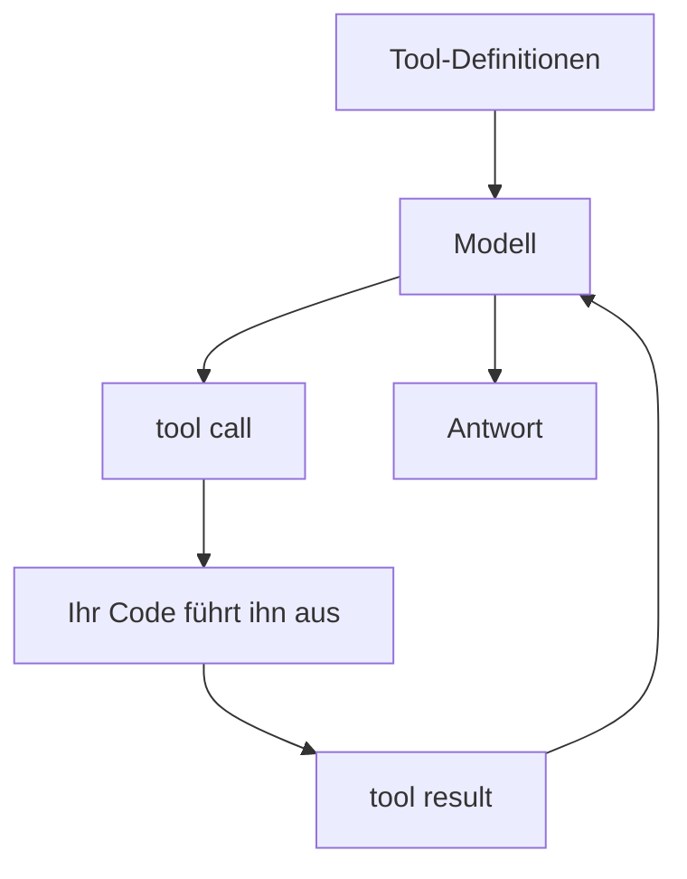

# Dieselben Techniken bei Claude, OpenAI und Gemini

Teil II hat den Agenten Fähigkeit für Fähigkeit aufgebaut: die Schleife, in der er selbst entscheidet, in
[Agentic RAG](./agentic-rag/index.md); die Tools, mit denen er handelt, in [Tool-Einsatz](./tool-use/index.md);
einen Weg, zu planen und auch wieder anzuhalten, in [Planung und Schleifen](./planning-loops/index.md);
Mitspieler, die sich die Arbeit teilen, in [Multi-Agenten-Systeme](./multi-agent/index.md); die Frameworks, die
all das verpacken, in [Orchestrierungs-Frameworks](./orchestration-frameworks/index.md); und das Protokoll, das
ihn mit der Welt verbindet, in [MCP und Agentenprotokolle](./mcp/index.md). Neu ist auf dieser Seite nichts. Sie
nimmt dieses ganze Repertoire mit zu den drei Agenten, denen Sie zuerst begegnen – Claude, OpenAI und Gemini –,
und zeigt: Jede Technik ist im Kern derselbe bleibende Handgriff, nur anders benannt und in einem anderen
Nachrichtenformat über die Leitung geschickt.

Genau darauf kommt es an, und deshalb ist jeder Abschnitt gleich gebaut. Am Anfang steht das **bleibende
Muster** – der Teil, der jeden Umbau einer API überlebt. Dann folgt, wie es der einzelne Anbieter heute macht,
mit Absicht datiert, denn diese Einzelheiten verderben schnell, und diese Seite gibt offen zu, dass sie altern
wird. Dann kommt, was sich unterscheidet und warum; dort sitzt die eigentliche Ingenieursarbeit. Und ganz
zuletzt kommt, wo es bricht – zurückgebunden an die Lektion, die das Fehlerbild erklärt hat. Wer das Muster
beherrscht, schlägt in der Dokumentation eines Anbieters nur noch nach, statt sie von vorn zu lernen.

:::tip[▶ Video]

<YouTube id="fCHe_fOqlYA" title="Building AI Agent Systems and Scaling Challenges in Agentic AI — IBM Technology" />

Sehen Sie das zuerst: IBM benennt dieselbe Spannung, die dem Abschluss dieses Teils zugrunde liegt – echte
Agenten kosten Latenz und Komplexität, und die Ingenieursleistung besteht darin, so *wenig* Autonomie zu
wählen, wie die Aufgabe verlangt, und nicht so viel wie möglich. (Das Video ist auf Englisch.)

:::

## Tool-Einsatz – derselbe Ablauf, drei Nachrichtenformate

Jeder Agent bekommt auf demselben Weg Hände. Sie deklarieren ein Tool über drei Dinge: einen Namen, eine
Beschreibung in Worten und ein JSON Schema seiner Argumente. Das Modell gibt eine **strukturierte Absicht**
aus – welches Tool, welche Argumente –, führt aber nichts aus; Ihre Laufzeit setzt den Aufruf ab und gibt das
Ergebnis zurück; die Schleife läuft weiter. Das ist der Ablauf aus [Tool-Einsatz](./tool-use/index.md), und er ist bei allen drei Anbietern
derselbe. Anders ist nur das Nachrichtenformat.

Stand Mitte 2026 deklariert Claude die Tools in einem `tools`-Array (`name`, `description`, `input_schema` als
JSON Schema), und der Austausch läuft über **Blöcke innerhalb der Nachricht**: Das Modell liefert
`stop_reason: "tool_use"` samt `tool_use`-Blöcken, und Sie antworten mit einer Nutzernachricht, die
`tool_result`-Blöcke trägt. Der Parameter `tool_choice` kennt `auto`, `any`, ein erzwungenes einzelnes Tool und
`none`; der Strict Mode ist `tool_choice:{type:"any"}` mit `strict:true`; parallele Tool-Calls sind
voreingestellt an. OpenAI deklariert ein Tool als `{type:"function", name, description, parameters, strict}`,
und in der Responses API läuft der Austausch nicht über Blöcke, sondern über **typisierte Einträge**: Das Modell
gibt `function_call`-Einträge aus – jeder mit einer `call_id`, einem `name` und den `arguments` als
JSON-Zeichenkette –, und Sie geben `function_call_output`-Einträge zurück, die über dieselbe `call_id`
zugeordnet werden. Mit `strict:true` wird das Schema über Structured Outputs erzwungen; `tool_choice` nimmt
`auto`, `required`, `none` oder ein erzwungenes Tool, und `parallel_tool_calls` steht voreingestellt auf `true`.
Geminis **Function Declarations** verwenden eine *Teilmenge* des OpenAPI-Schemas; das Modell liefert einen
`functionCall` zurück und – die Dokumentation sagt es ausdrücklich – „führt die Funktion nicht selbst aus“, Sie
führen sie also aus und geben einen `functionResponse` zurück. Die Modi heißen `auto`, `any` und `none` (die
ältere API schrieb sie unter `function_calling_config` als `AUTO`, `ANY` und `NONE`, bei gleicher Bedeutung –
vermischen Sie die beiden nicht), und laut Dokumentation mit Stand vom 7. Juli 2026 kann das Google Gen AI SDK
eine Python-Funktion, die Sie ihm direkt übergeben, *von selbst aufrufen*; abschalten lässt sich das mit
`AutomaticFunctionCallingConfig(disable=True)`.

Verschieden ist das Nachrichtenformat, nicht der Gedanke dahinter: Blöcke, die durch eine Nachricht gefädelt
sind;
einzelne typisierte Einträge; oder ein Paar aus `functionCall` und `functionResponse` über einem Schema aus der
OpenAPI-Teilmenge. Claude und OpenAI bieten beide einen ausdrücklichen Strict Mode, und Gemini bindet die
Argumente an sein Schema aus der OpenAPI-Teilmenge – der Satz aus [Tool-Einsatz](./tool-use/index.md), dass ein
enges Schema ungültige Aufrufe abschneidet, wird bei allen dreien wahr. Und die bleibende Regel gilt überall:
**Eine Tool-Beschreibung ist ein Prompt**, keine Signatur; eine vage Beschreibung geht deshalb bei jedem
Anbieter auf dieselbe Weise daneben.

Genau deshalb hängen die Fehlerbilder nicht am Anbieter. Das falsche Tool oder gar kein Aufruf, ungültige
Argumente, ein Modell, das auf dem Ergebnis aufsetzt und dazudichtet – das kommt aus dem *Entwurf* der Tools,
nicht aus der API, die sie transportiert. Enge Schemata und ein kleiner, überschneidungsfreier Tool-Katalog
helfen bei allen dreien, und kein Anbieter nimmt Ihnen diese Arbeit ab
([Tool-Einsatz](./tool-use/index.md)).

## An Daten kommen – Retrieval ist ein Tool mit Quellenangaben

Retrieval ist nichts anderes als ein Tool, für das sich der Agent entscheidet. Er greift zum Web oder zu einer
Datei wie zu jeder anderen Funktion, und die Antwort kommt mit **Quellenangaben** zurück, damit ein Mensch das
Grounding (Rückbindung der Antwort an den Kontext) nachprüfen kann. Das ist der Satz aus
[Agentic RAG](./agentic-rag/index.md), dass Retrieval zu einer Aktion wird – jetzt fertig eingebaut im Angebot
der Anbieter.

Stand Mitte 2026 bietet Claude ein serverseitiges Tool zur **Websuche**, bei dem die Quellenangaben immer
eingeschaltet sind (rund 10 US-Dollar je 1 000 Suchanfragen zuzüglich der Token, versioniert über
`web_search_20260318`), und daneben ein Tool zum **Abrufen einer Webseite**, das eine im Gespräch bereits
gesehene URL nachlädt – ohne JavaScript-Rendering, Quellenangaben voreingestellt aus. Dazu kommen eine Sandbox
zur Codeausführung und eine Files API, beide ebenfalls als serverseitige Tools. OpenAI liefert ein gehostetes
Tool zur Websuche, `{type:"web_search"}`, das `url_citation`-Annotationen mitten im Text zurückgibt, und dazu
File Search (die Suche in hochgeladenen Dateien über Vector Stores),
`{type:"file_search", vector_store_ids:[…]}` – semantisches RAG als verwalteter Baustein, das
`file_citation`-Annotationen zurückreicht. Geminis **Grounding with Google Search** ist ein eigenständiges Tool
(`google_search`), unmittelbar an Googles laufenden Index angeschlossen; es liefert Metadaten zum Grounding und
`url_citation`-Annotationen von selbst mit. Ein Tool für den **URL-Kontext** nimmt bis zu 20 URLs je Anfrage
entgegen, eine File API bewahrt Uploads 48 Stunden lang auf, und eine verwaltete RAG Engine in Vertex AI bindet
das Modell an Ihre eigenen Daten.

Alle drei bringen eine eigene Websuche mit Quellenangaben mit – das ist der bleibende Teil. Unterschiedlich ist,
worauf sie den Akzent legen. Claude legt ein Tool zum Abrufen einer URL und eine Sandbox zur Codeausführung
dazu; OpenAI setzt auf File Search über Vector Stores, also auf verwaltetes RAG; Geminis Vorteil liegt darin,
dass die Quelle des Groundings *der eigene* Suchindex ist, für private Korpora ergänzt um eine verwaltete
RAG Engine. Der Blick aus Teil I gilt weiterhin: Ein eingebauter Retriever heilt kein Fehlerbild des Retrievals;
er verschiebt nur, wer den Retriever betreibt.

Das Grounding ist immer nur so gut wie das, was zurückkommt. Veraltete oder unpassende Treffer vergiften die
Antwort nach wie vor, und ein Modell kann eine Quelle angeben, die es gar nicht verwendet hat. Quellenangaben
erlauben einem Menschen, Faithfulness zu prüfen; sie verbürgen sie nicht. Und um die beiden Fälle
auseinanderzuhalten, ist die Aufteilung in das Fehlerbild des Retrievals und das Fehlerbild der Generation aus
Teil I genau das richtige Werkzeug ([Agentic RAG](./agentic-rag/index.md)).

## Planung und Schleifen – Rechenzeit gegen bessere Entscheidungen, unter einer Obergrenze

Die Schleife des Agenten lautet `nachdenken → entscheiden → handeln → beobachten`, so lange wiederholt, bis eine
Abbruchbedingung greift. Lassen Sie das Modell vor dem Handeln ausdrücklich nachdenken, entscheidet es besser;
eine Obergrenze für Antworten oder Schritte ist die Sicherung gegen eine Schleife, die nicht anhält. Beides
hängt nicht am Anbieter ([Planung und Schleifen](./planning-loops/index.md)).

Claude lässt die Schleife laufen, bis `stop_reason:"end_turn"` steht; `query()` aus dem Claude Agent SDK fährt
dieselbe Schleife – „die Antworten laufen weiter, bis Claude eine Ausgabe ohne Tool-Calls erzeugt“ – und
begrenzt sie mit `max_turns` und `max_budget_usd`. Das Nachdenken ist dabei sichtbar: **extended thinking**
(das ausgewiesene Nachdenken vor der Antwort) erscheint als `thinking`-Blöcke, und **interleaved thinking**
lässt das Modell *zwischen* den Tool-Calls nachdenken – auf Modellen mit adaptivem Nachdenken ist das Stand
Mitte 2026 automatisch an. OpenAI hält es mit der Sichtbarkeit genau umgekehrt. Geregelt wird das Nachdenken
über **reasoning effort**: `reasoning.effort` steht in der GPT-5.x-Familie auf `none`, `minimal`, `low`,
`medium`, `high` oder `xhigh` – und die Reasoning-Tokens selbst bleiben intern und undurchsichtig, abgerechnet
werden sie als Ausgabe, gezeigt werden sie nie. Im Agents SDK treibt `Runner.run()` die Tool-Schleife an: Sie
hält an, sobald eine abschließende Ausgabe ohne Tool-Calls kommt; bei einer Übergabe an den nächsten Agenten
wechselt sie den Agenten; sonst führt sie Tools aus und dreht eine weitere Runde. `max_turns` begrenzt sie und
löst `MaxTurnsExceeded` aus. Gemini macht aus der Stellschraube eine Zahl. Das **Thinking Budget**
(`thinkingBudget`; `-1` heißt dynamisch, `0` schaltet es auf den Modellen ab, die das erlauben, jeweils
innerhalb fester Grenzen pro Modell) weicht in Gemini 3 den abgestuften `thinking_level`-Stufen (`minimal`,
`low`, `medium`, `high`), Stand der Dokumentation 7. Juli 2026. In Geminis ADK (Agent Development Kit) ist die
Schleife ereignisgesteuert (im ADK-Vokabular: *Event Loop*): Der Agent läuft, bis er etwas zu melden hat, gibt
ein `Event` aus und hält an dieser Stelle an, bis der Runner den Zustand festgeschrieben hat.

Der bleibende Gedanke ist bei allen dreien derselbe – mehr Rechenzeit einsetzen, um besser zu entscheiden –, nur
gibt es drei verschiedene Arten, daran zu drehen. Claude macht das Nachdenken *sichtbar* und verschränkt es mit den Aufrufen; OpenAI hält es
*undurchsichtig* hinter einer Einstellung für den Aufwand; Gemini gibt Ihnen ein *numerisches* Budget, aus dem
gerade benannte Stufen werden. Keiner von ihnen nimmt Ihnen die Obergrenze für Antworten oder Schritte ab.

Mehr Nachdenken ist keine Zusicherung, dass der Durchlauf überhaupt endet. Die Schleife, die nicht anhält, und
die, die das Ziel aus den Augen verliert, sind genau die Fehlerbilder, vor denen die Lektion
[Planung und Schleifen](./planning-loops/index.md) gewarnt hat, und das Schrittbudget ist die letzte Sicherung
dagegen – gleichgültig, wie viel Nachdenken Sie eingekauft haben.

## Selbstheilung – den Fehler zurückgeben und den Durchlauf fortsetzen können

Ein guter Agent erholt sich, statt zu sterben. Ein Fehler aus einem Tool geht als *für das Modell lesbarer Text*
zurück, damit das Modell sich korrigiert und es noch einmal versucht; und längere Arbeit lässt sich
**fortsetzen**, weil der Zustand gespeichert wird und ein Durchlauf an einem Checkpoint ansetzt, statt bei null
neu zu beginnen. Das ist der Satz aus [Tool-Einsatz](./tool-use/index.md), dass klare Fehler die Schleife sich
selbst reparieren lassen – nur nicht mehr für den einzelnen Aufruf, sondern für einen ganzen Durchlauf.

Stand Mitte 2026 gibt Claude einen Fehler aus einem Tool über ein `tool_result` mit `is_error:true` und einer
Nachricht zurück, die sagt, was zu tun ist; laut Dokumentation „wiederholt es 2–3 Mal mit Korrekturen, bevor es
sich entschuldigt“. Das Agent SDK speichert Sitzungen als lokale JSONL-Dateien und bietet *continue* (die
jüngste Sitzung), *resume* (eine ausdrücklich benannte Sitzungskennung) und *fork* (eine Kopie als Abzweig) – und ein Durchlauf, der auf `error_max_turns` oder `error_max_budget_usd` stehen geblieben ist,
lässt sich mit einer höheren Grenze fortsetzen. OpenAI hält die Fortsetzung stattdessen auf dem Server:
`previous_response_id` hängt einen Aufruf an eine frühere Antwort, und die Conversations API gibt Ihnen
dauerhaften Zustand, ohne dass er nach 30 Tagen verfällt. In seinem Agents SDK gibt die `failure_error_function`
eines Tools eine für das Modell lesbare Fehlerzeichenkette zurück, woraufhin sich das Modell erholt – oder der
Fehler wird erneut ausgelöst. Geminis ADK verpackt denselben Handgriff in ein `ReflectAndRetryToolPlugin`, das
einen fehlgeschlagenen Tool-Aufruf abfängt, strukturierte Hinweise zurückgibt und es erneut versucht
(voreingestellt `max_retries = 3`); die ADK-Sitzungen halten Ereignisse und Zustand über einen `SessionService`,
und mit einem dauerhaften Backend (`DatabaseSessionService` oder `VertexAiSessionService`) wird eine Sitzung
wieder geladen und fortgesetzt, statt neu aufgebaut zu werden.

Der interessante Unterschied liegt darin, *wo der Zustand liegt*. Claude hält ihn in lokalen Sitzungsdateien,
OpenAI auf dem Server, und das ADK tauscht hinter der einen Schnittstelle `SessionService` das Backend aus – im
Arbeitsspeicher, in einer Datenbank oder verwaltet. Ein Handgriff, drei Speichermodelle – und jedes hat seine
eigenen Fehlerbilder und seinen eigenen Preis bei der Portabilität.

Der Haken ist der naheliegende, und er zerfällt in zwei. Einen Zustand, den Sie nie gespeichert haben, können
Sie nicht fortsetzen – und selbst wenn Sie ihn gespeichert haben, ist das Fortsetzen nur dann gefahrlos, wenn
Sie sagen können, *was tatsächlich fertig geworden ist*. Die zweite Hälfte ist keine Funktion einer API, sondern
eine Disziplin, und sie führt geradewegs zu dem Fall aus der Praxis, in dem der Fortschritt am tatsächlichen
Zustand gemessen wird und nicht an einem Zeitstempel ([Planung und Schleifen](./planning-loops/index.md)).

## Hooks und Guardrails – Prüfungen vorschalten, statt der Schleife zu vertrauen

Der Schleife vertrauen Sie nicht blind. Sie schalten Prüfungen um die Tool-Calls und um die Ein- und Ausgaben
herum vor: einen vorgelagerten Hook, der vor einer gefährlichen Aktion blockieren oder eine Bestätigung
verlangen kann; einen nachgelagerten Hook, der die Ausgabe ansieht; eine Schicht aus Regeln, die überhaupt erst
festlegt, was zulässig ist. Das ist das Prinzip der geringsten Berechtigungen aus
[Tool-Einsatz](./tool-use/index.md), in Mechanik gegossen.

Claude liefert das auf der Ebene der Laufzeit. **Claude-Code-Hooks** sind Ereignisse im Lebenszyklus, an denen
Sie ein eigenes Programm aufrufen – `PreToolUse` (kann blockieren), `PostToolUse`, `PermissionRequest`, `Stop`,
`SubagentStop` und weitere –, und das Agent SDK ergänzt **Permission Modes** (`default`, `acceptEdits`, `plan`,
`bypassPermissions` und andere), die in einer festen Reihenfolge ausgewertet werden: Hooks → Deny → Ask → Modus
→ Allow → der `canUseTool`-Callback, wobei eine `deny`-Regel selbst unter `bypassPermissions` blockiert. OpenAI
legt die Steuerung in das SDK hinein. Seine Guardrails für Ein- und Ausgabe (`@input_guardrail` und
`@output_guardrail`) lösen eine Tripwire-Ausnahme aus, sobald sie anschlagen – die für die Eingabe laufen
nebenläufig zum Agenten, die für die Ausgabe erst nach seinem Abschluss –, gestützt auf Hooks im Lebenszyklus
(`RunHooks`, `AgentHooks`) und auf eine Bestätigung durch einen Menschen auf der Ebene des einzelnen Tools
(`needs_approval` hält den Durchlauf an, damit jemand freigeben oder ablehnen kann); daneben steht eine eigene,
kostenlose Moderation API (`omni-moderation-latest`, 13 Kategorien). Geminis ADK bietet eine feste Matrix aus
sechs **ADK-Callbacks** – je ein `before` und ein `after` für Agent, Modell und Tool –, und ein zurückgegebenes
Objekt schließt den Aufruf kurz: Ein `before_tool`-Callback, der ein Dictionary zurückgibt,
überspringt die Ausführung vollständig. Dazu kommen Sicherheitseinstellungen im Modell selbst (vier Kategorien
schädlicher Inhalte, jede mit einem Schwellenwert, auf Gemini 2.5 und 3 voreingestellt auf *Off*, Stand der
Dokumentation 1. Juni 2026) und Model Armor, ein gesondert bereitgestellter Dienst, der Prompts und Antworten
auf Injection, personenbezogene Daten und schädliche URLs prüft (Überblick aktualisiert am 10. Juli 2026).

Die Steuerung sitzt bei jedem Anbieter in einer anderen *Schicht*. Claude gibt Ihnen Hooks auf der Ebene der
Laufzeit und eine mehrstufige Berechtigungsprüfung; OpenAI gibt Ihnen Tripwire-Guardrails im SDK und eine
eigenständige Moderation API; Gemini und das ADK geben Ihnen eine feste Matrix aus Callbacks, Sicherheit im
Modell selbst und ein angeflanschtes Model Armor. Der Gedanke bleibt derselbe – Prüfungen vorschalten und so
wenige Berechtigungen wie möglich vergeben –, aber es gibt drei Orte, an denen sie sitzen können.

Und dasselbe bleibende Fehlerbild: Was sich umgehen lässt, ist kein Guardrail. Gefährlich ist die Fläche, an der
ein Tool *schreibt oder handelt*, erreichbar über eine Prompt-Injection – deshalb ist die Bestätigung durch
einen Menschen bei gefährlichen Aktionen die eigentliche Sicherung. Ein Hook, der nur protokolliert, hält gar
nichts auf ([Tool-Einsatz](./tool-use/index.md)).

## Multi-Agenten-Systeme – die Arbeit auf einen Orchestrator und isolierte Worker verteilen

Nimmt sich eine einzelne Schleife zu viel vor, teilen Sie sie auf: ein Orchestrator und dazu isolierte Worker,
jeder mit seinem eigenen Kontext, jeder mit einer Aufgabe und einem Ergebnis, das der Orchestrator
zusammensetzt. Auf die Isolation kommt alles an – was ein Worker unterwegs an Unordnung anhäuft, erreicht die
anderen nie ([Multi-Agenten-Systeme](./multi-agent/index.md)).

:::tip[▶ Video]

<YouTube id="ZVPlLaehjLk" title="Agentic AI Frameworks Explained: Workflows, Multi-Agent, & Production — IBM Technology" />

Sehen Sie das für den Sprung, den dieser Abschnitt konkret macht: IBM geht denselben Weg von der einzelnen
Schleife zu Multi-Agenten-Abläufen im Produktivbetrieb. (Das Video ist auf Englisch.)

:::

Stand Mitte 2026 laufen Claudes **Subagenten** in einem eigenen, frischen Kontext – „nur die letzte Nachricht
des Subagenten geht an den übergeordneten Agenten zurück“ –, festgelegt über einen `agents`-Parameter oder über
Dateien unter `.claude/agents/*.md`, und mehrere Subagenten laufen nebenläufig. Das Modell dahinter ist strenge
Isolation der Kontexte. OpenAI benennt zwei Muster und hält sie auseinander: die **Übergabe an den nächsten
Agenten** (`handoff()`, dem Modell als Tool `transfer_to_<agent>` gezeigt, sodass die Kontrolle wirklich
*übergeht*) und **Agent-als-Tool** (`Agent.as_tool()`, wobei der verwaltende Agent die Kontrolle behält und nur
ein Ergebnis zurückbekommt); unabhängige Agenten nebenläufig laufen zu lassen, ist ausdrücklich Ihr eigener Code
über `asyncio.gather`. In Geminis ADK kann ein koordinierender Agent an Subagenten delegieren – die
Delegations-Tools spielt das ADK von selbst ein – und ergänzt **Workflow-Agenten** (`SequentialAgent`,
`ParallelAgent`, `LoopAgent`) als *deterministische* Bausteine der Orchestrierung, die die Reihenfolge der
Ausführung festlegen, „ohne ein KI-Modell zu befragen“, dazu einen `AgentTool`-Wrapper, um einen Agenten als
Tool einzubinden.

Der Unterschied liegt darin, wer die Topologie bestimmt – also wie die Agenten miteinander verbunden sind.
Claude gibt Ihnen isolierte Subagenten, die voreingestellt nebenläufig im Hintergrund laufen. OpenAI zieht eine
scharfe Linie zwischen dem Abgeben der Kontrolle und dem Behalten. Das ADK ergänzt einen Kontrollfluss, den das
*Framework* ausführt und nicht das Modell – genau der Punkt aus
[Orchestrierungs-Frameworks](./orchestration-frameworks/index.md): Ein Framework verpackt die Schleife, und die
Topologie ist eine Entscheidung, die Sie bewusst treffen.

Das Fehlerbild ist die zu eifrige Teilung. Teilen Sie nicht auf, wo ein einzelner Agent genügt – jeder Worker
bringt Latenz, Kosten und Fehler in der Koordination mit, und nebenläufige Worker, die sich einen veränderlichen
Arbeitsbereich teilen, geraten sich in die Quere. Das ist die Frage „wann **nicht** aufteilen?“ aus
[Multi-Agenten-Systeme](./multi-agent/index.md), und sie führt zu dem Fall aus der Praxis, in dem jeder Worker
seine eigene Arbeitskopie bekommt.

## MCP – ein Protokoll, mit dem jeder Agent jedes Tool erreicht

Die letzte Technik ist der Standard, der Ihnen erspart, jedes Tool immer wieder an jeden Agenten zu kleben.
Verpacken Sie ein Tool einmal als MCP-Server und schreiben Sie den Client einmal, dann erreicht jeder Agent
jedes Tool: Aus M × N paarweisen Anbindungen werden N + M. Der Standard selbst sagt „einmal bauen, überall
anbinden“, und sein Bild ist **ein USB-C-Anschluss für KI-Anwendungen**
([MCP und Agentenprotokolle](./mcp/index.md)).

Wie MCP verwaltet wird, ist eine genaue Datierung wert, denn daran sieht man, wie schnell das gegangen ist.
Anthropic hat [MCP](https://modelcontextprotocol.io) am 25. November 2024 vorgestellt und es am 9. Dezember 2025
an die Agentic AI Foundation übergeben – einen zweckgebundenen Fonds unter dem Dach der Linux Foundation, den
Anthropic gemeinsam mit Block und OpenAI gegründet hat. Alle drei Anbieter sind heute MCP-*Clients*. Claude bietet in seiner API
einen **MCP-Connector** (nur entfernt über HTTP, nur Tool-Calls) und dazu Claude Code als MCP-Client, der auch
lokal über `stdio` spricht. Das Agents SDK von OpenAI bindet MCP-Server an (`MCPServerStdio`,
`…StreamableHttp`, gehostet), und die Responses API führt ein gehostetes Tool `{type:"mcp"}` über einen Katalog
von Anbindungen, die OpenAI pflegt. Gemini und das ADK verbinden sich über **`McpToolset`**, das die Schemata
eines Servers in ADK-Tools übersetzt, und die Gemini API hat einen eigenen entfernten Tool-Typ `mcp_server` –
mit einem ehrlichen, datierten Vorbehalt: Stand Mitte 2026 steht in der Dokumentation, „Gemini 3 unterstützt
kein entferntes MCP, das kommt demnächst“. Unter allen dreien liegen dieselben Transportprotokolle: `stdio` für
lokal und Streamable HTTP für entfernt. Letzteres hat HTTP+SSE in der Fassung 2025-03-26 der Spezifikation
abgelöst – SSE gilt inzwischen bei allen Anbietern als veraltet –, und die jüngste Fassung ist
`2025-11-25`.

Die Unterschiede sind Unterschiede der Rolle. Anthropic hat MCP *geschrieben* und verwaltet es mit; sein
Connector in der API ist rein entfernt, während Claude Code das lokale `stdio` abdeckt. OpenAI ist mitgründender
*Nutzer* mit der größten Auswahl an Transportprotokollen und einem gehosteten Katalog von Anbindungen. Gemini
und das ADK unterstützen es über `McpToolset`, mit der offen benannten Lücke „entferntes MCP kommt demnächst“.
Am bleibenden Punkt ändert das nichts: *MCP ist Agent ↔ Tools, A2A ist Agent ↔ Agent*
([A2A](https://a2a-protocol.org): von Google angestoßen, inzwischen unter der Linux Foundation, in Version 1.0).

Das bleibende Fehlerbild kommt gleich mit. Jeder MCP-Server vergrößert die Angriffsfläche – ein bösartiger
Server kann über Tool-Poisoning Anweisungen einschleusen, Daten abziehen oder über seine Erlaubnis
hinausgreifen. Die Abwehr ist dieselbe wie in [MCP und Agentenprotokolle](./mcp/index.md): das Prinzip der
geringsten Berechtigungen, nur Server, denen Sie vertrauen, und die Bestätigung durch einen Menschen bei
gefährlichen Aktionen.

## Sieben Techniken, drei Agenten

| Technik | Claude | OpenAI | Gemini |
|---|---|---|---|
| Ablauf eines Tool-Calls | `tool_use`- und `tool_result`-Blöcke | `function_call`- und `function_call_output`-Einträge (Responses API) | `functionCall`/`functionResponse`, Schema aus der OpenAPI-Teilmenge |
| Web und Dateien | Websuche + Abruf einer Webseite + Sandbox für Code | Websuche + File Search über Vector Stores | Grounding with Google Search + RAG Engine |
| Steuerung des Nachdenkens | sichtbares Nachdenken, verschränkt mit den Aufrufen | undurchsichtiges `reasoning.effort` | numerisches `thinkingBudget` → `thinking_level` |
| Selbstheilung und Zustand | lokale Sitzungen als JSONL (continue/resume/fork) | serverseitig `previous_response_id` / Conversations | `SessionService` im ADK (Arbeitsspeicher/Datenbank/verwaltet) |
| Hooks und Guardrails | Claude-Code-Hooks + Permission Modes | Tripwire-Guardrails im SDK + Moderation API | ADK-Callbacks + Sicherheitseinstellungen + Model Armor |
| Multi-Agenten | isolierte Subagenten (nur die letzte Nachricht kommt zurück) | Übergabe gegen Agent-als-Tool | koordinierender Agent + deterministische Workflow-Agenten |
| MCP | selbst geschrieben; Connector in der API nur entfernt | Mitgründer; größte Auswahl an Transportprotokollen und Anbindungen | `McpToolset`; entferntes MCP „kommt demnächst“ |

## Vier Fälle aus der Praxis – die Techniken im laufenden Betrieb

Diese Techniken sind nicht abstrakt. So sehen sie aus, wenn Sie Agenten laufen lassen, um damit wirklich etwas
zu bauen – mit Absicht allgemein gehalten: nur öffentliche Werkzeuge, keine Geheimnisse.

- **Nach einem Sitzungslimit am Checkpoint weitermachen (Selbstheilung).** Ein Agent, der an einer Funktion
  arbeitete, lief mitten im Durchlauf in das Sitzungslimit des Modells. Weil er einen Checkpoint mit
  Zwischenstand auf seinen Branch geschrieben hatte und die Laufzeit die Sitzung aus dem gespeicherten Zustand
  fortsetzen konnte, ging nichts verloren – der nächste Durchlauf setzte am Checkpoint an, statt neu zu
  beginnen. Speichern Sie so viel Zustand, dass ein hartes Ende eine Pause bleibt und kein Verlust wird.
- **Den Fortschritt am tatsächlichen Zustand messen, nicht an einem Zeitstempel (Selbstheilung, Guardrails).**
  „Ist es fertig?“ muss aus dem tatsächlichen Zustand beantwortet werden – am Merge-Zustand eines Pull Requests,
  am Status eines Deployments – und nie aus dem Änderungszeitpunkt einer Datei oder daraus, dass Sie den
  Merge-Befehl *abgesetzt* haben, der auch still fehlschlagen kann. Prüfen Sie `state == MERGED`, nicht „der
  Zeitstempel sieht frisch aus“. Selbstheilung ist nur dann gefahrlos, wenn Sie sagen können, was tatsächlich
  fertig geworden ist.
- **Eine eigene Arbeitskopie für nebenläufige Worker (Multi-Agenten).** Mehrere Agenten, die in einem einzigen
  Repository an Branches arbeiten, geraten sich in die Quere, denn eine gemeinsame Arbeitskopie hat genau einen
  ausgecheckten Branch. Geben Sie deshalb jedem Worker eine eigene Arbeitskopie (`git worktree`), damit
  nebenläufige Arbeit nicht in einem gemeinsamen Arbeitsbereich herumtrampelt – die konkrete Form dessen, was
  [Multi-Agenten-Systeme](./multi-agent/index.md) mit „die Worker isolieren“ meint.
- **Ein `pre-commit`-Hook, der auf Lecks prüft (Guardrails).** Eine deterministische Prüfung mit `grep` läuft
  als Hook vor dem Commit und noch einmal in der CI, um Geheimnisse, Zugangsdaten und lokale Pfade zu
  blockieren, bevor sie überhaupt veröffentlicht werden können. Ein Hook, der *blockiert*, ist mehr wert als
  eine Prüfung, die hinterher meldet – das Muster der Guardrails, angewandt auf die eigene Pipeline.

---

Teil II hat Ihnen die Schleife in die Hand gegeben, die Tools, den Plan, die Erholung, die Guardrails, die Teams
und den Stecker. Bei echten Agenten sind das dieselben Handgriffe unter anderen Namen und in anderen
Nachrichtenformaten – Claudes Blöcke, OpenAIs typisierte Einträge, Geminis `functionCall`. Die APIs werden sich
verschieben, und dann noch einmal; was bleibt, ist das Muster. Wer es einmal sieht, schlägt in der Dokumentation
eines neuen Anbieters nach, statt sie neu zu lernen.

## Das Wichtigste

- Jeder Agent bekommt auf demselben Weg Hände: Tools deklarieren (Name, Beschreibung, JSON Schema), das Modell
  gibt eine strukturierte Absicht aus, Ihr Code führt sie aus, das Ergebnis geht zurück. Verschieden ist nur das
  Nachrichtenformat – bei Claude Blöcke, bei OpenAI typisierte Einträge, bei Gemini `functionCall` und
  `functionResponse`.
- Retrieval ist ein Tool mit Quellenangaben. Alle drei bringen eine eigene Websuche mit; Claude legt den Abruf
  einer Webseite und eine Sandbox für Code dazu, OpenAI setzt auf File Search über Vector Stores, und Gemini
  bindet an Google Search an, ergänzt um eine verwaltete RAG Engine.
- Die Schleife lautet `nachdenken → entscheiden → handeln → beobachten`, begrenzt durch ein Budget an Antworten
  oder Schritten. Bei der Steuerung des Nachdenkens gehen die drei auseinander: sichtbares Nachdenken bei
  Claude, das undurchsichtige `reasoning.effort` bei OpenAI, ein numerisches Thinking Budget bei Gemini.
- Erholen statt sterben: Fehler aus Tools gehen als Text zurück, damit sich das Modell korrigiert, und der
  Zustand wird gespeichert, damit sich fortsetzen lässt – lokale Sitzungsdateien bei Claude, serverseitig
  `previous_response_id` bei OpenAI, ein Backend hinter dem `SessionService` im ADK.
- Prüfungen vorschalten: Claude-Code-Hooks mit Permission Modes, Guardrails im SDK von OpenAI samt Moderation
  API, ADK-Callbacks mit Sicherheitseinstellungen und Model Armor. Gleich bleiben das Prinzip der geringsten
  Berechtigungen und die Bestätigung durch einen Menschen bei gefährlichen Aktionen.
- Teilen Sie in einen Orchestrator und isolierte Worker erst auf, wenn eine einzelne Schleife nicht mehr reicht:
  Subagenten bei Claude, Übergabe gegen Agent-als-Tool bei OpenAI, ein koordinierender Agent und
  deterministische Workflow-Agenten im ADK.
- MCP hält das Ganze zusammen – 2024 von Anthropic geschrieben, im Dezember 2025 an die Agentic AI Foundation
  der Linux Foundation übergeben; alle drei sind heute MCP-Clients. Lernen Sie das bleibende Muster; der
  Anbieter ist ein datierter Einzelfall.

**[Neue Begriffe](../glossary.md#real-agents)**: extended thinking, interleaved thinking, reasoning effort, thinking budget, Claude Code hooks, ADK callbacks, permission modes.

---

:::note[Als Nächstes: die Vertiefung]

🚧 Zweiter Durchgang: Vertiefungen je Anbieter (jedes SDK praktisch durchgearbeitet), ein fester Rhythmus, in dem die Fakten dieser schnell alternden Seite nachgeprüft werden, Computer-Use und Browser-Tools, Evaluierungen über die Anbieter hinweg und ein Vergleich der drei nach Kosten und Latenz.

:::
