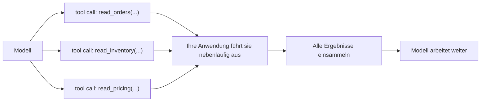
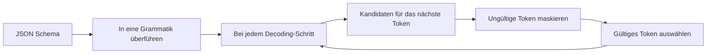

# Parallele Tool-Calls, Constrained Decoding, Wiederholungen und die Kosten vieler Tools

Auf der ersten Seite stand die Mechanik als Kette: Eine **Tool-Definition** beschreibt, was dem Modell zur Verfügung steht; das Modell setzt einen **Tool-Call** ab; Ihre Anwendung führt ihn aus und gibt das **Tool-Result** zurück; danach läuft die Schleife weiter.

Diese Seite behandelt vier Fragen, die erst im Betrieb auftauchen. Was geschieht, wenn das Modell mehrere Aufrufe auf einmal absetzt? Wie lässt sich ein Schema Token für Token erzwingen? Und wie erholt sich die Schleife von einem schlechten Aufruf, statt daran zu sterben? Die vierte Frage stellt sich erst spät: Was geht kaputt, sobald ein Agent statt fünf Tools plötzlich Dutzende mitführt?

Der Stoff der ersten Seite wird dabei vorausgesetzt und nicht noch einmal erklärt: der Tool-Call in vier Schritten, die Sicherheitsgrenze, der Satz, dass eine Tool-Definition ein Prompt ist, und die fünf Merkmale eines guten Tools; diese Seite baut darauf auf, statt sie zu wiederholen.

## Parallele Tool-Calls: Unabhängigkeit ist die Bedingung

Das Modell muss seine Aufrufe nicht einzeln nacheinander abliefern. Es kann in einer einzigen Antwort mehrere voneinander unabhängige Tool-Calls absetzen – drei Lesezugriffe auf die Datenbank und zwei Abfragen an fremde APIs zum Beispiel –, statt sie über fünf Antworten zu verteilen.

Ihre Anwendung tut daraufhin zweierlei, und die Reihenfolge steht fest: Sie verteilt die Aufrufe und führt sie nebenläufig aus; danach sammelt sie jedes Ergebnis ein und führt die Ergebnisse in einer einzigen Nachricht wieder zusammen, bevor das Modell weiterarbeitet. Aus einer Antwort werden N Aufrufe und aus N Ergebnissen wieder eine Nachricht, mit der die Schleife dann weiterläuft.

Alles hängt an einem Wort: *unabhängig*. Die nebenläufige Ausführung ist nur unter zwei Bedingungen zulässig: Kein Aufruf braucht das Ergebnis eines anderen, und kein Seiteneffekt eines Aufrufs verändert, was ein anderer Aufruf zu sehen bekommt. Genau diese Unabhängigkeit setzt das Modell voraus, wenn es mehrere Aufrufe zu einem **Batch** zusammenfasst – und Ihre Anwendung prüft sie nicht nach. Nichts stellt fest, ob die drei Aufrufe einander wirklich nicht ins Gehege kommen. Tun sie es doch, dann entsteht eine **Race Condition** (Fehler durch unkontrolliertes Timing zweier nebenläufiger Zugriffe), keine Fehlermeldung.

Die Stellschrauben dafür sitzen beim Anbieter, und die genauen Namen sind wichtig:

- **Anthropic Claude** fasst Aufrufe standardmäßig zu einem Batch zusammen: Die Claude-4-Modelle setzen parallele Aufrufe ab, sobald eine Anfrage davon profitiert. Abschalten lässt sich das mit `disable_parallel_tool_use: true` – und dieser Schalter steht *innerhalb* des `tool_choice`-Objekts, nicht als Parameter auf oberster Ebene der Anfrage. Mit `tool_choice` vom Typ `auto` ruft das Modell höchstens ein Tool pro Antwort auf, bei `any` und bei `tool` genau eines.
- **OpenAI** stellt `parallel_tool_calls` bereit; voreingestellt sind mehrere Aufrufe pro Antwort erlaubt. Auf `false` gesetzt, erlaubt der Parameter höchstens einen Aufruf.
- **Gemini** unterstützt **parallel function calling** – mehrere unabhängige Funktionen in einer Antwort – und, davon ausdrücklich getrennt, **compositional function calling**, bei dem die Aufrufe eine Kette bilden und die Ausgabe des einen in den nächsten fließt: erst `get_current_location()`, dann `get_weather(location)`. Das erste ist ein Batch, das zweite eine Abhängigkeitskette, und genau auf diese Unterscheidung kommt es hier an.

Auch das Einsammeln der Ergebnisse hat einen eigenen Vertrag, und Anthropic formuliert ihn konkret: Auf jeden `tool_use`-Block gehört genau ein `tool_result`, und alle stehen gemeinsam in der nächsten Nutzernachricht; jedes Ergebnis wird über `tool_use_id` seinem Aufruf zugeordnet; und jedes `tool_result` steht vor jedem Text dieser Nachricht. Haben Sie einen Aufruf gar nicht ausgeführt – weil Sie den Batch etwa nacheinander abgearbeitet haben und ein früherer Aufruf fehlgeschlagen ist –, dann geben Sie trotzdem ein `tool_result` zurück, mit `is_error: true` und einer kurzen Begründung, statt ihn stillschweigend fallen zu lassen. Gemini verfährt dem Sinn nach genauso: Jede Antwort verweist über eine `id` auf ihren Aufruf zurück, und Sie müssen alle zurückgeben.

Zwei Arten von Aufrufen haben in einem parallelen Batch nichts zu suchen. Die erste sind **abhängige Aufrufe**, bei denen einer das Ergebnis eines vorherigen braucht – compositional calling also, das der Reihe nach auszuführen ist. In einen Batch gehört das nicht, denn dem zweiten Aufruf fehlt ein Argument, das es noch gar nicht gibt. Die zweite sind **schreibende Zugriffe mit Seiteneffekt**. Nebenläufige Schreibzugriffe auf denselben Zustand geraten sich in die Quere, und die Reihenfolge innerhalb eines Batches ist nicht festgelegt – Sie können nicht sagen, welcher zuerst angekommen ist. Für schreibende Tools schalten Sie deshalb entweder die parallelen Aufrufe ab (`disable_parallel_tool_use` beziehungsweise `parallel_tool_calls: false`) oder führen sie in Ihrem eigenen Code nacheinander aus. Weiter unten kommt dieser Punkt noch einmal, dann mit der Frage, wann eine Wiederholung überhaupt gefahrlos ist.

Fasst das Modell hartnäckig Aufrufe zu einem Batch zusammen, die nicht zusammengehören, liegt die dokumentierte Abhilfe im Prompt selbst: Weisen Sie es im System-Prompt an – „Only batch tool calls that are independent of each other.“ Der Batch beruht auf einer Annahme, die das Modell nie nachprüft, und im System-Prompt korrigieren Sie genau diese Annahme.

Als Bild: Drei Aufrufe verlassen das Modell, Ihre Anwendung führt sie nebenläufig aus, und ihre Ergebnisse kommen gemeinsam als eine Nachricht zurück.

## Das Schema wird zur Grammatik

Die Argumente eines Tools beschreibt ein **Schema** – in aller Regel JSON Schema; Gemini verwendet ein Schema aus einer OpenAPI-Teilmenge. Auf der ersten Seite war es der typisierte Teil dessen, was dem Modell zur Verfügung steht: streng typisierte, eingeschränkte Parameter, die einengen, was das Modell überhaupt erzeugen kann. Es ist aber mehr als Dokumentation: Im **Strict Mode** wird das Schema erzwungen, und das Modell kann keine Argumente erzeugen, die es verletzen. Warum dieses „kann nicht“ wörtlich zu nehmen ist, zeigt der Mechanismus dahinter.

Er heißt **Constrained Decoding**. Der Anbieter überführt Ihr Schema in eine **Grammatik** – eine formale Grammatik, im allgemeinen Fall eine kontextfreie. Beim **Sampling** – der Auswahl des nächsten Tokens – werden dann in jedem Decoding-Schritt alle Token maskiert, also ausgeblendet, die die Grammatik angesichts des bereits Erzeugten verletzen würden; ausgewählt wird nur noch aus dem, was übrig bleibt. Verlangt die Grammatik an einer Stelle eine Ziffer, dann steht eine schließende geschweifte Klammer unter den möglichen nächsten Token gar nicht erst zur Wahl.

Die Ausgabe entspricht dem Schema also schon vom Verfahren her – nicht, weil das Modell zufällig das Richtige erzeugt hätte, und auch nicht, weil ungültige Ausgaben nachträglich aussortiert würden.

Wie Sie an den Strict Mode herankommen, ist von Anbieter zu Anbieter verschieden:

- **OpenAI**: `strict: true` in der Funktionsdefinition sorgt dafür, dass die Aufrufe das Schema verlässlich einhalten, statt es nur nach bestem Bemühen zu treffen; umgesetzt ist das über die sogenannten Structured Outputs, unter der Haube also über Constrained Decoding. Zwei Voraussetzungen gehören dazu: `additionalProperties: false` an jedem Objekt, und jede Eigenschaft muss unter `required` aufgeführt sein.
- **Anthropic Claude**: der Strict Mode über `tool_choice` mit `strict: true`.
- **Gemini**: Die Argumente sind an das Schema der OpenAPI-Teilmenge gebunden, das in der Funktionsdeklaration steht.

Umsonst ist das nicht. Der Strict Mode hat drei Haken:

- **Das Schema wird beim ersten Aufruf in eine Grammatik überführt.** Die erste Anfrage mit einem *neuen* Schema verursacht dadurch zusätzliche Latenz: Die Grammatik muss berechnet und für das Sampling aufbereitet werden. Spätere Anfragen mit demselben Schema treffen einen Cache und laufen schnell. OpenAI dokumentiert genau das – vom Schema zur Grammatik beim ersten Sehen, danach aus dem Cache. Die praktische Folge: Wer bei jedem Aufruf ein frisch erzeugtes Schema durchreicht, entwertet den Cache und zahlt diesen Aufschlag jedes Mal von Neuem.
- **Nicht jedes Schema-Merkmal wird unterstützt.** Der Strict Mode deckt nur eine Teilmenge von JSON Schema ab; `additionalProperties: false` und die Voraussetzung, jede Eigenschaft als `required` zu führen, machen einige ausdrucksstarke Konstrukte unbrauchbar oder erzwingen einen Umbau des Schemas.
- **Parallele Aufrufe und der Strict Mode vertrugen sich zunächst nicht.** Parallel function calling funktionierte bei OpenAI *ursprünglich* nicht zusammen mit dem Strict Mode; wer im Strict Mode bleiben wollte, setzte `parallel_tool_calls: false`. Das wurde später behoben – inzwischen funktionieren parallele Aufrufe zusammen mit dem Strict Mode, und der Einwand ist überholt.

Was das Constrained-Decoding-Verfahren einbringt, lässt sich genau angeben: wohlgeformte Argumente, die dem Schema entsprechen – das JSON lässt sich parsen, die Typen stimmen, die Enums werden eingehalten. Es garantiert nicht, dass die Argumente *richtig* sind, und schon gar nicht, dass das Modell zum *richtigen* Tool gegriffen hat. Struktur ist nicht Bedeutung – und genau darum geht es weiter unten bei der Validierung.

Derselbe Mechanismus als Schleife: Das Schema wird einmal überführt, danach maskiert jeder Decoding-Schritt und wählt aus dem Rest aus.

## Wenn ein Tool-Call fehlschlägt – und wie die Schleife weiterläuft

Ein Tool-Call schlägt auf mehrere Arten fehl, und sie in einen Topf zu werfen ist der erste Fehler – denn die Abhilfe, die die eine behebt, verschlimmert die andere. Fünf Fälle sind zu unterscheiden:

- **Fehlerhafte Argumente** – sie lassen sich nicht parsen oder verletzen das Schema. Für Tools im Strict Mode schließt das Constrained-Decoding-Verfahren diesen Fall aus; ein Tool ohne Strict Mode kann nach wie vor unbrauchbare Argumente erhalten.
- **Fehlgeschlagene Validierung** – die Argumente sind wohlgeformt, scheitern aber an Ihren eigenen Prüfungen: ein Wert außerhalb des zulässigen Bereichs, eine unbekannte Kennung. Dazu weiter unten mehr, bei der Validierung der Argumente.
- **Ausnahme im Tool** – das Tool ist gelaufen und hat eine Ausnahme geworfen: ein `500` aus einem nachgelagerten Dienst, eine fehlerhafte Abfrage.
- **Zeitüberschreitung** – das Tool hat innerhalb seines Timeouts nicht geantwortet.
- **Leeres oder mehrdeutiges Ergebnis** – das Tool hat nichts Brauchbares zurückgegeben oder etwas, das das Modell falsch lesen kann. Das sind die „Erfindungen über das Ergebnis hinaus“ von der ersten Seite: Das Modell setzt auf einem unklaren oder leeren Ergebnis auf und halluziniert. Der Fall gehört auf diese Liste, obwohl technisch nichts fehlgeschlagen ist.

Das Wichtigste, wenn ein Aufruf fehlschlägt, hat eine Form, die Sie schon kennen: Auf der ersten Seite war eine Tool-Definition ein Prompt – für einen Fehler gilt dasselbe. **Fehler als Prompt** heißt, dass Sie das Scheitern an das Modell zurückgeben, als Nachricht, die es lesen und auf die es reagieren kann: ein **behebbarer Fehler**, formuliert als Anleitung. Zwei Beispiele dafür sind „date must be YYYY-MM-DD“ und „unknown user_id, call list_users first“ – und ausdrücklich nicht ein undurchsichtiger Stacktrace und auch kein nackter Exit-Code ungleich null.

Danach repariert sich die Schleife selbst, in vier Schritten: fehlerhafter Aufruf, klarer Fehler, das Modell formuliert neu, erneuter Aufruf. Es ist derselbe Gedanke wie auf der ersten Seite – klare Fehler, und die Schleife korrigiert sich selbst –, nur auf der Ebene, auf der Sie den Fehlertext bewusst formulieren. In Anthropics Form ist das ein `tool_result` mit `is_error: true` und einer Nachricht, die sagt, was zu tun ist; das Modell setzt in der nächsten Antwort einen korrigierten Aufruf ab.

Nicht jedes Scheitern geht auf das Modell zurück, und der Rest wird anders behandelt. Bei **transienten** Fehlern – einer Zeitüberschreitung, einem Rate Limit, einem `5xx` aus einem nachgelagerten Dienst – wiederholen Sie den Aufruf, aber mit **Backoff**: Ziehen Sie die Versuche zeitlich auseinander, üblicherweise mit exponentiellem Backoff. Eine enge Wiederholungsschleife hämmert sonst nur auf eine Abhängigkeit ein, der es ohnehin schon schlecht geht, und macht aus einer kurzen Störung einen Ausfall.

Und deckeln Sie das Ganze. Eine Obergrenze für Wiederholungen (**Retry-Budget**) – hart, pro Aufruf und pro Durchlauf – entspricht dem Schritt-Budget und dem Token-Budget aus der Lektion zur Planung. Ohne diese Obergrenze landet ein Aufruf, der deterministisch fehlschlägt, in einer **Endlosschleife**: Der Agent setzt denselben aussichtslosen Aufruf immer wieder ab und kommt nie zum Ende.

Damit ist der eigentliche Unterschied benannt. Eine Wiederholung lohnt sich nur, wenn die Eingabe eine *andere* ist – ein korrigiertes Argument, oder ein vorübergehender Ausfall, der sich inzwischen gelegt hat. Wiederholen Sie denselben Aufruf nach einem deterministischen Fehler, schlägt er identisch fehl, und Sie haben Budget und Geld verbrannt, um zu erfahren, was Sie schon wussten. Erkennen Sie deshalb den Fall, in dem nichts vorangeht, und halten Sie an: den Fehler nach außen melden, an einen Menschen übergeben, ein anderes Tool versuchen. Und benennen Sie den Fall richtig: Eine Schleife, die nicht anhält, ist ein Fehler im Durchlauf – nicht ein Modell, das die Antwort verweigert.

Zwei Dinge werden also nicht wiederholt. Ein deterministischer Fehler nicht, an dem sich nichts geändert hat: Wenn die Eingabe dieselbe bleibt, bleibt auch das Ergebnis dasselbe. Und ein schreibender Zugriff mit Seiteneffekt nicht, der teilweise erfolgreich gewesen sein könnte, solange keine Idempotenzgarantie dahintersteht – sonst führt die Wiederholung ein zweites Mal aus, was der erste Versuch bereits getan hat. Wiederholungen sind für transiente Fehler und für selbst korrigierte Argumente da; sie ersetzen es nicht, den Aufruf in Ordnung zu bringen – und für schreibende Zugriffe wird der übernächste Abschnitt konkret.

## Was Dutzende Tools an Kontext kosten

Jede Tool-Definition kostet in jeder Anfrage Token: Name, Beschreibung und das vollständige Parameterschema jedes Tools werden bei jedem Aufruf in den Prompt serialisiert – ob das Tool gebraucht wird oder nicht. Ein Dutzend Tools verursacht damit laufende Kosten an Token, Latenz und Geld, die anfallen, ob das Modell eines davon anfasst oder nicht. Das ist der konkrete Preis hinter der Forderung der ersten Seite: „wenige Tools, und keine, die sich überschneiden“. Die Rechnung in Token ist dabei nur die eine Hälfte; die andere zahlen Sie an der Trefferquote, und dagegen hilft nicht, den Katalog zu kürzen, sondern ihn anders zuzuschneiden.

Die **Tool-Auswahl** wird nämlich schlechter, je größer der Katalog wird: Je mehr Tools sich inhaltlich ähneln, desto häufiger nimmt das Modell die falsche Funktion, oder es antwortet aus dem Gedächtnis, statt überhaupt ein Tool aufzurufen – das Fehlerbild „das falsche Tool – oder gar keines“ von der ersten Seite. Ein großer, flacher Katalog macht den Agenten also aktiv schlechter im Auswählen.

Bei einer großen Zahl von Tools hilft nur, nicht mehr jedes Tool jedes Mal mitzuschicken. Die **dynamische Tool-Auswahl** – auch **Tool-RAG** genannt – ruft nur die Tools ab, die zur aktuellen Frage passen, und lädt nur diese in die Anfrage. Der Vergleich liegt nahe: RAG, angewandt auf den Tool-Katalog statt auf Dokumente – ein Retrieval-Schritt über Ihren Katalog, der die aktive Auswahl bei jeder Anfrage klein und thematisch passend hält. **Namensräume** greifen dasselbe Problem von der anderen Seite an: Geben Sie den Tools strukturierte Namen und gruppieren Sie sie nach Domäne oder nach Server; aus einem solchen Namen liest dann sowohl das Modell als auch Ihr Retrieval-Schritt ab, wohin ein Tool gehört. Das verringert Namenskollisionen und Überschneidungen, sobald der Katalog groß ist.

Ab einem gewissen Punkt ist die Antwort ohnehin keine längere Liste mehr. Schleppt ein einzelner Agent Dutzende Tools mit sich, dann teilen Sie ihn in **spezialisierte Agenten** auf, jeden mit einem kleinen, überschneidungsfreien Katalog – das ist das Spezialisierungsargument aus der [Lektion über Multi-Agenten-Systeme](../multi-agent/index.md). Ein Katalog, der immer weiter wächst, ist selbst das Signal dafür, dass ein einzelner Agent nicht mehr reicht.

Die Zurückhaltung gilt auch in die andere Richtung, und es ist dieselbe Regel wie überall in Teil II: die einfachste Stufe nehmen, die die Aufgabe löst. Greifen Sie also nicht zu früh zu Tool-RAG. Bei einer Handvoll Tools ist es überflüssige Mechanik mit einer eigenen Fehlerfläche – ein Retrieval-Schritt, der danebengreifen und ausgerechnet das Tool verstecken kann, das das Modell gebraucht hätte. Das Einfachste, was funktioniert, ist der vollständige, statische Katalog; die dynamische Auswahl verdient ihre Komplexität erst, wenn der Katalog wirklich groß ist.

## Idempotenz: Welche Aufrufe sich gefahrlos wiederholen lassen

Ob eine Wiederholung sicher ist, entscheidet nicht Ihre Wiederholungsstrategie. Das entscheidet das Tool. Lesende und schreibende Tools verhalten sich dabei verschieden: Einen Lesezugriff noch einmal auszuführen kostet nichts außer Latenz; einen Schreibzugriff noch einmal auszuführen – die Bestellung anlegen, die E-Mail verschicken, die Karte belasten – kann den Seiteneffekt verdoppeln.

Die Eigenschaft, die Sie brauchen, ist **Idempotenz**: Ein Schreibzugriff, zweimal mit derselben Eingabe ausgeführt, hat dieselbe Wirkung wie einmal ausgeführt. Der übliche Mechanismus dafür ist der **Idempotency-Key**: Die aufrufende Seite hängt an jede beabsichtigte Operation einen eindeutigen Schlüssel, und der Server erkennt Wiederholungen desselben Schlüssels und führt sie nicht erneut aus. Mit einem solchen Schlüssel ist die Wiederholung nach einer unklaren Zeitüberschreitung gefahrlos: War der erste Versuch in Wahrheit erfolgreich, läuft der zweite ins Leere.

Für gefährliche oder irreversible Schreibzugriffe teilen Sie die Operation in zwei. Ein **Dry-Run** (Probelauf ohne Wirkung) berechnet und zeigt, was geschehen *würde*, ohne etwas zu bewirken; erst nach einer ausdrücklichen Bestätigung wird die Operation tatsächlich ausgeführt. Und genau diese Bestätigung ist häufig die Stelle, an der ein Mensch zustimmt – der Human-in-the-Loop. Aus dem **Prinzip der geringsten Berechtigungen** und aus der Forderung der ersten Seite, für gefährliche Aktionen eine ausdrückliche Bestätigung zu verlangen, wird damit eine Form aus zwei Aufrufen.

Halten Sie diese Trennung strukturell, wie es die erste Seite verlangt hat: Lesende und schreibende Tools bleiben getrennt, damit Sie dem Agenten breiten Lesezugriff geben und schreibende Aktionen nur nach Freigabe zulassen können. Das Prinzip der geringsten Berechtigungen hört auf, ein Schlagwort zu sein, sobald die Tools selbst entlang der Linie geteilt sind, die Sie bewachen wollen.

An dieser Stelle trifft die Parallelität von weiter oben auf die Idempotenz. In einem parallel ausgeführten Batch ist die Reihenfolge nicht festgelegt; zwischen zwei Schreibzugriffen im selben Batch entsteht deshalb leicht eine Race Condition, oder sie kommen in der falschen Reihenfolge an. Setzen Sie also nie reihenfolgeabhängige oder einander widersprechende Schreibzugriffe in denselben parallelen Batch – führen Sie sie nacheinander aus, oder schalten Sie die parallelen Aufrufe für schreibende Tools ab. Weiter oben war die Parallelität der Gewinn; bei Schreibzugriffen ist sie die Falle.

Und damit steht die Regel, die die Wiederholungen an die Schreibzugriffe zurückbindet: Verlassen Sie sich nicht auf Wiederholungen bei einem schreibenden Tool, das nicht idempotent ist und keinen Schlüssel führt. Eine Wiederholung nach einer Zeitüberschreitung, die in Wahrheit erfolgreich war, führt ein zweites Mal aus, was der erste Versuch bereits getan hat – eine zweite Belastung der Karte, eine zweite E-Mail. Erst die Idempotenz herstellen, dann Wiederholungen erlauben. Diese Reihenfolge lässt sich nicht umkehren.

## Zwei Ebenen der Validierung: technisch und fachlich

Das Constrained-Decoding-Verfahren liefert Ihnen wohlgeformte Argumente. Fachlich richtige liefert es Ihnen nicht. Die Stelle, an der sich das eine vom anderen trennt, liegt zwischen „das Modell hat Argumente erzeugt“ und „Sie führen das Tool aus“. Validieren Sie deshalb, bevor Sie ausführen: Schalten Sie eine Prüfung vor, die die Argumente ansieht, bevor irgendein Seiteneffekt eintreten kann. Diese Prüfung hat zwei Ebenen, und sie fangen Verschiedenes ab:

- **Die technische Validierung** prüft Typen, Pflichtfelder, Enums und Formate; sie validiert gegen das Schema. Für Tools im Strict Mode erledigt das Constrained-Decoding-Verfahren das schon bei der Erzeugung – validieren Sie trotzdem, für Tools ohne Strict Mode und als zweite Verteidigungslinie.
- **Die fachliche Validierung** fängt die Argumente ab, die typrichtig und im gegebenen Zusammenhang trotzdem falsch sind: eine Kennung, die es nicht gibt; ein Datum in der Vergangenheit; ein Betrag über einem Limit; ein Pfad außerhalb des erlaubten Wurzelverzeichnisses. Das meiste davon kann ein Schema nicht ausdrücken, Ihr Code muss es tun. Das ist genau die Lücke, von der weiter oben beim Schema die Rede war: Die Struktur geht durch, die Bedeutung nicht.

Weist die Validierung ein Argument zurück, dann geht die Rückmeldung denselben Weg wie bei einem Fehler während der Ausführung: Die fehlgeschlagene Prüfung gibt eine behebbare, für das Modell lesbare Nachricht zurück – wieder Fehler als Prompt –, woraufhin das Modell das Argument korrigiert und den Aufruf wiederholt. Es ist dieselbe sich selbst korrigierende Schleife; sie bewacht diesmal nur die Grenze *vor* der Ausführung, statt hinterher einen Fehler aufzufangen.

Damit steht auch die Linie zwischen den beiden Ebenen fest. Schieben Sie fachliche Prüfungen nicht ins Schema, wo sich die meisten von ihnen gar nicht darstellen lassen. Und lassen Sie die Validierung nicht weg, nur weil im Strict Mode dekodiert wird – der Strict Mode garantiert wohlgeformt, nie fachlich richtig. Die beiden Ebenen ergänzen einander, und keine ersetzt die andere.

## Das Wichtigste

- In einer einzigen Antwort kann das Modell mehrere unabhängige Aufrufe absetzen; Ihre Anwendung verteilt sie, führt sie nebenläufig aus und führt die Ergebnisse gemeinsam wieder zusammen. Zulässig ist das nur, wenn die Aufrufe wirklich nicht voneinander abhängen und einander nicht stören – und niemand außer Ihnen stellt das sicher.
- Der Strict Mode erzwingt ein Schema über Constrained Decoding: Das Schema wird in eine Grammatik überführt, und in jedem Decoding-Schritt werden alle Token maskiert, die sie verletzen würden. Das bringt wohlgeformte Argumente, keine fachlich richtigen – und der erste Aufruf mit einem neuen Schema wartet, bis die Grammatik gebaut ist, alle weiteren treffen den Cache.
- Ein fehlgeschlagener Aufruf erholt sich, wenn Sie den Fehler als Prompt zurückgeben: eine lesbare Nachricht, gegen die das Modell korrigieren kann. Transiente Fehler wiederholen Sie mit Backoff und unter einer harten Obergrenze; eine unveränderte Wiederholung nach einem deterministischen Fehler ist keine Erholung, sondern eine Endlosschleife.
- Jede Tool-Definition verbraucht bei jeder Anfrage Token, und die Treffsicherheit der Auswahl sinkt, je mehr Tools im Katalog stehen. Eine kleine, passende Auswahl abzurufen (Tool-RAG) lohnt sich erst, wenn der Katalog wirklich groß ist – und jenseits davon teilen Sie besser in spezialisierte Agenten auf, statt einen einzelnen weiter wachsen zu lassen.
- Ein Lesezugriff lässt sich gefahrlos wiederholen, ein Schreibzugriff nicht, es sei denn, er ist idempotent. Geben Sie schreibenden Tools einen Idempotency-Key, den gefährlichen zusätzlich die Teilung in Probelauf und Bestätigung – und niemals einen Platz im selben parallelen Batch neben einem zweiten Schreibzugriff.
- Validieren Sie die Argumente vor der Ausführung, auf zwei Ebenen: technisch für die Form, fachlich für die Bedeutung. Die erste erledigt das Constrained-Decoding-Verfahren für Tools im Strict Mode, die zweite muss Ihr Code abdecken – und ein Validierungsfehler geht genauso an das Modell zurück wie ein Fehler aus der Ausführung.

**[Neue Begriffe](../../glossary.md#tools)**: parallel tool calls, constrained decoding, strict mode / Structured Outputs, idempotency / idempotency key, tool-RAG / dynamic tool loadout, argument validation, retry budget
