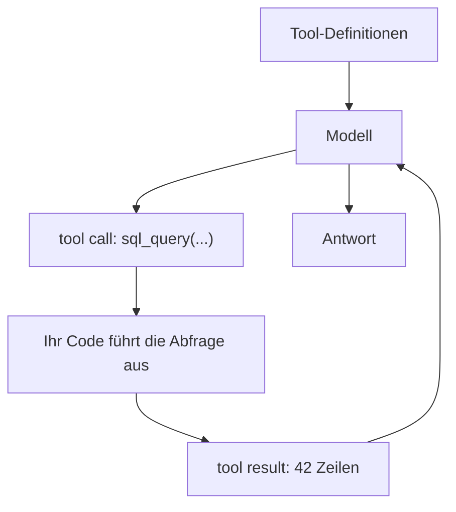

# Die Schnittstelle des Modells zur Außenwelt

In der vorangegangenen Lektion über Agentic RAG hat sich eine Sache verschoben: Das Retrieval war kein fester Schritt der Pipeline mehr, sondern eine Aktion, für die sich das Modell innerhalb einer Schleife selbst entscheidet. Dokumente abzurufen ist aber nur eine Aktion unter vielen.

**Tool-Einsatz**, auch **Function Calling** genannt, ist der allgemeine Mechanismus dahinter: Das Modell kann jede externe Funktion aufrufen. Zum Beispiel:

- die Suche in einer Wissensdatenbank,
- die Abfrage einer Tabelle per SQL,
- der Aufruf einer HTTP-API,
- ein Taschenrechner,
- die Ausführung von Code,
- der Versand einer E-Mail.

Damit rückt das Retrieval an eine andere Stelle: Es ist ein Sonderfall, ein Tool unter mehreren. Genau hier kippt das Bild – ein Modell, das Tools aufrufen kann, ist kein bloßer Textgenerator mehr. Es liest aktuelle Daten, rechnet exakt und verändert den Zustand externer Systeme.

:::tip[▶ Video]

<YouTube id="h8gMhXYAv1k" title="What is Tool Calling? Connecting LLMs to Your Data — IBM Technology" />

IBM erläutert denselben Mechanismus und zeigt, wie ein Tool-Call das Modell an Ihre Daten und Ihre Systeme anbindet. (Das Video ist auf Englisch.)

:::

## Text ist keine Handlung – deshalb braucht das Modell ein Protokoll

Ein Sprachmodell führt nichts aus. Es erzeugt Text, und dabei bleibt es: Es greift nicht selbst in eine Datenbank, es setzt keine Anfrage an eine API ab, und Code führt es schon gar nicht aus. Der Tool-Einsatz ist das Protokoll, das diese Lücke überbrückt – zwischen dem Text, den das Modell erzeugt, und dem, was am Ende jemand wirklich tun muss. Der Ablauf ist dabei immer derselbe:

1. Das Modell formuliert eine **strukturierte Absicht**: Funktion X mit den Argumenten Y aufrufen.
2. **Ihr eigener Code** führt den Aufruf aus und erhält das Ergebnis.
3. Das Ergebnis geht als Kontext an das Modell zurück.
4. Das Modell arbeitet weiter – mit dem Ergebnis im Kontext.

Die Arbeitsteilung ist strikt: Das Modell entscheidet, *was* aufgerufen wird; den Aufruf selbst setzt Ihre Anwendung ab. Die echten Systeme fasst das Modell nie an. Dieselbe Trennlinie wird sich weiter unten als Sicherheitsgrenze erweisen.

## Der Tool-Call in vier Schritten

Der Mechanismus besteht aus vier Schritten, und die Schleife dahinter kennen Sie schon aus Agentic RAG – neu ist allein, dass die Aktion jetzt beliebig sein darf.

- **Die Tool-Definition** – ein Name, ein Beschreibungstext und ein Parameterschema, meist JSON Schema. Sie ist das, was dem Modell zur Verfügung steht: welche Tools es gibt, was sie tun, welche Argumente sie erwarten. Zusammen mit der Frage geben Sie sie dem Modell mit.
- **Der Tool-Call** – statt gewöhnlichen Textes, oder neben ihm, liefert das Modell eine **strukturierte Ausgabe**: JSON mit dem Namen des Tools und den Argumenten.
- **Das Tool-Result** – Ihre Anwendung führt das Tool aus und hängt das Ergebnis als eigene Nachricht an den Gesprächsverlauf an.
- **Das Modell arbeitet weiter** – es sieht das Ergebnis und ruft daraufhin entweder ein weiteres Tool auf oder antwortet.

## Die Tool-Definition ist ein Prompt, nicht nur eine Signatur

Hier liegt der entscheidende Unterschied zur gewöhnlichen API-Entwicklung. Ein Modell wählt sein Tool aus und füllt dessen Argumente allein anhand der Beschreibung; in Ihre Implementierung kann es nicht hineinsehen. Wann und wie die Funktion aufgerufen wird, entscheidet ein probabilistisches Modell also anhand von drei Dingen: dem Namen, dem Beschreibungstext und den Beschreibungen der Parameter.

Ist diese Beschreibung vage, hat das drei Folgen: Das Modell löst den Aufruf zum falschen Zeitpunkt aus, es greift zum falschen Tool, oder es füllt die Argumente mit Unsinn. Tool-Beschreibungen gehören deshalb zum **Prompt-Engineering** – der Aufrufer ist hier kein deterministischer Code, sondern ein Modell, das natürliche Sprache liest.

## Fünf Merkmale eines guten Tools

- **Eine klare, eindeutige Beschreibung** – das Modell unterscheidet Tools anhand ihrer Beschreibung, nicht anhand des Codes dahinter.
- **Streng typisierte, eingeschränkte Parameter** (JSON Schema, `enum`, Formate) – sie engen ein, was das Modell überhaupt erzeugen kann, und senken die Quote fehlerhafter Aufrufe.
- **Wenige Tools, und keine, die sich überschneiden.** Ein Dutzend Funktionen, die inhaltlich dicht beieinanderliegen, verwirrt das Modell, und die Fehler bei der Tool-Auswahl nehmen zu. Halten Sie den Tool-Katalog klein, statt ihn wachsen zu lassen.
- **Klare Fehler.** Schlägt ein Tool fehl, geben Sie eine Meldung zurück, mit der das Modell den Fehler beheben kann – etwa „date must be YYYY-MM-DD“. Dann korrigiert sich die Schleife selbst: Auf einen falschen Aufruf folgt ein klarer Fehler, das Modell formuliert neu und ruft erneut auf.
- **Die richtige Granularität** – nicht zu fein (zehn Aufrufe für eine Aufgabe) und nicht zu grob (ein Tool für alles).

## Vier Fehlerbilder des Tool-Einsatzes

- **Das falsche Tool – oder gar keines.** Das Modell hat die falsche Funktion genommen, oder es hat aus dem Gedächtnis geantwortet, statt überhaupt ein Tool aufzurufen. Abhilfe: bessere Beschreibungen und ein kleinerer Katalog.
- **Ungültige Argumente** – erfundene oder schlicht falsche Parameter. Abhilfe: ein eng gefasstes Schema, gegen das validiert wird, und klare Fehler, die dem Modell die Selbstkorrektur ermöglichen.
- **Erfindungen über das Ergebnis hinaus.** Das Modell kann auf einem Ergebnis aufsetzen und halluzinieren – besonders dann, wenn das Ergebnis unklar oder leer ist. Dagegen hilft, es als eigene Nachricht zurückzugeben und ausdrücklich als Tool-Ausgabe zu kennzeichnen. Das senkt das Risiko, beseitigt es aber nicht.
- **Ein schreibendes Tool wird über die Modellausgabe gesteuert.** Was schreibt, versendet oder Code ausführt, hängt damit an Text, den ein Angreifer beeinflussen kann: Eine **Prompt-Injection** (eingeschleuste Anweisungen im Text) manipuliert die Ausgabe des Modells – auch indirekt, über Anweisungen, die in abgerufenen Inhalten stecken. Die Gegenmaßnahme heißt **Prinzip der geringsten Berechtigungen**: Geben Sie dem Agenten nur die Tools, die er wirklich braucht; trennen Sie lesende von schreibenden Tools; verlangen Sie für gefährliche Aktionen eine ausdrückliche Bestätigung. Dann richtet selbst eine erfolgreiche Injection nur noch sehr wenig aus.

## Agentic RAG als Sonderfall des Tool-Einsatzes

Damit schließt sich der Kreis: *Retrieval ist ein Tool.* Agentic RAG aus der vorangegangenen Lektion ist ein Sonderfall des Tool-Einsatzes, bei dem das wichtigste Tool die Suche ist.

Sobald der Agent über mehrere Tools verfügt, deckt er den Fall ab, dass verschiedene Fragen verschiedene Quellen brauchen: Retrieval aus der Wissensdatenbank, SQL für die Tabellen, eine Websuche für alles, was aktuell sein muss, und ein Taschenrechner dort, wo exakt gerechnet werden muss. Der Router aus der vorangegangenen Lektion ist genau die Stelle, an der entschieden wird, welches Tool zum Zug kommt.

## Das Wichtigste

- Tool-Einsatz (Function Calling) ist der allgemeine Mechanismus: Das Modell ruft eine beliebige externe Funktion auf, und Retrieval ist davon ein Sonderfall.
- Das Modell formuliert nur die Absicht, ausgeführt wird sie von Ihrem Code: Das Modell entscheidet das *Was*, Ihre Anwendung das *Wie*. Genau dort verläuft auch die Sicherheitsgrenze.
- Der Mechanismus lautet Tool-Definition → Tool-Call → Tool-Result → weiterarbeiten – dieselbe Schleife wie bei Agentic RAG, nur mit beliebiger Aktion.
- Eine Tool-Definition ist ein Prompt: Das Modell wählt nach den Worten, nicht nach dem Code. Ein gutes Tool hat eine klare Beschreibung und ein eng gefasstes Schema; und es gibt wenige Tools, die sich nicht überschneiden, dazu klare Fehlermeldungen.
- Neue Fehler: das falsche Tool, ungültige Argumente, Erfindungen über das Ergebnis hinaus – und die Sicherheit, denn ein schreibendes Tool plus Prompt-Injection ist der Grund für das Prinzip der geringsten Berechtigungen.

**[Neue Begriffe](../../glossary.md#tools)**: tool use / function calling, tool definition, tool call, tool result, tool selection, JSON Schema, structured output.

---

:::note[Als Nächstes: Teil 2 der Lektion]

**[Zuverlässigkeit und Skalierung](./deep-dive.md)** – Tool-Calls in den Produktivbetrieb bringen: parallele Aufrufe, Schemaformate und Constrained Decoding, der Umgang mit Fehlern und Wiederholungen, und was Dutzende Tools an Kontext kosten.

Siehe auch: Tools über einen gemeinsamen Standard anbinden – [MCP und Agentenprotokolle](../mcp/index.md); wie das bei Claude, OpenAI und Gemini aussieht – [der Abschluss dieses Teils](../real-agents.md).

:::
