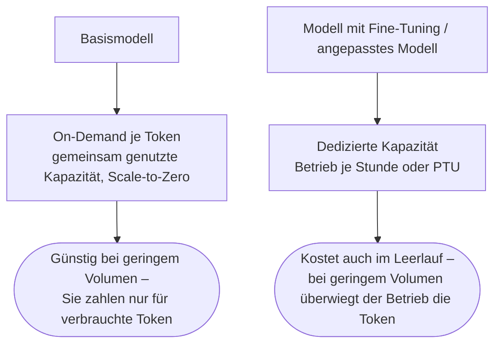
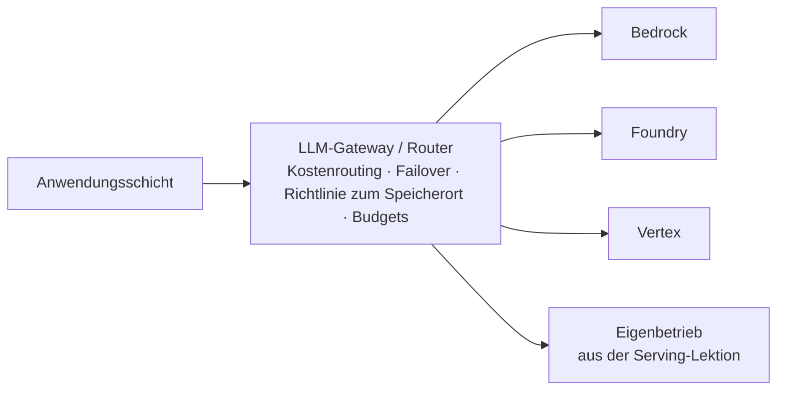

# Die Cloud-Rechnung, die Agenten-Laufzeitumgebung und wer Ihre Prompts lesen darf

[Teil 1 der Lektion](./index.md) hat den Boden bereitet: die drei Wege, an Token aus einem Modell zu kommen, den Perimeter, den eine Plattform tatsächlich verkauft, die drei großen Plattformen und die Regel, dass ihre Namen nur Momentaufnahmen sind, die Modellkataloge, die Triade aus Datenschutz und Speicherort, das verwaltete RAG-Angebot und die Guardrails der Plattform, die drei Preismodelle – On-Demand, reservierte Kapazität, Batch – und die Frage, wie die Entscheidung in der Praxis wirklich fällt. Dies ist der zweite, tiefe Durchgang über dieselben Plattformen. Er beantwortet fünf Fragen, die Teil 1 offengelassen hat: was Sie anpassen, wenn Prompting und RAG nicht mehr genügen; was den Agenten ausführt, sobald Sie ihn gebaut haben; was das Ganze kostet und wie Sie diese Kosten vorher ausrechnen; wie Sie über die Clouds hinweg unabhängig bleiben; und wer rechtlich überhaupt darauf zugreifen darf. Teil 1 wird durchgehend vorausgesetzt und hier nirgends noch einmal erklärt. Alles Folgende ist eine Momentaufnahme von Mitte 2026 (Juli 2026); wie schon in Teil 1 sind die Produktnamen datiert, und was bleibt, ist die Kategorie darunter.

## Was es kostet, ein angepasstes Modell bereitzustellen

Jeder Hyperscaler bietet dieselbe **Leiter der Anpassung**, und sie führt in genau eine Richtung: von billiger und lockerer zu teurer und strenger. Unten stehen Prompt-Engineering und RAG, darüber das parametereffiziente Tuning (LoRA und die übrigen PEFT-Verfahren), darüber das vollständige überwachte Fine-Tuning (SFT), darüber die Verfahren mit Präferenzdaten und Reinforcement Learning (DPO, Reinforcement-Fine-Tuning), darüber die Distillation und ganz oben das fortgesetzte Vortraining (*continued pre-training*). Die Namen der Sprossen und die Liste der infrage kommenden Basismodelle wechseln vierteljährlich; nehmen Sie die Einzelheiten als Momentaufnahme und behalten Sie die Leiter.

Jede Plattform unten verkauft eine Sprosse, die dieses Handbuch bisher nur aufgezählt hat. **Die Distillation** trainiert ein kleines **Schülermodell** darauf, die Ausgaben eines großen **Lehrermodells** nachzuahmen – Sie verkleinern nicht das Lehrermodell, sondern trainieren ein anderes, kleineres Modell darauf, sich auf der Verteilung, die Sie interessiert, wie jenes zu verhalten. Zum Hebel an den Kosten wird das dadurch, dass das Lehrermodell nur einmal laufen muss, über Ihre Trainingsdaten, während Sie das Schülermodell betreiben; zur Verpflichtung wird es dadurch, dass das Schülermodell ein *neues Modell* ist – mit eigener Bewertung, eigenen Regressionen (also Verschlechterungen, die eine Änderung verursacht hat) und eigenem Modelldrift. Diese Pflicht lässt sich leicht überspringen und ist dann teuer: Ein Schülermodell ist nur so gut wie der Ausschnitt an Verhalten, den Sie destilliert haben. Es trifft das Lehrermodell also auf dem Verkehr, aus dem Sie die Stichprobe gezogen haben, und weicht auf dem übrigen still davon ab. Destillieren Sie das Schülermodell aus dem echten Verkehr und nicht aus einer kuratierten Menge, und halten Sie das Lehrermodell als Vergleich lauffähig.

Eine Spielart davon sitzt auf einer anderen Achse. **Die Context-Distillation** trainiert ein Modell darauf, sich so zu verhalten, als läge ein Kontext vor – ein langer System-Prompt, eine Richtlinie, eine Reihe ausgearbeiteter Beispiele –, ohne dass dieser Kontext bei der Inferenz überhaupt mitgegeben wird. Mechanisch minimiert sie den Abstand zwischen der Ausgabe des Modells auf die bloße Eingabe und seiner Ausgabe auf Eingabe plus Kontext ([Snell, Klein und Zhong](https://arxiv.org/abs/2209.15189); Askell et al. haben auf diesem Weg einen Alignment-Prompt in die Gewichte gebrannt). Sie gehört auf diese Leiter und nicht neben die Quantisierung, denn sie ist ein Zug der *Kontextualisierung*: Sie beantwortet die Frage, wie Sie aufhören, diese viertausend Prompt-Token bei jeder einzelnen Anfrage zu bezahlen. Ihr Preis ist der, den die ganze Leiter verlangt – das Verhalten ist danach in den Gewichten eingefroren, eine geänderte Richtlinie heißt also erneut trainieren statt eine Zeichenkette bearbeiten. Das Prompt-Caching löst dieselbe Rechnung ohne diesen Tausch und ist das Erste, was Sie versuchen sollten.

Mitte 2026 füllen die drei Plattformen sie so:

- **[AWS Bedrock](https://aws.amazon.com/bedrock/)** – SFT, Reinforcement-Fine-Tuning (die Belohnungsfunktion liefern Sie selbst, als Lambda), **Model Distillation** (ein Lehrermodell versieht die Daten für ein kleineres Schülermodell mit Labels; auf der re:Invent 2024 als Vorschau gestartet, inzwischen allgemein verfügbar) und fortgesetztes Vortraining auf Daten ohne Labels. Abgerechnet wird das Training je Token mal Epochen, dazu kommt eine monatliche Gebühr für die Speicherung des angepassten Modells.
- **[Azure OpenAI](https://azure.microsoft.com/en-us/products/ai-services/openai-service) / Microsoft Foundry** – SFT, DPO (Direct Preference Optimization) und Reinforcement-Fine-Tuning mit Bewertungsmodellen. Beides lässt sich stapeln, erst SFT, dann DPO. Für einen RFT-Durchlauf gilt eine Obergrenze von 5.000 $: Er hält an der Obergrenze an und liefert einen einsatzfähigen Checkpoint, statt unbegrenzt weiter abzurechnen.
- **[Vertex AI](https://cloud.google.com/vertex-ai)** (inzwischen in die Gemini Enterprise Agent Platform überführt) – überwachtes Tuning für Gemini, parametereffizientes Tuning auf LoRA-Basis, bei dem `adapter_size` den LoRA-Rang festlegt, und Distillation-Tuning.

Das Rückgrat dieses Abschnitts ist der Teil, den die Anleitungen zum Tuning gern überspringen: Ein angepasstes Modell braucht fast immer einen eigenen Weg für die Bereitstellung, und dedizierte Kapazität ist nicht dasselbe wie günstige Token. Am deutlichsten sichtbar macht die Falle Azure. Eine Bereitstellung mit Fine-Tuning wird dort je Token abgerechnet *und zusätzlich* mit einer Stundengebühr für den Betrieb – rund 1,70 $ pro Stunde auf Standard oder Global Standard –, oder über PTU-Stunden auf Regional Provisioned Throughput, oder auf einem Developer-Tarif ganz ohne Stundengebühr, der die Bereitstellung aber nach 24 Stunden automatisch löscht, ohne SLA und ohne Zusicherung zum Speicherort; damit taugt er nur für Evaluierung und Machbarkeitsnachweis. Microsofts eigenes Rechenbeispiel führt es vor: 20 Mio. Eingabe- und 40 Mio. Ausgabe-Token im Monat kommen auf 1.422 $, davon 1.224 $ – also 1,70 × 24 × 30 – reiner Betrieb. Bei geringem Volumen überwiegt die Gebühr für den Betrieb die Kosten der Token bei Weitem. Ein Endpunkt mit Fine-Tuning, der bei schwachem Verkehr weiterläuft, ist ein Zombie: Er rechnet rund um die Uhr Kapazität ab, die er kaum nutzt.

Bei Bedrock lag dieselbe Falle lange auf der anderen Seite: Angepasste Modelle **mussten** über Provisioned Throughput bereitgestellt werden, anders ging es gar nicht. Das hat sich gelockert. Seit 2026 gibt es auch für angepasste Modelle einen On-Demand-Weg in die Bereitstellung – aber nur für eine kurze Liste von Basismodellen (Amazon Nova Lite, Nova 2 Lite, Nova Micro und Nova Pro, dazu Meta Llama 3.3 70B), nur wenn die Anpassung am oder nach dem 16. Juli 2025 erfolgt ist, und nur in us-east-1 und us-west-2. Alles außerhalb dieses Fensters braucht weiterhin Provisioned Throughput; die Falle verschwindet also nicht, sie bekommt nur eine enger werdende Ausnahme. Vertex liegt der Richtung nach an derselben Stelle: Getunte Modelle und ihre LoRA-Adapter laufen auf den verwalteten Endpunkten, und eine Bereitstellung angepasster Modelle in Produktivqualität stützt sich auf reservierte Kapazität. Wie genau abgerechnet wird, ändert sich immer wieder; dass dedizierte Kapazität Geld kostet, ändert sich nicht.

Daraus ergibt sich, *wann* das Steigen auf dieser Leiter überhaupt lohnt. Die Reihenfolge lautet: erst der Prompt, dann RAG, und Fine-Tuning erst, wenn beides nicht genügt – und wenn Sie dann dazu greifen, tunen Sie die Form, nicht die Fakten. Gute Gründe sind Stil und Ton, ein starres Ausgabeschema, das Verhalten bei Verweigerung und Formatierung oder ein kleineres Spezialmodell, das im großen Maßstab günstiger und schneller ist. Kein guter Grund ist es, Wissen einzubringen, das sich ändert: Dafür ist RAG da, und wer eine bewegliche Tatsache in die Gewichte backt, sorgt nur dafür, dass sie dort veraltet. Es ist dieselbe Weggabelung zwischen Eigenbetrieb und API, die [Ingestion](../../part-1-rag/ingestion/index.md) für die Embedding-Modelle gezogen hat, und dieselbe Entscheidung zwischen verwaltet und selbst gebaut, die Teil 1 für RAG getroffen hat – jetzt auf der Ebene des Modells selbst.

## Wo die Agentenschleife läuft: die verwalteten Laufzeitumgebungen

Die Plattformen aus Teil 1 stellen Modelle bereit. Eine **verwaltete Agenten-Laufzeitumgebung** stellt etwas eine Ebene darüber bereit: Sie führt die Agentenschleife für Sie aus und bringt Sitzungs- und Gedächtnispersistenz, eine Schicht für Tools, Identität und Gateway, Observability und Scale-to-Zero (Herunterskalieren auf null Instanzen) gleich mit. Genau das sind die Unterschiede gegenüber einem Agenten, den Sie nach Art der Lektion [Bereitstellung und Betrieb](../serving/index.md) selbst in einem Container betreiben. Wie bei den Plattformen sind die Produktnamen eine Momentaufnahme; zu lernen ist die Kategorie.

- **Bedrock AgentCore** – allgemein verfügbar seit dem 13. Oktober 2025, eine verwaltete Serverless-Laufzeitumgebung aus benannten Bausteinen. Runtime lässt Ausführungsfenster von bis zu acht Stunden zu, mit Isolation je Sitzung in einer eigenen MicroVM und mit Unterstützung für das A2A-Protokoll; Memory übernimmt die verwaltete Extraktion und Konsolidierung; Gateway macht aus APIs, Lambdas und MCP-Servern aufrufbare Tools hinter IAM und OAuth; Identity liefert eine identitätsbewusste Autorisierung und einen Tresor für Zugangstoken; Observability landet über OpenTelemetry in CloudWatch. Unter dem Dach von AgentCore stehen außerdem Werkzeuge für Browser und Codeausführung in einer Sandbox.
- **Microsoft Foundry Agent Service** – allgemein verfügbar seit 2025 (auf der Build, im Mai). Eine vollständig verwaltete Laufzeitumgebung mit Isolation je Sitzung, mit eingebauter Identität und Observability, produktionsreifen SDKs, mehr als 1400 Konnektoren zu Datenquellen, Unterstützung für das eigene mitgebrachte Framework und einer Bereitstellung mit einem einzigen Befehl.
- **Vertex AI Agent Engine** – allgemein verfügbar seit 2024, inzwischen unter dem Dach der Gemini Enterprise Agent Platform. Eine verwaltete Laufzeitumgebung, die Agenten aus dem ADK oder einem anderen Framework ausrollt und automatisch skaliert, mit verwalteten Sessions und einer Memory Bank für das Langzeitgedächtnis; `adk deploy` bringt einen Agenten mit einem einzigen Befehl heraus.

Wer die drei nebeneinanderlegt, sieht, was von ihnen bleibt: der Unterschied, nicht die Funktionsliste. Gegenüber der von Hand gebauten Schleife in einem eigenen Container bekommen Sie sechs Dinge von Haus aus: die Schleife gehostet, mit langlaufenden Ausführungsfenstern; die Sitzung samt Kurzzeit- und Langzeitgedächtnis; ein Gateway für Tools, das einen MCP-Server oder eine API in ein aufrufbares Tool übersetzt, dazu eine Schicht für die Identität, die das Handeln im Namen eines Nutzers und Tresore für Zugangstoken trägt; eingebautes OpenTelemetry; Isolation je Sitzung für die Sicherheit im Mehrmandantenbetrieb; und die Wirtschaftlichkeit von Scale-to-Zero. Bezahlt wird das mit der Bindung an die Plattform und mit weniger Kontrolle über die Schleife – dieselbe Make-or-Buy-Frage, die in Teil 1 schon bei den Guardrails und beim verwalteten RAG-Angebot stand und die [das Tooling-Ökosystem](../tooling-ecosystem/index.md) unmittelbar aufgreift.

## Die Cloud-Rechnung modellieren

Die Kosten eines LLM-Systems hängen in jeder Cloud an denselben Hebeln, und **FinOps** ist die Disziplin, die sie auf eine Zahl bringt, die Sie verteidigen können: auf die **Stückkosten des Features** – die Kosten pro Anfrage, pro aktiven Nutzer, pro ausgeliefertem Feature. Die genauen Rabatte und Dollarbeträge unten sind eine Momentaufnahme; schlagen Sie für jede harte Zahl die aktuelle Preisseite nach. Die Hebel selbst sind stabil.

Sehen Sie sich zuerst an, woraus die Monatsrechnung besteht. Ausgabe-Token kosten ein Mehrfaches der Eingabe-Token – üblicherweise das Drei- bis Fünffache, über die Modellpalette hinweg das Zwei- bis Zehnfache –, denn die Ausgabe entsteht Token für Token in der Decode-Phase, während die Eingabe in einem einzigen parallelen Prefill verarbeitet wird. Die Trennung zwischen Prefill und Decode, die die Serving-Lektion im Inneren der GPU gezeigt hat, taucht jetzt auf der Rechnung wieder auf: Eine gesprächige Arbeitslast mit langen Antworten kostet pro Gesprächsrunde weit mehr, als ihre Eingabelänge vermuten lässt.

**Reservierte Kapazität** ist eine Idee mit drei Namen. Sie kauft dedizierten Durchsatz zu einem Stundensatz, den Sie unabhängig von der tatsächlichen Nutzung zahlen, und im Gegenzug sinkt bei gleichbleibend hoher Last der effektive Preis je Token. Azure verkauft sie als PTU (*provisioned throughput units*), mit monatlichen oder jährlichen Reservierungen weiter rabattiert; Vertex als Provisioned Throughput über `Standard`, einen Tarif `Priority` bei etwa 1,8× und einen Tarif `Flex-Batch` bei etwa 0,5×; Bedrock als Provisioned Throughput und als Reserved-Laufzeiten ohne Bindung, über einen Monat oder über sechs. Wirtschaftlich hängt alles an einem Schwellenwert für die Auslastung. Darunter gewinnt On-Demand, weil Sie keine ungenutzte reservierte Kapazität bezahlen; oberhalb einer dauerhaft hohen Last dreht es sich um, und die reservierte Kapazität wird günstiger. Schätzungen aus zweiter Hand setzen diesen Schwellenwert bei Azure irgendwo bei 10–12 Tsd. $ stetiger Kosten im Monat an, mit 30–45 % Ersparnis darüber hinaus – brauchbar als Größenordnung eines Schwellenwerts, nicht als Zahl zum Zitieren.

Der **Batch-Tarif** (*batch tier*) ist der günstigste Tarif, den die Plattform Ihnen verkauft. Alle drei betreiben einen vergünstigten asynchronen Modus zu ungefähr dem halben On-Demand-Preis – Bedrock batch inference, die Azure Batch API (50 % Nachlass auf Global Standard bei 24 Stunden Bearbeitungszeit) und die Gemini Batch API (50 %). Die Warnung aus Teil 1 lohnt die Wiederholung, denn das Wort kollidiert: Verwechseln Sie den Batch-Tarif nicht mit dem **Continuous Batching** aus [Bereitstellung und Betrieb](../serving/index.md). Das Continuous Batching liegt im GPU-Scheduler der Inferenz-Engine und tut etwas ganz anderes; der Batch-Tarif dagegen betrifft allein die Abrechnung der API.

Und dann ist da der Hebel, der öfter mehr ausmacht als jede Tarifwahl: das Caching. Ein stabiles Prompt-Präfix wiederzuverwenden – ein gemeinsamer System-Prompt, eine lange RAG-Präambel, ein fester Satz an Few-Shot-Beispielen – wird weit unter frischer Eingabe abgerechnet. **Prompt-Caching** liest zwischengespeicherte Token bei Bedrock zu ungefähr 90 % unter dem Eingabepreis; das Schreiben kostet dafür etwa 25 % Aufschlag, bei der TTL von einer Stunde ungefähr das Doppelte. Azure und OpenAI geben auf zwischengespeicherte Eingabe 50–90 % Nachlass, und – das wiegt schwer – zwischengespeicherte Token verbrauchen keine PTU-Kapazität, was reservierten Spielraum für echte Arbeit frei macht. Das Context-Caching von Gemini berechnet zwischengespeicherte Eingabe mit etwa 10 % der regulären Eingabe – wieder rund 90 % Nachlass – und dazu eine kleine Speichergebühr je Token und Stunde. Wo sich viele Anfragen ein großes Präfix teilen, ist das Caching häufig die größte einzelne Ersparnis überhaupt, und sie kostet eine einzige Änderung an der Konfiguration.

Auch die Geografie kostet Geld. Daten, die eine Region oder eine Cloud verlassen, werden berechnet (Egress); eine Inferenz, die über Regionsgrenzen hinweg geroutet wird, tauscht die Zusicherung zum Speicherort gegen Kapazität und Preis; und wer Daten wegen der Auflagen zum Speicherort in derselben Region hält, verliert womöglich den Zugriff auf günstigere Kapazität in anderen Regionen oder auf globale Kapazität. Der Regler zwischen Speicherort und Kapazität aus Teil 1 ist eben nicht nur ein Mittel der Compliance: Jede Stellung des Reglers hat ihren Preis.

Aus Hebeln wird erst durch Disziplin eine gesteuerte Zahl. Schreiben Sie die Kosten der Token dem Modell, dem Prompt, dem Team und dem Produkt zu, und halten Sie jedes Feature an ein Ziel für die Kosten pro Anfrage oder pro Nutzer, so wie Sie es an ein Ziel für die Latenz halten. Es geht dabei nicht um Kleinigkeiten: Die FinOps Foundation berichtet von einer Kostenspanne von 30× bis 200× zwischen einer unoptimierten und einer optimierten KI-Bereitstellung. Dieser Abschnitt ist die Sicht der Plattformkosten auf diese Arbeit; die Seite der Organisation – die Governance der Ausgaben, die Budgets und das Routing über Modelle hinweg, das anspruchslose Anfragen an ein günstiges Modell schickt – steht in der Lektion [LLMOps](../llmops/index.md).

Zu hohe Kosten haben, wenn sie auftreten, meist eine von drei Ursachen. Eine außer Kontrolle geratene Agentenschleife schickt in jeder Runde einen wachsenden Kontext erneut mit, sodass sich die Kosten der Token aufschaukeln – das Problem der nicht endenden Schleife und des Schrittbudgets aus Teil II, jetzt in Dollar gerechnet. Ein schleichend wachsender RAG-Kontext bläht jede Eingabe still auf, weil mehr abgerufene Passagen hineingestopft werden, als die Antwort braucht. Und der häufigste Fall von allen ist der billigste zu beheben: Die kostenlosen Hebel, Batch und Caching, bleiben abgeschaltet.

## Anbieterunabhängig bleiben – das Gateway über mehrere Clouds hinweg

Teil 1 endete mit einer Absicherung: Halten Sie die Anwendungsschicht anbieterunabhängig. Die konkrete Gestalt dieser Absicherung ist ein **Gateway über mehrere Clouds hinweg** – ein einheitlicher Router vor vielen Anbietern und Clouds, der einen einzigen Schnittstellenstandard bedient, die OpenAI-kompatible API, die die Serving-Lektion schon benannt hat: Ihre Anwendung spricht mit einer einzigen Schnittstelle, während das Gateway dahinter die Aufrufe verteilt. Sie bekommen dafür Schutz vor Vendor-Lock-in, Failover über Clouds hinweg, ein Routing nach Kosten und einen zentralen Ort für Rate Limits, Kontingente, Budgets und Observability. Welches Gateway gerade führt, ist eine Momentaufnahme; das Muster ist es nicht.

**[LiteLLM](https://www.litellm.ai)** ist das quelloffene Referenzwerkzeug: eine Schnittstelle im OpenAI-Format zu mehr als hundert Anbietern – Bedrock, Azure, Vertex, Anthropic und die übrigen –, die Sie selbst als Proxy betreiben oder als SDK einbinden, mit geordneten Fallback-Ketten, Wiederholungen, einem Routing nach Budget, einer Kostenerfassung je Schlüssel und je Mandant und mit virtuellen Schlüsseln. Portkey und OpenRouter sind Werkzeuge derselben Art. LiteLLM wird in der Lektion [LLMOps](../llmops/index.md) ausführlich behandelt; hier steht nur der Name.

Die Clouds haben angefangen, eigene Gateways auszuliefern. Das deutlichste Beispiel ist das AI Gateway von Azure API Management, das eine Unified Model API bekommen hat (öffentliche Vorschau, 2026): Clients senden in einem einzigen Format – OpenAI Chat Completions –, während APIM den Aufruf nach außen zu Anthropic, Google Vertex AI, Amazon Bedrock und weiteren umsetzt und darüber hinaus Token-Metriken, Lastverteilung über PTU-Endpunkte und eine Prüfung auf sichere Inhalte für den Verkehr über MCP und A2A anbietet. Googles Gegenstück ist Apigee, positioniert als LLM-Gateway, und AWS richtet das AgentCore Gateway auf Tools aus und nicht auf ein Routing über Anbieter hinweg. Der Fall über mehrere Anbieter hinweg ist heute bei Azure der konkrete; behandeln Sie die übrigen als Bewegung in dieselbe Richtung und nicht als erreichten Gleichstand.

Ein Gateway ist nicht umsonst, und es gibt gute Gründe, keines zu bauen. Es legt Sie auf den kleinsten gemeinsamen Nenner an Funktionen fest, sodass das hauseigene Prompt-Caching eines Anbieters oder sein besonderes Format für Tool-Calls hinter der einheitlichen Schnittstelle verloren geht. Es kostet einen zusätzlichen Netzsprung und damit Latenz. Es wird zu einer einzelnen Stelle, an der alles ausfallen kann, und braucht damit selbst Hochverfügbarkeit. Und es verdeckt, dass sich derselbe Prompt bei verschiedenen Anbietern verschieden verhält – eine einheitliche API glättet das genau dort, wo Sie es am dringendsten sehen wollen. Wo eine einzige Cloud und ein schlanker anbieterunabhängiger Client bereits genügen, ist ein vollwertiges Gateway zu viel des Guten. Wo es sich seinen Platz verdient, hat es noch einen Nebennutzen: Derselbe Router, der den günstigsten Endpunkt wählt, kann auch die Auflagen zum Speicherort durchsetzen und den Verkehr per Richtlinie in derselben Region halten oder an einen souveränen Endpunkt binden – womit die Brücke zum letzten Abschnitt steht.

## Wer darauf zugreifen darf

**Die digitale Souveränität** stellt eine härtere Frage als die **Data Residency**. Data Residency, aus Teil 1 bekannt, sagt Ihnen, *wo* Ihre Daten liegen; bei der Souveränität geht es darum, *wer über sie bestimmt* – wer auf Ihre Daten und Arbeitslasten zugreifen kann, wer sie betreibt, wer sie rechtlich herausverlangen kann und unter welcher Gerichtsbarkeit das geschieht. Auf dieser Unterscheidung ruht der ganze Abschnitt: Die Frage nach dem Ort ist eine Frage der Geografie, die Souveränität eine Frage der Macht. Auseinander gehen die beiden unter einem bestimmten Bedrohungsmodell, dem Herausgabezwang über Landesgrenzen hinweg. Der US-amerikanische CLOUD Act etwa reicht an Daten heran, die ein Anbieter in US-Eigentum hält, auch wenn diese Daten physisch in einer EU-Region liegen. Diese Lücke schließt die Souveränität: über Regionen, die in europäischer oder nationaler Hand betrieben werden, über „vertrauenswürdige Clouds“ von Partnern und über vollständig physisch getrennte Bereitstellungen (*air-gapped*). Die genannten Unternehmen und die Zeitangaben in diesem Abschnitt ändern sich schneller als alles andere auf dieser Seite.

- **AWS European Sovereign Cloud** – allgemein verfügbar seit dem 15. Januar 2026, erste Region im deutschen Brandenburg. Eine eigenständige, unabhängige EU-Cloud, geführt über europäische Rechtspersonen nach deutschem Recht, mit einer Geschäftsführung mit Wohnsitz in der EU, einem Beirat ausschließlich aus EU-Staatsangehörigen und dem erklärten Ziel, ausschließlich von EU-Staatsangehörigen innerhalb der EU betrieben zu werden; dahinter stehen mehr als 7,8 Mrd. € Investition und eine Ausdehnung Richtung Belgien, Niederlande und Portugal. Öffentlich angekündigt war Ende 2025, geworden ist es Mitte Januar – eine kleine datierte Einzelheit, die für sich schon zeigt, wie jung dieser Markt ist.
- **Microsoft Sovereign Cloud** – angekündigt am 16. Juni 2025, in drei Ausprägungen: einer Sovereign Public Cloud, einer Sovereign Private Cloud auf Azure Local und den National Partner Clouds. Die Partner tragen eigene Namen, und es lohnt sich, sie auseinanderzuhalten: Bleu in Frankreich, ein Gemeinschaftsunternehmen von Capgemini und Orange, das die Qualifizierung nach SecNumCloud anstrebt; und Delos Cloud in Deutschland, eine Tochter von SAP, ausgerichtet auf die C5-Kriterien des BSI für die öffentliche Verwaltung.
- **Google** – ein angebundener und ein physisch getrennter Betriebsmodus über Google Distributed Cloud (GDC), wobei die Air-Gap-Variante für regulierte Arbeitslasten und für die Verteidigung vollständig offline läuft. Zu den Partner-Clouds gehören S3NS / PREMI3NS in Frankreich, ein Gemeinschaftsunternehmen mit Google unter der Mehrheit von Thales, auf eigener, vom Partner betriebener Infrastruktur und nach SecNumCloud qualifiziert; eine neuere deutsche Gesellschaft vollständig im Eigentum von Thales, in Partnerschaft mit Google, angekündigt am 20. Mai 2026, allgemeine Verfügbarkeit angestrebt für Ende 2026; und, davon getrennt, eine ältere deutsche „Sovereign Cloud“-Partnerschaft von T-Systems und Google aus dem Jahr 2021 – verwechseln Sie die beiden deutschen Angebote nicht. Gemini ist auf dem physisch getrennten GDC seit dessen allgemeiner Verfügbarkeit 2025 zu haben.

Für dieses Handbuch zählt vor allem der KI-Teil, und er läuft dem Gefühl zuwider, die Souveränität sei ein gelöstes Netzproblem. Spitzenmodelle hinken in souveränen und physisch getrennten Umgebungen hinterher oder fehlen dort schlicht; Inferenz und Tuning laufen auf dem, was innerhalb der Gerichtsbarkeit verfügbar ist, und das ist oft ein älteres Modell oder eines mit offenen Gewichten. Und: Wo das Modell rechnet, ist nicht dasselbe wie Data Residency. Auch mit GPUs in derselben Region können Prompts, Telemetrie und Ausgaben die Region verlassen; die Souveränität muss deshalb abdecken, wo das *Modell* rechnet, und nicht nur, wo die Daten liegen. **[Mistral AI](https://mistral.ai)** ist aus genau diesem Grund in regulierten und staatlichen Bereitstellungen eine verbreitete Wahl: in der EU ansässig, selbst zu betreiben – das Modell, das Sie hinter dem Perimeter behalten können. Das ist der Regler zwischen Speicherort und Kapazität aus Teil 1, an sein strengstes Ende gedreht: Dort wird der Preis der Souveränität in der Fähigkeit des Modells gemessen.

Ein Vorbehalt dazu, wie Sie diesen Markt lesen sollten. Welche Spitzenmodelle genau auf dem physisch getrennten GDC bereitstehen, jede Angabe, ein Modell sei für Arbeiten der Geheimhaltungsstufen *US Secret* oder *Top Secret* freigegeben, und welche Claude- oder GPT-Versionen in einer bestimmten Region einer souveränen Cloud tatsächlich laufen: Das alles ändert sich schnell und ist leicht falsch wiedergegeben. Lernen Sie das Muster – die Fähigkeit der Spitzenmodelle hinkt der Souveränität hinterher – und behandeln Sie jede Matrix aus Modellen und Regionen als Momentaufnahme, die live nachzuprüfen ist, und nie als Tatsache, die sich behaupten lässt.

:::tip[▶ Video]

<YouTube id="Chq1LI-3d0A" title="What is Sovereign Cloud? — IBM Technology" />

Eine klare begriffliche Darstellung dessen, was eine souveräne Cloud tatsächlich bedeutet – der Perimeter aus Zugriff und Gerichtsbarkeit, um den sich dieser ganze Abschnitt dreht, getrennt von der Frage nach dem Speicherort, mit der er so oft verwechselt wird. (Das Video ist auf Englisch.)

:::

## Das Wichtigste

- Steigen Sie die Leiter der Anpassung der Reihe nach: erst der Prompt, dann RAG, dann Fine-Tuning – und tunen Sie Stil und Schema, nicht Fakten, die sich ändern. Die versteckten Kosten stecken in der Bereitstellung: Ein angepasstes Modell braucht meist dedizierte Kapazität, die stundenweise abgerechnet wird, und bei geringem Volumen überwiegt die Gebühr für den Betrieb die Kosten der Token – Azures eigenes Beispiel mit 1.422 $, davon 1.224 $ reiner Betrieb, zeigt es.
- Eine verwaltete Agenten-Laufzeitumgebung führt die Schleife aus und liefert Sitzungs- und Gedächtnispersistenz, ein Gateway für Tools und Identität, Observability, Isolation je Sitzung und Scale-to-Zero von Haus aus – Bedrock AgentCore, Foundry Agent Service, Vertex Agent Engine –, und Sie bezahlen dafür mit der Bindung an die Plattform und mit weniger Kontrolle über die Schleife.
- Die Kosten eines LLM-Systems hängen überall an denselben Hebeln: Die Ausgabe kostet ein Mehrfaches der Eingabe, reservierte Kapazität schlägt On-Demand erst oberhalb einer Last, ab der sie sich rechnet, Batch kostet rund die Hälfte, und die Geografie bringt Kosten für Egress mit. FinOps heißt, all das auf eine Zahl für die Stückkosten zu bringen, die Sie zuordnen und verteidigen können.
- Das Caching ist meist der größte einzelne Hebel – Lesezugriffe auf den Cache liegen bei Bedrock und Gemini rund 90 % unter dem Eingabepreis, und bei Azure verbrauchen zwischengespeicherte Token nicht einmal PTU-Kapazität. Caching und Batch abgeschaltet zu lassen ist der häufigste Grund für zu hohe Kosten.
- Ein Gateway über mehrere Clouds hinweg hält Sie hinter einem einzigen Schnittstellenstandard unabhängig, mit Kostenrouting, Failover und der Richtlinie zum Speicherort an einer Stelle – zum Preis eines kleinsten gemeinsamen Nenners an Funktionen, eines zusätzlichen Netzsprungs und einer Komponente, die nun selbst Hochverfügbarkeit braucht. Bauen Sie keines, solange eine einzige Cloud und ein schlanker Client genügen.
- Data Residency sagt, wo Ihre Daten liegen; die Souveränität sagt, wer über sie bestimmt und unter welchem Recht – die Lücke, die der CLOUD Act aufreißt und die die Regionen souveräner Clouds, die Partner-Clouds und die physisch getrennten Bereitstellungen schließen. Der Haken bei der KI: Spitzenmodelle hinken in souveränen Umgebungen hinterher, und deshalb wird der strengste Speicherort mit der Fähigkeit des Modells bezahlt.
- Teil 1 hat eine Plattform gewählt; Teil 2 ist der vertiefende zweite Durchgang darüber – was Sie anpassen, was Ihre Agenten ausführt, was das kostet und wie Sie es vorher ausrechnen, wie Sie unabhängig bleiben und wer darauf zugreifen darf.

**[Neue Begriffe](../../glossary.md#cloud-platforms)**: fine-tuning, LoRA / PEFT, DPO, reinforcement fine-tuning (RFT), model distillation, context distillation, continued pre-training, managed agent runtime, FinOps, cost modelling, unit economics, committed-use discount, prompt/context caching, cross-region egress, multi-cloud gateway, digital sovereignty, sovereign cloud, air-gapped.
