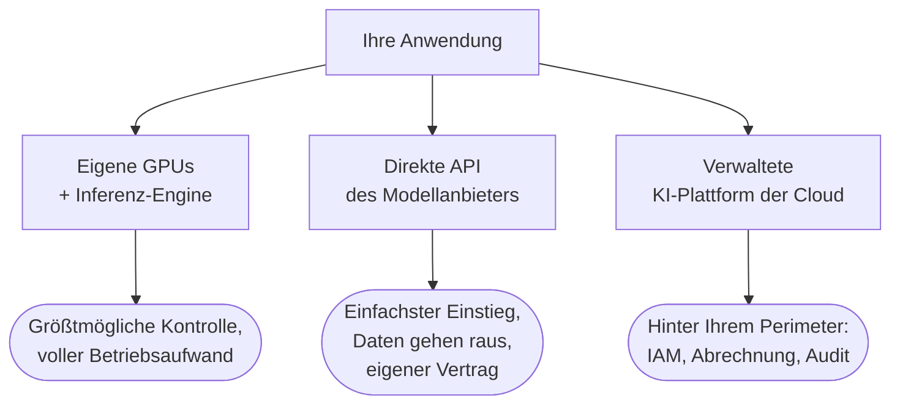

# Wo Ihre Token entstehen

Am Ende von [Bereitstellung und Betrieb](../serving/index.md) stand eine Weggabelung. Die Anwendungsschicht –
Zugriffssteuerung, die RAG-Pipeline, Guardrails, Streaming – gehört Ihnen in jedem Fall; offen blieb das zweite
Kästchen im Diagramm: Betreiben Sie das Modell auf eigenen GPUs, oder mieten Sie es? Diese Lektion behandelt das
Mieten gründlich – denn beim Mieten kommt gleich die nächste Weggabelung.

Es gibt drei Wege, an Token aus einem Modell zu kommen, und sie liegen auf **einer Achse zwischen Kontrolle und
Bequemlichkeit**. An einem Ende steht der **Eigenbetrieb** – eine Inferenz-Engine (*inference server*) auf Ihren
eigenen GPUs, wie sie die vorige Lektion behandelt hat: größtmögliche Kontrolle und der volle Betriebsaufwand,
der dazugehört. Am anderen Ende steht die direkte API des Modellanbieters – die von OpenAI, von Anthropic, von
Google: die einfachste Anbindung, die es gibt, aber Ihre Daten wandern zum Anbieter, und die Geschäftsbeziehung
regelt ein eigener Vertrag unmittelbar zwischen Ihnen und dem Anbieter, den Ihre Rechtsabteilung nun aushandelt
und danach im Blick behält. Dazwischen liegt das, worum es hier geht: die **verwaltete KI-Plattform** Ihrer
Cloud, auf der Modelle als **verwaltete Endpunkte** in der Cloud laufen, die Sie ohnehin schon nutzen.

:::tip[▶ Video]

<YouTube id="XtT5i0ZeHHE" title="AI Inference: The Secret to AI's Superpowers — IBM Technology" />

Eine klare Darstellung dessen, was Inferenz – das, was jede Plattform auf dieser Seite verkauft – tatsächlich
ist und warum es eine eigene Disziplin ist, sie in großem Maßstab bereitzustellen. (Das Video ist auf Englisch.)

:::

## Das Produkt der Plattform ist der Perimeter

Was bringt die Plattform, das der direkte Aufruf beim Anbieter nicht bringt? Das Modell selbst besteht oft aus
denselben Gewichten, die Sie über die API des Anbieters erreichen würden. **Was Sie kaufen, ist das Modell
hinter dem Perimeter Ihrer Cloud:**

- **Einheitliche Zugriffssteuerung.** Dieselben IAM-Rollen, die schon Ihre Buckets und Datenbanken schützen,
  schützen jetzt auch das Modell; ein zweiter, eigenständiger Bestand an API-Schlüsseln entfällt.
- **Einheitliche Abrechnung.** Die Token erscheinen auf derselben Cloud-Rechnung wie VMs und Datenbanken, und
  die Rabatte aus dem Rahmenvertrag greifen.
- **Netztrennung.** Private Endpunkte: Der Verkehr zum Modell läuft nie über das öffentliche Internet.
- **Compliance.** Die Zertifizierungen der Cloud erstrecken sich auf die Plattform: SOC 2, HIPAA-fähige Dienste,
  Werkzeuge für die Anforderungen der GDPR (DSGVO).
- **Audit-Logs und Kontingente.** Je Projekt und Team: Sie sehen, wer wie viel verbraucht hat, und Sie können
  jedem eine eigene Obergrenze setzen.

Nichts davon ändert, was das Modell sagt. Alles zusammen entscheidet, ob Ihr Unternehmen dem Modell überhaupt
etwas sagen darf.

## Die drei Plattformen – und eine Lehre über Namen

Mitte 2026 sehen die drei großen Plattformen so aus.
**[Azure OpenAI](https://azure.microsoft.com/en-us/products/ai-services/openai-service)** ist das Angebot von
Microsoft und historisch der Weg, OpenAI-Modelle als hauseigenen Azure-Dienst zu beziehen; die Plattform darum
herum wurde auf der Ignite im November 2025 von Azure AI Foundry in Microsoft Foundry umbenannt, und die Modelle
darin werden inzwischen als „Foundry Models“ angeboten, aufgeteilt in „Models sold by Azure“ und Einträge aus
dem Marktplatz. **[AWS Bedrock](https://aws.amazon.com/bedrock/)** ist das von Amazon – der einzige der drei
Namen, der unverändert geblieben ist. **[Vertex AI](https://cloud.google.com/vertex-ai)** ist das von Google
Cloud und wird, während diese Seite entsteht, gerade umbenannt: in die Gemini Enterprise Agent Platform,
angekündigt im April 2026. Die Umstellung der Konsole war im Mai 2026 abgeschlossen, die API-Endpunkte sind
geblieben, wo sie waren, und die Dokumentation führt tatsächlich beide Namen nebeneinander.

Lesen Sie den Absatz noch einmal und achten Sie darauf, was er eigentlich sagt: **Zwei der drei Plattformen
wurden binnen etwa eines Jahres umbenannt.** Produktnamen und Paketzuschnitte ändern sich in diesem Markt
ständig. Was die Umbenennungen überlebt, sind **die Fähigkeiten**: der Modellkatalog, die Zusagen zu Datenschutz
und Speicherort, das verwaltete RAG-Angebot, die Guardrails der Plattform, Durchsatz und Preismodell. Der Rest
dieser Lektion ist nach diesen Kategorien gegliedert, und das mit Absicht: Lernen Sie, welche Fähigkeiten eine
Plattform überhaupt haben kann, und behandeln Sie jeden Produktnamen – auch jeden auf dieser Seite – als
Momentaufnahme. Die Lektion [MCP und Agentenprotokolle](../../part-2-agents/mcp/index.md) ist bei den
Agentenprotokollen genauso vorgegangen, und das Argument gilt hier unverändert.

## Modellkataloge: wer wessen Modelle bereitstellt

Die erste Kategorie ist der **Modellkatalog** – welche Modelle Ihnen diese Plattform als verwaltete Endpunkte
bereitstellen kann.

Das Gründungsversprechen von Azure OpenAI war die Exklusivität: GPT-Modelle mit dem **Wrapper** von Azure, also
mit all dem, was die Cloud um das Modell herum mitliefert, und jahrelang war genau das der Grund, warum
Unternehmen dorthin gingen. Der Foundry-Katalog hat sich seither weit geöffnet – rund 1900 Modelle, und auf der
Ignite 2025 kam Anthropic hinzu, neben Microsoft, OpenAI, Mistral, xAI, Meta, DeepSeek und Hugging Face. Bedrock
war von Beginn an offen für mehrere Anbieter, und die alte Faustregel „kein OpenAI auf AWS“ ist inzwischen
schlicht falsch: OpenAIs gpt-oss-Modelle mit offenen Gewichten kamen im August 2025, und die GPT-Spitzenmodelle
sind auf Bedrock seit Juni 2026 allgemein verfügbar. Bei Google ist Gemini das eigene Ankermodell; die Modelle
von Drittanbietern und die mit offenen Gewichten stehen im **Model Garden** – ein Name, der die Umbenennung der
Plattform um ihn herum bemerkenswerterweise überstanden hat.

| Plattform | Eigenes Ankermodell | Breite des Katalogs |
|---|---|---|
| Microsoft Foundry (Azure OpenAI) | die GPT-Familie von OpenAI, angeboten als hauseigener Azure-Dienst | ~1900 Modelle: Microsoft, OpenAI, Anthropic, Mistral, xAI, Meta, DeepSeek, Hugging Face |
| AWS Bedrock | Amazons eigene Nova-Familie | vom ersten Tag an mehrere Anbieter: Anthropic, Meta, Mistral, Cohere und weitere – inzwischen auch OpenAI |
| Gemini Enterprise Agent Platform (Vertex AI) | Gemini | Model Garden: Modelle von Drittanbietern (darunter Claude) und Modelle mit offenen Gewichten |

Wichtiger als jede einzelne Zeile ist, was daraus folgt. **Früher entschied die Wahl des Modells über die Wahl
der Cloud:** Wer GPT brauchte, ging zu Azure, und mehr war dazu nicht zu sagen. Die Zeit der exklusiven Kataloge
geht zu Ende – OpenAIs Spitzenmodelle laufen auf Bedrock, Anthropic steht im Foundry-Katalog, und Claude ist
inzwischen auf allen drei Plattformen verfügbar. Je schwächer die Kopplung zwischen Modell und Cloud wird, desto
stärker entscheidet der Wrapper – die Zusagen zum Speicherort, das verwaltete RAG-Angebot, die
Wirtschaftlichkeit der Kapazität. Genau davon handelt der Rest dieser Lektion.

## Datenschutz und Data Residency

Alle drei Plattformen geben für ihre KI-Angebote für Unternehmen dieselbe Kernzusage: Ihre Prompts und Ausgaben
fließen nicht in das Training von Basismodellen (*foundation models*) ein und werden innerhalb der Dienstgrenze
verarbeitet. Das Kleingedruckte unterscheidet sich in Punkten, auf die es ankommt. Googles Zusage gilt
ausdrücklich nur „standardmäßig“. Bei Azure kommt die Missbrauchsüberwachung dazu: In der Standardkonfiguration
können Inhalte, die dabei auffallen, von Menschen gesichtet werden, sofern Ihre Organisation dem nicht
widersprochen hat. Lesen Sie die aktuelle Datenschutzseite der Plattform, auf der Sie Ihr System betreiben –
**hier ist der genaue Wortlaut das Produkt.**

**Data Residency** heißt: Der Anbieter sagt zu, wo die Inferenz stattfindet. Sie wählen die Region oder das
geografische Gebiet, in dem Ihre Anfragen verarbeitet werden – wobei durchweg gilt, dass die Verfügbarkeit der
Modelle je Region verschieden ist und die neuesten Modelle dort erst mit Verzögerung erscheinen. Jede Plattform
hat dafür **einen Regler zwischen Speicherort und Kapazität**, nur unter eigenen Namen: Azure hat
Bereitstellungstypen (Standard regional, Data Zone, Global), Bedrock hat Cross-Region Inference (geografische
Profile für US, EU oder APAC gegenüber globalen Profilen), und Vertex stellt regionale Endpunkte dem globalen
Endpunkt gegenüber – wobei global ausdrücklich heißt: keine Zusicherung zum Speicherort. Die Namen werden
wechseln; der Regler selbst bleibt – an einem Ende ein festgelegtes Gebiet mit knapperer Kapazität, am anderen
weltweit gebündelte Kapazität ohne jede Zusage zum Speicherort.

Für Unternehmen ist das keine abstrakte Frage. Regulierungsvorgaben – GDPR, Branchenregeln im Finanz- und
Gesundheitswesen – legen fest, wo personenbezogene und regulierte Daten verarbeitet werden dürfen. Der
Speicherort, die Zusage, die Daten nicht fürs Training zu verwenden, und die private Netzanbindung bilden
zusammen **die Compliance-Triade**; ohne sie stimmt die Rechtsabteilung nicht zu, und in der Praxis gibt diese
Triade oft den Ausschlag für eine Plattform und gegen die direkte API des Anbieters. Diese Weggabelung kennen
Sie schon: [Ingestion](../../part-1-rag/ingestion/index.md) hat für Embedding-Modelle dieselbe Frage gestellt:
**API oder Eigenbetrieb**. Es ist dieselbe Weggabelung, jetzt auf der Ebene des Modells selbst.

Das dritte Glied der Triade lässt sich in einem Satz konkret machen: Alle drei Plattformen unterstützen eine
private Anbindung, sodass Prompts nie über das öffentliche Internet laufen – Azure Private Link, AWS PrivateLink
mit VPC-Endpunkten und Google Private Service Connect.

## Verwaltetes RAG und die Guardrails der Plattform

Jede Plattform verkauft außerdem ein **verwaltetes RAG-Angebot** – die Pipeline aus Teil I (Ingestion → Chunking
→ Embedding → Vektordatenbank → Retrieval, manchmal Reranking) als fertiges Produkt verpackt. Bei AWS sind das
die klassischen Bedrock Knowledge Bases, seit Juni 2026 ergänzt um die vollständig verwaltete Amazon Bedrock
Managed Knowledge Base mit nativen Konnektoren und Anbindung an AgentCore. Bei Azure ist Azure AI Search das
Rückgrat des Retrievals, und Foundry IQ ist das aktuell gebündelte Angebot fürs Grounding; sein Vorgänger „On
Your Data“ wird im Oktober 2026 eingestellt. Bei Google deckt die RAG Engine die Pipeline ab, daneben steht das
Produkt für die Unternehmenssuche (Vertex AI Search, das gerade unter der Agent Platform neu etikettiert wird).
Wie überall auf dieser Seite gilt: erst die Fähigkeit, dann der Name in Klammern – und rechnen Sie damit, dass
der Name nicht lange hält.

Den Trade-off sollten Sie verinnerlichen. Verwaltetes RAG ist schnell zu haben: Die Pipeline steht nach wenigen
Tagen, und eigene Infrastruktur brauchen Sie dafür nicht. Dafür verlieren Sie den Zugriff auf **die
Stellschrauben aus Teil I.** Chunking-Strategie, Gewichtung der hybriden Suche, Wahl des Rerankers und die
Anknüpfungspunkte für die Evaluierung unterscheiden sich je Produkt und sind mitunter fest vorgegeben oder
undurchsichtig. Teams, die die Qualität über die Evaluierungsschleife aus
[Evaluierung](../../part-1-rag/cross-cutting/evaluation/index.md) nachjustieren müssen, wachsen oft aus dem
verwalteten Angebot heraus – oder behalten es nur für Ingestion und Speicherung und übernehmen das Retrieval
selbst. Ein vernünftiger Ausgangspunkt ist das verwaltete Angebot für Standardkorpora; selbst bauen Sie, sobald
die Evaluierung zeigt, dass die Voreinstellungen nicht genügen.

Die Guardrails sind auf dieselbe Weise zu Produkten geworden. Bedrock liefert Guardrails mit – konfigurierbare
Filter für schädliche Inhalte, PII und gesperrte Themen, dazu kontextbezogene Grounding-Prüfungen: Sie bewerten,
ob eine Antwort durch den abgerufenen Kontext gedeckt ist, und blockieren sie, sobald der Wert unter dem
Schwellenwert liegt. Azure liefert AI Content Safety, darunter Prompt Shields zur Erkennung von
Prompt-Injection, in Foundry sichtbar als „Guardrails + controls“ – und ja, Azure hat seine Filter für Inhalte
in „Guardrails“ umbenannt, ein weiterer Beleg für die Regel, dass Namen Momentaufnahmen sind. Google liefert
Model Armor. Alle drei bieten damit **als Managed Services** an, was die Lektion
[Guardrails](../../part-1-rag/cross-cutting/guardrails/index.md) beschreibt – und damit stellt sich die
Make-or-Buy-Frage, der sich [das Tooling-Ökosystem](../tooling-ecosystem/index.md) unmittelbar widmet.

## Durchsatz und Preismodelle

In diesem Abschnitt finden Sie keinen einzigen Preis, denn absolute Preise veralten schneller als die Namen der
Plattformen. Die **Preismodelle** dagegen sind stabil – anders als die Preise selbst –, und jede Plattform
bietet dieselben zwei Verbrauchsmodi. **On-Demand** heißt: Abrechnung je Token auf gemeinsam genutzter
Kapazität, begrenzt durch Rate Limits und Kontingente. Mit **reservierter Kapazität** kaufen Sie dedizierten
Durchsatz mit planbarer Latenz für gleichbleibend hohe Last – allgemein **bereitgestellter Durchsatz**
(*provisioned throughput*); bei den einzelnen Anbietern: PTU (*provisioned throughput units*) bei Azure,
Provisioned Throughput bei Vertex und bei Bedrock der Tarif `Reserved`, nachdem Bedrock seine Preise im November
2025 in die Stufen `Reserved`, `Priority`, `Standard` und `Flex` neu geordnet hat (der alte Name „Provisioned
Throughput“ lebt für ältere und angepasste Modelle weiter).

Es gibt einen dritten Tarif, den Sie kennen sollten: den **Batch-Tarif** (*batch tier*). Alle drei Plattformen
dokumentieren, dass sie asynchron und vergünstigt verarbeiten, wenn niemand auf die Antwort wartet: Für die
unterstützten Modelle kostet das rund den halben On-Demand-Preis (Azure Batch, Bedrock batch inference, Vertex
batch predictions). Braucht eine Arbeitslast keine Antwort im Sekundenbereich – nächtliche Dokumentverarbeitung,
Klassifikation in großen Mengen, Evaluierungsdurchläufe abseits des Betriebs –, dann bekommen Sie Ihre Token im
**Batch-Tarif** so günstig wie nirgends sonst bei dieser Plattform. Verwechseln Sie ihn nicht mit dem
**Continuous Batching** aus [Bereitstellung und Betrieb](../serving/index.md): Das Continuous Batching liegt im
GPU-Scheduler der Inferenz-Engine; der Batch-Tarif dagegen betrifft allein die Abrechnung der API.

Am Ende steht eine Konstante des Betriebs: Kontingente gelten je Region und je Modell, und jeder Entwurf für den
Produktivbetrieb muss 429er einplanen – auf jeder der drei Plattformen. Genau darum geht es bei den
Wiederholungsversuchen und den Ratenobergrenzen aus [Bereitstellung und Betrieb](../serving/index.md); und mit
demselben Problem beginnt [LLMOps](../llmops/index.md), wo Routing und Fallbacks auffangen, was ein einzelner
Endpunkt nicht zusichern kann.

## So wählen Sie aus

Sehen Sie sich zuerst an, wie die Entscheidung tatsächlich fällt. In der Praxis entscheidet meist die bestehende
Bindung an eine Cloud – dort, wo Ihre Daten, Ihr IAM und Ihr Rahmenvertrag ohnehin schon liegen – und nicht der
Benchmark eines Modells. Das ist weniger gedankenlos, als es klingt: Der Wrapper ist das Produkt, und er ist
dort am meisten wert, wo Ihre Infrastruktur ohnehin steht. Danach bleiben vier Unterschiede, die den Vergleich
wirklich lohnen: Liefert die Plattform die Modelle, die Sie brauchen, in Ihrer Region? Reichen ihre Zusagen zu
Speicherort und Compliance für das, was Ihre Aufsichtsbehörde verlangt? Passt das verwaltete RAG-Angebot, oder
betreiben Sie die Pipeline selbst? Und wie rechnet sich die reservierte Kapazität bei Ihrer Last?

Wie die Entscheidung auch ausfällt, bauen Sie eine architektonische Absicherung ein: **Halten Sie die
Anwendungsschicht anbieterunabhängig.** OpenAI-kompatible Clients und eine Gateway- oder Router-Schicht – das
Muster, das [LLMOps](../llmops/index.md) am Beispiel von [LiteLLM](https://www.litellm.ai) und ähnlichen
Werkzeugen zeigt – halten die Möglichkeit offen, zu wechseln. Achten Sie darauf, wo **Vendor-Lock-in**
tatsächlich sitzt: Die Endpunkte werden zunehmend austauschbar, während die SDKs der Plattform und die
verwalteten Angebote das sind, woran Sie hängen bleiben. Gebunden werden Sie nicht an den Endpunkt, sondern an
alles, was rundherum mitgeliefert wird.

## Das Wichtigste

- Drei Wege, ein Modell zu nutzen: selbst auf eigenen GPUs betreiben, die API des Modellanbieters direkt
  aufrufen oder die verwaltete KI-Plattform Ihrer Cloud nehmen – drei Punkte auf einer Achse zwischen Kontrolle
  und Bequemlichkeit.
- Das Produkt der Plattform ist das Modell hinter dem bestehenden Perimeter Ihrer Cloud: IAM, Abrechnung,
  private Netzanbindung, die Compliance der Cloud, Audit-Logs, Kontingente.
- Namen sind Momentaufnahmen – zwei der drei Plattformen wurden binnen etwa eines Jahres umbenannt. Von Dauer
  sind die Fähigkeiten: Katalog, Datenschutz und Speicherort, verwaltetes RAG, Guardrails, Preismodell.
- Die Kataloge unterscheiden sich, nähern sich aber an: Claude auf allen dreien, OpenAI-Modelle auf Bedrock. Je
  mehr die Exklusivität schwindet, desto stärker wird der Wrapper zum Unterscheidungsmerkmal.
- Die Compliance-Triade – Data Residency, die Zusagen, die Daten nicht fürs Training zu verwenden, und die
  private Netzanbindung – ist das, woran die Zustimmung der Rechtsabteilung hängt, und sie gibt oft den
  Ausschlag für die Plattform statt für die direkte API.
- Verwaltetes RAG ist schnell zu haben, und Sie verlieren dafür den Zugriff auf die Stellschrauben aus Teil I:
  eine gute Wahl für Standardkorpora, und ein Angebot, aus dem Sie herauswachsen, sobald die Evaluierung zeigt,
  dass die Voreinstellungen nicht genügen.
- Lernen Sie die Preismodelle, nicht die Preise: On-Demand je Token, bereitgestellter Durchsatz für
  gleichbleibende Last, Batch zu rund dem halben Preis für asynchrone Arbeit. Kontingente gelten je Region und
  je Modell; planen Sie 429er von vornherein ein.
- Wählen Sie nach der Bindung an eine Cloud und danach nach den vier echten Unterschieden: die Modelle in Ihrer
  Region, die Zusagen, die Ihre Aufsichtsbehörde verlangt, das verwaltete RAG-Angebot und die Wirtschaftlichkeit
  der Kapazität.
- Halten Sie die Anwendungsschicht anbieterunabhängig – gebunden werden Sie nicht an den Endpunkt, sondern an
  alles, was rundherum mitgeliefert wird.

**[Neue Begriffe](../../glossary.md#cloud-platforms)**: managed endpoint, model catalogue, data residency,
provisioned throughput, batch mode, managed RAG, vendor lock-in.

---

:::note[Als Nächstes: Teil 2 der Lektion]

**[Kosten, Agenten und Souveränität](./deep-dive.md)** – der zweite, vertiefende Durchgang über dieselben
Plattformen: die Angebote zum Fine-Tuning und ihr richtiger Platz, die verwalteten Agenten-Laufzeitumgebungen
(Bedrock AgentCore, Foundry Agent Service, Vertex Agent Engine), die Kostenmodellierung der Plattformen und
FinOps (der Aufbau der Preise je Plattform, Rabatte bei fester Abnahmezusage, Egress zwischen Regionen),
Gateway-Muster über mehrere Clouds hinweg und die Angebote für souveräne Clouds.

Siehe auch, in Teil III: [Bereitstellung und Betrieb](../serving/index.md) für die Weggabelung zwischen Mieten
und Eigenbetrieb, die diese Lektion beantwortet; [LLMOps](../llmops/index.md) für die Steuerung der Ausgaben auf
Organisationsebene und das Routing über Modelle hinweg; und
[das Tooling-Ökosystem](../tooling-ecosystem/index.md) für die Make-or-Buy-Entscheidungen rund um die Plattform.
Die [Vertiefung](../serving/deep-dive.md) zur Bereitstellung behandelt Serverless GPU und die Wirtschaftlichkeit
dauerhaft bereitstehender Instanzen im Vergleich zu Scale-to-Zero, aus der Sicht des Eigenbetriebs.

:::
