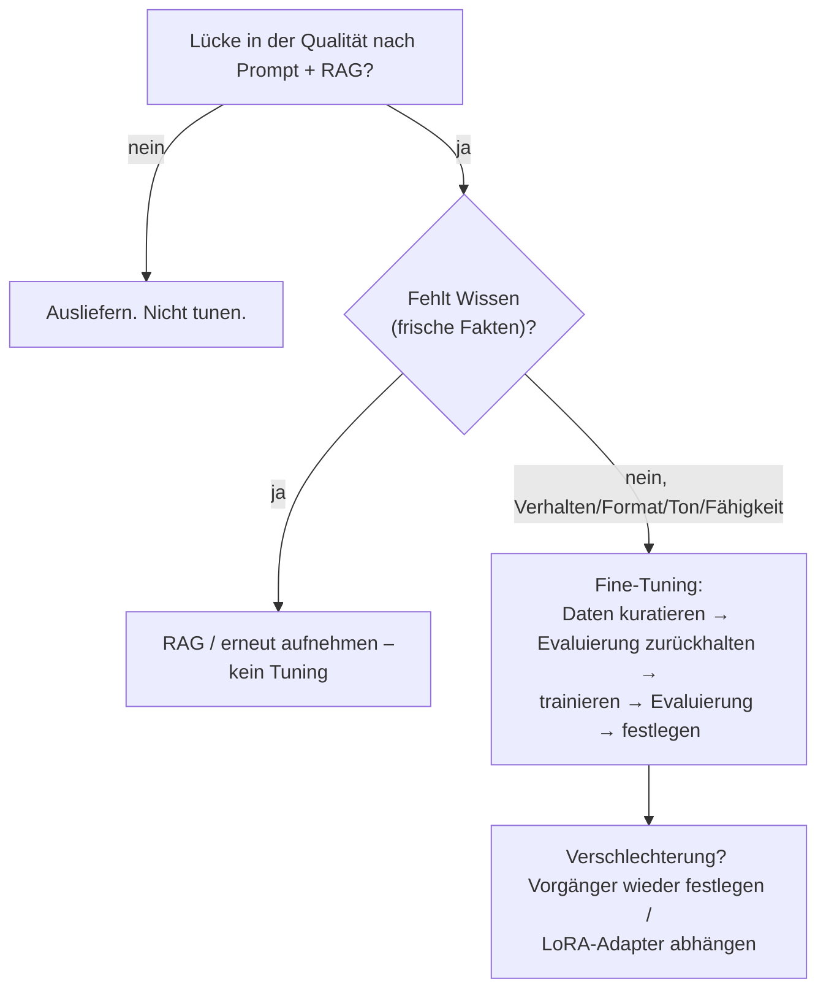
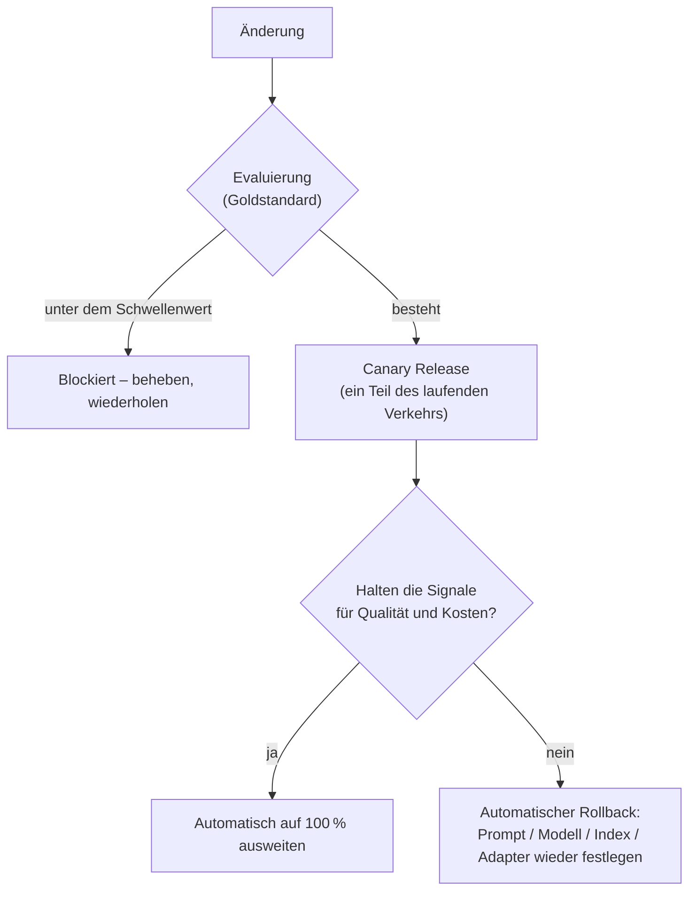
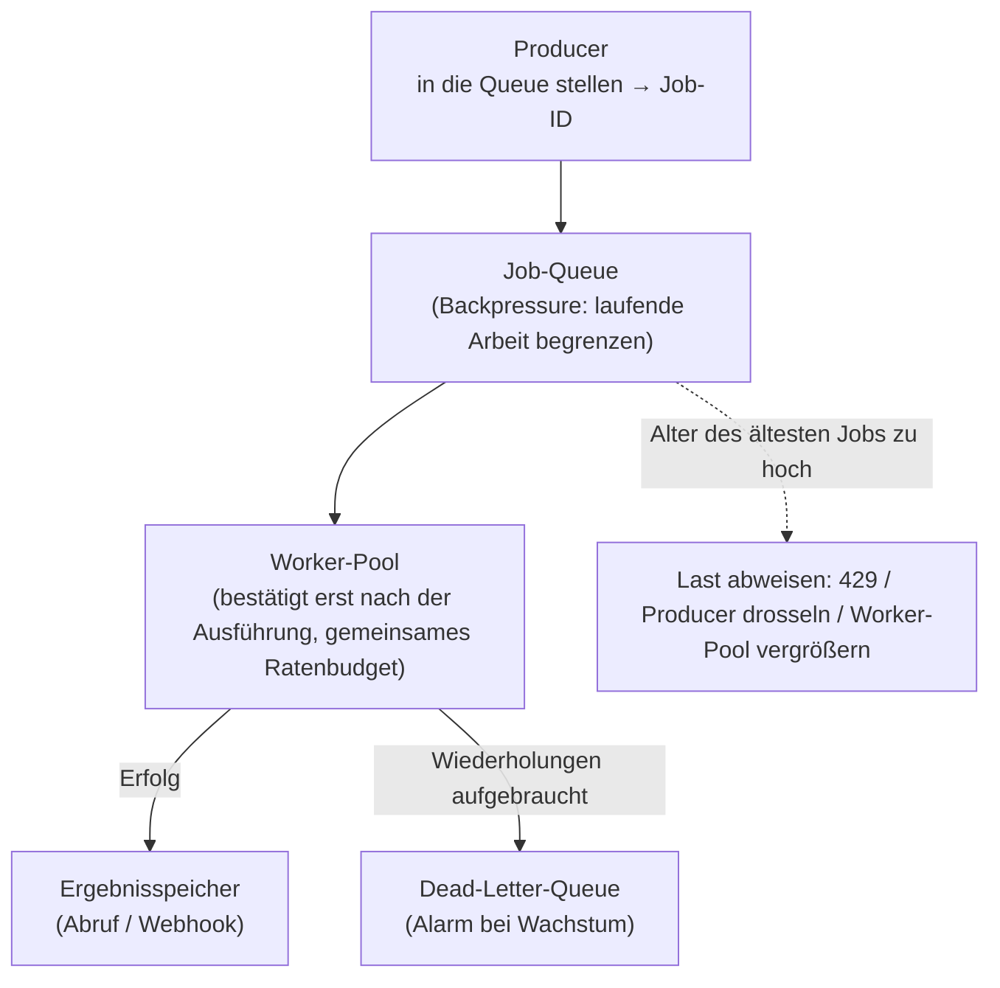

# Das System betreiben, wenn eine ganze Organisation daran hängt – Fine-Tuning, Kosten und die Arbeit, die warten kann

[Teil 1 der Lektion](./index.md) hat die Schleife des Betriebs beschrieben: Das auslieferbare Artefakt ist ein Prompt plus ein Modell plus ein Index plus eine Konfiguration plus die Guardrails, die Evaluierung in der CI ist die Prüfung, die jede Änderung durchlaufen muss, die Überwachung achtet auf den Drift, und für die Kosten gibt es einen eigenen Satz Hebel. Teil 1 hat außerdem die Muster für das Release benannt – Canary Release, Shadow Deployment, A/B-Test – und die Maschinerie darum herum: das Routing über Modelle hinweg, das LLM-Gateway, das Prompt-Caching und das semantische Caching, das Einsparen von Tokens und den Batch-Tarif. Dies ist der zweite, ausführliche Durchgang. Teil 1 wird durchgehend vorausgesetzt und hier nirgends noch einmal erklärt; was folgt, ist dieselbe Aufgabe noch einmal, jetzt aus der Perspektive einer Organisation, die den Betrieb verantwortet, und nicht aus der Sicht einer einzelnen Entwicklerin, die einen Prompt ändert.

Drei Themen dieser Seite überschneiden sich mit Vertiefungen, die die Theorie dahinter schon behandeln; sie sind deshalb verlinkt und werden hier nicht neu hergeleitet. Die Mechanik der Zuverlässigkeit aus der SRE-Schule – wie Sie SLIs wählen, ein SLO über einen Zeitraum setzen, das Fehlerbudget als Abstand zu den vollen 100 % berechnen, Alerts auf die Burn Rate setzen, darauf bestehen, dass mindestens ein SLI die Qualität misst, und zur Laufzeit je Anfrage weiche und harte Obergrenzen durchsetzen – steht in der [Vertiefung zur Observability](../../part-1-rag/cross-cutting/observability/deep-dive.md). Dort steht auch die andere Hälfte einer Regression: eine statistisch belastbare Verschlechterung der Qualität überhaupt zu *erkennen* und sie über die Spans eines Traces der Stufe *zuzuordnen*, die sie verursacht hat, um die auffälligen Traces danach in den Goldstandard zu überführen. Und die Mechanik der Preise je Plattform – die Rabatte für eine zugesagte Nutzung, die Faktoren des Prompt-Cache, die Gestalt des Batch-Rabatts, der Egress zwischen Regionen – steht in der [Vertiefung zu den Cloud-KI-Plattformen](../cloud-platforms/deep-dive.md). Was diese Seite von Anfang bis Ende selbst behandelt, ist der Rest: der Betrieb des Fine-Tunings, die Governance der Ausgaben auf Ebene der Organisation, welche Rolle Freigabe und Rollback bei einer erkannten Regression spielen, Fehlerbudgets als schriftlich vereinbarter Prozess der Organisation und die Infrastruktur der Queues, die Arbeitslasten im Batch trägt.

## Wann Sie die Gewichte ändern

:::tip[▶ Video]

<YouTube id="zYGDpG-pTho" title="RAG vs Fine-Tuning vs Prompt Engineering: Optimizing AI Models — IBM Technology" />

Die dreifache Entscheidung, die dieser Abschnitt in eine Regel bringt, einmal ganz durchgesprochen – sehenswert, bevor Sie zu einem Tuning greifen. (Das Video ist auf Englisch.)

:::

Das Fine-Tuning ändert die Gewichte des Modells. Prompting und RAG ändern, was Sie unveränderten Gewichten vorlegen, und dieser Unterschied gibt die Reihenfolge vor, in der Sie zu ihnen greifen: erst der Prompt, dann RAG, das Fine-Tuning zuletzt. Die ersten beiden sind günstiger, sie lassen sich mit einem einzigen Commit zurücknehmen, und keines von beiden hinterlässt Ihnen ein Modellartefakt, das Sie von nun an pflegen müssen. Ein Tuning ist also das letzte Mittel; Sie kommen erst dann dazu, wenn Prompt und RAG an ihre Kapazitätsgrenze gestoßen sind *und* die Lücke eine ist, die ein Tuning tatsächlich schließt – ein Verhalten, ein Format oder ein Stil, den das Modell nicht verlässlich hält; der Ton oder die Ausdrucksweise einer Domäne; ein Ziel für Latenz oder Kosten, das ein kleines angepasstes Modell erreicht und ein großes allgemeines nicht; oder eine Fähigkeit, die kein Prompt hervorbringt. Wofür ein Tuning *nicht* da ist, ist aktuelles Wissen. Die Fakten eines angepassten Modells sind zum Zeitpunkt des Trainings eingefroren und veralten genauso wie ein Korpus, den niemand nachführt; das Wissen aktuell zu halten ist die Aufgabe des Retrievers, und keine Menge an Tuning ersetzt eine erneute Aufnahme.

Die Verfahren bilden eine Familie, und es hilft, sie vom leichtesten zum schwersten im Kopf zu behalten:

- **SFT** – Supervised Fine-Tuning, trainiert auf gelabelten Paaren aus Eingabe und Ausgabe. Das voreingestellte Verfahren und das, was die meisten Teams meinen, wenn sie „Fine-Tuning“ sagen.
- **DPO** – Direct Preference Optimisation, das aus Paaren einer bevorzugten und einer abgelehnten Antwort lernt. Es richtet Ton und Format aus, ohne dass Sie ein eigenes Belohnungsmodell aufstellen müssen.
- **RFT** – Reinforcement Fine-Tuning, bei dem das Belohnungssignal von einem **Bewerter** kommt, den Sie selbst festlegen. Zu jedem Prompt erzeugt die Plattform mehrere Antwortkandidaten, der Bewerter bepunktet sie, und darauf folgt eine Aktualisierung per Policy-Gradient – erzeugen, bewerten, aktualisieren – so lange wiederholt, bis das Modell tut, was Ihr Bewerter belohnt. Es passt zu Aufgaben mit überprüfbarer Antwort, also zu denen, bei denen ein Bewerter die Richtigkeit wirklich bepunkten kann. Mitte 2026 (Juli 2026) bietet OpenAI RFT auf seinem Reasoning-Modell o4-mini an und SFT auf kleinen Modellen wie GPT-4.1 nano; Amazon Bedrock hat RFT über OpenAI-kompatible APIs für das Fine-Tuning auch für Modelle mit offenen Gewichten geöffnet – OpenAIs GPT-OSS, Qwen (Februar 2026). Diese Produkt- und Modellnamen sind eine datierte Momentaufnahme; schlagen Sie in der Dokumentation des Anbieters nach, bevor Sie sich auf eines davon verlassen.
- **LoRA / PEFT** – Low-Rank Adaptation, eines der parametereffizienten Verfahren für das Fine-Tuning. Statt jeden Parameter zu aktualisieren, trainiert es einen kleinen **LoRA-Adapter** über eingefrorenen Basisgewichten: günstig zu trainieren, günstig zu speichern und – der Gewinn für den Betrieb – austauschbar und stapelbar, ohne dass das Basismodell überhaupt angefasst wird.

Die Vertiefung zu den Cloud-KI-Plattformen benennt diese Verfahren schon aus Sicht der Plattform und rechnet aus, was ein eigenes Modell im Betrieb kostet; diese Rechnung wird hier nicht wiederholt.

Welches Verfahren Sie auch wählen, das Ergebnis ist ein weiteres auslieferbares Artefakt in derselben Schleife wie ein Prompt oder ein Index, und es hat denselben Lebenszyklus. Dieser Lebenszyklus fängt bei den Daten an, denn die Güte eines Tunings ist die Güte seines Datensatzes: dedupliziert, repräsentativ, richtig gelabelt. Sie halten einen Datensatz für die Evaluierung zurück, den das Training nie sieht, Sie trainieren, und dann läuft das angepasste Modell durch genau dieselbe Prüfung wie jedes andere Deployment – die Evaluierung in der CI aus Teil 1 –, bevor es einen einzigen Nutzer bedient. Es kann sich verschlechtern wie alles andere. Ein Tuning kann überanpassen, also auf seiner Trainingsverteilung glänzen und überall sonst schlechter werden, oder es kann vergessen und eine allgemeine Fähigkeit verlieren, die es vorher hatte. Beides zeigt nur der Goldstandard.

Der Rollback folgt daraus, dass das Tuning ein festgelegtes Artefakt ist – das Model-Pinning aus Teil 1 gilt für *Ihre* angepassten Versionen genauso wie für die eines Anbieters. Sie halten die vorige Version bereit, und verschlechtert sich das neue Tuning, schalten Sie auf sie zurück; das ist dieselbe Disziplin wie das Zurücknehmen eines Prompts, nur eine Ebene höher. LoRA macht den Rollback fast kostenlos: Adapter abhängen, und das Verhalten ist zurück, ohne dass Gewichte neu ausgerollt werden. Der Fehler, den Sie vermeiden müssen: ein Tuning auszuliefern, für das kein festgelegter Vorgänger bereitsteht, auf den Sie zurückfallen können.

Die meisten Teams, die RAG und Agenten bauen, brauchen von all dem nie etwas, und das ist die ehrliche Kernaussage. Ein Tuning ist eine dauerhafte Verpflichtung: Sie trainieren neu, sobald das Basismodell im Lebenszyklus des Anbieters aus Teil 1 außer Betrieb geht, Sie trainieren neu, sobald die Domäne driftet, die Daten für die Evaluierung gehören für immer Ihnen, und Sie binden sich enger an den Anbieter, weil sich ein angepasstes Modell nicht zu einem anderen Anbieter mitnehmen lässt. Genügen Prompt und RAG, dann ist das die Antwort. Tunen Sie, wenn die Lücke im Verhalten echt und stabil ist – niemals, um Wissen einzuspeisen, das ein Retriever frisch liefern kann.

Zwei Kriterien entscheiden diese Frage in einer echten Organisation, noch bevor es überhaupt um Wissen gegen Verhalten geht. Dieses Handbuch lehrt beide an anderer Stelle, dort aber in einer Rolle, die verdeckt, was sie hier entscheiden.

Berechtigungen je Person leben in einem Filter des Retrievals, und in eingefrorenen Gewichten können sie nicht leben. Die [Vertiefung zum Retrieval](../../part-1-rag/retrieval/deep-dive.md) lehrt die Zugriffssteuerung als Mechanik des Retrievals – vor der Suche filtern, nie danach –, sodass sie sich wie eine Einzelheit daran liest, wie eine Abfrage abläuft. Ihre größere Folge ist architektonisch: Ein Filter kann für jede anfragende Person ein anderer sein, ein Gewicht nicht. Was ein angepasstes Modell gelernt hat, bekommt jeder, der es aufruft. In einer Organisation mit abgestuftem Zugang zum eigenen Wissen entscheidet dieses Kriterium die Architektur also von allein, bevor irgendein Kostenmodell gerechnet wird. Anpassbar sind Verhalten und Format; das Wissen bleibt hinter einem Filter, denn ein Filter ist der einzige Ort, an dem sich eine Berechtigung anwenden lässt.

Die Größe des Korpus gegen das Kontextfenster ist der Zweig, den der Baum oben nicht zeichnet. Die [Vertiefung zur Generation](../../part-1-rag/generation/deep-dive.md) behandelt den langen Kontext sorgfältig, aber als Frage des *Zusammenstellens* innerhalb von RAG – Lost-in-the-Middle, und der wirksame Kontext ist nicht die Größe des Kontextfensters. Umgedreht ist es eine vorgelagerte Frage: Passt das ganze Korpus hinein und bleibt es klein, gibt es keine Retrieval-Schicht zu bauen und kein Tuning zu rechtfertigen, und jede Maschinerie, die Sie hinzufügen, hat keine Aufgabe. Der Vorbehalt ist der, den jene Vertiefung bereits aufstellt und den diese Seite nicht wiederholt – *hineinpassen heißt nicht beachtet werden* –, „es passt“ ist also der Anfang der Prüfung und nicht ihr Ende. Messen Sie die Qualität des Retrievals an Ihren eigenen Fragen, bevor Sie eine Retrieval-Schicht abschaffen.

Keines der beiden Kriterien ersetzt das Argument der Aktualität von oben; beide laufen davor. Die Aktualität sagt Ihnen, ob Fakten in Gewichten leben *können*. Diese zwei sagen Ihnen, ob sie es *dürfen* – und ob Sie die Maschinerie überhaupt brauchen.

## Die Kosten steuern

Die Hebel bei den Preisen der Plattformen – Rabatte für eine zugesagte Nutzung, die Faktoren des Prompt-Cache, der Batch-Tarif zu etwa der Hälfte, der Egress zwischen Regionen – sind das Thema der Vertiefung zu den Cloud-KI-Plattformen, und an jedem einzelnen davon zu ziehen ist eine technische Entscheidung. Die Governance liegt eine Ebene darüber. Ihre Aufgabe ist, die Kosten über Teams hinweg sichtbar, zugeordnet und begrenzt zu halten, damit an den Hebeln tatsächlich gezogen wird und kein einzelnes Team das Budget still aufbrauchen kann. Teil 1 hat die Budgets am Gateway verortet; hier steht die Organisation, die darum herum gebaut wird.

Das erste Hindernis ist die Zuordnung, und sie ist eine Besonderheit der Arbeit mit Sprachmodellen. FinOps in der Cloud versieht *Ressourcen* mit Tags – eine VM, eine Platte, einen Load-Balancer. Hinter einem Aufruf einer LLM-API steht kein solcher Gegenstand: Er ist eine Transaktion und kein Gegenstand; auf der Ebene der Infrastruktur gibt es also nichts, woran ein Tag hängen könnte. Die Zuordnung muss deshalb in der Anwendung selbst entstehen. Sie stempeln jedem Aufruf das Feature, das Team, den Mandanten, die Route und das Modell auf – dieselben Attribute eines Traces, die die Observability längst aufzeichnet, weshalb die Mechanik der Kostenzuordnung und die von OpenTelemetry der [Vertiefung zur Observability](../../part-1-rag/cross-cutting/observability/deep-dive.md) gehören – und tragen diese Metadaten in die Abrechnungsdaten weiter. Lassen Sie das weg, dann bleibt von der Monatsrechnung eine einzige nutzlose Zahl: Sie wissen, dass Sie das Geld ausgegeben haben, und nichts darüber, wofür.

Ist die Zuordnung erst da, kommen zwei Modelle der Verteilung dazu, und die FinOps Foundation zieht zwischen ihnen eine klare Linie. **Showback** berichtet jedem Team, jedem Feature oder jedem Produkt den eigenen Verbrauch, während die Kosten auf einem zentralen Budget bleiben – Sichtbarkeit ohne interne Verrechnung. **Chargeback** geht weiter und bucht die Kosten tatsächlich auf die Gewinn- und Verlustrechnung des verbrauchenden Teams oder Produkts, was mehr Verbindlichkeit bringt und dafür deutlich mehr Apparat verlangt. Die Reihenfolge ist entscheidend: Showback ist das Fundament, auf das nicht zu verzichten ist und das immer verlangt wird, und zu Chargeback gehen Sie erst über, *wenn die Zuordnung belastbar ist* – denn Chargeback auf Zahlen, die niemand glaubt, erzeugt Streit schneller, als es Einsparungen bringt.

Der Druck, überhaupt etwas davon zu tun, ist inzwischen keine Frage der Wahl mehr. Der State of FinOps 2026 der FinOps Foundation berichtet, dass 98 % der Befragten die Kosten für KI heute steuern, gegenüber 31 % zwei Jahre zuvor, und benennt die feingliedrige Überwachung dieser Kosten – Tokens, Anfragen an das LLM, Auslastung der GPUs – als die am häufigsten gewünschte Fähigkeit eines Werkzeugs in diesem Jahr. (Der Befund derselben Stelle, dass zwischen einer nicht optimierten und einer optimierten KI-Bereitstellung eine Kostenspanne von 30× bis 200× liegt, ist in der Vertiefung zu den Cloud-KI-Plattformen zitiert; er ist der Grund, warum es die Hebel gibt.)

Drei Steuerungen auf Ebene der Organisation setzen die Grenzen, und alle drei sitzen dort, wo jede Anfrage ohnehin vorbeikommt – am LLM-Gateway aus Teil 1. Die erste Steuerung besteht aus Budgets mit Alarmen: Token-Budgets je Team und je Feature, mit einer weichen Obergrenze, die warnt, und einer harten, die abweist oder herunterstuft. Wie diese Obergrenzen zur Laufzeit durchgesetzt werden, ist Thema der Vertiefung zur Observability; wer welches Budget bekommt, wird hier entschieden. Die zweite ist das Routing zwischen günstigen und teuren Modellen, von der Taktik zur Regel erhoben – das Routing über Modelle hinweg aus Teil 1, in Governance übersetzt, sodass ein günstiges Modell die Voreinstellung für anspruchslosen Verkehr ist und das Spitzenmodell ausdrücklich angefordert und begründet werden muss. Das ist der Hebel, der die Rechnung am stärksten bewegt. Die dritte gehört in die Checkliste für das Deployment: Weil eine Änderung am Prompt eine Änderung der Kosten ist, prüft die Freigabe aus dem nächsten Abschnitt die erwarteten Kosten pro Anfrage und nicht allein die Qualität.

Jede dieser Steuerungen versagt auf eine vorhersehbare Weise, wenn sie fehlt. Wird per Chargeback abgerechnet, bevor die Zuordnung belastbar ist, führt das zu Streit und zu Spielchen. Ein Budget mit nur weichen Obergrenzen erzeugt Alarme, auf die niemand reagiert, während die Rechnung trotzdem kommt. Und ohne einen voreingestellten Weg zum günstigen Modell zahlt jede Anfrage aus reiner Trägheit den Preis des Spitzenmodells.

## Die Freigabe vor dem Release und der Weg zurück

Eine Regression zu *erkennen* – eine statistisch belastbare Verschlechterung der Qualität von einem schlechten Nachmittag zu unterscheiden – und sie über die Spans eines Traces einer Stufe *zuzuordnen*, um die auffälligen Traces danach zu neuen Fällen im Goldstandard zu machen, ist Thema der Vertiefung zur Observability. Dieser Abschnitt behandelt die andere Hälfte: wie das Release mit einer Regression *umgeht*, sobald sie erkannt ist. Entweder es blockiert sie, oder es nimmt sie zurück.

Blockieren ist der günstigere der beiden Wege, und es ist die Evaluierung in der CI aus Teil 1, jetzt vom Release aus betrachtet. Eine Änderung, deren Metriken auf dem Goldstandard unter den Schwellenwert fallen, ist eine Regression, die abgefangen wurde, bevor sie ausgeliefert wird; Merge oder Deployment werden angehalten – an der günstigsten Stelle im ganzen System, lange bevor irgendein Nutzer ihr begegnet. Das ist die **Freigabe vor dem Release**: die Prüfung der Qualität, die zwischen einer Änderung und dem Produktivbetrieb steht.

Diese Prüfung fängt allerdings nur ab, was der Goldstandard abdeckt, und den Rest findet der Verkehr aus dem Produktivbetrieb – weshalb das Release nicht von null auf hundert Prozent umschaltet. Es wird schrittweise ausgerollt. Das Canary Release aus Teil 1 lenkt einen Teil des laufenden Verkehrs auf die neue Version, während eine Steuerung im Hintergrund die indirekten Signale für die Qualität und die Kosten neben Fehlern und Latenz beobachtet. Ab da geschieht zweierlei automatisch: Halten die Metriken, wird die Änderung automatisch auf den vollen Verkehr ausgeweitet; unterschreitet eines der Signale seinen Schwellenwert, geht es automatisch auf die vorige Version zurück. Und der ganze Grund, auf die Qualität zu schauen und nicht bloß auf ein `200 OK`, ist genau jenes Canary Release – schnell, günstig und ein wenig falsch: Es *muss* den Rollback auslösen, und dafür sorgt nur ein Signal über die Qualität.

Für Code ist der Rollback trivial und für jedes der fünf Artefakte ein wenig anders, weshalb für jedes im Voraus ein eigener Weg festliegen muss. Einen Prompt nehmen Sie zurück, indem Sie den Commit rückgängig machen oder über die Prompt-Registry aus Teil 1 wieder die vorige Version festlegen. Ein Modell nehmen Sie zurück, indem Sie die vorige Version wieder festlegen; ein angepasstes Modell, indem Sie seinen Vorgänger wieder festlegen oder den LoRA-Adapter abhängen, wie im ersten Abschnitt beschrieben. Eine Konfiguration oder eine Richtlinie der Guardrails nehmen Sie zurück, indem Sie den alten Wert wieder eintragen. Der Index ist die Falle: Ihn nehmen Sie nur zurück, indem Sie den vorherigen Snapshot wiederherstellen, und eine erneute Aufnahme, die an derselben Stelle überschreibt, hat keinen Snapshot, den man wiederherstellen könnte – und damit überhaupt keinen Weg zurück. Der Index muss versioniert sein, ein benannter Snapshot, den Sie wieder festlegen können, genau damit eine schlechte erneute Aufnahme so umkehrbar ist wie jedes andere Artefakt. Ein Korpus ist auch ein Release, und ein Release, das Sie nicht umkehren können, ist eine Last.

Es gibt eine Steuerung des Release, die stärker ist als alles, was sich je Änderung anwenden lässt: dass die Organisation entscheidet, *jetzt* finde überhaupt kein Release statt. Das ist der Stopp aller Releases, und was ihn regelt, ist die Richtlinie zum Fehlerbudget – das Thema des nächsten Abschnitts.

## Fehlerbudgets als Vereinbarung in der Organisation

Die Mechanik – SLIs wählen, ein SLO über einen Zeitraum setzen, das Fehlerbudget als Abstand zu den vollen 100 % berechnen, auf die Burn Rate alarmieren und die Regel, dass mindestens ein SLI ein Qualitäts-SLI aus der Online-Evaluierung sein muss – gehört ganz der Vertiefung zur Observability. Dieser Abschnitt behandelt, was aus diesen Zahlen eine Entscheidung macht, an die eine Organisation gebunden ist: die **Richtlinie zum Fehlerbudget**.

Eine Richtlinie zum Fehlerbudget ist eine schriftliche Vereinbarung, unterschrieben vor jedem Vorfall, die festhält, was geschieht, wenn das Budget aufgebraucht ist, und wer es tut. Die kanonische Fassung aus der Google-SRE-Schule liest sich als Regel mit zwei Fällen. Auf oder über dem SLO laufen Releases nach der gewöhnlichen Regel weiter. Ist das Budget über den zurückliegenden Zeitraum aufgebraucht – das ausgearbeitete Beispiel der SRE-Schule nimmt vier Wochen –, werden alle Änderungen und Releases angehalten, mit Ausnahme von P0-Behebungen und Sicherheitspatches, bis der Dienst wieder innerhalb seines SLO liegt. Das ist der **Stopp aller Releases**, und die Richtlinie muss zu jeder Handlung den Verantwortlichen benennen; bei Uneinigkeit entscheidet eine namentlich benannte Person, im Beispiel der SRE-Schule die CTO. Ohne unterschriebene Richtlinie ist der Stopp ein Vorschlag, und ein Vorschlag ist keine Steuerung.

Zwei Dinge ändern sich, wenn diese Richtlinie für eine LLM-Anwendung gilt. Erstens ist das, was angehalten wird, das Deployment aus fünf Artefakten – eine Änderung am Prompt, ein neu festgelegtes Modell, eine erneute Aufnahme, eine Änderung an der Konfiguration oder an einer Richtlinie der Guardrails – und nicht nur Code, sodass ein Stopp auch das Feilen am Prompt mit anhält. Zweitens kann das Budget ein Budget für die Qualität sein. Brennt das Fehlerbudget eines SLO für die Bestehensquote der Faithfulness ab, löst das den Stopp genauso aus wie ein aufgebrauchtes Budget für die Verfügbarkeit: Ein Dienst, der zu 100 % verfügbar ist und nachweislich halluziniert, hat sein Budget überschritten, und die Organisation muss sich im Voraus darauf verständigen, dass ein aufgebrauchtes Budget für die Qualität Releases genauso anhält wie ein aufgebrauchtes Budget für die Verfügbarkeit.

Diese Verständigung ist ein Vertrag zwischen zwei Seiten, denn das Budget hat zwei Eigentümer. Die Produktseite verbraucht es – jedes Feature und jede Änderung zehrt daran –, und die Seite der Zuverlässigkeit bewacht es und hat die Befugnis, den Stopp auszusprechen. Die Richtlinie ist das, was diese beiden Seiten vorher aushandeln, damit über den Stopp nicht mitten in einem Vorfall neu verhandelt wird, wenn keine der beiden zum Nachgeben aufgelegt ist. Fehlt die Unterschrift, kommt der Stopp einfach nie; das Budget wird zum Theater. Stützen Sie ihn nur auf einen SLI für die Verfügbarkeit, bekommen Sie grüne Dashboards über einem halluzinierenden Dienst – das Verfügbarkeitstheater aus der Vertiefung zur Observability, hier von der Seite der Governance aus erreicht.

## Queues für die Arbeit, die warten kann

Nicht alle Arbeit mit einem Sprachmodell ist interaktiv. Das nächtliche Anreichern des Korpus, Nachberechnungen, das Erzeugen synthetischer Daten für die Evaluierung, Klassifizierung in großen Mengen – diese Arbeit braucht viele Ressourcen und ist langsam, und sie soll nicht mit dem laufenden Verkehr um dieselbe Kapazität ringen. Eine **Job-Queue** trennt die Rate, mit der Arbeit ankommt, von der Rate, mit der sie abgearbeitet wird. Ein Producer stellt einen Job – die Arbeitseinheit, die durch die Queue läuft – in die Queue und bekommt sofort eine Job-ID zurück, ohne dass irgendetwas blockiert; ein Pool aus Workern arbeitet die Queue in dem Tempo ab, das Hardware und die Rate Limits des Anbieters zulassen; und die Ergebnisse landen in einem Ergebnisspeicher; der Client holt sie dort ab oder wird per Webhook benachrichtigt.

Der Batch-Tarif aus Teil 1 ist ein Weg, Arbeit offline laufen zu lassen, aber es ist der *verwaltete* Weg. Die Batch API des Anbieters – OpenAI, Anthropic, Vertex, Mitte 2026 zu etwa dem halben Preis bei einem SLA von etwa 24 Stunden, ihre Preise gehören der Vertiefung zu den Cloud-KI-Plattformen – nimmt eine Datei voller Anfragen, arbeitet sie ab und gibt die Ergebnisse zurück, ohne dass Sie einen einzigen Worker betreiben. Dieser Abschnitt behandelt den anderen Fall: die asynchrone Infrastruktur, die *Sie* betreiben, wenn die Arbeit kein einzelner Aufruf beim Anbieter ist. Pipelines über mehrere Schritte, Inferenz auf eigenen GPUs, eine Mischung aus Anbietern, Arbeit, die sich mit einer Datenbank verschränken muss – nichts davon passt in eine Datei, die man abgibt. Die Entscheidung ist klar: Sind es N unabhängige Prompts und darf das Ergebnis einen Tag brauchen, nehmen Sie die Batch API des Anbieters. Ist es eine Pipeline, die Sie selbst orchestrieren, betreiben Sie eine Queue.

:::note[Voraussetzungen]

Queues sind Infrastruktur von der Stange, die dieses Handbuch nicht lehrt. Wenn Sie noch keine betrieben haben: [Celery](https://docs.celeryq.dev) mit Redis oder RabbitMQ als Broker ist die ausgereifte Voreinstellung in Python, und [arq](https://arq-docs.helpmanual.io) und [RQ](https://python-rq.org) sind die leichteren, von Grund auf asynchronen Kandidaten, wenn der Job im Kern nur ein asynchroner HTTP-Aufruf an ein LLM ist – was zu einem asynchronen Webdienst ohnehin passt. Lernen Sie das Werkzeug aus seiner eigenen Dokumentation; was folgt, ist allein der Unterschied zur gewöhnlichen Queue: was sich ändert, sobald die Jobs in der Queue Aufrufe an ein Sprachmodell sind.

:::

Das Erste, was sich ändert, ist die Dauer. Ein Job mit einem Sprachmodell läuft Sekunden bis Minuten und nicht Millisekunden, und damit wird das Zeitfenster größer, in dem ein Worker mitten im Job sterben kann. Bestätigt ein Worker einen Job, bevor er ihn fertig hat, und stürzt dann ab, ist der Job verloren – als erledigt vermerkt und tatsächlich nie erledigt –, und bei naivem Prefetch können mehrere teure Jobs gleichzeitig auf einem toten Worker reserviert liegen. Die Abhilfe ist, erst nach der Ausführung zu bestätigen: `acks_late` bei Celery, dazu `worker_prefetch_multiplier = 1`, sodass ein Job erst dann als erledigt gilt, wenn sein Ergebnis vorliegt, und ein Absturz ihn an einen anderen Worker weitergibt, statt ihn fallen zu lassen. Bei einer Aufgabe im Millisekundenbereich ist das eine Feinheit; hier, wo ein verlorener Job bedeutet, dass die Tokens schon verbrannt und die Zeit schon verstrichen ist, ist es nicht verhandelbar.

Eine Weitergabe heißt allerdings, dass ein Job zweimal laufen kann, und damit ist die Idempotenz die nächste Sorge. Ein Job, der nur liest – klassifizieren, einbetten, bewerten –, lässt sich gefahrlos noch einmal ausführen. Ein Job, der schreibt – einen Datensatz aktualisiert, eine Benachrichtigung schickt, an einen Index anhängt –, schreibt bei einer Wiederholung doppelt, und das ist dieselbe Gefahr, die in [Teil II](../../part-2-agents/tool-use/index.md) ein Tool-Call mit Nebenwirkung mit sich bringt. Das Mittel ist auch dasselbe: Geben Sie jedem schreibenden Job einen deterministischen Idempotency-Key, sodass eine Weitergabe ins Leere läuft und nicht zu einer Verdopplung führt.

Dann ist da das gemeinsame Budget. Jeder Worker, der aus der Queue zieht, zehrt am selben Kontingent an Tokens und an derselben Ratenzusage des Anbieters, und ziehen alle gleichzeitig, kommen beim Anbieter 429er zurück und das Budget ist zugleich gesprengt. Die Queue ist die Stelle, an der Sie **Backpressure** durchsetzen – die laufende Arbeit über `worker_prefetch_multiplier` begrenzen und eine Obergrenze für die Nebenläufigkeit setzen, die unter dem Rate Limit des Anbieters bleibt, das das LLM-Gateway aus Teil 1 ohnehin an einer Stelle bündelt. Und wächst das Alter des ältesten Jobs über einen Schwellenwert, **weisen Sie Last gezielt ab**: 429er an die Producer zurückgeben, das Tempo beim Einstellen drosseln oder den Worker-Pool vergrößern. Eine Queue, die unbegrenzt weiter annimmt, während ihre Worker zurückfallen, hat den Ausfall nicht vermieden; aus „jetzt abgewiesen“ ist nur „Stunden später geliefert und längst vergessen“ geworden.

Die letzte Änderung ist, dass manche Jobs nie gelingen. Ein fehlerhaftes Dokument, ein Prompt, der stets an eine Längenbegrenzung oder an eine Schutzregel stößt – endlos wiederholt, blockiert so ein **Poison-Job** die Queue und verbrennt bei jedem Versuch Tokens. Begrenzen Sie die Zahl der Wiederholungen und schicken Sie den erschöpften Job in eine **Dead-Letter-Queue (DLQ)**, eine Nebenqueue für Jobs, die ihre Wiederholungen aufgebraucht haben. Und setzen Sie einen Alarm auf das Wachstum der DLQ, denn eine wachsende DLQ ist ein echtes Signal – ein schlechter Batch weiter oben, ein geändertes Format der Eingabe – und kein Rauschen, das man wegfiltert.

Passt die Batch API des Anbieters – unabhängige Anfragen, Ergebnisse innerhalb eines Tages –, dann nehmen Sie sie: Im Batch-Tarif kostet sie etwa die Hälfte, und es gibt keine Worker zu betreiben. Betreiben Sie eine eigene Queue nur dann, wenn die Arbeit eine Pipeline ist, die Sie selbst führen, wenn sie eigene Rechenleistung braucht oder wenn sie sich mit Ihren eigenen Systemen verschränken muss.

## Das Wichtigste

- Tunen Sie zuletzt, nachdem Prompt und RAG an ihre Kapazitätsgrenze gestoßen sind, und nur bei einer Lücke im Verhalten, im Format, im Ton oder in einer Fähigkeit – niemals für aktuelles Wissen, das ist die Aufgabe des Retrievers. Ein angepasstes Modell ist ein festgelegtes Artefakt, das dieselbe Prüfung durchläuft wie jedes Deployment; zurückgenommen wird es, indem Sie den Vorgänger wieder festlegen oder den LoRA-Adapter abhängen.
- Zwei Kriterien laufen vor der Frage nach Wissen gegen Verhalten: Berechtigungen je Person lassen sich als Filter des Retrievals ausdrücken und nicht als Gewicht, ein abgestufter Zugang entscheidet die Architektur also von allein; und passt das Korpus hinein und bleibt es klein, gibt es womöglich weder etwas abzurufen noch etwas zu tunen – wobei hineinpassen nicht dasselbe ist wie beachtet werden.
- Die Verfahren gehen von leicht zu schwer: SFT auf gelabelten Paaren, DPO auf Paaren aus bevorzugter und abgelehnter Antwort, RFT mit der Belohnung aus einem Bewerter, den Sie festlegen, und LoRA / PEFT mit einem austauschbaren Adapter über eingefrorenen Gewichten. Die Angebote der Anbieter dahinter sind eine datierte Momentaufnahme, die Sie nachschlagen müssen.
- Die Governance der Ausgaben hält die Kosten sichtbar, zugeordnet und begrenzt: In der Anwendung zuordnen, weil hinter einem Aufruf des Modells kein Gegenstand steht, an den sich ein Tag hängen ließe; Showback immer; Chargeback erst, wenn der Zuordnung vertraut wird; und Budgets sowie einen voreingestellten Weg zum günstigen Modell am Gateway durchsetzen.
- Beim Release fängt die Freigabe eine Regression ab, bevor sie ausgeliefert wird, und die schrittweise Auslieferung geht automatisch zurück, sobald ein Signal für Qualität oder Kosten seinen Schwellenwert unterschreitet – wo ein Dashboard aus Fehlern und Latenz allein grün geblieben wäre. Jedes Artefakt braucht einen Weg zurück – und der Index hat nur dann einen, wenn er versioniert ist.
- Eine Richtlinie zum Fehlerbudget wird vor dem Vorfall unterschrieben und nicht während: Ist das Budget aufgebraucht, werden alle Releases der fünf Artefakte angehalten, ausgenommen P0-Behebungen und Sicherheitspatches; ein aufgebrauchtes Budget für die Qualität hält Releases genauso an wie ein aufgebrauchtes Budget für die Verfügbarkeit; und zu jeder Handlung steht ein Verantwortlicher dabei.
- Eine Job-Queue entkoppelt für Arbeit im Hintergrund das Ankommen vom Abarbeiten. Was sich mit dem Sprachmodell ändert: bei langen Jobs erst nach der Ausführung bestätigen, schreibende Jobs idempotent halten, Backpressure über ein gemeinsames Ratenbudget und eine Dead-Letter-Queue für Poison-Jobs. Nehmen Sie die Batch API des Anbieters, wenn die Arbeit aus unabhängigen Anfragen innerhalb eines Tages besteht.

Siehe auch: Die Mechanik von SLI, SLO und Burn Rate sowie die Schleife aus Erkennen, Zuordnen und Zurückspeisen in die Evaluierung stehen in der [Vertiefung zur Observability](../../part-1-rag/cross-cutting/observability/deep-dive.md); die Preise je Plattform stehen in der [Vertiefung zu den Cloud-KI-Plattformen](../cloud-platforms/deep-dive.md).

**[Neue Begriffe](../../glossary.md#llmops)**: SFT, DPO, RFT, grader, LoRA / PEFT, showback, chargeback, error budget policy, release freeze, release gate, job queue, dead-letter queue (DLQ), backpressure, load shedding.
