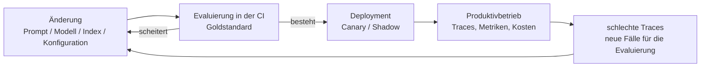
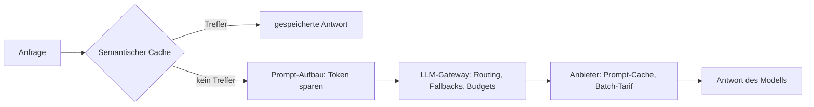

# Das Leben des LLM-Systems nach dem Release

[Die Bereitstellung](../serving/index.md) hat die Pipeline in einen Dienst verpackt. [Die
Cloud-KI-Plattformen](../cloud-platforms/index.md) haben entschieden, wo das Modell rechnet. [Das
Tooling-Ökosystem](../tooling-ecosystem/index.md) hat Ihnen Evaluierung, Guardrails und Observability als
Produkte an die Hand gegeben. Eine Frage bleibt, und sie bestimmt alles, was nach dem Release noch kommt: Was
heißt es, dieses Ding zu *betreiben* – es gefahrlos zu ändern, es im Blick zu behalten und Woche für Woche
dafür zu bezahlen?

**LLMOps** ist der Name, den die Branche dieser Disziplin gegeben hat: MLOps, zugeschnitten auf
LLM-Anwendungen. In der Darstellung von IBM – und die meisten Definitionen folgen ihr – umfasst das den
gesamten Lebenszyklus, das Fine-Tuning eingeschlossen. Dieses Handbuch fasst den Begriff enger, denn wer
Anwendungen baut, trainiert selten etwas: Was Sie zusammensetzen und betreiben, sind Prompts, Modellversionen,
Retrieval-Indizes und Konfigurationen. Halten Sie sich an diese Perspektive und nicht an die Definition der
Branche – es ist der Teil von LLMOps, mit dem ein Team für RAG und Agenten täglich zu tun hat.

:::tip[▶ Video]

<YouTube id="cvPEiPt7HXo" title="Large Language Model Operations (LLMOps) Explained — IBM Technology" />

Die Disziplin im Überblick – was LLMOps von MLOps erbt und was es daran ändert. (Das Video ist auf Englisch.)

:::

## Was sich mit der KI ändert: Artefakt und Test

Hinter dieser Perspektive steckt der Unterschied, von dem die ganze Lektion ausgeht. Im klassischen DevOps ist
das auslieferbare Artefakt der Code: Denselben Build ausliefern heißt, dasselbe Verhalten bekommen. In einer
LLM-Anwendung bestimmen fünf Artefakte gleichzeitig das Verhalten:

- **die Prompts** – der System-Prompt und jede Vorlage auf dem Anfragepfad;
- **das Modell** – seine Identität und seine genaue Version;
- **der Snapshot des Index** – was aufgenommen ist, mit welcher Konfiguration für Chunking und Embeddings;
- **die Konfiguration der Pipeline** – top-K, der Reranker, die Schwellenwerte;
- **die Richtlinien der Guardrails.**

Eine Änderung an einem einzigen davon ist ein Deployment. Und jedes einzelne davon kann die Qualität
verschlechtern, ohne dass sich am Code eine Zeile ändert.

Mit dem Artefakt hat sich auch das Testen geändert. Ausgaben sind nicht deterministisch, und Qualität gibt es
nur in Abstufungen, während ein Unit-Test ein klares Bestehen oder Scheitern will – deshalb ist das Instrument
gegen Regressionen die [Evaluierung](../../part-1-rag/cross-cutting/evaluation/index.md) und nicht der
Unit-Test allein. Alles Weitere zeigt, was dieser eine Satz im laufenden Betrieb bedeutet.

## Ausrollen – CI/CD, wenn das Artefakt nicht nur Code ist

Die ganze Disziplin verdichtet sich zu einer einzigen Schleife. Sie ist das Rückgrat dieser Lektion – und, wie
Sie am Ende sehen werden, das Schlussbild des Handbuchs:

Vorn steht die **Evaluierung in der CI**. Jede Änderung an einem Prompt, einem Modell, einem Index oder einer
Konfiguration läuft gegen den Goldstandard; Metriken unter dem Schwellenwert blockieren den Merge. Das ist die
Evaluierung aus Teil I, die Regressionen abfängt, jetzt als Stufe in der Pipeline – derselbe Stack aus
[promptfoo](https://www.promptfoo.dev) / [DeepEval](https://deepeval.com) / [Ragas](https://ragas.io), den Sie
[beim Tooling-Ökosystem](../tooling-ecosystem/index.md) kennengelernt haben, jetzt in der CI, mit einem Urteil
in Rot oder Grün. Eine Änderung am Prompt, die die Faithfulness stillschweigend um zehn Punkte drückt, fällt
genauso auf wie ein kaputter Build.

### Prompts sind Code – und Konfiguration

Prompts führen ein Doppelleben. Sie sind Code: Halten Sie sie in der Versionsverwaltung, wo eine Änderung am
Prompt als überprüfbarer Diff ankommt und sich wie jeder andere Commit zurücknehmen lässt. Und sie sind
Konfiguration: Wenn Produktteams täglich an Formulierungen feilen, können sie über eine **Prompt-Registry** –
die Prompt-Verwaltung in [LangSmith](https://www.langchain.com/langsmith) oder
[Langfuse](https://langfuse.com) – neue Prompt-Versionen ausliefern, ohne dass irgendwo Code ausgerollt wird.
Beide Orte sind in Ordnung. Was in jedem Fall gelten muss, ist die Zuordnung: Jede Antwort aus dem
Produktivbetrieb muss auf eine genaue Prompt-Version zurückführbar sein, und genau deshalb hält der Trace sie
fest.

### Die Modellversion festlegen

Anbieter versionieren ihre Modelle und nehmen sie außer Betrieb. OpenAI unterscheidet die angekündigte
Abkündigung vom tatsächlichen Abschalten, nennt zu jedem abgekündigten Modell den Nachfolger und gibt
Snapshots mit Zeitstempel heraus – häufig mit dem Datum in der Kennung, etwa `gpt-4o-2024-05-13`, wobei die
Gestalt der Kennung von Anbieter zu Anbieter verschieden ist. Anthropic führt einen ausdrücklichen
Lebenszyklus – Active, Legacy, Deprecated, Retired – und kündigt mindestens 60 Tage vorher an, dass ein Modell
verschwindet.

Deshalb legt der Produktivbetrieb genaue Versionen fest. Ein Alias ohne festgelegte Version ist ein
Deployment, das Sie nicht eingeplant haben: Der Anbieter lässt den Alias auf eine andere Version zeigen, und
Ihr System verhält sich von da an anders, ohne dass auf Ihrer Seite irgendwo ein Diff zu sehen wäre. Das
**Model-Pinning** macht aus dieser Überraschung wieder eine Entscheidung – wechseln Sie auf eine neue Version,
dann behandeln Sie das als das Deployment, das es ist: die Evaluierung erneut laufen lassen und dann
schrittweise ausrollen.

### Schrittweise ausrollen

Die Muster für das Ausrollen kommen unmittelbar aus dem Release Engineering; nur eines ist hier anders. Ein
**Canary Release** schickt einen kleinen Teil des laufenden Verkehrs auf den neuen Prompt oder das neue Modell
und beobachtet die Metriken. Ein **Shadow Deployment** lässt die neue Variante auf gespiegeltem Verkehr
laufen, ohne ihre Antworten jemandem zu zeigen – ein gefahrloser Vergleich der Qualität, gemessen an echten
Anfragen. Ein **A/B-Test** ist die Online-Evaluierung aus Teil I: zwei Varianten, beide für Nutzende sichtbar,
und verglichen wird, was dabei herauskommt. Anders ist hier, worauf Sie schauen: nicht nur auf Fehler und
Latenz, sondern auch auf indirekte Signale für die Qualität und auf die Kosten. Ein Canary Release, das
schnell, günstig und ein wenig falsch antwortet, ist ein gescheitertes Canary Release – und bemerken werden
Sie das nur, wenn Sie die Qualität messen.

### Der Korpus ist auch ein Release

Der Index ist Verhalten. Nehmen Sie mit einer neuen Konfiguration für das Chunking neu auf, verschiebt sich
das Retrieval über den gesamten Korpus; wechseln Sie das Embedding-Modell, muss der Index vollständig neu
aufgebaut werden – die Regel aus der [Ingestion](../../part-1-rag/ingestion/index.md) in Teil I. Schicken Sie
Aktualisierungen des Korpus also durch dieselbe Prüfung wie alles andere: als versioniertes Release, das die
Evaluierung besteht, und nicht als Hintergrundjob, der nachts läuft und stillschweigend umformt, was das
System weiß.

## Überwachen im Produktivbetrieb

Überwachung ist [Observability](../../part-1-rag/cross-cutting/observability/index.md), die dauerhaft läuft
und Alarm schlägt, sobald sich etwas bewegt. Das klassische Dashboard gilt weiter: die Perzentile der Latenz
(p50/p95), die Raten für Fehler und Timeouts, die Tokenkosten pro Anfrage. Das Dashboard für das Sprachmodell
zeigt die indirekten Signale für die Qualität – Anzeichen dafür, dass sich an der Qualität etwas geändert hat:
die Rate der Ablehnungen, die Rate, mit der die Guardrails anschlagen, wie oft Nutzende Rückmeldung geben, und
– inzwischen verbreitete Praxis – ein LLM-as-a-judge, der online eine *Stichprobe* des Verkehrs aus dem
Produktivbetrieb bewertet. Eine Stichprobe, weil auch der Judge Tokens verbrennt; für seine Kosten setzen Sie
eine Obergrenze wie für jeden anderen Posten.

### Drift – drei Ausprägungen

Eine eingefrorene Konfiguration bedeutet kein eingefrorenes Verhalten, denn die Welt darunter bewegt sich.
**Der Eingabedrift** ist der eingeführte Begriff: Nutzende fangen an, neue Arten von Fragen zu stellen, und
der Goldstandard steht nicht mehr für den Verkehr – die Evaluierung bleibt grün, weil sie Fragen prüft, die
niemand mehr stellt. **Der Korpusdrift** ist die Erweiterung derselben Idee durch dieses Handbuch (das
Phänomen ist echt, der Name dafür stammt von uns): Dokumente altern, und die Antworten stützen sich mit einem
Mal auf Fakten, die nur zum Zeitpunkt der Aufnahme stimmten. Und **der vorgelagerte Modelldrift**: Der
Anbieter aktualisiert ein Modell hinter einem Alias ohne festgelegte Version, und das Verhalten verschiebt
sich, ohne dass sich auf Ihrer Seite etwas ändert. Halten Sie am Beiwort „vorgelagert“ fest – im klassischen
MLOps heißt „Modelldrift“, dass die Leistung Ihres *eigenen* Modells nachlässt, ein anderer Sinn. Erkennen
lassen sich alle drei auf demselben Weg: Beobachten Sie, wie sich Themen und Absichten im eingehenden Verkehr
verteilen, und prüfen Sie mit frischen Stichproben nach, nicht nur mit dem alternden Goldstandard.

### Die Schleife nach einem Vorfall, jetzt ein Betriebshandbuch

Der rote Faden, den dieses Handbuch seit Teil I zieht, endet hier, im Produktivbetrieb. Ein schlechter Trace
aus dem Produktivbetrieb geht ein → Sie zerlegen ihn: Fehlerbild des Retrievals oder Fehlerbild der
Generation, die Zerlegung aus Teil I → die Frage wird ein neuer Fall im Goldstandard → Sie beheben → die
Evaluierung bestätigt es → Sie rollen aus. „Observability speist die Evaluierung“ war in Teil I ein Prinzip;
im Produktivbetrieb ist es ein Betriebshandbuch – eine feste Reihenfolge, die eine Kollegin an einem
Dienstagnachmittag abarbeiten kann. Die Plattformen aus [dem Tooling-Ökosystem](../tooling-ecosystem/index.md)
machen aus dem mittleren Schritt einen einzigen Klick: aus einem Trace einen Fall für die Evaluierung machen.

## Kosten und Latenz – die Hebel

:::tip[▶ Video]

<YouTube id="7gMg98Hf3uM" title="What Makes Large Language Models Expensive? — IBM Technology" />

Wohin das Geld tatsächlich geht: Tokens und Rechenzeit, aus denen sich die Kosten zusammensetzen – und damit
die Grundlage für jeden Hebel in diesem Abschnitt. (Das Video ist auf Englisch.)

:::

In einem gewöhnlichen Dienst sind die Kosten vor allem Infrastruktur – ein Thema für den Betrieb, selten *das*
Thema. Hier verbrennt jede Anfrage abgerechnete Tokens, und die Kosten wachsen mit zwei Größen gleichzeitig:
mit der Nutzung und mit der Länge des Prompts. Die zweite ist die verräterische, weil sie sich leise bewegt:
ein längerer System-Prompt, zwei abgerufene Chunks mehr, eine Agentenschleife, die geschwätziger geworden ist
– jedes davon treibt die Rechnung für die einzelne Anfrage nach oben, ohne dass ein einziger Alarm losgeht, es
sei denn, Sie haben aus den Kosten pro Anfrage eine vollwertige Metrik gemacht. Nehmen Sie diese Zahl so ernst
wie eine Metrik aus der Evaluierung: Was Sie am Ende wirklich optimieren, ist Qualität pro Dollar.

### Zwischen Modellen routen

Nicht jede Anfrage braucht das Spitzenmodell. Klassifizieren, einfaches Nachschlagen, kurze Sachfragen – das
erledigt ein günstiges, schnelles Modell; das teure ist seinen Preis erst dort wert, wo die Generation
wirklich schwierig wird. Das **Routing über Modelle hinweg** schickt jede Anfrage an das günstigste Modell,
das sie bewältigt, und der Router selbst kann eine Regel sein, ein trainierter Klassifikator oder wieder ein
Modell. Achten Sie auf die Begriffe: Hier geht das Routing *über Modelle hinweg* – der dritte Sinn von Routing
in diesem Buch. Der Query-Router aus Teil I hat einen Index gewählt, der Agent aus Teil II ein Tool; dieser
hier wählt, wer antwortet.

### Fallbacks und das Gateway

Ausfälle beim Anbieter und 429er sind keine Vorfälle, sondern Wetter. Der Produktivbetrieb hält eine
**Fallback-Kette** bereit – dasselbe Modell in einer anderen Region, ein anderer Anbieter, ein günstigeres
Modell im eingeschränkten Betrieb –, die in dieser Reihenfolge durchprobiert wird, sobald das erste Modell
einen Fehler liefert oder sein Rate Limit erreicht ist. Der natürliche Ort für all das ist ein
**LLM-Gateway**: eine einzige OpenAI-kompatible Schnittstelle vor jedem Modell, das Sie einsetzen, mit
Routing, Fallbacks, API-Schlüsseln, Budgets und Rate Limits je Team an einer Stelle.
[LiteLLM](https://www.litellm.ai) ist das quelloffene Beispiel, [OpenRouter](https://openrouter.ai) das
gehostete.

### Caching – zweimal

Der erste Cache ist der des Anbieters. Das **Prompt-Caching** legt das wiederkehrende *Präfix* Ihres Prompts
ab – den System-Prompt, die Few-Shot-Beispiele, den statischen Kontext –, sodass er nicht bei jedem Aufruf neu
verarbeitet wird. Beide großen Anbieter rechnen zwischengespeicherte Eingabe-Token inzwischen pauschal in der
Größenordnung eines Zehntels des Grundpreises für die Eingabe ab (die genauen Faktoren stehen auf ihren
Preisseiten). Die ehrliche Einschränkung: Ein *Schreiben* in den Cache kostet mehr als die Eingabe zum
Grundpreis – Anthropic verlangt 1,25x oder 2x, je nach Lebensdauer des Eintrags, OpenAI 1,25x auf seinen
neuesten Modellen –, und deshalb ist ein Präfix, das nie wieder gelesen wird, im Cache ein Verlustgeschäft.
Die Folge für den Entwurf: Bauen Sie den Prompt so, dass der Cache greift – erst das statische Präfix, dann
das veränderliche Ende, denn alles Dynamische beendet das wiederverwendbare Präfix genau an der Stelle, an der
es auftritt.

Der zweite Cache ist Ihr eigener. Das Caching der Antworten gibt eine gespeicherte Antwort auf eine
wiederholte Frage zurück – über eine genaue Übereinstimmung oder über das **semantische Caching**, das nahezu
gleiche Fragen über die Ähnlichkeit der Embeddings zusammenführt. Beim semantischen Caching sparen Sie Kosten
und nehmen dafür ein Risiko für die Richtigkeit in Kauf: Liefert der Cache eine Antwort auf eine Frage, die
sich nur in einer Feinheit unterscheidet, bekommt der Nutzer die Antwort auf die Frage eines anderen.

### Token sparen

Das günstigste Token ist das, das Sie nie schicken. Rufen Sie weniger Chunks ab – das Zusammenstellen des
Kontexts aus Teil I: die besten statt aller. Straffen Sie den System-Prompt. Setzen Sie eine Obergrenze für
die Länge der Ausgabe. Fassen Sie das Arbeitsgedächtnis eines Agenten zusammen, statt es mit jedem Schritt
wachsen zu lassen ([Planung und Schleifen](../../part-2-agents/planning-loops/index.md)). Was für die Kosten
gilt, gilt ähnlich für die Latenz: Streaming für die gefühlte Latenz (die Lektion zur
[Bereitstellung](../serving/index.md)), kleinere und schnellere Modelle, wo das Routing es zulässt, und das
Parallelisieren von Stufen der Pipeline, die nicht voneinander abhängen.

### Der Batch-Tarif

Für Arbeit, die warten kann, müssen Sie nicht den interaktiven Preis zahlen. Das nächtliche Anreichern des
Korpus, Nachberechnungen, das Erzeugen synthetischer Daten für die Evaluierung – im **Batch-Tarif** (*batch
tier*) aus der Lektion zu den [Cloud-KI-Plattformen](../cloud-platforms/index.md) laufen sie zu etwa dem
halben Preis; dafür gilt ein SLA im Bereich von Stunden. Unter den Hebeln ist dieser der einfachste: die
Arbeitslast als nicht interaktiv einordnen und den Rabatt mitnehmen.

### Budgets schließen die Schleife

Die ausgereifte Praxis – verbreitet, aber kein Standard – sind **Token-Budgets** je Team und je Funktion samt
Alarmen, durchgesetzt dort, wo aller Verkehr ohnehin schon zusammenläuft: am Gateway. Und die Durchsicht der
Kosten kommt auf die Checkliste für das Deployment, denn der Unterschied, mit dem die Lektion beginnt, gilt in
beide Richtungen – eine Änderung am Prompt ist eine Änderung der Kosten. Die Schleife vom Anfang dieser Seite
entscheidet über Qualität *und* über Geld.

Die Hebel dieses Abschnitts, eingezeichnet in den Anfragepfad:

---

Damit ist Teil III abgeschlossen und mit ihm der Grundkurs dieses Handbuchs. Der eigene Weg von Teil III war
kurz und praktisch: Wir haben die Pipeline als [Dienst](../serving/index.md) verpackt, entschieden, [wo das
Modell rechnet](../cloud-platforms/index.md), das [Tooling](../tooling-ecosystem/index.md) um die Schleife
herum zusammengestellt und – in dieser Lektion – gelernt, das Gebaute zu betreiben. Der größere Zusammenhang
ist der des Buchs. Teil I hat die Pipeline gebaut: Chunks, Embeddings, Retrieval, Generation und die
Querschnittsthemen, die sie messbar und sicher machen. Teil II hat ihr Handlungsfähigkeit gegeben: die
Schleife, die Tools, die Pläne, die Mitspieler, die Protokolle. Teil III hat sie in den Produktivbetrieb
gebracht. Was als „die Dokumente aufteilen und darin suchen“ angefangen hat, steht am Ende als laufender
Dienst da, mit einer Evaluierung vor jeder Änderung und mit einer Schleife, die die eigenen Fehler in
Testfälle verwandelt. Diese Schleife wird niemals fertig – und das ist der Punkt. Ein LLM-System im
Produktivbetrieb ist nicht fertig; es wird betrieben.

## Das Wichtigste

- Das auslieferbare Artefakt ist **Prompt + Modellversion + Index + Konfiguration + Richtlinien der
  Guardrails**, nicht nur Code. Eine Änderung an einem davon ist ein Deployment, und jedes davon kann die
  Qualität verschlechtern, ohne dass sich am Code eine Zeile ändert.
- Die **Evaluierung in der CI** ist die Prüfung, die Regressionen abfängt: Jede Änderung läuft gegen den
  Goldstandard; Metriken unter dem Schwellenwert blockieren den Merge.
- **Legen Sie genaue Modellversionen fest.** Anbieter kündigen Modelle ab und nehmen sie außer Betrieb; ein
  Alias ohne festgelegte Version ändert das Verhalten, ohne dass Sie etwas getan haben. Aktualisiert ein Anbieter das
  Modell, ist das ein Deployment: die Evaluierung erneut laufen lassen, dann schrittweise ausrollen.
- Rollen Sie mit **Canary Release, Shadow Deployment oder A/B-Test** aus – und schauen Sie dabei auf die
  indirekten Signale für die Qualität und auf die Kosten, nicht nur auf Fehler und Latenz.
- Die Überwachung bekommt ein zweites Dashboard für die Qualität: die Rate der Ablehnungen, das Anschlagen der
  Guardrails, die Rückmeldungen der Nutzenden, eine von einem Judge bewertete Stichprobe des Verkehrs – und sie verfolgt
  den **Drift**: den Eingabedrift, den Korpusdrift und den vorgelagerten Modelldrift.
- Die Schleife nach einem Vorfall ist ein Betriebshandbuch: schlechter Trace → Fehlerbild des Retrievals oder
  der Generation → neuer Fall im Goldstandard → beheben → die Evaluierung bestätigt es → ausrollen.
- Die Hebel bei den Kosten: das **Routing über Modelle hinweg**, **Fallbacks** hinter einem
  **LLM-Gateway**, das **Prompt-Caching** (das statische Präfix zuerst) samt einem **semantischen Cache**,
  das Einsparen von Tokens und der **Batch-Tarif** für Arbeit, die offline laufen kann.
- Budgets sitzen am Gateway, und die Durchsicht der Kosten gehört auf die Checkliste für das Deployment: Eine
  Änderung am Prompt ist eine Änderung der Kosten.

**[Neue Begriffe](../../glossary.md#llmops)**: LLMOps, canary release, shadow deployment, prompt registry, model pinning, model routing, fallback, LLM gateway, prompt caching, semantic caching, drift.

---

:::note[Als Nächstes: Teil 2 der Lektion]

**[Fine-Tuning, Kosten und Queues](./deep-dive.md)** – der ausführliche zweite Durchgang: der Betrieb des
Fine-Tunings (wann Sie das Modell statt des Prompts anpassen und wie Sie ein angepasstes Modell wieder
zurücknehmen), die Governance der Ausgaben auf Ebene der Organisation, was die Triage von Regressionen für die
Freigabe vor dem Release und für den Rollback bedeutet, Fehlerbudgets, die in der Organisation als Prozess
verankert sind, und die Infrastruktur der Queues für Arbeitslasten im Batch.

Siehe auch: [Bereitstellung und Betrieb](../serving/index.md),
[Cloud-KI-Plattformen](../cloud-platforms/index.md), [das Tooling-Ökosystem](../tooling-ecosystem/index.md)
und die [Vertiefung zur Observability](../../part-1-rag/cross-cutting/observability/deep-dive.md).

:::
