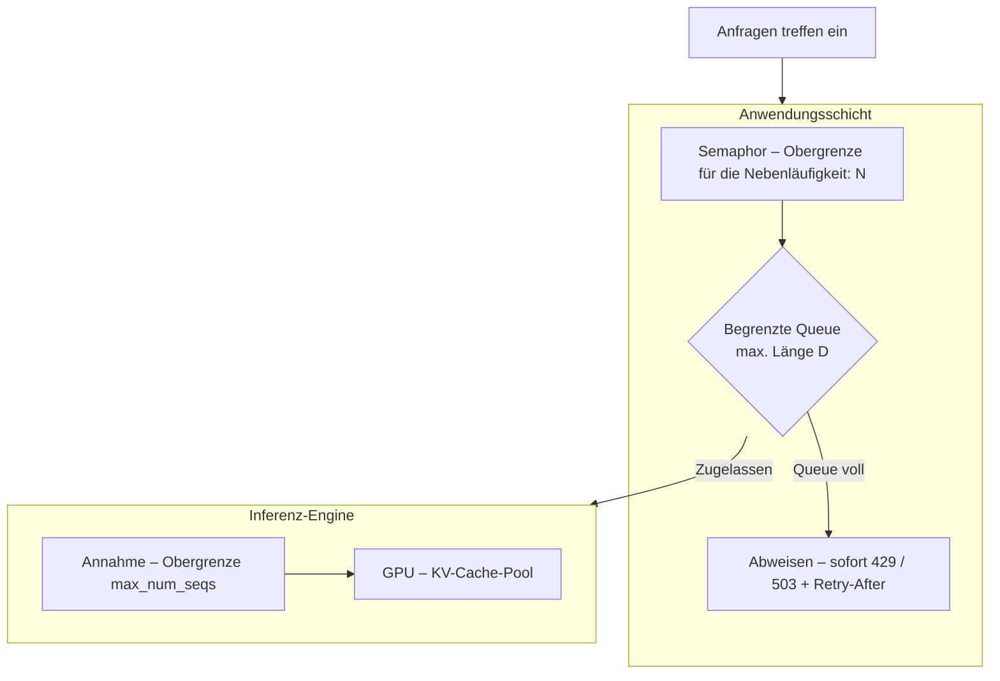
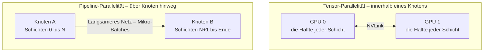

# Woher der Durchsatz kommt, wenn echte Last anliegt

[Teil 1 der Lektion](./index.md) hat den Dienst gebaut und seine Teile benannt: die Trennung zwischen Anwendung und Modell, den asynchronen Entwurf von FastAPI, der zu einer Last passt, die fast nur wartet, das Streaming über SSE, die Checkliste für den Produktivbetrieb, die Eigenheiten von Docker bei Gewichten, GPU und Cold-Start, und – in groben Zügen – die Inferenz-Engines mit Continuous Batching und PagedAttention. Dieser zweite Durchgang nimmt sich denselben Dienst unter echter Last vor: Diesmal geht es um das Innenleben, um die Stellen, an denen so ein Dienst versagt, und um eine Reihe von Fällen, in denen Sie auf ein Verfahren besser verzichten. Teil 1 wird durchgehend vorausgesetzt und hier nirgends noch einmal erklärt.

## Worker, Event-Loop – und woher die Nebenläufigkeit wirklich kommt

In der Voreinstellung läuft uvicorn als ein einziger Prozess: ein Event-Loop auf einem einzigen CPU-Kern. Um mehr als einen Kern zu nutzen, starten Sie mehrere **ASGI-Worker** – eigenständige Kopien des ASGI-Servers (uvicorn), die Ihre Anwendung ausführen –, und dafür gibt es 2026 zwei gängige Wege: das klassische Muster mit gunicorn als Prozessverwalter über `uvicorn.workers.UvicornWorker` und das eigene Flag `--workers` von uvicorn, das `fastapi run` mitbringt. Die Bereitstellungsdokumentation von FastAPI führt beide auf; die konkrete Empfehlung altert, und was bleibt, ist, was ein Worker *ist*.

Ein Worker bringt Ihnen Parallelität auf Prozessebene: einen eigenen Betriebssystemprozess, einen eigenen Python-Interpreter – und damit einen Weg um den GIL herum –, einen eigenen Event-Loop, eigenen Speicher. Was er Ihnen nicht bringt, ist Nebenläufigkeit, und beides zu verwechseln ist der klassische Dimensionierungsfehler bei einem LLM-Proxy. Die alte Faustregel synchroner Webdienste, `(2 × cores) + 1`, greift hier nicht, denn die Nebenläufigkeit kommt aus dem Event-Loop und nicht aus der Zahl der Prozesse: Ein einziger Event-Loop verschränkt bereits Hunderte gleichzeitiger Wartevorgänge, weil eine LLM-Anfrage fast nur wartet. Worker gibt es aus zwei anderen Gründen – um jeden Kern zu nutzen und um die kleinen rechenlastigen Anteile der Arbeit abzudecken: die Serialisierung von Anfrage und Antwort, die Tokenisierung, das Verarbeiten von JSON. Die Zahl der Worker richtet sich also nach den Kernen und nach der rechenlastigen Arbeit; wie viele Anfragen Sie gleichzeitig halten wollen, spielt dabei keine Rolle.

Eines bekommen Sie dabei umsonst: **uvloop**, eine schnelle Implementierung des Event-Loops auf Basis von libuv, ist in `uvicorn[standard]` enthalten und ersetzt den voreingestellten Event-Loop von asyncio – mehr Tempo, ohne eine Zeile Code zu ändern.

Zur Threadpool-Regel aus Teil 1 gehört der Mechanismus dahinter. Eine gewöhnliche `def`-Pfadoperation oder -Abhängigkeit läuft in einem anyio-Threadpool – voreingestellt sind ungefähr vierzig Threads – und nicht im Event-Loop; ein synchroner Endpunkt blockiert den Event-Loop also nicht schon für sich genommen. Unter Last versagt er auf subtilere Art: Der Pool ist erschöpft, und weitere Anfragen warten, bis ein Thread frei wird. Der umgekehrte Fehler ist der schlimmere. Ein blockierender Aufruf innerhalb eines `async def`-Handlers blockiert den gesamten Event-Loop und mit ihm jede nebenläufige Anfrage in diesem Prozess – der Satz aus Teil 1, ‚ein einziger blockierender Aufruf bringt alles zum Stehen‘, jetzt mit der Erklärung, warum das passiert. Für unvermeidbar synchrone Arbeit **lagern Sie sie aus**: `run_in_threadpool` von Starlette oder `asyncio.to_thread`, damit der blockierende Aufruf auf einem Thread läuft und der Event-Loop die übrigen Anfragen weiter bedient.

Das Herunterfahren braucht dieselbe Sorgfalt, sobald Antworten gestreamt werden. Bei `SIGTERM` sollte der Server keine neuen Verbindungen mehr annehmen und die laufenden Anfragen innerhalb einer Frist für das geordnete Herunterfahren noch abschließen – und ein LLM-Strom kann Dutzende Sekunden dauern, länger als die voreingestellte Frist. Bemessen Sie diese Frist nach dem längsten Strom, mit dem Sie rechnen, sonst schneidet das nächste Deployment im laufenden Betrieb Antworten mitten in der Generation ab. (Eine andere Sorge beim Streaming ändert sich unter Last nicht und wird hier nicht neu hergeleitet: die Wahl zwischen gepufferter und schrittweiser Prüfung, die die [Guardrails](../../part-1-rag/cross-cutting/guardrails/index.md) auf der Ausgabeseite einer gestreamten Antwort erzwingen – Teil 1 behandelt sie.)

## Die Arbeit begrenzen, bevor der Dienst darin untergeht

Asynchronität macht es billig, eine Verbindung offen zu halten, und genau diese Billigkeit ist die Falle: Sie erlaubt einem Dienst, weit mehr Arbeit anzunehmen, als er zu Ende bringen kann. Unbegrenzte Nebenläufigkeit richtet einen LLM-Dienst dann auf drei Arten zugleich zugrunde. Erstens erschöpft sie den Speicher, denn jede laufende Anfrage hält KV-Cache-Blöcke und Verbindungszustand. Zweitens löst sie beim Anbieter 429-Stürme aus: Sie überschreiten das gemeinsame Kontingent, und alle, die den Dienst aufrufen, werden gemeinsam gedrosselt. Drittens geraten die langsamsten Anfragen außer Kontrolle – jenseits der Kapazitätsgrenze explodiert die Wartezeit, und der p99-Wert schnellt in die Höhe. Was „jenseits der Kapazitätsgrenze“ heißt, richtet sich nach Ihren **SLOs** für die Latenz – den Zielwerten, die die [Vertiefung zur Observability](../../part-1-rag/cross-cutting/observability/deep-dive.md) festlegt und an denen sich diese ganze Seite messen lassen muss.

Warum das so früh greift, sagt **Little's Law**: L = λW, die Nebenläufigkeit ist die Ankunftsrate mal der Verweilzeit im System. Weil das W einer LLM-Generation Dutzende Sekunden beträgt, bedeutet schon eine bescheidene Ankunftsrate eine große Nebenläufigkeit – zehn Anfragen pro Sekunde bei einer Generation von zwanzig Sekunden ergeben zweihundert gleichzeitig laufende Anfragen. Ein LLM-Dienst stößt schon bei einer überraschend niedrigen Anfragerate an seine Kapazitätsgrenze.

Das Gegenmittel heißt **Backpressure** (Schutz vor Überlast – der Empfänger bremst den Sender): Begrenzen Sie die Nebenläufigkeit absichtlich mit einem Semaphor, der die Zahl gleichzeitiger Modellaufrufe begrenzt, und setzen Sie eine begrenzte Queue mit einer maximalen Länge dahinter. Läuft die Queue voll, antworten Sie sofort mit `429` oder `503` und einem `Retry-After`-Header und weisen Last damit gezielt ab, statt Arbeit anzunehmen, die Sie nicht bedienen können. Eine Anfrage, die der Client wiederholen kann, ist ein weit besseres Ergebnis als ein Dienst, der für alle zusammenbricht.

Dieselbe Idee lässt sich noch schärfer fassen: Nehmen Sie Arbeit gar nicht erst an, deren Frist beim Client abgelaufen ist, bevor Sie überhaupt an sie herankommen – sie sofort abzuweisen ist billiger, als einen Platz auf der GPU für eine Antwort zu verbrauchen, auf die niemand mehr wartet. Und Fairness braucht Struktur: Queues je Mandant und Obergrenzen je Mandant für die Nebenläufigkeit verhindern, dass ein einziges Konto mit hohem Verbrauch alle übrigen aushungert – es ist das Rate Limit je Nutzerkonto aus Teil 1, jetzt in die Annahme eingebaut statt nachträglich angeschraubt.

Dahinter steht ein einziges Prinzip: Begrenzen Sie an der knappen Ressource, nicht an der Verbindung. Die wartende Verbindung ist billig, wie Teil 1 gezeigt hat, aber jede laufende Anfrage verbraucht weiter unten etwas Knappes – einen Platz im GPU-Batch oder einen Anteil am Token-Kontingent des Anbieters. Dorthin gehört die Obergrenze. In der Praxis sitzt sie auf zwei Ebenen: Die Anwendungsschicht begrenzt mit ihrem eigenen Semaphor und ihrer eigenen Queue, und die Inferenz-Engine entscheidet über `max_num_seqs` selbst, wie viel sie annimmt (weiter unten). Doppelt hält besser.

## Die Inferenz-Engine von innen

Der Durchsatz einer Inferenz-Engine ist keine Zauberei; er kommt aus einer Handvoll konkreter Mechanismen, und [vLLM](https://docs.vllm.ai) ist für die meisten davon die Referenzimplementierung. Beginnen Sie beim Scheduler. Continuous Batching ist in Wahrheit **Scheduling auf Iterationsebene**: Der Scheduler lässt bei jedem Decode-Schritt neue Anfragen zu und wirft fertige hinaus, statt wie beim statischen Batching einen ganzen Batch auf sein langsamstes Mitglied warten zu lassen, bevor der nächste beginnen kann. Die Idee stammt aus dem Orca-Paper (Yu et al., OSDI 2022), das das Scheduling auf Iterationsebene eingeführt hat; vLLM, TGI und TensorRT-LLM bauen alle darauf auf.

Eine Generation hat zwei Phasen mit gegenläufigem Appetit. **Prefill** verarbeitet den gesamten Prompt in einem einzigen Durchlauf und ist rechenintensiv. **Decode** erzeugt pro Schritt ein Token, liest dabei jedes Mal die Gewichte und den KV-Cache neu und wird durch die Speicherbandbreite begrenzt. Die beiden Phasen belasten die GPU unterschiedlich, und genau das nutzen die nächsten zwei Optimierungen aus.

**Chunked Prefill** verschränkt die beiden in einem Schritt: Es zerlegt eine lange Prefill-Phase in Stücke und mischt sie unter die laufenden Decode-Schritte, sodass ein einzelner großer Prompt in dieser Phase nicht mehr die Tokenerzeugung aller anderen aufhält. Das lohnt sich meistens: ein leicht höherer p50-Wert beim TTFT für die Verschränkung, ein deutlich besserer p95-Wert. **Prefix-Caching** geht die wiederholte Arbeit von der anderen Seite an: Teilen sich viele Anfragen dasselbe Prompt-Präfix – etwa einen gemeinsamen System-Prompt –, wird der KV-Cache dieses Präfixes für alle wiederverwendet, statt ihn jedes Mal neu zu berechnen.

Beides hängt daran, wie der KV-Cache abgelegt wird. **PagedAttention**, das Teil 1 in groben Zügen eingeführt hat, hält den KV-Cache in Blöcken fester Größe, so wie ein Betriebssystem den Speicher in Seiten verwaltet: Die Fragmentierung geht gegen null, und Blöcke lassen sich teilen – der Mechanismus, auf dem das Prefix-Caching aufsetzt. Das ist deshalb wichtig, weil nicht die reine Rechenleistung, sondern der KV-Cache die eigentliche Grenze setzt. Seine Größe wächst mit der Sequenzlänge mal der Zahl gleichzeitiger Sequenzen, und sobald der KV-Pool voll ist, lassen sich keine weiteren nebenläufigen Anfragen mehr zulassen – ganz gleich, wie viele FLOPS auf der GPU noch brachliegen.

**Drei Stellschrauben** steuern diesen Pool, und ihre Namen sind eine Momentaufnahme von 2026; lesen Sie sie mit diesem Datum im Kopf: `max_num_seqs` begrenzt die Zahl gleichzeitiger Sequenzen, `max_num_batched_tokens` legt das Token-Budget pro Schritt fest, und `gpu_memory_utilization` bestimmt, wie viel VRAM der KV-Cache-Pool bekommt. Läuft der Pool trotzdem voll, verdrängt vLLM Anfragen – entweder wird ihr KV-Cache später neu berechnet, oder er wird in den CPU-Speicher ausgelagert und wieder zurückgeholt.

Die Engine hinter diesem Innenleben wurde vor Kurzem überholt: vLLM hat seinen Kern – Scheduler, Verwaltung des KV-Caches, Worker, API-Server – zu dem umgebaut, was es die **V1-Engine** nennt; sie erschien im Januar 2025 als Alpha und ist 2026 die Voreinstellung. V1 schaltet die Optimierungen für den Durchsatz von sich aus ein; dazu kommen ein fortlaufender Batch und eine saubere Trennung zwischen Scheduler- und Worker-Prozessen. Die Versionsbezeichnung ändert sich weiter; die Mechanismen, die sie bezeichnet, ändern sich nicht.

**Quantisierung** ist der letzte Hebel; sie tauscht Rechengenauigkeit gegen Speicher und Geschwindigkeit. Die Ausgangslage ist FP16 oder BF16. FP8, auf den Tensor-Kernen von Hopper und Blackwell nativ unterstützt, ist nahezu verlustfrei und 2026 der übliche erste Schritt; INT8 (W8A8) geht weiter; INT4 nur für die Gewichte, über AWQ oder GPTQ, senkt den VRAM-Bedarf der Gewichte um rund drei Viertel – genug, um ein 70B-Modell auf eine einzige GPU zu bekommen – bei mäßigem Verlust an Qualität. Eine eigene Achse ist die **Quantisierung des KV-Caches**: Wird der KV-Cache in FP8 gehalten, verdoppelt sich ungefähr die Zahl der Token, die ein gegebener Pool fasst, was längere Kontexte oder mehr Nebenläufigkeit erlaubt. Jede dieser Entscheidungen erkauft Durchsatz und Speicher mit Qualität; Genauigkeit gibt es nicht umsonst.

## Wenn ein Modell nicht mehr auf eine GPU passt

Manche Modelle passen schlicht nicht auf eine einzelne GPU, und dann zerlegen Sie sie – aber wie Sie zerlegen, entscheidet darüber, welche Hardware Sie brauchen. **Tensor-Parallelität** verteilt die Gewichtsmatrizen jeder Schicht über mehrere GPUs. Jede Schicht braucht danach ein All-Reduce, um die Teilergebnisse wieder zusammenzurechnen; das macht sie kommunikationsintensiv und verlangt eine schnelle Verbindung zwischen den GPUs – **NVLink** –, weshalb sie innerhalb eines einzelnen Knotens bleiben sollte. In vLLM ist es die Stellschraube `tensor_parallel_size`. **Pipeline-Parallelität** teilt anders auf: Sie teilt die Schichten in Stufen, legt jede Stufe auf eine andere GPU oder einen anderen Knoten und schickt Mikro-Batches von Stufe zu Stufe. Das braucht weit weniger Kommunikation, verträgt also eine langsamere Verbindung und funktioniert über Knoten hinweg – zum Preis einer **Blase** (*bubble*) in der Pipeline, der Leerlaufzeit, während sie sich füllt und wieder leert. Ihre Stellschraube heißt `pipeline_parallel_size`.

Die Faustregel ergibt sich unmittelbar aus den Kommunikationskosten: Tensor-Parallelität innerhalb eines Knotens, über NVLink; Pipeline-Parallelität über Knoten hinweg; und beides zusammen für ein wirklich riesiges Modell. **Daten-Parallelität** ist ein anderes Werkzeug für ein anderes Problem – vollständige Kopien des Modells hinter einem Load-Balancer – und sie dient dem reinen Durchsatz, wenn das Modell ohnehin auf eine GPU passt. Um irgendetwas davon über mehrere Maschinen hinweg zu koordinieren, stützt sich vLLM auf [Ray](https://www.ray.io).

Und es gilt dieselbe Disziplin wie überall sonst: Zerlegen Sie kein Modell, das passt. Eines, das bequem auf eine einzelne GPU passt, lässt sich repliziert billiger betreiben als zerlegt, denn das Zerlegen bringt nur zusätzlichen Kommunikationsaufwand, ohne dass ihm ein Gewinn gegenübersteht. Parallelität verdient sich ihren Platz bei Modellen, die nicht passen, oder wenn es um Latenz geht – umsonst ist der Durchsatz dabei nie.

## GPU-Scheduling und Autoscaling in Kubernetes

In Kubernetes ist eine GPU eine Ressource, die der Scheduler zuteilt, und ihr Zuschnitt hat Folgen. Das Device-Plugin von NVIDIA meldet sie als `nvidia.com/gpu`, eine Ganzzahl – ein Pod fordert also von Haus aus ganze GPUs an, und einen Bruchteil einer GPU kann er gar nicht anfordern. Diese teuren Maschinen halten Sie den Lasten frei, die sie wirklich brauchen: mit Taints und Tolerations an den Knoten oder über Node-Affinität zu eigenen GPU-Node-Pools, damit gewöhnliche Pods nie auf einem GPU-Knoten landen.

Ist eine ganze GPU pro Pod zu grob, gibt es zwei Mechanismen, um eine GPU auf mehrere Lasten aufzuteilen. **MIG (Multi-Instance GPU)** zerlegt eine A100 oder H100 in der Hardware in voneinander isolierte Instanzen, jede mit eigenem Speicher und eigener Fehlerisolation. **GPU-Time-Slicing** verschränkt stattdessen die Arbeit auf derselben GPU, ganz ohne Speicher- oder Fehlerisolation – in Ordnung für einen Entwicklungscluster, riskant im Produktivbetrieb, wo ein Fehler oder eine Speicherspitze bei einem Mandanten auf die anderen durchschlägt.

Das Schwierige am Autoscaling für GPUs ist die Wahl des Signals. Der voreingestellte **Horizontal Pod Autoscaler (HPA)** skaliert nach CPU und Speicher, was hier nichts nützt: Eine GPU kann dauerhaft zu 100 % ausgelastet sein, während die CPU im Leerlauf bleibt, und ein HPA auf CPU-Basis löst dann schlicht nie aus. Aussagekräftig sind die Länge der Queue, die laufenden Anfragen, die Token pro Sekunde oder die GPU-Auslastung aus **DCGM**, dem Exporter für GPU-Telemetrie von NVIDIA. Angebunden werden diese Werte als eigene oder externe Metriken über den **Prometheus Adapter** oder über [KEDA](https://keda.sh), einen ereignisgetriebenen Autoscaler, der genau auf solche externen Metriken skaliert.

Der **Cold-Start** aus Teil 1 sorgt dafür, dass jedes reaktive Autoscaling hinterherhinkt. Ein neues Replikat muss ein Image von mehreren Gigabyte holen und die Gewichte laden – Dutzende Sekunden bis Minuten –, bevor es eine einzige Anfrage bedient; eine Skalierung, die erst auf eine Lastspitze reagiert, kommt daher zwangsläufig zu spät. Dagegen hilft ein Vorrat bereits gestarteter Instanzen, oder Sie skalieren vorausschauend statt rein nach der Nachfrage; und der **Cluster Autoscaler** kann GPU-Knoten nachlegen, wenn der Pool leer ist, aber das dauert weitere Minuten – die Bereitstellung des Knotens kommt zum Holen des Images noch obendrauf. Über dem reinen Scheduler sitzen Bausteine für die Modellbereitstellung, die einen Teil dieser Handarbeit abnehmen: [KServe](https://kserve.github.io/website/) und Knative bieten ein Autoscaling, das sich nach den eingehenden Anfragen richtet – einschließlich Scale-to-Zero und einer Skalierung nach Nebenläufigkeit –, und Ray Serve ist eine weitere Möglichkeit. Diese Produktnamen werden wechseln; die Fähigkeit, nach eingehenden Anfragen zu skalieren, bleibt.

## Die GPU sekundenweise mieten

**Serverless GPU** ist die radikalste Form des Mietens: GPU-Kapazität, sekundengenau abgerechnet, im Leerlauf auf null skaliert, ohne einen Cluster, den Sie betreiben müssten. 2026 gehören dazu [Modal](https://modal.com), das Serverless-Angebot von [RunPod](https://www.runpod.io), [Replicate](https://replicate.com), [Baseten](https://www.baseten.co) und Beam – daneben Fal und Cerebrium – sowie Googles Cloud Run mit angehängter GPU; was AWS an echtem Serverless für GPUs zu bieten hat, ist vergleichsweise schwach. Wie schon in Teil 1 ist die Aufzählung eine Momentaufnahme, die altert; was bleibt, ist die Kategorie.

Was die Kategorie ausmacht, ist zugleich ihr zentrales Problem: die Kosten des Cold-Starts. Bei jeder kalten Anfrage fallen zuerst das Laden der Gewichte und die Initialisierung an, bevor sie beantwortet werden kann, und der größte Teil der Ingenieursarbeit steckt darin, das zu verkürzen. Das wirksamste Mittel dagegen ist ein **Speicherabbild** samt seiner Wiederherstellung – Modal legt von einem bereits geladenen Modell ein Speicherabbild an, sodass eine frische Instanz in Sekunden statt in Minuten bereitsteht –, daneben ein **Vorrat bereits gestarteter Instanzen**, der eine Mindestzahl am Leben hält (was genau die Ersparnis auffrisst, für die Scale-to-Zero gedacht war), und schnelleres Laden der Gewichte überhaupt. Innerhalb von ungefähr achtzehn Monaten sind die Cold-Starts der Branche von 30 bis 60 Sekunden auf unter fünf Sekunden gefallen.

Daraus ergibt sich, wann Sie danach greifen. Stoßweiser Verkehr mit starken Ausschlägen passt zu Serverless, ebenso der Verkehr in der Entwicklung und die Last aus Batch-Durchläufen, weil Sie zwischen den Stößen keine ungenutzte Kapazität bezahlen. Für gleichmäßig hohen Verkehr und überhaupt für jede Last, die keinen Cold-Start verträgt, ist stattdessen eine fest zugeteilte, dauerhaft warme GPU die richtige Wahl – bei hoher Auslastung günstiger pro Token und ohne die Kosten des Cold-Starts. Die ganze Abwägung zwischen Mieten und Eigenbetrieb, und überhaupt die Frage, wo das Modell laufen soll, ist Gegenstand der Lektion über die [Cloud-KI-Plattformen](../cloud-platforms/index.md); hier steht nur, was davon die Bereitstellung betrifft.

## Das Wichtigste

- Ein Worker ist ein Prozess – er bringt Ihnen Kerne, nicht Nebenläufigkeit; der Event-Loop verschränkt ohnehin schon Hunderte wartender Anfragen, und deshalb richtet sich die Zahl der Worker nach den Kernen und nach der rechenlastigen Arbeit. Ein blockierender Aufruf in einem asynchronen Handler blockiert jede Anfrage im Prozess: Lagern Sie ihn auf einen Thread aus, und geben Sie langen Strömen beim Herunterfahren Zeit, zu Ende zu laufen.
- Unbegrenzte Nebenläufigkeit ruiniert einen LLM-Dienst, und nach Little's Law wird schon aus einer niedrigen Anfragerate eine hohe Nebenläufigkeit. Begrenzen Sie sie mit einem Semaphor und einer begrenzten Queue, weisen Sie überzählige Last mit `429` und `Retry-After` ab, und setzen Sie die Obergrenze dort an, wo es knapp wird – beim Batch-Platz auf der GPU oder beim Kontingent des Anbieters –, nicht an der billigen Verbindung.
- In einer Inferenz-Engine kommt der Durchsatz aus dem Scheduling auf Iterationsebene, aus Chunked Prefill und aus dem Prefix-Caching über einem seitenweise verwalteten KV-Cache – und dieser KV-Cache wird zur Grenze, lange bevor der GPU die Rechenleistung ausgeht. Die Quantisierung tauscht Qualität gegen genau den Speicher, an dem diese Grenze hängt.
- Zerlegen Sie ein Modell nur dann über mehrere GPUs, wenn es nicht passt: Tensor-Parallelität innerhalb eines Knotens über NVLink, Pipeline-Parallelität über Knoten hinweg und vollständige Kopien nach dem Muster der Daten-Parallelität, wenn es ohnehin passt. Das Zerlegen verschafft Ihnen Kapazität, die Sie vorher nicht hatten; umsonst ist der Durchsatz dabei nie.
- In Kubernetes ist eine GPU eine ganzzahlige Ressource, die sich mit MIG oder Time-Slicing unterteilen lässt. Skalieren Sie nach der Länge der Queue und nach der GPU-Auslastung, nie nach der CPU, und rechnen Sie damit, dass jede reaktive Hochskalierung wegen des Cold-Starts hinterherhinkt.
- Serverless GPU mietet Kapazität sekundenweise und skaliert auf null; bezahlt wird das mit einer Latenz beim Cold-Start, die Speicherabbilder und ein Vorrat gestarteter Instanzen nur abmildern. Es passt zu stoßweisem Verkehr und zu Batch-Durchläufen; gleichmäßige Last ist auf einer dauerhaft warmen GPU billiger.
- Ein Gedanke zieht sich durch alle sechs Abschnitte: Knapp sind bei einem LLM-Dienst die GPU und ihr KV-Cache – unter Last schützen Sie diese Ressource, nicht die Verbindung und nicht den Kern.

**[Neue Begriffe](../../glossary.md#serving)**: ASGI workers, uvloop, threadpool offloading, backpressure, load shedding, admission control, Little's Law, iteration-level scheduling, prefill / decode, chunked prefill, prefix caching, quantisation, KV-cache quantisation, tensor parallelism, pipeline parallelism, data parallelism, MIG (Multi-Instance GPU), GPU time-slicing, KEDA, KServe, serverless GPU.
