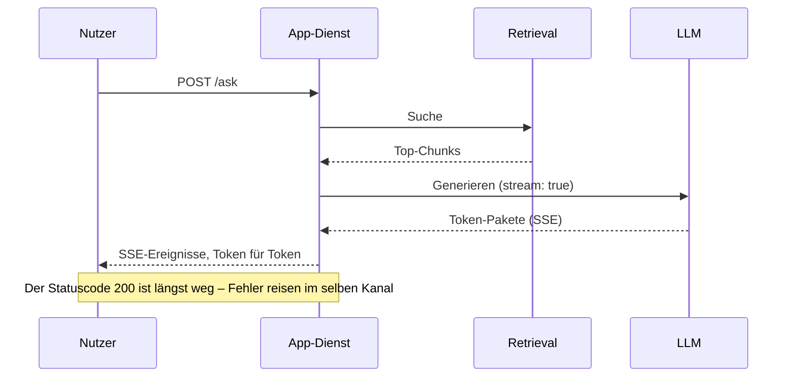
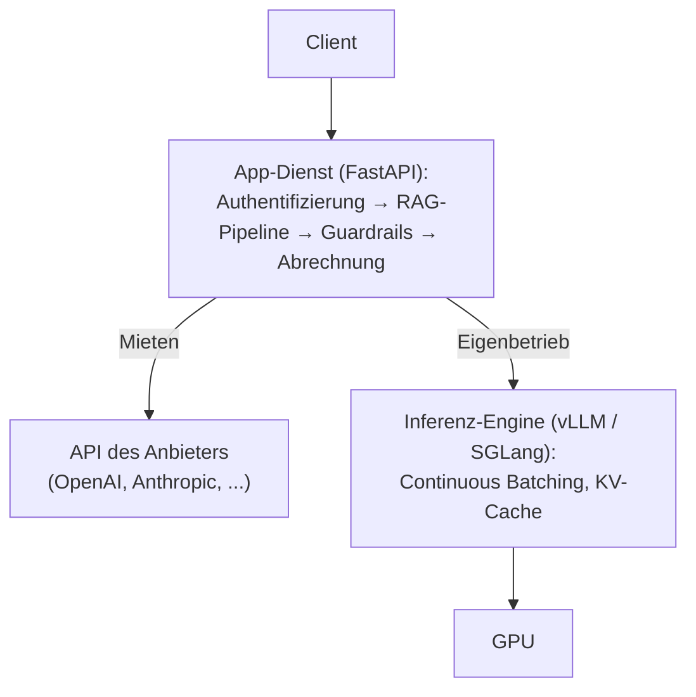

# Vom Notebook zum Dienst

Am Ende von Teil II stand das System endlich vollständig da: eine RAG-Pipeline, aus der ein Agent geworden
ist, der über Standardprotokolle an seine Tools und an andere Agenten angebunden ist. Aber alles, was Sie
bisher gebaut haben, ruht auf einer unausgesprochenen Annahme – es läuft auf Ihrer Maschine, für Sie. Sie
starten es, Sie geben ihm eine Frage, Sie lesen die Antwort, und wenn etwas nicht funktioniert, sitzen Sie
direkt daneben. Im Produktivbetrieb gilt davon nichts mehr: Das System läuft als Dienst, für andere
Menschen, für viele gleichzeitig, unter Last, und niemand schaut zu. Um diesen Sprung geht es in Teil III,
und die Lektionen bauen aufeinander auf: Diese Lektion verpackt das Gebaute als Dienst; die Lektionen danach
behandeln, [wo das Modell selbst laufen soll](../cloud-platforms/index.md), [welche Werkzeuge Sie um das
laufende System legen](../tooling-ecosystem/index.md) und [wie Sie es betreiben, sobald es live
ist](../llmops/index.md).

## Ein Wort, zwei Aufgaben

Das englische *serving* verbirgt zwei verschiedene Aufgaben, und beide in einen Topf zu werfen ist der
schnellste Weg, sich in diesem Thema zu verlieren. Die **Anwendung** bereitzustellen heißt, Ihre Pipeline
als API-Dienst zu verpacken, den Clients aufrufen: das Retrieval, die Agentenschleife, die **Guardrails**
(Leitplanken – Schutzregeln um das Modell). Das **Modell** bereitzustellen heißt, die **Inferenz** des
Sprachmodells selbst zu betreiben: Das Modell berechnet aus Eingaben Ausgaben, und dieser Vorwärtsdurchlauf
wird zum Dienst im Produktivbetrieb. Die meisten Teams tun nur das Erste; das Modell bleibt hinter der API
eines Anbieters, die Inferenz betreibt jemand anderes, und abgerechnet wird sie je Token. Diese Lektion
behandelt beides, in dieser Reihenfolge: die **Anwendungsschicht**, die alle brauchen, dann die
Inferenzschicht für die Teams, die ihr Modell selbst betreiben.

:::note[Voraussetzungen]

Sie kennen die Grundlagen von [FastAPI](https://fastapi.tiangolo.com) und [Docker](https://docs.docker.com)
– diese Lektion lehrt beides nicht. Beides ist alltägliches Handwerk mit ausgezeichneter offizieller
Dokumentation; was folgt, ist nur der Unterschied zur gewöhnlichen Anwendung: was sich ändert, sobald ein
Sprachmodell im Spiel ist.

:::

## Die Anwendungsschicht – warum FastAPI sich durchgesetzt hat

Sehen Sie sich an, was eine Anfrage an eine LLM-Anwendung tatsächlich tut. Sie liest die Eingabe, setzt eine
Abfrage an das Retrieval ab, ruft dann das Modell auf – und wartet. Sekunden, manchmal Dutzende Sekunden
lang tut Ihr Dienst nichts weiter, als eine offene Verbindung zu halten, während anderswo Token berechnet
werden. Der Dienst rechnet dabei fast nicht, er wartet, und zwar im reinsten Sinne des Wortes (*I/O-bound*);
daraus folgt die Architektur: Ein Server mit einem Thread pro Anfrage bindet bei jedem einzelnen dieser
Wartevorgänge einen Thread, während ein asynchroner Server Hunderte wartender Anfragen in einem einzigen
Prozess nebeneinander laufen lässt – warten ist ja alles, was sie tun. Weil ein von Grund auf asynchroner
Entwurf genau zu dieser Last passt, ist FastAPI in der Community zur Standardwahl für LLM-Dienste geworden.

Drei seiner Eigenschaften zahlen sich täglich aus. Mit nativen `async`/`await`-Handlern in den Routen laufen
die wartenden Anfragen ohne Ihr Zutun nebeneinander. [Pydantic](https://pydantic.dev)-Modelle prüfen am
Eingang und am Ausgang, ob Anfrage und Antwort die vorgesehene Form haben – was unmittelbar zur
strukturierten Ausgabe aus [Tool-Einsatz](../../part-2-agents/tool-use/index.md) passt: Das Schema, das dem
Modell vorgegeben wurde, wird geprüft, bevor die Antwort Ihren Dienst verlässt. Und die automatisch erzeugte
OpenAPI-Dokumentation beschreibt stets den aktuellen Stand dessen, was Ihr Dienst nach außen anbietet, ohne
dass jemand sie pflegen müsste.

Ein Vorbehalt wiegt im Produktivbetrieb schwerer als der ganze übrige Abschnitt: Asynchron hilft nur, wenn
im Handler *alles* asynchron ist. Ein einziger blockierender Aufruf – ein synchroner HTTP-Client, ein träger
Datenbanktreiber – blockiert den **Event-Loop** und mit ihm jede weitere nebenläufige Anfrage im Prozess. Es
gibt keinen Fehler; der Dienst hört einfach auf zu antworten, solange dieser eine Aufruf blockiert. Das ist
der klassische Produktivfehler asynchroner LLM-Dienste, und er verdient eine eigene Regel fürs Code-Review:
keine synchrone Ein- und Ausgabe in einem asynchronen Handler, niemals.

## Streaming: die Latenz, an der Sie wirklich etwas ändern können

Eine vollständige Generation dauert Sekunden bis Dutzende Sekunden, und daran ändert auch die
Anwendungsschicht nichts, wie raffiniert sie gebaut ist: Das Modell rechnet so schnell, wie es eben rechnet.
Ändern lässt sich nur, wie sich das Warten anfühlt. Wahrgenommen wird nicht die Gesamtdauer der Generation,
sondern das **Time-to-First-Token (TTFT)**, die Stille, bevor überhaupt etwas erscheint. Geben Sie die Token
aus, sobald das Modell sie erzeugt, und eine Antwort, die zehn Sekunden braucht, wirkt in dem Moment
lebendig, in dem die ersten Token ankommen. Streaming ist der wirksamste Hebel für die gefühlte Latenz, den
Sie haben, und deshalb streamt jedes größere LLM-Chatprodukt.

Das übliche Transportprotokoll ist **SSE (Server-Sent Events)**: ein einseitig gerichteter Strom von
Ereignissen über gewöhnliches HTTP. Die APIs der großen Anbieter – OpenAI, Anthropic – streamen genau so,
wenn Sie `stream: true` übergeben. Auf der FastAPI-Seite ist es eine `StreamingResponse`, die ein
asynchroner Generator speist, oder der Helfer `sse-starlette`, wenn Sie das Format der Ereignisse nicht
selbst schreiben wollen. **WebSocket** ist die Alternative, wenn mitten in der Generation wirklich in beide
Richtungen kommuniziert werden muss – Sprache, Unterbrechungen durch den Menschen. Für das schlichte „das
Modell spricht, der Mensch liest“ ist SSE einfacher, und weil es gewöhnliches HTTP ist, kommt es durch
Proxys und Load-Balancer hindurch.

Streaming macht das Fehlermodell unbrauchbar, auf das Sie sich Ihr ganzes Berufsleben lang verlassen
konnten. Der HTTP-Status wird bereits mit den ersten Bytes übertragen; wenn die Generation auf halber
Strecke abbricht, ist der Statuscode 200 längst übertragen, und kein Statuscode kann daran noch etwas
ändern. Fehler müssen über denselben Kanal übertragen werden, als Fehlerereignis innerhalb des Stroms –
genau so machen es die APIs der Anbieter –, und jeder Client muss damit rechnen, dass der Strom mitten in
der Antwort abbricht.

Streaming verträgt sich außerdem schlecht mit den
[Guardrails](../../part-1-rag/cross-cutting/guardrails/index.md) auf der Ausgabeseite aus Teil I: Eine
vollständige Antwort, die Sie noch gar nicht haben, lässt sich nicht prüfen. Es gibt zwei Möglichkeiten, und
beide sind Kompromisse. Entweder puffern Sie die ganze Antwort und prüfen vor dem Senden – womit Sie den
Gewinn beim TTFT wegwerfen, für den Sie überhaupt gestreamt haben. Oder Sie prüfen schrittweise, Stück für
Stück – das ist schwächer: Ein schlechter Anfang kann schon ausgeliefert sein, bevor die Prüfung anschlägt
und Sie den Strom abbrechen. Reale Systeme entscheiden das für jede Oberfläche einzeln: strenge, gepufferte
Prüfungen für riskante Ausgaben, Streaming für den risikoarmen Chat.

## Die Checkliste für die Anwendungsschicht im Produktivbetrieb

Nichts auf dieser Liste ist exotisch – Timeouts, Wiederholungen, Rate Limits, Protokollierung. KI-spezifisch
ist, was aus jedem dieser Punkte wird, sobald eine einzelne Anfrage eine halbe Minute laufen und echtes Geld
kosten kann.

Zuerst die Timeouts. Die voreingestellten Timeouts von HTTP-Clients und Proxys – oft 30–60 Sekunden – sind
auf Dienste geeicht, die in Millisekunden antworten, und eine lange Generation überschreitet sie mühelos –
abgebrochen wird dann ohne echten Grund. Setzen Sie ausdrückliche, großzügige Timeouts, und setzen Sie sie
je Stufe: Ein Aufruf des Retrievals und ein Aufruf des Modells brauchen verschiedene Zeitbudgets. Streaming
hilft auch hier – eine Verbindung, über die laufend Token eintreffen, ist erkennbar aktiv, und keine
Zwischenstelle hält sie für eine hängende Anfrage.

Dann die Wiederholungen. Fehler beim Anbieter gehören zum Alltag – 429 wegen überschrittener Rate Limits,
vorübergehende 5xx –, und Wiederholungen mit exponentiellem Backoff fangen sie ab. Das Besondere bei einem
Sprachmodell: Wiederholen Sie niemals blind eine Generation, die schon eine halbe Antwort ausgeliefert hat;
Sie zahlen sonst zweimal und antworten womöglich zweimal verschieden. Wiederholen Sie nur ganze Einheiten –
die Idempotenz aus gewöhnlichen verteilten Systemen, angewandt auf die Generation.

Dann die Rate Limits, die Sie selbst setzen. Hinter Ihrem Dienst liegt ein Kontingent beim Anbieter –
Anfragen pro Minute, Token pro Minute –, das sich alle teilen, die den Dienst nutzen. Ohne eigene
Obergrenzen je Konto schöpft ein einziges Konto, das viel verbraucht, das gemeinsame Kontingent allein aus,
und alle übrigen bekommen Fehler, für die sie nichts können. Obergrenzen für die Nebenläufigkeit und Rate
Limits für Ihre eigenen Konten sind das Mittel, mit dem Sie sie voreinander schützen.

Zuletzt die Hooks für die Abrechnung: Protokollieren Sie eingehende und ausgehende Token, das verwendete
Modell und die Latenz je Stufe – bei jeder Anfrage. Hier wird die
[Observability](../../part-1-rag/cross-cutting/observability/index.md) aus Teil I ganz konkret – der Trace
beginnt in Ihrem Dienst –, und die Werkzeuge für den Produktivbetrieb aus dem
[Tooling-Ökosystem](../tooling-ecosystem/index.md) setzen voraus, dass es diese Hooks gibt.

## Docker – wo der Unterschied wirklich liegt

Verpackt Ihr Container nur die Anwendung – eine Pipeline, die die APIs von Anbietern aufruft –, gibt es
keinen nennenswerten Unterschied zur gewöhnlichen Anwendung. Es ist ein normales schlankes Python-Image, und
es gelten die Regeln, die Sie ohnehin kennen: kleine Layer, keine eingebackenen Geheimnisse, die
Konfiguration aus der Umgebung. Eine LLM-Anwendung zu containerisieren heißt schlicht, einen Python-Dienst
zu containerisieren.

Alles ändert sich, sobald das Modell selbst im Container wohnt.

Zuerst die Gewichte. Modellgewichte sind einige Gigabyte bis einige Dutzend Gigabyte groß, und wer sie ins
**Container-Image** backt, bekommt ein Image in der Größe des Modells – langsam zu bauen, langsam
hochzuladen, langsam herunterzuladen, mühsam zu aktualisieren. Das übliche Muster hält die Gewichte
außerhalb des Images: Entweder hängen Sie ein Volume ein, oder das Modell wird beim Start in ein
Cache-Verzeichnis heruntergeladen (richten Sie dafür den Hugging-Face-Cache, `HF_HOME`, auf ein dauerhaftes
Volume). So bleibt im Image nur der Code. Beide Wege haben ihren Preis: Ein Image mit eingebackenen
Gewichten ist unveränderlich und exakt reproduzierbar – was Sie getestet haben, ist genau das, was läuft –,
während externe Gewichte die Images klein halten und dafür beim Start von dem Ort abhängen, an dem die
Gewichte liegen.

Der zweite Unterschied ist der Zugriff auf die GPU. Container sehen GPUs standardmäßig nicht: Sie brauchen
das NVIDIA Container Toolkit auf dem Host, und für jeden Container müssen Sie eine GPU ausdrücklich
anfordern – `--gpus` auf der Kommandozeile, Geräteanforderungen in Compose oder Kubernetes. Und die
CUDA-Basis-Images, auf denen diese Container aufsetzen, bringen selbst mehrere Gigabyte mit, bevor Ihr Code
auch nur ein Byte beisteuert.

Der dritte Unterschied ist der **Cold-Start**. Die Gewichte in den Speicher der GPU zu laden dauert Dutzende
Sekunden bis Minuten; ein LLM-Container ist also nicht bereit, wenn sein Prozess startet. Ein Health-Check,
der „der Prozess läuft“ meldet, sagt Ihnen nichts Nützliches; Bereitschaft muss „das Modell ist geladen und
warm“ heißen, und genau dafür kennt Kubernetes zwei getrennte Probes: Readiness und Liveness. Der Cold-Start
ist zugleich der Preis für **Scale-to-Zero** (Herunterskalieren auf null Instanzen): Ungenutzte Replikate
abzuschalten spart Geld für GPUs, und die nächste Anfrage wartet dafür einen Cold-Start ab.

## Das Modell bereitstellen – Inferenz-Engines

Ein LLM gut bereitzustellen ist ein Problem der Systemtechnik, kein Problem der Webentwicklung. Der
Durchsatz entscheidet sich auf der Ebene des GPU-Schedulings: beim **Continuous Batching**, bei dem neue
Anfragen auf Token-Ebene in den laufenden Batch aufgenommen werden, statt zu warten, bis der ganze Batch
fertig ist, und bei einer Speicherverwaltung wie **PagedAttention** von [vLLM](https://docs.vllm.ai): Sie
verwaltet den **KV-Cache** in Seiten, wie ein Betriebssystem den virtuellen Speicher verwaltet, und
verringert so die Fragmentierung, die sonst Speicher auf der GPU verschwendet. Kein Web-Framework bringt
davon irgendetwas mit. Stellen Sie eine naive `transformers`-Inferenz pro Anfrage hinter FastAPI, dann läuft
der Code – aber Sie verschenken den größten Teil dessen, was die GPU leisten kann. Das richtige Werkzeug ist
eine eigens dafür gebaute **Inferenz-Engine** (*inference server*).

:::tip[▶ Video]

<YouTube id="McLdlg5Gc9s" title="What is vLLM? Efficient AI Inference for Large Language Models — IBM Technology" />

Was eine Inferenz-Engine über einen Webserver hinaus mitbringt – Batching und Speicherverwaltung –, zeigt
das Video am Beispiel von vLLM. (Das Video ist auf Englisch.)

:::

Zum Zeitpunkt dieses Textes sieht das Feld so aus: **[vLLM](https://docs.vllm.ai)** ist der
Open-Source-Standard für den Betrieb auf GPUs; **[SGLang](https://docs.sglang.io)** ist die andere große
quelloffene Inferenz-Engine für GPUs; **[Ollama](https://ollama.com)** ist die bequeme Wahl für lokale
Arbeit und für die Entwicklung – und ausdrücklich nichts für den Produktivbetrieb.
([TGI](https://github.com/huggingface/text-generation-inference) von Hugging Face, einst ebenbürtig, wurde
im Dezember 2025 in den Wartungsmodus versetzt und sein Repository im März 2026 archiviert – und damit
schreibgeschützt; Hugging Face selbst verweist inzwischen auf vLLM oder SGLang.) Nehmen Sie diese Aufzählung
als Momentaufnahme von 2026; was bleibt, ist die Kategorie: Welche Namen sich auch durchsetzen – die
Inferenz-Engine ist der Baustein, den Ihre Architektur braucht.

Auch die Schnittstelle ist bei allen dieselbe. Inferenz-Engines bieten eine **OpenAI-kompatible API** an,
und diese Kompatibilität ist zum De-facto-Standard für LLM-Endpunkte geworden: Ihre Anwendungsschicht
spricht einen einzigen Client-Dialekt, ob das Backend nun OpenAI selbst ist, vLLM auf Ihren eigenen GPUs
oder ein Endpunkt in der Cloud. Ein Wechsel des Backends läuft meist auf eine geänderte URL hinaus und nicht
auf ein Neuschreiben – mit einem ehrlichen Vorbehalt: Die Kompatibilität deckt den Kern der
Chat-Completions-Schnittstelle ab, nicht jeden Parameter jedes Backends.

Bleibt der architektonische Kern dieser Lektion, eine saubere Arbeitsteilung. Die Anwendungsschicht ist für
das Produkt zuständig: Authentifizierung, die Orchestrierung von RAG, die Guardrails, das Streaming zum
Client, die Abrechnung. Die Inferenz-Engine ist für die GPU zuständig: Batching, KV-Cache, das Laden des
Modells. Beides hintereinanderzuschalten – der App-Dienst vorn, die Inferenz-Engine dahinter – ist die
Standardarchitektur für den Eigenbetrieb; und wenn Sie stattdessen die API eines Anbieters nutzen, ändert
sich strukturell nichts: Sie haben den zweiten Baustein dann einfach gemietet. Mieten oder Eigenbetrieb –
genau das ist die Frage der Lektion über [Cloud-KI-Plattformen](../cloud-platforms/index.md).

## Das Wichtigste

- Hinter *serving* stecken zwei Aufgaben: die Anwendung bereitstellen (Ihre Pipeline hinter einer API) und
  das Modell bereitstellen (die Inferenz). Die meisten Teams übernehmen nur die erste; für die zweite nutzen
  sie die API eines Anbieters.
- Eine Anfrage an ein LLM wartet, statt zu rechnen – der Dienst wartet die meiste Zeit auf das Modell –, und
  deshalb ist das von Grund auf asynchrone FastAPI zur üblichen Anwendungsschicht geworden. Ein einziger
  blockierender Aufruf in einem asynchronen Handler lässt jede Anfrage im Prozess hängen.
- Spürbar ist das TTFT, nicht die Gesamtdauer der Generation; Streaming über SSE ist der größte Hebel für
  die gefühlte Latenz. Der Statuscode wird bereits mit den ersten Bytes übertragen, Fehler werden deshalb
  über denselben Kanal übertragen – und die Guardrails auf der Ausgabeseite erzwingen für jede Oberfläche
  eine Wahl zwischen gepufferter Prüfung und Streaming.
- Die klassische API-Checkliste sieht hier anders aus: großzügige Timeouts je Stufe, Wiederholungen nur für
  ganze Einheiten, eigene Rate Limits, die das gemeinsame Kontingent beim Anbieter schützen, und bei jeder
  Anfrage Token und Latenz mitschreiben.
- Bei Docker zeigt sich der Unterschied erst, wenn das Modell im Container wohnt: Die Gewichte bleiben
  außerhalb des Images, GPUs brauchen das NVIDIA-Toolkit und eine ausdrückliche Anforderung, und
  Bereitschaft heißt „das Modell ist geladen und warm“ statt „der Prozess läuft“ – der Cold-Start ist der
  Preis für Scale-to-Zero.
- Die Inferenz-Engine ist für die GPU zuständig (Continuous Batching, PagedAttention), FastAPI für das
  Produkt; die OpenAI-kompatible API dazwischen macht die Backends austauschbar.

**[Neue Begriffe](../../glossary.md#serving)**: serving, inference, inference server, SSE (Server-Sent Events), time-to-first-token (TTFT), streaming, continuous batching, PagedAttention, cold start, OpenAI-compatible API.

---

:::note[Als Nächstes: Teil 2 der Lektion]

**[Durchsatz und Skalierung](./deep-dive.md)** – derselbe Dienst unter echter Last: ASGI-Worker und
Event-Loop abstimmen, Anfragen in eine Queue stellen und mit Backpressure bremsen, vLLM von innen (das
Scheduling des Continuous Batching, das Paging des KV-Caches, die Quantisierung), Parallelität über mehrere
GPUs und mehrere Knoten, GPU-Scheduling und Autoscaling nach Token-Durchsatz in Kubernetes sowie Serverless
GPU.

Siehe auch, in Teil III: [Cloud-KI-Plattformen](../cloud-platforms/index.md) für die Frage, ob Sie mieten
oder selbst betreiben und wo das Modell läuft, [LLMOps](../llmops/index.md) für den laufenden Betrieb und
das [Tooling-Ökosystem](../tooling-ecosystem/index.md) für die Werkzeuge, die Sie um das laufende System
legen. Für die SLOs und die vorgegebenen Latenzziele, an denen sich diese Entscheidungen über die Skalierung
messen lassen müssen, lesen Sie die [Vertiefung zur
Observability](../../part-1-rag/cross-cutting/observability/deep-dive.md).

:::
