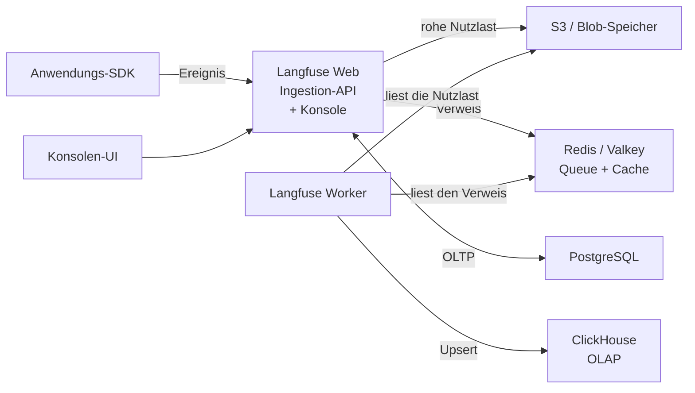
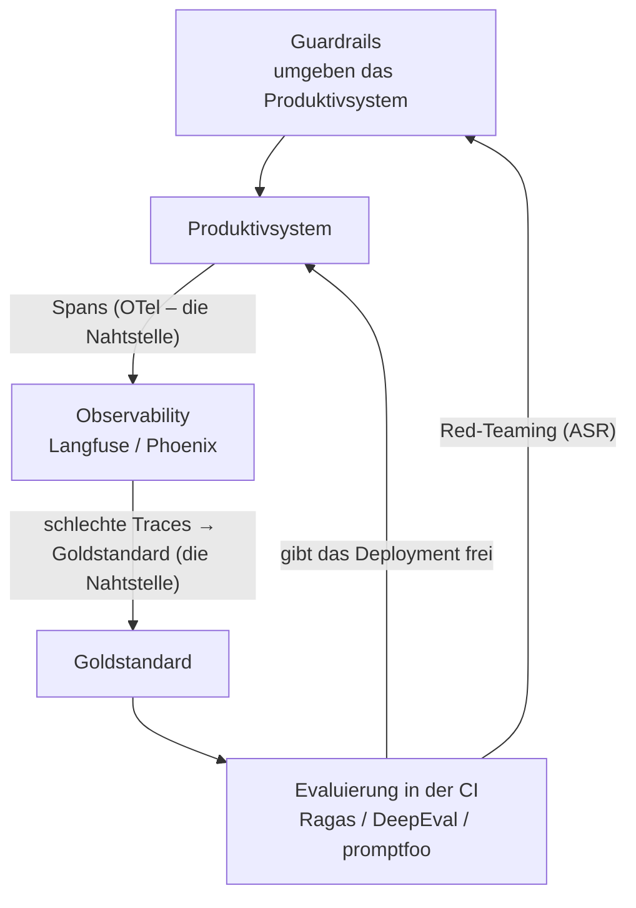

# Vier Datenspeicher, ein selbst geschriebener Validator und die Nahtstellen, die einen Stack zusammenhalten

[Teil 1 der Lektion](./index.md) hat die drei Querschnittsthemen aus Teil I – Evaluierung, Guardrails, Observability – auf die Werkzeuglandschaft von 2026 abgebildet und die Frage beantwortet, die die früheren Lektionen offengelassen hatten: Was installieren Sie, und wann? Am Ende stand eine Standardreihenfolge – zuerst das Tracing, dann die Evaluierung in der CI, dann die Guardrails. Dieser zweite Durchgang nimmt sich dieselbe Werkzeuglandschaft noch einmal vor, diesmal aus der Sicht des Betriebs. Es geht nicht darum, welches Werkzeug Sie wählen, sondern darum, wie Sie eines selbst betreiben, wenn das verwaltete Angebot nicht taugt, wie Sie die Prüfung selbst schreiben, weil keine Bibliothek sie mitliefert, und wie aus den Werkzeugen für Evaluierung, Observability und Guardrails ein einziger Stack wird und nicht drei zusammenhanglose Produkte. Ein Stack heißt hier: Die Werkzeuge bauen aufeinander auf. Alles Folgende ist eine Momentaufnahme von Mitte 2026 (Juli 2026); wie schon in Teil 1 gelten die Produktnamen nur für heute, und Bestand hat die Kategorie, für die sie stehen – diesmal zusätzlich die Gestalt, die der Betrieb annimmt.

## Wo die Theorie steht

Auf dieser Seite geht es um die Verdrahtung, nicht um die Theorie, und es hilft, vorher genau zu sagen, was das ausschließt. Die Konzepte, die die einzelnen Werkzeuge umsetzen, werden einmal erklärt – in den Vertiefungen, zu denen sie gehören – und hier verlinkt statt wiederholt:

- **Das Innenleben der Metriken** – wie Faithfulness, Context Precision und Context Recall als Pipelines im Stil von LLM-as-a-judge berechnet werden – steht in der [Evaluierung](../../part-1-rag/cross-cutting/evaluation/deep-dive.md).
- **Die GenAI Semantic Conventions von OpenTelemetry** – die Namen der Spans und Attribute, das Sampling – stehen in der [Observability](../../part-1-rag/cross-cutting/observability/deep-dive.md). Hier geht es nur darum, einen echten Stack zu instrumentieren und die Spans weiterzuleiten; die Konventionen selbst werden nicht wiederholt.
- **Red-Teaming und die Theorie der Prompt-Injection** – Spotlighting, der Katalog der Injections, die Erfolgsrate der Angriffe, die Pipeline für personenbezogene Daten – stehen in den [Guardrails](../../part-1-rag/cross-cutting/guardrails/deep-dive.md). Hier geht es darum, wie der Betrieb damit umgeht, nicht um die Theorie.
- **Die Evaluierung von Agenten** – die Bewertung der Pfade – steht in [Planung und Schleifen](../../part-2-agents/planning-loops/deep-dive.md) und in [Multi-Agenten-Systemen](../../part-2-agents/multi-agent/deep-dive.md).

Die Aufteilung ist Absicht. Die Definition einer Metrik und die Abwehr einer Injection haben Bestand – einmal gelernt, gelten sie für jedes Produkt, das Sie ausrollen. Die Verdrahtung ist das Gegenteil: Sie ändert sich mit jedem Stack, mit jedem Wechsel des Backends, mit jeder Entscheidung über die Skalierung, und sie ist der Teil, den die Dokumentation eines Werkzeugs vergräbt oder stillschweigend voraussetzt. Dafür ist diese Seite da.

## Langfuse selbst betreiben: kein einzelner Container

Am Anfang steht die Entscheidung, denn es ist eine Entscheidung und keine Voreinstellung. Teil 1 hatte genau einen Grund, zu Langfuse statt zu einem Werkzeug zu greifen, das zuerst als SaaS gedacht ist: Der Kern steht unter MIT, und Sie können ihn innerhalb Ihres eigenen Perimeters betreiben, sodass die Trace-Daten – in denen Prompts, abgerufener Kontext und mitunter Nutzerinhalte stecken – den Perimeter nie verlassen. Wenn Ihre Daten das Haus *verlassen dürfen*, ist Langfuse Cloud als verwaltetes Angebot oder LangSmith schlicht weniger Arbeit, und dann greifen Sie zu. Den Eigenbetrieb nehmen Sie in Kauf, um die Kontrolle zu behalten und über den Speicherort der Daten zu bestimmen. Es ist dieselbe Make-or-Buy-Entscheidung wie in Teil 1; hier ist der Preis aufgeschlüsselt.

Aufgeschlüsselt heißt das: Langfuse ist kein einzelner Prozess. Seit dem stabilen Release von v3 (9. Dezember 2024) ist es ein verteiltes System aus zwei Anwendungsprozessen und vier dahinterliegenden Datenspeichern:

- **Langfuse Web** – der Next.js-Server. Er liefert die Konsolen-UI aus sowie die Ingestion-API und die öffentliche API.
- **Langfuse Worker** – ein asynchroner Worker, der die Queue der eingehenden Ereignisse abarbeitet und die Aufgaben im Hintergrund übernimmt.
- **PostgreSQL** – der transaktionale Speicher (OLTP, die operative Datenbank, die zeilenweise arbeitet): Nutzer, Projekte, Konfiguration, Prompts.
- **ClickHouse** – der analytische Speicher (OLAP, die spaltenorientierte Datenbank, gebaut für Abfragen, die über große Mengen aggregieren). Das ist die auffälligste Änderung in v3. Traces, Observations und Scores – die drei Tabellen mit dem größten Volumen – sind von Postgres nach ClickHouse gewandert, weil Postgres bei Millionen von Zeilen sowohl beim Schreiben als auch beim Abfragen zum Engpass wurde.
- **Redis / Valkey** – die Queue für die Ingestion und ein Cache (API-Schlüssel, Prompts).
- **S3 / Blob-Speicher** – jedes eingehende rohe Ereignis, jede multimodale Eingabe und jeder große Export landet hier zuerst.

Der Grund für diesen ganzen Apparat ist der Pfad der Ingestion, und es lohnt sich, ihn von einem Ende zum anderen zu verfolgen, weil er erklärt, warum sich das bei ernsthaftem Volumen nicht auf einen einzigen Container eindampfen lässt. Ein SDK schickt ein Ereignis an `/api/public/ingestion`. Web schreibt die rohe Nutzlast nach S3, legt einen Verweis in die Redis-Queue und bestätigt sofort – der Client ist wieder frei, bevor irgendetwas wirklich gespeichert ist. Der Worker holt sich den Verweis später aus der Queue, liest die Nutzlast aus S3 zurück und schreibt sie per Upsert nach ClickHouse. Der Endpunkt ist mit Absicht asynchron: Die eigentliche Arbeit läuft außerhalb des Anfragepfads. Schnellt der Verkehr in die Höhe, füllen sich Queue und Objektspeicher, statt dass Clients blockieren oder die Datenbank überflutet wird. Genau dafür sind die Queue, der Blob-Speicher und der OLAP-Speicher da, nämlich um Lastspitzen abzufangen – und genau deshalb hört „einfach als einen Container laufen lassen“ mit dem ersten echten Verkehr aus dem Produktivbetrieb auf zu funktionieren.



Wo Sie es betreiben, richtet sich nach der Größe. **Docker Compose** bringt die ganze Topologie auf einer einzigen Maschine hoch – richtig für die lokale Entwicklung und zum Ausprobieren, aber nicht das Ziel für den Produktivbetrieb. Für den Produktivbetrieb ist **Kubernetes** vorgesehen: das offizielle Helm-Chart, dazu Terraform-Module für AWS, Azure und GCP und für den schnellen Einstieg eine Railway-Vorlage. Die Vorgaben für den Betrieb sind handfest: Betreiben Sie für die Hochverfügbarkeit mindestens zwei Web-Instanzen, skalieren Sie Web automatisch, sobald die CPU-Auslastung 50 % übersteigt, und veranschlagen Sie als Untergrenze grob 2 CPU und 4 GB RAM je Container. Und eine Falle, die Sie einen Nachmittag kostet, wenn Sie sie übersehen: Jeder Container muss in UTC laufen. Bei einer anderen Zeitzone liefern die Abfragen an ClickHouse falsche oder leere Ergebnisse, ohne dass eine Fehlermeldung sagt, warum.

Treten Sie einen Schritt zurück, dann wird der wirkliche Preis sichtbar. Sie betreiben jetzt ein Postgres *und* ein ClickHouse *und* ein Redis *und* einen Objektspeicher, jedes davon will einzeln gesichert und einzeln aktualisiert werden, und jedes kann unabhängig von den anderen ausfallen. Dieser Aufwand im Betrieb – nicht die Lizenzgebühr, die bei null liegt – ist es, was „selbst betreiben“ tatsächlich kostet, und deshalb sollte auf diese zwei Wörter eine Make-or-Buy-Entscheidung folgen und kein `docker compose up`.

Zwei ehrliche Anmerkungen zu dieser Momentaufnahme. Die genaue Liste der Komponenten gilt für Mitte 2026; Langfuse bleibt in Bewegung – 2026 arbeitet das Projekt an einer Vereinfachung, die es selbst „simplify for scale“ nennt, und Langfuse hat sich 2026 mit ClickHouse zusammengetan –, behandeln Sie diese konkrete Topologie also als richtig für heute, nicht als endgültig. Was Bestand hat, ist die *Gestalt*: eine zustandslose Anwendungsschicht plus ein asynchroner Worker, ein OLTP-Speicher für die Konfiguration, ein OLAP-Speicher für die Telemetrie mit dem großen Volumen, eine Queue, die die Ingestion entkoppelt, und ein Objektspeicher für die rohen Nutzlasten. In großem Maßstab sieht jede selbst betriebene Plattform für Traces am Ende so aus, ganz gleich, welche Namen die Produkte tragen.

## Der Validator, den Sie selbst schreiben

Teil 1 hat die Guardrails aufgeteilt – Frameworks orchestrieren, Klassifikatormodelle bewerten – und festgehalten, dass der Guardrails Hub fertige Validatoren von der Stange mitbringt. Hier zählt der **Validator**: Er ist die kleinste Einheit einer selbst gebauten Schutzregel, die Sie tatsächlich selbst schreiben. Ihre fachliche Regel – eine verbotene Formulierung aus der Richtlinie, eine geschäftliche Einschränkung, ein hauseigenes Schema für die Ausgabe – steht meist nicht im Hub, und genau diese Lücke füllen Sie selbst. Die Reihenfolge lautet: erst im Hub nachsehen und nur die Prüfung selbst schreiben, die es nur bei Ihnen gibt.

Ist der Validator schon fertig, installiert der Hub ihn als Paket:

```bash
guardrails hub install hub://guardrails/competitor_check
```

Danach importieren Sie den Validator aus `guardrails.hub` und setzen ihn ein. Für alles andere schreiben Sie selbst einen, und die API ist klein genug, um sie im Kopf zu behalten. Versehen Sie eine Klasse mit `@register_validator`, leiten Sie von `Validator` ab und implementieren Sie eine einzige Methode – `validate` –, die `PassResult()` zurückgibt, wenn der Wert in Ordnung ist, und `FailResult(...)`, wenn nicht:

```python
from typing import Any, Dict
from guardrails import Guard, OnFailAction
from guardrails.validators import (
    Validator, register_validator, PassResult, FailResult,
)

@register_validator(name="my-org/no_secrets", data_type="string")
class NoSecrets(Validator):
    def validate(self, value: Any, metadata: Dict = {}):
        if "BEGIN PRIVATE KEY" in value or "sk-" in value:
            return FailResult(
                error_message="Output leaks a credential.",
                fix_value="[redacted]",
            )
        return PassResult()

guard = Guard().use(NoSecrets, on_fail=OnFailAction.NOOP)  # measure before enforcing
result = guard.validate(model_output)
```

`fix_value` ist bei `FailResult` optional – es ist die programmatische Korrektur, die die Richtlinie `fix` anwendet. Damit sind wir bei dem Teil dieser API, der im Produktivbetrieb wirklich Gewicht trägt: `on_fail`. Sie binden einen Validator mit `.use()` in einen `Guard` ein, und die Aktion **on_fail** (`OnFailAction`) entscheidet, was geschieht, wenn die Prüfung fehlschlägt – und *derselbe* Validator verhält sich völlig anders, je nachdem, wofür Sie sich entscheiden:

- `exception` – eine Ausnahme auslösen und im Zweifel blockieren. Eine harte Sperre.
- `reask` – das Modell erneut auffordern, es noch einmal zu versuchen. Kostet einen weiteren Modellaufruf.
- `fix` – das `fix_value` des Validators anwenden und weitermachen.
- `filter` – den beanstandeten Teil verwerfen, den Rest behalten.
- `refrain` – stattdessen eine sichere oder leere Antwort zurückgeben.
- `noop` – nichts tun, aber es aufzeichnen. Nur beobachten.

Der Kern der Sache: Ob im Fehlerfall blockiert oder durchgelassen wird, ist ein Regler in der Richtlinie und keine Änderung am Code. Liefern Sie einen neuen Validator mit `noop` aus, setzt er nichts durch – aber er *misst*, und Sie kennen die Rate falsch positiver Ergebnisse im echten Produktivverkehr, bevor Sie je einen Nutzer blockieren. Erst wenn diese Rate akzeptabel ist, schalten Sie ihn auf `exception` oder `fix` um. Drehen Sie diese Reihenfolge um – vom ersten Tag an `exception`, bei einem Validator, dessen Rate Sie nie gemessen haben –, dann lehnt eine gut gemeinte Schutzregel im Produktivbetrieb bald berechtigte Anfragen ab.

An zwei Stellen führt das zurück zu Teil 1. Die Prüfung eines Validators kann *selbst* ein Klassifikator für Sicherheitsrisiken sein: Rufen Sie Llama Guard oder Granite Guardian innerhalb von `validate` auf, und schon orchestriert das Framework, während der Klassifikator bewertet – genau die Aufteilung, die Teil 1 beschrieben hat, jetzt als eine einzige Methode ausgedrückt. Und Guardrails AI validiert auch strukturierte Ausgaben, nicht nur freien Text – dieselbe [strukturierte Ausgabe](../../part-2-agents/tool-use/index.md) wie in der Lektion über den Tool-Einsatz –, sodass ein Validator die Einhaltung eines JSON-Schemas Feld für Feld durchsetzen kann.

Halten Sie sich trotzdem zurück, denn ein Validator ist nicht umsonst. Bauen Sie keinen Validator nach, den es im Hub schon gibt. Jeder Validator kostet Latenz und Geld, solange die Anfrage darauf wartet; am teuersten sind `reask`, das einen ganzen zusätzlichen Modellaufruf kostet, und jeder Validator, der seine Prüfung selbst einem LLM-as-a-judge überlässt. Planen Sie ihn also ein wie jede andere synchrone Abhängigkeit. Und testen Sie Validatoren wie jeden anderen Code: Genau hier trifft die Evaluierung in der CI aus Teil 1 auf die Guardrails, denn ein Validator, dessen Rate falsch positiver Ergebnisse nie geprüft wurde und der auf `exception` steht, ist ein Vorfall im Produktivbetrieb, der auf seinen ersten berechtigten Nutzer wartet.

## Der fertig verdrahtete Stack

Jede der drei Kategorien aus Teil 1 gibt es zweimal: einmal quelloffen und im Eigenbetrieb, einmal verwaltet als SaaS. Ausgebreitet sieht die Werkzeuglandschaft so aus.

| Kategorie | Quelloffen, Eigenbetrieb | Verwaltet / SaaS |
| --- | --- | --- |
| **Evaluierung** | Ragas, DeepEval, promptfoo – laufen in der CI | Funktionen der Plattformen für die Evaluierung: Datensätze und Judges von LangSmith / Langfuse / Phoenix; Dienste für die Evaluierung in der Cloud |
| **Observability** | Langfuse (MIT), Phoenix (ELv2, Quelltext einsehbar) | LangSmith (zuerst SaaS), Langfuse Cloud als verwaltetes Angebot |
| **Guardrails** | Guardrails AI, NeMo Guardrails, Llama Guard, Granite Guardian | Bedrock Guardrails, Azure AI Content Safety, Vertex Model Armor |

Halten Sie an der Genauigkeit aus Teil 1 fest: Phoenix steht unter ELv2, der Quelltext ist einsehbar, quelloffen im Sinne der OSI ist es nicht – Sie dürfen es kostenlos selbst betreiben, aber stellen Sie es nicht ohne diesen Vorbehalt neben das MIT-lizenzierte Langfuse.

Die Kategorien gehen ineinander über, und in einem echten Stack sollten Sie das ausnutzen, statt auf einer Einteilung zu beharren. Die Observability-Plattformen bringen Funktionen für die Evaluierung mit, weil ein Trace aus dem Produktivbetrieb *der* Rohstoff für den Goldstandard ist – der Workflow aus Teil 1, aus einem Trace einen Fall für die Evaluierung zu machen, in ein Produkt gegossen. So deckt eine einzige Plattform, sagen wir Langfuse, in aller Regel das Tracing *und* die Datensätze *und* die Evaluierung ab, und eine eigene Bibliothek für die Evaluierung wie Ragas oder DeepEval kommt nur für die einzelnen Metriken dazu, die ihr fehlen. Der Fehler besteht darin, vier Werkzeuge zu kaufen, obwohl zwei einander überlappende das Feld längst abdecken.

Dass diese Produkte überhaupt zusammenspielen, liegt an **OpenTelemetry**, und darauf läuft die ganze Seite hinaus: auf die Verdrahtung im Produktivbetrieb. Sie instrumentieren Ihre Anwendung einmal gegen OTel und richten den Exporter dorthin, wo die Spans landen sollen. Konkret: Eine Bibliothek für die automatische Instrumentierung erzeugt Spans – OpenInference für Phoenix, oder eine Instrumentierung über OpenLLMetry beziehungsweise nach den GenAI-Konventionen von OpenTelemetry. Diese Spans fließen zu einem **OpenTelemetry-Collector** oder direkt über OTLP weiter und von dort über einen Exporter zu Ihrem Backend. Langfuse nimmt OTLP entgegen; Phoenix ist unmittelbar auf OTel und OpenInference aufgebaut. Wenn Sie dann das Backend für die Observability wechseln, ändern Sie die Konfiguration des Exporters und bauen nicht die Anwendung um. Es ist dieselbe Eigenschaft, die Teil 1 benannt hat – einmal instrumentieren und überallhin exportieren –, und hier zeigt sich zum ersten Mal, was sie wert ist. (Die Konventionen für Spans und Attribute selbst – Mitte 2026 noch im Status *Development* – sind Sache der [Observability](../../part-1-rag/cross-cutting/observability/deep-dive.md) und werden hier nicht wiederholt.)

Die Falle, die in der Praxis zuschnappt: nie doppelt instrumentieren. Lassen Sie das SDK-eigene Tracing und die Instrumentierung über OTel gleichzeitig laufen, bekommen Sie jeden Span doppelt – doppelte Daten, doppelte Kosten für die Ingestion und Dashboards, die stillschweigend doppelt zählen. Entscheiden Sie sich für einen Weg, auf dem die Spans entstehen, und schalten Sie den anderen ab.



Das ist die Schleife des Produktivbetriebs aus Teil 1, aber worauf es hier ankommt, sind nicht die Kästen, sondern die Pfeile. Die Schleife wird an zwei Nahtstellen zu einem einzigen System: OTel ist das Bindegewebe zwischen dem Produktivsystem und der Observability, und die Aufnahme eines Traces in den Goldstandard ist die Übergabe zwischen Observability und Evaluierung. Bringen Sie diese beiden Nahtstellen in Ordnung, dann schließt sich die Schleife; sonst haben Sie drei Produkte, die nie miteinander reden.

Ein Pfeil in diesem Diagramm ist selbst eine Betriebspraxis, die es festzuhalten lohnt. Red-Teaming ist hier eine Frage der Häufigkeit und der Werkzeuge, nicht der Theorie – der Katalog der Injections und die Mechanik der Angriffe bleiben bei den [Guardrails](../../part-1-rag/cross-cutting/guardrails/deep-dive.md). Im Betrieb heißt das: Planen Sie Red-Teaming-Durchläufe fest ein, in der CI oder vor einem Release. Dafür gibt es die Red-Teaming-Funktionen von promptfoo, die eigenen Red-Teaming-Werkzeuge einer Plattform oder PyRIT aus der Vertiefung zu den Guardrails. Und verfolgen Sie die Erfolgsrate der Angriffe von Release zu Release als Metrik für Regressionen, so wie Sie jede andere Zahl verfolgen, die nicht in die falsche Richtung driften darf. Verdrahtung und Zeitplan – die Theorie steht in der verlinkten Lektion.

## Das Wichtigste

- Diese Seite ist Betrieb, nicht Theorie: Das Innenleben der Metriken, die Konventionen von OTel, die Abwehr von Injections und die Bewertung der Pfade stehen in den Vertiefungen, zu denen sie gehören; diese Seite verlinkt sie und wiederholt sie bewusst nicht.
- Wer Langfuse selbst betreibt (v3, seit Dezember 2024), betreibt ein verteiltes System und keinen Container: Web + Worker + Postgres (OLTP) + ClickHouse (OLAP, mit den Traces, Observations und Scores) + Redis/Valkey (Queue und Cache) + S3/Blob (rohe Ereignisse). Die asynchrone Ingestion über die Queue fängt Lastspitzen ab, und Sie betreiben jetzt vier Datenspeicher; dieser Aufwand im Betrieb, nicht die Lizenz, ist der Preis dafür, die Daten innerhalb des Perimeters zu halten.
- Wo Sie Langfuse betreiben, richtet sich nach der Größe: Docker Compose für die Entwicklung, Kubernetes über Helm oder Terraform für den Produktivbetrieb – mindestens zwei Web-Instanzen, automatisches Skalieren jenseits von 50 % CPU-Auslastung und jeder Container in UTC, sonst liefert ClickHouse leere Ergebnisse.
- Ein eigener Validator für Guardrails AI ist die Einheit einer selbst gebauten Schutzregel: `@register_validator` plus eine Unterklasse von `Validator`, deren `validate()` `PassResult` oder `FailResult` zurückgibt, eingebunden mit `Guard().use(...)`. Sehen Sie zuerst im Hub nach.
- `on_fail` ist ein Regler in der Richtlinie und kein neuer Code: Beginnen Sie mit `noop`, um die Rate falsch positiver Ergebnisse im echten Produktivverkehr zu messen, und schalten Sie dann auf `exception` / `fix` / `filter` / `refrain` um. Jeder Validator kostet Latenz und Geld – testen Sie ihn wie jeden anderen Code.
- Jede Kategorie gibt es quelloffen im Eigenbetrieb und verwaltet als SaaS, und die Kategorien gehen ineinander über (die Observability-Plattformen bringen die Evaluierung mit), weshalb zwei einander überlappende Werkzeuge besser sind als vier. OpenTelemetry ist das Bindegewebe: einmal instrumentieren, das Backend über die Konfiguration des Exporters tauschen und nie doppelt instrumentieren.

**[Neue Begriffe](../../glossary.md#tooling-ecosystem)**: instrumentation, OpenTelemetry GenAI conventions, safety classifier, red-teaming, observability, guardrails.
