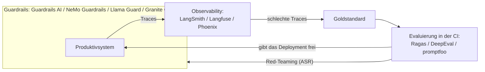

# Die Schuld aus Teil I begleichen

Drei Lektionen in Teil I stellten am Ende denselben Schuldschein aus.
[Evaluierung](../../part-1-rag/cross-cutting/evaluation/index.md),
[Guardrails](../../part-1-rag/cross-cutting/guardrails/index.md) und
[Observability](../../part-1-rag/cross-cutting/observability/index.md) erklärten jeweils ein Prinzip und
schoben die Frage nach den Produkten auf: „Die Werkzeuge sind eine eigene Schicht, die erst später an die Reihe kommt; hier
geht es um das Prinzip.“ Später ist jetzt. Die Konzepte haben Sie aus Teil I – den Goldstandard, den Trace, die
Erfolgsrate der Angriffe. Diese Lektion bildet sie auf die Werkzeuglandschaft von 2026 ab und beantwortet die
Frage, die die früheren Lektionen offengelassen haben: Was installieren Sie tatsächlich, und wann?

Eine einzige Regel ordnet alles Folgende. Zu jedem der drei Querschnittsthemen hat sich eine eigene
Werkzeugkategorie herausgebildet, aber die Konzepte haben Bestand, und die Werkzeuge sind Momentaufnahmen.
Beurteilen Sie ein Werkzeug deshalb danach, welches Konzept es umsetzt und welchen Platz es in Ihrer Schleife
einnimmt – nicht nach der Länge seiner Funktionsliste.

Rechnen Sie außerdem damit, dass die Kategorien ineinander übergehen. Die Observability-Plattformen –
[LangSmith](https://www.langchain.com/langsmith), [Langfuse](https://langfuse.com),
[Phoenix](https://arize.com/phoenix) – bringen allesamt auch Funktionen für die Evaluierung mit: Datensätze,
Judges, Bewertungsdurchläufe. Das ist die **Rückkopplungsschleife** aus der Observability-Lektion, in ein
Produkt gegossen – der Kreis, der sich dort schließt. Aus einem Trace aus dem Produktivbetrieb wird ein Fall
für die Evaluierung, und das ist ein einziger Workflow; die Werkzeuge sind so gewachsen, dass sie beide Enden
abdecken.

## Werkzeuge für die Evaluierung

**[Ragas](https://ragas.io)** ist eine quelloffene Bibliothek für RAG-spezifische Metriken: Faithfulness,
Response Relevancy, Context Precision, Context Recall – die meisten davon im Stil von LLM-as-a-judge
berechnet. Eine Anmerkung zur Zuordnung: Response Relevancy heißt die Metrik, die früher Answer Relevancy
hieß, und damit ist bei Ragas die Answer-Relevance gemeint, die Sie aus der Lektion zur Evaluierung kennen.
Die Namen decken sich unmittelbar mit dem Vokabular aus Teil I, samt der Trennung zwischen Retrieval und
Generation:
Context Precision und Context Recall bewerten die Retrieval-Seite, Faithfulness und Response Relevancy die
Generation-Seite. Ragas kann aus Ihrem Korpus außerdem einen ersten Testdatensatz erzeugen, den Sie dann
gegenlesen.

**[DeepEval](https://deepeval.com)** ist ebenfalls quelloffen und setzt auf pytest: Ein Fall für die
Evaluierung ist ein Unit-Test – `assert_test`, eine Metrik, ein Schwellenwert –, sodass die Evaluierung in der
CI genauso läuft wie jede andere Testsuite. Wenn Ihr Team ohnehin in pytest zu Hause ist, geht der Aufwand für
die Einführung gegen null.

Das dritte Werkzeug, **[promptfoo](https://www.promptfoo.dev)**, ist quelloffen und wird über die
Konfiguration gesteuert: YAML-Dateien beschreiben Prompts, Modelle und Zusicherungen, und das Werkzeug stellt
Prompts und Modelle in Vergleichsmatrizen nebeneinander und läuft in der CI. Es bringt außerdem Funktionen
für das Red-Teaming mit – merken Sie sich das für den Abschnitt über die Guardrails.

Und jetzt der Teil, den kein Werkzeug mitliefert: der Goldstandard. Jedes dieser Werkzeuge berechnet seine
Metriken anhand der Beispiele, die *Sie* beisteuern, und für die Qualität des Datensatzes bleiben Sie
zuständig. Der Satz
aus Teil I, „ein kleiner, sauberer Datensatz schlägt einen großen, verrauschten“, hört nicht auf zu gelten,
nur weil die Metriken jetzt aus einer Bibliothek kommen. Ragas macht Ihnen Vorschläge für Beispiele, aber
über die Qualität entscheidet nach wie vor die Prüfung durch einen Menschen.

## Observability-Plattformen

**[LangSmith](https://www.langchain.com/langsmith)** ist die Plattform für Tracing und Evaluierung im
Ökosystem von [LangChain](https://www.langchain.com) – zuerst SaaS; die Möglichkeit, es selbst zu betreiben,
bleibt den Enterprise-Abos vorbehalten. Wenn Sie ohnehin auf LangChain oder
[LangGraph](https://www.langchain.com/langgraph) setzen, ist die Anbindung nirgends enger.

**[Langfuse](https://langfuse.com)** ist quelloffen – der Kern steht unter MIT, einzelne Funktionen für
Unternehmenskunden erfordern eine Lizenz – und lässt sich mit Docker oder Kubernetes selbst betreiben: die
erste Wahl, wenn die Daten Ihren Perimeter nicht verlassen dürfen. Abgedeckt sind Tracing, Prompt-Management,
Datensätze und Evaluierung sowie Kostendashboards.

**[Arize Phoenix](https://arize.com/phoenix)** bietet Tracing und Evaluierung und lässt sich selbst betreiben,
„auf [OpenTelemetry](https://opentelemetry.io) aufgebaut, mit der Instrumentierung durch
[OpenInference](https://github.com/Arize-ai/openinference)“, wie es die eigene Dokumentation formuliert. Eine
Anmerkung zur Lizenz, bei der sich Genauigkeit lohnt: Phoenix steht unter ELv2 – der Quelltext ist
einsehbar, Sie dürfen es kostenlos selbst betreiben, quelloffen im Sinne der OSI ist es aber nicht. Stellen
Sie es deshalb nicht ohne diesen Vorbehalt neben das MIT-lizenzierte Langfuse.

Alle drei ruhen zunehmend auf demselben anbieterneutralen Unterbau: **OpenTelemetry**, kurz OTel. Die **GenAI
Semantic Conventions von OpenTelemetry** vereinheitlichen die Namen der Spans und Attribute für
Modellaufrufe – welches Modell, wie viele Token, welche Tool-Calls –, sodass Ihre **Instrumentierung**, also
die Stellen im Code, an denen Traces und Metriken aus der Pipeline entstehen, von jedem einzelnen Anbieter
unabhängig bleibt: einmal instrumentieren und danach exportieren, wohin Sie wollen. Ein Vorbehalt,
der ins Gewicht fällt: Mitte 2026 haben diese Konventionen noch den Status *Development* – experimentell und in
Bewegung. Sie liegen inzwischen in einem eigenen Repository, `open-telemetry/semantic-conventions-genai`, das
auch Konventionen für [MCP](https://modelcontextprotocol.io) abdeckt – das Protokoll aus
[MCP und Agentenprotokolle](../../part-2-agents/mcp/index.md) bekommt damit sein Vokabular für die
Observability.

Sehen Sie von den Markennamen ab, dann bleibt bei allen drei Plattformen genau eine Sache übrig: der Baustein aus der
Observability-Lektion. Der Trace aus Spans – Abfrage → Chunks samt Score → Prompt → Ausgabe des Modells →
Schritte des Agenten –, dazu Kosten und Latenz, aufgeschlüsselt pro Span, dazu das an den Trace geheftete
Nutzerfeedback, dazu eine Schaltfläche, die sinngemäß sagt: „Diesen schlechten Trace als Fall in die
Evaluierung aufnehmen.“ Die Rückkopplungsschleife als Produktfunktion. Genau deshalb sind bei diesen
Plattformen auch Funktionen für die Evaluierung hinzugekommen: Wer die Traces hat, hat den Rohstoff für den
Goldstandard.

:::tip[▶ Video]

<YouTube id="446x7GqXdaA" title="AI Agents Best Practices: Monitoring, Governance, & Optimization — IBM Technology" />

Wie Monitoring, Governance und Optimierung für agentische Systeme im Produktivbetrieb aussehen – die
Werkzeugkategorien dieser Lektion in Bewegung. (Das Video ist auf Englisch.)

:::

## Guardrails-Werkzeuge

Guardrails-Produkte gibt es in zwei Bauformen. Die erste besteht aus Frameworks, die Eingabe und Ausgabe mit
programmierbaren Prüfungen umgeben: **[Guardrails AI](https://www.guardrailsai.com)** – eine
Python-Bibliothek für Validatoren, dazu der Guardrails Hub, einschließlich der Validierung strukturierter
Ausgaben – und NVIDIA **[NeMo Guardrails](https://developer.nvidia.com/nemo-guardrails)**, wo die *rails* des
Dialogs in einer Konfigurationssprache namens Colang festgelegt werden.

Die zweite Bauform ist **der Klassifikator für Sicherheitsrisiken** – ein Modell, das Text nach
Risikokategorien bewertet: **Llama Guard** von Meta und
**[Granite Guardian](https://github.com/ibm-granite/granite-guardian)** von IBM, kompakte spezialisierte
Modelle, die Sie auf der Eingabeseite, auf der Ausgabeseite oder auf beiden Seiten einsetzen. Frameworks orchestrieren,
Klassifikatormodelle bewerten. Und die beiden Bauformen lassen sich verbinden: In einem Framework kann eine *rail* ein Klassifikatormodell
als eine ihrer Prüfungen aufrufen.

Auch hier stellt sich die **Make-or-Buy-Entscheidung** – dieselbe wie überall in Teil III. Dieselben Konzepte
gibt es als verwaltete Dienste der Plattformen: Bedrock Guardrails, Azure AI Content Safety, die
Sicherheitsfilter von Vertex und Model Armor, alle bekannt aus
[der Lektion über die Cloud-Plattformen](../cloud-platforms/index.md). Von der Plattform verwaltet heißt:
weniger Kontrolle, keine Wartung, ein einziger Anbieter; quelloffen heißt: volle Kontrolle, eigener Betrieb.

Und die Qualität der Guardrails wird selbst gemessen – die Metrik dafür kennen Sie aus Teil I, die
**Erfolgsrate der Angriffe** (*attack success rate*, **ASR**). **Red-Teaming** liefern die Produkte für die
Evaluierung gleich mit: die Red-Teaming-Funktionen von promptfoo und die eigenen Red-Teaming-Werkzeuge der
Plattformen. Damit schließt sich der Kreis: Guardrails werden eingerichtet,
angegriffen, gemessen und nachgebessert.

## Wann Sie was einführen

Die Reihenfolge unten ist eine Ermessensfrage – eine vernünftige Voreinstellung für ein typisches Produktteam,
kein Industriestandard –, aber die Begründung für jeden einzelnen Schritt hält stand.

1. **Zuerst das Tracing.** Es lässt sich am billigsten nachrüsten – nötig sind nur ein SDK und ein
   Exporter –, und Sie brauchen es, um überhaupt einen Fehler finden zu können. Ohne Traces sehen Sie Ihre
   Fehler nicht einmal, vom Beheben ganz zu schweigen.
2. **Die Evaluierung in der CI**, sobald Sie anfangen, an der Pipeline zu drehen: als Schutz vor
   **Regressionen** (durch eine Änderung verursachte Verschlechterungen), das *eval-driven development* aus
   Teil I. Sie kommt aus einem ehrlichen Grund an zweiter Stelle: Die Evaluierung braucht einen Goldstandard,
   und ein Goldstandard macht Arbeit.
3. **Die Guardrails**, sobald Sie sich echten Nutzern und einer echten Angriffsfläche nähern – früher, wenn
   die Domäne reguliert ist oder die Eingaben vom ersten Tag an feindlich sind. Guardrails brauchen ein
   Bedrohungsmodell, und ein Bedrohungsmodell entsteht meist erst im Gebrauch.

Hier ist die ganze Schleife des Produktivbetriebs, diesmal mit den Namen der Produkte – die Verknüpfung mit
Teil I, in Produktform:

Wie diese Schleife nach dem Release weiterlebt, ist das Thema [der LLMOps-Lektion](../llmops/index.md).

Ein einziges Antimuster kann dieses ganze Diagramm zur Lüge machen: Ein Werkzeug für die Evaluierung
einzuführen ist nicht dasselbe, wie zu evaluieren. Lassen Sie ein Werkzeug über einen flachen, verrauschten
Datensatz laufen, bekommen Sie selbstbewusst wirkende Dashboards, die nichts als Müll anzeigen – so stand es
schon in Teil I: „Ohne Referenz
bricht die ganze Evaluierung in sich zusammen“, und daran ändert ein Produktlogo obendrauf nichts. Werkzeuge
verstärken Disziplin, sie ersetzen sie nicht.

## Das Wichtigste

- Die Konzepte haben Bestand, die Werkzeuge sind Momentaufnahmen – beurteilen Sie ein Werkzeug danach, welches
  Konzept aus Teil I es umsetzt und welchen Platz es in Ihrer Schleife einnimmt.
- Die großen Observability-Plattformen (LangSmith, Langfuse, Phoenix) haben Funktionen für die Evaluierung
  dazubekommen, weil aus einem Trace aus dem Produktivbetrieb ein Fall für die Evaluierung wird: ein einziger
  Workflow, und die Werkzeuge decken beide Enden ab.
- Die Metriknamen von Ragas sind das Vokabular aus Teil I (Response Relevancy = die frühere Answer Relevancy);
  DeepEval macht aus Fällen für die Evaluierung Unit-Tests in pytest; promptfoo liefert YAML-gesteuerte
  Vergleichsmatrizen und dazu Red-Teaming.
- Den Goldstandard nimmt Ihnen kein Werkzeug ab: Für die Qualität des Datensatzes bleiben Sie zuständig, und ein Mensch
  liest auch die erzeugten Beispiele weiterhin gegen.
- Die GenAI-Konventionen von OpenTelemetry sind der entstehende anbieterneutrale Unterbau, Mitte 2026 noch
  experimentell: einmal instrumentieren, überallhin exportieren. Phoenix steht unter ELv2, der Quelltext ist
  einsehbar – quelloffen im Sinne der OSI ist es nicht.
- Guardrails-Werkzeuge: Frameworks (Guardrails AI, NeMo Guardrails) orchestrieren, Klassifikatoren für
  Sicherheitsrisiken (Llama Guard, Granite Guardian) bewerten, und dieselben Konzepte gibt es als verwaltete
  Dienste der Plattformen – die übliche Make-or-Buy-Entscheidung. Messen Sie sie im Red-Teaming an der
  Erfolgsrate der Angriffe.
- Standardreihenfolge der Einführung: Tracing → Evaluierung in der CI → Guardrails.

**[Neue Begriffe](../../glossary.md#tooling-ecosystem)**: instrumentation, OpenTelemetry GenAI conventions, safety classifier, red-teaming.

---

:::note[Als Nächstes: Teil 2 der Lektion]

**[Selbst betreiben und verdrahten](./deep-dive.md)** – der zweite Durchgang durch denselben Stack, diesmal
auf der Betriebsebene: Langfuse auf eigener Infrastruktur ausrollen (Topologie, Speicher, Skalierung); eigene
Validatoren für Guardrails AI schreiben; und die Werkzeuge für Evaluierung, Guardrails und Observability –
verwaltete wie quelloffene – zu einem einzigen Stack verdrahten, also zu einer Reihe aufeinander aufbauender
Werkzeuge.

Die Theorie, die jedes Werkzeug umsetzt, steht anderswo; diese Seite verweist darauf, statt sie zu
wiederholen: das
Innenleben der Ragas-Metriken in der [Evaluierung](../../part-1-rag/cross-cutting/evaluation/deep-dive.md),
die GenAI-Konventionen von OpenTelemetry in der
[Observability](../../part-1-rag/cross-cutting/observability/deep-dive.md), Red-Teaming und die Abwehr von
Injections in den [Guardrails](../../part-1-rag/cross-cutting/guardrails/deep-dive.md) und die Bewertung der
Pfade, die ein Agent nimmt, in [Planung und Schleifen](../../part-2-agents/planning-loops/deep-dive.md) sowie
[Multi-Agenten-Systemen](../../part-2-agents/multi-agent/deep-dive.md).

Siehe auch die benachbarten Lektionen aus Teil III: [Bereitstellung und Betrieb](../serving/index.md),
[Cloud-KI-Plattformen](../cloud-platforms/index.md) und [LLMOps](../llmops/index.md).

:::
