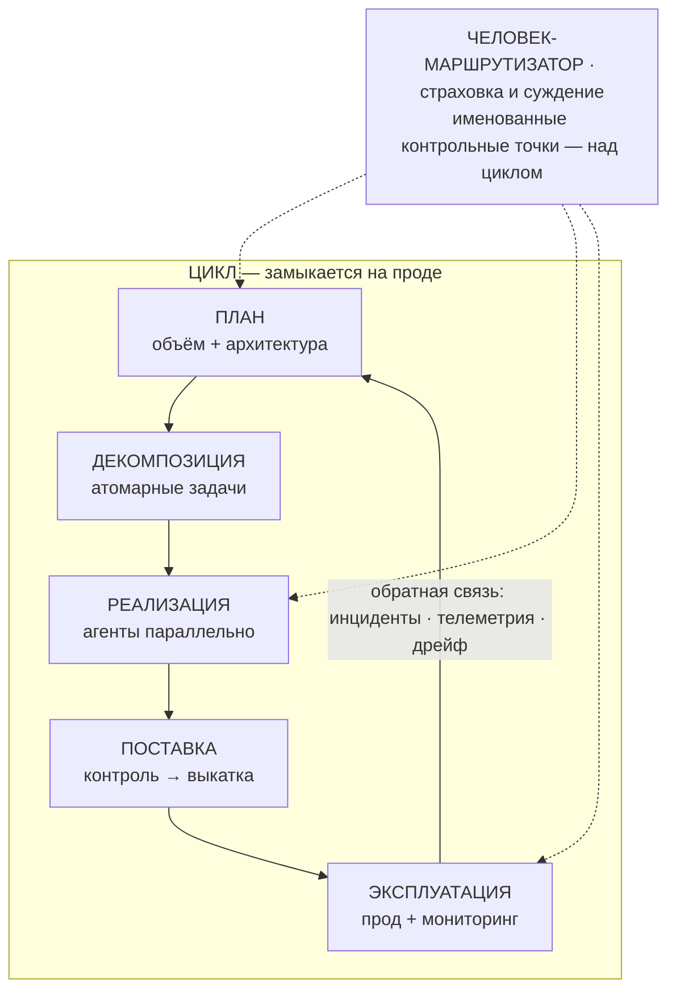

# Как читать этот курс

Строить софт силами целого флота агентов-разработчиков — это не задача про промпты, а задача про проверку. Генерация стала дешёвой, проверка — нет. В основе всего, чему учит этот курс, лежат механизмы, которые позволяют масштабировать проверку. Описанный здесь контур обратной связи должен замыкаться на **проде**, а не на внутреннем QA. Если до начала уроков ты запомнишь только одну мысль, запомни вот что: ценность всей этой скорости определяет твоя способность проверять результат, а не способность модели его выдавать.

:::tip[▶ Видео]

<YouTube id="4wMRXmLpdA8" title="AI in the SDLC: Rethinking AI Coding Tools & AI Agents — IBM Technology" />

IBM разбирает тот же сдвиг в жизненном цикле разработки: инструменты для написания кода вышли за рамки автодополнения и теперь действуют как агенты. (Видео на английском.)

:::

## Карта всего курса \{#course-map}

В одной схеме собрана логика всего курса. Читай её как цикл: последовательностью она только кажется. Весь смысл рисунка — в обратной связи, которая передаёт происходящее на проде обратно в планирование.

Верхняя полоса показывает роль человека. В отрасли для неё принят термин **человек-в-цикле (human-in-the-loop, HITL)**. В этом курсе мы намеренно вводим другое имя — **человек-маршрутизатор**. Он остаётся над циклом: задаёт ограничения, выносит профессиональные суждения и подключается в нескольких заранее названных контрольных точках. Поэтому линии пунктирные: человек подключается к работе лишь в выбранных местах; непрерывно он её не сопровождает.

Ровно три вещи схема намеренно не рисует отдельными блоками: иначе она учила бы неверному.

:::note[Прочитай то, что схема намеренно не выделяет в отдельные блоки]

- **Проверка** — не отдельный этап: она проходит через каждый стык цикла. Результат рецензируют люди, сгенерированную работу повторно проверяет агент-критик, а блокирующие проверки выполняются и выдают однозначный вердикт. Если поместить всё это в один блок, легко решить, будто можно «выполнить этап проверки» и двигаться дальше. Такая модель неверна: проверка живёт между блоками, а не внутри одного из них.

- **Фундамент** (часть I) лежит под всем циклом. В него входят память проекта, правила как код и артефакты как единственный интерфейс между этапами. Всё это должно работать ещё до того, как агент напишет первую строку.

- **Три уровня зрелости: соло · команда · энтерпрайз** применяются к каждому элементу схемы. Поэтому каждый элемент схемы нужно рассмотреть на всех трёх уровнях зрелости. Практика остаётся неизменной, а обеспечивающий её механизм масштабируется.

:::

*Эта карта — буквально оглавление курса.* Пять этапов цикла — планирование, декомпозиция, реализация, поставка и эксплуатация — соответствуют частям II–IV, посвящённым самой работе. Фундамент соответствует части I, а три уровня зрелости — части V. В начале каждой части объясняется, где она находится на этой карте, и даётся ссылка сюда, чтобы ты всегда видел, где находишься.

## Честный тезис и честный метод

Объём результата вырос — это измеримо. Повысилась ли *ценность*, пока не установлено. Она может вырасти или снизиться в зависимости от того, справится ли команда с узким местом проверки — рецензированием и проверкой результата. Это не попытка уйти от ответа. Исследователи Microsoft зафиксировали один из крупнейших измеренных приростов пропускной способности в этой области — и всё же сами пишут, что слитый pull request не равен созданной им ценности, а общепринятых способов измерить разрыв между ними пока нет.

Поэтому курс придерживается трёх правил и не подгоняет материал под заранее выбранный вывод:

- Каждое утверждение получает уровень доказательности: `MEASURED` означает, что результат получен в контролируемом исследовании; `REPORTED` — что практики наблюдают его в работе; `ASSERTED` — что кто-то выдвигает утверждение и приводит доводы в его пользу. Мы указываем уровень прямо в тексте и не даём предположению незаметно сойти за факт. Полный словарь этих обозначений дан в уроке 2.

- Для каждого числа мы указываем датированный первоисточник. К данным поставщиков применяем простое правило: тот, кто продаёт инструмент, не может сам измерять его эффект.

- Пересказы искажают картину в обе стороны. Сторонники раздувают результаты, скептики цепляются за устаревшее число и продолжают применять его к изменившейся реальности. Средство одно: обратиться к первоисточнику, определить уровень доказательности результата и назвать этот уровень. Такому отношению к доказательствам курс и учит.

Во всём курсе мы применяем **три уровня зрелости: соло · команда · энтерпрайз**. Короткая формула такова: практика постоянна, механизм масштабируется. Для каждого средства контроля уроки сначала показывают инвариант, затем описывают механизм на каждом уровне и, наконец, объясняют, какой именно сбой должен предотвратить механизм следующего уровня. Переход к нему они обосновывают риском этого сбоя, а не тем, что «у энтерпрайза больше денег». Более точная версия этой идеи звучит на протяжении всего курса и опирается на радиус поражения (*blast radius*): чем дальше средство контроля от эпицентра возможного сбоя, тем больше оно связано с *доказательством*; чем ближе, тем важнее *способность действовать*.

## Почему цикл, а не конвейер

Многие схемы — включая практические материалы, на которые опирается этот курс, — изображают конвейер, который заканчивается на «проде» и не передаёт обратную связь в планирование. Курс старается исправить этот недостаток. В нынешних текстах контур обратной связи обычно замыкается на внутреннем QA и не доходит до эксплуатации живой системы. Это их главный структурный пробел. В хорошо организованном цикле *сама система* обнаруживает и откатывает неудачное изменение — ещё до того, как пользователю придётся пожаловаться.

Есть измеренный сигнал, что ценность скрывается именно в замыкающей цикл обратной связи. В отчёте DORA за 2025 год внедрение AI отрицательно связано со *стабильностью* поставки: ускорение может обнажать слабые места на последующих этапах. Однако читай этот результат внимательно: категория `MEASURED` применима здесь лишь в слабом смысле — это опрос примерно 5000 респондентов, которые сами оценивали свой опыт. В основе результата лежит восприятие респондентов, а не телеметрия. На основании такого результата нельзя утверждать ни «AI ускоряет команды», ни «AI замедляет команды». Из него следует ровно одно: замыкающая цикл обратная связь заслуживает того внимания, которое ей уделяют части IV и V.

И последнее честное замечание о самой схеме. Это организационная рамка категории `ASSERTED` — так мы упорядочиваем материал курса. Не доказано, что она оптимально описывает жизненный цикл. Используй её для навигации, но не ссылайся на неё как на установленный результат.

## Куда двигаться дальше

Фундаменту посвящена часть I. В ней пять уроков:

1. **[Узкое место проверки (verification bottleneck)](./part-1-foundation/verification-bottleneck.md)** — доказательства приведённого выше тезиса.
2. **[Как читать доказательства](./part-1-foundation/reading-the-evidence.md)** — шкала категорий и то, как вторичные источники искажают картину в обе стороны.
3. **[Подготовка важнее модели](./part-1-foundation/preparation-over-model.md)** — почему содержимое, которое ты передаёшь агенту, важнее выбора самого агента.
4. **[Память проекта и слои знаний](./part-1-foundation/project-memory-and-tiering.md)** — сохраняющийся между прогонами и сессиями контекст для флота агентов-разработчиков.
5. **[Правила, которые нельзя обойти](./part-1-foundation/rules-that-hold.md)** — как превратить договорённости в ограничения, соблюдение которых обеспечивает машина.

Начни с урока 1: он доказывает тезис, на котором построен весь остальной курс.
