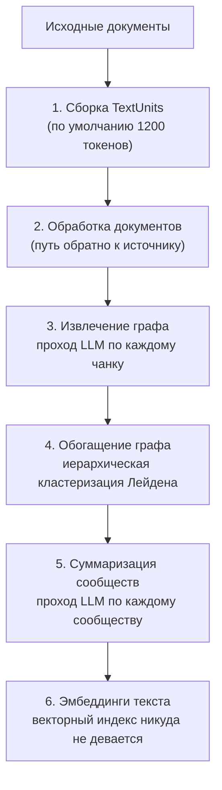

# Как извлекать структуру, чем её проверять и как делать к ней запросы

[Часть 1](./index.md) приняла три решения: когда структуру вообще стоит извлекать, когда граф окупает её построение и что даёт семантический слой, как только два человека разошлись в одном числе. Она намеренно оставалась на уровне решения и не спускалась в механику. Эта страница вскрывает механику под каждым из трёх: как конвейер извлечения превращает прозу в граф и во что это обходится по стадиям; почему именно шаг слияния — то место, где такие проекты разочаровывают; почему метрики поиска, которые у тебя уже есть, не скажут, хорош ли граф; что на самом деле *делает* каждый из четырёх стандартов формального стека — RDF, OWL, SHACL, SPARQL; и почему навести модель на схему хранилища труднее, чем на определение метрики. Последняя треть страницы — про то, как всё это спрашивают: четыре метода запроса к графу, text-to-SQL поверх семантического слоя и маршрутизатор перед обоими путями.

Одну границу обозначим сразу. Всё здесь по-прежнему **статическое**: структуру строят до вопроса, а вопрос выбирает путь по ней. В тот момент, когда система начинает сама решать, сходить ли ещё раз — переформулировать, поискать заново, оценить достаточность контекста, — ты уже в [agentic RAG](../../part-2-agents/agentic-rag/deep-dive.md), и его цикл может дёргать граф как ещё один инструмент. Решения Части 1 всюду предполагаются известными и заново не обсуждаются.

## Как граф строится на самом деле

Разбирать это удобнее всего на эталонной реализации — GraphRAG от Microsoft: про неё читатель хотя бы слышал, и её конвейер описан по стадиям. [Поток индексации](https://microsoft.github.io/graphrag/index/default_dataflow/) состоит из шести фаз:

1. **Сборка TextUnits** — нарезка исходных документов. Единица по умолчанию — 1200 токенов, и это уже проектное решение: крупнее единица — меньше вызовов на извлечение и больше сущностей на вызов, но и меньше шансов, что модель припишет связь правильной паре.
2. **Обработка документов** — таблица документов, чтобы у извлечённых фактов остался путь обратно к источнику.
3. **Извлечение графа** — проход LLM, порождающий **сущности**, **связи** и **утверждения** (в GraphRAG они лежат в поле `covariates`): утверждение — это факт, привязанный к сущности, со своим статусом и временными границами. Это дорогая фаза и та, от которой зависит, будет ли верным хоть что-то ниже по течению.
4. **Обогащение графа** — выделение сообществ по графу сущностей, из чего получается таблица сообществ.
5. **Суммаризация сообществ** — проход LLM по каждому сообществу, порождающий **отчёты о сообществах**.
6. **Эмбеддинги текста** — векторы, потому что граф не заменяет векторный индекс.

Из этого списка стоит вытащить две детали: первая объясняет, почему глобальные вопросы вообще работают, вторая меняет то, как ты будешь считать бюджет построения.

Сообщества выделяют **иерархически, рекурсивно применяя алгоритм Лейдена (hierarchical Leiden)**. Именно иерархия и делает возможными глобальные вопросы: кластеризация даёт не одно плоское разбиение, а вложенные уровни, так что отчёт существует и для маленького плотного кластера, и для широкой области, которая его содержит. Каждый отчёт несёт краткую сводку и ссылается на ключевые сущности, связи и утверждения. Поэтому global search есть на что опереться: кто-то — LLM, на этапе построения, за твой счёт — уже написал эту сводку.

**Извлечение утверждений** опционально и по умолчанию выключено. Документация прямо говорит, что оно «обычно требует подгонки промптов, чтобы приносить пользу». Это на удивление честная настройка по умолчанию и полезный сигнал: вендор сообщает тебе, что самая содержательная часть извлечения — она же самая чувствительная к твоей предметной области. Кто бы ни оценивал тебе стоимость построения графа по демонстрационному запуску, он почти наверняка её не включал.

Теперь посмотри, какие фазы формируют счёт. Фазы 3 и 5 — это два прохода LLM по всему корпусу: один по каждому чанку, второй по каждому сообществу. Именно это Часть 1 имела в виду, говоря, что извлечение тарифицируется как проход по всему. И именно поэтому существует [LazyGraphRAG](https://www.microsoft.com/en-us/research/blog/lazygraphrag-setting-a-new-standard-for-quality-and-cost/): он откладывает ровно эти проходы на время запроса, а стоимость своей индексации заявляет как «identical to vector RAG and 0.1% of the costs of full GraphRAG» — вровень с обычным векторным RAG и 0,1% от полного построения GraphRAG. Если глобальных вопросов у тебя мало, отложить работу — лучшая сделка, и это твой выбор при проектировании, а не неотъемлемое свойство графов.

## Четыре метода запроса GraphRAG и вопрос под каждый

Граф — это не один режим поиска. [Методы запроса](https://microsoft.github.io/graphrag/query/overview/) GraphRAG — четыре разных пути по одному индексу, и выбор между ними и есть большая часть инженерии:

| Метод | По чему работает | Под какой вопрос |
|---|---|---|
| **local search** | извлечённый граф **плюс** сырые чанки текста | конкретная сущность и её окрестность |
| **global search** | все отчёты о сообществах, map-reduce | корпус целиком |
| **DRIFT search** | контекст сообществ, подмешанный в локальный запрос | локальный вопрос, которому нужна широкая рамка |
| **basic search** | TextUnits по векторной близости | базовая линия обычного RAG, поставляется для сравнения |

**local search** по-прежнему читает чанки. Он «сочетает подходящие данные из извлечённого AI графа знаний с кусками текста исходных документов»: структуру даёт граф, а доказательство по-прежнему даёт проза. Граф не освобождает тебя от хорошего чанкинга — он ложится сверху.

**global search** — это map-reduce по каждому отчёту о сообществе, и документация прямо называет его ресурсоёмким («resource-intensive»). Каждый глобальный вопрос разветвляется по всему набору отчётов и сводит частичные ответы в один. Значит, граф стоит денег не только на построении: те самые запросы, ради которых его строили, ещё и самые дорогие в исполнении.

**DRIFT** существует потому, что деление на локальное и глобальное слишком чистое. Он уточняет запрос до уточняющих подвопросов, пользуясь контекстом сообществ, и тем добавляет локальному запросу более широкий исходный контекст. Это декомпозиция запроса — приём, которому уже учит [agentic RAG](../../part-2-agents/agentic-rag/index.md), применённый внутри графовой системы. Графовое и агентное направления раз за разом приходят к одним и тем же приёмам.

В эталонной реализации обычный векторный RAG выделен в полноправный метод запроса, и сделано это явно — как базовая линия для сравнения. Что бы ты здесь ни строил, держи дешёвую базовую линию под рукой — так, чтобы её можно было запустить в любой момент. Интересный вопрос никогда не звучит как «работает ли граф»: он звучит как «обыгрывает ли граф гораздо более дешёвую вещь на тех вопросах, которые нам реально задают».

## Entity resolution — то место, где графовые проекты разочаровывают \{#entity-resolution}

Разочарование прячется не в перечисленных выше фазах.

Извлечение отдаёт тебе `Acme Corp` из одного документа и `Acme Corporation` из другого. Определить, что оба упоминания относятся к одной сущности, — это **entity resolution** — сведение упоминаний к одной сущности, — и эта область исследований старше любого подхода, обсуждаемого на этой странице: связывание записей, дедупликация, та же самая задача, с которой воюет любой проект по управлению мастер-данными.

На деле популярные графовые RAG-системы делают с этим меньше, чем ожидает большинство читателей. Обзор шума извлечения в таких конвейерах ([*Less is More*](https://arxiv.org/html/2510.14271v1)) сообщает, что системы, включая Microsoft GraphRAG и LightRAG, сливают сущности **сопоставлением строк**: сущности с несовпадающими именами, а среди них псевдонимы и сокращения, так и остаются отдельными узлами. Итог — граф, который выглядит полным и при этом тихо раздроблен: всё известное об одной реальной организации размазано по четырём узлам, и обход из любого из них видит только свою долю.

Это бьёт прямо по обещанной пользе графа. Вопрос «всё, что мы знаем про этого поставщика» — один из трёх вопросов, с которых открывалась Часть 1, — это ровно тот вопрос, который раздробленность ломает. И ломает *тихо*, возвращая уверенный неполный ответ. Так что, когда граф предлагают ради сведения упоминаний к одной сущности, понимай: ты заказываешь работу по entity resolution с графом в придачу, и это сведение надо закладывать в бюджет первой строкой.

Родственный сбой возникает на шаг раньше. Раз извлечение — это проход LLM, оно порождает связи, которых не утверждает ни один документ: тот же обзор отмечает, что неверные факты в корпусе дают ошибочные триплеты в графе, построенном LLM. Выдуманное ребро существенно хуже выдуманного предложения в сгенерированном ответе, потому что оно *сохраняется*: оно попадает в индекс, на пятой фазе уходит в сводку отчёта о сообществе и дальше цитируется как структура каждым запросом, который заденет эту окрестность.

## Оценивать граф — не то же самое, что оценивать поиск

Метрики поиска, которые у тебя уже есть, сюда не переносятся, и допущение, что переносятся, — это и есть способ пропустить плохой граф.

Recall@K спрашивает, попал ли нужный чанк в набор кандидатов. Он ничего не говорит о том, *истинно* ли `Acme Corp —[поставляет]→ Contoso`. Граф может дать идеальный балл на поиске чанков, будучи при этом в значительной мере выдуманным в своих связях: чанки-то настоящие независимо от того, что из них извлекли.

Нужны три отдельных замера.

**Точность извлечения (extraction precision) на размеченной выборке.** Возьми несколько сотен извлечённых триплетов, посади человека сверить их с исходным текстом и посчитай долю. Это то число, которое никто не хочет считать, и единственное, которое говорит о правильности. Выборку набирай по типам связей, а не равномерно: точность на `mentions` ничего не говорит о точности на `supplies`.

**Качество сведения сущностей — отдельно.** Ошибки слияния бывают двух направлений, и они несимметричны. Ошибочное слияние (over-merging) сплавляет две реальные организации в один узел и выдумывает связи, которых нет; пропуск слияния (under-merging) дробит одну организацию и прячет связи, которые есть. Отчитывайся по обоим: единая цифра «точности» позволяет одному спрятаться внутри другого.

**Сквозная оценка ответов на тех типах вопросов, которые может обслужить только граф.** Если граф оправдали глобальными вопросами, то и набор для оценки обязан состоять из глобальных вопросов. А значит, кому-то придётся написать эталон для «какие темы повторяются в этом корпусе», и это по-настоящему трудная работа по разметке. Механику оценки свободных ответов, включая судью и его пределы, держит [урок про оценку](../cross-cutting/evaluation/index.md).

Стоимость оценки графа — не погрешность на фоне стоимости построения. Это второй проект, и именно его вероятнее всего вычеркнут, — так организации и приходят к тому, что не могут сказать, помог ли граф.

## Формальный стек — по назначению каждой части \{#the-formal-stack-by-purpose}

Всё до сих пор предполагало граф, который ты извлекаешь себе сам. Второй способ, которым приходит структура, — тебе вручают готовую онтологию и просят принять стандарты, на которых её построили. Это другой вопрос, и ответ у него другой.

Четыре стандарта всплывают всякий раз, когда речь заходит об онтологии, и подают их обычно как стек, который принимают целиком. Понимать их лучше как четыре отдельных инструмента: каждый отвечает на один вопрос. Все четыре — давно устоявшиеся рекомендации W3C, и это работает в обе стороны: стандарты стабильны, совместимы друг с другом, и для них есть зрелый инструментарий — *и* именно поэтому вся экосистема выглядит немодной рядом с векторным стеком.

**RDF — как записать факт?** Утверждение — это триплет: субъект, предикат, объект. Всё остальное здесь стоит на этом.

**OWL — что словарь значит формально?** [OWL 2](https://www.w3.org/TR/owl2-overview/) (рекомендация 2012 года) — «язык онтологий для семантического веба с формально определённым смыслом». Суть в слове *формально*: теоретико-модельная семантика — то, что позволяет машине вывести факт, который нигде прямо не записан. Если такой вывод тебе никогда не нужен, то и OWL не нужен, — и это самая простая проверка, твой ли это формальный стек.

OWL заодно отвечает на возражение «а не окажется ли такой вывод разорительно дорогим» лучше, чем большинство ожидает: эту ручку в него заложили при проектировании. Он определяет три **профиля**, разменивающих выразительность на вычислимость: **EL** даёт полиномиальные алгоритмы для всех стандартных задач вывода и нацелен на очень большие онтологии; **QL** позволяет отвечать на конъюнктивные запросы в LogSpace средствами обычных реляционных СУБД; **RL** даёт полиномиальный вывод правилами поверх обычной СУБД, прямо по триплетам. Выбор профиля — настоящее инженерное решение с настоящими последствиями, а «мы возьмём OWL» без указания профиля — решение ещё не принятое.

**SHACL — валидны ли эти данные?** [SHACL](https://www.w3.org/TR/shacl/) (рекомендация 2017 года) — «язык для валидации RDF-графов по набору условий». Ты валидируешь **граф данных (data graph)** по **графу ограничений (shapes graph)** и получаешь обратно **отчёт о валидации (validation report)**. Для LLM-систем это самая важная часть и та, которую чаще всего пропускают, потому что она и есть детерминированная проверка над вероятностной моделью: модель предлагает, граф ограничений отклоняет, а отчёт говорит, какое именно ограничение нарушено. Довод о том, зачем такая проверка вообще нужна в конвейере, приводит урок [Многослойные проверки и разнообразие механизмов](/ai-sdlc/part-3-verification/layered-gates); SHACL — один конкретный способ её построить.

**SPARQL — как спросить?** [SPARQL 1.1](https://www.w3.org/TR/sparql11-query/) (рекомендация 2013 года) предназначен для «запросов к разнородным источникам данных — хранятся ли данные нативно как RDF или видны как RDF через промежуточный слой»; механика — сопоставление образцов по ориентированному размеченному графу. SPARQL поверх *представления* реляционных данных — реальная форма развёртывания, и она означает, что взять этот язык запросов можно, не переезжая на другое хранилище.

### Схема, которую большинству команд стоит построить вместо этого

Сопоставь эти четыре стандарта с тем, что реально нужно LLM-конвейеру, — и проступит честный выбор по умолчанию: **JSON Schema**, в которой перечислены твои классы и допустимые типы связей, плюс **валидатор**, отклоняющий то, что её нарушает. Схема ограничивает результат извлечения — та самая задача `works_for` / `employed_by` из Части 1, — а валидатор даёт детерминированную проверку. И то и другое окупается сразу и делается инструментами, которые каждый инженер в команде и так знает.

Чего это не даёт — вывода, стыковки со стандартами и формально проверяемого смысла. Это и есть условия, при которых [Часть 1](./index.md) разрешает подниматься к формальному стеку, и каждое из них — *причина*, а не предпочтение. Без них формальный стек оказывается большим постоянным обязательством ради пользы, которую уже даёт валидатор.

## Что text-to-SQL делает не так и что снимает семантический слой

Часть 1 сформулировала главное про слой метрик: имея только сырую схему, модель обязана **сконструировать** запрос, а при работе через семантический слой она **выбирает** определённую метрику. Трудность «конструирования» не там, где её ждут.

Написать синтаксически верный SQL — не трудная часть, тут модели хороши. Трудные части — те, о которых схема не сообщает:

- **Какое соединение верно для бизнеса.** Две таблицы можно соединить тремя способами; бизнес считает правильным только один. Схема разрешает все три.
- **Какая колонка — бизнес-дата.** `created_at`, `updated_at`, `effective_date`, `ordered_at` — модель данных не скажет, какая из них имеется в виду под «прошлым кварталом».
- **Как значения выглядят в действительности.** [BIRD](https://bird-bench.github.io/) существует именно из-за этого: его значения сохраняют исходный и часто «грязный» формат, так что разбирать нестандартные значения приходится до всяких рассуждений. Вылизанный бенчмарк этот сбой прячет целиком.
- **В чём состоит бизнес-правило.** «Активный клиент» — это условие, которое кто-то однажды определил. В DDL его нет нигде.

Этим и объясняется разрыв в цифрах BIRD: **92,96%** у инженеров данных против **81,95%** у лучшей системы, как это показывал лидерборд в сентябре 2025 года. Оставшийся разрыв — не про синтаксис. В значительной мере это то знание, которое живёт в головах людей и в семантическом слое.

Так становится яснее, что этот слой представляет собой на самом деле. Каждое определение метрики, каждый объявленный путь джойна, каждый законный фильтр — это одно из тех решений, *принятое один раз, ответственным человеком, в артефакте, который можно отревьюить*. [MetricFlow](https://docs.getdbt.com/docs/build/about-metricflow) в dbt организует это как семантические модели, несущие **сущности** (ключи джойна), **измерения** (способы резать) и **меры** (сами величины), а метрики объявляются декларативно поверх них. [LookML](https://docs.cloud.google.com/looker/docs/what-is-lookml) — «язык, на котором в Looker создают семантические модели данных»: аналитики пишут модель один раз, а генератор SQL производит запрос под конкретную базу.

Так задача модели меняется: вместо «восстанови ход мысли аналитика» остаётся «выбери нужную метрику и измерения». И вместе с этим меняется форма сбоя: неверный выбор можно показать пользователю — «отвечаю по **чистой выручке**, в разрезе **региона**», — тогда как тонко неверный джойн невидим внутри правдоподобно выглядящего числа.

Ещё два свойства важны, если к семантическому слою обращается агент.

**Управление доступом** обеспечивается слоем, а не выпрашивается у модели. Формулировка Cube: запрос «проверяется по модели данных, и к нему детерминированно применяются политики доступа ещё до того, как он дойдёт до хранилища», — а это правило [углубления слоя поиска](../retrieval/deep-dive.md) «отсекать до поиска», пришедшее со структурной стороны. Промпт, просящий модель не заглядывать в данные других регионов, — не контроль; контроль — это политика, которую запрос не может обойти.

**Список того, что можно запросить**, публикует сам слой, а не угадывает модель. Cube выставляет **Meta API**, чтобы «AI-агенты обнаруживали, что вообще можно запросить». Это структурный аналог описания инструмента, и он снимает целый класс сбоев, где модель выдумывает разумно звучащую метрику, которой не существует.

## Маршрутизация: как структурные пути попадают в прод

Ничто на этой странице не заменяет конвейер, собранный в Ingestion, Retrieval и Generation. В проде структурные пути стоят *рядом* с ним, и что-то решает, каким из них пойдёт вопрос:

- вопросы «найди» и «что сказано в этом документе» → векторный путь, без изменений;
- агрегирующие и арифметические вопросы → семантический слой;
- вопросы к корпусу целиком и вопросы про окрестность сущности → граф, если расходы на него оправданы;
- вопросы, которым нужны сразу два пути → оба плюс шаг синтеза; это самая большая нерешённая часть, и готового ответа на неё нет ни у кого.

Это решение — [маршрутизация запросов по индексам](../retrieval/deep-dive.md), которую углубление слоя поиска уже строит: переиспользуй её, а не изобретай параллельный механизм. Практическое предупреждение: маршрутизатор теперь принимает решение, ошибка в котором дорого обходится, — отправь агрегирующий вопрос по векторному пути, и получишь гладкое, снабжённое источниками, неверное число. Маршрутизируй по *форме* вопроса, пиши выбор маршрута в трейс и выдели ошибку маршрутизации в отдельный класс сбоев в [углублении про наблюдаемость](../cross-cutting/observability/deep-dive.md): когда она случится, она не будет похожа ни на retrieval-провал, ни на generation-провал.

## Что забрать из урока

- Построение GraphRAG — это шесть фаз, две из которых проходы LLM по всему корпусу: извлечение по каждому чанку и суммаризация по каждому сообществу. Вот и вся история со стоимостью. Извлечение утверждений — самая содержательная и самая чувствительная к предметной области часть — выключено по умолчанию, поэтому в стоимость по демонстрации оно почти никогда не входит.
- Иерархическая кластеризация Лейдена — то, что вообще делает вопросы к корпусу отвечаемыми: сводку, которую читает global search, написали на этапе построения и за твой счёт.
- Методов запроса четыре, а не один: local читает ещё и чанки, global — это map-reduce и дорого на каждый запрос, DRIFT — заново открытая внутри графа декомпозиция запроса, а обычный векторный поиск служит базовой линией, которую стоит держать под рукой.
- Entity resolution — то место, где такие проекты разочаровывают: популярные системы сливают сущности сопоставлением строк, поэтому псевдонимы дробятся тихо, а «всё про X» возвращает уверенный неполный ответ. Выдуманное ребро хуже выдуманного предложения: оно сохраняется, уходит в сводку и потом цитируется как структура.
- Метриками поиска граф не оценить — нужны точность извлечения на размеченной выборке, ошибки слияния в обе стороны и сквозная оценка на том классе вопросов, которым постройку оправдывали.
- RDF записывает факт, OWL 2 придаёт ему формальный смысл (с профилями EL/QL/RL как ручкой вычислимости), SHACL валидирует данные по ограничениям, SPARQL спрашивает. А нужда в *выведенных* фактах и есть проверка, нужно ли тебе хоть что-то из этого. Без неё JSON Schema плюс валидатор дают ограничение на извлечение и детерминированную проверку — ровно ту пользу, которую большинство команд и покупает.
- Text-to-SQL труден из-за бизнес-соединений, бизнес-дат, грязных значений и незаписанных правил, а не из-за синтаксиса; семантический слой превращает конструирование в выбор, делает неверный ответ видимым и применяет политики доступа до того, как дело дойдёт до хранилища.
- Всё это едет в прод рядом с векторным конвейером, за маршрутизатором, а ошибка маршрутизации — отдельный класс сбоев.

**[Новые термины](../../glossary.md#structured-knowledge)**: TextUnit, graph extraction, covariate / claim
extraction, community detection / hierarchical Leiden, community report, local search, global search,
DRIFT search, over-merging / under-merging, extraction precision, OWL profiles (EL, QL, RL), data graph /
shapes graph, validation report, semantic model, measure / dimension / entity, Meta API.
