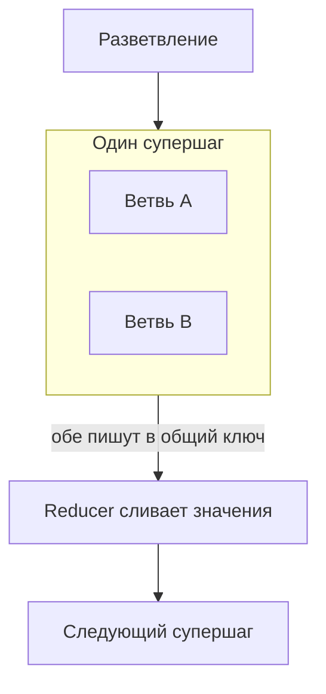

# Цена повтора и судьба общего ключа

В [части 1](./index.md) мы разобрали вопрос владения состоянием. Чекпойнтер претендует на роль хранилища
состояния прогона, но нередко эту роль уже выполняет предметная запись. Тогда одно состояние нужно объявить
**главным (authoritative)**, а другое — **производным (derived)**. Записывать в главное состояние должна
только одна сторона согласно дисциплине единственной точки записи. Направление проекции должно быть
односторонним, у схемы должен быть явный владелец, а перед продолжением прогона нужна сверка при
возобновлении. Там же мы разделили приостановку незавершённого прогона и повторное открытие завершённого, а
также посчитали цену самостоятельной разработки оркестратора. На этой странице разберём механику этих
решений. Ты увидишь, откуда брать значение ключа, безопасного при воспроизведении, что нарушает его работу,
как граф обрабатывает запись двух параллельных ветвей в один ключ состояния и какие гарантии дают движки
устойчивого исполнения за пределами AI.

Сначала обозначим границы с соседними уроками. **Идемпотентность инструмента** — устройство ключа,
необходимость ключа для записи, пробный прогон и подтверждение — разобрана в [части 2 об использовании
инструментов](../tool-use/deep-dive.md). Здесь мы считаем эти знания исходными и не повторяем их. Чекпойнтер,
потоки (threads), режимы `durability` и поведение узла с `interrupt()` описаны в [части 2 о фреймворках
оркестрации](../orchestration-frameworks/deep-dive.md). Новая тема этой страницы — связь между двумя уроками.
Из урока об инструментах ты знаешь, что для записи нужен ключ. Теперь разберём, откуда брать его значение,
если вызывающая сторона — граф, в котором движок заново прогоняет код по записанной истории, то есть
выполняет **воспроизведение (replay)**.

## Сделай каждый шаг безопасным для повтора

Начнём с механики. **Устойчивое исполнение (durable execution) возобновляет работу на границе шага.** Единицей
прогресса для движка служит шаг. Движок фиксирует завершение шага, а после возобновления начинает с первого
шага, завершение которого не подтверждено. Продолжить работу с середины шага нельзя, потому что движок
никогда не сохранял частично выполненный шаг как отдельное состояние.

Из этой гранулярности следуют все требования к безопасности. Если воспроизводится целый шаг, именно его эффект
не должен возникнуть повторно. Значит, защищающий от дублей ключ должен оставаться **неизменным для одного
шага и различаться между шагами**. Правило получается простым: **ключ идемпотентности выводится из
идентичности прогона и идентичности шага.**

Это не умозрительный вывод, который приходится принимать на веру. [Temporal](https://docs.temporal.io/activity-definition) прямо описывает такой шаблон. Чтобы
побочный эффект шага (в терминах Temporal — activity) оставался безопасным при повторе, ключ идемпотентности
составляют из **Workflow Run ID** и **Activity ID**. Workflow Run ID не меняется на протяжении исполнения и
будет другим в следующем прогоне. Поэтому ключ сохраняется при всех повторах текущего прогона и не
пересекается с ключами другого прогона. Activity ID отличает этот шаг от остальных шагов того же прогона. Ключ
остаётся постоянным при повторах и уникальным для каждого нового прогона. Оба свойства обеспечивают идентификаторы,
которые уже есть у движка.

На практике это требование часто нарушает одна строка. Узлу нужен ключ для платежа, отправки или уведомления,
и он создаёт новый:

```python
key = str(uuid.uuid4())  # внутри узла, который движок заново выполняет при воспроизведении
```

При каждом воспроизведении узел снова выполняет эту строку и получает другое значение. Сервер видит новый
ключ, считает запрос новой операцией и выполняет её. Дедупликация не срабатывает не из-за поломки, а потому,
что сервер ни разу не получил один и тот же ключ дважды. Такой ключ защищает внешнюю операцию от сетевого
повтора запроса, который имел в виду автор узла. Но он не защищает от повторного выполнения самого узла при
воспроизведении, которое приносит с собой устойчивое исполнение. Эти сбои выглядят похоже, механизм ключа
один, а рассчитан он только на один из них.

Последствия зависят от вида шага. Если это вызов модели, повторная обработка партии входящих документов,
заявок или дел из части 1 снова потребует тех же затрат. 12 000 единиц по 2¢ обойдутся в $240. Если сбой
произойдёт ближе к концу прогона и завершённая работа выполнится заново, ещё $240 уйдут лишь на возвращение к
прежнему состоянию. Это неприятно, но хотя бы заметно в счёте. Для внешней записи — проведения платежа, подачи
заявки или отправки уведомления человеку — воспроизведение угрожает уже не расходами, а корректностью. С
человека дважды спишут деньги или дважды пришлют одно сообщение. В счёте такой сбой не появится, и о нём могут
узнать лишь после жалобы.

Отсюда следует дисциплина: ключ передаётся шагу как **аргумент** и выводится из идентификаторов, которые
движок способен воспроизвести. Сам шаг не должен придумывать его заново. Если вместо готового движка ты
самостоятельно пишешь цикл исполнения, выводить ключ придётся тебе. Для собственного оркестратора это одно из
важнейших требований к корректности, и его стоит учитывать вместе с расчётом цены из части 1.

## Перепланирование ветвей ломает ключ

В этом правиле есть скрытая предпосылка, которую не учитывают даже внимательные команды. Ключ, выведенный из
идентичности шага, сохраняет стабильность лишь до тех пор, пока стабильна сама идентичность. **Если между
прогонами идентичность шага меняется, зависящий от неё ключ перестаёт защищать операцию.**

Обычная причина — динамический **fan-out, то есть разветвление**. Агент сам планирует работу, поскольку в этом
и состоит смысл цикла планирования. Сколько будет ветвей и в каком порядке, LLM решает уже во время
выполнения. Проблема становится очевидной, если идентичность задаётся позицией. Допустим, шаг обозначен как «третья параллельная
ветвь». Если при возобновлении новый план меняет порядок или количество ветвей, третьей окажется уже другая
работа со старой идентичностью. Из одной причины возникают два сбоя. Завершённая работа выполняется заново с
ключом, который система дедупликации с ней не связывает. Ещё не выполненная работа получает уже использованный
ключ и незаметно пропускается.

Поэтому идентичность шага нужно выводить из данных, которые план не может перенумеровать. Используй содержание
работы, а не её позицию. Подойдёт стабильный предметный идентификатор обрабатываемой единицы, хеш входных
данных шага или идентификатор, присвоенный при поступлении единицы в партию. Значение должно описывать саму
работу, а не порядок, в котором планировщик её выдал. Тогда новый план может как угодно переставлять ветви, а
каждый ключ останется связан со своей работой.

Apache Airflow стоит рассмотреть отдельно именно как **предостерегающий пример**, а не как образец. Эту
систему чаще всего приводят как пример того, что идентичность шага естественным образом остаётся стабильной.
На деле это не так, и документация [Airflow](https://airflow.apache.org/docs/apache-airflow/stable/templates-ref.html) говорит об этом прямо. Согласно документации, логическую дату и
производные от неё значения «не следует считать уникальными в Dag». Вместо них рекомендуется использовать
`run_id`. В Airflow 3 спецификация [AIP-83](https://cwiki.apache.org/confluence/display/AIRFLOW/AIP-83+Rename+execution_date+-%3E+logical_date+and+make+logical_date+optional) пошла дальше: `logical_date` получила возможность принимать пустое
значение, а для задач планирования, где раньше ошибочно применяли логическую дату, добавили `run_after`.
Поэтому корректная стабильная идентичность в Airflow составляется из `run_id` и идентификатора задачи. Это
сочетание идентичности прогона и идентичности задачи повторяет схему Temporal. Общий вывод не зависит от
конкретного продукта: **не выводи идентичность из значения с другим назначением**. Дата остаётся датой, даже
если в тестовых данных выглядит уникальной. Сведения актуальны на август 2026, и эта часть Airflow уже однажды
менялась.

## Один граф, много ветвей, общее состояние

Теперь разберём второй механизм. Он лежит уровнем ниже, чем всё, о чём шла речь в уроках о мультиагентных
системах. Здесь нет команды из нескольких агентов или пакетного вызова нескольких инструментов. **Один граф**
выполняет fan-out — разветвление на параллельные ветви. Все ветви читают и изменяют **одно общее состояние**.
Нас интересует случай, когда две ветви записывают данные в один ключ.

Держи в голове модель исполнения [LangGraph](https://docs.langchain.com/oss/python/langgraph/graph-api). Параллельные узлы выполняются в одном **супершаге (super-step)**.
Последовательные узлы выполняются в разных супершагах. Для этих случаев действуют разные правила по умолчанию,
но их часто ошибочно смешивают.



Сначала рассмотрим последовательное исполнение, потому что именно на нём основаны привычные ожидания. Два узла
записывают значение в один ключ на разных супершагах. Вторая запись замещает первую. Побеждает последнее
значение — всё работает как в обычном словаре. Это ожидаемое поведение, но **для параллельного исполнения оно
не действует**.

Теперь возьмём две параллельные ветви, которые записывают значение в один ключ в рамках одного супершага. Если
для ключа **[не объявлен reducer](https://docs.langchain.com/oss/python/langgraph/use-graph-api)**, среда выполнения возбуждает исключение **`InvalidUpdateError`**. Текст ошибки прямо
указывает, чего не хватает: *«Can receive only one value per step. Use an Annotated key to handle multiple
values.»* Фреймворк не выбирает победителя и не сохраняет молча последнее значение. Он отклоняет такое обновление.

Это различие важнее, чем кажется, и смешивать два правила по умолчанию по-настоящему опасно: **одной строкой
громкая авария превращается в тихую потерю данных**. Проследи всю цепочку. Если ты заранее уверен, что при
параллельной записи побеждает последнее значение, `InvalidUpdateError` выглядит не вопросом, а помехой.
Быстрее всего помеха убирается так: ты объявляешь reducer, который оставляет последнее значение. И теперь та
самая потеря, зафиксировать которую фреймворк отказался, происходит при каждом разветвлении, а сообщить о ней
уже некому. Всё это время фреймворк вёл себя бережнее: он остановил граф и попросил задать правило слияния.
`InvalidUpdateError` во время разработки означает, что фреймворк делает свою работу.

Проблему решает **reducer — функция слияния значений**, объявленная для ключа состояния. Она определяет, как
объединять два значения. В документации [LangGraph](https://docs.langchain.com/oss/python/langgraph/use-graph-api) указаны две встроенные функции: `operator.add` и
`add_messages`. Это полный документированный список, а не несколько примеров из большого каталога.
`operator.add` объединяет последовательности и подходит, когда каждая ветвь добавляет элементы в список.
`add_messages` обрабатывает историю диалога по собственным правилам, которые учитывают идентификаторы
сообщений. Во всех остальных случаях функцию нужно написать самостоятельно. Это обычная практика, а не приём
для редких сложных задач.

## Как объединить две параллельные записи?

Объявив reducer, ты переносишь решение с фреймворка на свой код. Именно здесь и возникает риск **тихой потери
данных**.

С громким отказом всё ясно. Параллельные записи без reducer'а возбуждают исключение `InvalidUpdateError`,
после чего ты исправляешь граф. Тихая ошибка появляется, когда объявленный тобой reducer отбрасывает одно из значений. Если
функция слияния просто берёт последнее значение, граф будет успешно выполняться, но при каждом fan-out терять
результат одной ветви. Ошибка не возникнет, потому что фреймворк запросил правило слияния и получил именно
такой ответ. Обе ветви выполнят свою работу и оплатят вызовы модели, но один результат окажется выброшен.
Более того, теряться будет не обязательно результат одной и той же ветви, поэтому воспроизвести такую ошибку
особенно трудно.

Относись к reducer'у как к **решению о смысле данных**, а не как к формальному способу убрать ошибку.
Возможно, результаты образуют множество и требуют объединения. Возможно, это списки, которые нужно сцепить.
Иногда ветви дают конкурирующие ответы, и победителя можно выбрать по чётко сформулированному правилу. Если же
ветви сообщают действительно противоречащие друг другу факты, честное слияние должно сохранить оба результата
и отметить конфликт. Сначала выбери подходящее правило для предметной области. Только после этого пиши
функцию.

Отдельно нужно определить порядок результатов. Здесь стоит придерживаться точной формулировки документации
[LangGraph](https://docs.langchain.com/oss/python/langgraph/use-graph-api): **порядок обновлений, полученных в одном параллельном супершаге, не гарантирован**. Документация
предлагает конкретное решение. Записывай результаты в отдельное поле вместе со значением, по которому их можно
упорядочить, а затем самостоятельно сортируй их в следующем узле. Дело не в том, что фреймворк ведёт себя
непредсказуемо. **Порядок не входит в контракт**, поэтому необходимые для сортировки данные нужно передавать
явно. Например, reducer `operator.add` складывает результаты в список. Если следующий узел считает позицию
значимой и воспринимает первый элемент как основной результат, такой граф зависит от гарантии, которой никто
не давал.

Есть ещё две документированные настройки, которые создают проблемы именно в таких сценариях. Во-первых, для
[`durability`](https://docs.langchain.com/oss/python/langgraph/durable-execution) по умолчанию выбрано значение **`"async"`**, а не `"exit"`. В режиме `"async"` чекпоинт
записывается в фоне, когда следующий шаг уже выполняется. Если в этот момент процесс завершится, последняя
запись может быть потеряна. Это разумное значение по умолчанию, но не устойчивый
режим. Если шаг стоит денег и ты рассчитываешь на устойчивость, проверь фактически выбранный
режим и не делай выводов лишь по названию настройки.

Во-вторых, значения для возобновления после [`interrupt()`](https://docs.langchain.com/oss/python/langgraph/interrupts) сопоставляются с прерываниями **строго по
индексам**. Иными словами, соответствие определяется позицией. Если граф вызывает `interrupt()` по условию или
внутри цикла, значение при возобновлении может попасть не в то прерывание. Обе настройки относятся к той же
категории риска, что и слияние. Значение по умолчанию подходит для распространённого случая, но может не
соответствовать твоему конкретному сценарию.

## К чему пришли движки устойчивого исполнения

В части 1 мы показали, что движки устойчивого исполнения позволяют оценить гарантии чекпойнтера. Для любого
такого движка стоит задать четыре вопроса и сравнить ответы.

**Какова семантика доставки шага?** [AWS Step Functions](https://docs.aws.amazon.com/step-functions/latest/dg/choosing-workflow-type.html) отвечает на этот вопрос особенно чётко, потому что
различает сразу три варианта: exactly-once (ровно один раз), at-least-once (не меньше одного раза) и
at-most-once (не больше одного раза).

| Тип рабочего процесса | Семантика | Что ломается |
|---|---|---|
| Standard | exactly-once | — (длительность до одного года) |
| Express, асинхронный | at-least-once | шаг может выполниться дважды |
| Express, синхронный | at-most-once | шаг может вообще не выполниться |

Именно третью строку почти все упускают из виду. Риск в ней прямо противоположен риску во второй строке. При
at-least-once работа может дублироваться, и от этого защищают ключи идемпотентности. При at-most-once работа
может потеряться. Никакой ключ не поможет, если шаг вообще не выполнился. Здесь нужны обнаружение пропуска и
повторный запуск. Применять ключ идемпотентности с движком at-most-once — значит тщательно решать не ту
задачу. Temporal работает по модели [at-least-once](https://docs.temporal.io/develop/python/best-practices/error-handling) и говорит об этом прямо: завершение activity фиксируется
один раз, но сама activity может выполниться несколько раз. Поэтому в той же документации приведена схема
формирования ключа, которую мы разбирали выше. За идемпотентность отвечает вызывающая сторона, и поставщик
предупреждает об этом заранее, а не после инцидента.

**Какие требования движок предъявляет к коду?** При воспроизведении движок заново исполняет код по записанной
истории. Такой механизм работает, только если код снова принимает те же решения. Поэтому [Temporal](https://docs.temporal.io/workflow-definition) требует,
чтобы код рабочего процесса был **детерминированным**. Нарушение этого требования останавливает выполнение с
ошибкой недетерминизма. В контексте LLM это ограничение требует отдельного внимания, поскольку вызов модели —
наименее детерминированная часть системы. Противоречия здесь нет. Вызов модели оформляется как шаг, результат
которого записывается и затем воспроизводится. При этом окружающий код должен воспроизводимо ветвиться,
упорядочивать действия и управлять потоком выполнения. Если добавить в код оркестрации `random()`, новый
`uuid.uuid4()` или чтение системного времени, воспроизведение сломается. По сути, это та же ошибка, что и
создание нового ключа внутри воспроизводимого узла, только возникшая с другой стороны.

**Чей это прогон и что произойдёт при повторном запуске?** [Temporal](https://docs.temporal.io/workflow-execution/workflowid-runid) разделяет эту задачу между двумя
независимыми политиками с разными значениями по умолчанию. Их часто путают и получают классическую ошибку
конфигурации. Workflow ID **Reuse** Policy определяет, можно ли запустить рабочий процесс с идентификатором,
который уже использовал **закрытый** прогон. По умолчанию действует `AllowDuplicate`. Workflow ID **Conflict**
Policy определяет, что произойдёт, если прогон с таким идентификатором ещё **открыт**. По умолчанию действует
`Fail`. Если прочитать описание одной политики и приписать её свойства другой, можно ошибочно решить, что
движок устранит дубликат при повторной отправке. На практике этого не произойдёт. Это точно соответствует
различию из части 1: Conflict Policy относится к приостановленным и открытым прогонам, а Reuse Policy — к
повторному открытию уже закрытого прогона.

**Как менять код, пока рабочий процесс выполняется?** Эту задачу порождает само устойчивое исполнение. Прогон
может длиться месяцами и воспроизводиться по истории, поэтому после деплоя прогон, запущенный ещё на прежней
версии, продолжится уже на новом коде. Сейчас Temporal рекомендует по умолчанию использовать **[Worker Versioning](https://docs.temporal.io/production-deployment/worker-deployments/worker-versioning)**
([GA с 30 марта 2026](https://temporal.io/blog/ga-worker-versioning-public-preview-upgrade-on-continue-as-new)). Этот механизм закрепляет прогон за конкретной версией кода. **Patching не
объявлен устаревшим.** Он остаётся документированной альтернативой для обновления на месте. Устарел только
прежний подход 2023 года на основе Build ID. Здесь важна точность: привычное резюме «используй новый механизм,
старый больше не нужен» неверно.

Осталось одно эксплуатационное замечание, которое завершает рассуждение о сроке хранения из части 1. Рабочие
процессы [Express](https://docs.aws.amazon.com/step-functions/latest/dg/choosing-workflow-type.html) вообще не сохраняют историю выполнения в AWS Step Functions. Если история нужна, отправляй её в CloudWatch
Logs самостоятельно. Поставщик тем самым подтверждает основной тезис урока: история движка нужна для
выполнения, а за собственные записи отвечаешь ты.

## Внедри сбой и проверь гарантию

Все утверждения на этой странице описывают поведение системы при сбое. Одна лишь дисциплина проектирования не
делает их истинными. Проверить гарантию можно, если намеренно вызвать аварию, а не ждать настоящей. Останови
воркер на границе шага, причём именно после выполнения платного внешнего действия, но до коммита, который
фиксирует его результат. Затем возобнови прогон и проверь не только его завершение, но и то, что внешнее
действие произошло **ровно один раз**.

Это приём верификации, а не проектирования. В курсе по AI SDLC он стоит рядом с другими проверками из урока
[Многослойные проверки и разнообразие механизмов](/ai-sdlc/part-3-verification/layered-gates). К такой
проверке естественно переходить после того, как архитектура с этих двух страниц уже реализована.

## Что забрать из урока

- **Воспроизведение начинается на границе шага, поэтому единицей безопасности служит шаг.** Формируй ключ
  идемпотентности из идентичности прогона и идентичности шага. В документированной схеме Temporal объединяются
  Workflow Run ID и Activity ID. Такой ключ не меняется при повторах и остаётся уникальным для каждого
  исполнения. Если создавать ключ внутри узла, который движок исполняет заново, при каждом воспроизведении
  получится новое значение. Устранение дубликатов не сработает, и после возобновления платное действие
  выполнится повторно.
- **Если идентичность шага меняется между прогонами, зависящий от неё ключ перестаёт работать.** Обычно это
  происходит при новом планировании динамического fan-out (разветвления). Выводи идентичность шага из
  содержимого самой работы, а не из её позиции. Apache Airflow здесь служит предостерегающим примером, а не
  образцом. В его документации сказано, что значения на основе `logical_date` нельзя считать уникальными в
  Dag, и вместо них рекомендуется `run_id`.
- **Параллельные ветви входят в один супершаг, а значения по умолчанию отличаются от последовательного
  случая.** Две записи в один ключ в рамках одного супершага без reducer'а возбуждают исключение
  `InvalidUpdateError`. Это отказ, а не правило «побеждает последняя запись». При последовательном выполнении новое значение по
  умолчанию заменяет прежнее. Если смешать эти два случая, явная авария превратится в незаметную потерю
  данных.
- **Reducer задаёт семантику, и именно здесь прячется тихая ошибка.** В документации предусмотрены встроенные
  `operator.add` и `add_messages`. Остальные reducer'ы пишешь сам. Если намеренно объявить reducer с правилом
  «побеждает последняя запись», он отбросит результат одной из ветвей без ошибки. Порядок обновлений,
  полученных в одном параллельном супершаге, не гарантирован. Если порядок важен, добавь к значениям поле, по
  которому их можно отсортировать.
- **Ответы движков подсказывают, какие вопросы им задавать.** В AWS Step Functions есть три варианта семантики
  доставки. Синхронный Express использует at-most-once, поэтому работа может потеряться. Это риск,
  противоположный дублированию, и ключ идемпотентности здесь не поможет. Temporal использует at-least-once,
  требует детерминированного кода рабочего процесса и разделяет политики повторного использования и конфликта
  с разными значениями по умолчанию. При этом Temporal рекомендует Worker Versioning, не объявляя Patching
  устаревшим.
- **Настройка по умолчанию не становится безопасной только потому, что выбрана по умолчанию.** Для
  `durability` по умолчанию используется `"async"`. Это не устойчивый режим, и в нём остаётся окно потери
  данных. Значения при возобновлении после `interrupt()` сопоставляются по индексу, поэтому условные
  прерывания и прерывания в цикле могут получить не те значения.

**[Новые термины](../../glossary.md#durable-runs)**: идентичность шага, супершаг, reducer / слияние состояния,
семантика доставки (exactly-once / at-least-once / at-most-once), детерминизм и воспроизведение,
версионирование рабочих процессов.
