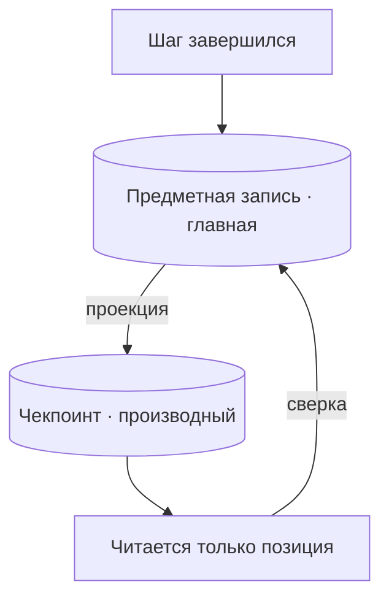

# Кто владеет состоянием прогона

После [подробного разбора фреймворков оркестрации](../orchestration-frameworks/deep-dive.md) складывается
стройная картина. Граф служит точкой сборки, а подключённый к нему чекпойнтер сохраняет состояние после
каждого супершага (super-step). Если прогон оборвётся на шаге 28, он возобновится с этого шага, и тебе не
придётся снова оплачивать 27 вызовов модели. Всё это верно. Но разбор не доходит до вопроса, от которого
зависит безопасность такой архитектуры: **что, если состояние прогона уже принадлежит другой системе?**

Обычно так и бывает. В ноутбуке или демо, где ты проверял работоспособность агента, другой системы ещё нет.
Но в реальной среде наверняка найдётся таблица с записью, по которой внешняя сторона потом потребует от тебя
отчёта. Это может быть реестр, досье или таблица записей с обязательным сроком хранения. Такое хранилище
появилось раньше агента и, скорее всего, переживёт выбранный фреймворк. Как только рядом возникает
чекпойнтер, у тебя появляются два хранилища, и каждое ведёт собственную запись о произошедшем.

Этот урок посвящён конфликту между ними и решениям, которые тебе придётся принять. Нужно определить, какое
хранилище считать главным, в каком направлении переносится состояние и что обязан проверить
возобновлённый прогон перед следующим действием. Ещё нужно оценить стоимость собственной реализации.
Конкретные механизмы разобраны во [второй части](./deep-dive.md). Там показано, как получить ключ,
безопасный при воспроизведении (replay), когда движок заново прогоняет код по записанной истории. Там же
объясняется, что произойдёт, если две параллельные ветви запишут значение по одному ключу состояния. Здесь мы
сосредоточимся на выборе архитектуры.

Через весь урок проходит один намеренно универсальный пример. **Партия** входящих документов, заявок или дел
содержит около **12 000 единиц**. Вызовы модели на одну единицу стоят примерно **2¢**, поэтому вся
партия обходится примерно в **$240**. Примерно **одну единицу из сорока** открывают заново через несколько
месяцев, когда приходит исправление. Записи нужно уметь предъявить в течение **пятнадцати месяцев**.
Единственный инженер, который когда-либо отлаживал действующий планировщик этой системы, уйдёт через **шесть
недель**. Каждый следующий раздел отвечает на один из вопросов, которые возникают в таких условиях.

## Для возобновления нужен единственный хозяин состояния

Если прочитать документацию о персистентности как закрепление состояния прогона за фреймворком, а не как
перечень возможностей, она выглядит иначе. Чекпойнтер не просто предлагает что-то запомнить за тебя. Он
претендует на роль **единственного места хранения состояния прогона**. Именно это стоит за обещанием
«возобновить работу с последнего успешно завершённого шага». Выполнить такое обещание можно лишь в том
случае, если сам фреймворк достоверно знает, какие шаги завершились.

Когда других хранилищ нет, эту роль вполне можно отдать чекпойнтеру. Больше никто не фиксирует действия
агента, а чекпойнтер сохраняет их состояние. Так появляется **устойчивое исполнение (durable execution)**.
Проблемы начинаются, когда место уже занято.

Теперь помести агента для обработки партий в реальную систему. Результат по каждой единице попадает в таблицу
записей, которая появилась за несколько лет до агента. Через пятнадцать месяцев регулятор может спросить, что
произошло с единицей 7431, и ответ должен откуда-то взяться. Если ты рассчитываешь получить его из
чекпойнтера, то только что превратил внутренний формат персистентности фреймворка в доказательство перед
регулятором. Последствия такого решения обнаружатся в самый неподходящий момент.

Из этого решения следуют три вполне реальные проблемы.

Первая — **археология зависимостей**. Чтобы ответить аудитору, что и когда произошло с конкретной единицей,
придётся читать сериализованное состояние графа. Его схема принадлежит библиотеке, которую писал не ты.
Кому-то потребуется установить версию фреймворка, сохранившую эти данные. Затем придётся восстановить
структуру объекта состояния в той версии и смысл каждого поля. Это не аудиторский след, а срочная цифровая
экспертиза.

Вторая проблема хуже, потому что возникает регулярно. **При обновлении библиотека изменяет схему своего
хранилища** — и тем самым переписывает твои доказательства. Форматы чекпоинтов относятся к внутренней
реализации и меняются между версиями. Для библиотеки это хранилище — всего лишь её собственное рабочее
состояние, поэтому такое поведение совершенно корректно. Но даже обновление патч-версии может незаметно
изменить единственную запись о произошедшем. Тесты этого не обнаружат, потому что прогон по-прежнему успешно
возобновляется.

Третью проблему можно выразить числами. История движка имеет ограниченный **срок хранения**. Обычно он короче
срока, установленного требованиями, и увеличить его до нужного значения нельзя. [AWS Step Functions](https://docs.aws.amazon.com/step-functions/latest/dg/service-quotas.html) хранит
историю исполнения **90 дней**. По запросу квоту можно сократить до 30 дней, но продлить её нельзя. При
обязательном сроке в пятнадцать месяцев, то есть примерно 456 дней, история движка покрывает лишь первую
пятую часть этого периода, а затем исчезает. Настройками этот разрыв не устранить. Он возник не из-за ошибки
конфигурации, а отражает назначение хранилища, заданное поставщиком.

Главный вывод прост. Чекпойнтер хранит **операционное состояние**, необходимое для продолжения прогона. Это не
аудиторская запись и не **система учёта (system of record)**, которая по определению считается главным
хранилищем. Если ты используешь чекпойнтер в этой роли, то принимаешь архитектурное решение, даже когда не
замечаешь этого.

## Источник истины может быть только один

Решение не в том, чтобы перестать доверять фреймворку. Нужно один раз явно определить, какое хранилище будет
главным (authoritative), а какое — производным (derived). Это разграничение следует закрепить в коде, а не в
документе, который никто не читает.

**Главное хранилище** — то, чьи данные при любом расхождении считаются верными; второе тогда перестраивают
по нему. Производное хранилище можно удалить и восстановить без потери ценных данных. Третьего варианта, при
котором оба хранилища отчасти главные, не существует. Дефект возникает из-за самой схемы с двумя источниками
записи, а не из-за фреймворка или базы данных.

Это разграничение опирается на четыре решения. Их стоит сформулировать явно, потому что неявность каждого из
них приводит к своим сбоям.

**Дисциплина единственной точки записи.** Предметную запись изменяет ровно один компонент. Вариант «агент
записывает данные, а задача сверки потом их исправляет» этому правилу не соответствует. Как только появляется
второй путь записи, рассуждения о согласованности превращаются в разбор гонок в три часа ночи. Возобновление
прогона — именно тот случай, когда такой второй путь обычно проявляется.

**Явно заданное направление проекции.** Состояние переносится из предметной записи в чекпоинт и никогда в
обратную сторону. Чекпойнтер хранит проекцию уже зафиксированных в записи данных — ровно столько, сколько
нужно для продолжения прогона. Если направление не закрепить, обмен незаметно становится двусторонним с
каждым очередным полем, добавленным ради удобства. Обнаруживается это лишь тогда, когда данные уже расходятся.

**Ответственность за схему и её миграции.** Кто-то в команде отвечает за схему предметной записи и осознанно
управляет её версиями. Схемой чекпоинта владеет не команда, а библиотека, которая может изменить её по своему
усмотрению. Именно поэтому данные, служащие доказательством, должны находиться в предметной записи. Этот
аргумент остаётся в силе при любой замене фреймворка.

**Сверка при возобновлении.** Возобновлённый прогон получает из чекпоинта свою позицию, но перед дальнейшими
действиями проверяет по предметной записи, что в действительности уже завершено. Чекпоинт определяет, откуда
продолжить исполнение. Предметная запись сообщает, какая работа уже сделана. Если судить о сделанном
по чекпоинту, прогон без колебаний заново выполнит работу, которую предметная запись уже отмечает как
завершённую. Когда обработка одной партии стоит $240, последствия вполне практические.

Здесь легко упустить центральное утверждение всей страницы: **это разграничение не зависит от решения о
внедрении фреймворка.** Выбор фреймворка и выбор владельца предметной записи — два разных решения, хотя их
постоянно смешивают. Фраза «мы используем LangGraph, значит, чекпойнтер и есть наше состояние» объединяет два
вывода, а продуман из них только один.

Можно полностью принять фреймворк со всеми его графами, чекпойнтером, прерываниями и остальными механизмами,
сохранив за предметной записью роль главного хранилища. Чекпоинт при этом останется производной проекцией.
Это не компромисс и не частичное внедрение. Такая архитектура сохраняет семантику возобновления, которую
реализует фреймворк, и аудиторский след, который переживёт его замену. Она применима независимо от решения о внедрении. Важно
именно принимать эти два решения по отдельности.

## Прогон ждёт или уже завершён?

За первым заблуждением скрывается второе. Их стоит разделить до выбора технических средств, потому что для
этих задач нужны разные решения.

**Приостановка незавершённого прогона** — задача для движка устойчивого исполнения. Прогон ещё не завершён, но
его выполнение приостановлено в процессе работы, на время согласования с человеком или из-за сбоя. Позиция и
рабочее состояние сохраняются, чтобы затем продолжить с прежнего места. Незавершённая работа действительно
ждёт продолжения. Здесь есть что возобновлять, и вся инфраструктура чекпойнтера нужна именно для этого.

**Повторное открытие завершённого прогона** устроено иначе. Прогон закончился, предметную запись сохранили,
дело закрыли, а через три месяца поступило исправление. Для нашей партии входящих документов это та самая
одна единица из сорока: примерно 300 из каждых 12 000 единиц возвращаются спустя долгое время после
завершения прогона.

Никакая работа уже не ждёт продолжения. Нет ни приостановленного исполнения, ни сохранённого посреди работы
состояния, ни позиции, к которой можно вернуться. Есть сохранённая предметная запись и новая причина снова с
ней работать. Здесь нужен **новый связанный прогон** по этой записи. Он запускается с нуля, ссылается на
исходный прогон, читает сохранённую запись как входные данные и фиксирует собственный результат.

Пытаться использовать здесь чекпоинт — ошибка, хотя терминология подталкивает именно к этому. Обе ситуации
часто называют «возобновлением дела». Однако чекпоинт трёхмесячной давности содержит внутреннее состояние
фреймворка. Его создала версия графа, которую ты с тех пор уже изменил. Он также записан по схеме, для которой
библиотека могла провести миграцию. Даже если такой чекпоинт удастся загрузить, возобновление перезапустит
старый прогон в мире, который давно изменился. Предметная запись рассчитана на чтение спустя месяцы, а
чекпоинт — нет.

Практический тест сводится к одному вопросу: **ждёт ли что-нибудь продолжения?** Если да, перед тобой
приостановка, а нужный механизм — устойчивое исполнение. Если нет, у тебя есть предметная запись и новая
причина обработать её. Тогда требуется новый прогон со ссылкой на исходный, и чекпойнтер для него вообще не
нужен.

## Устойчивое исполнение за пределами AI

Все предыдущие доводы становятся убедительнее, если знать, что эта задача не нова. За пределами AI её решили
уже давно.

Для модели, где состояние сохраняется после каждого шага, а приостановленный процесс можно возобновить, давно
существует отдельная категория продуктов. [Temporal](https://docs.temporal.io/evaluate/understanding-temporal) использует термин **Durable Execution** и строит вокруг
этой идеи весь продукт. AWS **[Step Functions](https://docs.aws.amazon.com/step-functions/latest/dg/choosing-workflow-type.html)** предлагает управляемый сервис с той же моделью. **[Apache
Airflow](https://airflow.apache.org/docs/apache-airflow/stable/)**, **[Prefect](https://docs.prefect.io/v3/get-started/index)** и **[Dagster](https://docs.dagster.io/)** подходят к задаче со стороны конвейеров по расписанию. Эти инструменты не
относятся к AI и создавались не для агентов. Именно поэтому их опыт здесь особенно полезен. Они решали эту
задачу для банковских переводов и ETL-задач под таким надзором, с каким LLM-нагрузки пока не сталкивались.

Их понятийный аппарат можно применять сразу. **Семантика доставки** — exactly-once (ровно один раз),
at-least-once (не меньше одного раза) и at-most-once (не больше одного раза) — определяет гарантии движка для
шага, который может выполняться повторно. **Детерминизм и воспроизведение (replay)** определяют требования к
коду, чтобы движок мог заново прогнать его по записанной истории и восстановить прогон. **Компенсация
([compensation](https://docs.aws.amazon.com/prescriptive-guidance/latest/patterns/implement-the-serverless-saga-pattern-by-using-aws-step-functions.html))** описывает отмену последствий уже выполненного шага, поскольку не каждую ошибку можно
исправить повторным выполнением. Каждое из этих понятий позволяет сформулировать отдельный вопрос к
чекпойнтеру. Во [второй части](./deep-dive.md) мы разберём их по очереди.

Благодаря этому модель состояния фреймворка можно **оценивать по явным критериям**, а не по личным
предпочтениям. Без такого сравнения утверждение «чекпойнтер сохраняет состояние после каждого супершага»
остаётся фактом, с которым можно лишь согласиться. Сравнение позволяет задать вопросы, от которых зависит
качество архитектуры. Какова семантика доставки шага? Что произойдёт при повторе шага, который уже успешно
завершился? Как долго хранится история и кто за неё отвечает? Какие требования движок предъявляет к коду,
чтобы воспроизвести прогон? Ответы AI-фреймворка могут отличаться от ответов Temporal. Но оставить эти вопросы
без ответа нельзя. Пока ты не знаешь, что для этой категории уже выработаны решения, ты не знаешь и о чём
спрашивать.

## Цена самописной альтернативы

[Урок о фреймворках оркестрации](../orchestration-frameworks/index.md) честно разбирает цену внедрения:
стоимость абстракции, изменения в экосистеме и выбор между переносимостью и привязкой к поставщику. Но там не
оценивается альтернатива, которую предлагают вместо фреймворка. В текущей версии курса аргумент о привязке
работает только в одну сторону. Самописный оркестратор тоже обходится не бесплатно. Просто расходы
проявляются позже и попадают в другую статью.

**Нагрузка сопровождения** — самая заметная часть этих расходов. Повторы, задержку между ними, тайм-ауты,
возобновление и учёт завершённых шагов написал ты. Значит, за всё это отвечаешь тоже ты, включая ошибку
конкурентного доступа, которая возникает раз в квартал под нагрузкой, не воспроизводимой в тестах. Ошибки во
фреймворке также приходится обходить самостоятельно. Однако их находят другие пользователи, исправляет чужая
команда, а обсуждение остаётся в доступном для поиска трекере.

О **цене ввода в курс дела** часто забывают из-за простой асимметрии. Готовый фреймворк можно изучить по
открытой документации. Новый инженер читает руководство, проходит учебный пример, ночью находит ответ на Stack
Overflow и начинает работать без чужой помощи. Самописный планировщик можно освоить только через его автора.
Вместо документации остаётся код, учебных материалов нет, готовых ответов тоже нет. Все вопросы сходятся к
одному человеку, и его пропускная способность становится пределом для ввода новых сотрудников в курс дела.

Здесь обе статьи расходов сходятся в **факторе автобуса (bus factor)**. В нашем сценарии единственный инженер,
которому доводилось отлаживать планировщик, уйдёт через шесть недель. Это не расплывчатая проблема
корпоративной культуры, а ключевое условие решения. Через шесть недель систему, которая решает, повторить ли
работу стоимостью $240 или пропустить её, будут сопровождать люди, никогда не видевшие её сбоев. Это серьёзный
довод в пользу готового инструмента с общепринятым названием. Его техническое превосходство здесь ни при чём.
Важно то, где хранится знание о системе.

Но доводы работают в обе стороны, поэтому нужно учесть и обратный случай. *Цикл на 300 строк может иметь более
высокий фактор автобуса, чем граф, который никто в команде ни разу не запускал.* Этот показатель отражает,
сколько людей способны поддерживать систему. Если четыре инженера целиком прочитали обычный Python-файл на 300
строк, поддерживать его могут четверо. Если реальные сбои графового фреймворка разбирал только один инженер,
поддерживать его способен один человек. Наличие документации этого не меняет. Читать её во время инцидента —
не то же самое, что уже пережить такой сбой. Внедрение переносит часть знаний из твоей кодовой базы в
общедоступную документацию, но не создаёт практического опыта. Именно он нужен в три часа ночи.

Поэтому оцени обе стороны и только потом принимай решение. Для самописного решения посчитай нагрузку
сопровождения, зависимость обучения от одного автора и реальное число людей, знакомых с системой. Для
фреймворка учти стоимость абстракции, изменения, привязку к поставщику и время на обучение. Зато новый
сотрудник может освоить его, не занимая время коллег. В нашем сценарии уход инженера через шесть недель
склоняет решение в пользу фреймворка, и это обоснованно. Измени одно условие — пусть четыре инженера уже
хорошо знают цикл, а опыта работы с фреймворком нет ни у кого, — и те же рассуждения приведут к
противоположному решению.

## Что забрать из урока

- **Чекпойнтер заявляет права на состояние прогона**, а не просто добавляет нейтральную возможность.
  Возобновление с последнего успешного шага работает, только если именно фреймворк знает, какие шаги
  завершились. Передавай ему это право, когда место владельца свободно. Если владельцем уже служит предметная
  запись, сначала тщательно оцени последствия.
- Один раз явно определи, какое хранилище содержит **главное (authoritative)** состояние, а какое —
  **производное (derived)**. Затем закрепи границу четырьмя решениями: дисциплиной единственной точки записи,
  явно заданным направлением проекции, назначенным владельцем схемы и её миграций, а также сверкой при
  возобновлении. Две точки записи для одной истины — это дефект.
- Это разделение **не зависит от решения внедрять фреймворк или отказаться от него**. Можно полностью внедрить
  фреймворк, оставить предметную запись главной, а чекпоинт использовать как производную проекцию. Если
  считать эти вопросы одним решением, внутренний формат библиотеки незаметно становится аудиторским следом
  системы.
- **Приостановить открытый прогон и снова открыть закрытый — не одно и то же.** Устойчивое исполнение решает
  только первую задачу. Во втором случае нужен новый связанный прогон по сохранённой записи, а возобновлять
  уже нечего. Проверяй, действительно ли какой-либо процесс ожидает продолжения.
- **За пределами AI устойчивое исполнение давно решено и оформилось в отдельную категорию продуктов.** К ней относятся
  [Temporal](https://docs.temporal.io/evaluate/understanding-temporal), AWS Step Functions, Apache Airflow и другие подобные системы. Её понятийный аппарат — семантика
  доставки, детерминизм и воспроизведение, компенсация — позволяет оценивать чекпойнтер по критериям, а не по
  вкусу.
- **Учитывай цену самописного оркестратора.** В неё входят собственная нагрузка сопровождения, ввод в курс
  дела через одного автора и фактор автобуса, равный числу людей, которые действительно знают систему. Но
  учитывай и обратный аргумент: цикл на 300 строк, прочитанный четырьмя инженерами, надёжнее с точки зрения
  знаний команды, чем граф, реальные сбои которого разбирал только один человек.

**[Новые термины](../../glossary.md#durable-runs)**: система учёта (system of record), главное и производное
состояние, дисциплина единственной точки записи, направление проекции, сверка при возобновлении, новый
связанный прогон, движок устойчивого исполнения, семантика доставки, фактор автобуса (bus factor).

---

:::note[Дальше — вторая часть урока]

**[Ключи, слияния, гарантии движков](./deep-dive.md)** — как вывести ключ идемпотентности из идентичности
прогона и шага, чтобы воспроизведение не оплатило заново уже сделанную работу; что происходит, когда
идентичность шага смещается между прогонами; fan-out внутри одного графа и слияние состояния, которое
придётся задать самому; а также семантика доставки, детерминизма и версионирования, к которой пришли движки
устойчивого исполнения.

См. также: чекпойнтер, потоки и режимы `durability`, на которые опирается эта страница, — [фреймворки
оркестрации, часть 2](../orchestration-frameworks/deep-dive.md); идемпотентность как свойство инструмента —
[использование инструментов, часть 2](../tool-use/deep-dive.md); как персистентность и возобновление устроены
в агентных средах самих вендоров — [завершающий урок части](../real-agents.md).

:::
