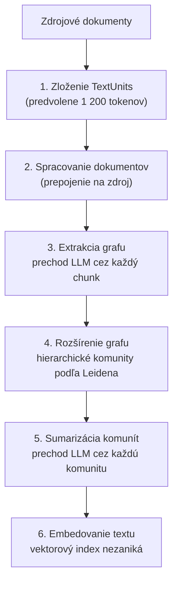

# Ako sa graf stavia, čo robia štandardy schém a kadiaľ vedú dopyty

[Prvá časť lekcie](./index.md) urobila tri rozhodnutia: kedy sa štruktúru vôbec oplatí extrahovať, kedy sa graf
oplatí postaviť a čo prináša sémantická vrstva, len čo sa dvaja ľudia prestanú zhodovať na jednom čísle.
Zámerne ostala na úrovni rozhodnutia. Táto stránka rozoberá technické pozadie každého z nich. Ukáže, ako extrakčná pipeline mení súvislý text na graf a koľko stojí jeho jednotlivá fáza. Vysvetlí, prečo tieto projekty sklamú práve pri zlučovaní a prečo ti metriky vyhľadávania, ktoré už máš, nepovedia, či je graf dobrý. Vysvetlí, čo presne robí každý zo štyroch štandardov formálneho stacku — RDF, OWL, SHACL, SPARQL — a prečo je namieriť model na schému dátového skladu ťažší problém než namieriť ho na definíciu metriky. Poslednú tretinu stránky tvorí to, čím sa systému kladú otázky: štyri
grafové metódy dopytovania, text-to-SQL nad sémantickou vrstvou a router (smerovač) pred oboma.

Ešte jedna hranica na začiatok. Všetko tu je stále **statické**: štruktúra vzniká pred otázkou a otázka si cez
ňu volí cestu. V okamihu, keď sa systém začne sám rozhodovať, či sa pozrieť znova — preformulovať, znova
vyhľadať, posúdiť dostatočnosť —, si v [agentic RAG](../../part-2-agents/agentic-rag/deep-dive.md), ktorého
slučka vie graf zavolať ako ďalší nástroj. Rozhodnutia z prvej časti lekcie predpokladáme po celý čas
a neopakujeme ich argumentáciu.

## Ako sa graf naozaj stavia

Ako referenčná implementácia poslúži GraphRAG od Microsoftu — je to tá, o ktorej čitatelia počuli, a má
dobre zdokumentované jednotlivé fázy. Jeho [indexovanie](https://microsoft.github.io/graphrag/index/default_dataflow/) prebieha v šiestich fázach:

1. **Zloženie TextUnits** — rozdelenie zdrojových dokumentov na chunky (kúsky). Predvolená jednotka má
   1 200 tokenov, čo je samo osebe návrhové rozhodnutie: väčšie jednotky znamenajú menej volaní extrakcie
   a viac entít na jedno volanie — a menšiu šancu, že model priradí vzťah správnej dvojici.
2. **Spracovanie dokumentov** — vytvorenie tabuľky dokumentov, ktorá pri každom extrahovanom fakte uchová
   prepojenie na zdroj.
3. **Extrakcia grafu** — prechod LLM, ktorý vyrobí **entity**, **vzťahy** a **kovariáty**: tretie z nich sú v GraphRAG názvom pre tvrdenie priradené k entite — vecný výrok so zaznamenaným stavom overenia aj obdobím
   platnosti. Toto je drahá fáza a tá, ktorá rozhoduje, či bude čokoľvek po prúde pravdivé.
4. **Rozšírenie grafu** — detekcia komunít nad grafom entít, z ktorej vznikne tabuľka komunít.
5. **Sumarizácia komunít** — prechod LLM nad každou komunitou, ktorý vyrobí **správy o komunitách**.
6. **Embedovanie textu** — vektory, lebo graf vektorový index nenahrádza.

Z toho zoznamu sa oplatí vytiahnuť dva detaily — jeden vysvetľuje, prečo globálne otázky vôbec fungujú, druhý
mení, ako by si stavbu rozpočtoval.

Komunity vznikajú **hierarchickým zhlukovaním Leidenovým algoritmom**, ktoré beží rekurzívne. Globálne otázky
fungujú práve vďaka tomu *hierarchickému* usporiadaniu: zhlukovanie nedá jedno ploché rozdelenie, ale vnorené
úrovne, takže správa existuje aj pre malý tesný zhluk, aj pre širšiu oblasť, ktorá ho obsahuje. Každá správa
nesie manažérske zhrnutie a odkazuje na svoje kľúčové entity, vzťahy a tvrdenia. Preto má otázka o celom
korpuse čo čítať: to zhrnutie už niekto napísal — LLM, v čase stavby, na tvoje náklady.

**Extrakcia tvrdení** je voliteľná a predvolene vypnutá. Dokumentácia hovorí priamo, že „vo všeobecnosti si
vyžaduje doladenie promptu, aby bola užitočná“. Je to nezvyčajne čestná predvoľba a užitočný signál: dodávateľ
ti hovorí, že najbohatšia časť extrakcie je zároveň tou najcitlivejšou na tvoju doménu. Kto ti cenu stavby
grafu odhaduje z dema, ten ju takmer isto nemal zapnutú.

Pozri sa teraz, aké náklady vznikajú v jednotlivých fázach. Fázy 3 a 5 sú obe prechodmi LLM cez celý korpus —
jeden cez každý chunk, druhý cez každú komunitu. Presne to mala prvá časť lekcie na mysli, keď extrakciu
oceňovala ako prechod cez všetko, a presne preto
[LazyGraphRAG](https://www.microsoft.com/en-us/research/blog/lazygraphrag-setting-a-new-standard-for-quality-and-cost/)
vôbec vznikol: tieto dva prechody odkladá na čas dopytu a uvádza náklady na indexovanie „identické
s vektorovým RAG a na úrovni 0,1% nákladov plného GraphRAG“. Ak globálnych otázok prichádza málo, je výhodnejšie
presunúť tú prácu do času dopytu — a je to návrhová voľba, ktorú máš k dispozícii, nie pevná vlastnosť grafov.

## Štyri metódy dopytovania v GraphRAG a ktorej otázke ktorá slúži

Graf nie je jeden režim vyhľadávania. GraphRAG ponúka nad tým istým indexom štyri odlišné
[metódy dopytovania](https://microsoft.github.io/graphrag/query/overview/) a podstatnú časť inžinierskej práce
tvorí práve voľba medzi nimi:

| Metóda | Pracuje nad | Otázka, pre ktorú je |
|---|---|---|
| **Local search (lokálne vyhľadávanie)** | extrahovaným grafom **a k tomu** surovými chunkami | konkrétna entita a jej okolie |
| **Global search (globálne vyhľadávanie)** | všetkými správami o komunitách, map-reduce | korpus ako celok |
| **DRIFT search** | kontextom komunity vloženým do lokálneho vyhľadávania | lokálna otázka, ktorá potrebuje širší rámec |
| **Basic search (základné vyhľadávanie)** | TextUnits podľa vektorovej podobnosti | porovnávacia základňa čistého RAG |

**Local search** stále číta chunky. „Kombinuje relevantné dáta zo znalostného grafu extrahovaného pomocou AI
s textovými chunkami surových dokumentov“ — graf dodáva štruktúru a dôkaz naďalej dodáva text. Graf potrebu
kvalitného chunkingu neodstraňuje; stále z neho vychádza.

**Global search** je map-reduce nad každou správou o komunite a dokumentácia ho označuje za „náročný na
zdroje“. Každá globálna otázka sa rozvetví cez celú sadu správ a čiastkové odpovede zloží do jednej. Náklad
grafu teda nie je len jeho stavba: drahé sú aj tie dopyty, kvôli ktorým sa stavať oplatilo.

**DRIFT** existuje preto, lebo rozdelenie na lokálne a globálne je príliš čisté. Pomocou kontextu komunity
rozvíja pôvodný dopyt na sériu nadväzujúcich otázok, čím rozširuje jeho záber. To je rozklad dopytu — technika,
ktorú [agentic RAG](../../part-2-agents/agentic-rag/index.md) už učí, len použitá vnútri grafového systému.
Pri grafovom aj agentovom prístupe sa opakovane objavujú tie isté techniky.

Referenčná implementácia dodáva čistý vektorový RAG ako plnohodnotnú metódu dopytovania, výslovne ako
porovnávaciu základňu. Čokoľvek tu postavíš, drž tú lacnú základňu spustiteľnú — zaujímavá otázka nikdy neznie
„funguje graf“, ale „poráža graf oveľa lacnejšiu vec na otázkach, ktoré nám naozaj chodia“.

## Pri stotožňovaní entít grafové projekty sklamú \{#entity-resolution}

Tento problém nepatrí do žiadnej z fáz vyššie.

Extrakcia ti z jedného dokumentu dá `Acme Corp` a z druhého `Acme Corporation`. Rozhodnúť, že sú to tie isté
uzly, je **stotožňovanie entít (entity resolution)** — výskumná oblasť staršia než čokoľvek z tohto: record
linkage, deduplikácia, ten istý problém, s ktorým bojuje každý projekt správy kmeňových dát.

Populárne grafové systémy RAG riešia tento problém oveľa obmedzenejšie, než väčšina čitateľov predpokladá. Prehľad šumu z extrakcie
v týchto pipeline ([*Less is More*](https://arxiv.org/html/2510.14271v1)) uvádza, že systémy vrátane Microsoft
GraphRAG a LightRAG sa pri zlučovaní entít spoliehajú na **porovnávanie reťazcov** — takže entity s odlišnými
názvami, medzi nimi aliasy a skratky, ostávajú samostatnými uzlami. Výsledný graf potom na prvý pohľad pôsobí
kompletne, v skutočnosti je však nepozorovane rozdrobený: všetko, čo sa o jednej skutočnej organizácii vie, je
rozsypané do štyroch uzlov a prechod z ktoréhokoľvek z nich vidí len svoj vlastný diel.

Prejaví sa to priamo na tom, čo graf sľuboval. Otázka „všetko, čo vieme o tomto dodávateľovi“ — jedna z tých troch, ktorými sa
prvá časť lekcie otvárala — je presne tá, ktorú rozdrobenie rozbije. Rozbije ju *ticho*, sebavedomou čiastočnou
odpoveďou. Keď teda niekto navrhne graf na rozlíšenie entít, vedz, že si objednávaš prácu na stotožňovaní
entít, ku ktorej je pripnutý graf — a stotožňovanie rozpočtuj ako hlavnú položku.

Súvisiaci problém vzniká už o krok skôr. Keďže extrakcia je prechodom LLM, vyrába vzťahy, ktoré žiadny dokument
neuvádza — ten istý prehľad poznamenáva, že nesprávne fakty v korpuse dávajú v grafe generovanom LLM chybné
trojice. Halucinovaná hrana je vecne horšia než halucinovaná veta vo vygenerovanej odpovedi, lebo *ostáva
uložená*: dostane sa do indexu, vo fáze 5 sa zhrnie do správy o komunite a odvtedy sa na ňu ako na štruktúru
odvoláva každý dopyt, ktorý sa toho okolia dotkne.

## Hodnotiť graf nie je to isté ako hodnotiť vyhľadávanie

Metriky vyhľadávania, ktoré už máš, sa sem neprenášajú — a predpoklad, že áno, je presne to, čím zlý graf
prejde.

Recall@K sa pýta, či sa správny chunk dostal do množiny kandidátov. Nepovie nič o tom, či je
`Acme Corp —[supplies]→ Contoso` *pravda*. Graf môže na vyhľadávaní chunkov skórovať dokonale, kým sú jeho
vzťahy z veľkej časti vymyslené — chunky sú totiž skutočné bez ohľadu na to, čo sa z nich vyextrahovalo.

Potrebuješ tri samostatné merania:

**Presnosť extrakcie voči označkovanej vzorke.** Vezmi pár stoviek extrahovaných trojíc, nechaj človeka overiť
ich voči zdrojovému textu a vykáž podiel. Toto je číslo, ktoré nikto nechce vyrábať, a jediné, ktoré hovorí
o správnosti. Trojice vzorkuj podľa typu vzťahu, nie rovnomerne — presnosť na `mentions` ti nepovie nič
o presnosti na `supplies`.

**Kvalita stotožňovania, zvlášť.** Chyby zlučovania majú dva smery a nie sú symetrické. Prílišné zlučovanie
(over-merging) zlepí dve skutočné organizácie do jedného uzla a vymyslí spojenia, ktoré neexistujú;
nedostatočné zlučovanie (under-merging) jednu organizáciu rozdrobí a skryje spojenia, ktoré existujú. Vykazuj
oboje — jediné číslo „presnosti“ totiž dovolí jednému schovať sa vnútri druhého.

**Hodnotenie odpovedí od začiatku do konca, na tých typoch otázok, ktoré vie obslúžiť jedine graf.** Ak graf odôvodnili globálne otázky, aj hodnotiaci súbor musí pozostávať z globálnych otázok — a to znamená, že niekto musí pripraviť etalón k otázke „aké témy sa v tomto korpuse opakujú“, čo je naozaj ťažké značkovanie. Aparát na
skórovanie voľných odpovedí, aj so sudcom a jeho hranicami, má
[lekcia o evaluácii](../cross-cutting/evaluation/index.md).

Náklad na hodnotenie grafu nie je zaokrúhľovacia chyba pri nákladoch na stavbu. Je to druhý projekt a zároveň
ten, ktorý sa najskôr škrtne — a tak organizácie skončia bez odpovede na otázku, či graf vôbec pomohol.

## Formálny stack podľa účelu \{#the-formal-stack-by-purpose}

Všetko doteraz predpokladá graf, ktorý si sám vyextrahuješ. Druhá cesta, ktorou štruktúra prichádza, je, že ti
niekto podá ontológiu a chce, aby si prevzal štandardy, na ktorých stojí — iná otázka s inou odpoveďou.

Kedykoľvek príde reč na ontológiu, vynoria sa štyri štandardy a zvyčajne sa podávajú ako stack, ktorý sa
preberá vcelku. Lepšie sa im rozumie ako štyrom samostatným nástrojom, z ktorých každý odpovedá na jednu
otázku. Všetky štyri sú dávno ustálené odporúčania W3C, a to má dve stránky: základy sú stabilné, štandardy
interoperabilné a ekosystém dobre podporovaný nástrojmi, *a* zároveň je to dôvod, prečo ten istý
ekosystém pôsobí vedľa vektorového stacku nemoderne.

**RDF — ako fakt zapíšem?** Výrok je trojica: subjekt, predikát, objekt. Všetko ostatné tu na tom stojí.

**OWL — čo slovník znamená, formálne?** [OWL 2](https://www.w3.org/TR/owl2-overview/) (odporúčanie z roku 2012)
je „ontologický jazyk pre sémantický web s formálne definovaným významom“. Podstatné je to *formálne*:
modelovo-teoretická sémantika, vďaka ktorej stroj dokáže odvodiť fakt, ktorý nikto nezapísal. Ak nikdy
nepotrebuješ odvodiť nevyslovený fakt, OWL nepotrebuješ — a je to zo všetkého najlepší test, či je formálny
stack pre teba.

OWL odpovedá aj na námietku „nie je odvodzovanie nad tým zničujúco drahé?“ lepšie, než väčšina ľudí čaká: od
začiatku ho navrhovali tak, aby sa vyjadrovacia sila dala obmedziť. Definuje tri **profily**, ktoré vymieňajú
vyjadrovaciu silu za efektívnosť odvodzovania: **EL** dáva pre všetky štandardné odvodzovacie úlohy algoritmy
s polynomiálnym časom a mieri na veľmi veľké ontológie; **QL** umožňuje odpovedať na konjunktívne dopyty
v LogSpace pomocou štandardnej relačnej databázovej technológie; **RL** dáva odvodzovanie v polynomiálnom čase
pomocou databázovej technológie rozšírenej o pravidlá, priamo nad trojicami. Voľba profilu je skutočné
inžinierske rozhodnutie so skutočnými dôsledkami a „použijeme OWL“ bez pomenovania profilu je rozhodnutie,
ktoré ešte nepadlo.

**SHACL — sú tie dáta naozaj platné?** [SHACL](https://www.w3.org/TR/shacl/) (odporúčanie z roku 2017) je
„jazyk na validáciu RDF grafov voči sade podmienok“. **Dátový graf (data graph)** validuješ voči **grafu tvarov
(shapes graph)** a späť dostaneš **validačnú správu (validation report)**. Pre systémy s LLM je to najdôležitejší
kus a zároveň ten najčastejšie vynechaný, lebo je to deterministická brána nad pravdepodobnostným producentom:
extraktor navrhuje, graf tvarov rozhoduje a správa ti presne povie, ktoré obmedzenie neprešlo. Argument, prečo
taká brána do pipeline vôbec patrí, vedie lekcia [vrstvené brány](/ai-sdlc/part-3-verification/layered-gates);
SHACL je jeden konkrétny spôsob, ako ju postaviť.

**SPARQL — ako sa spýtam?** [SPARQL 1.1](https://www.w3.org/TR/sparql11-query/) (odporúčanie z roku 2013)
vyjadruje „dopyty naprieč rôznorodými zdrojmi dát, či už sú dáta uložené natívne ako RDF, alebo sa ako RDF iba
zobrazujú cez medzivrstvu“, a to porovnávaním vzorov nad orientovaným označeným grafom. SPARQL nad *pohľadom*
na relačné dáta je reálna nasadzovacia podoba a znamená, že prevzatie dopytovacieho jazyka si nevyžaduje
migráciu úložiska.

### Schéma, ktorú by väčšina tímov mala postaviť namiesto toho

Premietni tie štyri na to, čo pipeline s LLM naozaj potrebuje, a vynorí sa rozumné východisko: **JSON Schema**,
ktorá pomenúva tvoje triedy a povolené typy vzťahov, a k nej **validátor**, ktorý odmietne, čo jej odporuje.
Dostaneš tým obmedzenie extrakcie — problém `works_for` / `employed_by` z prvej časti lekcie — aj
deterministickú bránu. Obe sa vyplatia okamžite a s nástrojmi, ktoré každý inžinier v tíme už pozná.

Nedostaneš odvodzovanie, interoperabilitu so štandardmi ani formálne overiteľný význam. [Prvá časť lekcie](./index.md) ich uvádza ako podmienky prechodu k formálnemu stacku a každá z nich je *dôvod*, nie preferencia. Bez nich je formálny stack veľkým trvalým záväzkom kúpeným za úžitok, ktorý už dodá validátor.

## Čo text-to-SQL kazí a čo sémantická vrstva odstraňuje

Prvá časť lekcie povedala hlavnú vec o vrstve metrík: nad surovou schémou musí model dopyt **odvodiť**, nad
sémantickou vrstvou **vyberá** zadefinovanú metriku. Ťažkosť toho odvodzovania neleží tam, kde ju ľudia čakajú.

Napísať syntakticky platné SQL nie je to ťažké; v tom sú modely dobré. Ťažké je to, čo ti schéma nepovie:

- **Ktoré spojenie tabuliek je biznisovo správne.** Dve tabuľky sa dajú spojiť tromi spôsobmi; tomu, ako biznis
  počíta, zodpovedá jediný. Schéma pripúšťa všetky tri.
- **Ktorý stĺpec je biznisový dátum.** `created_at`, `updated_at`, `effective_date`, `ordered_at` — dátový model
  nepovie, ktorý z nich znamená „minulý kvartál“.
- **Ako hodnoty naozaj vyzerajú.** Kvôli tomuto [BIRD](https://bird-bench.github.io/) vôbec vznikol: jeho
  hodnoty „si zachovávajú svoj pôvodný a často ‚špinavý‘ formát“, takže parser musí zvládnuť neštandardné
  hodnoty skôr, než začne uvažovať. Kurátorovaný benchmark túto chybu skryje celú.
- **Aké je biznisové pravidlo.** „Aktívny zákazník“ je predikát, o ktorom niekto rozhodol. V DDL nie je nikde.

Výsledky z BIRD preto neprekvapujú — **92,96%** pre ľudských dátových inžinierov proti **81,95%** pre najlepší systém v rebríčku, tak ako ich rebríček uvádzal v septembri 2025. Zvyšná medzera nie je syntax. Z veľkej časti sú
to znalosti, ktoré žijú v ľudských hlavách a v sémantickej vrstve.

Tým sa mení pohľad na to, čím tá vrstva je. Každá definícia metriky, každá deklarovaná cesta spojenia, každý
prípustný filter je jedno z tých rozhodnutí — *urobené raz, niekým zodpovedným, v artefakte, ktorý sa dá
revidovať*. [MetricFlow](https://docs.getdbt.com/docs/build/about-metricflow) od dbt to organizuje ako
sémantické modely, ktoré nesú **entity** (kľúče spojenia), **dimenzie** (spôsoby, akými dáta členíš) a **miery**
(samotné veličiny), a nad nimi deklaratívne definované metriky.
[LookML](https://docs.cloud.google.com/looker/docs/what-is-lookml) je „jazyk, ktorý sa v Lookeri používa na
tvorbu sémantických dátových modelov“: analytici napíšu model raz a generátor SQL z neho vyrobí dopyt pre
konkrétnu databázu.

Úloha modelu sa tým zjednoduší: namiesto toho, aby rekonštruoval uvažovanie analytika, iba vyberie správnu
metriku a dimenzie. Mení sa s tým aj to, ako môže systém zlyhať. Zlý výber vieš používateľovi ukázať — „použil som metriku **čisté tržby** s členením podľa **regiónu**“ —, kým jemne zlé spojenie tabuliek sa skryje za vierohodne pôsobiace číslo.

Pre každého, kto pred to postaví agenta, sú dôležité ešte dve vlastnosti.

**Riadenie (governance)** sa vynucuje na vrstve, nežiada sa od modelu. Cube to formuluje tak, že dopyt „sa overí
voči dátovému modelu a deterministicky sa naň uplatnia prístupové politiky ešte pred tým, než sa dostane do
dátového skladu“ — čo je pravidlo preosiať pred vyhľadávaním z
[prehĺbenia vrstvy Retrieval](../retrieval/deep-dive.md), len prichádza zo štruktúrovanej strany. Prompt, ktorý
model prosí, aby sa nepozeral na dáta iných regiónov, kontrolným mechanizmom nie je; politika, ktorú dopyt
nedokáže obísť, ním je.

**Prehľad dostupného (discoverability)** zverejňuje vrstva; model si ho nedomýšľa. Cube
vystavuje **Meta API**, aby „AI agenti zistili, na čo sa dá dopytovať“. Je to štruktúrovaná obdoba definície
nástroja a odstraňuje celú triedu chýb, pri ktorej si model vymyslí metriku, čo znie rozumne a neexistuje.

## Smerovanie: ako štruktúrované cesty idú do produkcie

Nič na tejto stránke nenahrádza pipeline postavenú v lekciách Ingestion, Retrieval a Generation. V produkcii
štruktúrované cesty stoja *vedľa* neho a niečo rozhoduje, ktorou z nich otázka pôjde:

- vyhľadaj-a-vráť otázky a „čo hovorí tento dokument“ → vektorová cesta, bez zmeny;
- agregačné a aritmetické otázky → sémantická vrstva;
- otázky o celom korpuse a o okolí entity → graf, ak bol opodstatnený;
- otázky, ktoré potrebujú dve z týchto ciest → obe cesty a k nim krok syntézy; ich spoľahlivé prepojenie ostáva najväčším otvoreným problémom.

Toto rozhodnutie je [smerovanie dopytov](../retrieval/deep-dive.md), ktoré prehĺbenie vrstvy Retrieval už
stavia — použi ho znova, namiesto aby si vymýšľal súbežný mechanizmus. Praktická výstraha znie, že router teraz robí rozhodnutie, pri ktorom je omyl drahý: keď agregačnú otázku pošle vektorovou cestou, systém vráti plynulú odpoveď s nesprávnym číslom, a ešte ju riadne doloží zdrojmi. Smeruj podľa *tvaru* otázky, zaznamenávaj výsledok klasifikácie a nesprávne smerovanie
sleduj ako samostatný režim zlyhania v
[prehĺbení o observability](../cross-cutting/observability/deep-dive.md) — keď nastane, nebude vyzerať ani ako
zlyhanie vyhľadávania, ani ako zlyhanie generovania.

## Čo si odniesť z lekcie

- Stavba GraphRAG má šesť fáz a dve z nich sú prechodmi LLM cez všetko — extrakcia cez každý chunk
  a sumarizácia cez každú komunitu —, čím je celý príbeh nákladov povedaný jednou vetou. Extrakcia tvrdení,
  najbohatšia a na doménu najcitlivejšia časť, je predvolene vypnutá, takže náklady z dema ju takmer nikdy
  nezahŕňajú.
- Hierarchické zhlukovanie Leidenovým algoritmom je to, vďaka čomu sa dá odpovedať na otázky o celom korpuse:
  zhrnutie, ktoré globálna otázka číta, vzniklo v čase stavby a na tvoje náklady.
- Metódy dopytovania sú štyri, nie jedna — local číta aj chunky, global je map-reduce a je drahý na dopyt,
  DRIFT je rozklad dopytu znovuobjavený vnútri grafu a základné vektorové vyhľadávanie sa dodáva ako
  porovnávacia základňa, ktorú si drž spustiteľnú.
- Pri stotožňovaní entít tieto projekty sklamú: populárne systémy zlučujú porovnávaním reťazcov, takže aliasy sa
  ticho rozdrobia a „všetko o X“ vráti sebavedomú čiastočnú odpoveď. Halucinovaná hrana je horšia než
  halucinovaná veta, lebo ostáva uložená, zhrnie sa a odvtedy sa na ňu odvoláva ako na štruktúru.
- Metriky vyhľadávania graf nezhodnotia — potrebuješ presnosť extrakcie na označkovanej vzorke, chyby zlučovania
  vykázané v oboch smeroch a hodnotenie od začiatku do konca na tej triede otázok, ktorá stavbu ospravedlnila.
- RDF fakt zapíše, OWL 2 mu dá formálny význam (s profilmi EL/QL/RL, ktoré vymieňajú vyjadrovaciu silu za
  efektívnosť odvodzovania), SHACL overí dáta voči tvarom, SPARQL sa spýta — a testom, či to všetko vôbec
  potrebuješ, je potreba *odvodených* faktov. Bez nej dodá JSON Schema a k nej validátor obmedzenie extrakcie aj
  deterministickú bránu, teda ten úžitok, ktorý si väčšina tímov v skutočnosti kupuje.
- Text-to-SQL je ťažké kvôli biznisovým spojeniam tabuliek, biznisovým dátumom, neupratovaným hodnotám
  a nenapísaným pravidlám — nie kvôli syntaxi; sémantická vrstva mení odvodzovanie na výber, robí zlú odpoveď
  viditeľnou a uplatní prístupovú politiku skôr, než sa niekto dotkne dátového skladu.
- Celé to ide do produkcie vedľa vektorovej pipeline za routerom a zlé nasmerovanie je vlastná trieda chýb.

**[Nové pojmy](../../glossary.md#structured-knowledge)**: TextUnit, graph extraction, covariate / claim
extraction, community detection / hierarchical Leiden, community report, local search, global search,
DRIFT search, over-merging / under-merging, extraction precision, OWL profiles (EL, QL, RL), data graph /
shapes graph, validation report, semantic model, measure / dimension / entity, Meta API.
