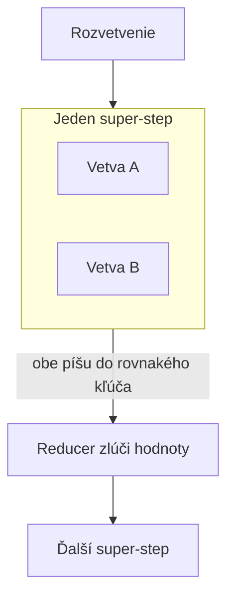

# Cena opakovania kroku a súbeh zápisov do jedného kľúča

[Prvá časť](./index.md) rozobrala vlastníctvo stavu. Checkpointer si nárokuje úlohu jediného miesta, kde žije stav behu, no tú úlohu už často plní doménový záznam. Riešením je označiť jedno úložisko za **autoritatívne** a druhé za odvodené, uplatniť zásadu jediného zapisovateľa, určiť jednosmerný smer projekcie, výslovne prideliť vlastníctvo schémy a pred ďalšou činnosťou obnoveného behu vykonať zosúladenie. Prvá časť tiež odlíšila pozastavenie otvoreného behu od opätovného otvorenia uzavretého behu a vyčíslila náklady na orchestrátor postavený na mieru namiesto prijatia existujúceho riešenia. Táto stránka vysvetľuje technické mechanizmy, na ktorých tieto rozhodnutia stoja: odkiaľ získava hodnotu kľúč bezpečný pri replay (opakovanom prehratí behu z histórie), čo dokáže jeho ochranu prekonať, čo nastane pri zápise dvoch paralelných vetiev grafu do rovnakého kľúča stavu a aké záruky poskytujú enginy odolného vykonávania mimo oblasti AI.

Najprv dve hranice, pretože to, čo leží hneď vedľa, rozoberajú susedné lekcie. Idempotenciu nástroja — čo je kľúč idempotencie, prečo ho zápis potrebuje a ako funguje skúšobné spustenie s následným potvrdením — vysvetľuje lekcia [používanie nástrojov, druhá časť](../tool-use/deep-dive.md); táto stránka ju predpokladá a neopakuje. Checkpointer, thready, režimy `durability` a správanie uzla s volaním `interrupt()` rozoberá lekcia [orchestračné frameworky, druhá časť](../orchestration-frameworks/deep-dive.md) a tu sa berú ako známe. Nové je **prepojenie týchto tém**: lekcia o nástrojoch hovorí, že zápis potrebuje kľúč, a táto stránka vysvetľuje, odkiaľ sa hodnota tohto kľúča berie, keď zápis volá graf, ktorý sa znova prehráva.

## Každý krok musí bezpečne zvládnuť opakovanie

Pri **odolnom vykonávaní** sa replay začína na hranici kroku. Pre engine je jednotkou postupu krok. Engine zaznamená dokončenie kroku a po obnovení behu začne prvým krokom, ktorého dokončenie nevie preukázať. Uprostred kroku nepokračuje, pretože čiastočne vykonaný krok nikdy nezaznamenal ako stav.

Z tejto granularity vyplývajú všetky bezpečnostné požiadavky. Operácia, ktorá sa nesmie vykonať dvakrát, patrí do rozsahu jedného kroku. **Kľúč idempotencie** musí byť pre daný krok nemenný a medzi krokmi sa musí líšiť. Preto ho odvodzuj z identity behu a **identity kroku**.

Tento záver nemusíš prijímať len na základe teoretickej úvahy. [Temporal](https://docs.temporal.io/activity-definition) tento postup dokumentuje priamo. Bezpečný vedľajší účinok aktivity pri opakovanom pokuse vyžaduje kľúč idempotencie zložený z Workflow Run ID a Activity ID. Workflow Run ID zostáva rovnaký počas celého vykonávania a pri ďalšom vykonávaní sa zmení. Kľúč je preto nemenný pri každom opakovanom pokuse v rámci rovnakého behu a nezhoduje sa s kľúčom iného behu. Activity ID odlišuje daný krok od ostatných krokov v tom istom behu. Kľúč tak získava obe potrebné vlastnosti — nemennosť pri opakovaných pokusoch a jedinečnosť medzi vykonaniami — z identít, ktoré engine už pozná.

Toto pravidlo zabraňuje zlyhaniu, ktoré sa v praxi dostáva až do produkcie a vzniká v jedinom riadku. Uzol potrebuje kľúč pre platbu, odoslanie alebo oznámenie, a preto si ho sám vygeneruje:

```python
key = str(uuid.uuid4())  # vnútri uzla, ktorý sa prehráva znova
```

Pri každom opakovanom prehratí uzol vykoná tento riadok znova a získa inú hodnotu. Server prijme nový kľúč, vyhodnotí požiadavku ako novú zamýšľanú operáciu a vykoná ju. Deduplikácia sa nespustí — nie pre vlastnú chybu, ale preto, že nikdy nedostala rovnaký kľúč dvakrát. Uzol je dokonale idempotentný voči sieťovému opakovaniu, s ktorým jeho autor počítal. Voči prehratiu, ktoré prináša až odolné vykonávanie, však chránený nie je. Obe zlyhania vyzerajú podobne a používajú rovnaký mechanizmus kľúča, no návrh pokrýva iba jedno z nich.

Následky závisia od druhu kroku. Pri volaní modelu sa dávka z prvej časti zaplatí znova: 12 000 jednotiek po 2 centoch stojí $240. Pád tesne pred koncom behu, po ktorom sa dokončená práca zopakuje, minie celých $240 znova iba na dosiahnutie rovnakého bodu. Je to nepríjemné a viditeľné na faktúre. Pri externom zápise, napríklad vykonaní platby, podaní formulára alebo odoslaní oznámenia človeku, ten istý replay nestojí peniaze, stojí správnosť. Niekomu strhnú sumu dvakrát alebo mu dvakrát pošlú rovnaké oznámenie. Na faktúre sa problém neukáže a vyjde najavo až po sťažnosti.

Kľúč preto musí byť **argumentom kroku** odvodeným z identity, ktorú engine dokáže zreprodukovať. Nesmie ísť o hodnotu, ktorú si krok sám vymyslí. Ak slučku implementuješ sám namiesto použitia enginu, za toto odvodenie zodpovedáš ty. Pre orchestrátor postavený na mieru je jeho správnosť najdôležitejšou požiadavkou. Túto zodpovednosť zohľadni pri porovnaní s cenami z prvej časti.

## Keď nový plán prečísluje vetvy

Toto pravidlo má skrytý predpoklad, ktorý uniká aj dôsledným tímom. Kľúč odvodený z identity kroku je stabilný iba natoľko, nakoľko je stabilná samotná identita kroku. Ak sa identita kroku medzi behmi zmení, prestane fungovať aj kľúč, ktorý je od nej odvodený.

Bežnou príčinou je dynamický **fan-out** (rozvetvenie práce na paralelné vetvy). Agent si plánuje vlastnú prácu, čo je podstatou plánovacej slučky, takže počet a poradie vetiev určuje model počas behu. Problém je zrejmý pri identite založenej na pozícii. Ak krok identifikuješ ako „tretiu paralelnú vetvu“ a nový plán po obnovení behu zmení poradie alebo počet vetiev, tretia vetva už predstavuje inú prácu pod rovnakou identitou. Z tej istej príčiny vzniknú dve zlyhania. Dokončená práca sa vykoná znova, pretože ju mechanizmus deduplikácie pod novým kľúčom nerozpozná. Práca, ktorá sa nikdy nevykonala, zdedí už použitý kľúč a systém ju bez upozornenia preskočí.

Identitu kroku preto odvodzuj z vlastnosti, ktorú nový plán nemôže prečíslovať. Použi obsah práce, nie jej pozíciu. Vhodný je stabilný obchodný identifikátor spracúvanej jednotky, hash vstupov kroku alebo identifikátor pridelený položke pri vstupe do dávky. Môžeš použiť čokoľvek, čo vyplýva zo samotnej práce, a nie z poradia, v ktorom ju plánovač práve vytvoril. Nový plán potom môže vetvy ľubovoľne zoradiť a každý kľúč zostane priradený k svojej práci.

Apache Airflow tu patrí ako výstražný príklad, nie ako vzor, hoci sa najčastejšie uvádza ako systém s prirodzene stabilnou identitou kroku. Takúto vlastnosť nemá a dokumentácia [Airflow](https://airflow.apache.org/docs/apache-airflow/stable/templates-ref.html) to uvádza jednoznačne. Logický dátum ani hodnoty od neho odvodené „sa v Dagu nemajú považovať za jedinečné“ a dokumentácia namiesto nich odkazuje na `run_id`. Airflow 3 v [AIP-83](https://cwiki.apache.org/confluence/display/AIRFLOW/AIP-83+Rename+execution_date+-%3E+logical_date+and+make+logical_date+optional) zašiel ďalej a zmenil `logical_date` na nullable, teda s možnou prázdnou hodnotou. Pre potreby plánovania pridal `run_after`, pretože na túto úlohu sa predtým nesprávne používal logický dátum. Stabilnú identitu preto tvorí `run_id` spolu s identifikátorom úlohy, teda identita samotného behu spolu s identitou samotnej úlohy. Rovnakú skladbu predpisuje Temporal. Poučenie platí aj mimo oboch produktov: **neodvodzuj identitu z hodnoty, ktorá znamená niečo iné**. Dátum je dátum. Nie je to identifikátor, nech vyzerá v testovacích dátach akokoľvek jedinečne. Stav k augustu 2026 — tento detail sa už raz zmenil.

## Jeden graf, viac vetiev, spoločný stav

Druhý mechanizmus je o úroveň nižšie než všetko, čo rozoberajú lekcie o multiagentových systémoch. Nejde o viac agentov v tíme ani o viac nástrojov volaných v jednej dávke. **Jeden graf** sa cez fan-out rozvetví na paralelné vetvy, ktoré čítajú a menia **jeden spoločný objekt stavu**. Rozhodujúce je, čo sa stane, keď dve vetvy zapíšu do rovnakého kľúča.

Treba poznať model vykonávania v [LangGraphe](https://docs.langchain.com/oss/python/langgraph/graph-api). Paralelne spustené uzly sa vykonajú v tom istom **super-stepe**. Uzly spustené jeden po druhom sa vykonajú v samostatných super-stepoch. Od tohto rozdielu závisí predvolené správanie, no ľudia ho často nesprávne odvodzujú zo sekvenčného prípadu.



Sekvenčný prípad zodpovedá bežnej intuícii. Dva uzly zapíšu do rovnakého kľúča v rôznych super-stepoch a druhý zápis prepíše prvý. Platí teda prepísanie posledným zápisom rovnako ako v slovníku. Pri paralelnom zápise však toto správanie neplatí.

Ak dve vetvy v tom istom super-stepe zapisujú do kľúča **[bez deklarovaného reducera](https://docs.langchain.com/oss/python/langgraph/use-graph-api)**, vyhodí sa `InvalidUpdateError`. Chyba počas behu (runtime error) priamo uvádza, čo chýba: *„Can receive only one value per step. Use an Annotated key to handle multiple values.”* Framework nevyberie víťaza ani potichu neponechá posledný zápis. Takúto aktualizáciu odmietne.

Toto rozlíšenie váži viac, než sa zdá, a zamieňať obe predvolené pravidlá je naozaj nebezpečné: **jediným riadkom zmeníš hlasný pád na tichú stratu údajov**. Sleduj celý reťazec. Ak už veríš, že pri paralelných zápisoch vyhráva posledný zápis, `InvalidUpdateError` neprečítaš ako otázku, ale ako prekážku — a prekážky sa najrýchlejšie zbavíš tak, že deklaruješ reducer, ktorý ponechá poslednú hodnotu. Práve tú stratu, ktorú framework odmietol zapísať, teraz spôsobíš pri každom fan-oute a nikto ťa na ňu neupozorní. Framework sa celý čas správal ohľaduplnejšie: zastavil vykonávanie a vyžiadal si od teba pravidlo zlúčenia. `InvalidUpdateError` počas vývoja znamená, že framework plní svoju úlohu.

Riešením je **reducer**, teda funkcia deklarovaná na kľúči stavu, ktorá určuje zlúčenie dvoch hodnôt. [LangGraph](https://docs.langchain.com/oss/python/langgraph/use-graph-api) dokumentuje presne dva vstavané reducery: `operator.add` a `add_messages`. Nejde o ukážku zo širšieho katalógu, ale o celý dokumentovaný zoznam. `operator.add` hodnoty spája, čo potrebuješ, keď každá vetva pridáva položky do zoznamu. `add_messages` spracúva históriu konverzácie vlastnou sémantikou, ktorá zohľadňuje identitu správ. Pre každý iný spôsob zlúčenia napíšeš vlastnú funkciu, čo je bežný postup, nie pokročilá technika.

## Ako spojiť dva paralelné zápisy?

Keď deklaruješ reducer, rozhodnutie prechádza z frameworku na teba, a práve tam vzniká **tichá chyba**.

Hlasný prípad je jasný: paralelné zápisy bez reducera vyvolajú `InvalidUpdateError`, ktorý musíš opraviť. Tichá chyba vznikne vtedy, keď si sám deklaroval reducer, ktorý údaje zahadzuje. Ak zlúčenie naprogramuješ ako „použi poslednú hodnotu“, graf pobeží bez jedinej chyby, no pri každom fan-oute zahodí zistenia jednej vetvy. Výnimka nevznikne, pretože si určil spôsob zlúčenia a toto je výsledok tvojho rozhodnutia. Obe vetvy vykonali svoju prácu a za obe volania modelu si zaplatil, ale jeden výsledok skončil v koši. Navyše sa nedá spoľahlivo určiť, ktorá vetva o výsledok príde, preto sa chyba tak nepríjemne reprodukuje.

Reducer preto vnímaj ako **sémantické rozhodnutie** o údajoch, nie ako syntaktickú požiadavku na odstránenie chyby. Najprv urči, či výsledky tvoria množinu, ktorú treba zjednotiť. Možno ide o zoznamy, ktoré treba spojiť. Môžu to byť aj konkurenčné odpovede, z ktorých jedna vyhrá podľa jasne formulovaného pravidla. Ak si fakty skutočne protirečia, poctivé zlúčenie zachová oba a označí konflikt. Túto otázku najskôr vyrieš v doméne a až potom napíš funkciu.

Druhou požiadavkou je určiť poradie a najlepšie sa tu držať slov samotného frameworku, pretože sú opatrnejšie než formulácie, po ktorých ľudia siahajú. Dokumentácia [LangGraphu](https://docs.langchain.com/oss/python/langgraph/use-graph-api) uvádza, že aktualizácie z paralelného super-stepu **„nemusia byť konzistentne usporiadané”**. Predpisuje aj konkrétny postup: výstupy zapíš do samostatného poľa spolu s hodnotou, podľa ktorej sa dajú zoradiť, a neskôr ich v grafe zoraď sám. Neznamená to, že framework je nepredvídateľný. Poradie nie je súčasťou dohody, preto si spolu s údajmi musíš niesť aj hodnotu, podľa ktorej ich zoradíš. Ak ako reducer použiješ `operator.add` a nasledujúci uzol pripisuje pozícii v zozname význam, napríklad považuje prvý výsledok za hlavný, vytvoril si závislosť od vlastnosti, ktorú ti nikto nezaručil.

Presne tu môžu spôsobiť problémy ďalšie dve zdokumentované nastavenia. Predvolená hodnota [`durability`](https://docs.langchain.com/oss/python/langgraph/durable-execution) je **`"async"`**, nie `"exit"`. Režim `"async"` zapisuje checkpoint na pozadí, hoci ďalší krok už beží, takže pri zlyhaní procesu môžeš prísť o posledný zápis. Je to rozumná predvoľba, ale nie tá, ktorá odolnosť naozaj zaručí. Ak sa na odolnosť spoliehaš pri kroku, ktorý stojí peniaze, skontroluj režim, v ktorom systém skutočne beží, a nespoliehaj sa na význam slova `durability`. Priraďovanie hodnôt pri obnovení po [`interrupt()`](https://docs.langchain.com/oss/python/langgraph/interrupts) je **striktne podľa indexu**, takže hodnoty sa párujú s prerušeniami podľa ich poradia. Graf s podmieneným prerušením alebo prerušením v cykle preto môže odovzdať hodnotu nesprávnemu prerušeniu. V oboch prípadoch ide o rovnaké riziko ako pri zlúčení: predvolené správanie vyhovuje bežnému prípadu, ale nie nevyhnutne tomu tvojmu.

## Na čom sa systémy zhodli

Prvá časť ukázala, že enginy odolného vykonávania umožňujú posúdiť vlastnosti checkpointera. Každému enginu sa oplatí položiť štyri otázky a porovnať jeho odpovede.

**Akú sémantiku doručenia má krok?** [AWS Step Functions](https://docs.aws.amazon.com/step-functions/latest/dg/choosing-workflow-type.html) odpovedá nezvyčajne presne, pretože rozlišuje tri možnosti namiesto dvoch:

| Typ workflowu | Sémantika | Čo sa pokazí |
|---|---|---|
| Standard | exactly-once | — (trvanie až jeden rok) |
| Express, asynchrónny | at-least-once | krok môže zbehnúť dvakrát |
| Express, synchrónny | at-most-once | krok nemusí zbehnúť vôbec |

Tretí riadok sa často prehliada, hoci opisuje opačný profil rizika než druhý. Pri at-least-once hrozí zdvojenie práce, pred ktorým ťa chránia kľúče idempotencie. Pri at-most-once sa práca môže stratiť. Pred krokom, ktorý vôbec nezbehol, ťa nijaký kľúč neochráni. Potrebuješ zlyhanie odhaliť a krok opätovne spustiť. Siahnuť pri engine s at-most-once po kľúči idempotencie znamená dôsledne riešiť nesprávny problém. Temporal poskytuje [at-least-once](https://docs.temporal.io/develop/python/best-practices/error-handling) a hovorí to priamo. Dokončenie aktivity sa pozoruje raz, no samotná aktivita sa môže vykonať viackrát. Preto tá istá dokumentácia ponúka aj vzor odvodenia kľúča uvedený vyššie na tejto stránke. Za idempotenciu zodpovedá volajúci a dodávateľ ťa na to upozorňuje vopred, nie až pri vyhodnocovaní incidentu.

**Čo engine vyžaduje od môjho kódu?** Replay funguje iba vtedy, keď opätovné spustenie kódu vedie k rovnakým rozhodnutiam. [Temporal](https://docs.temporal.io/workflow-definition) preto vyžaduje deterministický kód workflowu. Porušenie tejto požiadavky ukončí vykonávanie chybou o nedeterminizme. Pri LLM si tento dôsledok treba dobre premyslieť, pretože volanie modelu je najmenej deterministická časť systému. Samotné volanie modelu tvorí krok, ktorého výsledok engine zaznamená a pri replay prehrá. Kód okolo neho musí reprodukovať vetvenie, poradie aj tok riadenia. Ak do orchestračného kódu vložíš `random()`, nové `uuid.uuid4()` alebo čítanie systémového času, replay prestane fungovať. Ide o rovnaké zlyhanie ako pri vytvorení nového kľúča v uzle spustenom počas replay, iba vzniká opačným postupom.

**Komu patrí tento beh a čo sa stane, keď ho spustím znova?** [Temporal](https://docs.temporal.io/workflow-execution/workflowid-runid) rozdeľuje túto otázku medzi dve nezávislé politiky s odlišnými predvolenými hodnotami. Ich zámena je klasická chyba konfigurácie. Workflow ID Reuse Policy určuje, či smieš spustiť workflow s ID, ktoré už použil uzavretý beh; predvolená hodnota je `AllowDuplicate`. Workflow ID Conflict Policy určuje správanie pri behu, ktorý je pod rovnakým ID stále otvorený; predvolená hodnota je `Fail`. Ak si prečítaš jednu politiku a jej správanie pripíšeš druhej, môžeš nesprávne očakávať, že engine odstráni duplicitu pri opätovnom odoslaní. Všimni si, ako presne to sadne na rozlíšenie z prvej časti: Workflow ID Conflict Policy sa týka pozastavenia a otvorených behov, kým Workflow ID Reuse Policy upravuje opätovné otvorenie uzavretého behu.

**Ako zmením kód, kým workflow ešte beží?** Túto otázku prináša samotné odolné vykonávanie. Beh môže trvať celé mesiace a používať replay z histórie, takže po nasadení bude nový kód pokračovať v behu, ktorý sa spustil na inej verzii kódu. Temporal v súčasnosti odporúča [Worker Versioning](https://docs.temporal.io/production-deployment/worker-deployments/worker-versioning), ktorý priradí beh ku konkrétnej verzii kódu. [Worker Versioning je GA od 30. marca 2026](https://temporal.io/blog/ga-worker-versioning-public-preview-upgrade-on-continue-as-new). Patching nie je zastaraný (deprecated) a zostáva zdokumentovanou alternatívou pre zmenu na mieste. Zastaraný je iba starší prístup z roku 2023 postavený na Build ID. Bežné zhrnutie, podľa ktorého nový mechanizmus úplne nahradil starý, je preto nepresné.

A jedna prevádzková poznámka, ktorá uzatvára argument o uchovávaní z prvej časti. [Express](https://docs.aws.amazon.com/step-functions/latest/dg/choosing-workflow-type.html) workflowy nezaznamenávajú v Step Functions žiadnu históriu vykonávania. Ak ju potrebuješ, musíš ju sám odosielať do CloudWatch Logs. Dodávateľ tým hovorí presne to, čo táto lekcia obhajuje: história enginu slúži na vykonávanie a za vlastný záznam zodpovedáš ty.

## Dôkaz namiesto tvrdenia

Všetko na tejto stránke sú tvrdenia o správaní pri zlyhaní a pravdivosť im nezaručí nijaká dôslednosť pri návrhu. Rozhodujúci test musí pád vyvolať, nie naň čakať. Zabi workera na hranici kroku — konkrétne v okne po spustení spoplatneného vedľajšieho účinku a pred zápisom, ktorý ho zaznamená. Potom beh obnov a neoveruj iba jeho dokončenie, ale to, že vedľajší účinok nastal **práve raz**. Ide o techniku overovania, nie návrhu, preto patrí do kurzu o AI SDLC medzi ostatné [vrstvené brány a rozmanitosť mechanizmov](/ai-sdlc/part-3-verification/layered-gates). Keď máš návrh z týchto dvoch stránok hotový, je prirodzené pokračovať práve týmto testom.

## Čo si odniesť z lekcie

- **Bezpečnosť kroku.** Replay prebieha na hranici kroku, preto je krok jednotkou bezpečnosti. Kľúč idempotencie odvoď z identity behu a identity kroku. Temporal podľa dokumentácie spája Workflow Run ID s Activity ID, takže kľúč zostáva rovnaký pri opakovaných pokusoch a jedinečný medzi vykonaniami. Kľúč vytvorený až v opakovane prehrávanom uzle je pri každom replay nový, preto deduplikácia nezaberie a pri obnovení sa práca zaplatí znova.
- **Stabilná identita kroku.** Ak sa identita kroku medzi behmi mení, kľúč odvodený z tejto identity stráca účinok. Bežnou príčinou je opätovne naplánovaný dynamický fan-out. Identitu kroku odvodzuj z obsahu samotnej práce, nikdy nie z jej pozície. Apache Airflow je výstražný príklad, nie vzor: jeho dokumentácia uvádza, že hodnoty odvodené z logického dátumu „sa v Dagu nemajú považovať za jedinečné“, a odkazuje na `run_id`.
- **Paralelné zápisy.** Paralelné vetvy zdieľajú super-step a platia pre ne iné predvolené pravidlá než pre sekvenčné zápisy. Dva zápisy do rovnakého kľúča stavu v jednom super-stepe bez reducera vyhodia `InvalidUpdateError`. Ide o odmietnutie, nie o pravidlo „vyhráva posledný zápis“. Prepísanie posledným zápisom je sekvenčné predvolené správanie a zámena týchto prípadov mení hlasný pád na tichú stratu.
- **Sémantika reducera.** Reducer určuje význam zlúčenia stavu a práve v ňom sa skrýva tichá chyba. Zdokumentované vstavané reducery sú `operator.add` a `add_messages`; všetky ostatné musíš napísať sám. Zámerne zvolený reducer s pravidlom „vyhráva posledný zápis“ zahodí prácu jednej vetvy bez vyvolania chyby. Poradie nie je zaručené — aktualizácie „nemusia byť konzistentne usporiadané“ — preto pri dôležitom poradí prenášaj aj hodnotu, podľa ktorej ich zoradíš.
- **Sémantika doručenia.** Odpovede enginov ukazujú, na čo sa pri výbere pýtať. AWS Step Functions má tri režimy sémantiky doručenia a synchrónny Express používa at-most-once. Rizikom je stratená práca, teda opak zdvojenia, a nepomôže pri ňom žiadny kľúč idempotencie. Temporal používa at-least-once, vyžaduje deterministický kód workflowu a oddeľuje Workflow ID Reuse Policy od Workflow ID Conflict Policy s rozdielnymi predvolenými hodnotami. Temporal odporúča Worker Versioning, pričom Patching nie je zastaraný.
- **Nebezpečné predvolené hodnoty.** Predvolená hodnota nemusí byť bezpečným nastavením. `durability` má predvolene hodnotu `"async"`, ktorá pripúšťa okno straty. Hodnoty odovzdané pri obnovení po `interrupt()` sa párujú podľa indexu, takže podmienené alebo opakované prerušenia sa môžu priradiť nesprávne.

**[Nové pojmy](../../glossary.md#durable-runs)**: identita kroku, super-step, reducer / zlúčenie stavu, sémantika doručenia (exactly-once / at-least-once / at-most-once), determinizmus a replay, verzovanie workflowov.
