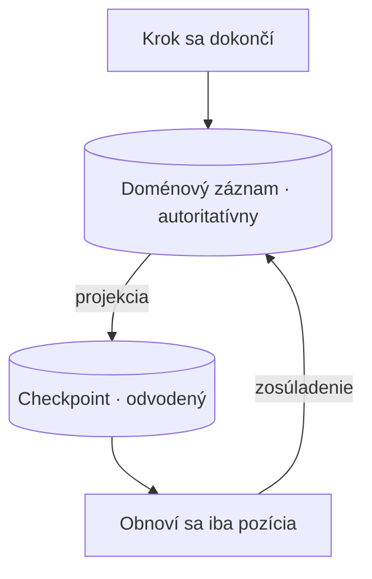

# Kto vlastní stav behu

Stránka [Grafy a odolné vykonávanie](../orchestration-frameworks/deep-dive.md) ti zanechá úhľadný obraz. Všetko sa napája na graf: checkpointer (komponent, ktorý ukladá stav) je naň pripojený a na každom super-stepe stav uloží, takže beh, ktorý zlyhá v kroku 28, sa obnoví od kroku 28 a nemusí znova platiť za 27 volaní modelu. Každá z tých viet platí. Stránka sa však zastaví práve pred otázkou, ktorá rozhoduje o bezpečnosti celého riešenia v tvojom systéme: **čo ak stav behu už vlastní niečo iné?**

Zvyčajne ho totiž niečo vlastní. V notebooku ani v ukážke, ktorou si overil funkčnosť agenta, to neuvidíš. V skutočnom systéme však niekde existuje tabuľka, z ktorej si externá strana neskôr vyžiada údaje. Môže to byť účtovná kniha, spis alebo evidencia, na ktorú sa vzťahuje povinnosť uchovávania záznamov. Existovala pred agentom a pretrvá aj po skončení životnosti frameworku. Keď vedľa nej nasadíš checkpointer, vzniknú dve úložiská a každé si vedie vlastný záznam o tom, čo sa stalo.

Táto lekcia rozoberá tento konflikt a rozhodnutia, ktoré z neho vyplývajú. Musíš určiť, ktoré úložisko je autoritatívne, akým smerom prúdi stav, čo má obnovený beh skontrolovať pred ďalšou činnosťou a koľko ťa bude stáť vlastná alternatíva. V [druhej časti](./deep-dive.md) nájdeš vysvetlenie, ako sa odvodí kľúč bezpečný pri replay (opakovanom prehratí behu z histórie) a čo sa stane, keď dve paralelné vetvy zapíšu do toho istého kľúča stavu. Táto stránka je o rozhodnutí.

Celou lekciou nás sprevádza zámerne všeobecný príklad. Jedna **dávka** obsahuje približne **12 000 jednotiek**, napríklad dokumentov, žiadostí či podaní podľa toho, čo tvoja doména spracúva hromadne. Beh jednej jednotky stojí na volaniach modelu zhruba **2 centy**, takže celá dávka vyjde asi na **$240**. Približne **jedna jednotka zo štyridsiatich** sa po niekoľkých mesiacoch znova otvorí, keď príde oprava. Záznam sa musí dať predložiť počas **pätnástich mesiacov**. Jediný inžinier, ktorý kedy ladil aktuálny plánovač, navyše odchádza o **šesť týždňov**. Každá nasledujúca sekcia rieši jedno rozhodnutie vynútené týmto scenárom.

## Prečo musí checkpointer vlastniť stav?

Keď dokumentáciu o perzistencii vo frameworku čítaš ako tvrdenie, nie ako zoznam funkcií, vyznieva inak. Checkpointer nesľubuje, že si za teba niečo zapamätá. Tvrdí, že **stav behu** musí byť uložený práve v ňom. Presne to znamená „obnoviť beh od posledného úspešného kroku“ a inak sa tento prísľub nedá splniť. Aby framework vedel, odkiaľ má pokračovať, musí sám evidovať, čo sa už dokončilo.

V systéme budovanom na zelenej lúke môžeš toto tvrdenie bez obáv prijať. Činnosť agenta neeviduje žiadny iný systém, preto ju zaznamenáva checkpointer a odolnosť z toho prirodzene vyplýva. Problém nastane, keď už systém vlastné záznamy má.

Teraz agenta na spracovanie dávok nasaď do reálneho systému. Každá spracovaná jednotka sa uloží do tabuľky záznamov, ktorá existovala celé roky pred agentom. Regulátor sa môže po pätnástich mesiacoch opýtať, čo sa stalo s jednotkou 7 431, a odpoveď musí pochádzať zo spoľahlivého zdroja. Ak odpovieš „vie to checkpointer“, interný formát perzistencie frameworku si práve povýšil na dôkazový materiál. Dôsledky takéhoto rozhodnutia sa ukážu v najnevhodnejšej chvíli.

Z tohto rozhodnutia vyplývajú tri konkrétne dôsledky. Ani jeden z nich nie je hypotetický.

Prvým je **archeológia závislostí**. Odpoveď na otázku audítora, čo sme s danou jednotkou urobili a kedy, musí niekto získať zo serializovaného stavu grafu. Jeho schému pritom určuje knižnica, ktorú si nenapísal. Niekto musí spätne zistiť, ktorá verzia frameworku stav zapísala, akú podobu vtedy mal stavový objekt a čo znamenali jednotlivé názvy polí. To nie je audítorská stopa (audit trail). Je to forenzná analýza s pevným termínom odovzdania.

Druhý dôsledok je horší, pretože nastáva bežne. **Migrácia schémy prepisuje dôkazové záznamy.** Formáty checkpointov sú interné, medzi verziami sa menia a knižnice si pri aktualizácii migrujú vlastné úložisko. Z pohľadu knižnice je totiž toto úložisko iba pracovná vyrovnávacia pamäť, takže takéto správanie je úplne správne. Aktualizácia opravnej verzie však môže bez upozornenia upraviť jediný záznam o tom, čo sa stalo. Testy si to nevšimnú, pretože beh sa naďalej úspešne obnoví.

Tretí dôsledok sa dá vyjadriť číslami. Engine uchováva históriu iba počas obmedzeného obdobia, ktoré býva kratšie než povinnosť uchovávania záznamov a nedá sa jej prispôsobiť. [AWS Step Functions](https://docs.aws.amazon.com/step-functions/latest/dg/service-quotas.html) uchováva históriu vykonávania **90 dní**. Žiadosťou o zmenu kvóty môžeš toto obdobie znížiť na 30 dní, no predĺžiť ho nemôžeš. Pri pätnásťmesačnej povinnosti, teda 456 dňoch, pokrýva história enginu iba prvú pätinu záväzku a potom prestane existovať. Túto medzeru neodstráni žiadne nastavenie, pretože nejde o chybnú konfiguráciu. Dodávateľ tým jednoznačne určuje účel daného úložiska.

Z tejto sekcie si odnes jednoduchú tézu. Checkpointer uchováva **prevádzkový stav**, aby bolo možné obnoviť beh. Nie je audítorským záznamom ani **systémom záznamu** (system of record). Ak ho na tento účel použiješ, robíš architektonické rozhodnutie bez ohľadu na to, či si ho uvedomuješ.

## Dve úložiská, jedna autorita

Riešením nie je nedôverovať frameworku. Raz a výslovne rozhodni, ktoré úložisko je **autoritatívne** a ktoré **odvodené**, a toto rozhodnutie vynucuj v kóde, nie v dokumente, ktorý nikto nečíta.

Autoritatívne znamená toto: ak sa údaje nezhodujú, rozhodujú údaje v ňom a druhé úložisko sa podľa neho nanovo zostaví. Odvodené znamená, že ho môžeš vymazať a znova vytvoriť bez straty čohokoľvek hodnotného. Tretia možnosť, pri ktorej sú obe úložiská čiastočne autoritatívne, neexistuje. Chybou nie je framework ani databáza, ale usporiadanie, v ktorom tú istú pravdu zapisujú dva komponenty.

Toto rozdelenie určujú štyri rozhodnutia. Treba ich pomenovať: ak zostanú nevyslovené, každé z nich zlyhá iným spôsobom.

**Zásada jediného zapisovateľa.** Doménový záznam zapisuje presne jeden komponent. Neplatí teda, že ho zapisuje agent a úloha na zosúladenie ho potom opravuje. Len čo povolíš druhú cestu zápisu, pri každej úvahe o konzistentnosti musíš počítať s pretekmi medzi zápismi. Práve pri obnovení behu sa tá druhá cesta objaví, často o tretej ráno.

**Pomenovaný smer projekcie.** Stav prúdi z doménového záznamu do checkpointu, nikdy opačne. Checkpointer uchováva **projekciu** toho, čo už obsahuje doménový záznam, a iba v rozsahu potrebnom na pokračovanie behu. Ak smer výslovne neurčíš, postupne sa stane obojsmerným s každým ďalším poľom pridaným pre pohodlie. Dôsledok spoznáš až vtedy, keď sa údaje rozídu.

**Vlastníctvo schémy a jej migrácií.** Niekto v tvojom tíme zodpovedá za schému doménového záznamu a zámerne riadi jej verzie. Schému checkpointu nevlastní nikto z tímu, pretože patrí knižnici a tá ju môže meniť podľa vlastných potrieb. Práve táto asymetria rozhoduje, ktoré úložisko má uchovávať dôkazy o vykonanej práci. Platí aj po výmene frameworku.

**Zosúladenie pri obnovení behu.** Obnovený beh načíta svoju pozíciu z checkpointu, no ešte pred ďalšou činnosťou z doménového záznamu znova odvodí, čo sa skutočne dokončilo. Checkpoint určuje miesto pokračovania. Doménový záznam určuje už vykonanú prácu. Ak pri druhej otázke dôveruješ checkpointu, beh môže zopakovať prácu, ktorú doménový záznam už eviduje ako dokončenú. Pri cene $240 za dávku nejde o akademický rozdiel.

Kľúčové tvrdenie celej stránky sa dá ľahko prehliadnuť: **toto rozdelenie platí nezávisle od toho, či framework prevezmeš alebo odmietneš**. Rozhodnutie používať framework a rozhodnutie o vlastníkovi doménového záznamu sú dve odlišné veci a ľudia ich neustále zlievajú do jedného. Záver „používame LangGraph, preto je checkpointer naším stavom“ spája dve tvrdenia, hoci odôvodnené bolo iba prvé.

Framework môžeš prijať naplno vrátane grafu, checkpointera, prerušení a celého jeho aparátu, pričom doménový záznam zostane autoritatívny a checkpoint bude odvodenou projekciou. Nie je to kompromis ani polovičné prijatie. Takéto usporiadanie ti poskytne sémantiku obnovenia behu z frameworku aj audítorskú stopu, ktorá pretrvá po jeho výmene. Túto možnosť máš bez ohľadu na výsledok rozhodovania o prijatí frameworku, preto treba vlastníctvo záznamu posudzovať samostatne.

## Pokračovanie pozastaveného behu alebo nový beh?

Pod prvým nedorozumením sa skrýva ešte druhé. Pred výberom technológie ich treba oddeliť, pretože každý z týchto problémov si vyžaduje iné riešenie.

**Pozastavený otvorený beh** rieši **engine odolného vykonávania** (durable execution engine). Aktívny beh sa pozastavil počas spracovania, čaká na schválenie človekom alebo ho prerušilo zlyhanie. Jeho pozícia a pracovný stav zostávajú uložené, aby mohol pokračovať presne tam, kde skončil. Niečo skutočne čaká. Sloveso „obnoviť“ tu opisuje reálnu operáciu a práve tú umožňuje celá infraštruktúra checkpointera.

**Znovuotvorenie uzavretého behu** je úplne iný prípad. Beh sa skončil, záznam sa uložil a prípad sa uzavrel. O tri mesiace neskôr príde oprava. V našej dávke ide práve o tú jednu jednotku zo štyridsiatich: asi 300 jednotiek z každých 12 000 sa vráti dávno po skončení svojho behu.

Nič nečaká. Neexistuje pozastavené vykonávanie, v ktorom by sa dalo pokračovať, ani odložený pracovný stav či pozícia, ku ktorej by sa dalo vrátiť. Máš **uchovaný záznam** a nový dôvod znova s ním pracovať. Správnym riešením je **nový prepojený beh** nad týmto záznamom. Ide o nové vykonanie, ktoré odkazuje na pôvodný beh, načíta uchovaný záznam ako vstup a zapíše vlastný výsledok.

Použiť v tejto situácii checkpoint je chyba, hoci terminológia k tomu zvádza. Oba prípady sa bežne označujú ako „obnovenie prípadu“. Tri mesiace starý checkpoint však zachytáva interný stav frameworku vo verzii grafu, ktorú si odvtedy zmenil, a podľa schémy, ktorú knižnica medzičasom migrovala. Aj keby sa dal načítať, obnovil by beh v podmienkach, ktoré už neplatia.

Záznam je navrhnutý tak, aby sa dal načítať aj po niekoľkých mesiacoch. Checkpoint na tento účel neslúži.

Praktický test tvorí jediná otázka: **čaká niečo?** Ak áno, ide o pozastavenie a mechanizmom je odolnosť. Ak nie, máš záznam a nový dôvod konať. Potrebuješ nový beh so spätným prepojením, ktorý mimochodom nevyžaduje žiadny checkpointer.

## Čo už vyriešili systémy mimo AI?

Všetko uvedené sa posudzuje ľahšie, keď vieš, že nejde o nové problémy. Mimo oblasti AI sú vyriešené už dávno.

„Odolný stav na úrovni jednotlivých krokov s možnosťou pozastaviť a obnoviť beh“ je vyriešená kategória s vlastným názvom. [Temporal](https://docs.temporal.io/evaluate/understanding-temporal) ju označuje ako **odolné vykonávanie** (Durable Execution) a presne na tomto prísľube postavil svoj produkt. AWS [Step Functions](https://docs.aws.amazon.com/step-functions/latest/dg/choosing-workflow-type.html) predstavuje spravovanú podobu rovnakej myšlienky. [Apache Airflow](https://airflow.apache.org/docs/apache-airflow/stable/), [Prefect](https://docs.prefect.io/v3/get-started/index) a [Dagster](https://docs.dagster.io/) riešia tú istú úlohu z pohľadu plánovaných dátových pipeline. Nie sú to nástroje AI ani nevznikli pre agentov, a práve preto sú tu užitočné. Tento problém riešili pri bankových prevodoch a úlohách ETL pod prísnejšou kontrolou, než akej zatiaľ čelia záťaže využívajúce LLM.

Ich terminológiu môžeš použiť okamžite. **Sémantika doručenia** — exactly-once, at-least-once a at-most-once — určuje, čo engine sľubuje o kroku, ktorý sa môže zopakovať. **Determinizmus a replay** určujú, čo musí zaručiť tvoj kód, aby engine vôbec dokázal zrekonštruovať beh. **Kompenzácia** ([compensation](https://docs.aws.amazon.com/prescriptive-guidance/latest/patterns/implement-the-serverless-saga-pattern-by-using-aws-step-functions.html)) pomenúva spôsob, ako vrátiť krok, ktorý sa už vykonal, pretože správny výsledok nemožno vždy dosiahnuť opakovaným pokusom. Každú z týchto otázok môžeš položiť checkpointeru a [druhá časť](./deep-dive.md) ich rozoberá jednu po druhej.

Vďaka tomuto slovníku možno model stavu frameworku **posúdiť** a rozhodnutie nezostáva iba vecou vkusu. Bez porovnania je tvrdenie „checkpointer ukladá stav po každom super-stepe“ len fakt, ktorý môžeš vziať na vedomie.

S porovnaním sa môžeš pýtať na vlastnosti, ktoré rozhodujú o kvalite návrhu. Akú sémantiku doručenia má krok? Čo sa stane pri opakovanom pokuse o krok, ktorý už uspel? Ako dlho sa uchováva história a kto ju uchováva? Čo engine vyžaduje od môjho kódu, aby dokázal beh znova prehrať? Framework pre LLM môže na tieto otázky odpovedať inak než Temporal. Nemôže ich však nechať bez odpovede. Kým nevieš, že táto kategória už má ustálené odpovede, nevieš ani to, že sa na ne máš pýtať.

## Koľko stojí riešenie, ktoré si postavíš?

[Lekcia o orchestračných frameworkoch](../orchestration-frameworks/index.md) poctivo vyčísľuje, čo prijatie stojí: cenu abstrakcie, zmeny v ekosystéme a voľbu medzi prenositeľnosťou a viazanosťou na dodávateľa (vendor lock-in). Nevyčísľuje však náklady na odporúčanú alternatívu. Súčasný výklad opisuje riziká viazanosti iba v jednom smere, hoci ani orchestrátor postavený na mieru nie je zadarmo. Náklady sa iba prejavia neskôr a v inej rozpočtovej položke.

**Záťaž údržby** vidíš najľahšie. Sám si napísal opakované pokusy, odstupňované čakanie medzi nimi (backoff), časové limity, obnovenie behu aj evidenciu dokončených krokov, preto za ne zodpovedáš. Patrí sem aj chyba pri súbežnom spracovaní, ktorá sa pod záťažou objaví raz za štvrťrok a nedokážeš ju reprodukovať. Pri chybách frameworku musíš tiež hľadať obchádzkové riešenia, ale odhaľujú ich aj iní ľudia, opravy financuje niekto iný a záznamy nájdeš vo verejnom registri problémov.

**Náklady na zaškolenie** sa často prehliadajú a vyplývajú z jednoduchej nerovnováhy. Konkrétny framework sa nový inžinier môže naučiť z verejnej dokumentácie, návodu a odpovedí na Stack Overflow, ktoré nájde aj o polnoci. Produktívnym sa tak môže stať bez cudzej pomoci. Plánovač postavený na mieru sa dá naučiť iba od jeho autora. Dokumentáciu nahrádza kód, návod neexistuje a nikde nie sú zodpovedané otázky. Každá otázka preto smeruje k jedinému človeku a jeho kapacita určuje, koľko ľudí dokážeš zaškoliť.

**Bus factor** (koľkí ľudia dokážu systém udržať v chode) spája údržbu so zaškoľovaním. V našom scenári jediný inžinier, ktorý niekedy odstraňoval chyby plánovača, odíde o šesť týždňov. Nejde o neurčitý problém tímovej kultúry, ale o rozhodujúci fakt. O šesť týždňov budú systém určujúci, či sa práca za $240 zopakuje alebo preskočí, udržiavať ľudia, ktorí ho nikdy nevideli zlyhať. To je presvedčivý dôvod prijať verejne zdokumentovaný framework, hoci nemusí byť technicky lepší. Rozhoduje umiestnenie znalostí.

Treba však zvážiť aj opačnú stranu. 300-riadková slučka môže mať vyšší bus factor než graf, ktorý v tíme nikto nikdy nespustil. Ak obyčajný 300-riadkový súbor v Pythone prečítali štyria inžinieri od začiatku do konca, držia ho štyria. Grafový framework, ktorého zlyhania počas skutočného incidentu riešil iba jeden inžinier, drží ho jeden človek. Dokumentácia síce existuje, no jej čítanie počas incidentu nenahradí praktickú skúsenosť. Prijatím frameworku presunieš časť znalostí z vlastnej kódovej základne do verejne dostupných zdrojov, ale tím tým automaticky nezíska dôvernú znalosť systému, akú potrebuješ o tretej ráno.

Vyčísli preto obe možnosti a až potom rozhodni. Pri riešení na mieru nesieš údržbu, zaškoľovanie závisí od jedného človeka a bus factor zodpovedá počtu ľudí, ktorí systém skutočne poznajú. Framework prináša cenu abstrakcie, zmeny, lock-in a krivku učenia, ktorú však nový kolega zvládne bez rezervovania času niekoho iného. V našom scenári rozhoduje odchod o šesť týždňov, a to v prospech frameworku. Je to tak správne. Ak zmeníš jediný fakt — slučku už ovládajú štyria inžinieri a nikto v tíme nemá skúsenosť s frameworkom — presne rovnaké uvažovanie preklopí rozhodnutie na druhú stranu.

## Čo si odniesť z lekcie

- **Checkpointer a vlastníctvo stavu.** Checkpointer predstavuje nárok na vlastníctvo stavu behu, nie neutrálnu funkciu. Obnovenie od posledného úspešného kroku funguje iba vtedy, keď framework vie, čo sa dokončilo. Ak stav behu ešte nevlastní iný systém, môžeš tento nárok zveriť frameworku. Ak ho už vlastní doménový záznam, rozhodnutie si dôkladne premysli.
- **Autoritatívny a odvodený stav.** Raz a výslovne urči, ktoré úložisko je autoritatívnym systémom záznamu a ktoré je odvodené. Toto rozdelenie dodržiavaj pomocou štyroch rozhodnutí: zásady jediného zapisovateľa, pomenovaného smeru projekcie, jasne určeného vlastníka schémy a jej migrácií a zosúladenia pri obnovení behu. Ak tú istú pravdu zapisujú dva komponenty, návrh je chybný.
- **Nezávislosť od prijatia frameworku.** Rozdelenie vlastníctva stavu nezávisí od toho, či framework prijmeš alebo odmietneš. Framework môžeš prijať v plnom rozsahu a doménový záznam si ponechať ako autoritatívny, pričom checkpoint zostane odvodenou projekciou. Spojenie oboch rozhodnutí do jedného vedie k tomu, že tím používa interný formát knižnice ako audítorskú stopu.
- **Pozastavenie verzus opätovné otvorenie.** Pozastavenie otvoreného behu nie je opätovným otvorením uzavretého behu. Odolnosť rieši iba prvý prípad. V druhom prípade treba spustiť nový prepojený beh nad uchovaným záznamom, pretože nič nečaká na obnovenie. Rozhodujúce je, či niečo skutočne čaká.
- **Odolné vykonávanie mimo AI.** Mimo AI už existujú ustálené riešenia odolného vykonávania vrátane [Temporal](https://docs.temporal.io/evaluate/understanding-temporal), AWS Step Functions, Apache Airflow a príbuzných systémov. Sémantika doručenia, determinizmus a replay a kompenzácia poskytujú konkrétne kritériá na posúdenie checkpointera, takže rozhodnutie nezávisí iba od osobných preferencií.
- **Cena orchestrátora postaveného na mieru.** Započítaj záťaž údržby, ktorú nesie tvoj tím, náklady na zaškolenie závislé od jedného autora aj bus factor určený počtom ľudí, ktorí orchestrátor skutočne poznajú. Proti tomu stojí protiváha: 300-riadková slučka, ktorú prečítali štyria ľudia, je na tom lepšie než graf, ktorý niekedy ladil presne jeden človek.

**[Nové pojmy](../../glossary.md#durable-runs)**: systém záznamu, autoritatívny verzus odvodený stav, zásada jediného zapisovateľa, smer projekcie, zosúladenie pri obnovení behu, nový prepojený beh, engine odolného vykonávania, sémantika doručenia, bus factor.

---

:::note[Ďalej — druhá časť lekcie]

**[Systémy: kľúče, zlúčenia, záruky](./deep-dive.md)** — odvodenie kľúča idempotencie z identity behu a kroku, aby replay nezaplatil znova za dokončenú prácu, čo sa stane, keď sa identita kroku medzi behmi zmení, fan-out vnútri jedného grafu a zlúčenie stavu, ktoré musíš určiť sám, a napokon sémantika doručenia, determinizmus a verzovanie, na ktorých sa enginy odolného vykonávania zhodli.

Pozri aj: checkpointer, thready a režimy `durability`, na ktorých táto stránka stavia — [orchestračné frameworky, druhá časť](../orchestration-frameworks/deep-dive.md); idempotencia ako vlastnosť nástroja — [používanie nástrojov, druhá časť](../tool-use/deep-dive.md); ako perzistenciu a obnovenie riešia agentové runtimy samotných dodávateľov — [záverečná stránka časti](../real-agents.md).

:::
