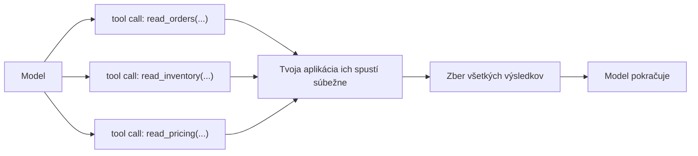
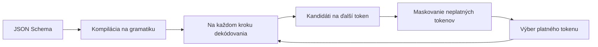

# Paralelné volania, obmedzené dekódovanie, opakovania a cena veľkej sady nástrojov

[Časť 1](./index.md) vysvetlila samotný mechanizmus: definícia nástroja (tool definition) → volanie nástroja (tool call) → výsledok nástroja (tool result) → pokračuj. Táto stránka ho rozoberie do posledného detailu: čo sa deje, keď model vytvorí viac volaní naraz; ako sa schéma vynucuje token po tokene; ako sa slučka po chybnom volaní zotaví namiesto toho, aby sa zrútila; a čo sa pokazí, keď sada nástrojov narastie na desiatky. Všetko z prvej časti tu berieme ako známe. Slučku, bezpečnostnú hranicu, zásadu „definícia nástroja je prompt“ ani zoznam znakov dobrého nástroja nevysvetľujeme znova — iba na ne nadväzujeme.

## Keď model vytvorí viac volaní naraz

Jeden krok neznamená jedno volanie. Model dokáže v jednej odpovedi vytvoriť niekoľko *nezávislých* volaní — **paralelné volania nástrojov** (parallel tool calls): tri čítania z databázy, dva dopyty cez API — namiesto toho, aby ich posielal po jednom v samostatných krokoch.

Tvoja aplikácia ich rozošle (fan-out) a spustí súbežne; potom všetky výsledky pozbiera (fan-in) a odovzdá ich modelu naraz — až potom slučka pokračuje. Tomu sa hovorí **fan-out / fan-in**: jeden krok sa rozvetví na N paralelných volaní a N výsledkov sa spojí do jednej správy.

Rozhodujúce je slovo *nezávislé*. Volania má zmysel púšťať paralelne iba vtedy, keď žiadne nepotrebuje výsledok iného a vedľajší účinok (side effect) žiadneho z nich nemení to, čo vidia ostatné. Model túto nezávislosť predpokladá už vo chvíli, keď sa rozhodne volania zoskupiť — a tvoja aplikácia ju nijako neoveruje. Nič nekontroluje, či si volania naozaj neprekážajú; ak si prekážajú, nedostaneš chybovú správu, ale **race condition** (súbehovú chybu): dve súbežné volania siahnu na to isté a výsledok závisí od náhodného časovania.

Prepínače tohto správania sa líšia podľa poskytovateľa a na presných názvoch záleží.

**Anthropic Claude** volania zoskupuje už v predvolenom nastavení — modely Claude 4 vytvoria paralelné volania vždy, keď sa to pri požiadavke oplatí. Vypneš to príznakom `disable_parallel_tool_use: true` — a všimni si, kam patrí: dovnútra objektu `tool_choice`, nie medzi parametre požiadavky na najvyššej úrovni. Pri `tool_choice` typu `auto` potom model zavolá v jednej odpovedi nanajvýš jeden nástroj; pri type `any` alebo `tool` práve jeden.

**OpenAI** ponúka parameter `parallel_tool_calls`; v predvolenom stave dovoľuje viac volaní v jednom kroku, hodnotou `false` obmedzíš model na najviac jedno volanie.

**Gemini** podporuje **parallel function calling** — viac nezávislých funkcií v jednom kroku — a popri ňom zámerne odlišuje **compositional function calling**: zreťazené, závislé volania, ktoré nasledujú za sebou, pričom výstup jedného je vstupom pre ďalšie: `get_current_location()`, potom `get_weather(location)`. Prvé je skupina, druhé reťaz závislostí — a práve v ich rozlíšení je jadro tejto sekcie.

Zbieranie výsledkov sa riadi pevnými pravidlami. V prípade Anthropicu: za každý blok `tool_use` vrátiš jeden `tool_result` — všetky spolu v nasledujúcej používateľskej správe, každý spárovaný so svojím volaním cez `tool_use_id`, a všetky stoja pred akýmkoľvek textom v tej správe. Ak si sa rozhodol volanie nespustiť — povedzme, že si skupinu vykonal postupne a niektoré skoršie volanie skončilo chybou — aj tak zaň vrátiš `tool_result` s `is_error: true` a krátkym dôvodom, namiesto toho, aby si ho ticho zahodil. Gemini funguje v rovnakom duchu: každá odpoveď sa priradí k svojmu volaniu cez `id` a vrátiť musíš všetky.

Neparalelizuj **závislé volania** — také, kde jedno potrebuje výsledok predchádzajúceho. To je compositional function calling — reťaz postupných volaní: spúšťaj ich jedno po druhom. Zoskupiť ich je jednoducho chyba, lebo druhé volanie potrebuje argument, ktorý ešte neexistuje.

Neparalelizuj naslepo ani **zápisy s vedľajším účinkom** (side-effectful writes). Súbežné zápisy do zdieľaného stavu si navzájom prekážajú a poradie v rámci skupiny nie je definované — nevieš povedať, ktorý zápis sa vykonal prvý. Pri zapisovacích nástrojoch buď vypni paralelné volania (`disable_parallel_tool_use` / `parallel_tool_calls: false`), alebo ich vykonávaj postupne vo vlastnom kóde. K tomu sa vrátime pri idempotencii (idempotency).

Keď model opakovane zoskupuje volania, ktoré by zoskupovať nemal, oprav to priamo v systémovom prompte — presne tento postup uvádza aj dokumentácia: „Only batch tool calls that are independent of each other.“ (v preklade: zoskupuj len volania, ktoré sú navzájom nezávislé). Model volania zoskupuje na základe predpokladu a práve v systémovom prompte ten predpoklad opravíš.

## Ako sa schéma naozaj vynucuje

Argumenty nástroja opisuje **schéma** (schema) — zvyčajne JSON Schema (Gemini používa schému z podmnožiny OpenAPI). Zatiaľ sme s ňou zaobchádzali ako s typovaným formulárom, ktorý model vypĺňa. Je to však viac než dokumentácia: v **prísnom režime** (strict mode) sa schéma *vynucuje* a model nedokáže vygenerovať argumenty, ktoré ju porušujú.

Mechanizmom je **obmedzené dekódovanie** (constrained decoding). Poskytovateľ tvoju schému skompiluje na **gramatiku** — formálnu gramatiku, vo všeobecnom prípade bezkontextovú. Na každom kroku dekódovania potom vzorkovač zamaskuje každý token, ktorý by pri doterajšom výstupe gramatiku porušil, a vyberá už len spomedzi tokenov, ktoré ostali povolené. Zatváracia zložená zátvorka tam, kde gramatika žiada číslicu, sa medzi ďalšími možnými tokenmi vôbec neobjaví. Výstup zodpovedá schéme *už svojou konštrukciou* — nie preto, že sa model snažil a mal šťastie, ani preto, že si ho dodatočne overil a neplatné výstupy zahodil.

V praxi to vyzerá takto:

- **OpenAI**: `strict: true` vnútri definície funkcie prinúti volania schému spoľahlivo dodržiavať, nie iba „ako to práve vyjde“. Interne to zabezpečujú **Structured Outputs**, ktoré používajú obmedzené dekódovanie. Podmienky sú dve: `additionalProperties: false` na každom objekte a každá vlastnosť uvedená v `required`.
- **Anthropic Claude**: nástroje v prísnom režime zapneš cez `tool_choice` so `strict: true`.
- **Gemini**: argumenty musia zodpovedať schéme z podmnožiny OpenAPI uvedenej v deklarácii funkcie.

Obmedzené dekódovanie nie je zadarmo. Má svoju cenu aj obmedzenia — a niekedy je lepšie ho vynechať:

- **Cena kompilácie pri prvom volaní.** Prvá požiadavka s *novou* schémou je pomalšia: poskytovateľ z nej najprv zostaví gramatiku a pripraví ju na vzorkovanie. Ďalšie požiadavky s tou istou schémou už nájdu hotový výsledok v cache (vyrovnávacej pamäti) a bežia rýchlo — OpenAI dokumentuje presne toto: schéma sa na gramatiku skompiluje, keď ju systém uvidí prvýkrát, potom sa berie z cache. Praktický dôsledok: ak schému pri každom volaní generuješ nanovo, cache ti nikdy nepomôže a spomalenie prvej požiadavky platíš pri každej jednej.
- **Nepodporované konštrukcie schémy.** Prísny režim pokrýva len podmnožinu JSON Schema a povinné `additionalProperties: false` spolu s pravidlom „všetko `required`“ znamenajú, že niektoré konštrukcie schémy nepoužiješ vôbec a iné musíš preformulovať, aby sa do podporovanej podmnožiny zmestili.
- **Paralelizmus — fakt, ktorý sa môže časom zmeniť.** Paralelné volania funkcií s prísnym režimom na OpenAI pôvodne nefungovali — kto chcel prísny režim, musel nastaviť `parallel_tool_calls: false`. Neskôr to OpenAI opravilo a paralelné volania dnes s prísnym režimom fungujú.

Ujasni si, čo presne ti obmedzené dekódovanie zaručuje: dostaneš *správne sformované, podľa schémy platné* argumenty — JSON sa naparsuje, typy sedia, enumy sú dodržané. Nezaručí ti, že argumenty sú *správne*, ani že model siahol po *správnom* nástroji. Štruktúra nie je sémantika — a práve tejto medzere sa venuje celá sekcia o validácii nižšie.

## Keď volanie zlyhá — a ako sa slučka zotaví

Volanie nástroja môže zlyhať viacerými spôsobmi a hádzať ich do jedného vreca je prvá chyba: zotavenie, ktoré jeden druh chyby napraví, iný druh zhorší. Taxonómia:

- **Chybne sformované argumenty** — argumenty sa nenaparsujú alebo porušujú schému. Obmedzené dekódovanie im z veľkej časti zabráni, ale len pri nástrojoch v prísnom režime; nástroj bez prísneho režimu môže stále dostať nezmysel.
- **Chyba validácie** — argumenty sú správne sformované, no neprejdú tvojimi kontrolami: hodnota mimo rozsahu, neznáme id (viac v sekcii o validácii nižšie).
- **Výnimka nástroja** — nástroj sa spustil a spadol: `500` z nadväzujúcej služby, zlý dopyt.
- **Vypršanie časového limitu (timeout)** — nástroj neodpovedal v stanovenom čase.
- **Prázdny alebo nejednoznačný výsledok** — nástroj nevrátil nič užitočné, alebo vrátil niečo, čo si model môže zle vyložiť. To je práve riziko domýšľania, ktoré pomenovala prvá časť — model sebavedomo nadväzuje na nejasný alebo prázdny výsledok. Patrí do zoznamu, hoci technicky nič nezlyhalo.

Najdôležitejší postup pri zlyhanom volaní už poznáš. Prvá časť nazvala definíciu nástroja promptom; o chybe platí to isté. **Chyba ako prompt**: chybu vrátiš modelu ako správu, ktorú vie prečítať a podľa ktorej vie konať — **zotaviteľnú chybu** (recoverable error) formulovanú ako návod („dátum musí byť `YYYY-MM-DD`“; „neznáme `user_id`, najprv zavolaj `list_users`“), nie nečitateľný výpis zásobníka volaní a nie holý nenulový návratový kód. Slučka sa potom opraví sama: chybné volanie → zrozumiteľná chyba → preformulovanie → opakovanie. V API Anthropicu je to `tool_result` s `is_error: true` a správou, ktorá modelu povie, čo opraviť; model v ďalšom kroku odošle opravené volanie.

Nie každú chybu spôsobí model; tie ostatné sa riešia inak. Pri **prechodných chybách** — timeout, rate limit (strop na počet požiadaviek), `5xx` z nadväzujúcej služby — opakuj volanie, ale s **backoffom** (postupné predlžovanie intervalu medzi pokusmi): pokusy rozlož v čase, zvyčajne exponenciálne. Okamžité opakovanie bez odstupu iba pridáva záťaž službe, ktorá má už aj tak problémy, a z krátkeho výkyvu spraví výpadok.

Počet pokusov zároveň zhora obmedz. **Limit opakovaní** (retry budget) — tvrdý strop na počet pokusov, na jedno volanie aj na celý beh — je obdobou rozpočtu krokov a rozpočtu tokenov z lekcie o plánovaní. Bez stropu sa volanie, ktoré zlyháva deterministicky, zvrhne na **nezastaviteľnú slučku opakovaní**: agent donekonečna odosiela to isté volanie odsúdené na neúspech a nikdy neskončí.

Opakovať sa oplatí len vtedy, keď sa medzitým niečo zmenilo — model opravil argument alebo prechodná porucha pominula. Ak identické volanie zopakuješ po deterministickej chybe, zlyhá presne rovnako; spotreboval si pokusy aj peniaze a nedozvedel si sa nič nové. Keď opakovanie nič nemení, zastav sa: chybu ohlás, odovzdaj ju človeku alebo skús iný nástroj. A pomenuj to správne — slučka, ktorá sa nezastaví, je **chyba počas behu** (runtime error), nikdy nie „odmietnutie“ zo strany modelu.

V dvoch prípadoch volanie neopakuj: po deterministickej chybe bez zmeny vstupu — nič sa nezmenilo, takže sa nezmení ani výsledok; a pri zápise s vedľajším účinkom, ktorý mohol čiastočne prebehnúť a nemá záruku idempotencie — opakovanie by tú istú operáciu mohlo vykonať druhý raz. Opakovania sú na prechodné poruchy a na argumenty, ktoré model opravil; nie sú náhradou za opravu volania. Ako to vyzerá pri zápisoch, rozoberá sekcia o idempotencii nižšie.

## Kontextová cena desiatok nástrojov

Každá definícia nástroja zaberá tokeny v každej požiadavke: názov, opis a celá schéma parametrov každého nástroja sa do promptu serializujú pri každom volaní, či sa použijú, alebo nie. Tucet nástrojov je **stála daň** — tokeny, latencia, peniaze — a platíš ju bez ohľadu na to, či model niektorý z nástrojov vôbec použije. Presne túto cenu mala prvá časť na mysli, keď žiadala „málo nástrojov, bez prekryvov“.

Daň nie je len finančná. **Výber nástroja** (tool selection) sa s rastúcou sadou zhoršuje: pri mnohých významovo blízkych nástrojoch model častejšie siahne po nesprávnom alebo nezavolá nijaký, hoci mal — presne zlyhania typu „nesprávny nástroj — alebo žiadny“, na ktoré upozornila prvá časť. Čím väčšia a plochšia (neštruktúrovaná) sada, tým horšie agent vyberá.

Pri veľkej sade je riešenie jedno: prestať posielať všetky nástroje pri každej požiadavke. **Dynamic tool loadout** (dynamicky vybraná sada nástrojov) — hovorí sa mu aj **tool-RAG** — vyhľadá k aktuálnemu dopytu len relevantné nástroje a do požiadavky načíta práve tie. Je to RAG uplatnený na nástroje namiesto dokumentov: nad katalógom nástrojov beží krok vyhľadávania, ktorý pred každým krokom slučky vyberie malú sadu zodpovedajúcu aktuálnej úlohe.

**Menné priestory (namespacing)** riešia ten istý problém z druhej strany. Daj nástrojom štruktúrované názvy a zoskup ich — podľa domény, podľa servera, z ktorého nástroje pochádzajú — aby s nimi vedeli pracovať aj model, aj tvoj krok vyhľadávania; pri veľkom katalógu tak ubudne kolízií názvov aj prekryvov.

Od určitého počtu nástrojov už dlhší zoznam nepomôže. Keď jeden agent pracuje s desiatkami nástrojov, rozdeľ prácu medzi **špecializovaných agentov**, každého s malou, ortogonálnou sadou nástrojov — to je argument špecializácie z [lekcie o multiagentových systémoch](../multi-agent/). Zoznam nástrojov, ktorý stále rastie, je sám osebe signál, že jeden agent už nestačí.

Pozor však aj na opačný extrém: po tool-RAG nesiahaj predčasne. Pri hrstke nástrojov je to zbytočná zložitosť s vlastným rizikom zlyhania — pribudne krok vyhľadávania, ktorý sa môže pomýliť, a nástroj, ktorý model potreboval, sa do požiadavky vôbec nedostane. Kým katalóg nie je naozaj veľký, úplne stačí plná statická sada; dynamický výber sa oplatí až potom. Tá istá disciplína ako v celej Časti II príručky: zvoľ najjednoduchšie riešenie, ktoré na úlohu stačí.

## Idempotencia a zápisy s trvalým následkom

To, či je bezpečné volanie zopakovať, neurčuje tvoja politika opakovaní — určuje to sám *nástroj*. Čítacie a zapisovacie nástroje sa pri opakovaní správajú rozdielne: zopakovať čítanie ťa nestojí nič okrem latencie; zopakovať zápis — vytvoriť objednávku, odoslať e-mail, strhnúť peniaze z karty — môže vedľajší účinok zdvojiť. O bezpečnosti opakovania rozhoduje to, čo nástroj robí, nie to, ako opakuješ.

Potrebná vlastnosť je **idempotencia** (idempotency): zápis spustený dvakrát s rovnakým vstupom má rovnaký účinok, ako keby bežal raz. Štandardný mechanizmus je **kľúč idempotencie** (idempotency key): volajúci pripojí ku každej zamýšľanej operácii jedinečný kľúč a server operáciu s už videným kľúčom druhý raz nevykoná. S kľúčom je bezpečné opakovať aj po vypršaní limitu, pri ktorom nevieš, či prvý pokus prešiel: ak naozaj prešiel, druhý pokus nič nespraví.

Zápisy, ktoré sú nebezpečné alebo nevratné, rozdeľ na dva kroky. **Dry-run** (skúšobné spustenie) vypočíta a ukáže, čo *by sa* stalo, bez akéhokoľvek účinku; **krok potvrdenia** (confirm) to potom naozaj vykoná — a práve pri potvrdení zvyčajne akciu schvaľuje človek (human-in-the-loop). Je to least privilege (princíp najmenších oprávnení) z prvej časti aj jej pravidlo „pri nebezpečných akciách vyžaduj potvrdenie“ — len zapísané ako dve volania namiesto jedného.

Toto oddelenie zabuduj priamo do sady nástrojov, ako to zdôvodnila prvá časť: čítacie a zapisovacie nástroje drž oddelené, aby si agentovi mohol dať široký prístup na čítanie, zatiaľ čo každý zápis prechádza samostatnou kontrolou. Least privilege prestane byť iba frázou vo chvíli, keď nástroje rozdelíš presne na hranici, ktorú chceš strážiť.

Tu sa vraciame k paralelizmu zo začiatku stránky. Skupina fan-out nemá definované poradie: medzi dvoma zápismi v tej istej skupine môže vzniknúť race condition, alebo sa zápisy vykonajú v inom poradí, než čakáš. Zápisy, ktoré závisia od poradia alebo si navzájom prekážajú, nikdy nedávaj do jednej paralelnej skupiny — vykonávaj ich postupne, alebo pri zapisovacích nástrojoch paralelné volania vypni. Pri čítaniach bol paralelizmus výhodou; pri zápisoch je pascou.

Pre zápisy platí ešte jedno pravidlo: nespoliehaj sa na opakovania pri zapisovacom nástroji, ktorý nie je idempotentný a nemá kľúč. Ak volanie v skutočnosti prešlo a iba vypršal časový limit, opakovanie vykoná operáciu druhý raz — druhé strhnutie z karty, druhý e-mail. Najprv vyrieš idempotenciu, až potom povoľ opakovania; naopak to nefunguje.

## Validácia argumentov predtým, než konáš

Obmedzené dekódovanie ti dá správne sformované argumenty — nie *prijateľné*. Medzi okamihom, keď model argumenty vygeneruje, a okamihom, keď nástroj spustíš, je krátke okno — a práve doň patrí **validácia argumentov** (argument validation): skôr než sa spustí akýkoľvek vedľajší účinok, argumenty skontroluj. Kontrola má dve úrovne a každá zachytáva iné chyby.

- **Validácia na úrovni schémy** — typy, povinné polia, enumy, formáty. Obmedzené dekódovanie to pri generovaní z veľkej časti pokryje, no argumenty validuj aj tak: kvôli nástrojom bez prísneho režimu a ako ďalšiu vrstvu ochrany.
- **Sémantická validácia** — argumenty sú správne typované, a v danom kontexte aj tak nesprávne: id, ktoré neexistuje, dátum v minulosti, suma nad limitom, cesta mimo povoleného koreňového adresára. Väčšinu z toho schéma vyjadriť nevie; musí to spraviť tvoj kód. Presne na túto medzeru upozornila sekcia o schéme — štruktúra prejde, sémantika nie.

Keď validácia argument odmietne, vráť modelu zrozumiteľnú správu, podľa ktorej vie konať — opäť chyba ako prompt, rovnako ako keby zlyhalo samotné vykonanie. Model argument opraví a volanie zopakuje. Je to tá istá samoopravná slučka, len chybu zachytí ešte pred spustením nástroja, nie až po ňom.

Hranica medzi oboma úrovňami je teda jasná. Netlač sémantické kontroly do schémy — väčšina sa v nej vyjadriť nedá. A validáciu nevynechávaj len preto, že beží obmedzené dekódovanie: to zaručí správne sformované argumenty, nikdy nie správne. Obe úrovne sa dopĺňajú a ani jedna nezastúpi druhú.

## Čo si odniesť z lekcie

- V jednom kroku model vytvorí viac nezávislých volaní; tvoja aplikácia ich spustí súbežne a výsledky pozbiera naraz. Platí to len vtedy, keď volania jedno od druhého naozaj nezávisia a navzájom si neprekážajú — a nestráži to nikto okrem teba.
- Prísny režim (strict mode) vynucuje schému cez obmedzené dekódovanie: schéma sa skompiluje na gramatiku a vzorkovač zamaskuje každý token, ktorý by ju porušil. Zaručuje správne sformované argumenty, nie správne — a prvé volanie s novou schémou je pomalšie, kým sa hotová gramatika neuloží do cache.
- Zlyhané volanie sa zotaví, keď chybu vrátiš ako prompt — čitateľnú správu, podľa ktorej sa model dokáže opraviť. Pri prechodných poruchách opakuj volanie s backoffom a s tvrdým limitom opakovaní; opakovať volanie po deterministickej chybe bez zmeny vstupu je nekonečná slučka, nie zotavenie.
- Každá definícia nástroja zaberá tokeny v každej požiadavke a presnosť výberu s rastúcou sadou klesá. Na dynamický výber nástrojov (tool-RAG) prejdi, až keď je katalóg naozaj veľký — a keď ani to nestačí, rozdeľ prácu medzi špecializovaných agentov namiesto toho, aby si jedného stále rozširoval.
- Čítanie je bezpečné opakovať; zápis iba vtedy, keď je idempotentný — daj zapisovacím nástrojom kľúč idempotencie, nebezpečné zápisy rozdeľ na dry-run a potvrdenie a dva zápisy nikdy nedávaj do tej istej paralelnej skupiny.
- Validuj argumenty pred vykonaním, na dvoch úrovniach: schémou skontroluj tvar, sémantickou kontrolou význam. Obmedzené dekódovanie pokryje prvú, druhú musí pokryť tvoj kód; a chybu validácie vráť modelu rovnako ako chybu pri vykonaní.

**Nové pojmy** → [Glosár](../../glossary.md): parallel tool calls, constrained decoding, strict mode / Structured Outputs, idempotency / idempotency key, tool-RAG / dynamic tool loadout, argument validation, retry budget.
